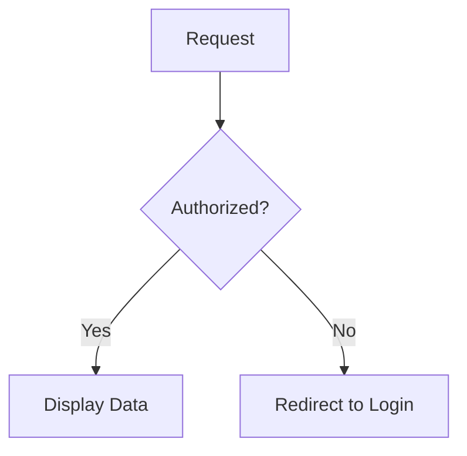

# Markdown Cheatsheet for Zenn & Qiita (Pro Edition)

## 📊 Visualizing with Mermaid (Zenn Only)
フローチャートやシーケンス図をテキストで記述できます。

```markdown

```

## 🔢 Math Expressions (KaTeX)
数式を美しく表示します。

```markdown
$$
e^{i\pi} + 1 = 0
$$

インライン表示: $a^2 + b^2 = c^2$
```

## 📦 Zenn Specific Advanced Syntax

### Content Embeds (YouTube, GitHub, etc.)
URLを1行で記述するだけでリッチに表示されます。

```markdown
@[youtube](videoId)
@[github](https://github.com/user/repo)
@[tweet](https://twitter.com/user/status/123)
```

### Footnotes
補足説明に。
```markdown
この記事は最高です[^1]。

[^1]: 著者の主観です。
```

## 📝 Qiita Specific Nuances

### Diff Blocks
変更箇所をわかりやすく示します。

```markdown
```diff:page.tsx
  const hello = () => {
-   console.log("Old");
+   console.log("New");
  }
```
```

## 💡 Professional Tips
- **Empty Lines**: 見出し（##）の前後には必ず空行を1つ入れましょう。レンダリングエラーを防ぎ、読みやすくなります。
- **Comments**: 非公開のメモを記事内に残せます。
    - `<!-- この部分は後で修正する -->`
- **Tables with Alignment**:
    ```markdown
    | 左寄せ | 中央 | 右寄せ |
    | :--- | :---: | ---: |
    | Text | Text | Text |
    ```
