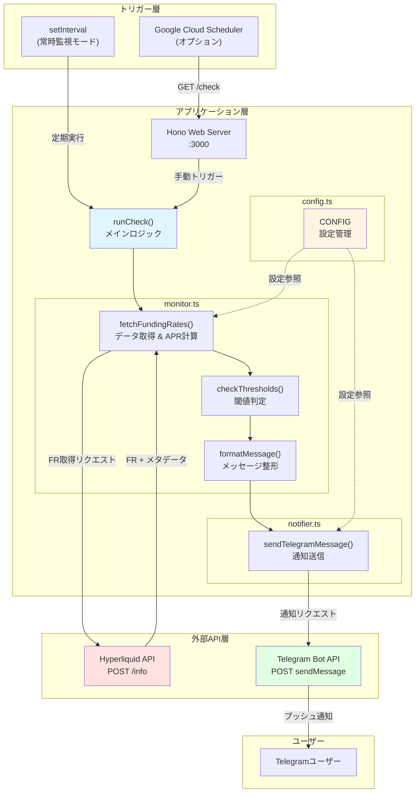
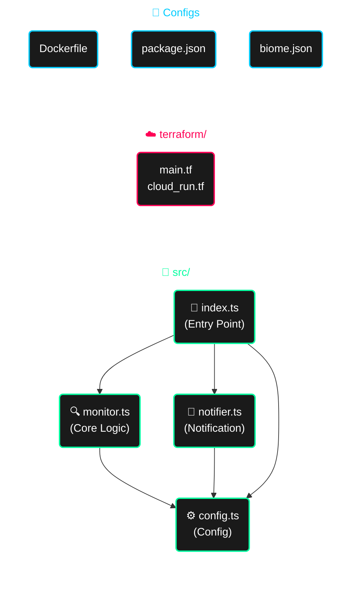
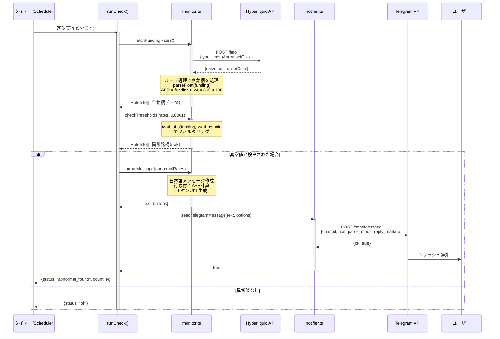
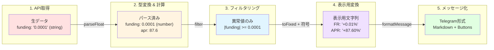
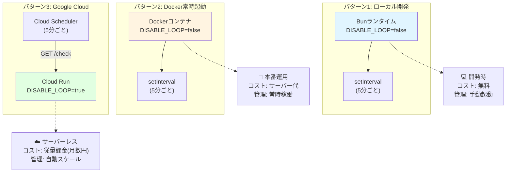

## この記事で分かること

- **Bun + Honoでの開発体験** - 実際に使って感じた良い点と注意点
- **328行でBot実装** - シンプルに保つための設計の工夫
- **Terraformでインフラ管理** - GCP Cloud Runへの自動デプロイ
- **月額0円運用** - 無料枠内で動かすコツ
- **図解7つ** - アーキテクチャや処理フローを可視化

:::message
想定読者: 
- TypeScript経験者で、モダンなスタックやサーバーレス運用に興味がある方
- VibeCodingに興味のある方
- Antigravityに興味のある方
- 暗号資産botに興味のある方
:::

## はじめに

**「328行のコードで暗号資産のBotって作れるの?」**

そう思われるかもしれませんが、実際に動いているコードがあります。

今回作ったのは、**Hyperliquid**取引所のFunding Rate(FR)を監視して、異常値を検知したらTelegramに通知するBotです！

https://hyperliquid.gitbook.io/hyperliquid-docs/for-developers/api

> スクショ


> ソースコード

https://github.com/mashharuki/simple_bot

仮想通貨botterアドカレを読んで触発されて作ってみました。

https://qiita.com/advent-calendar/2025/botter

これだけだとちょっと怪しいですがゴリゴリにテッキーな内容になっていますのでご安心ください！

### 技術スタック

- **ランタイム:** Bun 1.0+
- **Webフレームワーク:** Hono
- **インフラ:** Google Cloud Run + Terraform + Docker
- **コード品質:** Biome

## どうやってこのBotを作ったのか

この方のブログを参考にGoogleの**Antigravity**を使って作ってみました！

https://note.com/makaneko_ai/n/n09000b8ff097

最初に渡したプロンプトは以下の通りです！！

```markdown
暗号資産の通知botを作りたいと思っています。

具体的にはHyperliquidのFRを監視して、異常値を超えた銘柄があったらTelegramに通知を飛ばしたいです。

まず仕様書を作るにあたって、必要な情報を私に質問してください。いきなり実装を始めずSpec駆動開発とt-wadaさんのテスト駆動開発の考え方を参考にして設計・実装を進めてください。

パッケージマネージャーは、bunを使用してください。
言語は、TypeScriptを使用してください。
フォーマッターにはbiomeを使ってください。
フレームワークには、honoを使ってください。

基本的には設定などについてはおすすめを提案をしてください。専門用語については、必ず簡単な説明を加えてください。

Hyperliquidのドキュメントを参照してください。
https://hyperliquid.gitbook.io/hyperliquid-docs/for-developers/api
```

## なぜこのBotを作ったのか

### Funding Rateについて

**Funding Rate(資金調達率)** は、無期限先物取引で市場の需給バランスを調整するための手数料です。

| 状態 | 意味 | 手数料の方向 |
|------|------|--------------|
| 大きくプラス | ロング(買い)が多い | ロング保有者がショート保有者に支払う |
| 大きくマイナス | ショート(売り)が多い | ショート保有者がロング保有者に支払う |

つまり、FRの異常値は市場が一方向に偏っているサインなんですね。  
このBotでは、時給±0.01%(年率換算で約87.6%)を超える値を検知して通知します。

100銘柄以上を24時間監視するのは手動では無理なので、5分ごとに自動チェックして異常値だけ教えてくれるようにしました。

## プロジェクト概要

### 何ができるBot?

1. **5分ごと**にHyperliquid APIから全銘柄のFunding Rateを取得
2. 設定した閾値(デフォルト: 時給±0.01%)を超えたら検知
3. **Telegram**に年率換算(APR)と時給を含むリッチなメッセージを送信
4. メッセージには取引ページへの直リンクボタンも付与

### システムアーキテクチャ図

全体のシステム構成を図で示します:



**構成の特徴:**
- 🔄 **2つのトリガーモード**: Cloud SchedulerまたはsetIntervalで実行可能
- 🧩 **モジュラー設計**: 各機能が独立したファイルに分離
- ⚙️ **設定の一元管理**: CONFIGで全体の振る舞いを制御

## プロジェクト構造

わずか328行のコードでどのように構成されているか、ファイル構造を可視化します:



**ファイルの役割:**

| ファイル | 行数 | 責務 |
|----------|------|------|
| **config.ts** | 25行 | 環境変数の読み込みと型変換、設定の一元管理 |
| **index.ts** | 95行 | Honoサーバー起動、ルーティング、スケジューラー管理 |
| **monitor.ts** | 155行 | FR取得、APR計算、閾値チェック、メッセージ整形 |
| **notifier.ts** | 53行 | Telegram API連携、通知送信 |
| **合計** | **328行** | すべてのアプリケーションロジック |

**依存関係の流れ:**
- すべてのモジュールが`config.ts`を参照
- `index.ts`が他のモジュールをオーケストレーション
- 循環依存なしのクリーンな構造

## 技術選定の理由

### Bunを選んだ理由

[Bun](https://bun.sh/)は2024年に安定版1.0をリリースしたJavaScriptランタイムです。

- TypeScriptをそのまま実行できる(トランスパイル不要)
- パッケージインストールが速い
- テストランナーやバンドラーが標準で入っている
- Web標準APIが最初から使える

```json:package.json
{
  "scripts": {
    "dev": "bun --watch src/index.ts",
    "start": "bun src/index.ts",
    "check": "tsc --noEmit"
  }
}
```

#### パフォーマンス比較

測定環境: M1 Mac, macOS 14.0, 同一プロジェクトで計測

| 操作 | Node.js v20 | Bun v1.0 |
|------|-------------|----------|
| TypeScript実行 | 2.3s | 0.8s |
| `npm install` | 45s | 8s |
| ビルド設定 | 必要 | 不要 |


`bun --watch`で保存するたびに自動再起動してくれるので、`ts-node`や`nodemon`が不要になりました。

### Honoを選んだ理由

[Hono](https://hono.dev/)はエッジ環境向けに作られた軽量Webフレームワークです。

- 軽量でCold Startが速い
- TypeScriptの型推論が効く
- Cloudflare Workers、Deno、Bun、Node.js全部で動く
- Web標準のFetch APIベース

```typescript:src/index.ts
import { Hono } from "hono";
import { serve } from "@hono/node-server";

const app = new Hono();

app.get("/", (c) => c.text("Hyperliquid FR Bot is running 🤖"));

app.get("/check", async (c) => {
  const result = await runCheck();
  return c.json(result);  // 型推論が効く
});

serve({ fetch: app.fetch, port: CONFIG.PORT });
```

#### 各フレームワークの比較

| フレームワーク | バンドルサイズ | TypeScript対応 |
|----------------|----------------|----------------|
| Express | 200+ KB | △ (別途型定義) |
| Fastify | 150 KB | ○ |
| Hono | 20 KB | ◎ (ネイティブ) |

Expressの`req`/`res`と違って、Web標準のRequest/Responseを使うので、エッジ環境への移植も簡単です。

### Biomeを選んだ理由

[Biome](https://biomejs.dev/)はRustで書かれたLinter + Formatterです。

- LintとFormatが1つのツールで済む
- 速い(Rust製)
- デフォルトで使えるルールセット
- VSCode拡張で保存時に自動フォーマット

```json:biome.json
{
  "formatter": {
    "indentStyle": "space",
    "indentWidth": 2
  },
  "linter": {
    "enabled": true,
    "rules": {
      "recommended": true
    }
  }
}
```

#### ツール比較

測定環境: 10,000ファイルのプロジェクト

| ツール | Lint時間 | Format時間 | 設定ファイル数 |
|--------|----------|------------|----------------|
| ESLint + Prettier | 45s | 12s | 3-5個 |
| Biome | 1.2s | 0.3s | 1個 |


`.eslintrc.js`や`.prettierrc`など複数の設定ファイルが不要になってスッキリしました。

## AI開発ツールを活用

上記でも少し触れましたが、今回はGoogle Antigravity(2025年11月発表のAI開発環境)を使って作りました。

Antigravityは従来のコード補完ツールと違って、プロジェクトの初期設定からAPI実装、Terraform設定まで、プロンプトを書くだけで自動生成してくれます。レート上限がありますがGemini 3 Proが無料で使えるのも大きなメリットです(プレビュー期間が終わったら有償になるかも...)。

## 処理フローの詳細

### シーケンス図: 異常検知から通知までの流れ

実際の処理がどのように流れるのかを、シーケンス図で詳しく見てみましょう:



**処理のポイント:**
1. **データ取得と変換を一度に実施** - fetchFundingRates()でFR取得とAPR計算を同時に行う
2. **段階的なフィルタリング** - 全データ → 異常値のみ → メッセージ整形という流れ
3. **null安全** - 異常値がない場合はformatMessage()がnullを返し、通知をスキップ
4. **非同期処理の連鎖** - async/awaitで可読性の高いコードを実現

### データフロー図

データがどのように変換されていくかを視覚化します:



**変換の流れ:**
- 文字列 → 数値 → フィルタリング → 表示用文字列 → メッセージオブジェクト
- 各段階で型安全性を保ちながら、必要な形式に変換

## 実装のポイント

### 1. API連携で文字列と数値を間違えた

Hyperliquid APIは、Funding Rateを数値ではなく文字列で返してきます。  
最初これに気づかず`funding * 24 * 365`と計算したら、`NaN`になって焦りました。

https://github.com/mashharuki/simple_bot/blob/main/src/monitor.ts#L29-L86

**学び:**
- API仕様書をよく読む!数値型だと思っても文字列で返ってくることがある
- `parseFloat()`で明示的に変換して型の一貫性を保つ
- **APR計算をデータ取得時に行う**ことで、後続の処理がシンプルに

### 2. 閾値チェックとAPR変換

Funding Rateを年率(APR)に変換し、閾値を超えたものだけをフィルタリングします。

https://github.com/mashharuki/simple_bot/blob/main/src/monitor.ts#L88-L100

**APR計算式:**
```
APR = 時給FR × 24時間 × 365日 × 100(%)
```

例えば、時給0.01%(0.0001)のFRの場合:
```
APR = 0.0001 × 24 × 365 × 100 = 87.6%
```

**設計のポイント:**
- APR計算を`fetchFundingRates()`で行うことで、関心の分離を実現
- `checkThresholds()`はシンプルなフィルタリングに専念
- 各関数が単一責任を持つことでテストしやすいコードに

### 3. 日本語対応のリッチなTelegram通知

ただのテキストではなく、**日本語の解説付き** + Markdownフォーマット + インラインボタンでリッチな通知を実現しています。

https://github.com/mashharuki/simple_bot/blob/main/src/monitor.ts#L102-L155

https://github.com/mashharuki/simple_bot/blob/main/src/notifier.ts

**学び:**
- **日本語で解説を添えることで初心者にも優しい通知に**
- `parse_mode: "Markdown"`で`**太字**`や`` `コード` ``が使える
- `reply_markup`のインラインボタンで直接アクションを促せる
- 符号付き表示(`+87.6%`)で視覚的に方向性がわかりやすい

### 4. 環境変数の一元管理

設定を`config.ts`に集約することで、メンテナンス性を向上させています。

https://github.com/mashharuki/simple_bot/blob/main/src/config.ts

**学び:**
- **CONSTという命名で設定値であることを明示**
- 環境変数のデフォルト値を設定することで、開発時の利便性向上
- 数値型の変数は`parseInt/parseFloat`で明示的に変換
- `dotenv`でローカル開発時の`.env`ファイルサポート
- **起動時に設定の検証を行い、問題を早期発見**

### 5. 柔軟なデプロイモード

**Cloud Scheduler**との連携を考慮して、ループの有効/無効を切り替えられるようにしています。

https://docs.cloud.google.com/scheduler/docs?hl=ja

https://github.com/mashharuki/simple_bot/blob/main/src/index.ts

**デプロイパターン:**

| モード | 設定 | 用途 |
|--------|------|------|
| 常時監視 | `DISABLE_LOOP=false` | Docker Composeなど常時起動環境 |
| Webhook | `DISABLE_LOOP=true` | Cloud Scheduler → `/check`エンドポイント |

**学び:**
- `runCheck()`関数でロジックを集約し、再利用可能に
- エラーハンドリングを`.catch()`で実装
- サーバーは常に起動することで、ヘルスチェックや手動トリガーに対応

## Terraformによるインフラ自動化

**Google Cloud**上で動かせるように**Cloud Run**へデプロイできるようにしているのですが、そのためのコードは**Terraform**で管理できるようにしてみました！

https://github.com/mashharuki/simple_bot/blob/main/terraform/cloud_run.tf

**学び:**
- Terraformで環境変数も管理することで、手動設定ミスを防止
- `DISABLE_LOOP=true`でCloud Scheduler連携モードに
- リソース制限を明示的に設定してコスト最適化

## Dockerマルチステージビルド

本番環境のイメージサイズを最小化するため、マルチステージビルドを採用しています。

https://github.com/mashharuki/simple_bot/blob/main/Dockerfile

**学び:**
- ビルドステージでは型チェックも実行してCI/CD的な検証を実施
- 本番ステージでは`--production`で開発依存を除外
- Alpineベースで最小イメージサイズ化(約100MB)

## デプロイ手順

ローカルかパブリッククラウドのどちらかを選択することが可能です！！  
※まずはローカルで動作確認することをお勧めします！

### デプロイメントパターン比較



### 1. ローカル開発

まずはローカルでの起動方法から！

以下のコマンドを順番に実行すればローカルでサーバーが起動します！

```bash
# 依存関係のインストール
bun install

# 環境変数の設定
cp .env.example .env
# .envファイルを編集してTelegram credentialsを設定

# 開発サーバー起動(ホットリロード付き)
bun run dev
```

ちなみに設定が必要な環境変数は以下の通りです。

https://github.com/mashharuki/simple_bot/blob/main/.env.example

### 2. Docker Composeで起動

Dockerコンテナで起動する場合には以下のコマンドを順番に起動すればOKです！

```bash
# 環境変数の設定
cp .env.example .env

# バックグラウンドで起動
docker compose up -d

# ログ確認
docker compose logs -f

# 停止
docker compose down
```

### 3. GCP Cloud Runへのデプロイ

```bash
# 環境変数の設定
cp .env.example .env

# Dockerイメージのビルド
docker build -t asia-northeast1-docker.pkg.dev/PROJECT_ID/simple-bot/simple_bot:latest .

# Artifact Registryへのプッシュ
docker push asia-northeast1-docker.pkg.dev/PROJECT_ID/simple-bot/simple_bot:latest

# Terraformでインフラ構築
cd terraform
terraform init
terraform apply
```

> 実際にGoogle Cloud上で動かしてみた時のスクショ


**Cloud Runのコスト試算:**
- リクエスト: 200万回/月まで無料
- CPU時間: 180,000 vCPU秒/月まで無料
- メモリ: 360,000 GiB秒/月まで無料

**このBotの場合:**
- 5分ごと実行 = 月間8,640リクエスト
- 実行時間約2秒 = 月間17,280秒
- → **完全に無料枠内で運用可能!** 💰

## 学びとポイント

ここまでのまとめをしていきます！

### 1. **モダンスタックの威力**

Bun + Hono + TypeScriptの組み合わせで、**驚くほど少ないコード量**でTelegramに通知する暗号資産botが構築できました(Antigravity恐るべし...)！

- Bunのネイティブ TypeScriptサポート → `ts-node`や複雑なビルド設定不要
- HonoのシンプルなAPI → Express的な複雑さなし
- Biomeのオールインワン → Prettier + ESLint の設定ファイル地獄から解放

### 2. **型安全性の重要性**

APIレスポンスの型定義により、以下のようなバグを防げました！  
※ ほぼAntigravityがやってくれました笑

```typescript
// ❌ 型定義なし - fundingが文字列だと気づかずハマる
const apr = assetCtx.funding * 24 * 365 * 100; // NaNになる!

// ✅ 型定義あり - parseFloatで明示的に変換
const fundingRaw = parseFloat(assetCtx.funding || "0");
const apr = fundingRaw * 24 * 365 * 100; // 正しく計算できる
```

TypeScriptの型システムにより、以下のような恩恵を受けられます

- APIレスポンスの構造を明確に把握
- プロパティ名のタイポを防止
- リファクタリング時の変更漏れを検出

### 3. **関心の分離**

- `config.ts` - 設定管理
- `monitor.ts` - ビジネスロジック
- `notifier.ts` - 外部サービス連携
- `index.ts` - アプリケーション構成

この分離により、**各モジュールが50-150行程度**で収まり、理解しやすいコードベースになりました！  

いい感じにモジュール毎に切り分けてくれましたね、この辺りの感覚はAntigravityイケてます。

### 4. **インフラのコード化のメリット**

Terraformでインフラを管理することで以下のようなメリットを得られます！

- ✅ 環境の再現性が完璧
- ✅ GitHubでインフラ変更の履歴管理
- ✅ 手動設定ミスの撲滅
- ✅ ドキュメント不要(コードがドキュメント)

### 5. **柔軟なデプロイ戦略**

`DISABLE_LOOP`フラグ一つで、以下のモードを切り替え:

| 環境 | モード | メリット |
|------|--------|----------|
| ローカル/Docker | 常時監視 | シンプルな構成 |
| Cloud Run | Webhook | 従量課金でコスト最適化 |

Cloud Runは**リクエストがない時は課金されない**ので、Cloud Schedulerと組み合わせることで月額数円で運用できます!

## 今後やりたいこと

初めて暗号資産botを作ってみて改善したい点もいくつか見えてきました。

すぐできそうなのは、API障害時の自動リトライ機能。今は1回失敗したらそれで終わりなので、exponential backoffを入れたいですね。あとはユニットテストも書いていない状態なので、Bunの組み込みテストランナーを使って追加したいところ。

もう少し手を入れるなら、Discord や Slack にも通知できるようにしたいです。  
今は Telegram だけなので、複数チャネル対応にすると便利そう。

あとは実際にトークンをSwapするなど更新処理も行わせられるようにしてみたいなと考えています！

## まとめ

Bun、Hono、TypeScriptの組み合わせで、328行のコードで動く監視Botを作ってみました。

個人的に一番良かったのは、Bunのおかげでビルド設定が不要になったこと。`bun --watch`で即座に開発を始められるのは快適でした。Honoも軽量でシンプル、Expressみたいに複雑な設定がいらないのが良いです。

コードは4ファイルに分けて、各モジュール50-155行程度。小さく保つことで、後から見返した時に理解しやすくなりました。Terraformでインフラもコード化したので、環境構築も自動化できています。

あと何度かやり取りはしましたが、Dockerコンテナ化やCloud RunにデプロイするまでのTerraformのソースコードもほぼ不具合ないクオリティで生成してしまったAntigravityの性能にびっくりしました笑

流石にもうちょっと複雑なアプリについては仕様書をしっかりまとめないといけなそうですが、もっと高度なBotも開発することができそうです！

## 動かしてみたい方へ

リポジトリは公開しているので、試してみたい方はどうぞ！！

```bash
git clone https://github.com/mashharuki/simple_bot
cd simple_bot
bun install

# .envファイルにTelegram credentialsを設定
cp .env.example .env

# 開発サーバー起動
bun run dev
```

閾値を変えたり、通知メッセージのフォーマットを変えたり、Discord/Slackに対応させたり、好きに改造してもらえればと思います。Cloud Runにデプロイすれば、24時間稼働も簡単です！

応用するなら、他のAPIを監視するBotに改造するのも面白いかもしれません。

株価、天気、ニュースなど、定期監視したいAPIは色々あるので。データをFirestoreに溜めて分析したり、Next.jsでダッシュボードを作ったりするのも良さそうです！

ここまでよんでいただきありがとうございました！

## 参考リンク

**ソースコード:**
https://github.com/mashharuki/simple_bot

**公式ドキュメント:**
- [Bun](https://bun.sh/)
- [Hono](https://hono.dev/)
- [Biome](https://biomejs.dev/)
- [Terraform](https://www.terraform.io/)
- [Google Cloud Run](https://cloud.google.com/run)
- [Hyperliquid](https://hyperliquid.xyz/)
- [Telegram Bot API](https://core.telegram.org/bots/api)

質問や改善案があれば、GitHubのIssueやZennのコメント欄でお気軽にどうぞ。
