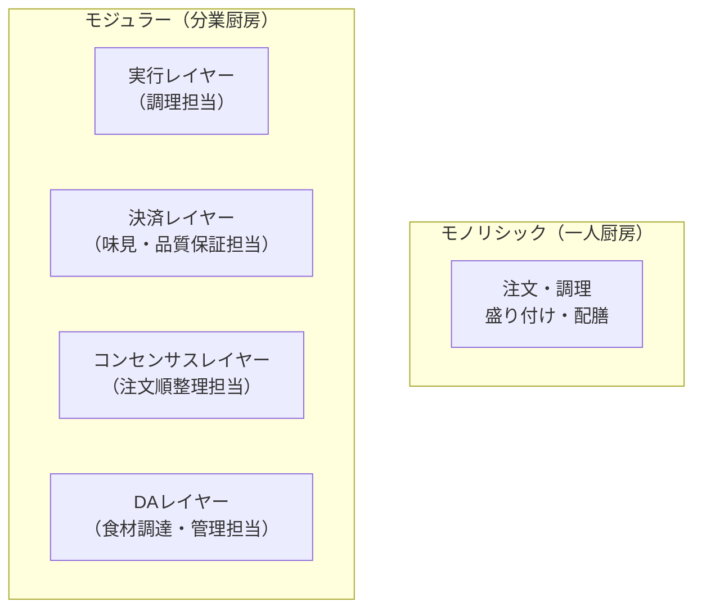
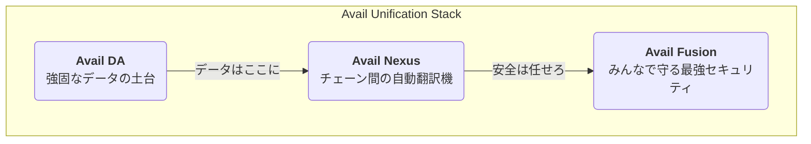

## はじめに： <br/> Web3の「めんどくさい」を終わらせる旅へようこそ！

「このDAppを使いたいけど、Polygonチェーンか…MetaMaskのネットワークを切り替えて、ブリッジで資金を移動させて…あぁ、もうめんどくさい！」

Web3の世界に足を踏み入れた多くの人が、一度はこんな経験をしたことがあるのではないでしょうか？

たくさんのブロックチェーンが乱立する現代は、まるで言語の違う国々を旅するようなもの。

そのたびに「ビザ（ウォレット）」を切り替え、「両替（ブリッジ）」が必要になり、せっかくの革新的な体験が台無しになりがちです。

しかし、もし**言語の違いを意識することなく、世界中のどこでもシームレスにサービスを受けられるとしたら…？**

そんな魔法のような体験をWeb3で実現しようとしているのが、今回ご紹介する **モジュラーブロックチェーン「Avail」** です。


この記事では、伝説のエンジニアブロガーである私が、以下の内容をストーリー仕立てで、世界一わかりやすく解説します。

- 🤔 **モジュラーブロックチェーンって何？** なぜ今注目されているの？
- 🥑 **Availってどんなプロジェクト？** 何がすごいの？
- ✨ **Avail Nexus SDK** が実現する、魔法のようなユーザー体験（UX）とは？
- 💻 **実践！** Next.jsを使って、未来のマルチチェーンDApp開発を体験してみよう！

Web3の未来を先取りしたいすべての開発者、そしてユーザー必見の内容です。さあ、一緒に未来への旅に出かけましょう！

## 第1章：<br/>モジュラーブロックチェーンとは？〜巨大レストランの厨房改革〜

Availを理解するために、まずはその根幹技術である「モジュラーブロックチェーン」について学びましょう。

### モノリシック vs モジュラー

従来のブロックチェーン（Bitcoinや初期のEthereumなど）は、**モノリシック（一枚岩）** と呼ばれます。

これは、ブロックチェーンが担うべき4つの主要な仕事（機能）を、すべて単一のレイヤーで処理しているからです。

1.  **実行 (Execution):** 
  トランザクション（取引）を処理し、スマートコントラクトのコードを実行する。
2.  **決済 (Settlement):** 
  トランザクションの最終的な正しさを保証し、紛争を解決する。
3.  **コンセンサス (Consensus):** 
  トランザクションの順序について合意する。
4.  **データ可用性 (Data Availability / DA):** 
  トランザクションのデータがネットワーク上の誰もが検証できるように「利用可能」であることを保証する。

これを巨大レストランの厨房に例えるなら、「一人のスーパースターシェフが、注文受けから調理、盛り付け、配膳まで全部一人でこなしている」ような状態です。これでは、お店が繁盛して注文が殺到すると、シェフがパンクしてしまいますよね。

そこで登場したのが**モジュラーブロックチェーン**です。

これは、先ほどの4つの仕事をそれぞれ専門のレイヤー（モジュール）に分割し、分業させるアプローチです。

レストランの例で言えば、「注文を受ける係、前菜を作るシェフ、メインディッシュを作るシェフ、デザートを作るパティシエ…」と専門家チームを結成するようなものです。

これにより、各担当者は自分の仕事に専念でき、厨房全体のスループット（処理能力）が劇的に向上します。



この **「データ可用性（DA）」** レイヤーこそが、モジュラーブロックチェーンの心臓部であり、Availがその専門家として名乗りを上げている領域なのです。

## 第2章：<br/>Availとは？〜Web3を統一する三本の矢〜

Availは単なるDAレイヤーの提供に留まらず、断片化したWeb3の世界を統一するための壮大なビジョン「**The Unification Layer**」を掲げています。

そのビジョンを実現するのが、以下の三本の矢（3つのコアコンポーネント）です。



### ① Avail DA: 超高速・低コストなデータの保管庫

Avail DAは、モジュラーチェーンのための**スケーラブルで信頼性の高いデータ可用性レイヤー**です。

- **何がすごいの？**
    - **有効性証明 (Validity Proofs):** 
      「このデータは確かにここにあります」という証明を非常に高速に行える技術（KZG多項式コミットメント）を採用。これにより、データの最終確定（ファイナリティ）まで**約40秒**という驚異的な速さを実現しています。これは、不正証明に頼る他のDAソリューション（約10分〜15分）と比較して圧倒的なアドバンテージです。
    - **データ可用性サンプリング (DAS):** 
      ライトクライアント（スマホやブラウザなど）が、ブロックデータ全体をダウンロードすることなく、ごく一部をサンプリングするだけで、データが利用可能か（改ざんされていないか）を高い信頼度で検証できます。これにより、誰もがネットワークの検証に参加でき、分散性が向上します。
    - **低コスト:** 
      Ethereumと比較して、トランザクションコストを**90%以上**削減できる可能性があります。

### ② Avail Nexus: チェーンの壁を破壊する魔法のレイヤー

Avail Nexusは、Availエコシステム内外の様々なロールアップやブロックチェーンを繋ぎ、**シームレスな相互運用を実現する検証ハブ**です。

- **何がすごいの？**
    - **チェーンアブストラクション:** 
      ユーザーや開発者は背後にあるチェーンの違いを意識することなく、まるで単一の巨大なブロックチェーンを操作しているかのような体験を得られます。もう、手動でのブリッジやネットワーク切り替えは必要なくなる点は非常に魅力的ですね！
    - **パーミッションレスな検証ハブ:** 
      様々なチェーンからの「この取引は正しいです」という証明を集約し、Avail DAを信頼の基点として、チェーン間の安全な通信を可能にします。

### ③ Avail Fusion: 外部資産でセキュリティを強化

Avail Fusionは、Availネットワーク全体の経済的セキュリティを強化するためのレイヤーです。

- **何がすごいの？**
    - **マルチアセットステーキング:** 
      Avail独自のトークンだけでなく、ETHやBTCといった成熟した外部の暗号資産をステーキング（ネットワークに預け入れること）して、Availネットワークのセキュリティ保護に参加できるようにします。これにより、単一のトークンに依存するリスクを分散し、より強固で回復力の高いネットワークを構築します。

## 第3章：<br/>Avail Nexus SDKが拓く未来のUX

さて、いよいよ本記事のメイントピックである **Avail Nexus SDK** です！

これは開発者がAvail Nexusの「チェーンアブストラクション」を、自分のDAppに簡単に組み込むための **TypeScript製開発者キット** です。

以下のデモサイトで実際に触ってみることができます！

https://avail-nexus-demo-five.vercel.app/

### Nexus SDKで何ができるのか？

| 機能 | 説明 | SDKメソッド |
| :--- | :--- | :--- |
| **マルチチェーンの残高一括取得** | 複数チェーンに散らばった自分の資産を足し算して一括で取得。 | `getUnifiedBalances()` |
| **スマート転送** | 自動でブリッジやスワップを行い、トークンを送金。 | `transfer()` |
| **クロスチェーンスワップ** | 「PolygonのMATICを、ArbitrumのUSDCに交換したい」といった複雑な取引をワンクリックで実現！ | `swap()` |
| **クロスチェーン実行** | **あるチェーンから、別のチェーン上のスマートコントラクト関数を直接呼び出す！(任意の処理を呼び出すことが可能)** | `execute()` |

これにより、ユーザーは以下のようなこれまで考えられなかったほど快適なUXを手に入れます。  
※ 厳密にいえば技術的には今までも可能でしたが実装が複雑になったりして大変でした。

- **WalletConnectで接続するだけ**で、自分の全資産をDAppが自動で認識。
- あるゲーム内アイテムを、**チェーンを意識することなく**別のゲームのキャラクターに送る。
- Polygonチェーン上のDeFiで得た利益（USDC）を、**ワンクリックで**Optimismチェーン上のNFTマーケットプレイスでの支払いに使う。

まさに、Web3の「めんどくさい」が解消され、誰もが直感的に使えるアプリケーションが生まれる土壌がここにあるのです。

## 第4章：<br/>実践！Nexus SDKで未来のDAppを体験しよう

百聞は一見に如かず。

Next.jsを使って、Nexus SDKの「統一残高取得」機能を実装してみましょう！

### ※前提※

**以降の操作は全てテストネット上で行います！！**

### 開発環境の準備

まずは開発環境を整えます。

#### 1. 前提条件

- **Node.js**: v22以上
- **pnpm**: `npm install -g pnpm`
- **MetaMask**: ブラウザ拡張のWeb3ウォレット

#### 2. Next.jsプロジェクトの作成
```bash
# Next.jsプロジェクトを作成
pnpm create next-app@latest my-nexus-app --typescript --eslint --tailwind --app --src-dir --use-pnpm

# ディレクトリへ移動
cd my-nexus-app
```

#### 3. 必要なパッケージのインストール
Nexus SDKと、ウォレット接続を簡単にするためのライブラリ（`wagmi`, `connectkit`）をインストールします。
```bash
pnpm add @avail-project/nexus-core @avail-project/nexus-widgets wagmi viem @tanstack/react-query connectkit
```
 
> **注釈:** `wagmi`や`connectkit`は、React環境でウォレット接続やチェーンとの対話を驚くほど簡単にしてくれる、現代Web3開発の必須ツールです。

#### 4. 環境変数の設定
プロジェクトのルートに`.env.local`ファイルを作成し、WalletConnectのプロジェクトIDを設定します。IDは[WalletConnect Cloud](https://cloud.walletconnect.com/)で取得してください。

```.env.local
NEXT_PUBLIC_WALLETCONNECT_PROJECT_ID="YOUR_WALLETCONNECT_PROJECT_ID"
```

### 実装ステップ

#### STEP 1: プロバイダーの設定

DApp全体でウォレット情報やNexus SDKの状態を共有できるように、プロバイダーを設定します。

まず、`src/app/providers.tsx` を作成します。

```typescript:src/app/providers.tsx
"use client";

import React from "react";
import { WagmiProvider, createConfig, http } from "wagmi";
import { mainnet, sepolia, optimism, arbitrum, polygon, base, scroll } from "wagmi/chains";
import { QueryClient, QueryClientProvider } from "@tanstack/react-query";
import { ConnectKitProvider, getDefaultConfig } from "connectkit";
import { NexusProvider } from "@avail-project/nexus-widgets";

const chains = [mainnet, sepolia, optimism, arbitrum, polygon, base, scroll];

const config = createConfig(
  getDefaultConfig({
    appName: "My Avail Nexus App",
    chains,
    transports: {
      [mainnet.id]: http(),
      [sepolia.id]: http(),
      [optimism.id]: http(),
      [arbitrum.id]: http(),
      [polygon.id]: http(),
      [base.id]: http(),
      [scroll.id]: http(),
    },
    walletConnectProjectId: process.env.NEXT_PUBLIC_WALLETCONNECT_PROJECT_ID || "",
  })
);

const queryClient = new QueryClient();

export function Providers({ children }: { children: React.ReactNode }) {
  return (
    <WagmiProvider config={config}>
      <QueryClientProvider client={queryClient}>
        <ConnectKitProvider>
          {/* NexusProviderでラップし、テストネットを指定 */}
          <NexusProvider config={{ network: 'testnet' }}>
            {children}
          </NexusProvider>
        </ConnectKitProvider>
      </QueryClientProvider>
    </WagmiProvider>
  );
}
```

次に、`src/app/layout.tsx`でアプリケーション全体を`Providers`でラップします。

```typescript:src/app/layout.tsx
import type { Metadata } from "next";
import { Inter } from "next/font/google";
import "./globals.css";
import { Providers } from "./providers"; // インポート

const inter = Inter({ subsets: ["latin"] });

export const metadata: Metadata = {
  title: "Avail Nexus SDK Tutorial",
  description: "A demo of Avail Nexus SDK",
};

export default function RootLayout({
  children,
}: Readonly<{
  children: React.ReactNode;
}>) {
  return (
    <html lang="ja">
      <body className={inter.className}>
        <Providers>{children}</Providers> {/* ラップする */}
      </body>
    </html>
  );
}
```

#### STEP 2: UIとロジックの実装

`src/app/page.tsx`を編集して、ウォレット接続ボタンと残高表示エリアを作成します。

```typescript:src/app/page.tsx
"use client";

import { ConnectKitButton } from "connectkit";
import { useAccount } from "wagmi";
import { NexusSDK } from "@avail-project/nexus-core";
import { useState, useEffect } from "react";

export default function HomePage() {
  const { address, isConnected, connector } = useAccount();
  const [sdk, setSdk] = useState<NexusSDK | null>(null);
  const [unifiedBalances, setUnifiedBalances] = useState<any>(null);
  const [loading, setLoading] = useState(false);
  const [error, setError] = useState<string | null>(null);

  // ウォレット接続時にSDKを初期化
  useEffect(() => {
    if (isConnected && connector) {
      const initializeNexus = async () => {
        try {
          setLoading(true);
          setError(null);
          const newSdk = new NexusSDK({ network: 'testnet' });
          const provider = await connector.getProvider();
          await newSdk.initialize(provider);
          setSdk(newSdk);
        } catch (e: any) {
          console.error("SDK initialization failed:", e);
          setError(`SDK初期化エラー: ${e.message}`);
        } finally {
          setLoading(false);
        }
      };
      initializeNexus();
    } else {
      setSdk(null);
      setUnifiedBalances(null);
    }
  }, [isConnected, connector]);

  // 統一残高を取得する関数
  const fetchBalances = async () => {
    if (!sdk || !address) {
      setError("SDK未初期化、またはウォレット未接続です。");
      return;
    }
    try {
      setLoading(true);
      setError(null);
      const balances = await sdk.getUnifiedBalances(address);
      setUnifiedBalances(balances);
    } catch (e: any) {
      console.error("Failed to fetch balances:", e);
      setError(`残高取得エラー: ${e.message}`);
    } finally {
      setLoading(false);
    }
  };

  return (
    <div className="flex flex-col items-center justify-center min-h-screen py-2 bg-gray-50">
      <h1 className="text-4xl font-extrabold mb-8 text-gray-800">🚀 Avail Nexus SDK Demo 🚀</h1>
      <ConnectKitButton />

      {isConnected && (
        <div className="mt-8 p-8 bg-white rounded-xl shadow-lg w-full max-w-2xl text-center">
          <p className="text-lg font-medium text-gray-700 mb-6">
            SDK初期化状態: {sdk ? "✅ 完了" : "⏳ 待機中..."}
          </p>
          <button
            onClick={fetchBalances}
            disabled={!sdk || loading}
            className="px-8 py-4 bg-gradient-to-r from-blue-500 to-purple-600 text-white font-bold rounded-full shadow-xl hover:scale-105 transition duration-300 disabled:opacity-50"
          >
            {loading ? "取得中..." : "💰 統一残高を取得"}
          </button>

          {error && <p className="text-red-500 mt-6">{error}</p>}

          {unifiedBalances && (
            <div className="mt-10 p-6 bg-gray-100 rounded-lg shadow-inner w-full text-left">
              <h2 className="text-2xl font-bold text-gray-800 mb-5">あなたの全資産 ✨</h2>
              {Object.keys(unifiedBalances).length === 0 ? (
                <p>表示可能なトークンはありません。</p>
              ) : (
                Object.entries(unifiedBalances).map(([token, data]: [string, any]) => (
                  <div key={token} className="mb-6 pb-4 border-b last:border-b-0">
                    <h3 className="text-xl font-semibold text-purple-700 mb-2">{token}</h3>
                    <p className="ml-4 text-lg"><b>合計:</b> {data.totalFormatted} {token}</p>
                    <ul className="ml-8 mt-2 list-disc list-inside text-gray-600">
                      {data.breakdown.map((item: any, index: number) => (
                        <li key={index}>
                          {item.chainName}: {item.formattedBalance} {token}
                        </li>
                      ))}
                    </ul>
                  </div>
                ))
              )}
            </div>
          )}
        </div>
      )}
    </div>
  );
}
```

### 実行してみよう！

1.  ターミナルで開発サーバーを起動します。

      ```bash
      pnpm dev
      ```
2.  ブラウザで `http://localhost:3000` を開きます。
3.  ウォレットを接続し、ネットワークをSepoliaなどのテストネットに切り替えます（テストネットのトークンは各チェーンのFaucetから入手してください）。
4.  「💰 統一残高を取得」ボタンをクリック！

どうでしょう？

Sepoliaチェーン、Optimism Sepoliaチェーン、Arbitrum Sepoliaチェーンなどに分散しているあなたのテスト用ETHやUSDCが、一つのリストとして表示されたはずです。

これが「チェーンアブストラクション」の第一歩です！

## まとめ：<br/>Availが拓く、真に統一されたWeb3の未来

今回は、モジュラーブロックチェーンの概念から始まり、Availが「The Unification Layer」としてWeb3の断片化問題をいかに解決しようとしているか、そしてその鍵を握るAvail Nexus SDKの実践的な使い方までを解説しました。

Nexus SDKを使えば、これまで開発者を悩ませてきたマルチチェーンの複雑さが嘘のように消え去り、ユーザーはチェーンの存在を意識することなくサービスを享受できる未来がすぐそこまで来ています！！

日本でも2025年10月27日からJPYCの発行が始まりました。  
現在、JPYCは3つのブロックチェーンで流通しています。  

https://iolite.net/news/jpyc-ex-launch-stablecoin-20251027

https://jpyc.co.jp/

3つのブロックチェーンにまたがっている資産を一括で管理・操作したいという需要は今後必ず発生すると思いますのでその時に AvailのNexus SDKが役立ちそうです！

Nexus SDK単なる開発効率の向上に留まりません。

UXの劇的な改善は、Web3がマスアダプション（大衆化）を達成するための最後のピースを埋める可能性を秘めているのです。

ここまで読んでいただきありがとうございました！！

## 参考文献

https://availproject.org/

https://docs.availproject.org/

https://discord.com/invite/AvailProject

https://github.com/availproject/avail-nexus-demo

https://github.com/availproject/nexus-sdk

https://github.com/availproject/nexus-elements-template

https://blog.availproject.org/

https://avail-nexus-demo-five.vercel.app/