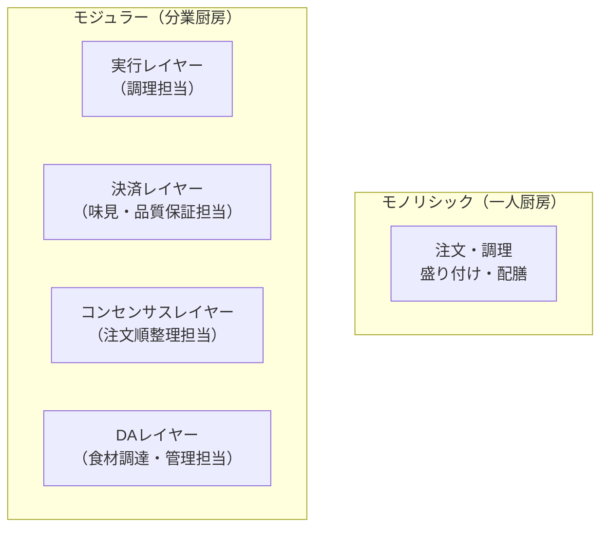
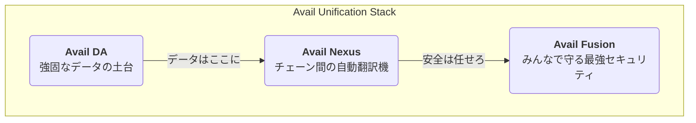

## はじめに： <br/> Web3の「めんどくさい」を終わらせる旅へようこそ！

「このDAppを使いたいけど、Polygonチェーンか…MetaMaskのネットワークを切り替えて、ブリッジで資金を移動させて…あぁ、もうめんどくさい！」

Web3の世界に足を踏み入れた多くの人が、一度はこんな経験をしたことがあるのではないでしょうか？

たくさんのブロックチェーンが乱立する現代は、まるで言語の違う国々を旅するようなもの。

そのたびに「ビザ（ウォレット）」を切り替え、「両替（ブリッジ）」が必要になり、せっかくの革新的な体験が台無しになりがちです。

しかし、もし**言語の違いを意識することなく、世界中のどこでもシームレスにサービスを受けられるとしたら…？**

そんな魔法のような体験をWeb3で実現しようとしているのが、今回ご紹介する **モジュラーブロックチェーン「Avail」** です。


**モジュラーブロックチェーン** ってなんだか難しそうですよね...

僕も最初挫折しました。

でもハッカソンで Availを調べる機会があり、 **Nexus SDK** にも触れてみて分かったことがあるのでそれを皆さんにも共有したいと思います！

- 🤔 **モジュラーブロックチェーンって何？**
- 🥑 **Availってどんなプロジェクト？** 
- ✨ **Avail Nexus SDK** が実現する魔法のようなユーザー体験（UX）とは？
- 💻 **実践！** サンプルアプリケーションで **Nexus SDK** を体験してみよう！

Web3の未来を先取りしたいすべての開発者、そしてユーザー必見の内容です！！

## 第1章：<br/>モジュラーブロックチェーンとは？〜巨大レストランの厨房改革〜

Availを理解するために、まずはその根幹技術である「モジュラーブロックチェーン」について学びましょう。

### モノリシック vs モジュラー

従来のブロックチェーン（Bitcoinや初期のEthereumなど）は、**モノリシック（一枚岩）** 型のブロックチェーンで必要な機能が全て一つのプロトコルの中に詰まっています。

具体的にはブロックチェーンが担うべき4つの主要な仕事（機能）をすべて単一のレイヤーで処理していることを意味します。

1.  **実行 (Execution):** 
  トランザクション（取引）を処理し、スマートコントラクトのコードを実行する。
2.  **決済 (Settlement):** 
  トランザクションの最終的な正しさを保証し、紛争を解決する。
3.  **コンセンサス (Consensus):** 
  トランザクションの順序について合意する。
4.  **データ可用性 (Data Availability / DA):** 
  トランザクションのデータがネットワーク上の誰もが検証できるように「利用可能」であることを保証する。

:::message
これを巨大レストランの厨房に例えるなら、「一人のスーパースターシェフが、注文受けから調理、盛り付け、配膳まで全部一人でこなしている」ような状態です
:::

これでは、お店が繁盛して注文が殺到すると、シェフがパンクしてしまいますよね。

そこで登場したのが**モジュラーブロックチェーン**という概念です。

これは先ほどの4つの仕事をそれぞれ専門のレイヤー（モジュール）に分割し、分業させるアプローチです。

:::message
レストランの例で言えば、「注文を受ける係、前菜を作るシェフ、メインディッシュを作るシェフ、デザートを作るパティシエ…」と専門家チームを結成するようなものです。
:::

これにより各担当者は自分の仕事に専念でき、厨房全体のスループット（処理能力）が劇的に向上すると考えられ一時期話題となりました！



そして **「データ可用性（DA）」** レイヤーがモジュラーブロックチェーンの心臓部であり、代表的なプロジェクトが**Avail**です！！

## 第2章：<br/>Availとは？〜Web3を統一する三本の矢〜

Availは単なるDAレイヤーの提供に留まらず、断片化したWeb3の世界を統一するための壮大なビジョン「**The Unification Layer**」を掲げています。

そのビジョンを実現するのが、以下の三本の矢（3つのコアコンポーネント）です。



### ① Avail DA: 超高速・低コストなデータの保管庫

:::message
Avail DAは、モジュラーチェーンのための**スケーラブルで信頼性の高いデータ可用性レイヤー**です。
:::

- **何がすごいの？**
    - **有効性証明 (Validity Proofs):** 
      「このデータは確かにここにあります」という証明を非常に高速に行える技術（KZG多項式コミットメント）を採用。これにより、データの最終確定（ファイナリティ）まで**約40秒**という驚異的な速さを実現しています。これは、不正証明に頼る他のDAソリューション（約10分〜15分）と比較して圧倒的なアドバンテージです。
    - **データ可用性サンプリング (DAS):** 
      ライトクライアント（スマホやブラウザなど）が、ブロックデータ全体をダウンロードすることなく、ごく一部をサンプリングするだけで、データが利用可能か（改ざんされていないか）を高い信頼度で検証できます。これにより、誰もがネットワークの検証に参加でき、分散性が向上します。
    - **低コスト:** 
      Ethereumと比較して、トランザクションコストを**90%以上**削減できる可能性があるとされています。

### ② Avail Nexus: チェーンの壁を破壊する魔法のレイヤー

:::message
Avail Nexusは、Availエコシステム内外の様々なロールアップやブロックチェーンを繋ぎ、**シームレスな相互運用を実現する検証ハブ**です。
:::

- **何がすごいの？**
    - **チェーンアブストラクション:** 
      ユーザーや開発者は背後にあるチェーンの違いを意識することなく、まるで単一の巨大なブロックチェーンを操作しているかのような体験を得られます。もう、手動でのブリッジやネットワーク切り替えは必要なくなる点は非常に魅力的ですね！
    - **パーミッションレスな検証Hub:** 
      様々なチェーンからの「この取引は正しいです」という証明を集約し、Avail DAを信頼の基点として、チェーン間の安全な通信を可能にします。

### ③ Avail Fusion: 外部資産でセキュリティを強化

:::message
Avail Fusionは、Availネットワーク全体の経済的セキュリティを強化するためのレイヤーです。
:::

- **何がすごいの？**
    - **マルチアセットステーキング:** 
      Avail独自のトークンだけでなく、ETHやBTCといった成熟した外部の暗号資産をステーキング（ネットワークに預け入れること）して、Availネットワークのセキュリティ保護に参加できるようにします。これにより、単一のトークンに依存するリスクを分散し、より強固で回復力の高いネットワークを構築します。

## 第3章：<br/>Avail Nexus SDKが拓く未来のUX

さて、いよいよ本記事のメイントピックである **Avail Nexus SDK** です！

これは開発者がAvail Nexusの「チェーンアブストラクション」を、自分のDAppに簡単に組み込むための **TypeScript製開発者キット** です。

以下のデモサイトで実際に触ってみることができます！

https://avail-nexus-demo-five.vercel.app/

### Nexus SDKで何ができるのか？

| 機能 | 説明 | SDKメソッド |
| :--- | :--- | :--- |
| **マルチチェーンに跨って資産の残高一括取得する機能** | 複数チェーンに散らばった自分の資産を足し算して一括で取得。 | `getUnifiedBalances()` |
| **スマート転送機能** | 自動でブリッジやスワップを行い、トークンを送金。 | `transfer()` |
| **クロスチェーンスワップ機能** | 「PolygonのMATICを、ArbitrumのUSDCに交換したい」といった複雑な取引をワンクリックで実現！ | `swap()` |
| **クロスチェーン実行機能** | **あるチェーンから、別のチェーン上のスマートコントラクト関数を直接呼び出す！(任意の処理を呼び出すことが可能)** | `execute()` |

これにより、ユーザーは以下のようなこれまで考えられなかったほど快適なUXを手に入れることができます！ 

:::message
厳密にいえば技術的には今までも可能でしたが実装が複雑になったりして大変でした。
:::

- **WalletConnectで接続するだけ**で、自分の全資産をDAppが自動で認識。
- あるゲーム内アイテムを、**チェーンを意識することなく**別のゲームのキャラクターに送る。
- Polygonチェーン上のDeFiで得た利益（USDC）を、**ワンクリックで**Optimismチェーン上のNFTマーケットプレイスでの支払いに使う。

クロスチェーンに関しては **CCTP** や **CCIP**、**LayerZero**、**Hyperlane** などいくつか主要なプロジェクトがありますが、 Nexus SDKはそれらと比較しても導入が簡単でした。

:::message
導入は簡単ですが

- フロントエンド側でしかSDKが使えない
- USDC、USDT、ETH、POL、MODしか扱えない

という制約があります。
:::

まさに、Web3の「めんどくさい」が解消され、誰もが直感的に使えるアプリケーションが生まれる土壌がここにあるのです。

## 第4章：<br/>実践！Nexus SDKで未来のDAppを体験しよう

百聞は一見に如かず。

Next.jsとNexus SDKでサンプルアプリケーションを立ち上げて実際に触れてみましょう！

サンプルコードは以下に格納されています！  
※ ベースとなっているはAvailの公式チームがGitHubで公開しているものです。
※ テストネットで動くように設定を変更しているのとソースコードにコメントを追加しています

https://github.com/mashharuki/nexus-sample-app

### ※前提※

**以降の操作は全てテストネット上で行います！！**

### 開発環境の準備

まずは開発環境を整えます。

#### 1. 前提条件

- **Node.js**: v22以上
- **pnpm**: `npm install -g pnpm`
- **MetaMask**: ブラウザ拡張のWeb3ウォレット

#### 2. GitHubリポジトリをクローンする

```bash
git clone https://github.com/mashharuki/nexus-sample-app.git

# ディレクトリへ移動
cd headless-sample-app
```

#### 3. 必要なパッケージのインストール

Nexus SDKと、ウォレット接続を簡単にするためのライブラリ（`wagmi`, `connectkit`）をインストールします。

```bash
pnpm i
```
 
> **注釈:** `wagmi`や`connectkit`は、React環境でウォレット接続やチェーンとの対話を驚くほど簡単にしてくれる、Web3開発における強力なライブラリです。

#### 4. 環境変数の設定

プロジェクトのルートに`.env.local`ファイルを作成し、WalletConnectのプロジェクトIDを設定します。

IDは[WalletConnect Cloud](https://cloud.walletconnect.com/)で取得してください。

```.env.local
NEXT_PUBLIC_WALLETCONNECT_PROJECT_ID=
NEXT_PUBLIC_ENABLE_TESTNET=
```

### 実装ステップ

#### STEP 1: プロバイダーの設定

DApp全体でウォレット情報やNexus SDKの状態を共有できるように、プロバイダーを設定します。

今回は **Nexus SDK** と **Wagmi** 用のプロバイダーが設定されています。

https://github.com/mashharuki/nexus-sample-app/blob/main/headless-sample-app/src/provider/NexusProvider.tsx

https://github.com/mashharuki/nexus-sample-app/blob/main/headless-sample-app/src/provider/Web3Provider.tsx

次に、`src/app/layout.tsx`でアプリケーション全体を`Providers`でラップします。

https://github.com/mashharuki/nexus-sample-app/blob/main/headless-sample-app/src/app/layout.tsx

これで準備OKです！！

#### STEP 2: UIとロジックの実装

**Nexus SDK** の機能の一つである `getUnifiedBalances()` は以下のように呼び出します！

これでマルチチェーン上のデジタルアセットの残高をまとめて取得してきてくれます！！  

これは便利ですね！

https://github.com/mashharuki/nexus-sample-app/blob/main/headless-sample-app/src/components/unified-balance.tsx#L22-L39

ブリッジ機能は以下のように呼び出します！

https://github.com/mashharuki/nexus-sample-app/blob/main/headless-sample-app/src/hooks/useBridgeTransaction.ts#L77-L80

一番の目玉機能である Bridge & Executeについては以下のように呼び出します！

操作対象である資産のapproveメソッドについてもSDK側で呼び出してくれるような仕組みになってます！

このおかげでbridgeした先のコントラクトでそのままERC20規格のトークン(現状ではUSDCとUSDTのみ)を操作することができます！

https://github.com/mashharuki/nexus-sample-app/blob/main/headless-sample-app/src/hooks/useBridgeExecuteTransaction.ts

### 動かしてみよう！

#### 1. 開発サーバーを起動する

以下のコマンドを実行します

```bash
pnpm dev
```

#### 2. アプリにアクセスする

ブラウザで `http://localhost:3000` を開いてみましょう！

以下のような画面に遷移するはずです！！


ウォレットを接続してみるとマルチチェーンにまたがる資産が丸っと表示されます！！  


:::message
全部テストネットの資産です。  
※ メインネットだったら大金持ち...笑
:::


#### 3. Nexus SDKの機能を試してみよう

では早速 Nexus SDKの機能を使ってブリッジを行ってみましょう！！

`bridge`タブに切り替えて違うブロックチェーンに自分のデジタルアセットを送ってみましょう！！


- 送金先のチェーン
- 送金するアセット
- 送金額

を指定します！


するとトランザクションへの署名が何回か求められるので全て承認します！


うまく処理されたらブリッジが始まるはずです！！


時間はかかりますが、ちゃんとブリッジされるはずです！

Sepolia側のトランザクション

https://sepolia.etherscan.io/tx/0x5e21ff4977a27dc044997cd68cc9321d557995e851d0ce9ed27751e86f8c2a91

Arbitrum Sepolia側のトランザクション

https://sepolia.arbiscan.io/tx/0xce03b963c20f9b14ca45642e2949f53a8799c815cdabab2c7dc520cbe90deb9b

ちゃんとブリッジされてますね！！

素晴らしい！！

マルチチェーン上の残高取得と操作が一つのSDKで完結していること
そして設定が他のクロスチェーン系のSDKよりも簡単なことは特筆すべき点かと思います！！

## まとめ：<br/>Availが拓く、真に統一されたWeb3の未来

今回は、モジュラーブロックチェーンの概念から始まり、Availが「The Unification Layer」としてWeb3の断片化問題をいかに解決しようとしているか、そしてその鍵を握るAvail Nexus SDKの実践的な使い方までを解説しました。

Nexus SDKを使えば、これまで開発者を悩ませてきたマルチチェーンの複雑さが嘘のように消え去り、ユーザーはチェーンの存在を意識することなくサービスを享受できる未来がすぐそこまで来ています！！

日本でも2025年10月27日からJPYCの発行が始まりました。  
現在、JPYCは3つのブロックチェーンで流通しています。  

https://iolite.net/news/jpyc-ex-launch-stablecoin-20251027

https://jpyc.co.jp/

3つのブロックチェーンにまたがっている資産を一括で管理・操作したいという需要は今後必ず発生すると思いますのでその時に AvailのNexus SDKが役立ちそうです！

Nexus SDK単なる開発効率の向上に留まりません。

UXの劇的な改善は、Web3がマスアダプション（大衆化）を達成するための最後のピースを埋める可能性を秘めているのです。

ここまで読んでいただきありがとうございました！！

## 参考文献

https://availproject.org/

https://docs.availproject.org/

https://discord.com/invite/AvailProject

https://github.com/availproject/avail-nexus-demo

https://github.com/availproject/nexus-sdk

https://github.com/availproject/nexus-elements-template

https://blog.availproject.org/

https://avail-nexus-demo-five.vercel.app/