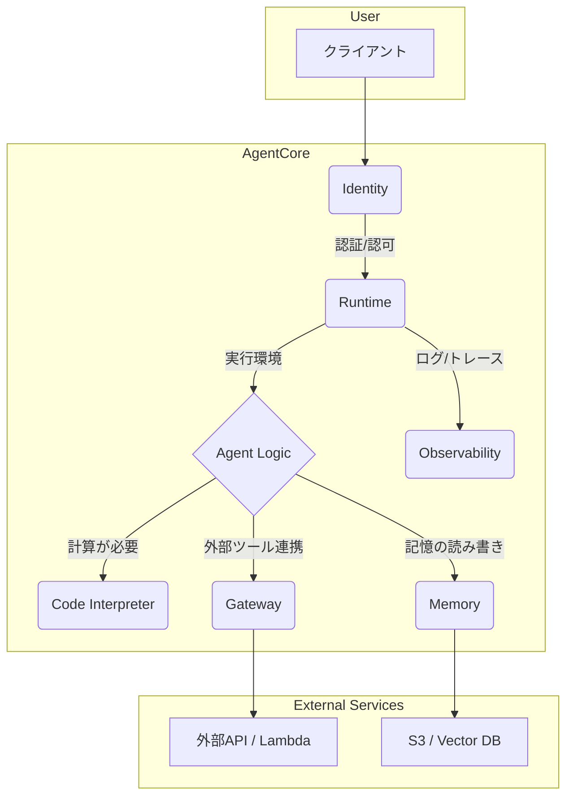

## はじめに

2025年9月21日、**Serverless Days Tokyo 2025**という素晴らしいテックカンファレンスに参加してきました。

https://serverless.connpass.com/event/362044/

そこで受講した「Amazon Bedrock AgentCore」のワークショップがとても良かったので学びをシェアするための記事を執筆しました！


AIエージェント開発における「隠れた技術的負債」という根深い課題に対し、**Bedrock AgentCore**がどのように立ち向かうのか。その答えを、AWSコスト見積もりエージェントをローカルで構築し、クラウドにデプロイするまでの一連の流れを通して体験することができました。

## Amazon Bedrock AgentCoreとは？

まず、今回の主役であるAmazon Bedrock AgentCore（以下、AgentCore）について説明します。


公式ドキュメントによると、AgentCoreは「**本番環境でエージェントやツールを安全に構築、デプロイ、実行するためのエンタープライズグレードのプリミティブを提供するサービス**」とされています。

> Learn about AWS Amazon Bedrock AgentCore, a service that provides enterprise-grade primitives for securely building, deploying, and running agent or tools in production.
> (出典: [What is Amazon Bedrock AgentCore?](https://docs.aws.amazon.com/bedrock-agentcore/latest/devguide/what-is-bedrock-agentcore.html))

AIエージェントを「とりあえず動かす」だけなら、LangChainやLangGraphのようなフレームワークを使えば比較的簡単です。しかし、それを**本番環境で、スケーラビリティやセキュリティ、オブザーバビリティを確保しながら運用し続ける**となると、話は一気に複雑になります。


これは、機械学習システムにおける「隠れた技術的負債」の問題とよく似ています。モデル自体の開発は全体のほんの一部で、データパイプライン、運用、監視といった周辺機能の実装・維持にこそ、膨大なコストがかかるのです。


AgentCoreは、この「AIエージェント開発における隠れた技術的負債」を解消するために生まれました。


開発者がAIエージェント自体のビジネスロジック開発に集中できるよう、本番運用に必要な面倒な機能群（コンピューティング環境、デプロイ、認証、監視など）を、AWSがマネージドサービスとして提供してくれるのです。


## Strands Agentsとは？

AgentCoreの話をする上で欠かせないのが、オープンソースのSDK「**Strands Agents**」です。

https://strandsagents.com/latest/

> Strands Agents is an open-source SDK for building autonomous AI agents that integrate with AWS services and foundation models.
> (出典: [Strands Agents - AWS Prescriptive Guidance](https://docs.aws.amazon.com/prescriptive-guidance/latest/agentic-ai-frameworks/strands-agents.html))

Strands Agentsは、Amazon Bedrockのような基盤モデルやAWSサービスと連携する自律型AIエージェントを最小限のコードで構築できるように設計されたPython SDKです。

今回のワークショップでも、このStrands Agents SDKを使ってエージェントを実装しました。

**AgentCoreが「実行環境」や「プラットフォーム」** だとすれば、**Strands Agentsは「開発キット」や「フレームワーク」** と考えると分かりやすいでしょう。両者は連携することで、ローカルでの迅速な開発から本番環境へのシームレスなデプロイまでを可能にします。

## Bedrock AgentCoreの主要な構成要素

ワークショップでは、AgentCoreが提供する6つの主要な機能を段階的に学びました。

これらがどのように連携し、単純なローカルエージェントを堅牢なクラウドアプリケーションへと進化させるのかを見ていきましょう。



1.  **🧮 Code Interpreter**:   
  AIが生成したコード（Python, JSなど）を安全に実行するための、分離されたサンドボックス環境。リソース制限やネットワークアクセス制御も可能です。
2.  **🚀 Runtime**:   
  AIエージェントをデプロイ・管理するためのサーバーレス実行環境。実装言語やフレームワークに依存せず、Dockerコンテナとしてパッケージ化されたエージェントを実行できます。
3.  **🛡️ Identity**:   
  AIエージェントの認証・認可を管理。IAMやOAuthに対応し、誰がエージェントを呼び出せるかをセキュアに制御します。
4.  **🔌 Gateway**:   
  外部のAPIやLambda関数などを、エージェントがツールとして簡単に利用できる「MCP（Model-facing Context Protocol）」という共通プロトコルに変換・接続します。
5.  **📊 Observability**:   
  エンドツーエンドの運用監視機能。リクエストの受信から応答生成までの全フローをトレースし、デバッグやパフォーマンス監視を容易にします。
6.  **🧠 Memory**:   
  短期・長期の記憶機能を提供。セッション内の対話履歴（短期記憶）や、ユーザーの好み・過去の対話の要約（長期記憶）を保持し、パーソナライズされた応答を可能にします。

## ワークショップ体験記：AWSコスト見積もりエージェント開発

ここからは、ワークショップで実際に体験した「AWSコスト見積もりエージェント」の開発プロセスを、ログやコマンドと共に追体験していきます。

GitHubリポジトリは以下です。

https://github.com/aws-samples/sample-amazon-bedrock-agentcore-onboarding

## セットアップ

まず以下のコマンドを順番に実行して諸々環境を整えましょう！

```bash
git clone https://github.com/aws-samples/sample-amazon-bedrock-agentcore-onboarding.git
cd sample-amazon-bedrock-agentcore-onboarding

uv sync

uv run python -c "import boto3; print('AWS SDK:', boto3.__version__)"
uv run python -c "import bedrock_agentcore; print('AgentCore SDK installed successfully')"

aws configure set region us-west-2
aws configure get region
```

### Lab 1: Code Interpreterで計算タスクを実行する

最初のステップは、ユーザーが自然言語で記述したAWSアーキテクチャのコストを計算するエージェントのコアロジックを、ローカル環境で構築することです。

**目標:**
ユーザーの「パン屋のWebサイトをHTMLでなるべく安く作りたい」といった曖昧な要求を解釈し、AWS Pricing APIからリアルタイムの料金を取得し、動的にPythonコードを生成してコストを計算・集計する。

**処理フロー:**
1.  **アーキテクチャ理解**:   
  LLMがユーザーの要求を分析し、`Amazon S3`や`CloudFront`といった具体的なAWSサービスを特定します。
2.  **価格情報取得**:   
  Strands Agentsに組み込まれた`AWS Pricing MCP`ツールを呼び出し、特定したサービスの料金データを取得します。
3.  **コード生成**:   
  取得した料金データとユーザーの要求に基づき、コストを計算するためのPythonコードを動的に生成します。
4.  **コード実行**:   
  生成されたPythonコードを、AgentCoreの`Code Interpreter`に渡し、安全なサンドボックス環境で実行させて結果を取得します。

**実行コマンドと結果:**

まず、サンプルリポジトリの`01_code_interpreter`ディレクトリに移動し、テストスクリプトを実行します。

```bash
# Lab1のディレクトリへ移動
cd /workshop/sample-amazon-bedrock-agentcore-onboarding/01_code_interpreter

# コスト見積もりエージェントを実行
uv run python test_cost_estimator_agent.py --architecture "パン屋のWebサイトをHTMLでなるべく安く作りたい"
```

すると、エージェントが思考を巡らせ、ツールを次々と呼び出していく様子がログに表示されます。

```log
🚀 Testing AWS Cost Agent
...
I need to provide a cost estimate for a bakery website built in HTML with minimal cost on AWS.
...
まず利用可能なAWSサービスコードを確認しましょう：
Tool #1: get_pricing_service_codes
...
HTMLサイトの場合、低コストで構築するための主なサービスとしては以下が考えられます：
1. Amazon S3（静的ウェブサイトホスティング）
2. Amazon CloudFront（コンテンツ配信ネットワーク）
3. Route 53（ドメイン管理とDNS）
...
では、実際の料金データを取得していきます。
Tool #7: get_pricing
...
これで必要な料金情報が揃いましたので、実際のコスト計算を行います：
Tool #14: execute_cost_calculation
```

最終的に、`Code Interpreter`が計算を実行し、以下のようなマークダウン形式の詳細な見積もりが出力されました。

```markdown
# パン屋のウェブサイト - AWS費用見積もり

この見積もりでは、パン屋の静的HTMLウェブサイトをAWSで構築する際の最も費用対効果の高いオプションを分析しました。

## アーキテクチャの選択肢

以下の2つのアーキテクチャオプションを比較しました：

### オプション1: Amazon S3 + CloudFront + Route 53
- **S3**: 静的ウェブサイトホスティング
- **CloudFront**: グローバルコンテンツ配信
- **Route 53**: ドメイン管理とDNS

### オプション2: AWS Amplify + Route 53
- **Amplify**: ウェブサイトのホスティングとデプロイ
- **Route 53**: ドメイン管理とDNS

## 費用見積もり（月額）

| サービス | 月額費用（USD） | 月額費用（JPY） |
|---------|--------------|--------------|
| S3静的ウェブサイト + CloudFront | $1.51 | ¥227 |
| AWS Amplify | $3.13 | ¥469 |

## オプション1の内訳: S3 + CloudFront + Route 53

| サービス | 月額費用（USD） | 月額費用（JPY） |
|---------|--------------|--------------|
| S3ストレージ | $0.01 | ¥2 |
| Route 53 | $0.50 | ¥75 |
| ドメイン登録（月換算） | $1.00 | ¥150 |
| **合計** | **$1.51** | **¥227** |

## オプション2の内訳: AWS Amplify + Route 53

| サービス | 月額費用（USD） | 月額費用（JPY） |
|---------|--------------|--------------|
| Amplifyストレージ | $0.011 | ¥2 |
| Amplifyビルド | $0.10 | ¥15 |
| Amplifyリクエスト | $0.015 | ¥2 |
| Amplifyデータ転送 | $1.50 | ¥225 |
| Route 53 | $0.50 | ¥75 |
| ドメイン登録（月換算） | $1.00 | ¥150 |
| **合計** | **$3.13** | **¥469** |

## AWS無料利用枠の活用

AWSの無料利用枠を活用することで、最初の12ヶ月間はさらに費用を抑えることができます：

1. **Amazon S3**:
   - 12か月間無料: 5GB のスタンダードストレージ
   - 12か月間無料: 20,000 Get リクエスト & 2,000 Put リクエスト

2. **Amazon CloudFront**:
   - 常に無料: 毎月1TB のデータ転送出力
   - 常に無料: 10,000,000 HTTPおよびHTTPSリクエスト

3. **AWS Amplify**:
   - 12か月間無料: ビルド・デプロイで1,000分/月
   - 12か月間無料: ストレージ5GB/月
   - 12か月間無料: データ転送15GB/月

4. **Amazon Route 53**:
   - フリーティアの対象外: ホストゾーン$0.50/月
   - フリーティアの対象外: ドメイン登録料

## 推奨アーキテクチャ

**最も費用効果の高いオプション: Amazon S3 + CloudFront + Route 53**

- 月額費用: 約¥227（$1.51）
- AWSの無料利用枠を活用すると、最初の12ヶ月はRoute 53の費用（月額約¥75）とドメイン登録料（年間約¥1,800）のみで運用可能
- シンプルな静的HTMLサイトの場合、S3のスケーラビリティと信頼性で十分対応可能

## 注意事項

1. この見積もりは、月間データ転送10GB、月間リクエスト数50,000回を想定しています
2. 実際の費用は、実際の使用量によって変動します
3. ドメイン登録料は、選択するドメイン名によって変わります（.comドメインで年間約$12と想定）
4. 今後トラフィックが増加した場合でも、S3+CloudFrontアーキテクチャは低コストで拡張可能です

最もコスト効率が良いのはS3+CloudFrontの組み合わせですが、将来的に機能を拡張する予定がある場合は、AWS Amplifyを検討することもできます。Amplifyはより高度な機能（認証、バックエンド統合など）を提供しますが、その分コストも高くなります。📊 Regular response length: 2051 characters
Result preview: # パン屋のウェブサイト - AWS費用見積もり

この見積もりでは、パン屋の静的HTMLウェブサイトをAWSで構築する際の最も費用対効果の高いオプションを分析しました。

## アーキテクチャの選択肢

以下の2つのアーキテクチャオプションを比較しました：

### オプション1: Amazon ...

📋 Test Results:
   Regular implementation: ✅ PASS
🎉 All tests completed successfully!
```

コスト見積もりエージェントの実装は以下のようなコードになっています

https://github.com/mashharuki/AWS-AgentCore-Sample/blob/main/handson/serverlessdays2025/lab1/cost_estimator_agent.py

システムプロンプトなどの設定は以下のようになっています

https://github.com/mashharuki/AWS-AgentCore-Sample/blob/main/handson/serverlessdays2025/lab1/config.py


このLabだけで、AgentCoreの強力な機能の一端を垣間見ることができました！

### Lab 2: AgentCore Runtimeでクラウドにデプロイする

次に、ローカルで作成したエージェントを、AgentCoreの`Runtime`を使ってクラウドにデプロイしてみました！

**目標:**
ローカルのエージェントをDockerコンテナとしてパッケージ化し、サーバーレスな実行環境であるAgentCore Runtimeにデプロイすること

コードは以下のフォルダに格納されています。

```bash
cd /workshop/sample-amazon-bedrock-agentcore-onboarding/02_runtime
```

中身は以下の通り

```bash
02_runtime/
├── README.md                    # ドキュメント
├── prepare_agent.py             # エージェント準備ツール
└── deployment/                  # デプロイ用ディレクトリ
   ├── invoke.py                 # AgentCore Runtime エントリーポイント
   ├── requirements.txt          # 依存パッケージ
   └── cost_estimator_agent/     # コピーされたソースファイル
```

**手順の概要:**
1.  **デプロイ準備**:   
  `prepare_agent.py`スクリプトを実行し、デプロイに必要なファイル（`invoke.py`, `requirements.txt`など）を`deployment`ディレクトリにまとめます。

https://github.com/mashharuki/AWS-AgentCore-Sample/blob/main/handson/serverlessdays2025/lab2/prepare_agent.py

2.  **実行環境の設定**:  
   `agentcore configure`コマンドで、エージェント名、実行ロール、エントリーポイントなどを設定します。これにより`.bedrock_agentcore.yaml`と`Dockerfile`が自動生成されます。
3.  **起動**:   
  `agentcore launch`コマンドを実行します。これにより、Dockerイメージのビルド、ECRへのプッシュ、AgentCore Runtimeへのデプロイが自動的に行われます。
4.  **呼び出し**:  
   `agentcore invoke`コマンドで、クラウド上で稼働しているエージェントを呼び出します。

**実行コマンド:**

```bash
# デプロイ準備
uv run prepare_agent.py --source-dir ../01_code_interpreter/cost_estimator_agent
```

以下のようになればOK!

```bash
✓ Agent preparation completed successfully!

Agent Name: cost_estimator_agent
Deployment Directory: deployment
Region: us-west-2

📋 Next Steps:

1. Configure the agent runtime:
   
uv run agentcore configure --entrypoint deployment/invoke.py \
--name cost_estimator_agent \
--execution-role arn:aws:iam::333736017435:role/AgentCoreRole-cost_estimator_agent \
--requirements-file deployment/requirements.txt \
--region us-west-2 

2. Launch the agent:
   uv run agentcore launch

3. Test your agent:
   uv run agentcore invoke '{"prompt": "I would like to connect t3.micro from my PC. How much does it cost?"}'

💡 Tip: You can copy and paste the commands above directly into your terminal.
```

続いてDockerfileなどのファイルを生成するためのコマンドを実行します。

```bash
# 実行環境の設定（prepare_agent.pyが出力したコマンドをコピー＆ペースト）
uv run agentcore configure --entrypoint deployment/invoke_async.py \
--name cost_estimator_agent \
--execution-role <YOUR_EXECUTION_ROLE_ARN> \
--requirements-file deployment/requirements.txt \
--region us-west-2
```

以下のようになればOK!

```bash
Configuring Bedrock AgentCore...
Entrypoint parsed: file=/workshop/sample-amazon-bedrock-agentcore-onboarding/02_runtime/deployment/invoke.py, bedrock_agentcore_name=invoke
Agent name: cost_estimator_agent

🏗️  ECR Repository
Press Enter to auto-create ECR repository, or provide ECR Repository URI to use existing
ECR Repository URI (or press Enter to auto-create):
✓ Will auto-create ECR repository
✓ Using requirements file: /workshop/sample-amazon-bedrock-agentcore-onboarding/02_runtime/deployment/requirements.txt

🔐 Authorization Configuration
By default, Bedrock AgentCore uses IAM authorization.
Configure OAuth authorizer instead? (yes/no) [no]:
✓ Using default IAM authorization
Configuring BedrockAgentCore agent: cost_estimator_agent
Generated Dockerfile: /workshop/sample-amazon-bedrock-agentcore-onboarding/02_runtime/Dockerfile
Generated .dockerignore: /workshop/sample-amazon-bedrock-agentcore-onboarding/02_runtime/.dockerignore
Setting 'cost_estimator_agent' as default agent
╭────────────────────────────────────────────────── Bedrock AgentCore Configured ───────────────────────────────────────────────────╮
│ Configuration Summary                                                                                                             │
│                                                                                                                                   │
│ Name: cost_estimator_agent                                                                                                        │
│ Runtime: Docker                                                                                                                   │
│ Region: us-west-2                                                                                                                 │
│ Account: 333736017435                                                                                                             │
│ Execution Role: arn:aws:iam::333736017435:role/AgentCoreRole-cost_estimator_agent                                                 │
│ ECR: Auto-create                                                                                                                  │
│ Authorization: IAM (default)                                                                                                      │
│                                                                                                                                   │
│ Configuration saved to: /workshop/sample-amazon-bedrock-agentcore-onboarding/02_runtime/.bedrock_agentcore.yaml                   │
╰───────────────────────────────────────────────────────────────────────────────────────────────────────────────────────────────────╯
```

すると以下のような2つのファイルが生成されます！

- `.bedrock_agentcore.yaml`

  ```yaml
  default_agent: cost_estimator_agent
  agents:
    cost_estimator_agent:
      name: cost_estimator_agent
      entrypoint: deployment/invoke.py
      platform: linux/arm64
      container_runtime: docker
      aws:
        execution_role: arn:aws:iam::333736017435:role/AgentCoreRole-cost_estimator_agent
        execution_role_auto_create: true
        account: '333736017435'
        region: us-west-2
        ecr_repository: 333736017435.dkr.ecr.us-west-2.amazonaws.com/bedrock-agentcore-cost_estimator_agent
        ecr_auto_create: false
        network_configuration:
          network_mode: PUBLIC
        protocol_configuration:
          server_protocol: HTTP
        observability:
          enabled: true
      bedrock_agentcore:
        agent_id: cost_estimator_agent-pPh4sFBIf0
        agent_arn: arn:aws:bedrock-agentcore:us-west-2:333736017435:runtime/cost_estimator_agent-pPh4sFBIf0
        agent_session_id: null
      codebuild:
        project_name: null
        execution_role: null
        source_bucket: null
      authorizer_configuration: null
      oauth_configuration: null
  ```

- `Dockerfile`

  ```yaml
  FROM public.ecr.aws/docker/library/python:3.12-slim
  WORKDIR /app

  COPY deployment/requirements.txt deployment/requirements.txt
  # Install from requirements file
  RUN pip install -r deployment/requirements.txt

  RUN pip install aws-opentelemetry-distro>=0.10.0

  # Set AWS region environment variable
  ENV AWS_REGION=us-west-2
  ENV AWS_DEFAULT_REGION=us-west-2

  # Signal that this is running in Docker for host binding logic
  ENV DOCKER_CONTAINER=1

  # Create non-root user
  RUN useradd -m -u 1000 bedrock_agentcore
  USER bedrock_agentcore

  EXPOSE 8080
  EXPOSE 8000

  # Copy entire project (respecting .dockerignore)
  COPY . .

  # Use the full module path

  CMD ["opentelemetry-instrument", "python", "-m", "deployment.invoke"]
  ```

ここまできたらあとは起動すればOKです！

```bash
# AIエージェントを起動
uv run agentcore launch
```

`launch`コマンド一発で、ビルドからデプロイまでが完了する手軽さに驚きました。デプロイが完了すると、エージェントのARNが表示されます。

```bash
╭────────────────── Bedrock AgentCore Deployed ──────────────────╮
│ Deployment Successful!                                            │
│ Agent Name: cost_estimator_agent                                  │
│ Agent ARN: arn:aws:bedrock-agentcore:us-west-2:...:runtime/...    │
...                                                                 │
╰───────────────────────────────────────────────────────────────────╯
```

最後に、クラウド上のエージェントを呼び出してみます！

```bash
uv run agentcore invoke '{"prompt": "小規模なEC2インスタンスでSSH接続用の環境を準備したい。コストはいくらですか？"}'
```

結果として、ローカルで実行したときと同様の見積もりがJSON形式で返ってきました！！  
ローカル開発からクラウドデプロイへの移行が、とてもスムーズですね！  

**Google Cloud**の**Cloud Run**を使っているようなくらいデプロイが簡単でした！

```bash
Invoking BedrockAgentCore agent 'cost_estimator_agent' via cloud endpoint
Session ID: 190da895-aa3c-446b-84b8-5aabf56ac203

Response:
{
  "ResponseMetadata": {
    "RequestId": "36708612-c30e-4ccf-b70b-bc3afa0de6d2",
    "HTTPStatusCode": 200,
    "HTTPHeaders": {
      "date": "Sun, 21 Sep 2025 06:18:38 GMT",
      "content-type": "application/json",
      "transfer-encoding": "chunked",
      "connection": "keep-alive",
      "x-amzn-requestid": "36708612-c30e-4ccf-b70b-bc3afa0de6d2",
      "baggage": "Self=1-68cf989c-38f93d0d4107a0c9513c85b4,session.id=190da895-aa3c-446b-84b8-5aabf56ac203",
      "x-amzn-bedrock-agentcore-runtime-session-id": "190da895-aa3c-446b-84b8-5aabf56ac203",
      "x-amzn-trace-id": "Root=1-68cf989c-3ad71f7d7041ca331bff9201;Self=1-68cf989c-38f93d0d4107a0c9513c85b4"
    },
    "RetryAttempts": 0
  },
  "runtimeSessionId": "190da895-aa3c-446b-84b8-5aabf56ac203",
  "traceId": "Root=1-68cf989c-3ad71f7d7041ca331bff9201;Self=1-68cf989c-38f93d0d4107a0c9513c85b4",
  "baggage": "Self=1-68cf989c-38f93d0d4107a0c9513c85b4,session.id=190da895-aa3c-446b-84b8-5aabf56ac203",
  "contentType": "application/json",
  "statusCode": 200,
  "response": [
    "b'\"## AWS Cost Estimate: EC2 t3.micro Instance with Basic Setup\\\\n\\\\n### Architecture Description\\\\n- 1x EC2 t3.micro instance (2 vCPU, 1 GiB memory)\\\\n- 8 GB EBS gp3 storage 
volume\\\\n- Linux operating system\\\\n- Connection from your PC to the EC2 instance\\\\n\\\\n### Cost Breakdown\\\\n\\\\n| Service | Configuration | Unit Price | Monthly Cost 
|\\\\n|---------|--------------|------------|--------------|\\\\n| EC2 t3.micro | Linux, On-Demand | $0.0104 per hour | $7.49 |\\\\n| EBS gp3 Storage | 8 GB | $0.08 per GB-month | $0.64 |\\\\n| 
**Total** | | | **$8.13** |\\\\n\\\\n### Discussion Points\\\\n\\\\n1. **Free Tier Eligibility**:\\\\n   - AWS Free Tier includes 750 hours of t3.micro instances per month for the first 12 
months\\\\n   - 30 GB of EBS storage is also included in the Free Tier\\\\n   - If you\\'re eligible for the Free Tier, you would likely pay $0 for this setup during the first year\\\\n\\\\n2. 
**Connection Options**:\\\\n   - SSH connection for Linux instances (no additional cost)\\\\n   - RDP for Windows instances (would cost more for Windows licensing)\\\\n\\\\n'",
    "b'3. **Cost Optimization**:\\\\n   - Consider reserved instances for longer-term usage (1 or 3-year commitment) for up to 40-60% savings\\\\n   - Use Spot instances for non-critical 
workloads for up to 90% savings\\\\n   - t3.micro is a burstable instance type - suitable for low to moderate CPU usage with occasional spikes\\\\n\\\\n4. **Additional Costs to Consider**:\\\\n 
- Data transfer out to the internet (first 1 GB/month is free, then $0.09/GB)\\\\n   - Public IP address (if you use Elastic IP and don\\'t attach it to a running instance)\\\\n   - Snapshot 
storage for backups (if needed)\\\\n\\\\nThis estimate is based on US East (N. Virginia) region pricing. Costs may vary slightly in other regions.\"'"
  ]
}
```

### Lab 6: AgentCore Memoryで記憶・パーソナライズする

ワークショップでは時間の都合で一部のLabをスキップしましたが、記憶機能を司る`Memory`は非常に重要な要素にトライしてみました！

**目標:**
エージェントが過去の対話（見積もり履歴）を記憶し、それらを比較・分析することで、よりパーソナライズされた提案を行えるようにする。

ラボ6のフォルダは以下のように移動します。

```bash
cd /workshop/sample-amazon-bedrock-agentcore-onboarding/06_memory
```

中身は以下のようになっています！

```bash
06_memory/
├── README.md                      # ドキュメント
└── test_memory.py                 # テストスクリプト
```

**AgentCore Memoryの特徴:**
-   **短期記憶**:   
    セッション内の対話履歴を保持。文脈を維持します。
-   **長期記憶**:   
    セッションをまたいで重要な情報（ユーザーの好み、過去の決定など）を保持。Vector DBなどに保存されます。
-   **Memory Strategy**:   
    短期記憶から長期記憶へ情報を移す際の戦略を定義できます（要約、事実抽出など）。

**実行ログのハイライト:**

`test_memory.py`を実行してみます！

```bash
uv run python test_memory.py
```

実行するのは以下のソースコードです！

https://github.com/mashharuki/AWS-AgentCore-Sample/blob/main/handson/serverlessdays2025/lab6/test_memory.py

エージェントはまず複数のアーキテクチャについて見積もりを生成し、その結果を`Memory`に保存します。

```bash
--- Estimate #1 ---
...
INFO - Store event to short term memory
...
--- Estimate #2 ---
...
INFO - Store event to short term memory
```

その後、`compare`ツールを呼び出すと、`Memory`から過去の見積もり履歴を取得し、それらを比較分析した結果を返します。

```log
📊 Comparing all estimates...
Tool #3: compare
INFO - 📊 Retrieving estimates for comparison...
INFO - Retrieved total of 2 events
INFO - 🔍 Comparing 2 estimates...
```

最終的には、過去の対話履歴からユーザーの傾向（シンプルな構成と高可用性構成の両方を検討している）を読み取り、**「段階的にスケールできるハイブリッドアプローチ」**という、非常に気の利いたパーソナルな提案を生成してくれました。

```markdown
## 🎯 **Recommended: Progressive Architecture**

I'm proposing a **hybrid approach** that starts minimal but is designed for growth...

### **Phase 1: Smart Starting Point (~$38/month)**
...
### **Phase 2: Scale When Ready (~$66/month)**
...
```

このように、`Memory`機能を使うことで、単なる一問一答のツールから、ユーザーの文脈を理解し、長期的な関係を築けるパートナーへとエージェントを進化させることができます。

## まとめ

Serverless Days Tokyo 2025でのAmazon Bedrock AgentCoreワークショップは、AIエージェント開発のパラダイムシフトを予感させる非常に刺激的な体験でした！！

-   **技術的負債からの解放**:   
    `Runtime`, `Identity`, `Observability`といった機能群が、開発者をインフラ管理の沼から救い出し、エージェントの「知能」そのものの開発に集中させてくれる。
-   **安全なコード実行**:   
    `Code Interpreter`が、AIが生成したコードを安全に実行する環境を提供し、エージェントに動的な計算能力を与える。
-   **シームレスな連携**:  
     `Gateway`とMCPが、外部ツールとの連携を標準化し、エージェントの能力を無限に拡張する。
-   **文脈を理解する記憶**:   
    `Memory`が、エージェントに過去の対話を記憶させ、パーソナライズされた対話を可能にする。

これまではアイデアレベルに留まりがちだった複雑なAIエージェントが、AgentCoreという強力なプラットフォームを得て、いよいよ本格的な本番運用の時代に突入したのだと実感しました！

本ワークショップは**Amazon Bedrock AgentCore**と**Strands Agents**を初めて触ってみる方にもおすすめです！

ここまで読んでいただきありがとうございました！！

## 参考文献

- [ワークショップ - Serverlessdays2025-day2-AgentCore-workshop](https://catalog.us-east-1.prod.workshops.aws/sign-in?redirect=%2Fjoin%3Faccess-code%3Ddeda-07e0c2-e2)
- [GitHub - aws-samples/sample-amazon-bedrock-agentcore-onboarding](https://github.com/aws-samples/sample-amazon-bedrock-agentcore-onboarding)
- [GitHub - strands-agents/sdk-python](https://github.com/strands-agents/sdk-python)
- [Strands Agents – オープンソース AI エージェント SDK の紹介](https://aws.amazon.com/jp/blogs/news/introducing-strands-agents-an-open-source-ai-agents-sdk/)
- [What is Amazon Bedrock AgentCore? - Amazon Bedrock AgentCore](https://docs.aws.amazon.com/bedrock-agentcore/latest/devguide/what-is-bedrock-agentcore.html)

