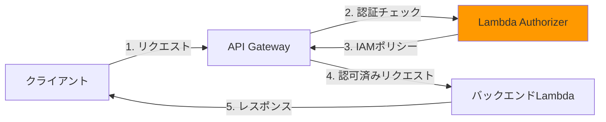
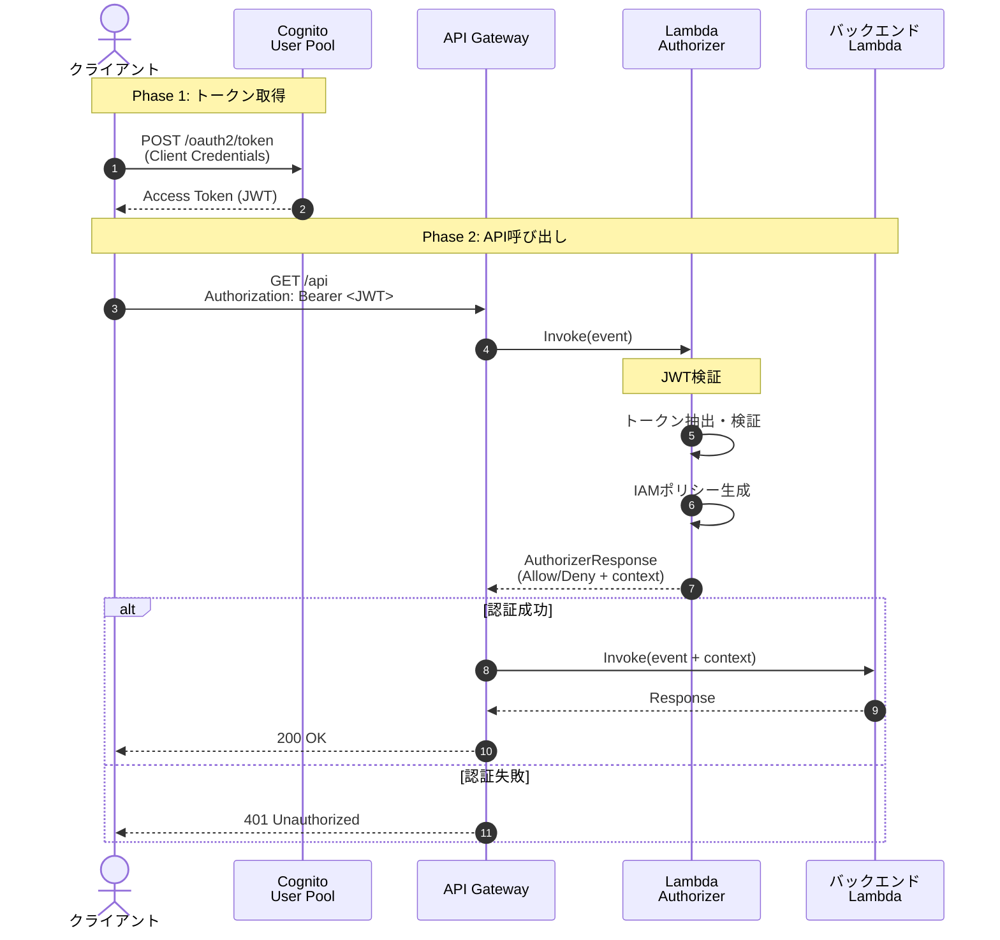
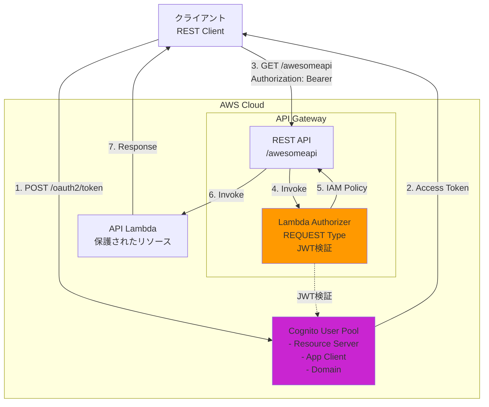

## こんな経験ありませんか？

API開発を進めていると、こんな壁にぶつかることがあります。

- **「API Keyだけでは不安。もっと柔軟な認証がしたい...」**
- **「Cognitoだけで完結できればいいけど、カスタムロジックも入れたい」**
- **「JWTトークンは使いたいけど、検証処理をどこに書けばいいの？」**

こうした課題を解決するのが、**Lambda Authorizer**です！

Lambda Authorizerを使うと「こんなに柔軟に認証処理を実装することができます！

この記事では、Lambda Authorizerの基礎から実装まで手を動かしながら学べる内容になっています！

## Lambda Authorizerとは

Lambda Authorizerは**API Gatewayのカスタム認証機能**です。 

Lambdaで認証ロジックを実装することで、外部のIdP（Identity Provider）や独自の認証基盤と連携することができます。



Lambda Authorizerの特徴は以下の通りです：

- **柔軟性**: 任意の認証ロジックを実装可能
- **統合性**: Cognito、Auth0、Oktaなど様々なIdPと連携
- **効率性**: 認証結果をキャッシュしてパフォーマンス向上
- **コスト**: Lambda実行分のみ課金（キャッシュ活用で削減可能）

### 他の認証方式との比較

| 認証方式 | 柔軟性 | 実装難易度 | ユースケース |
|---------|-------|----------|-------------|
| **API Key** | 低 | 簡単 | 開発環境、社内API |
| **IAM認証** | 中 | 難しい | AWS内部サービス間通信 |
| **Cognito Authorizer** | 中 | 普通 | Cognitoで完結する認証 |
| **Lambda Authorizer** | 高 | 普通〜難しい | カスタム認証、外部IdP連携 |

#### Lambda Authorizerを選ぶべき場面

- JWTトークンの検証が必要
- 独自の認証ロジック（例：デバイス制限、IP制限）を実装したい
- 複数のIdPを統合したい
- 認証時にカスタムデータを注入したい

## この記事で得られること

この記事を読むことで、以下のスキルが身につきます：

:::message
✅ Lambda Authorizerの仕組みと動作原理
✅ REQUESTタイプとTOKENタイプの使い分け
✅ Cognito OAuth2を使った認証基盤の構築
✅ JWT検証の実装パターン
✅ AWS CDKによるインフラのコード化
:::

### 前提知識と環境

この記事は以下の知識がある方を想定しています：

- AWSの基礎（Lambda、API Gateway、Cognitoの概念を理解している）
- TypeScript/JavaScriptの基本構文
- ターミナルの基本操作

必要な環境：
- Node.js 24.x（または18.x以上）
- AWS CLI（設定済み）
- AWS CDK 2.x
- エディタ（VS Code推奨）

インストール確認：

```bash
node --version  # v24.x.x
aws --version   # aws-cli/2.x.x
cdk --version   # 2.x.x
```

## Lambda Authorizerの仕組み

### 認証フローの全体像

Lambda Authorizerを使った認証は、以下の流れで行われます：



重要なポイント：

:::message
1. **クライアント認証**: OAuth2のClient Credentials Flowでアクセストークンを取得
2. **トークン送信**: Authorizationヘッダーに`Bearer <トークン>`形式で送信
3. **Lambda Authorizer実行**: API Gatewayが自動的に呼び出し
4. **JWT検証**: トークンの署名、有効期限、発行者をチェック
5. **IAMポリシー生成**: Allow/Denyを含むポリシーを返却
6. **コンテキスト注入**: カスタムデータをバックエンドLambdaに渡す
7. **キャッシュ**: 同じトークンの検証結果を一定時間保存
:::

### REQUESTタイプ vs TOKENタイプ

Lambda Authorizerには2つのタイプがあります。

| 項目 | REQUESTタイプ | TOKENタイプ |
|------|--------------|------------|
| **入力データ** | リクエスト全体（ヘッダー、パス、クエリ等） | トークンのみ |
| **キャッシュキー** | 指定した複数のパラメータ | トークン文字列 |
| **ユースケース** | 複雑な認証（IP、デバイス制限等） | シンプルなトークン検証 |
| **実装難易度** | やや複雑 | シンプル |
| **柔軟性** | 高い | 低い |

**今回はREQUESTタイプを使用します。** 理由は以下の通りです：

- リクエスト全体にアクセス可能（将来的な拡張性）
- キャッシュキーを細かく制御できる
- 実際のプロダクションでよく使われる

TOKENタイプは、純粋にJWT検証だけを行う場合に適しています。

### IAMポリシーの役割

Lambda Authorizerが返すIAMポリシーは「このリクエストを許可するか？」を決定します。

```typescript
// Lambda Authorizerが返すレスポンス
{
  principalId: "user-123",  // ユーザー識別子
  policyDocument: {         // IAMポリシー
    Version: "2012-10-17",
    Statement: [{
      Action: "execute-api:Invoke",
      Effect: "Allow",      // Allow または Deny
      Resource: "arn:aws:execute-api:..."  // 対象のARN
    }]
  },
  context: {                // カスタムデータ（省略可）
    userId: "123",
    role: "ADMIN"
  }
}
```

**context**パラメータが重要です。

ここに設定したデータはバックエンドLambdaで`event.requestContext.authorizer`から取得できます。**ユーザーID、ロール、権限情報など**を渡すことで、バックエンド側で認可処理を実装できます。

## 今回構築するシステム

### システム構成

以下のアーキテクチャを構築します：



### 技術スタック

| カテゴリ | 技術 | 用途 |
|---------|------|------|
| **IaC** | AWS CDK 2.x | インフラのコード化 |
| **認証基盤** | Amazon Cognito | OAuth2/OpenID Provider |
| **関数実行** | AWS Lambda (Node.js 24.x) | サーバーレス処理 |
| **API管理** | API Gateway (REST API) | エンドポイント提供 |
| **JWT検証** | aws-jwt-verify | JWT署名・有効期限チェック |
| **言語** | TypeScript | 型安全な開発 |

### セキュリティ設計のポイント

今回の実装で考慮するセキュリティ要素：

1. **JWT署名検証**: Cognitoの公開鍵で署名を検証
2. **トークン有効期限**: アクセストークン60分、リフレッシュトークン1日
3. **スコープ制御**: Resource Serverでスコープを定義
4. **キャッシュTTL**: 開発時は0秒、本番は30分程度
5. **HTTPS通信**: 全ての通信をTLS暗号化

## ハンズオン実装

それでは、実際に手を動かして実装していきましょう！このチュートリアルでは、既存のGitリポジトリをクローンして、すぐにLambda Authorizerを体験できます。

### Step 1: リポジトリのクローンと依存関係のインストール

まず、サンプルプロジェクトをクローンします。

```bash
# リポジトリをクローン
git clone https://github.com/mashharuki/lambda-authorizer-sample.git
cd lambda-authorizer-sample

# 依存関係をインストール
pnpm install
```

プロジェクト構造を確認しましょう：

```bash
tree -L 2 -I node_modules
```

```
lambda-authorizer-example/
├── bin/
│   └── app.ts                      # CDKアプリのエントリーポイント
├── lib/
│   ├── cognito-stack.ts            # Cognito構成
│   ├── api-gateway-stack.ts        # API Gateway + Lambda構成
│   └── lambda-authorizer-main-stack.ts  # メインスタック
├── src/
│   ├── custom-auth-lambda.ts       # Lambda Authorizer実装
│   └── api-lambda.ts               # 保護されたAPI実装
├── package.json
├── tsconfig.json
└── cdk.json
```

### Step 2: Cognitoドメインプレフィックスの変更（重要）

Cognitoのドメインプレフィックスは、**世界中で一意である必要があります**。　　
デプロイ前に変更しましょう。

`lib/cognito-stack.ts`を開き、以下の行を編集：

```typescript
// 26行目付近
const domain = this.cognitoUserPool.addDomain('awesome-cognito-domain', {
  cognitoDomain: {
    domainPrefix: '<yourname>-awesome-domain',  // ← ここを自分のユニークな値に変更
  },
});
```

例：
```typescript
domainPrefix: 'my-name-lambda-auth-20260114',  // 日付を入れると一意になりやすい
```

### Step 3: CDKブートストラップ（初回のみ）

AWS CDKを初めて使う場合、ブートストラップが必要です。

```bash
# AWS環境を確認
aws sts get-caller-identity

# CDKブートストラップ（初回のみ）
cdk bootstrap
```

### Step 4: デプロイ

いよいよデプロイです！

```bash
# デプロイ実行
pnpm run cdk deploy '*'

# 確認を求められたら「y」を入力
```

デプロイには3〜5分かかります。  

完了すると、CloudFormation Outputsが表示されます。

```
✅  LambdaAuthorizerMainStack

Outputs:
LambdaAuthorizerMainStack.UserPoolId = ap-northeast-1_XXXXXXXXX
LambdaAuthorizerMainStack.UserPoolAppClientId = 1a2b3c4d5e6f7g8h9i0j
LambdaAuthorizerMainStack.CognitoDomain = my-name-lambda-auth-20260114
LambdaAuthorizerMainStack.TokenEndpoint = https://my-name-lambda-auth-20260114.auth.ap-northeast-1.amazoncognito.com/oauth2/token
LambdaAuthorizerMainStack.ApiGatewayUrl = https://xxxxxxxxxx.execute-api.ap-northeast-1.amazonaws.com/prod/
LambdaAuthorizerMainStack.ApiGatewayEndpoint = https://xxxxxxxxxx.execute-api.ap-northeast-1.amazonaws.com/prod/awesomeapi
LambdaAuthorizerMainStack.AuthorizerLambdaArn = arn:aws:lambda:ap-northeast-1:xxxx:function:awesome-auth-lambda
LambdaAuthorizerMainStack.ApiLambdaArn = arn:aws:lambda:ap-northeast-1:xxxx:function:awesome-api-lambda
```

これらの値を**メモしておいてください**。  
次のステップで使用します。

## 動作確認

デプロイが完了したら、実際にAPIを呼び出してみましょう。

### Step 1: Client Secretの取得

App ClientのClient SecretはAWS Consoleから取得します。

1. AWS Consoleにログイン
2. **Cognito** サービスに移動
3. 作成したUser Poolを選択
4. 左メニューの **「アプリの統合」** → **「アプリケーションクライアント」** をクリック
5. 作成したApp Clientを選択
6. **「クライアントシークレット」** の **「表示」** をクリック
7. 表示されたシークレットをコピー

### Step 2: アクセストークンの取得

OAuth2のClient Credentials Flowでトークンを取得します。

```bash
# 環境変数を設定（値は自分の環境に合わせて変更）
export TOKEN_ENDPOINT="https://my-tutorial-app.auth.ap-northeast-1.amazoncognito.com/oauth2/token"
export CLIENT_ID="1a2b3c4d5e6f7g8h9i0j"
export CLIENT_SECRET="取得したClient Secret"

# トークンを取得
curl -X POST $TOKEN_ENDPOINT \
  -H "Content-Type: application/x-www-form-urlencoded" \
  -u "${CLIENT_ID}:${CLIENT_SECRET}" \
  -d "grant_type=client_credentials&scope=awesomeapi-resource-server/awesomeapi.read"
```

レスポンス例：

```json
{
  "access_token": "eyJraWQiOiJ...(長いJWT文字列)...HJw",
  "expires_in": 3600,
  "token_type": "Bearer"
}
```

`access_token`の値をコピーしてください。

### Step 3: APIを呼び出す

取得したトークンを使ってAPIを呼び出します。

```bash
# 環境変数を設定
export API_ENDPOINT="https://xxxxxxxxxx.execute-api.ap-northeast-1.amazonaws.com/prod/awesomeapi"
export ACCESS_TOKEN="取得したアクセストークン"

# 認証ありでAPIを呼び出す
curl -X GET $API_ENDPOINT \
  -H "Authorization: Bearer ${ACCESS_TOKEN}"
```

成功すると以下のようなレスポンスが返ります：

```json
{
  "message": "Hello from protected resource!",
  "userId": "123",
  "role": "ADMIN",
  "timestamp": "2026-01-13T12:34:56.789Z"
}
```

### Step 4: 認証なしでエラーを確認

トークンなしでAPIを呼び出すと、401エラーが返ることを確認します。

```bash
# 認証なしで呼び出す
curl -X GET $API_ENDPOINT
```

レスポンス：

```json
{
  "message": "Unauthorized"
}
```

### Step 5: CloudWatch Logsで確認

Lambda Authorizerの実行ログをCloudWatch Logsで確認できます。

1. AWS Consoleで **CloudWatch** に移動
2. 左メニューの **「ログ」** → **「ロググループ」** をクリック
3. `/aws/lambda/tutorial-auth-lambda` を選択
4. 最新のログストリームを開く

ログには以下のような情報が記録されています：

```
Lambda Authorizer invoked: {
  "headers": {
    "authorization": "Bearer eyJraWQiOi..."
  },
  "methodArn": "arn:aws:execute-api:..."
}

JWT verified successfully: {
  "sub": "1a2b3c4d-...",
  "client_id": "1a2b3c4d5e6f7g8h9i0j",
  "token_use": "access",
  ...
}

Authorizer response: {
  "principalId": "1a2b3c4d-...",
  "policyDocument": {...},
  "context": {...}
}
```

デバッグ時はこのログが非常に役立ちます。

## コードの解説（実装のポイント）

ここまでで、Lambda Authorizerを使った認証システムが動作しました。次に、各コンポーネントの実装について詳しく見ていきましょう。

### Cognitoスタックのポイント

`lib/cognito-stack.ts`では、OAuth2認証基盤を構築しています。

```typescript
// Resource Serverの作成
const resourceServer = new cognito.UserPoolResourceServer(
  this,
  'awesome-resource-server',
  {
    identifier: 'awesomeapi-resource-server',
    userPool: this.cognitoUserPool,
    scopes: [awesomeApiReadScope],  // スコープを定義
  }
);
```

**重要なポイント**:

1. **Resource Server**: APIをスコープで管理する単位。今回は`awesomeapi.read`スコープを定義
2. **App Client**: OAuth2のクライアント。`generateSecret: true`でClient Secretを生成
3. **Client Credentials Flow**: マシン間通信用のOAuth2フロー。ユーザーログイン不要
4. **トークン有効期限**: アクセストークン60分、リフレッシュトークン1日

### Lambda Authorizer関数のポイント

`src/custom-auth-lambda.ts`では、JWT検証と認可処理を実装しています。

```typescript
// JWT検証用のVerifierを初期化
const cognitoJwtVerifier = CognitoJwtVerifier.create({
  userPoolId: process.env.USERPOOL_ID || '',
  clientId: process.env.CLIENT_ID,
  tokenUse: 'access',  // アクセストークンを検証
});

export const handler = async function (event: any): Promise<APIGatewayAuthorizerResult> {
  // Step 1: Authorizationヘッダーからトークンを抽出
  const authHeader = event.headers['authorization'] || '';
  const authToken = authHeader.replace(/^Bearer\s+/i, '');

  try {
    // Step 2: JWTを検証
    const decodedJWT = await cognitoJwtVerifier.verify(authToken);

    // Step 3: IAMポリシーを生成
    const policyDocument: PolicyDocument = {
      Version: '2012-10-17',
      Statement: [{
        Action: 'execute-api:Invoke',
        Effect: 'Allow',  // アクセスを許可
        Resource: event['methodArn'],
      }],
    };

    // Step 4: カスタムコンテキストを作成
    const context = {
      userId: '123',
      companyId: '456',
      role: 'ADMIN',
    };

    // Step 5: レスポンスを返す
    return {
      principalId: decodedJWT.sub,
      policyDocument,
      context,
    };
  } catch (err) {
    throw new Error('Unauthorized');
  }
};
```

**実装のポイント**:

1. **トークン抽出**: `Bearer `プレフィックスを削除（大文字小文字を区別しない）
2. **JWT検証**: `aws-jwt-verify`ライブラリが署名、有効期限、発行者を自動検証
3. **IAMポリシー**: `Effect: 'Allow'`で認可、`Deny`で拒否
4. **カスタムコンテキスト**: バックエンドLambdaに渡したいデータを設定
5. **エラーハンドリング**: 検証失敗時は`Unauthorized`をスロー（API Gatewayが401を返す）

### API Lambda関数のポイント

`src/api-lambda.ts`では、保護されたAPIリソースを実装しています。

```typescript
export const handler = async function (event: APIGatewayProxyEventV2): Promise<APIGatewayProxyResultV2> {
  // Lambda Authorizerから渡されたコンテキストを取得
  const authorizer = (event.requestContext as any).authorizer;

  // contextに設定した値を利用できる
  const userId = authorizer?.userId;
  const role = authorizer?.role;

  return {
    statusCode: 200,
    body: JSON.stringify({
      message: 'Hello from protected resource(Lambda Authorizer)',
      userId: userId,
      role: role,
    }),
  };
};
```

**実装のポイント**:

- `event.requestContext.authorizer`から、Lambda Authorizerで設定したコンテキストにアクセス
- ここで取得した情報を使って、詳細な認可処理を実装可能

### API Gatewayスタックのポイント

`lib/api-gateway-stack.ts`では、API GatewayとLambda Authorizerを統合しています。

```typescript
// Lambda Authorizer（REQUESTタイプ）を作成
const authorizer = new apigw.RequestAuthorizer(this, 'awesome-api-request-authorizer', {
  handler: authLambda,
  identitySources: [apigw.IdentitySource.header('authorization')],
  resultsCacheTtl: cdk.Duration.minutes(30),
});

// APIメソッドにAuthorizerを紐付け
awesomeApiResource.addMethod(
  'GET',
  new apigw.LambdaIntegration(apiLambda),
  {
    authorizer: authorizer,
    authorizationType: apigw.AuthorizationType.CUSTOM,
  }
);
```

**重要な設定**:

1. **RequestAuthorizer**: REQUESTタイプを使用（リクエスト全体にアクセス可能）
2. **identitySources**: キャッシュキーとなるパラメータ（`authorization`ヘッダー）
3. **resultsCacheTtl**: キャッシュの有効期限（開発時は`Duration.seconds(0)`推奨）
4. **authorizationType**: `CUSTOM`を指定してLambda Authorizerを使用

### REQUESTタイプを選んだ理由

今回はREQUESTタイプを採用しました。理由は以下の通りです：

| 理由 | 説明 |
|------|------|
| **将来の拡張性** | IPアドレス制限、デバイス制限など、ヘッダー以外の情報も活用できる |
| **キャッシュ制御** | 複数のパラメータを組み合わせてキャッシュキーを作成可能 |
| **実践的** | 本番環境でよく使われるパターン |

コメントアウトされているTOKENタイプの実装も参考にしてください：

```typescript
// Lambda Authorizer with 'TOKEN' type（コメントアウト済み）
// const authorizer = new apigw.TokenAuthorizer(this, 'awesome-api-authorizer', {
//   handler: authLambda,
//   identitySource: apigw.IdentitySource.header('authorization'),
//   resultsCacheTtl: cdk.Duration.seconds(0),
// });
```

TOKENタイプは、シンプルなJWT検証のみを行う場合に適しています。

## クリーンアップ（リソースの削除）

チュートリアルが終わったら、AWSリソースを削除して課金を停止しましょう。

### CDKでの削除

```bash
# スタックを削除
cdk destroy

# 確認を求められたら「y」を入力
```

削除には2〜3分かかります。以下のリソースが削除されます：

- Cognito User Pool
- Lambda関数（2つ）
- API Gateway
- CloudWatch Logs
- IAMロール

### 手動確認（任意）

念のため、AWS Consoleで以下を確認してください：

1. **CloudFormation**
   - スタック「LambdaAuthorizerMainStack」が削除されているか確認

2. **Cognito**
   - User Poolが削除されているか確認

3. **Lambda**
   - `awesome-auth-lambda`と`awesome-api-lambda`が削除されているか確認

4. **API Gateway**
   - APIが削除されているか確認

### CDKブートストラップリソース（残しても可）

CDKブートストラップで作成されたリソース（S3バケット等）は残ります。これらは他のCDKプロジェクトでも使用されるため、通常は削除不要です。

もし完全に削除したい場合：

```bash
# CDKToolkitスタックを削除
aws cloudformation delete-stack --stack-name CDKToolkit
```

⚠️ **注意**: 他のCDKプロジェクトがある場合は削除しないでください。

## よくあるトラブルと対処法

### エラー1: "Unauthorized"が返る

**症状**: APIを呼び出すと常に401エラーが返る

**原因と対処法**:

1. **トークンが期限切れ**
   - アクセストークンは60分で期限切れ
   - 新しいトークンを取得し直す

2. **スコープが不一致**
   ```bash
   # スコープを確認
   echo $ACCESS_TOKEN | cut -d'.' -f2 | base64 -d | jq .scope
   ```
   - `awesomeapi-resource-server/awesomeapi.read`が含まれているか確認

3. **JWT検証エラー**
   - CloudWatch Logsでエラー内容を確認
   - `USERPOOL_ID`と`CLIENT_ID`の環境変数が正しいか確認

### エラー2: "Access Denied"エラー

**症状**: Lambda Authorizerは成功するが、バックエンドLambdaにアクセスできない

**原因と対処法**:

- IAMポリシーの`Effect`が`Deny`になっている
- `methodArn`が正しく設定されているか確認
- Lambda Authorizerのコードで`Effect: 'Allow'`になっているか確認

### エラー3: キャッシュが効きすぎる

**症状**: トークンを変更しても、古い結果が返る

**原因と対処法**:

- `resultsCacheTtl`の設定を確認
- 開発時は`Duration.seconds(0)`に設定
- 本番環境では適切な値（30分程度）に設定

```typescript
// 開発環境用の設定
resultsCacheTtl: cdk.Duration.seconds(0),

// 本番環境用の設定
resultsCacheTtl: cdk.Duration.minutes(30),
```

### エラー4: "Internal Server Error"

**症状**: 500エラーが返る

**原因と対処法**:

- Lambda関数内で例外が発生している
- CloudWatch Logsでスタックトレースを確認
- よくある原因：
  - `aws-jwt-verify`がバンドルされていない
  - 環境変数が未設定
  - TypeScriptのビルドエラー

## 実践的な応用例

### 応用1: カスタムコンテキストの活用

Lambda Authorizerで設定したcontextを、バックエンドLambdaで活用できます。

```typescript
// custom-auth-lambda.ts
const context = {
  userId: decodedJWT.sub,  // JWTから取得
  email: decodedJWT.email,
  scope: decodedJWT.scope,
  companyId: '456',  // 外部DBから取得した情報も注入可能
  role: 'ADMIN',
};
```

```typescript
// api-lambda.ts
export const handler = async (event: any) => {
  const { userId, role, companyId } = event.requestContext.authorizer;

  // ロールベースのアクセス制御
  if (role !== 'ADMIN') {
    return {
      statusCode: 403,
      body: JSON.stringify({ message: 'Forbidden' }),
    };
  }

  // ユーザー固有のデータを取得
  const userData = await getUserData(userId, companyId);
  
  return {
    statusCode: 200,
    body: JSON.stringify(userData),
  };
};
```

### 応用2: 複数のスコープ管理

Resource Serverに複数のスコープを定義し、Lambda Authorizerでチェックできます。

```typescript
// cognito-stack.ts
const readScope = new cognito.ResourceServerScope({
  scopeName: 'awesomeapi.read',
  scopeDescription: 'Read access',
});

const writeScope = new cognito.ResourceServerScope({
  scopeName: 'awesomeapi.write',
  scopeDescription: 'Write access',
});

const resourceServer = new cognito.UserPoolResourceServer(
  this,
  'ResourceServer',
  {
    identifier: 'awesomeapi',
    userPool: this.cognitoUserPool,
    scopes: [readScope, writeScope],
  }
);
```

```typescript
// custom-auth-lambda.ts
const decodedJWT = await cognitoJwtVerifier.verify(authToken);

// スコープの確認
const scopes = decodedJWT.scope?.split(' ') || [];

if (!scopes.includes('awesomeapi-resource-server/awesomeapi.read')) {
  console.error('Insufficient scope');
  throw new Error('Unauthorized');
}

// contextにスコープ情報を含める
const context = {
  userId: decodedJWT.sub,
  scopes: decodedJWT.scope,
};
```

### 応用3: 外部IdPとの連携

Auth0やOktaなどの外部IdPと連携する場合も、JWT検証ロジックを変更するだけです。

```typescript
// 外部IdP用のJWT検証（例: Auth0）
import { createRemoteJWKSet, jwtVerify } from 'jose';

const JWKS = createRemoteJWKSet(
  new URL('https://YOUR_DOMAIN.auth0.com/.well-known/jwks.json')
);

export const handler = async (event: any) => {
  const authToken = extractToken(event);

  try {
    // Auth0のJWTを検証
    const { payload } = await jwtVerify(authToken, JWKS, {
      issuer: 'https://YOUR_DOMAIN.auth0.com/',
      audience: 'YOUR_AUDIENCE',
    });

    // 以降の処理は同じ
    const policyDocument = generatePolicy('Allow', event.methodArn);
    
    return {
      principalId: payload.sub,
      policyDocument,
      context: {
        userId: payload.sub,
        email: payload.email,
      },
    };
  } catch (err) {
    throw new Error('Unauthorized');
  }
};
```

## まとめ

この記事ではLambda Authorizerの基礎から実装まで一通り学びました！

### この記事で学んだこと

✅ Lambda Authorizerの仕組みと動作原理
✅ REQUESTタイプとTOKENタイプの違い
✅ Cognito OAuth2を使った認証基盤の構築
✅ JWT検証の実装パターン
✅ AWS CDKによるインフラのコード化
✅ カスタムコンテキストの活用方法

Lambda Authorizerは柔軟な認証を実現する強力な機能です。

最初は複雑に感じるかもしれませんが、一度理解すれば様々なユースケースに応用できます。

ここまで読んでいただきありがとうございました！

### 参考文献

**AWS公式ドキュメント**:
- [Use API Gateway Lambda authorizers](https://docs.aws.amazon.com/apigateway/latest/developerguide/apigateway-use-lambda-authorizer.html)
- [Configure Lambda authorizer](https://docs.aws.amazon.com/apigateway/latest/developerguide/configure-api-gateway-lambda-authorization.html)
- [Input to Lambda authorizer](https://docs.aws.amazon.com/apigateway/latest/developerguide/api-gateway-lambda-authorizer-input.html)

**ライブラリ・仕様**:
- [aws-jwt-verify (GitHub)](https://github.com/awslabs/aws-jwt-verify)
- [OAuth 2.0 仕様 (RFC 6749)](https://datatracker.ietf.org/doc/html/rfc6749)
- [JWT 仕様 (RFC 7519)](https://datatracker.ietf.org/doc/html/rfc7519)

