# はじめに

これまでJWTやアクセストークンをテーマに記事をいくつか書いてきましたが今回はその集大成としてトークンベース認証アプリをAWS上に構築してみた時の技術ブログ記事になります！

https://zenn.dev/mashharuki/articles/how_to_use_jwt-1

https://zenn.dev/mashharuki/articles/access_token-1

https://zenn.dev/mashharuki/articles/aws-lambda-authorizer-beginners-tutorial

ぜひ最後まで読んでいってください！

# ※注意事項※

:::message alert
本記事で紹介しているソースコード等は検証・学習用です。

参考程度に参照ください。
:::

# トークンベース認証とは

まずは改めて**トークンベース認証**についておさらいしていきます！

## そもそも「認証」って何？

Webアプリにおける**認証（Authentication）** とは、「あなたは本当にあなたですか？」を確認するプロセスのことです。

身近な例で考えると、会社のオフィスに入る時に**社員証**を見せる行為がまさに認証です。

認証の方式はいくつかありますが、大きく分けると以下の2つに分類できます。

| 方式 | 仕組み | 身近な例 |
|------|--------|----------|
| **セッションベース** | サーバー側でログイン状態を記憶する | 受付で名前を伝えて入館証をもらう |
| **トークンベース** | クライアント側が証明書を持つ | 事前に発行された社員証を見せる |

## セッションベース認証の課題

従来のWebアプリでは**セッションベース認証**が主流でした。

しかし、この方式にはいくつかの課題があります。

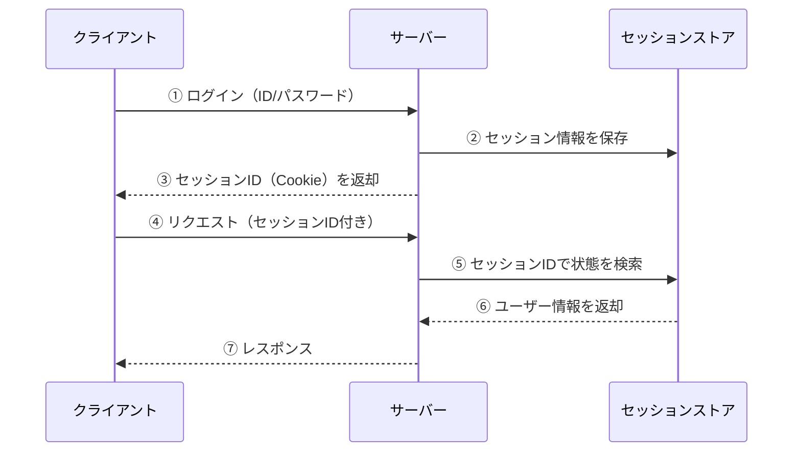

:::message alert
**セッションベース認証の課題**
- **サーバーの負担が大きい**: ユーザーが増えるとセッション情報の管理コストが増大する
- **スケールしにくい**: 複数サーバーでセッション情報を共有する仕組みが必要
- **ステートフル**: サーバーが状態を持つため、障害時に情報が失われるリスクがある
:::

## トークンベース認証の仕組み

トークンベース認証では、サーバーがログイン状態を記憶する代わりに、**クライアント側がトークン（証明書）を保持**します。

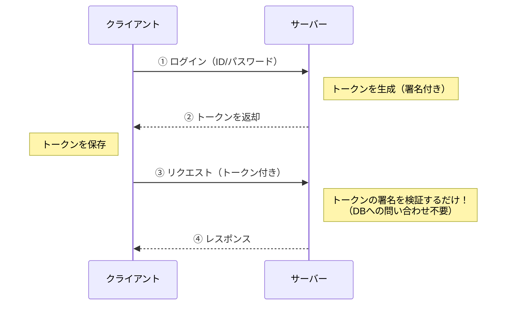

ここがポイントです。

サーバーは**トークンの署名を検証するだけ**で、セッション情報をデータベースに問い合わせる必要がありません。

## トークンの種類を理解しよう

トークンベース認証で使われる主なトークンは以下の3つです。

### 1. アクセストークン（Access Token）

APIにアクセスするための**短命なトークン**です。  
リソースへのアクセス権限を証明します。

- **有効期限**: 数分〜数十分（短い方が安全）
- **用途**: APIリクエストの認証
- **保存場所**: メモリ上（推奨）

### 2. リフレッシュトークン（Refresh Token）

アクセストークンを**再発行するためのトークン**です。  
ユーザーに再ログインを求めずに新しいアクセストークンを取得できます。

- **有効期限**: 数日〜数週間（アクセストークンより長い）
- **用途**: アクセストークンの更新
- **保存場所**: HttpOnly Cookie（推奨）

### 3. IDトークン（ID Token）

ユーザーの**身元情報を含むトークン**です。  
OpenID Connect（OIDC）で規定されています。

- **有効期限**: 数分〜1時間
- **用途**: ユーザー情報の取得・確認
- **形式**: JWT（JSON Web Token）

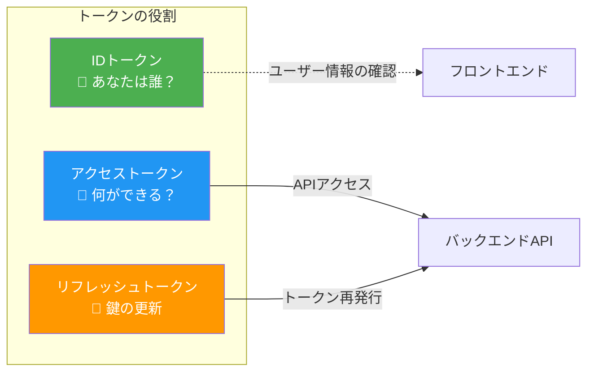

## アクセストークンとリフレッシュトークンの連携フロー

実際のアプリではアクセストークンとリフレッシュトークンを組み合わせて使うのが一般的です。

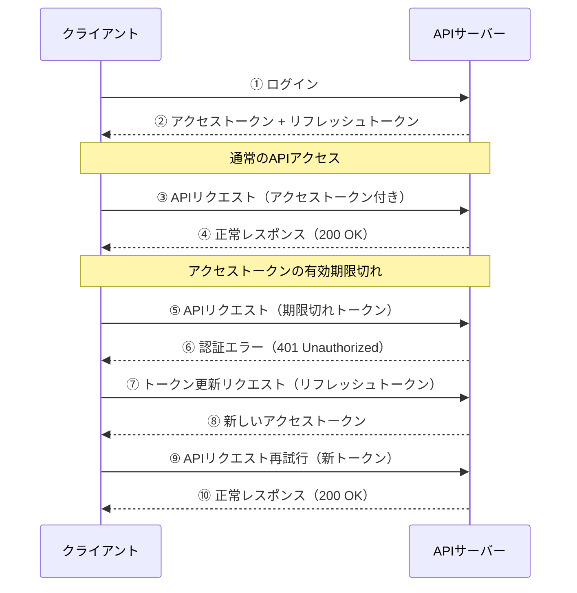

:::message
**なぜトークンを2種類に分けるの？**

セキュリティと利便性のバランスを取るためです。

- **アクセストークンだけの場合**
  - 有効期限を長くすると漏洩リスクが高い。
  - 短くするとユーザーが頻繁にログインを求められる。
- **リフレッシュトークンを併用する場合**
  - アクセストークンは短命にしてセキュリティを確保しつつ、ユーザーは再ログイン不要で快適に利用できる。
:::

## トークンベース認証のメリットまとめ

| メリット | 説明 |
|---------|------|
| **ステートレス** | サーバーがセッション情報を持たないためスケールしやすい |
| **クロスドメイン対応** | CookieベースのセッションIDと異なり、異なるドメインのAPIにもトークンを送信できる |
| **モバイル対応** | Cookieに依存しないため、モバイルアプリでも使いやすい |
| **マイクロサービス向き** | 各サービスが独立してトークンを検証できる |

# トークンベース認証とサーバーレス

トークンベース認証の**ステートレス性**はサーバーレスアーキテクチャと非常に相性が良いです。

ここではなぜサーバーレスとトークンベース認証が優れた組み合わせなのかを解説していきます！

## サーバーレスアーキテクチャとは

サーバーレスとは、**サーバーの管理をクラウドプロバイダーに任せて、開発者はコードだけに集中できる**アーキテクチャのことです。

AWSにおける代表的なサーバーレスサービスは以下の通りです。

| サービス | 役割 |
|---------|------|
| **API Gateway** | APIのエンドポイント管理・ルーティング |
| **Lambda** | ビジネスロジックの実行 |
| **DynamoDB** | データの永続化（NoSQL） |
| **Cognito** | ユーザー認証・認可 |

## なぜサーバーレスとトークンベース認証は相性が良いのか？

### 理由①：ステートレスの一致

サーバーレス（Lambda）は**リクエストごとに新しいインスタンスが起動**します。  
そのため、サーバー側で状態（セッション）を持つセッションベース認証とは相性が悪いです。

一方、トークンベース認証は**サーバーが状態を持たない（ステートレス）** ためLambdaのようなエフェメラルな実行環境とぴったりマッチします。

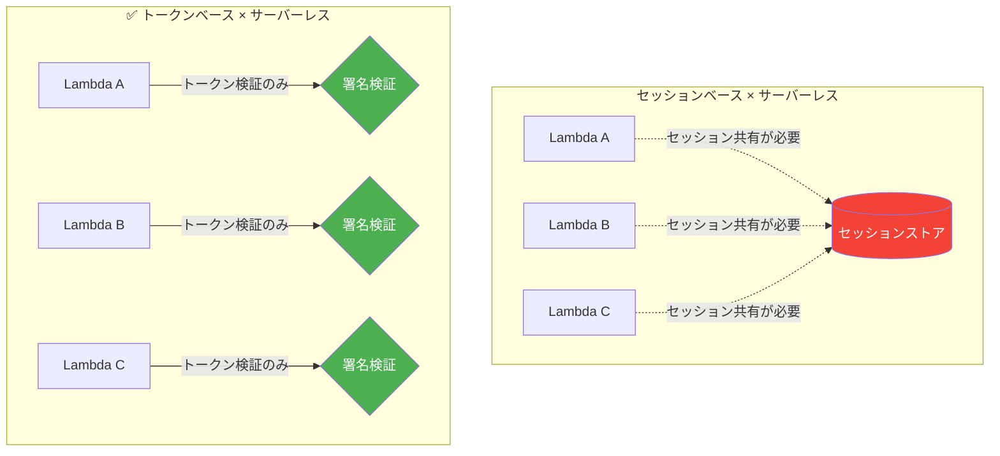

### 理由②：Lambda Authorizerとの統合

AWS API Gatewayには**Lambda Authorizer**という強力な認証機能があります。これにより、トークンの検証ロジックをLambda関数として実装し、API Gatewayレベルで認証を一元管理できます。

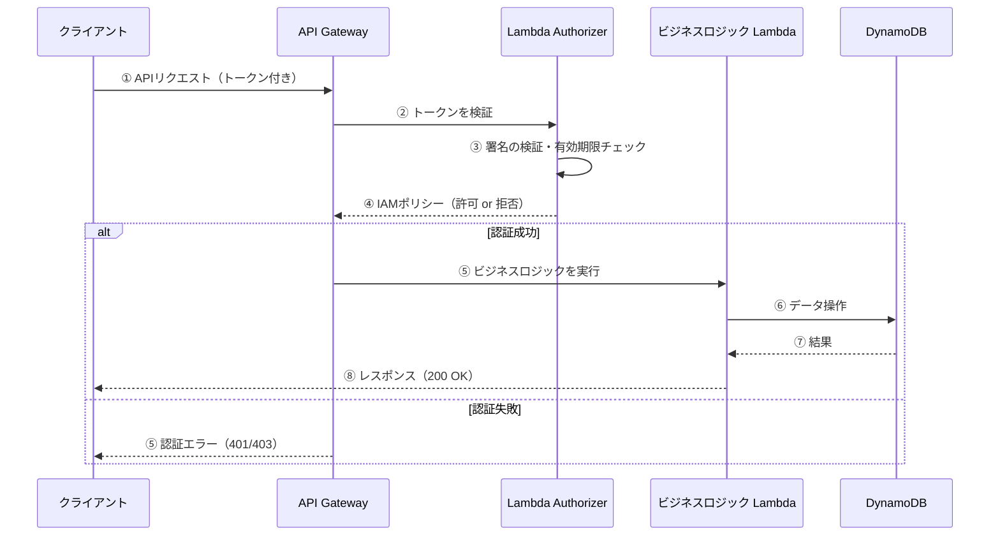

:::message
**Lambda Authorizerのメリット**
- 認証ロジックをビジネスロジックから**完全に分離**できる
- 認証結果を**キャッシュ**できるためパフォーマンスが向上する
- Cognito、Auth0、独自認証など**様々なIdPと連携**可能
:::

### 理由③：Cognitoとの連携でトークン管理が楽になる

AWS Cognitoを使うと、トークンの発行・検証・更新をマネージドサービスに任せることができ、開発者はビジネスロジックに集中できます。

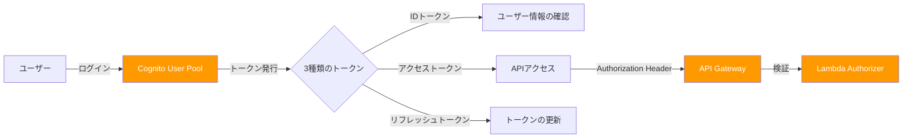

### 理由④：コスト効率

サーバーレス + トークンベース認証の組み合わせは、コスト面でも大きなメリットがあります。

- **Lambda**: リクエスト単位の従量課金。アイドル時はコストゼロ
- **API Gateway**: リクエスト数に応じた課金
- **DynamoDB**: オンデマンドキャパシティなら使った分だけ
- **Cognito**: 月間5万ユーザーまでは無料

セッションベース認証のように常時稼働するセッションストア（ElastiCache, RDS等）が不要なため、**特にトラフィックが変動するアプリケーション**においてコストメリットが大きいです。

## 今回のアプリにおけるアーキテクチャの全体像

本記事で構築するアプリは、これらのサーバーレスサービスを組み合わせたトークンベース認証の実践例です。

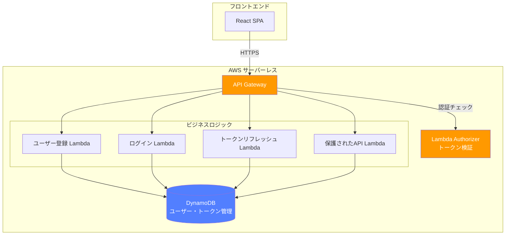

この後のセクションでは、このアーキテクチャを実際にAWS CDKで構築していきます！

# 今回試したサンプルコード

今回解説するソースコードは以下のリポジトリに格納しています！  

`cc-sdd`を使ってSpec駆動開発で開発をしました！

https://github.com/mashharuki/AWS-AccessToken-sample-app

## 今回開発したアプリのアーキテクチャ

- **目的**: アクセストークン/リフレッシュトークンの仕組みを学習するためのサンプル
- **構成**: モノレポ (pnpm workspace)
- **パッケージマネージャー**: pnpm@10.20.0
- **フロントエンド**: React 19.2.0 + Vite 7.2.4 + TypeScript 5.9.3 + React Router v7.12.0
- **バックエンド**: Hono 4.11.4 + Node.js 24.x (ESM) + TypeScript 5.8.3
- **認証・セキュリティ**: 
  - JWT処理: jose@6.1.3
  - パスワードハッシング: bcryptjs@2.4.3
  - CSRF保護実装済み
- **データベース**: AWS DynamoDB
  - UsersTable (GSI: username-index)
  - SessionsTable (TTL有効)
  - RefreshTokensTable (TTL有効)
  - CsrfTokensTable (TTL有効)
- **AWS SDK**: @aws-sdk/client-dynamodb@3.974.0, @aws-sdk/lib-dynamodb@3.974.0
- **テスティング**: Vitest 4.0.17 (Frontend: 46テスト, Backend: 115テスト)
- **Linter/Formatter**: Biome 2.3.11 (ルート), ESLint 9.39.1 (フロントエンド)
- **インフラ**: AWS CDK (Lambda, API Gateway, CloudFront, S3, DynamoDB)
- **認証方式**: Access Tokenはレスポンスで返却、Refresh TokenはHttpOnly Cookieで保持

### AWS インフラストラクチャ

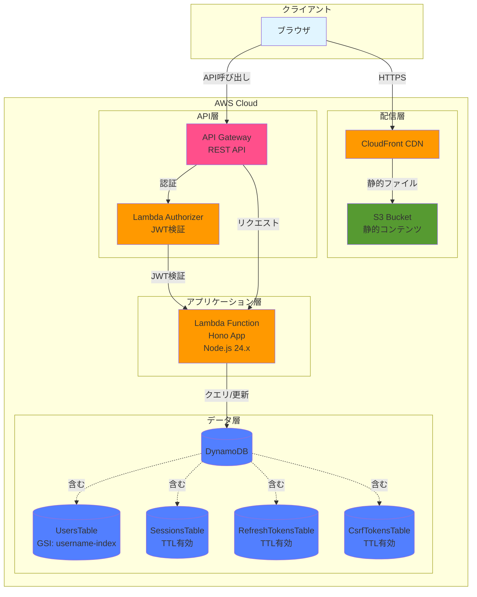

### アプリケーション層の詳細

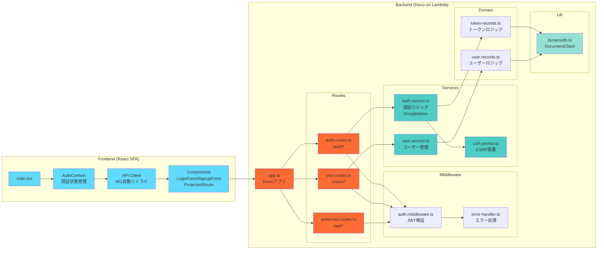

## 機能一覧表

### 認証・認可
1. **ユーザー登録**（POST /auth/signup）
   - bcryptjsによるパスワードハッシング
   - DynamoDB UsersTableへの永続化
   - ユーザー名の重複チェック（GSI活用）

2. **ログイン**（POST /auth/login）
   - bcryptjsによるパスワード検証
   - JWT（jose）によるAccess Token発行
   - HttpOnly CookieによるRefresh Token発行
   - セッション管理（DynamoDB SessionsTable）
   - CSRF Token発行（DynamoDB CsrfTokensTable）

3. **トークンリフレッシュ**（POST /auth/refresh）
   - Refresh Token検証とAccess Token再発行
   - セッションの有効性確認
   - CSRF Token検証

4. **ログアウト**（POST /auth/logout）
   - セッション無効化
   - Refresh Token削除
   - CSRF Token削除

### 保護リソース
5. **保護リソース取得**（GET /api/protected）
   - JWT認証ミドルウェア
   - Access Token検証

6. **ユーザー情報取得**（GET /users/me）
   - 認証済みユーザーの情報取得
   - DynamoDB UsersTableからの取得

7. **ユーザー一覧取得**（GET /users）
   - 全ユーザー一覧（認証必須）

### フロントエンド機能
8. **401時の自動リトライ**（createApiClient）
   - トークン期限切れ時の自動リフレッシュ
   - 最大1回のリトライ

9. **認可ガードとルーティング**（ProtectedRoute）
   - 未認証時のログインページへのリダイレクト
   - React Router v7統合

10. **トークンデバッグ表示**（TokenDebugPanel）
    - 開発環境でのJWT情報表示
    - 有効期限カウントダウン

### インフラストラクチャ
11. **Lambda Authorizer**（authorizer.ts）
    - AWS API Gateway統合
    - JWT検証とIAMポリシー生成

12. **CSRF保護**（csrf.service.ts）
    - ダブルサブミットクッキーパターン
    - DynamoDB CsrfTokensTableでのトークン管理

## 機能毎の処理シーケンス図

### 認証フロー概要

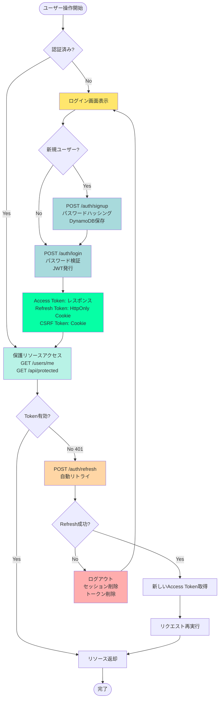

### ログイン

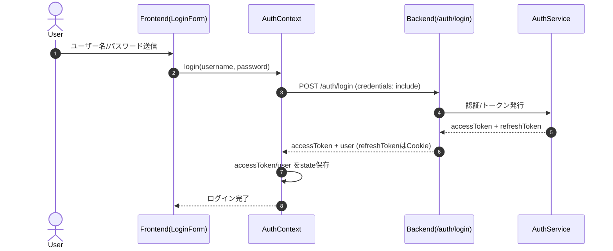

### アクセストークンのリフレッシュ

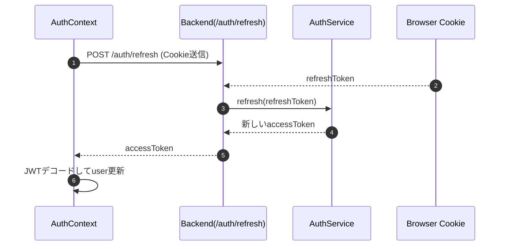

### 保護リソース取得

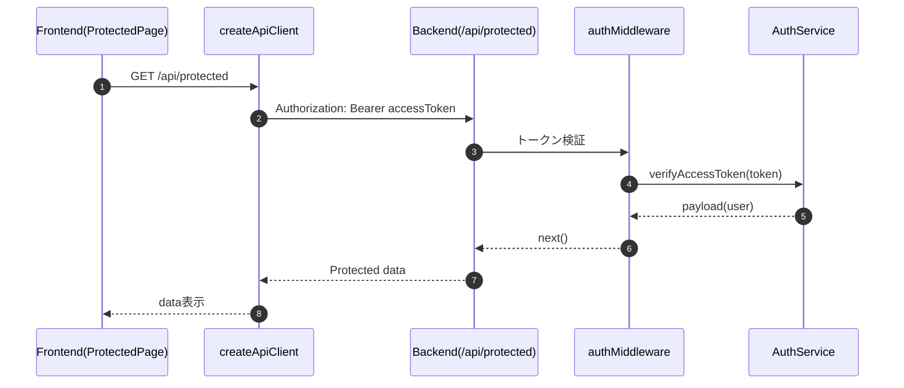

### 401時の自動リトライ

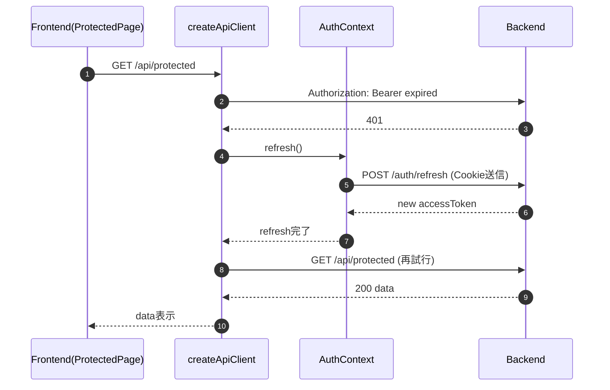

### 認可ガードとルーティング

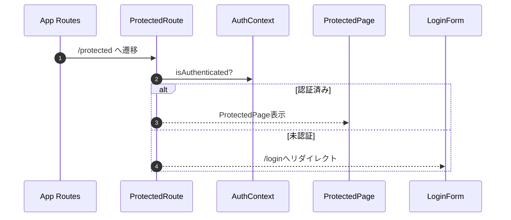

### トークンデバッグ表示（devのみ）

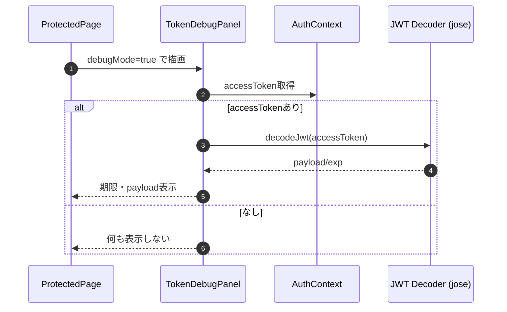

### ログイン失敗（認証エラー）

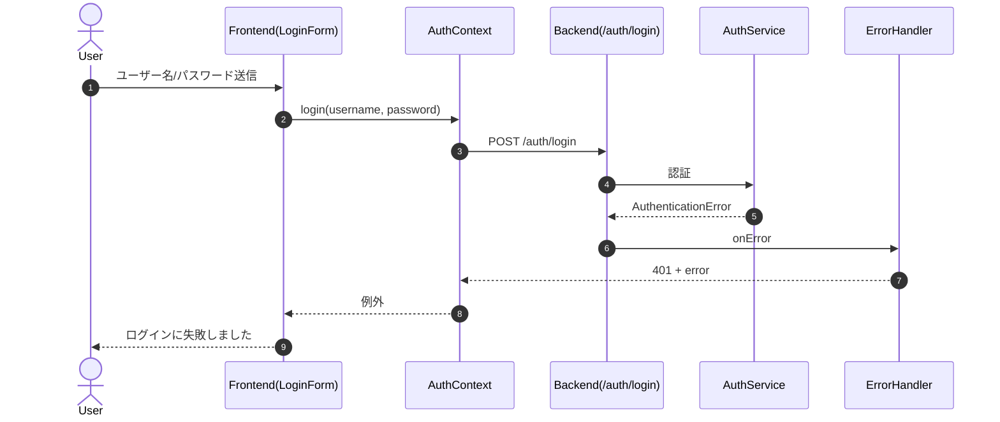

### リフレッシュ失敗（トークン不正/期限切れ）

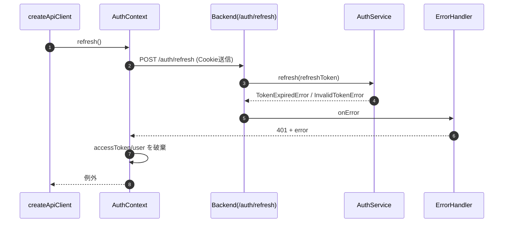

### 保護リソース取得失敗（Authorizationヘッダ不正）

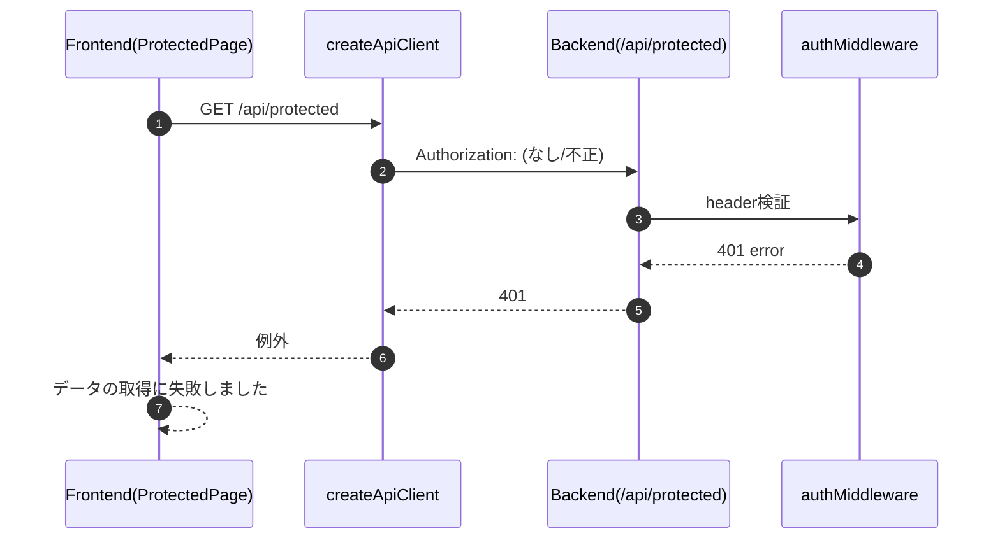

## アプリのスクショ

アプリの動作イメージを共有します。

ログインに成功すると保護されたページに遷移できるようなアプリです。


セキュリティ上の観点からトークンはCookieの中に詰めるようにしています。


以下はアクセストークンのサンプル例です！


トークンやセッション情報はDynamoDBに格納するようにしています。


## 動かし方

では動かし方の説明です！

### 依存関係インストール

```bash
pnpm i
```

### ビルド

以下のコマンドを順番に実行してビルドエラーが起きないことを確認します。

```bash
# フロントエンド
pnpm frontend build

# バックエンド
pnpm backend build

# CDK
pnpm cdk build
```

### CDKデプロイ

ではビルドで問題が起きないことを確認できたのでいよいよリソースをまとめてAWS上にデプロイします！

```bash
# デプロイ
pnpm cdk deploy   
```


### リソースのクリーンナップ

検証が終わったら忘れずにリソースを削除しましょう！

```bash
pnpm cdk destroy '*'
```

### ログ例

アクセストークンの検証に成功した時のログは以下のようになるはずです！

ちゃんとLambda AuthorizerからユーザーIDとユーザー名が渡されていますね！

```bash
Verified access token payload: {
  sub: 'user-demo-001',
  username: 'demo',
  iat: 1768794320,
  exp: 1768795220
}
```

## ソースコードの解説

### バックエンド

バックエンドのフレームワークにはHonoを使っており、ミドルウェアを使ってLambda向けハンドラーとしてラップしています。

```ts
import "dotenv/config";
import { handle } from "hono/aws-lambda";
import { createApp } from "./app.js";

// Hono Appインスタンスを作成
const app = createApp();

// Lambdaハンドラーをエクスポート
export const handler = handle(app);
```

ローカルでも検証できるようにしています。

```ts
import { serve } from "@hono/node-server";
import "dotenv/config";
import { createApp } from "./app.js";

// Hono Appインスタンスを作成
const app = createApp();

// Appをローカルサーバーで起動
serve(
  {
    fetch: app.fetch,
    port: 3001,
  },
  (info) => {
    console.log(`Server is running on http://localhost:${info.port}`);
  },
);
```

**Lambda Authorizers**の実装は以下のような感じで、アクセストークンの取り出しと検証、IAMポリシーの作成を担当しています。

```ts
import "dotenv/config";
import { AuthorizerService } from "./services/authorizer.service.js";

type AuthorizerEvent = {
  authorizationToken?: string;
  methodArn: string;
};

type PolicyDocument = {
  Version: "2012-10-17";
  Statement: Array<{
    Action: "execute-api:Invoke";
    Effect: "Allow" | "Deny";
    Resource: string;
  }>;
};

type AuthorizerResponse = {
  principalId: string;
  policyDocument: PolicyDocument;
  context?: Record<string, string>;
};

const authorizerService = new AuthorizerService();

/**
 * Lambda Authorizerのポリシードキュメントを構築する
 * @param principalId 
 * @param effect 
 * @param resource 
 * @param context 
 * @returns 
 */
const buildPolicy = (
  principalId: string,
  effect: "Allow" | "Deny",
  resource: string,
  context?: Record<string, string>,
): AuthorizerResponse => ({
  principalId,
  policyDocument: {
    Version: "2012-10-17",
    Statement: [
      {
        Action: "execute-api:Invoke",
        Effect: effect,
        Resource: resource,
      },
    ],
  },
  context,
});

/**
 * Authorizationヘッダーからトークンを抽出する
 * @param authorizationToken 
 * @returns 
 */
const extractToken = (authorizationToken?: string) => {
  if (!authorizationToken) {
    return "";
  }
  const trimmed = authorizationToken.trim();
  if (trimmed.toLowerCase().startsWith("bearer ")) {
    return trimmed.slice(7).trim();
  }
  return trimmed;
};

/**
 * Lambda Authorizer for API Gateway
 * @param event
 * @returns
 */
export const handler = async (
  event: AuthorizerEvent,
): Promise<AuthorizerResponse> => {
  // アクセストークンの取得
  const token = extractToken(event.authorizationToken);
  // アクセストークンの検証
  const result = await authorizerService.validateAccessToken({ token });

  if (result.status === "Allow") {
    // アクセストークンが有効な場合、許可ポリシーを返す
    // contextにユーザー情報を含める(ユーザーIDとユーザー名)
    // ここで詰めた値は後続のlambdaに渡せる
    return buildPolicy(result.principalId, "Allow", event.methodArn, {
      userId: result.context.userId,
      username: result.context.username,
    });
  }

  return buildPolicy("unauthorized", "Deny", event.methodArn);
};
```

一番肝となるアクセストークンの発行や検証は以下のファイルにて実装しています！

https://github.com/mashharuki/AWS-AccessToken-sample-app/blob/main/pkgs/backend/src/services/auth.service.ts

### フロントエンド

認証系のAPIを呼び出す処理は全て`auth-context.tsx`に実装しています。

https://github.com/mashharuki/AWS-AccessToken-sample-app/blob/main/pkgs/frontend/src/contexts/auth-context.tsx

ポイントは各APIの呼び出し時に`credentials: "include",`オプションをつけてトークンなどをCookieに詰めているところです。

```ts
// login API呼び出し
const res = await fetch(`${API_BASE_URL}/auth/login`, {
  method: "POST",
  headers: {
    "Content-Type": "application/json",
  },
  credentials: "include",
  body: JSON.stringify({ username, password }),
});
```

トークン更新の部分のAPI呼び出しの実装は以下のようになっています！

```ts
// refresh API呼び出し
const res = await fetch(`${API_BASE_URL}/auth/refresh`, {
  method: "POST",
  credentials: "include",
});

if (!res.ok) {
  throw new Error("Refresh failed");
}

const data = (await res.json()) as RefreshResponse;
if (!data.accessToken) {
  throw new Error("Invalid refresh response");
}

// レスポンスとして帰ってきたアクセストークンをデコードする
const payload = decodeJwt(data.accessToken);
console.log("Decoded JWT payload:", payload);
// ペイロードからユーザーIDとユーザー名を取得する
const userId = payload.sub as string;
const username = payload.username as string;
```

### CDKスタック

CDKスタックファイルの本体は以下から参照が可能です！

https://github.com/mashharuki/AWS-AccessToken-sample-app/blob/main/pkgs/cdk/lib/cdk-stack.ts

フロントエンドは S3 + CloudFrontのよくある構成です。

バックエンドは API Gateway + Lambda + DynamoDBのこれまたよく見る構成です。

トークンの検証には**Lambda Authorizers**を採用しています。

それらの構成をCDKスタックで一括管理・デプロイできるようにしています！

ポイントは以下のところですね。

自分のプロフィール情報を取得するエンドポイントにLambda Authorizerを紐づけています

```ts
// /users/me リソースを追加
const meResource = usersResource.addResource("me");

// GETおよびPATCHメソッドにオーソライザーを適用
meResource.addMethod("GET", new apigateway.LambdaIntegration(userLambda), {
    authorizationType: apigateway.AuthorizationType.CUSTOM,
    authorizer,
});

meResource.addMethod(
    "PATCH",
    new apigateway.LambdaIntegration(userLambda),
    {
        authorizationType: apigateway.AuthorizationType.CUSTOM,
        authorizer,
    },
);
```

# まとめ

今回は以上になります！

トークンベース認証については苦手意識がありましたが、実際に自分でアプリを構築してみてグッと解像度が上がりました。

アクセストークンをCookieに詰めたりするなどセキュリティを意識した実装方法も学べたので非常に良かったです！

皆さんもぜひAWSを使ってサーバーレスなトークンベース認証アプリを実装してみては？！

ここまで読んでいただきありがとうございました！

# 参考文献

- [JWT Decoder](https://www.jwt.io/ja)
- [Hono Documentation](https://hono.dev/)
- [React Router v7](https://reactrouter.com/)
- [jose - JavaScript module for JWT](https://github.com/panva/jose)
- [Vitest](https://vitest.dev/)
- [AWS DynamoDB](https://aws.amazon.com/jp/dynamodb)