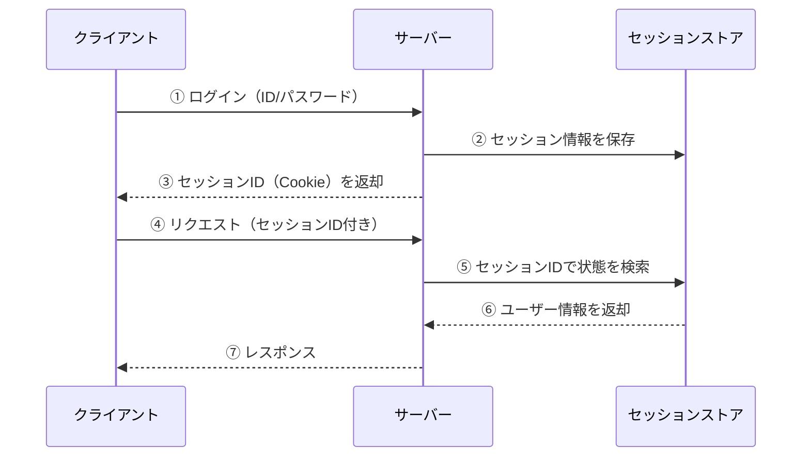
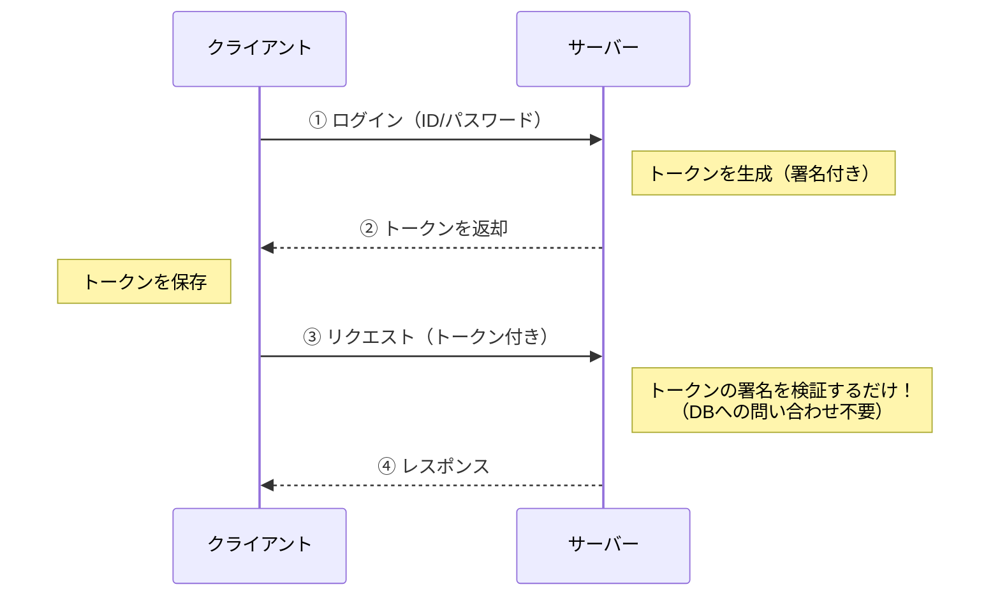
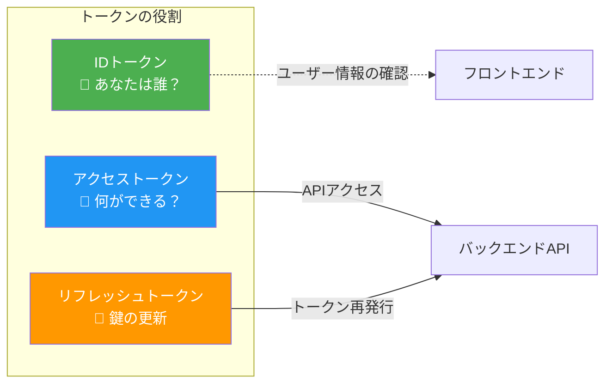
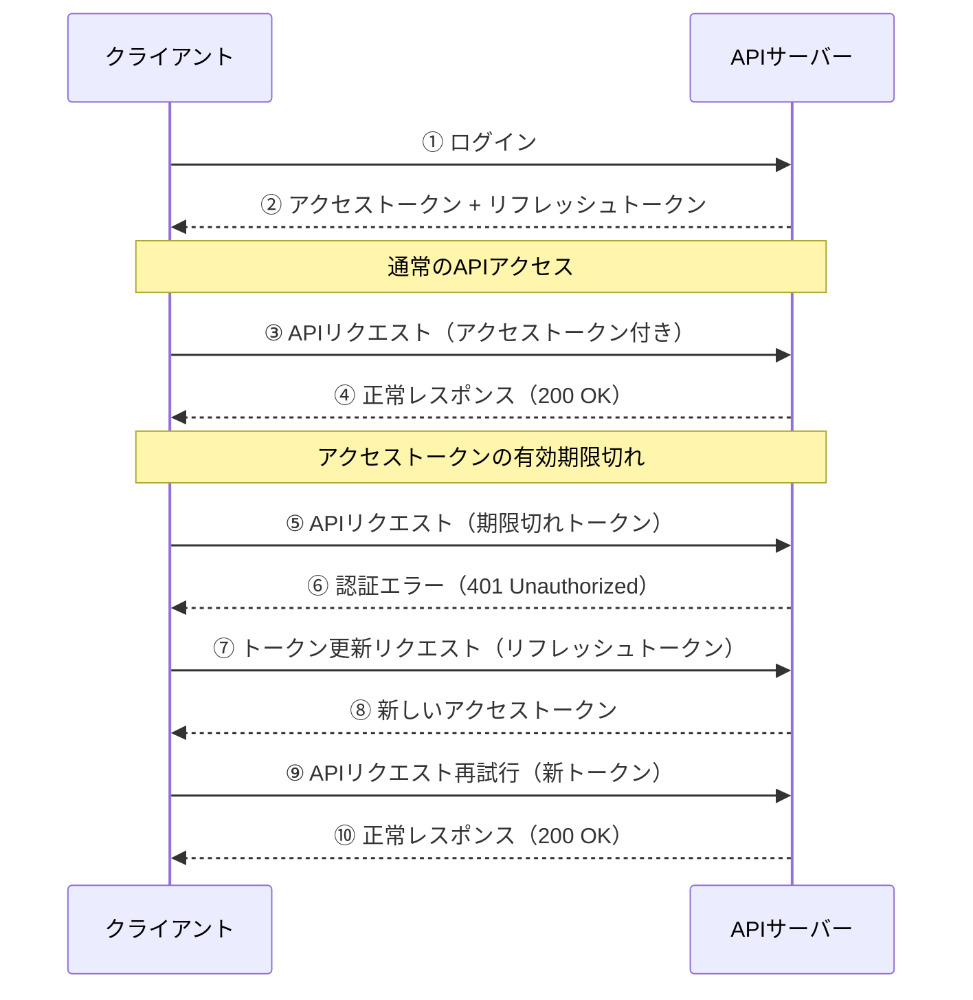
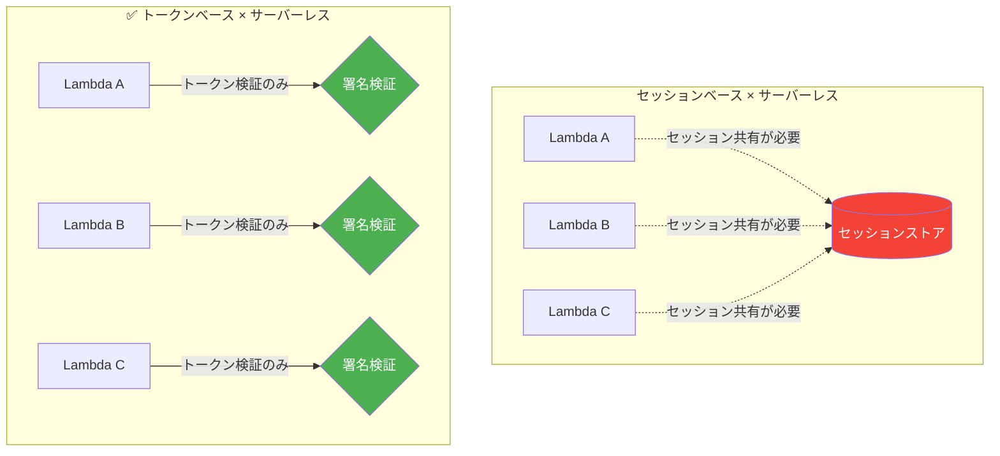
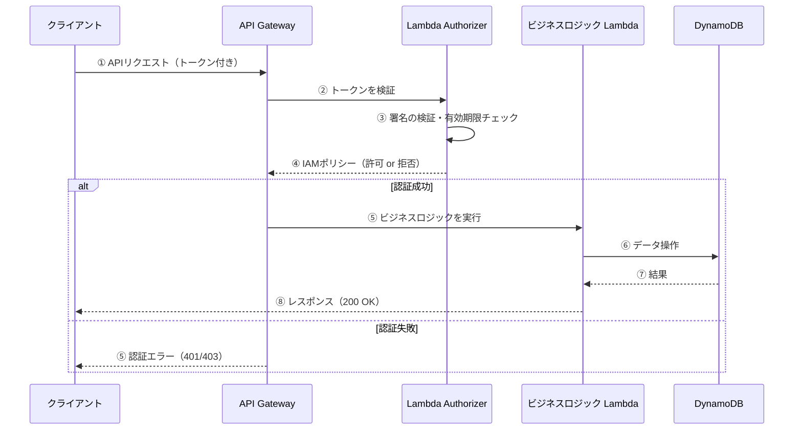
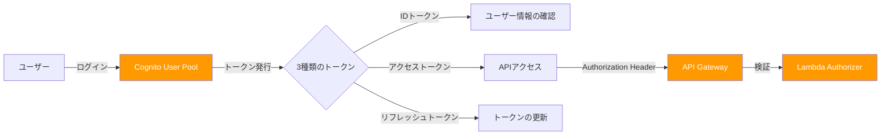
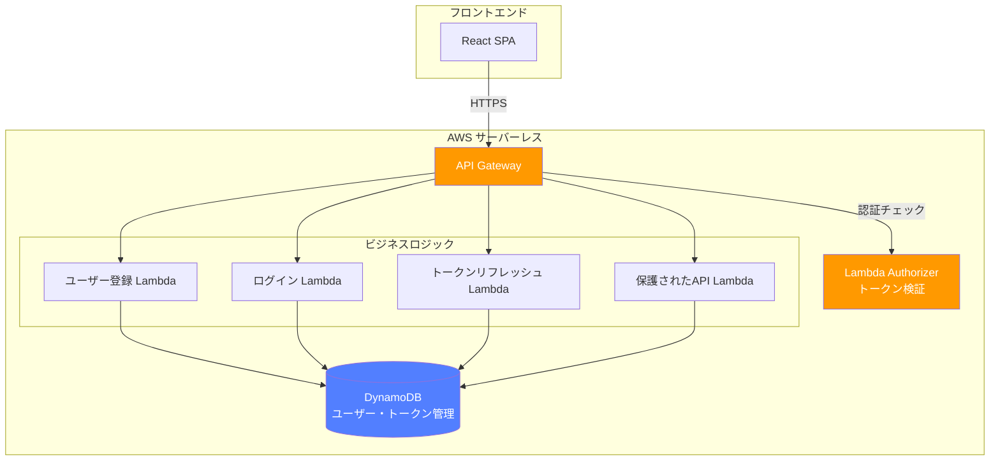

# はじめに

これまでJWTやアクセストークンをテーマに記事をいくつか書いてきましたが今回はその集大成としてトークンベース認証アプリをAWS上に構築してみた時の技術ブログ記事になります！

https://zenn.dev/mashharuki/articles/how_to_use_jwt-1

https://zenn.dev/mashharuki/articles/access_token-1

https://zenn.dev/mashharuki/articles/aws-lambda-authorizer-beginners-tutorial

ぜひ最後まで読んでいってください！

# トークンベース認証とは

まずは改めて**トークンベース認証**についておさらいしていきます！

## そもそも「認証」って何？

Webアプリにおける**認証（Authentication）** とは、「あなたは本当にあなたですか？」を確認するプロセスのことです。

身近な例で考えると、会社のオフィスに入る時に**社員証**を見せる行為がまさに認証です。

認証の方式はいくつかありますが、大きく分けると以下の2つに分類できます。

| 方式 | 仕組み | 身近な例 |
|------|--------|----------|
| **セッションベース** | サーバー側でログイン状態を記憶する | 受付で名前を伝えて入館証をもらう |
| **トークンベース** | クライアント側が証明書を持つ | 事前に発行された社員証を見せる |

## セッションベース認証の課題

従来のWebアプリでは**セッションベース認証**が主流でした。

しかし、この方式にはいくつかの課題があります。

:::message alert
**セッションベース認証の課題**
- **サーバーの負担が大きい**: ユーザーが増えるとセッション情報の管理コストが増大する
- **スケールしにくい**: 複数サーバーでセッション情報を共有する仕組みが必要
- **ステートフル**: サーバーが状態を持つため、障害時に情報が失われるリスクがある
:::

## トークンベース認証の仕組み

トークンベース認証では、サーバーがログイン状態を記憶する代わりに、**クライアント側がトークン（証明書）を保持**します。

ここがポイントです。

サーバーは**トークンの署名を検証するだけ**で、セッション情報をデータベースに問い合わせる必要がありません。

## トークンの種類を理解しよう

トークンベース認証で使われる主なトークンは以下の3つです。

### 1. アクセストークン（Access Token）

APIにアクセスするための**短命なトークン**です。  
リソースへのアクセス権限を証明します。

- **有効期限**: 数分〜数十分（短い方が安全）
- **用途**: APIリクエストの認証
- **保存場所**: メモリ上（推奨）

### 2. リフレッシュトークン（Refresh Token）

アクセストークンを**再発行するためのトークン**です。  
ユーザーに再ログインを求めずに新しいアクセストークンを取得できます。

- **有効期限**: 数日〜数週間（アクセストークンより長い）
- **用途**: アクセストークンの更新
- **保存場所**: HttpOnly Cookie（推奨）

### 3. IDトークン（ID Token）

ユーザーの**身元情報を含むトークン**です。  
OpenID Connect（OIDC）で規定されています。

- **有効期限**: 数分〜1時間
- **用途**: ユーザー情報の取得・確認
- **形式**: JWT（JSON Web Token）

## アクセストークンとリフレッシュトークンの連携フロー

実際のアプリではアクセストークンとリフレッシュトークンを組み合わせて使うのが一般的です。

:::message
**なぜトークンを2種類に分けるの？**

セキュリティと利便性のバランスを取るためです。

- **アクセストークンだけの場合**
  - 有効期限を長くすると漏洩リスクが高い。
  - 短くするとユーザーが頻繁にログインを求められる。
- **リフレッシュトークンを併用する場合**
  - アクセストークンは短命にしてセキュリティを確保しつつ、ユーザーは再ログイン不要で快適に利用できる。
:::

## トークンベース認証のメリットまとめ

| メリット | 説明 |
|---------|------|
| **ステートレス** | サーバーがセッション情報を持たないためスケールしやすい |
| **クロスドメイン対応** | CookieベースのセッションIDと異なり、異なるドメインのAPIにもトークンを送信できる |
| **モバイル対応** | Cookieに依存しないため、モバイルアプリでも使いやすい |
| **マイクロサービス向き** | 各サービスが独立してトークンを検証できる |

# トークンベース認証とサーバーレス

トークンベース認証の**ステートレス性**はサーバーレスアーキテクチャと非常に相性が良いです。

ここではなぜサーバーレスとトークンベース認証が優れた組み合わせなのかを解説していきます！

## サーバーレスアーキテクチャとは

サーバーレスとは、**サーバーの管理をクラウドプロバイダーに任せて、開発者はコードだけに集中できる**アーキテクチャのことです。

AWSにおける代表的なサーバーレスサービスは以下の通りです。

| サービス | 役割 |
|---------|------|
| **API Gateway** | APIのエンドポイント管理・ルーティング |
| **Lambda** | ビジネスロジックの実行 |
| **DynamoDB** | データの永続化（NoSQL） |
| **Cognito** | ユーザー認証・認可 |

## なぜサーバーレスとトークンベース認証は相性が良いのか？

### 理由①：ステートレスの一致

サーバーレス（Lambda）は**リクエストごとに新しいインスタンスが起動**します。  
そのため、サーバー側で状態（セッション）を持つセッションベース認証とは相性が悪いです。

一方、トークンベース認証は**サーバーが状態を持たない（ステートレス）** ためLambdaのようなエフェメラルな実行環境とぴったりマッチします。

### 理由②：Lambda Authorizerとの統合

AWS API Gatewayには**Lambda Authorizer**という強力な認証機能があります。これにより、トークンの検証ロジックをLambda関数として実装し、API Gatewayレベルで認証を一元管理できます。

:::message
**Lambda Authorizerのメリット**
- 認証ロジックをビジネスロジックから**完全に分離**できる
- 認証結果を**キャッシュ**できるためパフォーマンスが向上する
- Cognito、Auth0、独自認証など**様々なIdPと連携**可能
:::

### 理由③：Cognitoとの連携でトークン管理が楽になる

AWS Cognitoを使うと、トークンの発行・検証・更新をマネージドサービスに任せることができ、開発者はビジネスロジックに集中できます。

### 理由④：コスト効率

サーバーレス + トークンベース認証の組み合わせは、コスト面でも大きなメリットがあります。

- **Lambda**: リクエスト単位の従量課金。アイドル時はコストゼロ
- **API Gateway**: リクエスト数に応じた課金
- **DynamoDB**: オンデマンドキャパシティなら使った分だけ
- **Cognito**: 月間5万ユーザーまでは無料

セッションベース認証のように常時稼働するセッションストア（ElastiCache, RDS等）が不要なため、**特にトラフィックが変動するアプリケーション**においてコストメリットが大きいです。

## 今回のアプリにおけるアーキテクチャの全体像

本記事で構築するアプリは、これらのサーバーレスサービスを組み合わせたトークンベース認証の実践例です。

この後のセクションでは、このアーキテクチャを実際にAWS CDKで構築していきます！

# 今回試したサンプルコード

今回解説するソースコードは以下のリポジトリに格納しています！  

`cc-sdd`を使ってSpec駆動開発で開発をしました！

https://github.com/mashharuki/AWS-AccessToken-sample-app

## 今回開発したアプリのアーキテクチャ

## 機能一覧表

## 機能毎の処理シーケンス図

## アプリのスクショ

## ソースコードの解説

# 参考文献