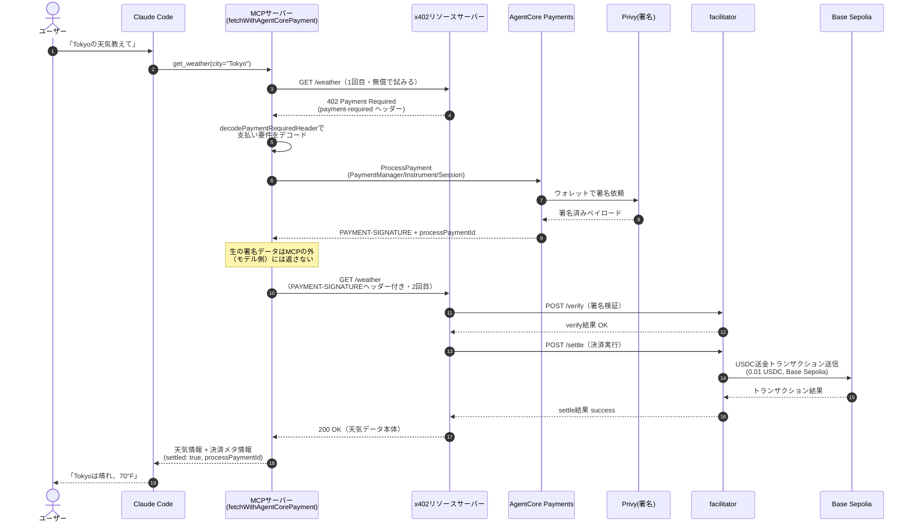

## 概要

先日、ついに **AmazonBedrock AgentCore payments**がGAされました！！！

https://aws.amazon.com/jp/about-aws/whats-new/2026/08/bedrock-agentcore-payments-ga/

プレビュー期間中に一度挑戦してみましたが設定がむず過ぎて途中で挫折していたのでGAに合わせてリベンジしてみました！

https://qiita.com/mashharuki/items/54bd2a912344f5ee2223

設定方法とか参考になるのでぜひ最後まで読んでいってください！

## やってみたこと

- Wallet ProviderをPrivyでAgentCore paymentsの初期セットアップをしてみたよ
- CDKでデプロイしてみたよ
- MCPからAgentCore paymentsの機能を呼び出せるようにしてみたよ
- 最終的にClaude Codeからx402決済して天気情報を呼び出してみたよ

最終的には以下のようになりました！


ブロックエクスプローラー上でも支払いが行われていることを確認！


## アーキテクチャ図


## 処理フロー図

実際に天気を聞いてからお金が動くまでの一連の流れをシーケンス図にしてみました！

課金対象のリクエストは**402が返ってきた時の1回だけ**で、支払い不要なら普通のAPIとして即レスポンスが返る点がポイントです！



## AgentCore paymentsの設定ムズすぎないか...？？

改めて感じましたが。。。

**Amazon BedrockCore payments**の初期設定めちゃくちゃ煩雑です...。

### 設定が難しい理由

- **AWS内で完結しない**

  これがめちゃくちゃ大きいと思っています。ウォレットを作ったりするところは外部のプラットフォームに依存しているためCoinbase Developer PlatformやPrivy側でアカウントを作ってAPIキー発行して...という作業が必要となります。

  <br/>

  そことAWS マネジメントコンソール(SDKやCDKなども含めて)との導線が整いきっていないこともあり動かすまでがとにかく大変です...。

  <br/>

  AWS Builder Centerでウィッシュを出しましたが、なんとかこの辺りの整備もAWS CLIかSDKからまとめて処理できれば最高の機能になると思っています。

- **ブロックチェーンについての専門知識がいる**

  ウォレットの仕組み、ステーブルコインの仕組み、ERC20の仕組み、スマートコントラクトの仕組み、テストネットとファウセットの仕組み、ガスレストランザクションの仕組み...

  <br/>

  **Amazon BedrockCore payments**のアーキテクチャを100%理解しようと思うとパブリッククラウドの知識の他、これらの知識が必要となってきます。

  <br/>

  この辺りもハードルが高くなっていると感じる理由です！

### PrivyをWallet Providerにした場合に動かすまでにやること

具体的なやることを列挙します！

1. **Privyのダッシュボードでアカウント＆アプリの作成**   
    https://dashboard.privy.io/
2. **1で作成した時に得られるApp ID、App Secret、Authorization ID、Authorization Secretを控える**
3. **2の情報をSecret Managerにセット**
4. **AgentCore paymentsリソースをCDKでデプロイ**
5. **PrivyとAmazon Bedrock paymentsの連携用アプリを起動する**
    https://github.com/privy-io/aws-agentcore-sdk
6. **テストネットファウセットを取得する**   
    https://faucet.circle.com/
7. **SDK経由でx402決済用のエンドポイントを呼び出して初めて決済ができる！**
8. **ブロックエクスプローラーでUSDCが送金されていれば成功！**

## コードの解説

今回試したコードは以下に格納しています！

https://github.com/mashharuki/agentcore-payments-sample2

### CDK側のソースコード

CDKでは以下のリソースを管理しています！

- AgentCore payments用のIAMロールを管理するスタック
- MCPサーバー用のスタック
- x402リソースサーバー用のスタック
- 上記リソースを動かすために事前に必要になる(Secret Managetとか)リソースを一式管理するスタック

今回は一番ポイントになる**MCPサーバー**のCDKスタックと**AgentCore payments**の設定を行うスクリプトを紹介します！

他のスタックも見たいという方はソースコードをご覧ください！！

```ts
import * as cdk from "aws-cdk-lib";
import type * as ecs from "aws-cdk-lib/aws-ecs";
import type * as iam from "aws-cdk-lib/aws-iam";
import type { Construct } from "constructs";
import type { AppConfig } from "./config/app-config";
import {
  EcrFargateWebService,
  monorepoRoot,
} from "./constructs/ecr-fargate-web-service";

export type McpStackProps = cdk.StackProps & {
  readonly appConfig: AppConfig;
  readonly cluster: ecs.ICluster;
  readonly processPaymentRole: iam.IRole;
  readonly resourceServerUrl: string;
};

/**
 * apps/mcp のECR+ECS Fargate+ALB一式。
 * タスクロール（taskRole）に ProcessPaymentRole をそのまま指定することで、
 * MCPサーバーが実行できるのは「既に承認済みのセッションに対するProcessPayment」だけに限定される
 * （CreatePaymentSession等の書き込み系権限は一切持たない。design.md 6.4/7.2節）。
 */
export class McpStack extends cdk.Stack {
  /** Fargate上に公開するMCPサーバー */
  public readonly mcpServer: EcrFargateWebService;

  /**
   * コンストラクター
   * @param scope
   * @param id
   * @param props
   */
  constructor(scope: Construct, id: string, props: McpStackProps) {
    super(scope, id, props);

    const { appConfig } = props;
    const { paymentManagerArn, instrumentId, sessionId, userId } =
      appConfig.runtimePayment;

    if (!paymentManagerArn || !instrumentId || !sessionId || !userId) {
      throw new Error(
        "McpStackのデプロイには PAYMENT_MANAGER_ARN / PAYMENT_INSTRUMENT_ID / PAYMENT_SESSION_ID / " +
          "PAYMENT_USER_ID が必要です。先に `pnpm --filter cdk payments:admin setup-connector` " +
          "/ `create-instrument` / `new-session` を実行し、発行された値を環境変数として設定してから" +
          "再度デプロイしてください（README参照）。",
      );
    }

    this.mcpServer = new EcrFargateWebService(
      this,
      appConfig.mcpServer.logicalId,
      {
        config: appConfig.mcpServer,
        cluster: props.cluster,
        dockerBuildContext: monorepoRoot,
        dockerfilePath: "apps/mcp/Dockerfile",
        taskRole: props.processPaymentRole,
        // x402による支払いデータを生成するためにはウォレットクライアントが必要
        // 今回のアーキテクチャではそのウォレットクライアントとして AgentCore paymentsを利用する
        // そのため環境変数としてAgentCore payments関連の情報を設定する
        environment: {
          PORT: String(appConfig.mcpServer.containerPort),
          AWS_REGION: appConfig.region,
          PAYWALL_API_BASE_URL: props.resourceServerUrl,
          PAYMENT_MANAGER_ARN: paymentManagerArn,
          PAYMENT_INSTRUMENT_ID: instrumentId,
          PAYMENT_SESSION_ID: sessionId,
          PAYMENT_USER_ID: userId,
        },
      },
    );

    new cdk.CfnOutput(this, "McpServerUrl", {
      value: `${this.mcpServer.url}/mcp`,
      description: "claude mcp add --transport http <name> <この値> で登録する",
    });
  }
}
```

環境変数に埋め込む情報は以下のスクリプトで一式生成します！

```ts
#!/usr/bin/env tsx
import { randomUUID } from "node:crypto";
import * as readline from "node:readline/promises";
/**
 * Amazon Bedrock AgentCore Payments のセットアップを行う管理者用CLI。
 *
 * design.md 7.2節の4ロール分離モデルに従い、このスクリプトは「人間がTTYで実行する」ことを前提とする
 * （`aws-agents:agents-pay` skillの管理CLI設計を参考にしている）。PaymentManager/Connector/
 * CredentialProviderの作成にはControlPlaneRole相当の権限、Instrument/Sessionの作成には
 * ManagementRole相当の権限を持つAWS認証情報（`aws configure` 済みプロファイル等）が必要。
 *
 * このスクリプト自体はAWS認証情報を保持しない。実行時のAWS SDKデフォルト認証チェーン
 * （環境変数 / 共有プロファイル / SSO等）にすべて委ねる。
 *
 * サブコマンド:
 *   setup-connector     PaymentCredentialProvider(StripePrivy) → PaymentManager → PaymentConnector を作成
 *   create-instrument   Payment Instrument（組み込みウォレット）を作成し、入金・delegation手順を表示
 *                       （Coinbaseは redirectUrl、StripePrivyはPrivyフロントエンド起動手順）
 *   new-session         予算・有効期限付きの Payment Session を作成（TTYでの承認必須）
 *   status              Session残予算 / Instrument残高を確認（読み取り専用）
 */
import {
  BedrockAgentCoreClient,
  CreatePaymentInstrumentCommand,
  CreatePaymentSessionCommand,
  GetPaymentInstrumentBalanceCommand,
  GetPaymentSessionCommand,
} from "@aws-sdk/client-bedrock-agentcore";
import {
  BedrockAgentCoreControlClient,
  CreatePaymentConnectorCommand,
  CreatePaymentCredentialProviderCommand,
  CreatePaymentManagerCommand,
  DeletePaymentCredentialProviderCommand,
  paginateListPaymentCredentialProviders,
} from "@aws-sdk/client-bedrock-agentcore-control";

const REGION = process.env.AWS_REGION ?? "us-west-2";
// このスクリプトが叩くリージョンは、FoundationStack のデプロイ先
// （apps/cdk/lib/config/environments/dev.ts の region、現状 us-west-2 固定）と必ず一致させること。
// 食い違うと ResourceRetrievalRole の信頼ポリシー（aws:SourceArn を stack.region で組む）と
// PaymentManager の作成先リージョンがずれ、CreatePaymentManager が
// "Role validation failed ... trust policy allows assumption by this service" で失敗する。

// PaymentManagerのnameはAWS側が `^[a-zA-Z][a-zA-Z0-9]{0,47}$` を要求する
// （ハイフン・アンダースコア不可。実際に `pnpm --filter cdk payments:admin setup-connector` を
// 実行し、CreatePaymentManagerのバリデーションエラーで確認済み）。
// ResourceRetrievalRole 等のロール名のベースにも使うため、
// apps/cdk/lib/config/environments/dev.ts の appConfig.paymentManagerName と必ず同じ値にすること。
const PAYMENT_MANAGER_NAME =
  process.env.PAYMENT_MANAGER_NAME ?? "AgentcorePaymentsSampleDev";

// コントロール用のクライアントインスタンス
const controlClient = new BedrockAgentCoreControlClient({ region: REGION });
// データ用のクライアントインスタンス
const dataClient = new BedrockAgentCoreClient({ region: REGION });

/**
 * プロンプトを取得するメソッド
 * @param question
 * @returns
 */
const prompt = async (question: string): Promise<string> => {
  // 取得
  const rl = readline.createInterface({
    input: process.stdin,
    output: process.stdout,
  });
  try {
    return (await rl.question(question)).trim();
  } finally {
    rl.close();
  }
};

// 生の制御バイトをソースに埋め込まないよう、文字コードから明示的に組み立てる
const KEY_EOF = String.fromCharCode(4); // Ctrl+D
const KEY_SIGINT = String.fromCharCode(3); // Ctrl+C
const KEY_BACKSPACE = String.fromCharCode(127); // Delete/Backspace

/**
 * シークレット入力用。
 * ターミナルにエコーせず、入力中は `*` を表示する。
 */
const promptSecret = (question: string): Promise<string> =>
  new Promise((resolve, reject) => {
    process.stdout.write(question);
    const { stdin } = process;
    const isTty = stdin.isTTY === true;
    if (isTty) stdin.setRawMode?.(true);
    stdin.resume();
    stdin.setEncoding("utf8");

    let input = "";
    const cleanup = () => {
      if (isTty) stdin.setRawMode?.(false);
      stdin.pause();
      stdin.removeListener("data", onData);
    };
    const onData = (char: string) => {
      switch (char) {
        case "\n":
        case "\r":
        case KEY_EOF:
          cleanup();
          process.stdout.write("\n");
          resolve(input);
          return;
        case KEY_SIGINT:
          cleanup();
          reject(new Error("入力が中断されました"));
          return;
        case KEY_BACKSPACE:
          input = input.slice(0, -1);
          return;
        default:
          input += char;
          process.stdout.write("*");
      }
    };
    stdin.on("data", onData);
  });

/**
 * `new-session` はTTYでの明示的な `approve` 入力を必須とする。
 * 非対話実行（CI・エージェント経由等）からは絶対に承認できないようにするための意図的なゲート
 * （design.md 7.2節、`aws-agents:agents-pay` skill の管理CLI設計を踏襲）。
 */
const requireTtyApproval = async (summary: string): Promise<void> => {
  if (!process.stdin.isTTY) {
    throw new Error(
      "new-session はTTY（対話的ターミナル）からのみ承認できます。CI・エージェント経由での実行は拒否されます。",
    );
  }
  console.log(summary);
  const answer = await prompt('続行するには "approve" と入力してください: ');
  if (answer !== "approve") {
    throw new Error(
      '承認されませんでした（"approve" 以外の入力）。セッションは作成していません。',
    );
  }
};

const sleep = (ms: number): Promise<void> =>
  new Promise((resolve) => setTimeout(resolve, ms));

/** 指定名の PaymentCredentialProvider が存在するか */
const credentialProviderExists = async (name: string): Promise<boolean> => {
  for await (const page of paginateListPaymentCredentialProviders(
    { client: controlClient },
    {},
  )) {
    if (page.credentialProviders?.some((p) => p.name === name)) return true;
  }
  return false;
};

/**
 * setup-connector は途中で失敗しても 1/3 の PaymentCredentialProvider だけは残る。
 * 同名の Create はできない（ConflictException）ため、再実行時に手で消す手間が発生していた。
 * ここで「同名の既存プロバイダがあれば削除してから作り直す」冪等化を行う。
 * 削除が結果整合で反映されるまで待ってから戻る。
 * 削除自体に失敗する（例: まだ Connector から参照されている）場合はそのままエラーを送出する。
 */
const deleteCredentialProviderIfExists = async (
  name: string,
): Promise<void> => {
  if (!(await credentialProviderExists(name))) return;

  console.log(
    `  既存の PaymentCredentialProvider "${name}" を削除して作り直します...`,
  );
  await controlClient.send(
    new DeletePaymentCredentialProviderCommand({ name }),
  );

  // 削除の反映を待つ（最大 ~30 秒）。待たずに Create すると ConflictException になることがある。
  for (let i = 0; i < 15; i++) {
    if (!(await credentialProviderExists(name))) return;
    await sleep(2000);
  }
  throw new Error(
    `PaymentCredentialProvider "${name}" の削除が時間内に反映されませんでした。少し待って再実行してください。`,
  );
};

/**
 * コネクターを生成するメソッド 
 */
const cmdSetupConnector = async (): Promise<void> => {
  const roleArn =
    process.env.RESOURCE_RETRIEVAL_ROLE_ARN ??
    (await prompt(
      "ResourceRetrievalRoleのARN（`cdk deploy FoundationStack` の出力）: ",
    ));
  if (!roleArn) throw new Error("ResourceRetrievalRoleのARNが必要です");

  console.log(
    "\nPrivyダッシュボード（https://dashboard.privy.io/）で発行した資格情報を入力してください。",
  );
  console.log(
    "入力内容はターミナルにエコーされず、このプロセスの外には一切保存されません。\n",
  );

  const appId = await prompt("Privy App ID: ");
  const appSecret = await promptSecret("Privy App Secret: ");
  const authorizationId = await prompt("Privy Authorization ID: ");
  const authorizationPrivateKey = await promptSecret(
    "Privy Authorization Private Key: ",
  );

  console.log("\n1/3 PaymentCredentialProvider を作成しています...");
  const credentialProviderName = `${PAYMENT_MANAGER_NAME}-privy-credentials`;
  await deleteCredentialProviderIfExists(credentialProviderName);
  const credentialProvider = await controlClient.send(
    new CreatePaymentCredentialProviderCommand({
      name: credentialProviderName,
      credentialProviderVendor: "StripePrivy",
      providerConfigurationInput: {
        stripePrivyConfiguration: {
          appId,
          appSecret,
          authorizationId,
          authorizationPrivateKey,
        },
      },
    }),
  );
  console.log(`  -> ${credentialProvider.credentialProviderArn}`);

  console.log("2/3 PaymentManager を作成しています...");
  const manager = await controlClient.send(
    new CreatePaymentManagerCommand({
      name: PAYMENT_MANAGER_NAME,
      authorizerType: "AWS_IAM",
      roleArn,
      clientToken: randomUUID(),
    }),
  );
  console.log(`  -> ${manager.paymentManagerArn}`);

  console.log("3/3 PaymentConnector を作成しています...");
  const connector = await controlClient.send(
    new CreatePaymentConnectorCommand({
      paymentManagerId: manager.paymentManagerId,
      // PaymentManagerと同じ命名制約（英数字のみ）を持つ可能性があるため、ここもハイフンを避ける
      name: `${PAYMENT_MANAGER_NAME}PrivyConnector`,
      type: "StripePrivy",
      credentialProviderConfigurations: [
        {
          stripePrivy: {
            credentialProviderArn: credentialProvider.credentialProviderArn,
          },
        },
      ],
      clientToken: randomUUID(),
    }),
  );
  console.log(`  -> ${connector.paymentConnectorId}`);

  console.log(
    "\n完了しました。以下の値を控えてください（README/次のステップで使用します）:",
  );
  console.log(`  PAYMENT_MANAGER_ARN=${manager.paymentManagerArn}`);
  console.log(`  PAYMENT_CONNECTOR_ID=${connector.paymentConnectorId}`);
};

/**
 * Instrumentを作成するメソッド 
 */
const cmdCreateInstrument = async (): Promise<void> => {
  const paymentManagerArn =
    process.env.PAYMENT_MANAGER_ARN ?? (await prompt("PAYMENT_MANAGER_ARN: "));
  const paymentConnectorId =
    process.env.PAYMENT_CONNECTOR_ID ??
    (await prompt("PAYMENT_CONNECTOR_ID: "));
  const userId =
    process.env.PAYMENT_USER_ID ??
    (await prompt(
      "この決済インストゥルメントの利用者ID（例: 自分のメールアドレス）: ",
    ));
  const email = await prompt(`ウォレット連携用メールアドレス [${userId}]: `);

  const instrument = await dataClient.send(
    new CreatePaymentInstrumentCommand({
      userId,
      paymentManagerArn,
      paymentConnectorId,
      paymentInstrumentType: "EMBEDDED_CRYPTO_WALLET",
      paymentInstrumentDetails: {
        embeddedCryptoWallet: {
          network: "ETHEREUM",
          linkedAccounts: [{ email: { emailAddress: email || userId } }],
        },
      },
      clientToken: randomUUID(),
    }),
  );

  const instrumentDetails =
    instrument.paymentInstrument?.paymentInstrumentDetails;
  const details =
    instrumentDetails && "embeddedCryptoWallet" in instrumentDetails
      ? instrumentDetails.embeddedCryptoWallet
      : undefined;

  console.log("\nPayment Instrument を作成しました:");
  console.log(
    `  PAYMENT_INSTRUMENT_ID=${instrument.paymentInstrument?.paymentInstrumentId}`,
  );
  console.log(`  PAYMENT_USER_ID=${userId}`);
  if (details?.walletAddress) {
    console.log(`  WALLET_ADDRESS=${details.walletAddress}`);
  }

  console.log(
    "\n入金と署名権限の許可（delegation）が済むまで、status コマンドの残高は0のまま / ProcessPayment は失敗します。",
  );

  if (details?.redirectUrl) {
    // Coinbase CDP はホスト済みの WalletHub URL を返す。
    console.log(
      "\n次のURLをブラウザで開き、テストネットUSDCの入金とエージェントへの署名権限の許可を行ってください:",
    );
    console.log(`  ${details.redirectUrl}`);
  } else {
    // StripePrivy はホスト済みURLを返さない。Privy のリファレンスフロントエンドを自前で起動する。
    // https://docs.aws.amazon.com/bedrock-agentcore/latest/devguide/payments-fund-wallet.html
    console.log(
      "\nStripePrivy はホスト済みURLを返しません。Privy のリファレンスフロントエンドをローカル起動して操作します:",
    );
    console.log(
      "  1. git clone https://github.com/privy-io/aws-agentcore-sdk.git && cd aws-agentcore-sdk",
    );
    console.log(
      "  2. .env.local を作成:\n" +
        "       NEXT_PUBLIC_PRIVY_APP_ID=<setup-connector で入力した App ID>\n" +
        "       PRIVY_APP_SECRET=<App Secret>\n" +
        "       NEXT_PUBLIC_PRIVY_SIGNER_ID=<Authorization ID / Key ID（公開可）>\n" +
        "       NEXT_PUBLIC_NETWORK_MODE=testnet",
    );
    console.log(
      "  3. Privy ダッシュボード App Settings > Basics > Domains に http://localhost:3000 を許可",
    );
    console.log(
      "  4. pnpm install && pnpm dev で http://localhost:3000 を開く",
    );
    console.log(
      `  5. このインストゥルメントに紐付けたメールアドレス（${email || userId}）でログイン`,
    );
    console.log(
      "  6. 表示されたウォレットアドレスを Circle faucet（https://faucet.circle.com/ ・Base Sepolia）で入金",
    );
    console.log(
      '  7. ホーム画面の "Connect agent" → "Give access" で署名権限を付与',
    );
  }

  console.log(
    "\n両方が完了したら status で残高を確認し、次に new-session を実行してください。",
  );
};

/**
 * 新しいセッションを作成するメソッド
 */
const cmdNewSession = async (): Promise<void> => {
  const paymentManagerArn =
    process.env.PAYMENT_MANAGER_ARN ?? (await prompt("PAYMENT_MANAGER_ARN: "));
  const userId =
    process.env.PAYMENT_USER_ID ?? (await prompt("PAYMENT_USER_ID: "));
  const budget =
    process.env.SESSION_BUDGET_USD ??
    (await prompt("このセッションの上限予算（USD、例: 1.00）: "));
  const expiryMinutesInput =
    process.env.SESSION_EXPIRY_MINUTES ??
    (await prompt("有効期限（分、15〜480の範囲。例: 480）: "));
  const expiryTimeInMinutes = Number(expiryMinutesInput);

  if (expiryTimeInMinutes < 15 || expiryTimeInMinutes > 480) {
    throw new Error("有効期限は15〜480分の範囲で指定してください（AWSの制約）");
  }

  await requireTtyApproval(
    "以下の内容でPayment Sessionを作成します:\n" +
      `  PaymentManager: ${paymentManagerArn}\n` +
      `  利用者: ${userId}\n` +
      `  上限予算: $${budget}\n` +
      `  有効期限: ${expiryTimeInMinutes}分`,
  );

  const session = await dataClient.send(
    new CreatePaymentSessionCommand({
      userId,
      paymentManagerArn,
      limits: { maxSpendAmount: { value: budget, currency: "USD" } },
      expiryTimeInMinutes,
      clientToken: randomUUID(),
    }),
  );

  console.log("\nPayment Session を作成しました:");
  console.log(
    `  PAYMENT_SESSION_ID=${session.paymentSession?.paymentSessionId}`,
  );
  console.log(
    "\nこのIDを PAYMENT_SESSION_ID として apps/mcp や apps/x402/client の .env、" +
      "および McpStack デプロイ時の環境変数に設定してください。",
  );
};

const cmdStatus = async (): Promise<void> => {
  const paymentManagerArn =
    process.env.PAYMENT_MANAGER_ARN ?? (await prompt("PAYMENT_MANAGER_ARN: "));
  const sessionId = process.env.PAYMENT_SESSION_ID;
  const instrumentId = process.env.PAYMENT_INSTRUMENT_ID;
  const connectorId = process.env.PAYMENT_CONNECTOR_ID;

  if (sessionId) {
    const { paymentSession } = await dataClient.send(
      new GetPaymentSessionCommand({
        paymentManagerArn,
        paymentSessionId: sessionId,
      }),
    );
    const remaining = paymentSession?.availableLimits?.availableSpendAmount;
    console.log(
      `Session ${sessionId}: 残予算=${remaining ? `${remaining.value} ${remaining.currency}` : "不明"}` +
        ` (expiryTimeInMinutes=${paymentSession?.expiryTimeInMinutes})`,
    );
  }
  if (instrumentId && connectorId) {
    const balance = await dataClient.send(
      new GetPaymentInstrumentBalanceCommand({
        paymentManagerArn,
        paymentConnectorId: connectorId,
        paymentInstrumentId: instrumentId,
        chain: "BASE_SEPOLIA",
        token: "USDC",
      }),
    );
    console.log(
      `Instrument ${instrumentId}: balance=${JSON.stringify(balance.tokenBalance)}`,
    );
  } else if (instrumentId) {
    console.log(
      "PAYMENT_CONNECTOR_ID が未設定のため残高確認をスキップしました。",
    );
  }
  if (!sessionId && !instrumentId) {
    console.log(
      "PAYMENT_SESSION_ID / PAYMENT_INSTRUMENT_ID のいずれも環境変数に設定されていません。",
    );
  }
};

const main = async (): Promise<void> => {
  const [, , subcommand] = process.argv;

  switch (subcommand) {
    case "setup-connector":
      return cmdSetupConnector();
    case "create-instrument":
      return cmdCreateInstrument();
    case "new-session":
      return cmdNewSession();
    case "status":
      return cmdStatus();
    default:
      console.error(
        "使い方: pnpm --filter cdk payments:admin <setup-connector|create-instrument|new-session|status>",
      );
      process.exit(1);
  }
};

main().catch((error) => {
  console.error("エラー:", error instanceof Error ? error.message : error);
  process.exit(1);
});
```

### MCP側のソースコード

基本的な実装内容は通常通りツールを実装することなのですが、こちらもx402支払いに対応させるようにすることが追加で必要となります！

- **ツールの実装内容**

  天気予報を知りたいのでx402リソースサーバーで実装された`/weather`を呼び出すのですが、そのまま呼び出すと402が返ってくるのでちゃんと支払い用の書めデータを生成できるようにラップしてあげる必要があります！

  <br/>

  今回は`fetchWithAgentCorePayment`というメソッドにその処理を集約しています！

  ```ts
  import type { McpServer } from "@modelcontextprotocol/sdk/server/mcp.js";
  import { fetchWithAgentCorePayment } from "shared";
  import { z } from "zod";
  import { env } from "../config";

  type WeatherResponse = {
    report: {
      weather: string;
      temperature: number;
    };
  };

  /**
   * get_weather ツールを登録する。
   *
   * モデル（Claude Code）には都市名だけを渡してもらい、支払い可否の判断（許可ネットワーク・
   * 予算上限）はAgentCore Payments側（ProcessPaymentRoleの権限のみを持つこのサーバー）で完結させる。
   * モデルに返すのは天気データと決済メタ情報（決済有無・処理ID）のみで、署名済みプルーフや
   * X-PAYMENTヘッダーの生データは一切返さない。
   */
  export const registerGetWeatherTool = (server: McpServer): void => {
    server.registerTool(
      "get_weather",
      {
        title: "天気情報を取得",
        description:
          "x402で保護された天気情報APIから現在の天気を取得する。呼び出しごとにAmazon Bedrock AgentCore Payments経由でUSDC決済が発生する場合がある（$0.01 / 回、Base Sepolia）。",
        inputSchema: {
          city: z.string().min(1).describe("天気を取得したい都市名（例: Tokyo）"),
        },
      },
      async ({ city }) => {
        const url = `${env.PAYWALL_API_BASE_URL}/weather`;

        // x402で保護されたリソースにアクセスする。
        const result = await fetchWithAgentCorePayment<WeatherResponse>(url, {
          region: env.AWS_REGION,
          paymentManagerArn: env.PAYMENT_MANAGER_ARN,
          paymentInstrumentId: env.PAYMENT_INSTRUMENT_ID,
          paymentSessionId: env.PAYMENT_SESSION_ID,
          userId: env.PAYMENT_USER_ID,
        });

        // サマリーをアウトプットとして返す
        const summary = {
          city,
          weather: result.data.report.weather,
          temperature: result.data.report.temperature,
          payment: result.paymentMade
            ? { settled: true, processPaymentId: result.processPaymentId }
            : { settled: false },
        };

        return {
          content: [{ type: "text", text: JSON.stringify(summary) }],
        };
      },
    );
  };
  ```

- **fetchWithAgentCorePaymentの実装内容**

  402ステータスが帰ってきた時にその支払い要求内容を確認し、それを満たすようなトランザクションデータの構築と署名を行うのがこのメソッドになります！

  <br/>

  この時のウォレットは**AgentCore Payments**で管理しているウォレットが使われるわけです！！

  ```ts
  import { decodePaymentRequiredHeader } from "@x402/core/http";
  import {
    type AgentCorePaymentConfig,
    processX402Payment,
  } from "./processX402Payment.js";

  export type PaywallFetchResult<TData = unknown> = {
    data: TData;
    /** 402が発生し、実際にAgentCore Payments経由で決済を行った場合はtrue */
    paymentMade: boolean;
    processPaymentId?: string;
  };

  /**
   * x402で保護されたリソースを取得する。402が返ってきた場合のみ、
   * Amazon Bedrock AgentCore Payments経由で決済してから再取得する
   * （課金対象の呼び出しは402が返った時の1回のみで、無駄な支払いは発生しない）。
   */
  export const fetchWithAgentCorePayment = async <TData = unknown>(
    url: string,
    config: AgentCorePaymentConfig,
    init?: RequestInit,
  ): Promise<PaywallFetchResult<TData>> => {
    const firstResponse = await fetch(url, init);

    if (firstResponse.status !== 402) {
      if (!firstResponse.ok) {
        throw new Error(
          `リソースの取得に失敗しました: ${firstResponse.status} ${firstResponse.statusText}`,
        );
      }
      return { data: (await firstResponse.json()) as TData, paymentMade: false };
    }

    // 402応答は本文が空で、決済要件（PaymentRequired）は payment-required ヘッダーにbase64/JSONで入っている
    // （@x402/hono の実装で確認済み。response.json()側は空オブジェクトになるため使わない）
    const paymentRequiredHeader = firstResponse.headers.get("payment-required");
    if (!paymentRequiredHeader) {
      throw new Error("402応答に payment-required ヘッダーが含まれていません");
    }
    // ヘッダーをデコードし、支払い要件を確認する。
    const paymentRequired = decodePaymentRequiredHeader(paymentRequiredHeader);
    // x402に対応した支払いのための署名データを作成する。
    const { header, processPaymentId } = await processX402Payment(
      paymentRequired,
      config,
    );

    // 署名データ付きで再度アクセス。
    // x402 v2 のサーバー（@x402/core v2）は PAYMENT-SIGNATURE ヘッダーのみを読む
    // （extractPayment() は payment-signature 以外を見ない）。v1 の X-PAYMENT に入れても
    // 「支払いなし」と見なされ、本文が空の402が返るだけなので注意。
    const paidResponse = await fetch(url, {
      ...init,
      headers: {
        ...(init?.headers as Record<string, string> | undefined),
        "PAYMENT-SIGNATURE": header,
      },
    });

    if (!paidResponse.ok) {
      // v2 の402は本文が空で、失敗理由（verifyの invalidReason 等）は
      // payment-required ヘッダーの error フィールドに入っている。
      let reason = (await paidResponse.text()) || "(空のレスポンス本文)";
      const failureHeader = paidResponse.headers.get("payment-required");
      if (failureHeader) {
        try {
          const decoded = decodePaymentRequiredHeader(failureHeader) as {
            error?: string;
          };
          if (decoded.error) reason = decoded.error;
        } catch {
          // デコードできなければ本文テキストのまま
        }
      }
      throw new Error(
        `決済後のリクエストが失敗しました: ${paidResponse.status} ${reason}`,
      );
    }

    return {
      data: (await paidResponse.json()) as TData,
      paymentMade: true,
      processPaymentId,
    };
  };
  ```

### x402リソースサーバー側のコード

リソースサーバー側ではx402ミドルウェアの適用と連携するfacilitorの設定を行う必要があります！

- **x402ミドルウェア用の設定**

  まずどのエンドポイントに対してどの程度の支払いを要求するようにするかを設定します。

  <br/>

  今回は `/weather`というエンドポイントへの呼び出し時には`Base Sepolia`ネットワーク上のステーブルコイン`USDC`を0.01支払うように設定しました。

  ```ts
  import { declareDiscoveryExtension } from "@x402/extensions/bazaar";
  import "dotenv/config";
  import { loadEnv, resourceServerEnvSchema } from "shared";

  // 環境変数をzodで検証（不正な設定であれば起動時に即座に失敗させる）
  export const env = loadEnv(resourceServerEnvSchema);

  // x402に関する設定（対応ネットワークはBase Sepoliaのみ）
  export const x402Config = {
    "GET /weather": {
      accepts: [
        {
          scheme: "exact",
          price: "$0.01",
          network: "eip155:84532" as `${string}:${string}`, // Base Sepolia
          payTo: env.EVM_ADDRESS as `0x${string}`,
        },
      ],
      description:
        "Get real-time weather data including temperature, conditions, and humidity",
      mimeType: "application/json",
      extensions: {
        ...declareDiscoveryExtension({
          input: { city: "San Francisco" },
          inputSchema: {
            properties: { city: { type: "string", description: "City name" } },
            required: ["city"],
          },
        }),
      },
    },
  };
  ```

- **リソースサーバーの設定**
  
  続いてリソーサーバーの設定を行います。
  
  <br/>

  対応するブロックチェーンの数だけ設定する必要があります(今回は一つのみ)！

  ```ts
  import { ExactEvmScheme } from "@x402/evm/exact/server";
  import { x402ResourceServer } from "@x402/hono";
  import { facilitatorClient } from "./facilitator";

  // リソースサーバーの設定
  export const resourceServer = new x402ResourceServer(facilitatorClient);
  // EIP-155チェーンID84532（Base Sepolia）のExactEvmSchemeを登録
  resourceServer.register(
    "eip155:84532" as `${string}:${string}`,
    new ExactEvmScheme(),
  );
  ```

- **Honoサーバーにx402ミドルウェア適用！**

  そして最後にこれらの設定をHonoサーバーに適用してあげればあっという間にただのAPIがx402対応版に大変身します！！
  
  <br/>

  `/health`に対するアクセスについては通常通り動作しますが、`/weather`に対するアクセスについては402が帰ってくるようになります！

  ```ts
  import { serve } from "@hono/node-server";
  import { paymentMiddleware } from "@x402/hono";
  import { Hono } from "hono";
  import { env, x402Config } from "./config";
  import { resourceServer } from "./resourceServer";

  // Honoインスタンスの作成
  const app = new Hono();

  // x402ミドルウェアの設定
  app.use(paymentMiddleware(x402Config, resourceServer));

  // エンドポイントの設定
  app.get("/health", (c) => {
    return c.json({
      report: {
        status: "OK",
      },
    });
  });

  app.get("/weather", (c) => {
    return c.json({
      report: {
        weather: "sunny",
        temperature: 70,
      },
    });
  });

  serve({ fetch: app.fetch, port: env.PORT }, (info) => {
    console.log(
      `x402 resource server listening on http://localhost:${info.port}`,
    );
  });
  ```

### x402facilitator側のコード

最後に**facilitator**のコードの解説です！

x402のスキームにて非常に重要な役割を持っているのがこの**facilitator**です！

具体的にはクライアント側で生成された支払いのため署名済みデータの検証とブロックチェーンの送信を行っています。

- **`検証側のソースコード`**

  エンドポイントとしては verifyとして公開されます。

  ```ts
  /**
   * 署名済みの支払いペイロードと支払い要件を検証するエンドポイント
   */
  app.post("/verify", async (c) => {
    try {
      // リクエストボディをJSONとしてパース
      const body = await c.req.json<{
        paymentPayload?: PaymentPayload;
        paymentRequirements?: PaymentRequirements;
      }>();

      const { paymentPayload, paymentRequirements } = body;

      if (!paymentPayload || !paymentRequirements) {
        return c.json(
          {
            error: "Missing paymentPayload or paymentRequirements",
          },
          400,
        );
      }

      // ファシリテーターのverifyメソッドを呼び出して検証
      const response: VerifyResponse = await facilitator.verify(
        paymentPayload,
        paymentRequirements,
      );

      return c.json(response);
    } catch (error) {
      console.error("Verify error:", error);

      return c.json(
        {
          error: error instanceof Error ? error.message : "Unknown error",
        },
        500,
      );
    }
  });
  ```

- **`送信側のソースコード`**

  エンドポイントとしてはsettleとして公開されます！<br/>

  ここでブロックチェーンにトランザクションが送信されるのでガスを支払うのはfacilitatorサーバーに設定されている秘密鍵に紐づくウォレットになります！

  ```ts
  /**
   * 署名済みの支払いペイロードと支払い要件を使用して決済を行うエンドポイント
   */
  app.post("/settle", async (c) => {
    try {
      // リクエストボディをJSONとしてパース
      const body = await c.req.json<{
        paymentPayload?: PaymentPayload;
        paymentRequirements?: PaymentRequirements;
      }>();

      const { paymentPayload, paymentRequirements } = body;

      if (!paymentPayload || !paymentRequirements) {
        return c.json(
          {
            error: "Missing paymentPayload or paymentRequirements",
          },
          400,
        );
      }

      // ファシリテーターのsettleメソッドを呼び出して決済(トランザクションを流す)
      const response: SettleResponse = await facilitator.settle(
        paymentPayload,
        paymentRequirements,
      );

      return c.json(response);
    } catch (error) {
      console.error("Settle error:", error);

      if (
        error instanceof Error &&
        error.message.includes("Settlement aborted:")
      ) {
        const response: SettleResponse = {
          success: false,
          errorReason: error.message.replace("Settlement aborted: ", ""),
          network: "unknown",
        };

        return c.json(response);
      }

      return c.json(
        {
          error: error instanceof Error ? error.message : "Unknown error",
        },
        500,
      );
    }
  });
  ```

## 動かし方

### セットアップ

まずローカルにクローンしてきて依存関係のインストールを実施します。

```bash
# 自分のアカウントにクローンしてきてもOK！
git clone https://github.com/mashharuki/agentcore-payments-sample2.git
cd agentcore-payments-sample2
pnpm install
```

### とりあえずローカルで動かす場合

3つのサービスをそれぞれ別ターミナルで起動させる必要があります！

まず3つの2つのサーバーを立ち上げます！

```bash
# 1. facilitator（決済の検証・オンチェーン実行）
cp apps/x402/facilitator/.env.example apps/x402/facilitator/.env
# .env に EVM_PRIVATE_KEY（ガス代支払い用EOA、Base SepoliaのETH残高が必要）を設定
pnpm facilitator dev

# 2. resource server（x402で保護された /weather API）
cp apps/x402/server/.env.example apps/x402/server/.env
# .env に FACILITATOR_URL=http://localhost:4022、EVM_ADDRESS（受取ウォレット）を設定
pnpm x402server dev
```

この時点で `curl http://localhost:4021/weather` を叩くと `402 Payment Required` が返ります！

:::message
`payment-required` ヘッダーにBase64エンコードされた決済要件が入る）ことを確認できます。実際に支払いを完了するには、次の「AgentCore Paymentsのセットアップ」が必要です。
:::

### Amazon Bedrock AgentCore Payments のセットアップ

> 動かす上で一番大変なのがここになります....

x402決済を行う側（Payer）は、ローカルの秘密鍵で直接署名するのではなく、AWSが管理する **AgentCore Payments** の `ProcessPayment` APIを呼び出して決済Proof(署名済みのデータ)を取得する必要があります。

その署名を行うウォレットはどこで生成・管理されるのかというと Privy（`StripePrivy` コネクタ）になります！

:::message
現在、AgentCore paymentsではWallet Providerとして **Coinbase Developer Platform** か **Privy**が選択できます！
:::

セットアップは以下の順序で行います！

> **リージョンは `us-west-2` で統一すること。** AgentCore Payments は `us-east-1 / us-west-2 / eu-central-1 / ap-southeast-2` でのみ提供されている（`ap-northeast-1` は未提供）。

#### 1. Privyアプリの作成

1. [Privyダッシュボード](https://dashboard.privy.io/) でアプリを新規作成します
2. この時生成される`App ID` と `App Secret` は後で使うので控えておくこと
3. **Wallet Infrastructure > Keys and quorums** で新しいP-256鍵ペアを発行し、`Authorization ID` と `Authorization Private Key` を控えておきます。こちらも後で使います。

#### 2. FoundationStackのデプロイ（IAMロール一式）

```bash 
# 
AWS_REGION=us-west-2 CDK_DEFAULT_REGION=us-west-2 pnpm cdk run deploy 'FoundationStack'
```

出力される `ResourceRetrievalRoleArn` は控えておきます。

#### 3. PaymentManager / PaymentConnector の作成

以下のコマンドを実行します！

```bash
cd apps/cdk
RESOURCE_RETRIEVAL_ROLE_ARN=<手順2で控えたARN> pnpm payments:admin setup-connector
```

Privyの資格情報（App ID / App Secret / Authorization ID / Authorization Private Key）の入力を求められるので控えておいた値を入力してください。

問題なく処理が完了すると `PAYMENT_MANAGER_ARN` と `PAYMENT_CONNECTOR_ID` が表示されるのでこちらの値を控えておきます。


#### 4. Payment Instrument（ウォレット）の作成・入金・署名権限の付与

以下のコマンドでいよいよウォレットの作成や入金を行います。

```bash
PAYMENT_MANAGER_ARN=<手順3のARN> PAYMENT_CONNECTOR_ID=<手順3のID> pnpm payments:admin create-instrument
```

利用者ID（自分のメールアドレス等）とウォレット連携用メールアドレスを入力すると `PAYMENT_INSTRUMENT_ID` が表示されます！

でここから別のGitHub クローンをセットアップします...笑

このアプリはAgentCore paymentsとPrivyで紐付けたウォレットの情報を確認するための専用アプリです。

```bash
git clone https://github.com/privy-io/aws-agentcore-sdk.git
cd aws-agentcore-sdk
```

`.env.local` を作成する（値は手順3で `setup-connector` に入力したものと同じ）:

```bash
NEXT_PUBLIC_PRIVY_APP_ID=<Privy App ID>
PRIVY_APP_SECRET=<Privy App Secret>
NEXT_PUBLIC_PRIVY_SIGNER_ID=<Privy Authorization ID（Key ID。公開識別子なのでクライアント露出可）>
NEXT_PUBLIC_NETWORK_MODE=testnet
```

1. Privy ダッシュボード **App Settings > Basics > Domains** に `http://localhost:3000` を許可（allowlist）
2. `pnpm install && pnpm dev` → `http://localhost:3000` を開く


3. **`create-instrument` で指定したウォレット連携用メールアドレスと同じもの**でログイン（ログイン時に Base / Solana の埋め込みウォレットが自動生成される）


4. **入金**: 画面に表示されるウォレットアドレスを [Circle faucet](https://faucet.circle.com/) の **Base Sepolia** に貼り、testnet USDC を受け取る

入金後に以下のように残高が増えていればOK!


5. **署名権限の許可（delegation）**: ホーム画面の「Connect agent」→「Give access」。Authorization ID がウォレットの session signer として登録される


入金と署名権限の付与の両方が完了するまで `PAYMENT_INSTRUMENT_ID` の残高は0のまま（`ProcessPayment` も失敗する）。完了後、`pnpm payments:admin status` で残高を確認できます！！

### 5. Payment Session（予算・有効期限）の作成

以下のコマンドでペイメント用のセッションを作成します！

```bash
PAYMENT_MANAGER_ARN=<手順3のARN> PAYMENT_USER_ID=<手順4で使ったユーザーID> pnpm payments:admin new-session
```
上限予算・有効期限（15〜480分、AWSの制約）を入力し、最後に `approve` とタイプして承認します（非対話実行からは承認できない設計）。完了すると `PAYMENT_SESSION_ID` が表示されます！

> セッションは有効期限が切れると失効するため、検証を再開するたびに `new-session` を再実行して新しい `PAYMENT_SESSION_ID` を発行する。


### 6. x402クライアント単体での決済確認

ここまで準備ができていよいよx402決済が体験できます！！

```bash
cp apps/x402/client/.env.example apps/x402/client/.env
```

`.env` に以下を設定します。

> AWS認証情報はローカルの `aws configure` プロファイルを使うため`.env`には含めない）

```bash
AWS_REGION=us-west-2
PAYMENT_MANAGER_ARN=<上記手順3>
PAYMENT_INSTRUMENT_ID=<上記手順4>
PAYMENT_SESSION_ID=<上記手順5>
PAYMENT_USER_ID=<上記手順4/5と同じユーザーID>
PAYWALL_API_BASE_URL=http://localhost:4021
PAYWALL_PATH=/weather
```

```bash
pnpm x402client dev
```

`AgentCore Payments経由で決済しました（processPaymentId: ...）` と表示されれば成功です！！


残高をもういちど確認してみると 0.01 USDCが差し引かれているはずです！！


### 7. Claude CodeからMCP経由での決済確認

#### `apps/mcp/.env` を用意する

ゴール①で動いた `apps/x402/client/.env` をそのまま流用できる（`PAYWALL_PATH` は余分だが無視される。`PORT` 省略時は 4024）:

```bash
cp apps/x402/client/.env apps/mcp/.env
```

または手動で（`apps/mcp/.env.example` 参照）:

```bash
AWS_REGION=us-west-2
PAYMENT_MANAGER_ARN=<ゴール①と同じ>
PAYMENT_INSTRUMENT_ID=<ゴール①と同じ>
PAYMENT_SESSION_ID=<ゴール①と同じ（失効していたら new-session で再発行）>
PAYMENT_USER_ID=<ゴール①と同じ>
PAYWALL_API_BASE_URL=http://localhost:4021
PORT=4024
```

#### 3つ目のサービスを起動する（別ターミナル各1つ）

x402リソースサーバーとfacilitatorは起動させたまま、別ターミナルでMCPサーバーを起動させます！

```bash
pnpm mcp dev            # :4024 MCPサーバー（get_weather ツール）
```

これでMCPクライアントからツールを呼び出す準備が整いました！

#### Claude Code を使わず疎通確認だけしたい場合

MCPサーバーのツールが正常に呼び出せるかどうかだけチェックしたい場合は以下のコマンドを実行します！

```bash
pnpm --filter mcp call            # get_weather を1回呼ぶ（WEATHER_CITY で都市指定可）
```

`{"city":"Tokyo","weather":"sunny","temperature":70,"payment":{"settled":true,"processPaymentId":"..."}}` が返れば、

- MCPクライアント
- MCPサーバー
- x402（402）
- AgentCore Payments（ProcessPayment）
- facilitator によるオンチェーン決済（Base Sepolia の USDC $0.01）
- 天気データ返却

まで一気通貫で動いていることになります！！

#### Claude Code に接続する

`apps/mcp/.mcp.example.json` にこの MCP サーバーの定義（`x402-weather` → `http://localhost:4024/mcp`）がある。いずれかの方法で登録する:

```bash
# 方法A: リポジトリ直下の .mcp.json として使う（Claude Code が自動検出。要承認）
cp apps/mcp/.mcp.example.json .mcp.json

# 方法B: CLI で追加する
claude mcp add --transport http x402-weather http://localhost:4024/mcp
```

`claude mcp list` で `x402-weather` が存在することを確認します（`⏸ Pending approval` の場合は Claude Code 上で承認 → health check が通る）。

承認後、Claude Code から `get_weather`（`mcp__x402-weather__get_weather`）を呼び出すと内部で AgentCore Payments 経由の決済が行われ、天気データと決済メタ情報（`processPaymentId`）が返るようにようになります！

署名済みデータや `PAYMENT-SIGNATURE` ヘッダーの生データはモデルには渡らないようになっています。

> スタンドアロンの **Claude Desktop アプリ**（Claude Code ではない方）から使う場合は、`claude_desktop_config.json` にローカル HTTP を橋渡しする `mcp-remote` を設定します:
> ```json
> { "mcpServers": { "x402-weather": {
>   "command": "npx",
>   "args": ["-y", "mcp-remote", "http://localhost:4024/mcp", "--allow-http"]
> } } }
> ```

最終的に以下のようにMCPが接続できていれば Claude Codeからも呼び出せます！！


### AWSへのデプロイする場合

- x402リソースサーバー
- facilitator
- MCPサーバー

これらを一式AWSにデプロイするには以下のコマンドを実行します。


```bash
# 1. Seller側（resource server + facilitator）のデプロイ
pnpm cdk deploy FoundationStack X402WeatherStack

# 2. facilitatorのガス代支払い用秘密鍵をSecrets Managerに投入（値はコンソール/CLIから、Gitには含めない）
aws secretsmanager put-secret-value \
  --secret-id agentcore-payments-sample/dev/facilitator-evm-private-key \
  --secret-string '{"EVM_PRIVATE_KEY":"0x..."}'

# 3. 上記「Amazon Bedrock AgentCore Payments のセットアップ」を実施します(同じコマンドなので詳細は割愛します)！

# 4. Payer側（MCPサーバー）をデプロイする。
#    PAYMENT_MANAGER_ARN等は手順3で取得した値
SELLER_PAYTO_ADDRESS=<受取ウォレット> \
PAYMENT_MANAGER_ARN=<...> PAYMENT_INSTRUMENT_ID=<...> \
PAYMENT_SESSION_ID=<...> PAYMENT_USER_ID=<...> \
pnpm cdk deploy McpStack
```

デプロイ後、`McpStack` の出力 `McpServerUrl` を `claude mcp add --transport http x402-weather <URL>` に渡せば、AWS上のMCPサーバーに接続できます！

動かし方の解説は以上になります！！

## payments向けのSKILL出てるよ！

GAに合わせてか AgentCore payments向けのSKILLが出ていました！

皆さんも開発の際は導入してみることをお勧めします！

https://github.com/aws/agent-toolkit-for-aws/pull/170

> 正確にはAgentCoreのSKILLにpaymentsに関する記述も追加された感じですね

## 他のブロックチェーン、アセットでは動かせないの？？

結論から言うと可能です！

そのためには自前で **facilitator** と呼ばれるトランザクションの検証とブロードキャストを行ってくれるバックエンドサーバーを自前で建てる必要があります。

x402のチュートリアルや今回の例のように Coinbase側であらかじめ用意してあるものは以下のものです。

https://x402.org/facilitator

以下のエンドポイントを実行することで対応しているブロックチェーンやアセットの種類を確認することができます。

```bash
curl -XGET "https://x402.org/facilitator/supported"
```

なので例えば **WorldChain**上で別のアセットを使いたいだとか**USDC**じゃなくて**JPYC**を使いたいなどの要望があったら個別に立てれば良いわけです！

もし facilitatorも自分で立ててみたいという方は以下のリポジトリでサンプルコードを公開していますので参考にしてください！

https://github.com/mashharuki/agentkit-x402-world-sample/tree/main/facilitator

## 改善ポイント

まずfacilitatorの秘密鍵を環境変数に埋め込んで呼び出すのはセキュリティ上、まずいのでエンプラ向けに構築するとしたら**KMS**を使った方が良さそうです！

あと、facilitatorのガス代が尽きたらその時点でトランザクションが送れなくなるので定期的にウォレットの残高を担当者にメール通知してくれる機能をEventBridge + SES などで構築した方が良さそうです！ 

## まとめ

以上、頑張ってPrivyをWallet ProvideにしてBedrock AgentCore paymentsを動かしてみた時の記録でした！！

記事の中でも言及しましたが **「とにかく動かすまでの設定が複雑するのが難点」です** ...笑

AWS Builder Centerの方でももっと設定が簡単になるようにウィッシュを出しましたので皆さんも投票していただけると助かります！！

https://builder.aws.com/comment/3Iqhv0i9MYwusXtaHGGRms8oQvp

ただ、設定さえできてしまえばあとはBedrock AgentCoreの他のオプション機能や使い慣れた他のサービスの恩恵を享受することができるようになります！

:::message
x402対応のリソースをわざわざAWS上に構築する一番の理由はまさにここにあると考えています！
:::

皆さんもぜひ試してみては？！

ここまで読んでいただきありがとうございました！

## 参考文献

- https://github.com/aws/agent-toolkit-for-aws/tree/main/plugins/aws-agents/skills/agents-pay
- https://aws.amazon.com/jp/blogs/machine-learning/amazon-bedrock-agentcore-payments-is-now-generally-available-enabling-agents-to-transact-safely-and-autonomously-at-scale/
- https://github.com/awslabs/agentcore-samples/tree/main/01-features/08-agents-that-transact/01-payments-skills-and-cli
- https://github.com/awslabs/agentcore-samples/blob/main/01-features/08-agents-that-transact/00-getting-started/01-agents-payments-and-limits/strands_payment_agent.py
- https://github.com/langchain-samples/langchain-aws-samples/tree/main/examples/agentcore-payments
- https://github.com/awslabs/agentcore-samples/blob/main/01-features/08-agents-that-transact/00-getting-started/01-agents-payments-and-limits/langgraph_payment_agent.py
- https://github.com/awslabs/agentcore-samples/tree/main/01-features/08-agents-that-transact/01-payments-skills-and-cli/converse-with-openclaw-agent/
- https://clawhub.ai/aws/plugins/aws-agents-pay
- https://github.com/awslabs/agentcore-samples/tree/main/01-features/08-agents-that-transact
- https://docs.aws.amazon.com/bedrock-agentcore/latest/devguide/payments.html
- https://developers.openai.com/cookbook/examples/partners/aws/controlled_agentic_commerce_with_agentcore_payments/controlled_agentic_commerce
- https://x402.org/
- https://github.com/x402-foundation/x402
- https://docs.x402.org/getting-started/quickstart-for-buyers#fetch
- https://github.com/x402-foundation/x402/tree/main/examples/typescript/clients/fetch
- https://docs.x402.org/getting-started/quickstart-for-sellers
- https://docs.x402.org/dev-tools/facilitators
- https://github.com/x402-foundation/x402/tree/main/examples/typescript/servers/self-facilitation
- https://github.com/br-to/jpyc-x402-facilitator/tree/main
- https://zenn.dev/komlock_lab/articles/d4cc55a2ecf543
- https://github.com/x402-foundation/x402/tree/main/examples/typescript/clients/fetch