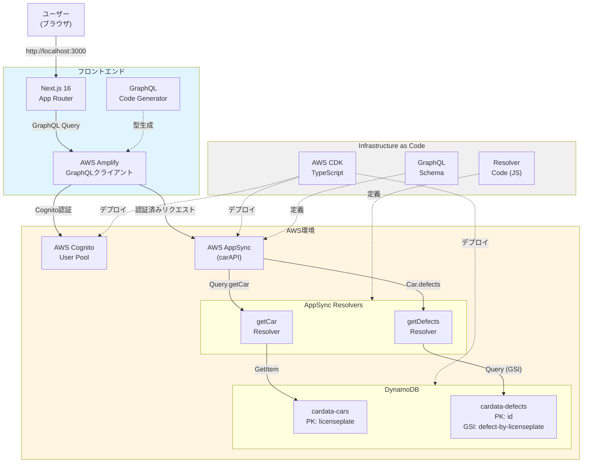
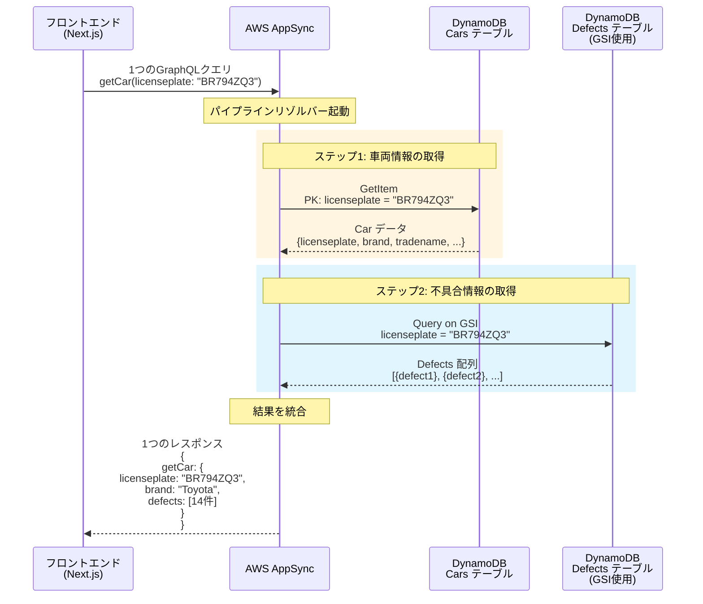
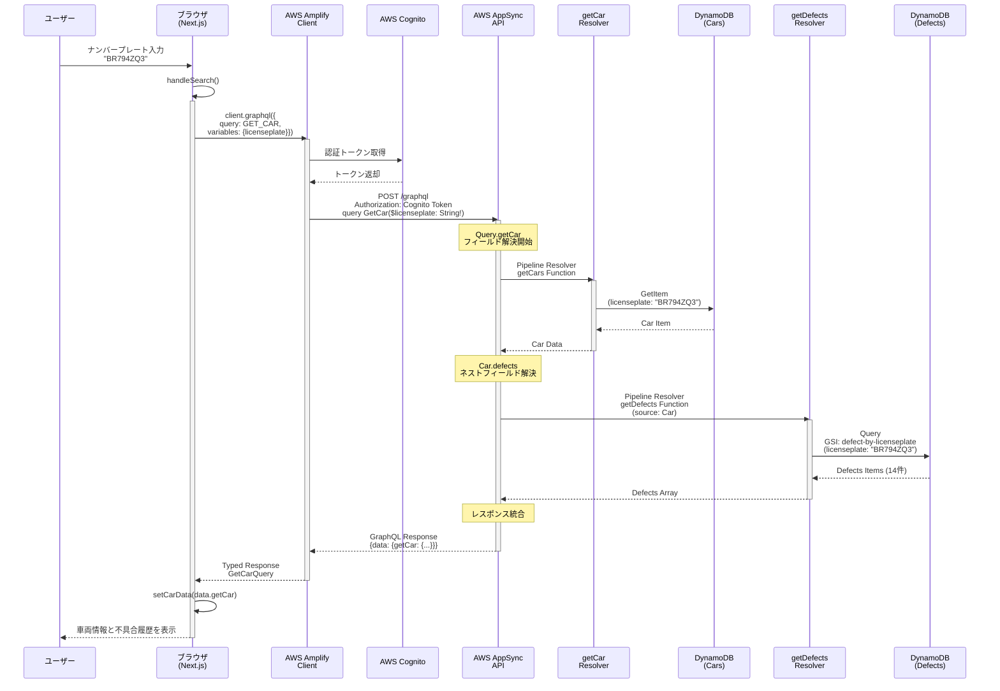

## はじめに

- **「AppSyncって興味あるけど、VTL（Velocity Template Language）を書くのが辛くて挫折した...」**
- **「GraphQLのバックエンドを自前で構築・運用するのは大変そう...」**
- **「Next.js 16とReact 19の最新機能を活かしながら、型安全に開発したい...」**

そんな悩みを抱えている方に朗報です。

**2022年以降、AppSyncはJavaScriptランタイムをサポートし、もうVTLを書く必要がなくなりました。** 

https://aws.amazon.com/jp/blogs/news/aws-appsync-graphql-apis-supports-javascript-resolvers/

この記事では、JavaScriptリゾルバーを使った最新のAppSync開発を**AWS CDK + DynamoDB + Amplify + Next.js 16**の構成で解説します。

今回は以下のコードをベースにしてアップグレードさせています。

https://github.com/aws-samples/aws-cdk-examples/blob/main/typescript/appsync-graphql-dynamodb

### この記事の対象読者

- VTLで挫折したことがあるAppSync初心者〜中級者
- Next.js 16 / React 19を使った最新のフルスタック開発に興味がある方
- インフラをコードで管理（IaC）したい方
- GraphQLの型安全性を最大限活用したい方

## この記事で得られること

本記事では、以下の内容を実際のコードと図解を交えて解説していきます。

:::message
**技術面での学び**
- **脱VTL** - JavaScriptリゾルバーでの開発体験の向上
- **AWS CDK** - TypeScriptでインフラをコード化
- **GraphQLパイプラインリゾルバー** - 1対多リレーションの実装
- **Next.js 16 + React 19** - 最新機能を活かした実装
- **Cognito認証** - セキュアなユーザー管理
- **GraphQL Code Generator** - 型安全性の確保
- **モノレポ構成** - pnpm workspacesでの統合管理
:::

:::message
**実戦での学び**
- 認証後の無限レンダリング問題とその解決法（3時間溶けました）
- DynamoDB + GSIの設計パターン
- AppSyncのコスト試算と最適化
:::

## 完成イメージ

### アプリケーション画面

**ホーム画面（車両検索）**


モダンなGlass Morphismデザインでナンバープレートによる車両検索が可能です。

**認証画面**


Amplify UIを使った美しい認証フォーム。日本語ローカライズ済みです。


メール認証によるサインアップフロー。確認コードを入力するだけで簡単に登録できます。

**車両詳細表示**


検索した車両の詳細情報と、関連する不具合履歴を一度のクエリで取得・表示します。

**全車両一覧**


ページネーション付きで全車両を一覧表示。「もっと見る」ボタンで追加読み込みが可能です。

このアプリでは、ユーザー認証（サインアップ・サインイン・パスワードリセット）、車両情報検索（ナンバープレート検索）、全車両一覧表示（ページネーション付き）といった機能を実装しています。UIはGlass MorphismとTailwind CSS v4を使ったモダンなデザインで、GraphQL通信は完全に型安全です。

## プロジェクト構成

このプロジェクトはpnpm workspacesを使ったモノレポ構成で、以下のようなディレクトリ構造になっています。

```
.
├── pkgs/
│   ├── cdk/                        # AWS CDK プロジェクト
│   │   ├── lib/
│   │   │   └── cdk-appsync-demo-stack.ts
│   │   ├── graphql/
│   │   │   └── schema.graphql      # GraphQL スキーマ
│   │   ├── resolvers/               # JavaScript リゾルバー（VTL不要！）
│   │   │   ├── getCar.js
│   │   │   ├── getDefects.js
│   │   │   └── pipeline.js
│   │   └── test/
│   │       └── cdk-appsync-demo-stack.test.ts
│   │
│   ├── frontend/                    # Next.js 16 プロジェクト
│   │   ├── app/                     # App Router
│   │   │   ├── layout.tsx
│   │   │   ├── page.tsx
│   │   │   └── auth/
│   │   │       └── page.tsx
│   │   ├── components/
│   │   ├── context/
│   │   │   └── auth-context.tsx     # 認証コンテキスト
│   │   ├── lib/
│   │   │   ├── amplify-config.ts
│   │   │   └── graphql/
│   │   │       ├── queries.ts
│   │   │       └── types.ts         # 自動生成される型定義
│   │   └── codegen.ts               # GraphQL Code Generator設定
│   │
│   └── shared/                      # 共通の型定義など
│
├── package.json
├── pnpm-workspace.yaml
└── pnpm-lock.yaml
```

モノレポにすることで、GraphQLスキーマを単一の真実の情報源として、バックエンド（CDK）とフロントエンド（Next.js）の両方で参照できます。

## 技術スタック

### バックエンド
- **Infrastructure as Code**: AWS CDK (TypeScript)
- **GraphQL API**: AWS AppSync
- **Database**: Amazon DynamoDB + GSI
- **Authentication**: AWS Cognito User Pool
- **Runtime**: Node.js 18+

### フロントエンド
- **Framework**: Next.js 16 (App Router) - React 19対応
- **UI Library**: React 19 - use フック、Server Actionsなど最新機能を活用
- **Styling**: Tailwind CSS v4
- **GraphQL Client**: AWS Amplify
- **Type Generation**: GraphQL Code Generator
- **Language**: TypeScript

> **Note**: Next.js 16とReact 19の組み合わせにより、Server Componentsでの効率的なデータフェッチが可能です。ただし、Amplifyの認証フックは現状Client Componentでの利用が前提のため、このプロジェクトでは`"use client"`を適切に配置しています。将来的にはAppSyncをServer ComponentsからIAM認証で直接呼び出す構成も検討できます。
>
> **💡 React Server Components (RSC)**
> サーバー側でレンダリングを行い、結果のHTMLだけをクライアントに送信する仕組み。JavaScriptバンドルサイズを削減し、初期表示を高速化できます。
> [Next.js公式: Server Components](https://nextjs.org/docs/app/building-your-application/rendering/server-components)

### DevOps
- **Monorepo**: pnpm workspaces
- **Linter/Formatter**: Biome
- **Testing**: Jest
- **Deployment**: AWS CDK + Amplify Hosting

## なぜこの構成を選んだのか

### AWS AppSync を選んだ理由

従来のGraphQLサーバー構築には以下のような課題がありました。
```
Express + GraphQL + TypeGraphQL + Prisma
↓
- サーバーのスケーリング管理が必要
- リゾルバーの実装が煩雑
- インフラ管理のオーバーヘッド
```

AppSyncを使うことで、これらの課題が一気に解決します。
```
AWS AppSync
↓
- サーバーレス（スケーリング自動）
- DynamoDBとの直接統合
- リアルタイムサブスクリプション標準搭載
- 認証・認可が組み込み
```

### DynamoDB と GSI でリレーションを実現

1対多のリレーションシップは以下のように実現しています。
```
Cars Table (cardata-cars)
  - PK: licenseplate
  ↓
Defects Table (cardata-defects)
  - PK: id
  - GSI: defect-by-licenseplate (PK: licenseplate)
```

GSIを活用することで、NoSQLでもRDBのようなリレーショナルクエリが可能になります。

> **📚 用語解説: GSI (Global Secondary Index)**
>
> DynamoDBにおいて、プライマリキー（PK）以外で効率的にデータを検索するための仕組みです。RDBのインデックスに似ていますが、GSI自体が「射影された別のテーブル」として非同期に維持される点が特徴です。
> [AWS公式: GSIについて](https://docs.aws.amazon.com/ja_jp/amazondynamodb/latest/developerguide/GSI.html)

システム全体の構成は以下の通りです。



このアーキテクチャでは、フロントエンド（Next.js + Amplify）で型安全なGraphQL通信を行い、Cognito User Poolで安全なユーザー管理を実現しています。

APIはAppSyncでサーバーレスGraphQL APIとして提供され、DynamoDB + GSIで効率的なデータ取得を行います。そして全てのインフラをCDKでコード化しています。

### GraphQL Code Generator で開発体験が劇的に向上

スキーマ定義から自動で型を生成できるため、開発がとても楽になります。

```graphql
type Car {
  licenseplate: String!
  brand: String!
  defects: [Defect]
}
```

↓ **自動生成**

```typescript
export type GetCarQuery = {
  __typename?: 'Query';
  getCar?: {
    __typename?: 'Car';
    licenseplate: string;
    brand: string;
    defects?: Array<{
      __typename?: 'Defect';
      // ...
    }> | null;
  } | null;
};
```

これにより、コンパイル時にエラー検出、IDEの自動補完、安全なリファクタリングが可能になります。

---

## 実装編：段階的に構築していく

### ステップ1｜CDKでインフラを構築

> **🛠️ IaC (Infrastructure as Code) とは？**
>
> サーバーやネットワークなどのインフラ構成を、手動ではなくコード（プログラム）で管理・構築する手法です。AWS CDKを使うと、TypeScriptなどのプログラミング言語でインフラを定義でき、バージョン管理や再利用が容易になります。

#### DynamoDBテーブルの定義

```typescript
// pkgs/cdk/lib/cdk-appsync-demo-stack.ts

const carsTable = new Table(this, "CarsTable", {
  tableName: "cardata-cars",
  partitionKey: { name: "licenseplate", type: AttributeType.STRING },
  billingMode: BillingMode.PAY_PER_REQUEST,
  removalPolicy: RemovalPolicy.DESTROY,
});

const defectsTable = new Table(this, "DefectsTable", {
  tableName: "cardata-defects",
  partitionKey: { name: "id", type: AttributeType.STRING },
  billingMode: BillingMode.PAY_PER_REQUEST,
  removalPolicy: RemovalPolicy.DESTROY,
});

// GSI追加（1対多リレーション用）
defectsTable.addGlobalSecondaryIndex({
  indexName: "defect-by-licenseplate",
  partitionKey: { name: "licenseplate", type: AttributeType.STRING },
});
```

ここでは`PAY_PER_REQUEST`を使って従量課金にしています（開発初期はこれが一番コスト最適です）。また、GSIを追加することで`licenseplate`による検索を可能にしています。

#### Cognito User Pool の作成

```typescript
const userPool = new UserPool(this, "UserPool", {
  userPoolName: "appsync-sample-user-pool",
  selfSignUpEnabled: true,
  signInAliases: { email: true },
  autoVerify: { email: true },
  passwordPolicy: {
    minLength: 8,
    requireLowercase: true,
    requireUppercase: true,
    requireDigits: true,
    requireSymbols: false, // 記号不要でUX向上
  },
  accountRecovery: AccountRecovery.EMAIL_ONLY,
  removalPolicy: RemovalPolicy.DESTROY,
});

const userPoolClient = userPool.addClient("WebClient", {
  userPoolClientName: "appsync-sample-web-client",
  authFlows: {
    userPassword: true,
    userSrp: true,
  },
  oAuth: {
    flows: { authorizationCodeGrant: true },
    scopes: [OAuthScope.EMAIL, OAuthScope.OPENID, OAuthScope.PROFILE],
  },
  accessTokenValidity: Duration.hours(1),
  idTokenValidity: Duration.hours(1),
  refreshTokenValidity: Duration.days(30),
});
```

メール認証で簡単にサインアップできるようにし、パスワードポリシーはバランス重視（記号不要）で設定しています。トークン有効期限も適切に設定しました。

#### AppSync API の作成

```typescript
const api = new GraphqlApi(this, "GraphQLAPI", {
  name: "carAPI",
  definition: Definition.fromFile(
    path.join(__dirname, "../graphql/schema.graphql")
  ),
  authorizationConfig: {
    defaultAuthorization: {
      authorizationType: AuthorizationType.USER_POOL,
      userPoolConfig: { userPool },
    },
    additionalAuthorizationModes: [
      { authorizationType: AuthorizationType.API_KEY },
      { authorizationType: AuthorizationType.IAM },
    ],
  },
  logConfig: {
    fieldLogLevel: FieldLogLevel.ALL,
  },
});
```

Cognito User Pool を**デフォルト認証**に設定し、API_KEY と IAM は追加モード（後方互換性のため）としました。ログレベルを ALL にして開発時のデバッグを容易にしています。

---

### ステップ2｜GraphQLスキーマとリゾルバー

#### 脱VTL！JavaScriptリゾルバーで開発効率が爆上がり

AppSyncといえば、以前はVTL（Velocity Template Language）でリゾルバーを書く必要があり、正直かなり辛い開発体験でした。しかし、2022年からJavaScriptランタイムが登場し、今ではVTLを書く必要が一切なくなりました。

https://aws.amazon.com/jp/blogs/compute/best-practices-for-working-with-the-apache-velocity-template-language-in-amazon-api-gateway/

> **📝 VTL (Velocity Template Language) とは？**
>
> Javaベースのテンプレートエンジンで、AppSyncの初期からリゾルバー記述言語として採用されていました。しかし、独特な構文、ローカルデバッグの難しさ、JSON生成の煩雑さなどから学習コストが高く、多くの開発者がAppSync採用を躊躇する「最大の壁」となっていました。

```javascript
// 従来のVTL（もう書きたくない...）
{
  "version": "2017-02-28",
  "operation": "GetItem",
  "key": {
    "licenseplate": $util.dynamodb.toDynamoDBJson($ctx.args.licenseplate)
  }
}

// ↓ JavaScriptリゾルバー（読みやすい！）
export function request(ctx) {
  return {
    operation: "GetItem",
    key: util.dynamodb.toMapValues({
      licenseplate: ctx.args.licenseplate,
    }),
  };
}
```

JavaScriptリゾルバーのメリット：

- **エディタのサポートが効く** - VSCodeでの補完、シンタックスハイライト
- **デバッグが容易** - console.logでのデバッグが可能
- **JavaScriptの豊富なライブラリが使える** - 日付操作、バリデーションなど
- **チームメンバーの学習コストが低い** - ほとんどの開発者がJavaScriptを知っている

AppSyncを中心としたアーキテクチャを図で表すと以下のようになります。  
※ サンプルコードから構成はほぼ変えていないのでそのまま抜粋させていただいています。


AppSyncを中心としたアーキテクチャで、DynamoDBとの統合、パイプラインリゾルバーによる効率的なデータ取得を実現しています。

#### スキーマ定義

```graphql
# pkgs/cdk/graphql/schema.graphql

type Car {
  licenseplate: String!
  brand: String!
  tradename: String
  expirydateapk: String
  firstcolor: String!
  defects: [Defect]  # ← ネストされたフィールド
}

type Defect {
  licenseplate: String!
  defectstartdate: String
  defectdescription: String
}

type CarsConnection {
  items: [Car]
  nextToken: String
}

type Query {
  getCar(licenseplate: String!): Car
  listCars(limit: Int, nextToken: String): CarsConnection
}
```

`Car.defects` でネストされたリレーションを表現し、`CarsConnection` でページネーションに対応しています。

#### パイプラインリゾルバーの実装

まずgetCarリゾルバーから見ていきましょう。

```javascript
// pkgs/cdk/resolvers/getCar.js

export function request(ctx) {
  return {
    operation: "GetItem",
    key: util.dynamodb.toMapValues({
      licenseplate: ctx.args.licenseplate,
    }),
  };
}

export function response(ctx) {
  return ctx.result;
}
```

次にgetDefectsリゾルバー（ネストフィールド用）です。

```javascript
// pkgs/cdk/resolvers/getDefects.js

export function request(ctx) {
  const limit = 20;
  const query = JSON.parse(
    util.transform.toDynamoDBConditionExpression({
      licenseplate: { eq: ctx.source.licenseplate }, // 親のlicenseplateを使用
    })
  );

  return {
    operation: "Query",
    index: "defect-by-licenseplate", // GSI指定
    query,
    limit,
  };
}

export function response(ctx) {
  if (ctx.error) {
    util.error(ctx.error.message, ctx.error.type);
  }
  return ctx.result.items;
}
```

パイプラインリゾルバーの設定は以下のようにシンプルです。

```javascript
// pkgs/cdk/resolvers/pipeline.js

export function request(_ctx) {
  return {};
}

export function response(ctx) {
  return ctx.prev.result; // 前の関数の結果をそのまま返す
}
```

これらをCDKで登録していきます。

```typescript
// AppSync関数の定義
const carsResolver = new AppsyncFunction(this, "CarsFunction", {
  name: "getCars",
  api,
  dataSource: carsDataSource,
  code: Code.fromAsset(path.join(__dirname, "../resolvers/getCar.js")),
  runtime: FunctionRuntime.JS_1_0_0,
});

const defectsResolver = new AppsyncFunction(this, "DefectsFunction", {
  name: "getDefects",
  api,
  dataSource: defectsDataSource,
  code: Code.fromAsset(path.join(__dirname, "../resolvers/getDefects.js")),
  runtime: FunctionRuntime.JS_1_0_0,
});

// パイプラインリゾルバーの定義
new Resolver(this, "PipelineResolverGetCars", {
  api,
  typeName: "Query",
  fieldName: "getCar",
  runtime: FunctionRuntime.JS_1_0_0,
  code: Code.fromAsset(path.join(__dirname, "../resolvers/pipeline.js")),
  pipelineConfig: [carsResolver],
});

new Resolver(this, "PipelineResolverGetDefects", {
  api,
  typeName: "Car",
  fieldName: "defects",
  runtime: FunctionRuntime.JS_1_0_0,
  code: Code.fromAsset(path.join(__dirname, "../resolvers/pipeline.js")),
  pipelineConfig: [defectsResolver],
});
```

#### データ取得の全体像（シンプル版）

まず、AppSyncがどのように複数テーブルから情報を取得するのか全体像を把握しましょう。



ここで重要なのは、フロントエンドからは1回のクエリを投げるだけで、複雑な処理はすべてAppSyncが担当してくれる点です。ステップ1でCarsテーブルから車両の基本情報を取得し、ステップ2でDefectsテーブルのGSIから関連する不具合を取得。そしてAppSyncが自動的に2つのテーブルのデータを1つのレスポンスにまとめてくれます。

従来の実装と比較すると、その違いは一目瞭然です。

```typescript
// 従来の方法（N+1問題）
const car = await fetchCar(licenseplate);
const defects = await fetchDefects(licenseplate); // 2回目のリクエスト
const result = { ...car, defects };

// AppSyncの方法
const result = await client.graphql({
  query: GET_CAR,
  variables: { licenseplate }
}); // 1回のリクエストで完結！
```

---

#### 詳細なデータフロー（詳細版）

より詳しい処理の流れを知りたい方向けに、認証を含めた詳細なシーケンス図も用意しました。



処理の流れ：

- まずユーザーがナンバープレートを入力し、Cognitoから認証トークンを取得します。
- その後、AppSync APIにGraphQLクエリを送信し、Query.getCarが解決されてDynamoDBから車両データを取得（GetItem）します。
- 次にCar.defectsフィールドが解決され、GSIを使って関連する不具合データを取得（Query）。
- 最後にレスポンスが統合され、TypeScriptの型付きでフロントエンドに返却されます。

> **⚠️ N+1問題とは？**
>
> 一覧データ（N件）を取得した後、それぞれのデータに関連する詳細情報を取得するために、さらにN回のクエリを発行してしまうパフォーマンス問題のこと。合計でN+1回の通信が発生し、アプリの動作が極端に遅くなる原因になります。

---

#### なぜこのアーキテクチャが優れているのか

まず、N+1問題を完全に回避できる点が素晴らしいです。

```
従来のREST API:
GET /api/cars/BR794ZQ3          → 1回目のリクエスト
GET /api/cars/BR794ZQ3/defects  → 2回目のリクエスト
（ネットワークラウンドトリップが2回）

AppSync + パイプラインリゾルバー:
POST /graphql (getCar query)    → 1回のリクエスト
（内部で2つのテーブルから取得するが、クライアントからは1回）
```

データ取得も最適化されています。

| テーブル | 操作 | インデックス | 効率 |
|---------|------|------------|------|
| Cars | GetItem | PK: licenseplate | 超高速（O(1)） |
| Defects | Query | GSI: licenseplate | 高速（索引検索） |

スキーマで関係性を表現できる点も重要です。

```graphql
type Car {
  licenseplate: String!
  brand: String!
  defects: [Defect]  # ← ここがポイント！
}
```

GraphQLスキーマで「CarはDefectsを持つ」という関係を宣言するだけで、AppSyncが自動的にデータを取得・統合してくれます。

そして、フロントエンドのコードが驚くほどシンプルになります。

```typescript
// たった1回のクエリで全データ取得
const { data } = await client.graphql({
  query: GET_CAR,
  variables: { licenseplate }
});

// 車両情報と不具合が既に統合されている
console.log(data.getCar.brand);        // "Toyota"
console.log(data.getCar.defects);      // [14件の不具合]
```

1回のクエリで車両と不具合の両方を取得できるため、N+1問題を完全に回避できます。

パイプラインリゾルバーで処理を分離することで再利用性も向上し、GSIによる効率的なクエリで高速なデータ取得を実現。Cognito認証でセキュアなAPI呼び出しを行い、スキーマ駆動で型安全性とドキュメント性を両立しています。

---

### ステップ3｜Next.jsフロントエンド実装

#### Amplify設定

```typescript
// pkgs/frontend/lib/amplify-config.ts

import { Amplify } from "aws-amplify";

Amplify.configure({
  Auth: {
    Cognito: {
      userPoolId: process.env.NEXT_PUBLIC_USER_POOL_ID!,
      userPoolClientId: process.env.NEXT_PUBLIC_USER_POOL_CLIENT_ID!,
      loginWith: { email: true },
      signUpVerificationMethod: "code",
      passwordFormat: {
        minLength: 8,
        requireLowercase: true,
        requireUppercase: true,
        requireNumbers: true,
        requireSpecialCharacters: false,
      },
    },
  },
  API: {
    GraphQL: {
      endpoint: process.env.NEXT_PUBLIC_APPSYNC_ENDPOINT!,
      region: process.env.NEXT_PUBLIC_AWS_REGION!,
      defaultAuthMode: "userPool", // Cognito認証を使用
    },
  },
});
```

#### 認証コンテキストの実装

```typescript
// pkgs/frontend/context/auth-context.tsx

"use client";

import { createContext, useContext, useEffect, useState, useCallback } from "react";
import { getCurrentUser, signOut as amplifySignOut } from "aws-amplify/auth";
import { Hub } from "aws-amplify/utils";

interface AuthUser {
  username: string;
  email?: string;
}

interface AuthContextType {
  user: AuthUser | null;
  loading: boolean;
  error: Error | null;
  signOut: () => Promise<void>;
  refreshUser: () => Promise<void>;
}

const AuthContext = createContext<AuthContextType | undefined>(undefined);

export function AuthProvider({ children }: { children: React.ReactNode }) {
  const [user, setUser] = useState<AuthUser | null>(null);
  const [loading, setLoading] = useState(true);
  const [error, setError] = useState<Error | null>(null);

  const fetchUser = useCallback(async () => {
    try {
      setLoading(true);
      const currentUser = await getCurrentUser();
      setUser({
        username: currentUser.username,
        email: currentUser.signInDetails?.loginId,
      });
      setError(null);
    } catch (err) {
      setUser(null);
      setError(err instanceof Error ? err : new Error("Unknown error"));
    } finally {
      setLoading(false);
    }
  }, []);

  useEffect(() => {
    fetchUser();

    // 重要: Amplify Hubで認証イベントを監視
    const hubListener = Hub.listen("auth", ({ payload }) => {
      const { event } = payload;

      if (
        event === "signInWithRedirect" ||
        event === "tokenRefresh" ||
        event === "signedOut"
      ) {
        fetchUser();
      }
    });

    return () => hubListener();
  }, [fetchUser]);

  const signOut = async () => {
    try {
      await amplifySignOut();
      setUser(null);
    } catch (err) {
      console.error("Sign out error:", err);
    }
  };

  return (
    <AuthContext.Provider
      value={{ user, loading, error, signOut, refreshUser: fetchUser }}
    >
      {children}
    </AuthContext.Provider>
  );
}

export const useAuth = () => {
  const context = useContext(AuthContext);
  if (!context) {
    throw new Error("useAuth must be used within AuthProvider");
  }
  return context;
};
```

`Hub.listen("auth", ...)` で認証イベントを自動検出し、グローバルな認証状態を管理しています。

#### 認証トークンのセキュリティについて

Amplifyはデフォルトで認証トークンを**LocalStorage**に保存します。  
XSS攻撃のリスクを懸念する場合は、以下の対策を検討してください：

- **HttpOnly Cookie**を使った実装（ただしAmplifyのデフォルト挙動をオーバーライドする必要あり）
- **厳格なCSP（Content Security Policy）**の設定
- **Amplify Gen 2**への移行（よりセキュアなトークン管理）

本プロジェクトでは、開発のしやすさを優先してAmplifyのデフォルト設定（LocalStorage）を使用していますが、本番環境ではセキュリティ要件に応じた適切な対策を実施してください。

#### 認証ページの実装

```typescript
// pkgs/frontend/app/auth/page.tsx

"use client";

import { Authenticator } from "@aws-amplify/ui-react";
import { useAuth } from "@/context/auth-context";
import { useRouter } from "next/navigation";
import { useEffect, useRef } from "react";

export default function AuthPage() {
  const { user, loading, refreshUser } = useAuth();
  const router = useRouter();

  // 認証済みユーザーは自動リダイレクト
  useEffect(() => {
    if (!loading && user) {
      router.replace("/");
    }
  }, [user, loading, router]);

  return (
    <div className="min-h-screen flex items-center justify-center p-4">
      <div className="w-full max-w-md">
        <Authenticator
          formFields={{
            signUp: {
              email: { label: "メールアドレス", placeholder: "example@example.com" },
              password: { label: "パスワード", placeholder: "8文字以上" },
              confirm_password: { label: "パスワード（確認）" },
            },
            signIn: {
              username: { label: "メールアドレス" },
              password: { label: "パスワード" },
            },
          }}
        >
          {({ user: authUser }) => {
            const AuthSync = () => {
              const hasSynced = useRef(false);

              useEffect(() => {
                if (authUser && !hasSynced.current) {
                  hasSynced.current = true;
                  refreshUser(); // AuthContextと同期
                }
              }, [authUser]);

              return (
                <div className="h-8 flex items-center justify-center">
                  <div className="w-6 h-6 border-2 border-blue-500 border-t-transparent rounded-full animate-spin" />
                </div>
              );
            };

            return <AuthSync />;
          }}
        </Authenticator>
      </div>
    </div>
  );
}
```

認証フローを実装すると、以下のように動作します。


認証成功後、スムーズにホーム画面へ遷移します。

---

### 実戦で遭遇！認証後の無限レンダリング問題

#### 問題の症状

```
1. /auth で認証成功 → / にリダイレクト
2. / の ProtectedRoute が認証チェック → まだ AuthContext 未更新
3. 未認証と判断 → /auth にリダイレクト
4. /auth で認証済みと判断 → 再び / にリダイレクト
5. ← 無限ループ！🔄
```

#### 解決策

まず、Amplify Hubでイベントを監視します（AuthContext）。

```typescript
useEffect(() => {
  fetchUser();

  const hubListener = Hub.listen("auth", ({ payload }) => {
    const { event } = payload;

    if (
      event === "signInWithRedirect" ||
      event === "tokenRefresh" ||
      event === "signedOut"
    ) {
      fetchUser(); // 認証状態が変わったら即座に更新
    }
  });

  return () => hubListener();
}, [fetchUser]);
```

次に、useRefで一度だけ同期処理を実行します（認証ページ）。

```typescript
const AuthSync = () => {
  const hasSynced = useRef(false);

  useEffect(() => {
    if (authUser && !hasSynced.current) {
      hasSynced.current = true; // フラグを立てて二重実行防止
      refreshUser();
    }
  }, [authUser]);

  return <LoadingSpinner />;
};
```

最後に、router.replace()を使います。

```typescript
useEffect(() => {
  if (!loading && user) {
    router.replace("/"); // push ではなく replace
  }
}, [user, loading, router]);
```

認証後、リロードなしでスムーズに画面遷移できるようになりました。

---

### ステップ4｜GraphQL Code Generatorで型安全性を確保

#### 設定ファイル

```typescript
// pkgs/frontend/codegen.ts

import type { CodegenConfig } from "@graphql-codegen/cli";

const config: CodegenConfig = {
  schema: "../cdk/graphql/schema.graphql",
  documents: ["lib/graphql/**/*.ts"],
  generates: {
    "./lib/graphql/types.ts": {
      plugins: [
        "typescript",
        "typescript-operations",
      ],
    },
  },
};

export default config;
```

#### GraphQLクエリ定義

```typescript
// pkgs/frontend/lib/graphql/queries.ts

export const GET_CAR = /* GraphQL */ `
  query GetCar($licenseplate: String!) {
    getCar(licenseplate: $licenseplate) {
      licenseplate
      brand
      tradename
      expirydateapk
      firstcolor
      defects {
        licenseplate
        defectdescription
        defectstartdate
      }
    }
  }
`;
```

#### 型生成と使用方法

```bash
pnpm codegen
```

↓ **自動生成された型を使用**

```typescript
// pkgs/frontend/app/components/CarSearch.tsx

import { GetCarQuery } from "@/lib/graphql/types";

const result = await client.graphql({
  query: GET_CAR,
  variables: { licenseplate: licenseplate.trim() },
});

const data = (result as any).data as GetCarQuery;

if (data?.getCar) {
  setCarData(data.getCar); // 型安全！
}
```

VSCodeで自動補完が効き、スキーマ変更時にコンパイルエラーで気付けるため、リファクタリングが安全になります。

---

## デプロイ手順

### 1. バックエンドデプロイ

```bash
# CDKスタックのデプロイ
cd pkgs/cdk
pnpm run build
cdk deploy

# 出力される値をメモ:
# - GraphQLAPIURL
# - GraphQLAPIKey
# - UserPoolId
# - UserPoolClientId
```

### 2. サンプルデータ投入

```bash
export CDK_DEFAULT_REGION=ap-northeast-1
pnpm push-data
```

### 3. フロントエンド設定

```bash
cd pkgs/frontend

# 環境変数設定
cp .env.local.example .env.local

# .env.local を編集して以下を設定:
# NEXT_PUBLIC_APPSYNC_ENDPOINT=<GraphQLAPIURL>
# NEXT_PUBLIC_USER_POOL_ID=<UserPoolId>
# NEXT_PUBLIC_USER_POOL_CLIENT_ID=<UserPoolClientId>
# NEXT_PUBLIC_AWS_REGION=ap-northeast-1

# 型生成
pnpm codegen

# 開発サーバー起動
pnpm dev
```

### 4. 動作確認

1. http://localhost:3000/auth にアクセス
2. メールアドレスでサインアップ
3. 確認コードを入力
4. ログイン後、車両検索を試す

---

## テスト実装

### CDKスタックのユニットテスト

```typescript
// pkgs/cdk/test/cdk-appsync-demo-stack.test.ts

import { Template } from "aws-cdk-lib/assertions";
import { App } from "aws-cdk-lib";
import { CdkAppsyncDemoStack } from "../lib/cdk-appsync-demo-stack";

describe("CdkAppsyncDemoStack", () => {
  let template: Template;

  beforeAll(() => {
    const app = new App();
    const stack = new CdkAppsyncDemoStack(app, "TestStack");
    template = Template.fromStack(stack);
  });

  test("DynamoDB Tables Created", () => {
    template.resourceCountIs("AWS::DynamoDB::Table", 2);
  });

  test("Cognito User Pool Created", () => {
    template.hasResourceProperties("AWS::Cognito::UserPool", {
      UserPoolName: "appsync-sample-user-pool",
      AutoVerifiedAttributes: ["email"],
    });
  });

  test("AppSync API with User Pool Auth", () => {
    template.hasResourceProperties("AWS::AppSync::GraphQLApi", {
      Name: "carAPI",
      AuthenticationType: "AMAZON_COGNITO_USER_POOLS",
    });
  });

  test("Pipeline Resolvers Created", () => {
    template.resourceCountIs("AWS::AppSync::Resolver", 3);
  });
});
```

```bash
pnpm test
# 42 tests passed
```

---

## パフォーマンス最適化のポイント

### 1. DynamoDBのベストプラクティス

```typescript
// Bad: Scanは全件スキャンで遅い
const items = await dynamodb.scan({ TableName: "cars" });

// Good: GetItemで高速取得
const item = await dynamodb.getItem({
  TableName: "cars",
  Key: { licenseplate: "BR794ZQ3" },
});

// Good: GSIでクエリ
const defects = await dynamodb.query({
  TableName: "defects",
  IndexName: "defect-by-licenseplate",
  KeyConditionExpression: "licenseplate = :lp",
  ExpressionAttributeValues: { ":lp": "BR794ZQ3" },
});
```

### 2. Next.jsの最適化

```typescript
// app/layout.tsx でAmplify設定を一度だけ実行
import { configureAmplify } from "@/lib/amplify-config";

configureAmplify(); // クライアントサイドで一度だけ

export default function RootLayout({ children }) {
  return (
    <html lang="ja">
      <body>
        <AuthProvider>{children}</AuthProvider>
      </body>
    </html>
  );
}
```

---

## 学んだこと・ハマったポイント

### AppSyncのパイプラインリゾルバーは本当に強力

従来のGraphQLサーバーではリゾルバー内でデータソースを複数呼び出す必要がありましたが、AppSyncのパイプラインリゾルバーなら各処理を関数として分離できるため再利用可能です。しかも、ネストされたフィールドで自動的に親のデータを受け取れるため、コード量が大幅に削減できます。

### Cognito認証の状態管理は本当に難しい

最初は失敗しました。
```typescript
// Authenticatorコンポーネントだけで認証管理
<Authenticator>
  {({ user }) => <div>{user.username}</div>}
</Authenticator>
```

こうすることで成功しました。
```typescript
// グローバルなAuthContextで管理 + Hub監視
const { user } = useAuth();
Hub.listen("auth", handleAuthEvent);
```

### GraphQL Code Generatorは手放せない

スキーマ変更時の影響範囲が即座に分かるため、リファクタリングの安全性が段違いです。

### 認証後の無限レンダリングで3時間溶けた

解決策として、`Hub.listen("auth", ...)` で認証イベントを監視し、`useRef` で一度だけ同期処理を実行、`router.replace()` で履歴をクリーンにしました。

### DynamoDBのGSIは最初から定義すべし

GSIは**テーブル作成後**に追加すると時間がかかります。CDKで最初から定義するのがベストです。

---

## 実際の開発フロー

このプロジェクトでの実際の開発フローを紹介します。

### 1. スキーマ変更時の流れ

**GraphQLスキーマを変更:**


スキーマファイルを編集すると、CDKとフロントエンドの両方に影響します。

**型を自動生成:**

```bash
cd pkgs/frontend
pnpm codegen
```

これにより、TypeScriptの型定義が自動的に更新され、コンパイル時にエラーを検出できます。

### 2. UI実装の様子

**車両一覧の実装:**


GraphQL Code Generatorで生成された型を使って、型安全にデータを扱えます。VSCodeの自動補完が効くため、開発効率が大幅に向上します。

### 3. エンドツーエンドの開発体験

```bash
# 1. バックエンドのスキーマ変更
vim pkgs/cdk/graphql/schema.graphql

# 2. CDKビルド & デプロイ
cd pkgs/cdk
pnpm build
cdk deploy

# 3. フロントエンドの型生成
cd ../frontend
pnpm codegen

# 4. コンポーネント実装（型安全！）
vim app/components/CarList.tsx

# 5. 開発サーバー起動
pnpm dev
```

この開発フローの良い点は、スキーマが単一の真実の情報源（Single Source of Truth）として機能し、バックエンドの変更が即座にフロントエンドの型に反映されることです。コンパイル時にエラー検出できるため実行時のバグを防止でき、IDEの支援により爆速開発が可能になります。

---

## まとめ

この記事では、**AWS AppSync × Next.js** による本格的なフルスタックアプリケーションの構築方法を、実際のコード例と図解を交えて徹底解説しました。

### 重要なポイントまとめ

アーキテクチャ設計については、CDKでインフラをコード化することで再現性が高くなり、チーム開発もスムーズになりました。パイプラインリゾルバーでGraphQLの複雑な処理もシンプルに分離でき、DynamoDB + GSIを使うことでNoSQLでもリレーショナル的なクエリが可能になります。Mermaid図でシステム構成を可視化したことで、チームメンバーの理解も深まりました。

認証・セキュリティに関しては、Cognito認証でHub監視を使って状態管理を確実にし、無限レンダリング問題は`useRef` + `Hub.listen`の組み合わせで解決しました。トークン管理はAmplifyに任せることで、開発者は本質的な実装に集中できます。

開発体験の面では、GraphQL Code Generatorで型安全性を確保したことが本当に大きかったです。コンパイル時にエラー検出できるため、実行時のバグが激減しました。モノレポ構成でフロントエンド・バックエンドを統合管理し、スキーマ駆動開発によりバックエンドの変更が即座にフロントエンドに反映されます。

### 実戦での学び

認証状態の同期は `Hub.listen` で自動化し、`useRef` でフラグ管理して二重実行を防止、`router.replace()` でブラウザ履歴をクリーンに保つことが認証周りのベストプラクティスです。

インフラのコード化については、初期コストはかかるものの、長期的には保守性・再現性・チーム協業で大きなメリットがあります。CDKのテスト機能で、インフラの変更も自信を持ってデプロイでき、CloudFormationの出力を自動的に環境変数に設定することも可能です。

型安全性については、GraphQLスキーマが変更されたらコンパイルエラーで即座に気付けます。IDEの自動補完により、開発速度が2〜3倍に向上し、リファクタリング時の安心感が段違いです。

### どんなプロジェクトに向いているか

この構成が最適なのは、スタートアップのMVP開発で素早く型安全に作りたい場合や、認証機能が必須のWebアプリケーション、リアルタイム性が求められるアプリ（AppSyncのサブスクリプションを活用）、インフラ管理を最小限に抑えたいチームなどです。

一方で、複雑なトランザクション処理が必要な場合はRDBの方が適切ですし、AppSyncの料金が気になる場合は自前でGraphQLサーバーを立てた方が安い場合もあります。また、DynamoDBのクエリパターンに合わない複雑なリレーションがある場合も向いていません。

### 次のステップ

このアーキテクチャをさらに発展させるなら、AppSync Subscriptionsでリアルタイム機能を追加したり、S3 + CloudFrontで画像管理を実装したり、OpenSearch Serviceと統合して全文検索を実現したりできます。Cognitoグループを使ったマルチテナント対応や、GitHub Actions + CDK Pipelinesを使ったCI/CD構築も視野に入れています。

### おわりに

このプロジェクトを通じて、**VTLから解放されたAppSync開発の快適さ**と**型安全な開発の威力**を実感しました。

特に印象的だったのは以下の点です：

1. **JavaScriptリゾルバーの開発体験** - VTL時代には考えられないほど快適。エディタのサポート、デバッグのしやすさ、チームメンバーの理解のしやすさ、すべてが向上しました。

2. **GraphQL Code Generatorの威力** - スキーマ変更がコンパイルエラーで即座に分かるため、リファクタリングが怖くなくなりました。開発速度が2〜3倍になったと実感しています。

3. **CDKによるインフラのコード化** - 「インフラもGitで管理できる」という安心感と、「チーム全員が同じ環境を再現できる」という再現性の高さが素晴らしいです。

4. **Next.js 16 + React 19** - Server Componentsなど最新機能を活かせる環境が整い、今後の拡張性も十分です。

ここまで読んでいただきありがとうございました！！

## サンプルコード

完全なサンプルコードは以下のリポジトリで公開しています：

https://github.com/mashharuki/AppSyncSample-2

## Xのフォローもよろしくお願いします！！

https://twitter.com/haruki_web3


## 参考リンク・公式ドキュメント

- [React 19 ブログ](https://react.dev/blog/2024/04/25/react-19) - 新機能の解説
- [GraphQL Code Generator](https://the-guild.dev/graphql/codegen) - 型生成ツール
- [Tailwind CSS v4](https://tailwindcss.com/docs) - CSSフレームワーク
- [Biome](https://biomejs.dev/ja/) - 高速なフォーマッター＆リンター - GraphQL APIの詳細
- [AWS CDK 公式ドキュメント](https://docs.aws.amazon.com/cdk/) - Infrastructure as Code
- [AWS Amplify 公式ドキュメント](https://docs.amplify.aws/) - 認証・GraphQLクライアント
- [AWS Cognito 公式ドキュメント](https://docs.aws.amazon.com/cognito/) - ユーザー認証

### フロントエンド
- [Next.js 公式ドキュメント](https://nextjs.org/docs) - App Routerの詳細
- [GraphQL Code Generator](https://the-guild.dev/graphql/codegen) - 型生成ツール
- [Tailwind CSS v4](https://tailwindcss.com/docs) - CSSフレームワーク
