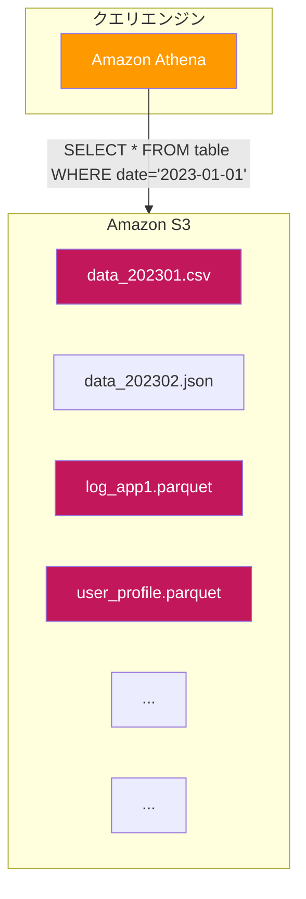
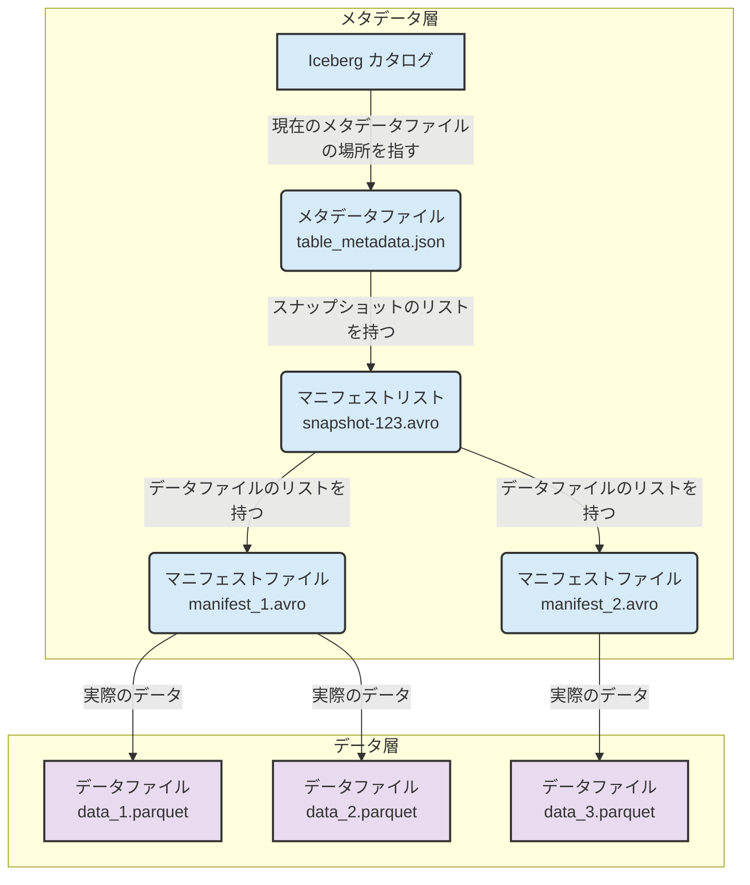
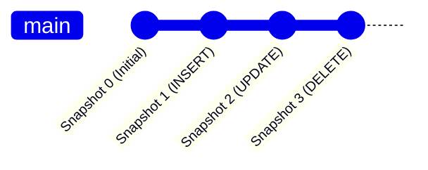

## はじめに

2025年9月20日、21日に開催された「Serverless Days Tokyo 2025」。

https://serverless.connpass.com/event/362044/

多くの刺激的なセッションやワークショップが行われる中、**Amazon AthenaとApache Iceberg**をテーマにしたワークショップに参加してみました！

https://aws.amazon.com/jp/athena/

https://aws.amazon.com/jp/what-is/apache-iceberg/

その内容がとても良かったので学びをシェアするための記事を書きました！

ぜひ最後まで読んでいってください！

下佐粉さんのスライドとても分かりやすいです！！

https://speakerdeck.com/simosako/apache-icebergwoti-yan-siyou-20250921

従来のデータレイク運用では、パフォーマンスの維持、スキーマ変更への追従、データの一貫性確保など、多くの課題に頭を悩ませてきました。

しかし、このワークショップで体験した **Amazon Athena × Apache Iceberg** の組み合わせは、これらの課題を解決するアプローチとなっています。


この記事では、そのワークショップで得た学びを基に、なぜこの組み合わせが「最強」なのか、そしてデータ分析の未来をどう変えるのかを、ハンズオンの記録を交えながら分かりやすく解説していきます！

ワークショップを追体験できるようになっているので参加できなかった方はこちらの記事でキャッチアップしてください！

## そもそもデータレイクとは？

まず、基本に立ち返ってみましょう。

:::message
**データレイク**とは

構造化データ（例: RDBのテーブル）や非構造化データ（例: テキスト、画像、ログファイル）など、あらゆる形式のデータを元の形のまま一元的に保存できる、巨大なストレージリポジトリのことです。
:::

データを事前に加工・整形（スキーマ定義）してから保存する**データウェアハウス（DWH）**とは異なり、データレイクはまずデータをそのまま保存し、分析するタイミングでスキーマを適用します（これを **スキーマ・オン・リード** と呼びます）。

この柔軟性がデータレイクの大きなメリットですが、一方で、実運用では以下のような多くの課題に直面します。これがいわゆる「**データの沼（Data Swamp）**」問題です。

:::message
**データの沼（Data Swamp）** とは

企業が収集・蓄積した膨大なデータが、適切な管理・整理がされないまま無秩序な状態に陥り、データが活用困難になっている状況
:::


*図1: 従来のデータレイクでは、クエリに関係ないファイルまでスキャンしてしまうことがある*

- **パフォーマンスの課題**:   
  特定のデータだけを読みたいのに、大量のファイルをスキャンしてしまいクエリが遅い。
- **データの一貫性の課題**:   
  複数のデータソースから書き込みが同時に発生すると、データが不整合な状態になってしまう。
- **データ更新・削除の難しさ**:   
  GDPRなどで特定の個人データを削除したい場合、対象のファイルを見つけ出して書き換える処理が非常に複雑。
- **スキーマ変更の煩雑さ**:   
  ソースの仕様変更でカラムが増減すると、過去のデータとの互換性がなくなり、テーブル定義の修正が大変。

これらの課題を解決するために登場したのが、**Apache Iceberg**というテーブルフォーマットです！！

## Apache Icebergの概要

**Apache Iceberg**とは、一言で言うと「**データレイク上のファイルを、まるでデータベースのテーブルのように扱うためのオープンソースのテーブルフォーマット規格**」です。

Netflix社によって開発され、現在はApacheソフトウェア財団のトップレベルプロジェクトとなっています。

Icebergは、データそのものではなく、テーブルの状態を管理するメタデータ層を提供することで、データレイクに信頼性とパフォーマンスをもたらします。

### Apache Icebergの構成要素

Icebergは、物理的なデータファイルの上に、階層的なメタデータ構造を持っています。これにより、効率的なファイル管理とクエリ実行を実現します。


*図2: Icebergの階層的なメタデータ構造*

1.  **Icebergカタログ (Catalog)**:   
  テーブルの現在のメタデータへのポインタを管理します。どこに最新のメタデータファイルがあるかを指し示す役割を持ち、これによってトランザクションの原子性（アトミック性）を保証します。AWS Glueデータカタログなどがこれにあたります。
2.  **メタデータファイル (Metadata file)**: 
  テーブルのスキーマ、パーティション情報、スナップショット（どの時点でどのデータファイルが存在したか）などの情報を保持します。
3.  **マニフェストリスト (Manifest List)**:
  1つのスナップショットを構成する、複数のマニフェストファイルのリストと、各マニフェストファイルが持つパーティション範囲の情報などを持ちます。
4.  **マニフェストファイル (Manifest File)**: 
  データファイル（Parquetなど）のリストと、各データファイルの統計情報（カラムごとの最大値・最小値など）を保持します。
5.  **データファイル (Data File)**: 
  実際のデータが格納されているファイルです。

クエリエンジンは、まずカタログから最新のメタデータ情報をたどり、マニフェストファイルの統計情報を使って、**クエリに関係のあるデータファイルだけを効率的に読みに行く**ことができます。

### Apache Icebergがもたらすメリット

Icebergの登場により、前述したデータレイクの課題は以下のように解決されます。

- **高速なクエリパフォーマンス**: 
  メタデータ情報を基に、不要なファイルやパーティションをスキャン対象から除外（**File Pruning / Partition Pruning**）するため、クエリが劇的に高速化します。
- **アトミックなトランザクション (ACID)**: 
  テーブルへの変更は、新しいメタデータファイルへのポインタをアトミックに切り替えることで行われます。これにより、書き込み処理の途中でクエリを実行しても、不整合なデータを読むことはありません。
- **柔軟なスキーマ進化 (Schema Evolution)**: 
  データファイル自体を書き換えることなく、スキーマの追加・削除・名前変更・型変更が可能です。古いスキーマのデータと新しいスキーマのデータが混在していても、Icebergがそれを吸収してくれます。
- **Time Travel（時間旅行）**: 
  テーブルのすべての変更は「スナップショット」として記録されます。これにより、「昨日の15時時点のデータ」といった過去のある時点のテーブル状態を簡単に再現し、クエリを実行できます。誤ってデータを更新してしまった際のリカバリも容易です。
- **エンジン非依存のオープンフォーマット**: 
  特定のクエリエンジンに縛られません。Athenaで作成したIcebergテーブルを、Amazon EMR (Spark) や Redshift Spectrumからでも同じように読み書きできます。

## Amazon Athenaの概要

ここで、もう一方の主役である**Amazon Athena**について見ていきましょう。

公式ドキュメントによると、Athenaは以下のように説明されています。

> Amazon Athenaは、Amazon S3に保存されたデータを標準SQLを使って直接分析できる、インタラクティブなクエリサービスです。

Athenaの主な特徴、つまり「強み」は以下の通りです。

- **サーバーレス**: 
  インフラの構築や管理は一切不要です。  
  コンソールを開いてすぐにクエリを始められます。
- **標準SQLでクエリ可能**: 
  ANSI SQLをサポートしており、使い慣れたSQLでS3上のデータを直接分析できます。
- **スキャン量に基づく課金**: 
  クエリがスキャンしたデータ量に応じて料金が発生します（1TBあたり$5）。※執筆時点
- **高速なパフォーマンス**: 
  クエリを自動的に並列実行するため、大規模なデータセットに対しても高速に応答します。
- **AWS Glueとのシームレスな統合**:   
  AWS GlueデータカタログをIcebergテーブルのカタログとしてネイティブにサポートしています。これにより、Athena、EMR、Redshift間でメタデータを簡単に共有できます。
- **Federated Query（連合クエリ）**:   
  S3上のデータだけでなく、RDBやNoSQLなど、様々なデータソースに接続し、それらを横断したクエリを実行できます。

**サーバーレスで手軽**に利用でき、**標準SQL**が使え、**AWS Glueとの連携**も完璧。まさにIcebergを使うためのクエリエンジンとして、現時点で最適な選択肢の一つと言えるでしょう。

## ワークショップの記録で見る「Athena × Iceberg」の実力

それでは、ワークショップでの体験を基に、実際にAthenaとIcebergがいかに強力かを見ていきましょう。

### セットアップ

まずは マネジメントコンソールでAthenaの画面を開いてクエリを実行できる状態を作ります！

- Trino SQL を使用してデータをクエリする を選択してクエリエディタを起動する
- クエリ対象のS3を`s3://otfs-workshop-data-860010260849/athena_res/`に指定する

- 以下のクエリでS3 Tablesを作成する

  ```sql
  create database athena_iceberg_db;
  ```

### 1. Icebergテーブルの作成

- 以下のクエリでIceberg用のテーブルを作成する

  **'table_type'が'iceberg'になっているところがミソ！**

  ```sql
  CREATE TABLE 
    athena_iceberg_db.customer_iceberg (
      c_customer_sk INT COMMENT 'unique id', 
      c_customer_id STRING, 
      c_first_name STRING, 
      c_last_name STRING, 
      c_email_address STRING
    )
  LOCATION 
    's3://otfs-workshop-data-860010260849/datasets/athena_iceberg/customer_iceberg'
  TBLPROPERTIES (
    'table_type'='iceberg',
    'format'='PARQUET',
    'write_compression'='zstd'
  );
  ```

- 作成済みのテーブルを確認する

  ```sql
  SHOW TABLES IN athena_iceberg_db;
  ```

  ```bash
  customer_iceberg
  ```

- テーブルスキーマの確認する

  ```sql
  DESCRIBE customer_iceberg;
  ```

  以下のようになればOK!

  ```bash
  # Table schema:		
  # col_name	data_type	comment
  c_customer_sk	int	unique id
  c_customer_id	string	
  c_first_name	string	
  c_last_name	string	
  c_email_address	string	
      
  # Partition spec:		
  # field_name	field_transform	column_name
  ```

- 検証用のデータをテーブルに挿入する

  以下のクエリで`tpcds.prepared_customer`のデータを挿入する

  ```sql
  INSERT INTO athena_iceberg_db.customer_iceberg
  SELECT * FROM tpcds.prepared_customer 
  ```

- データを取得する

  以下のクエリでデータを取得してみます！

  ```sql
  select * from athena_iceberg_db.customer_iceberg limit 10;
  ```

  以下のようになればOKです！

  ```bash
  #	c_customer_sk	c_customer_id	c_first_name	c_last_name	c_email_address
  1	1116617	AAAAAAAAJMJABBAA	Evelyn	Hendricks	Evelyn.Hendricks@Nu.edu
  2	1116618	AAAAAAAAKMJABBAA	Nathan	Meyer	Nathan.Meyer@4hUOoh.com
  3	1116619	AAAAAAAALMJABBAA	Charles	Bass	Charles.Bass@FjNaxQpcDdCNCRnd.edu
  4	1116624	AAAAAAAAANJABBAA	Martin	Schroeder	Martin.Schroeder@Of7GkhBeD.edu
  5	1116625	AAAAAAAABNJABBAA	Brad	Ramsey	Brad.Ramsey@D39A.com
  6	1116626	AAAAAAAACNJABBAA			
  7	1116620	AAAAAAAAMMJABBAA	Kent		
  8	1116621	AAAAAAAANMJABBAA	Eduardo	Hill	Eduardo.Hill@XRMViNUXk.org
  9	1116622	AAAAAAAAOMJABBAA	James	Nieves	James.Nieves@VN1L08stjDhh.com
  10	1116623	AAAAAAAAPMJABBAA	Inez	Lipscomb	Inez.Lipscomb@fPigt.com
  ```

  カウントもしてみます！

  ```sql
  select count(*) from athena_iceberg_db.customer_iceberg;
  ```

  ```bash
  2000000
  ```

- 履歴を取得する

  履歴も取得みます！

  ```sql
  SELECT * FROM "athena_iceberg_db"."customer_iceberg$history"
  ```

  まず一回データを挿入しているので以下のように1レコード追加されているはずです！

  ```bash
  #	made_current_at	snapshot_id	parent_id	is_current_ancestor
  1	2025-09-21 07:26:00.690 UTC	3367024045542236357		true
  ```

- レコードの更新

  更新前のデータを取得

  ```sql
  select * from athena_iceberg_db.customer_iceberg
  WHERE c_customer_sk = 15
  ```

  ```bash
  #	c_customer_sk	c_customer_id	c_first_name	c_last_name	c_email_address
  1	15	AAAAAAAAPAAAAAAA	Tonya		
  ```

  以下のクエリでデータを更新してみる

  ```sql
  UPDATE athena_iceberg_db.customer_iceberg
  SET c_last_name = 'John', c_email_address = 'johnTonya@abx.com' WHERE c_customer_sk = 15
  ```

  再びデータを取得してみると結果が変わっているはずです！

  ```bash
  #	c_customer_sk	c_customer_id	c_first_name	c_last_name	c_email_address
  1	15	AAAAAAAAPAAAAAAA	Tonya	John	johnTonya@abx.com
  ```

  次にS3Tableからステートメントリストを取得する

  ```sql
  SELECT * FROM "athena_iceberg_db"."customer_iceberg$files"
  ```

  以下のようになればOK!

  ```bash
  #	content	file_path	file_format	record_count	file_size_in_bytes	column_sizes	value_counts	null_value_counts	nan_value_counts	lower_bounds	upper_bounds	key_metadata	split_offsets	equality_ids
  1	0	s3://otfs-workshop-data-860010260849/datasets/athena_iceberg/customer_iceberg/data/FCOxig/20250921_072553_00039_vj8a8-692f4aaf-4737-417a-9fa4-ff0fdaf3acd8.parquet	PARQUET	2000000	43991498	{1=5770471, 2=1341044, 3=3023389, 4=3147188, 5=30708714}	{1=2000000, 2=2000000, 3=2000000, 4=2000000, 5=2000000}	{1=0, 2=0, 3=0, 4=0, 5=0}	{}	{1=1, 2=AAAAAAAAAAAAABAA, 3=, 4=, 5=}	{1=2000000, 2=AAAAAAAAPPPPPAAA, 3=Zulma, 4=Zuniga, 5=Zulma.Wright@Aqp}			
  2	0	s3://otfs-workshop-data-860010260849/datasets/athena_iceberg/customer_iceberg/data/rDoO_A/20250921_073357_00063_4rihd-cd2336ee-e4c7-4706-b490-1c666565ea7f.parquet	PARQUET	1	957	{1=40, 2=56, 3=45, 4=44, 5=57}	{1=1, 2=1, 3=1, 4=1, 5=1}	{1=0, 2=0, 3=0, 4=0, 5=0}	{}	{1=15, 2=AAAAAAAAPAAAAAAA, 3=Tonya, 4=John, 5=johnTonya@abx.co}	{1=15, 2=AAAAAAAAPAAAAAAA, 3=Tonya, 4=John, 5=johnTonya@abx.cp}			
  ```

  次にS3 Tablesからデータを削除してみます。

  ```sql
  delete from athena_iceberg_db.customer_iceberg
  WHERE c_customer_sk = 15
  ```

  データをselectしてみて削除されていればOK!

  ```sql
  SELECT * FROM athena_iceberg_db.customer_iceberg WHERE c_customer_sk = 15
  ```

### 3. Time Travelで過去のデータを参照する

Icebergの真骨頂、**Time Travel** 機能を試してみましょう。

**Icebergはすべての変更履歴を「スナップショット」として保持しています。**

これはGitのコミット履歴のように考えることができます。


*図3: Time TravelはGitのようにテーブルの歴史を辿れる*

テーブルに対するすべての操作（INSERT, UPDATE, DELETE）は、新しいスナップショットを作成します。そして、テーブルの「現在」の状態は、単に最新のスナップショットを指しているだけです。

- Time Travelを有効化する

  まずは履歴を取得してみます。

  ```sql
  SELECT * FROM "athena_iceberg_db"."customer_iceberg$history" 
  order by made_current_at;
  ```

  ここまでデータを3回更新処理が走っているので以下のように3つレコードができています。

  ```bash
  #	made_current_at	snapshot_id	parent_id	is_current_ancestor
  1	2025-09-21 07:26:00.690 UTC	3367024045542236357		true
  2	2025-09-21 07:33:59.161 UTC	8901800667988350258	3367024045542236357	true
  3	2025-09-21 07:37:03.567 UTC	5430518374707242081	8901800667988350258	true
  ```

  - Row1:
    テーブルを初期データで埋めるために行った INSERT 操作 に対応しています。snapshot_id 列には最初に作成されたスナップショットが表示されています。

  - Row2:
    行った UPDATE 操作 に対応しています。snapshot_id 列には2番目に作成されたスナップショットが表示されています。

  - Row3:
    行った DELETE 操作 に対応しています。snapshot_id 列には3番目（最新）のスナップショットが表示されています。

- スナップショットIDを指定してデータを取得する

  ```sql
  select * from athena_iceberg_db.customer_iceberg 
  FOR VERSION AS OF  8901800667988350258
  WHERE c_customer_sk = 15
  ```

  ちゃんと削除する前のデータが取得できればOK!

  ```bash
  #	c_customer_sk	c_customer_id	c_first_name	c_last_name	c_email_address
  1	15	AAAAAAAAPAAAAAAA	Tonya	John	johnTonya@abx.com
  ```

  それかタイムスタンプを指定する形でも取得が可能

  ```sql
  select * from athena_iceberg_db.customer_iceberg
  FOR TIMESTAMP AS OF TIMESTAMP '2025-09-21 07:33:59.161 UTC'
  WHERE c_customer_sk = 15
  ```

  やはりこちらでも取得が可能

  ```bash
  #	c_customer_sk	c_customer_id	c_first_name	c_last_name	c_email_address
  1	15	AAAAAAAAPAAAAAAA	Tonya	John	johnTonya@abx.com
  ```

- スキーマの更新

  **Icebergのスキーマ更新は、メタデータのみの変更**です。  

  スキーマを更新しても、データファイルは一切変更されません。  
  
  Icebergフォーマットは、以下のスキーマ進化の変更をサポートしています。

  ```mermaid
  graph TD
      subgraph クエリエンジン
          Q[SELECT * FROM table]
      end

      subgraph Icebergメタデータ
          S1["スキーマ v1<br>&#40;id, name&#41;"]
          S2["スキーマ v2<br>&#40;id, name, email&#41;"]
      end

      subgraph データファイル
          D1["data_v1.parquet<br>スキーマv1で書かれたデータ"]
          D2["data_v2.parquet<br>スキーマv2で書かれたデータ"]
      end

      Q --> S1
      Q --> S2
      S1 --> D1
      S2 --> D2
  ```
  *図4: Icebergは複数のスキーマバージョンを管理し、透過的にクエリを可能にする*

  - **追加** 
    テーブルまたはネストされた構造体（struct）に新しいカラムを追加します。
  - **削除**
    テーブルまたはネストされた構造体から既存のカラムを削除します。
  - **名前変更**
    既存のカラム、またはネストされた構造体のフィールドの名前を変更します。
  - **並び替え**
    カラムの順序を変更します。
  - **型の昇格**
    カラム、構造体フィールド、マップキー、マップ値、またはリスト要素の型をより広い型に変換します。現在、Icebergテーブルでは以下のケースがサポートされています。
    - integerからbig integerへの変換
    - floatからdoubleへの変換
    - decimal型の精度を上げる

  <br/>

  では試してみます！

  まずスキーマを変更する前のデータを確認します。

  ```sql
  SELECT * FROM "athena_iceberg_db"."customer_iceberg$files"
  ```

  ```bash
  #	content	file_path	file_format	record_count	file_size_in_bytes	column_sizes	value_counts	null_value_counts	nan_value_counts	lower_bounds	upper_bounds	key_metadata	split_offsets	equality_ids
  1	0	s3://otfs-workshop-data-860010260849/datasets/athena_iceberg/customer_iceberg/data/FCOxig/20250921_072553_00039_vj8a8-692f4aaf-4737-417a-9fa4-ff0fdaf3acd8.parquet	PARQUET	2000000	43991498	{1=5770471, 2=1341044, 3=3023389, 4=3147188, 5=30708714}	{1=2000000, 2=2000000, 3=2000000, 4=2000000, 5=2000000}	{1=0, 2=0, 3=0, 4=0, 5=0}	{}	{1=1, 2=AAAAAAAAAAAAABAA, 3=, 4=, 5=}	{1=2000000, 2=AAAAAAAAPPPPPAAA, 3=Zulma, 4=Zuniga, 5=Zulma.Wright@Aqp}			
  2	0	s3://otfs-workshop-data-860010260849/datasets/athena_iceberg/customer_iceberg/data/rDoO_A/20250921_073357_00063_4rihd-cd2336ee-e4c7-4706-b490-1c666565ea7f.parquet	PARQUET	1	957	{1=40, 2=56, 3=45, 4=44, 5=57}	{1=1, 2=1, 3=1, 4=1, 5=1}	{1=0, 2=0, 3=0, 4=0, 5=0}	{}	{1=15, 2=AAAAAAAAPAAAAAAA, 3=Tonya, 4=John, 5=johnTonya@abx.co}	{1=15, 2=AAAAAAAAPAAAAAAA, 3=Tonya, 4=John, 5=johnTonya@abx.cp}			
  ```

  カラムの型を変更してみます！

  ```sql
  ALTER TABLE athena_iceberg_db.customer_iceberg change column c_email_address email STRING
  ```

  再度以下を実行して結果を取得してみます

  ```sql
  SELECT * FROM "athena_iceberg_db"."customer_iceberg$files"
  ```

  こっちの結果は変化はありません。

  ```bash
  #	content	file_path	file_format	record_count	file_size_in_bytes	column_sizes	value_counts	null_value_counts	nan_value_counts	lower_bounds	upper_bounds	key_metadata	split_offsets	equality_ids
  1	0	s3://otfs-workshop-data-860010260849/datasets/athena_iceberg/customer_iceberg/data/rDoO_A/20250921_073357_00063_4rihd-cd2336ee-e4c7-4706-b490-1c666565ea7f.parquet	PARQUET	1	957	{1=40, 2=56, 3=45, 4=44, 5=57}	{1=1, 2=1, 3=1, 4=1, 5=1}	{1=0, 2=0, 3=0, 4=0, 5=0}	{}	{1=15, 2=AAAAAAAAPAAAAAAA, 3=Tonya, 4=John, 5=johnTonya@abx.co}	{1=15, 2=AAAAAAAAPAAAAAAA, 3=Tonya, 4=John, 5=johnTonya@abx.cp}			
  2	0	s3://otfs-workshop-data-860010260849/datasets/athena_iceberg/customer_iceberg/data/FCOxig/20250921_072553_00039_vj8a8-692f4aaf-4737-417a-9fa4-ff0fdaf3acd8.parquet	PARQUET	2000000	43991498	{1=5770471, 2=1341044, 3=3023389, 4=3147188, 5=30708714}	{1=2000000, 2=2000000, 3=2000000, 4=2000000, 5=2000000}	{1=0, 2=0, 3=0, 4=0, 5=0}	{}	{1=1, 2=AAAAAAAAAAAAABAA, 3=, 4=, 5=}	{1=2000000, 2=AAAAAAAAPPPPPAAA, 3=Zulma, 4=Zuniga, 5=Zulma.Wright@Aqp}			
  ```

  続いてカラムを追加してみます

  ```sql
  ALTER TABLE athena_iceberg_db.customer_iceberg ADD COLUMNS (c_birth_date int)
  ```

  同じようにデータを取得してみますが、変化はないはずです。

  ```sql
  SELECT * FROM "athena_iceberg_db"."customer_iceberg$files"
  ```

  変更されたかどうかは以下のクエリで確認します。

  ```sql
  DESCRIBE customer_iceberg;
  ```

  型情報はカラムが新たに加わっているはずです！

  ```bash
  # Table schema:		
  # col_name	data_type	comment
  c_customer_sk	int	unique id
  c_customer_id	string	
  c_first_name	string	
  c_last_name	string	
  email	string	
  c_birth_date	int	
      
  # Partition spec:		
  # field_name	field_transform	column_name
  ```

  以下のクエリでデータを取得してみます。

  ```sql
  SELECT *
  FROM athena_iceberg_db.customer_iceberg
  LIMIT 10
  ```

  するとスキーマが更新されたバージョンでデータが取得されるはずです！

  ```bash
  #	c_customer_sk	c_customer_id	c_first_name	c_last_name	email	c_birth_date
  1	1116617	AAAAAAAAJMJABBAA	Evelyn	Hendricks	Evelyn.Hendricks@Nu.edu	
  2	1116618	AAAAAAAAKMJABBAA	Nathan	Meyer	Nathan.Meyer@4hUOoh.com	
  3	1116619	AAAAAAAALMJABBAA	Charles	Bass	Charles.Bass@FjNaxQpcDdCNCRnd.edu	
  4	1116620	AAAAAAAAMMJABBAA	Kent			
  5	1116621	AAAAAAAANMJABBAA	Eduardo	Hill	Eduardo.Hill@XRMViNUXk.org	
  6	1116622	AAAAAAAAOMJABBAA	James	Nieves	James.Nieves@VN1L08stjDhh.com	
  7	1116623	AAAAAAAAPMJABBAA	Inez	Lipscomb	Inez.Lipscomb@fPigt.com	
  8	1116624	AAAAAAAAANJABBAA	Martin	Schroeder	Martin.Schroeder@Of7GkhBeD.edu	
  9	1116625	AAAAAAAABNJABBAA	Brad	Ramsey	Brad.Ramsey@D39A.com	
  10	1116626	AAAAAAAACNJABBAA				
  ```

このように、スナップショットIDやタイムスタンプを指定するだけで、過去の任意の時点のデータ状態にアクセスできるのすごい便利だなと思いました！

この操作はメタデータの変更のみで完了し、既存のデータファイルを書き換えることはありません。スキーマ変更後にデータをSELECTしても、何事もなかったかのように新旧両方のデータを正しく表示できます。

データレイク運用におけるスキーマ変更の苦労が、これほど簡単になるのは画期的ですね！

### 4. 応用編/Apache Icebergテーブルへの条件付き更新、削除、または挿入

応用編までチャレンジできたのでその記録を共有したいと思います！

まずはテーブルを作成します。

```sql
CREATE TABLE 
  athena_iceberg_db.merge_table (
    ws_order_number INT,
    ws_item_sk INT,
    ws_quantity INT,
    ws_sales_price DOUBLE,
    ws_warehouse_sk INT,
    ws_sales_time TIMESTAMP,
    operation string
  )
PARTITIONED BY 
  (year(ws_sales_time))
LOCATION 
  's3://otfs-workshop-data-860010260849/datasets/athena_iceberg/merge_table'
TBLPROPERTIES (
  'table_type'='iceberg',
  'format'='PARQUET',
  'write_compression'='ZSTD'
);
```

merge_table には operation という列があります。

このテーブルにレコードを追加する際、更新対象のレコードには operation = 'U' を設定し、挿入対象のレコードには operation = 'I' を設定し、削除対象のレコードには operation = 'D' を設定していきます！

INSERT文を実行してみます！  
※ operation = 'U' を設定しているので実際のデータに対しては更新処理が行われます！

```sql
INSERT INTO athena_iceberg_db.merge_table
SELECT ws_order_number, ws_item_sk, ws_quantity, ws_sales_price, 16 AS ws_warehouse_sk, ws_sales_time, 'U' as operation  
FROM tpcds.prepared_web_sales where year(ws_sales_time) = 2000 AND ws_warehouse_sk = 10 
```

もう一度、INSERT文を実行してみます！  
※ operation = 'I' を設定しているので実際のデータに対しては挿入処理が行われます！

```sql
INSERT INTO athena_iceberg_db.merge_table
SELECT ws_order_number, ws_item_sk, ws_quantity, ws_sales_price, ws_warehouse_sk, ws_sales_time, 'I' as operation
FROM tpcds.prepared_web_sales where year(ws_sales_time) = 2001
```

さらに、INSERT文を実行してみます！  
※ operation = 'D' を設定しているので実際のデータに対しては削除処理が行われます！

```sql
INSERT INTO athena_iceberg_db.merge_table
SELECT ws_order_number, ws_item_sk, ws_quantity, ws_sales_price, ws_warehouse_sk, ws_sales_time, 'D' as operation  
FROM tpcds.prepared_web_sales where year(ws_sales_time) = 1999 AND ws_warehouse_sk = 9
```

オペレーション履歴についてクエリしてみます！

```sql
select operation, count(*) as num_records
from athena_iceberg_db.merge_table
group by operation
```

以下の通り3つのオペレーションのレコードが追加されているはずです！

```bash
#	operation	num_records
1	D	960104
2	I	14334677
3	U	963852
```

では全ての変更を適用してみたいと思います！

以下のクエリを実行してみます！

```bash
MERGE INTO athena_iceberg_db.web_sales_iceberg t
USING athena_iceberg_db.merge_table s
    ON t.ws_order_number = s.ws_order_number AND t.ws_item_sk = s.ws_item_sk
WHEN MATCHED AND s.operation like 'D' THEN DELETE
WHEN MATCHED AND s.operation like 'U' THEN UPDATE SET ws_order_number = s.ws_order_number, ws_item_sk = s.ws_item_sk, ws_quantity = s.ws_quantity, ws_sales_price = s.ws_sales_price, ws_warehouse_sk = s.ws_warehouse_sk, ws_sales_time = s.ws_sales_time
WHEN NOT MATCHED THEN INSERT (ws_order_number, ws_item_sk, ws_quantity, ws_sales_price, ws_warehouse_sk, ws_sales_time) VALUES (s.ws_order_number, s.ws_item_sk, s.ws_quantity, s.ws_sales_price, s.ws_warehouse_sk, s.ws_sales_time)
```

変更がマージされた後に対してそれぞれクエリしてみます！！

```sql
SELECT YEAR(ws_sales_time) AS year, COUNT(*) as records_per_year
FROM athena_iceberg_db.web_sales_iceberg
GROUP BY (YEAR(ws_sales_time))
ORDER BY year
```

```bash
#	year	records_per_year
1	1998	14225781
2	1999	13429801
3	2000	14457568
4	2001	14334677
```

```sql
SELECT ws_warehouse_sk, COUNT(*) as records_per_warehouse
FROM athena_iceberg_db.web_sales_iceberg
WHERE YEAR(ws_sales_time) = 2000
GROUP BY ws_warehouse_sk
ORDER BY ws_warehouse_sk
```

```bash
#	ws_warehouse_sk	records_per_warehouse
1	1	964133
2	2	965386
3	3	964568
4	4	963502
5	5	964424
6	6	962453
7	7	963496
8	8	963020
9	9	963695
10	11	964545
11	12	963286
12	13	965135
13	14	962938
14	15	963135
15	16	963852
```

```sql
SELECT ws_warehouse_sk, COUNT(*) as records_per_warehouse
FROM athena_iceberg_db.web_sales_iceberg
WHERE YEAR(ws_sales_time) = 1999
GROUP BY ws_warehouse_sk
ORDER BY ws_warehouse_sk
```

```bash
#	ws_warehouse_sk	records_per_warehouse
1	1	959049
2	2	959863
3	3	958385
4	4	960963
5	5	957628
6	6	958349
7	7	960763
8	8	957587
9	10	958569
10	11	959535
11	12	960991
12	13	960091
13	14	959176
14	15	958852
```

ちゃんと更新されていました！！

すごい！！

### 5. 応用編/テーブルの最適化

`UPDATE`や`DELETE`を繰り返したり、小さなファイルを大量に書き込んだりすると、パフォーマンスが劣化する可能性があります。

さらに、テーブルに **削除ファイル（delete files）** が含まれている場合、追加の計算コストが発生します。Icebergでは、削除ファイルに行レベルの削除情報が保存されるため、クエリ結果を返す前にエンジンがこれらの削除を適用しなければならないためです。

そこで、`OPTIMIZE`コマンドを実行してテーブルを最適化します。

```sql
-- 小さなファイルをマージし、削除情報をデータファイルに反映させる
OPTIMIZE athena_iceberg_db.web_sales_iceberg REWRITE DATA USING BIN_PACK;
```

このコマンドは、小さなデータファイルを大きなファイルにまとめ（コンパクション）、行レベルの削除情報をデータファイルに物理的に反映させることで、クエリ時のファイル読み込み数や処理オーバーヘッドを削減します。これにより、テーブルを常に最適な状態に保つことができます。

では最適化を試してみます！

テーブルを最適化する前に、Icebergのデータファイルを確認しておきましょう。

```sql
SELECT * FROM "athena_iceberg_db"."web_sales_iceberg$files";
```

```bash
#	content	file_path	file_format	record_count	file_size_in_bytes	column_sizes	value_counts	null_value_counts	nan_value_counts	lower_bounds	upper_bounds	key_metadata	split_offsets	equality_ids
1	0	s3://otfs-workshop-data-860010260849/datasets/athena_iceberg/web_sales_iceberg/data/5rzfPw/ws_sales_time_year=2000/20250921_080604_00127_snrdp-9bd8f9a9-976d-4bcb-bfbb-6454edb80f3a.parquet	PARQUET	963852	13247765	{1=2807473, 2=2344094, 3=845800, 4=1886888, 5=206, 6=5362445}	{1=963852, 2=963852, 3=963852, 4=963852, 5=963852, 6=963852}	{1=0, 2=0, 3=22, 4=25, 5=0, 6=0}	{}	{1=3, 2=1, 3=1, 4=-0.0, 5=16, 6=2000-01-01T00:01:03}	{1=6000000, 2=203999, 3=100, 4=296.61, 5=16, 6=2000-12-31T23:56:24}			
2	0	s3://otfs-workshop-data-860010260849/datasets/athena_iceberg/web_sales_iceberg/data/wjOaGw/ws_sales_time_year=2001/20250921_080604_00127_snrdp-2bc70350-92eb-4a05-8248-835f2c8167b5.parquet	PARQUET	14334677	148245552	{1=19271391, 2=31062826, 3=12576824, 4=27079776, 5=7198858, 6=51054332}	{1=14334677, 2=14334677, 3=14334677, 4=14334677, 5=14334677, 6=14334677}	{1=0, 2=0, 3=450, 4=452, 5=0, 6=0}	{}	{1=5, 2=1, 3=1, 4=-0.0, 5=1, 6=2001-01-01T00:00:03}	{1=5999999, 2=203999, 3=100, 4=299.73, 5=15, 6=2001-12-31T23:59:46}			
3	0	s3://otfs-workshop-data-860010260849/datasets/athena_iceberg/web_sales_iceberg/data/UHn_bw/ws_sales_time_year=2000/20250921_075743_00015_gcdxk-1b26154d-4f84-4186-b850-8179e0137246.parquet	PARQUET	14457568	89032038	{1=3261796, 2=30044555, 3=12684325, 4=27231071, 5=7260491, 6=8548903}	{1=14457568, 2=14457568, 3=14457568, 4=14457568, 5=14457568, 6=14457568}	{1=0, 2=0, 3=424, 4=416, 5=0, 6=0}	{}	{1=3, 2=1, 3=1, 4=-0.0, 5=1, 6=2000-01-01T00:01:03}	{1=6000000, 2=203999, 3=100, 4=299.7, 5=15, 6=2000-12-31T23:59:20}			
4	0	s3://otfs-workshop-data-860010260849/datasets/athena_iceberg/web_sales_iceberg/data/tGtcdw/ws_sales_time_year=1998/20250921_075743_00015_gcdxk-d30624a0-3f45-4eaa-ba23-d96ca81091b1.parquet	PARQUET	14225781	87598706	{1=3230817, 2=29547056, 3=12481143, 4=26796166, 5=7144115, 6=8398512}	{1=14225781, 2=14225781, 3=14225781, 4=14225781, 5=14225781, 6=14225781}	{1=0, 2=0, 3=447, 4=472, 5=0, 6=0}	{}	{1=7, 2=1, 3=1, 4=-0.0, 5=1, 6=1998-01-02T00:02:19}	{1=5999995, 2=203998, 3=100, 4=299.7, 5=15, 6=1998-12-31T23:59:25}			
5	0	s3://otfs-workshop-data-860010260849/datasets/athena_iceberg/web_sales_iceberg/data/z1t7Uw/ws_sales_time_year=1999/20250921_075743_00015_gcdxk-4f5f219c-29f7-4b40-86af-37909cc12c2d.parquet	PARQUET	14389905	88564033	{1=3253832, 2=29859797, 3=12625143, 4=27104159, 5=7226526, 6=8493679}	{1=14389905, 2=14389905, 3=14389905, 4=14389905, 5=14389905, 6=14389905}	{1=0, 2=0, 3=463, 4=473, 5=0, 6=0}	{}	{1=1, 2=1, 3=1, 4=-0.0, 5=1, 6=1999-01-01T00:01:37}	{1=5999996, 2=203998, 3=100, 4=300.0, 5=15, 6=1999-12-31T23:59:52}			
```

最適化を実行してみます！！

```sql
OPTIMIZE athena_iceberg_db.web_sales_iceberg REWRITE DATA USING BIN_PACK;
```

ちなみに以下のように条件を指定して最適化もできるみたいです！

```sql
OPTIMIZE athena_iceberg_db.web_sales_iceberg REWRITE DATA USING BIN_PACK
where year(ws_sales_time) = 2000
```

最適化後に再度取得してみます！

```sql
SELECT * FROM "athena_iceberg_db"."web_sales_iceberg$files";
```

すると....

```bash
#	content	file_path	file_format	record_count	file_size_in_bytes	column_sizes	value_counts	null_value_counts	nan_value_counts	lower_bounds	upper_bounds	key_metadata	split_offsets	equality_ids
1	0	s3://otfs-workshop-data-860010260849/datasets/athena_iceberg/web_sales_iceberg/data/GUt8gw/ws_sales_time_year=2000/20250921_081042_00103_p2uni-63b20b03-5313-479b-99f1-a192da49a7ba.parquet	PARQUET	14457568	95991448	{1=4928766, 2=30693913, 3=12684309, 4=27230920, 5=6776628, 6=13676034}	{1=14457568, 2=14457568, 3=14457568, 4=14457568, 5=14457568, 6=14457568}	{1=0, 2=0, 3=424, 4=416, 5=0, 6=0}	{}	{1=3, 2=1, 3=1, 4=-0.0, 5=1, 6=2000-01-01T00:01:03}	{1=6000000, 2=203999, 3=100, 4=299.7, 5=16, 6=2000-12-31T23:59:20}			
2	0	s3://otfs-workshop-data-860010260849/datasets/athena_iceberg/web_sales_iceberg/data/6HTRng/ws_sales_time_year=1998/20250921_081042_00103_p2uni-87c1880b-2416-46a3-b21c-8b5cd06e6ebb.parquet	PARQUET	14225781	87662457	{1=3233586, 2=29609717, 3=12481187, 4=26795954, 5=7144052, 6=8397064}	{1=14225781, 2=14225781, 3=14225781, 4=14225781, 5=14225781, 6=14225781}	{1=0, 2=0, 3=447, 4=472, 5=0, 6=0}	{}	{1=7, 2=1, 3=1, 4=-0.0, 5=1, 6=1998-01-02T00:02:19}	{1=5999995, 2=203998, 3=100, 4=299.7, 5=15, 6=1998-12-31T23:59:25}			
3	0	s3://otfs-workshop-data-860010260849/datasets/athena_iceberg/web_sales_iceberg/data/oPn4tA/ws_sales_time_year=1999/20250921_081042_00103_p2uni-267ff7e6-979e-456f-a5ec-03623566533e.parquet	PARQUET	13429801	84295189	{1=3553811, 2=28303515, 3=11782836, 4=25301549, 5=6744338, 6=8608243}	{1=13429801, 2=13429801, 3=13429801, 4=13429801, 5=13429801, 6=13429801}	{1=0, 2=0, 3=443, 4=451, 5=0, 6=0}	{}	{1=1, 2=1, 3=1, 4=-0.0, 5=1, 6=1999-01-01T00:01:37}	{1=5999996, 2=203998, 3=100, 4=300.0, 5=15, 6=1999-12-31T23:59:52}			
4	0	s3://otfs-workshop-data-860010260849/datasets/athena_iceberg/web_sales_iceberg/data/wjOaGw/ws_sales_time_year=2001/20250921_080604_00127_snrdp-2bc70350-92eb-4a05-8248-835f2c8167b5.parquet	PARQUET	14334677	148245552	{1=19271391, 2=31062826, 3=12576824, 4=27079776, 5=7198858, 6=51054332}	{1=14334677, 2=14334677, 3=14334677, 4=14334677, 5=14334677, 6=14334677}	{1=0, 2=0, 3=450, 4=452, 5=0, 6=0}	{}	{1=5, 2=1, 3=1, 4=-0.0, 5=1, 6=2001-01-01T00:00:03}	{1=5999999, 2=203999, 3=100, 4=299.73, 5=15, 6=2001-12-31T23:59:46}			
```

いくつかデータが減っていますね！

ここで起きたことを解説します！

- **ws_sales_time_year=1998パーティション**:   
  このパーティションは変更していないため、ファイル数は変わりません。
- **ws_sales_time_year=1999パーティション**:   
  Mergeコマンド（ステップ6.3）でレコードが削除されたため、レコード数が減っています。
- **ws_sales_time_year=2000パーティション**:   
  Mergeコマンド（ステップ6.1）でレコードが更新されたため、2つのファイルが1つにコンパクションされました。データファイルがポジション削除ファイルとマージされた結果です。
- **ws_sales_time_year=2001パーティション**:   
  このパーティションにはレコードを挿入しただけなので、ファイル数は変わりません。


## まとめ：なぜAthena × Icebergは「最強」なのか

ワークショップでの体験を通して、Amazon AthenaとApache Icebergの組み合わせがデータレイクの課題を解決する「最強」のソリューションである理由を確信しました。

1.  **信頼性と一貫性の実現**:   
  Icebergのアトミックなトランザクションとスナップショット分離により、データレイク上で信頼性の高いデータ操作（ACIDトランザクション）が可能になります。
2.  **圧倒的な柔軟性と俊敏性**:   
  面倒なデータ移行作業なしにスキーマを自由に変更できる「スキーマ進化」と、過去のデータにいつでも戻れる「Time Travel」は、ビジネスの変化に迅速に対応するための強力な武器です。
3.  **高いパフォーマンスとコスト効率**:   
  Icebergのメタデータを利用したファイルプルーニングと、Athenaのサーバーレスな並列クエリエンジンが、高速な分析とコスト効率を両立させます。`OPTIMIZE`による継続的な性能維持も容易です。
4.  **オープン性と相互運用性**:   
  オープンソースであるIcebergは、特定のベンダーやエンジンにロックインされるリスクを回避します。Athenaで作成したテーブルを、SparkやRedshiftなど他のエンジンからも利用できるエコシステムが魅力です。

**サーバーレスで管理不要なAthena**と、**データレイクに信頼性と柔軟性をもたらすオープンなIceberg**。

この2つが組み合わさることで、開発者や分析者はインフラの管理や複雑なデータパイプラインの構築から解放され、本来の目的である「データから価値を引き出す」ことに集中できるようになります。

今回のワークショップは、まさにデータ分析基盤の新しい時代の幕開けを体感する素晴らしい機会でした。みなさんもぜひ、この革命的な開発者体験を試してみてはいかがでしょうか。

## 参考文献

- [Apache Iceberg とは何ですか?](https://aws.amazon.com/jp/what-is/apache-iceberg/)
- [【Amazon Athena/Apache Iceberg】AWSの基礎を学ぼう](https://zenn.dev/shigeru_oda/articles/05dbf435200b97e87ee4)
- [Apache Iceberg– なぜ今、Icebergなのか？](https://qiita.com/NateRive/items/e30d48dd162a49a94afe)
- [Amazon AthenaでApache Icebergを使用してみた（その1）](https://www.ctc-g.co.jp/solutions/cloud/column/article/86.html)
- [IceBergの公式サイト](https://iceberg.apache.org/)
- [Serverless Days 2025 Apache Iceberg Workshop](https://catalog.us-east-1.prod.workshops.aws/event/dashboard/en-US)