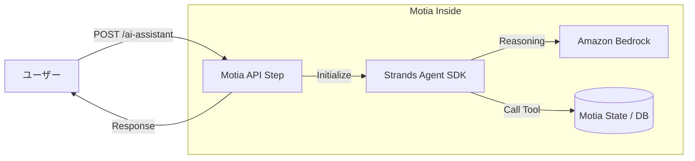

:::message
この記事はAIと力を合わせて執筆しました。
:::

## はじめに

こんにちは！

この度、**AWS Community Builder**（AI Engineeringカテゴリ）に選出していただきました！🚀

今年は「AIエンジニアリング×モダンバックエンド」をテーマに、実務で役立つ情報を積極的に発信していきたいと考えています。

その第1弾として、今最も注目しているバックエンドフレームワーク **Motia** と、AWSが公開したAIエージェントSDK **Strands Agent** を組み合わせた、実戦的なAIアプリケーションの開発手法をシリーズで解説します。

初回となる今回は「 **Motiaで作るAPIにAWS Strands AgentのTypeScript SDKを組み込む方法** 」にフォーカスし、概念の解説から具体的な実装コードまで詳しく紹介します！

**Motia**とても面白いのでぜひ最後まで読んでいってください！

---

## 1. AWS Strands Agentとは？

**AWS Strands Agent** はAWSが提供しているAIエージェント開発用オープンソースSDKです！

https://strandsagents.com/latest/

このSDKを使うことでたった数行でAI Agentアプリを開発することが可能となります！

### 主な特徴

- **TypeScript版の登場**:   
  2025年末に待望のTypeScript SDK（`@strands-agents/sdk`）がプレビュー公開されやっとTypeScriptでも開発できるようになりました！
- **エージェントループの抽象化**:   
  「思考（Thought）」「行動（Action）」「観察（Observation）」のループをSDKが肩代わりしてくれます。
- **AWSネイティブ**:   
  Amazon Bedrock（Claude 4やNovaなど）との親和性が非常に高く、AWS LambdaやECSへのデプロイも容易です。

TypeScript版SDKについて別記事にてまとめていますので、よろしければそちらもご覧ください。

https://zenn.dev/mashharuki/articles/strands_agent_ts_sdk-1

---

## 2. Motia：バックエンド開発を「Step」で再定義する

皆さんは、 **Motia**というバックエンド用のフレームワークについて聞いたことがありますか？？


Motiaは、API、バックグラウンドジョブ、ワークフローを「**Step**」という単一のプリミティブに集約した次世代フレームワークです。

JavaScript Rising Stars 2025 のバックエンド部門**Hono**や**Next.js**を抑えてで1位に輝くなど、今非常に勢いのあるフレームワークです！


### Motiaのコア・コンセプト

- **すべてが「Step」**:   
  REST APIもcronジョブもすべて同じ「Step」として定義します。  
  これにより、イベント駆動開発によるバックエンドの開発が可能となります！

  

- **iiiエンジンによるインフラ抽象化**:   
  開発者は `config.yaml` でインフラ（キューやステート）を定義するだけで、ビジネスロジックに集中できます。

- **ポリグロット（多言語）対応**:   
  同一プロジェクト内でTypeScriptとPythonを混在させ、イベント駆動で連携させることができます。

---

## 3. 実践：MotiaにStrands Agentを組み込む

それでは、実際に手を動かしてみましょう！

今回は「チケット管理システム」を想定し、ユーザーの問い合わせにAIが回答するAPIを構築します！

### サンプルリポジトリ

今回のコードは以下のリポジトリで公開しています。

https://github.com/mashharuki/Motia-Strands-Agent-Sample

### 環境構築

まず、`motia-cli` を使ってプロジェクトを立ち上げます！

```bash
cd my-project && iii -c iii-config.yaml
```

`http://localhost:3111`でAPIが立ち上がればOKです！

### Stepの実装： 

MotiaのAPIエンドポイントを`Step`という単位で実装します！

以下はチケットを一覧で取得するAPIエンドポイントの実装例です。

```typescript
import type { Handlers, StepConfig } from 'motia';
import { z } from 'zod';

// エンドポイントの設定
export const config = {
  name: 'ListTickets',
  description: 'Returns all tickets from state',
  flows: ['support-ticket-flow'],
  triggers: [
    {
      type: 'http',
      method: 'GET',
      path: '/tickets',
      responseSchema: {
        200: z.object({
          tickets: z.array(z.record(z.string(), z.any())),
          count: z.number(),
        }),
      },
    },
  ],
  enqueues: [],
} as const satisfies StepConfig;

/**
 * チケットを全て取得するハンドラー
 * @param _ 
 * @param param1 
 * @returns 
 */
export const handler: Handlers<typeof config> = async (
  _,
  { state, logger },
) => {
  // チケットを全て取得
  const tickets = await state.list<Record<string, unknown>>('tickets');

  logger.info('Listing tickets', { count: tickets.length });

  return {
    status: 200,
    body: { tickets, count: tickets.length },
  };
};
```

設定とハンドラーを綺麗に切り分けているので分かりやすいですね！

### Strand Agentの設定

Strands Agent用の設定は分かりやすくするために別ファイルに実装します。

```ts
import { Agent } from "@strands-agents/sdk";
import { getTicketTool, listOpenTicketsTool } from "./tools";

// エージェントの初期化: システムプロンプトとツールを設定
export const agent = new Agent({
  systemPrompt:
    'You are a concise support operations AI assistant. Use tools to reference real tickets before answering. Respond with practical next actions.',
  tools: [getTicketTool, listOpenTicketsTool],
});
```

ツールも定義しています！

```ts
import { tool } from "@strands-agents/sdk";
import { state } from "motia";
import z from "zod";

// ツール定義: チケット情報の取得とオープンチケットのリスト化
export const getTicketTool = tool({
  name: 'get_ticket',
  description: 'Get one support ticket by ticketId',
  inputSchema: z.object({ ticketId: z.string() }),
  callback: async (input) => {
    const ticket = await state.get<Record<string, unknown>>('tickets', input.ticketId);
    if (!ticket) {
      return `Ticket ${input.ticketId} not found`;
    }
    return JSON.stringify(ticket);
  },
});

// ツール定義: オープンチケットのリスト化（最大10件）
export const listOpenTicketsTool = tool({
  name: 'list_open_tickets',
  description: 'List currently open support tickets (max 10)',
  inputSchema: z.object({
    limit: z.number().int().min(1).max(10).optional().default(5),
  }),
  callback: async (input) => {
    // ステート変数からチケットのリストを取得し、ステータスが「open」のチケットをフィルタリングして返す
    const tickets = await state.list<Record<string, unknown>>('tickets');
    // チケットのステータスが「open」のものをフィルタリングし、指定された件数だけ返す
    const openTickets = tickets
      .filter((ticket) => ticket.status === 'open')
      .slice(0, input.limit);
    return JSON.stringify(openTickets);
  },
});
```

### AI Agentアシスタント機能付きエンドポイントを実装する

上記で実装したStrands Agentの機能を使ってAI Agentアシスタント機能付きエンドポイントを次のように実装してみました！

ベースは**Motia**のルールに沿っていますが、基本的な使い方は他のフレームワークを使った時とあまり変わりません。

```ts
import type { Handlers, StepConfig } from 'motia';
import { z } from 'zod';
import { agent } from './lib/ai/agent';

const requestSchema = z.object({
  prompt: z.string().min(1),
  ticketId: z.string().optional(),
});

const responseSchema = z.object({
  answer: z.string(),
  referencedTicketId: z.string().nullable(),
  openTicketCount: z.number(),
  modelProvider: z.string(),
});

// AI アシスタント用のステップ定義
export const config = {
  name: 'AiTicketAssistant',
  description: 'AI support assistant powered by Strands Agent SDK',
  flows: ['support-ticket-flow'],
  triggers: [
    {
      type: 'http',
      method: 'POST',
      path: '/tickets/ai-assistant',
      bodySchema: requestSchema,
      responseSchema: {
        200: responseSchema,
        400: z.object({ error: z.string() }),
        500: z.object({ error: z.string(), hint: z.string().optional() }),
      },
    },
  ],
  enqueues: [],
} as const satisfies StepConfig;

/**
 * AIアシスタント用のハンドラー関数
 * @param request
 * @param param1
 * @returns
 */
export const handler: Handlers<typeof config> = async (
  request,
  { logger, state },
) => {
  const { prompt, ticketId } = request.body;

  if (!prompt) {
    return {
      status: 400,
      body: { error: 'prompt is required' },
    };
  }

  const referencedTicket =
    ticketId
      ? await state.get<Record<string, unknown>>('tickets', ticketId)
      : null;

  // エージェントへのプロンプト構築: ユーザープロンプト、特定のチケットID、参照されたチケットデータを含める
  const agentPrompt = [
    `User request: ${prompt}`,
    ticketId ? `Focused ticketId: ${ticketId}` : 'No specific ticketId provided.',
    referencedTicket ? `Focused ticket data: ${JSON.stringify(referencedTicket)}` : '',
  ]
    .filter(Boolean)
    .join('\n');

  try {
    // エージェントの呼び出し: 構築したプロンプトを渡して応答を取得
    const result = await agent.invoke(agentPrompt);
    // ステート変数からチケットのリストを取得し、オープンチケットの数をカウント
    const tickets = await state.list<Record<string, unknown>>('tickets');
    const openTicketCount = tickets.filter((ticket) => ticket.status === 'open').length;
    const answer =
      typeof result === 'string'
        ? result
        : typeof result?.toString === 'function'
          ? result.toString()
          : JSON.stringify(result);

    logger.info('AI assistant generated response', {
      ticketId: ticketId ?? null,
      openTicketCount,
    });

    return {
      status: 200,
      body: {
        answer,
        referencedTicketId: ticketId ?? null,
        openTicketCount,
        modelProvider: 'strands-default-bedrock',
      },
    };
  } catch (error) {
    logger.error('AI assistant invocation failed', {
      ticketId: ticketId ?? null,
      error: error instanceof Error ? error.message : String(error),
    });

    return {
      status: 500,
      body: {
        error: 'Failed to invoke Strands Agent. Check model credentials and runtime configuration.',
        hint: 'If using Bedrock default provider, ensure AWS credentials and region are configured.',
      },
    };
  }
};
```

### 実装のポイント

1. **トリガーの定義**:   
  `triggers` 配列に `http` を指定するだけで、即座にAPIとして公開されます。
2. **ctxオブジェクトの活用**:   
  `ctx.logger` や `ctx.state` を通じて、Motiaが管理するログやデータベース（ステート）に簡単にアクセスできます。
3. **型安全なツール利用**:   
  Strands AgentはZodをサポートしているため、AIに提供するツールの入出力を厳密に定義でき、意図しない挙動を防げます。

## 4. 実際に呼び出してみる

REST Clientを使って簡単にテストができる`sample.http`を用意していますのでそれで一つ一つ処理を呼び出してみましょう！

以下はStrands Agentを使って運用中チケットを参照させてみた例です！

```bash
curl -X POST http://127.0.0.1:3111/tickets/ai-assistant \
  -H 'Content-Type: application/json' \
  -d '{
    "prompt": "優先対応すべきチケットを教えて",
    "ticketId": "TKT-EXAMPLE-001"
  }'
```

以下のようになっていれば正常に動いています！

```bash
{
  "answer": "チケット TKT-1772723527561-e4a8w の状況を確認しました。\n\n## 現状分析:\n- **重大度**: Critical（最重要）\n- **状態**: エスカレーション済み（engineering-leadへ自動エスカレ）\n- **問題**: 決済エラー（PMT-402）\n- **SLA違反**: 2039分（約34時間）未解決\n\n## 推奨する次アクション3つ:\n\n### 1. **Engineering-leadへの即時フォローアップ**\n   - エスカレーション後の進捗を確認\n   - PMT-402エラーの根本原因分析状況を確認\n   - 暫定対応策の有無を問い合わせ\n\n### 2. **顧客への状況アップデート**\n   - customer@example.com へ現在の調査状況を報告\n   - 代替決済手段の提案（可能であれば）\n   - 次回更新のタイムラインを明示（例: 4時間以内）\n\n### 3. **決済システムの緊急チェック**\n   - PMT-402エラーの発生頻度を確認（他顧客への影響範囲）\n   - 決済ゲートウェイのステータス確認\n   - 必要に応じてインシデント対応チームへ連携\n\n**優先順位**: 1→2→3の順で実施を推奨します。",
  "modelProvider": "strands-default-bedrock",
  "openTicketCount": 2,
  "referencedTicketId": "TKT-1772723527561-e4a8w"
}
```

```bash
{
  "answer": "現在オープンしている優先度の高いチケットは2件あります：\n\n## **1. TKT-1772723527561-e4a8w [Critical - 最優先]**\n- **件名**: Payment failed on checkout\n- **問題**: 決済時にエラーコード PMT-402 で失敗\n- **顧客**: customer@example.com\n- **担当**: support-jp-team\n- **状況**: \n  - SLA違反により自動エスカレーション（2041分未解決）\n  - engineering-lead へエスカレーション済み\n  - 作成日: 2026-03-05\n\n## **2. TKT-1772723533374-3d6b7 [High]**\n- **件名**: test\n- **問題**: （詳細は\"desc\"のみ）\n- **顧客**: a@example.com\n- **担当**: senior-support\n- **状況**:\n  - SLA違反により自動エスカレーション（2041分未解決）\n  - engineering-lead へエスカレーション済み\n  - 作成日: 2026-03-05\n\n### **推奨アクション**:\n1. **Critical チケット**を最優先で対応 - 決済機能の障害は事業影響が大きい\n2. 両チケットとも既にエンジニアリングリードへエスカレーション済みなので、進捗確認が必要\n3. 長期未解決のため、顧客への状況アップデートを実施\n\nどちらかのチケットについて詳細を確認しますか？",
  "modelProvider": "strands-default-bedrock",
  "openTicketCount": 2,
  "referencedTicketId": null
}
```

## 5. 視覚的な動作イメージ

Mermaid記法を用いて、今回のリクエストフローを図解します。



Motiaが **「APIの玄関口」および「データの保管場所」となり**、Strands Agentが「脳」としてそれらをオーケストレーションする非常にクリーンな構成であることがわかります。

## まとめと次回予告

今回はMotiaとAWS Strands Agentを組み合わせたAIバックエンドの基礎を解説しました！

**この構成のメリット:**
- **開発スピード**:   
  複雑なインフラ構築をMotiaが、エージェントループをStrandsが隠蔽してくれます。
- **運用性**:   
  Motiaの `traceId` により、AIがどのデータを参照して回答したかを容易に追跡できます。
- **柔軟性**:  
  例えば部分的にPythonしか対応していないSDKを使いたいから一部だけPythonで実装するといった柔軟性もあります！

次回は、このバックエンドを呼び出す **「フロントエンド側の実装とフルスタック連携」** について詳しく解説する予定です。

ここまで読んでいただきありがとうございました！

### 参考資料

- [Motia Official Documentation](https://motia.dev/)
- [Strands Agents SDK (GitHub)](https://github.com/aws-samples/strands-agents-sdk)
- [Amazon Bedrock AgentCore](https://aws.amazon.com/bedrock/agentcore/)
