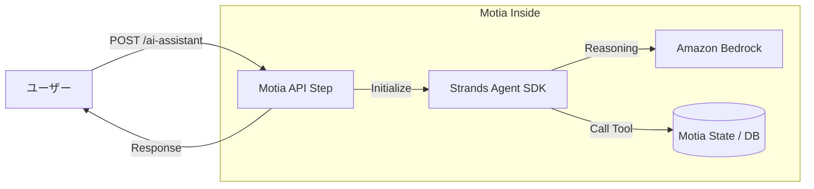

:::message
この記事はAIと力を合わせて執筆しました。
:::

## はじめに

こんにちは！

この度、**AWS Community Builder**（AI Engineeringカテゴリ）に選出していただきました！🚀

今年は「AIエンジニアリング×モダンバックエンド」をテーマに、実務で役立つ情報を積極的に発信していきたいと考えています。

その第1弾として、今最も注目しているバックエンドフレームワーク **Motia** と、AWSが公開したAIエージェントSDK **Strands Agent** を組み合わせた、実戦的なAIアプリケーションの開発手法をシリーズで解説します。

初回となる今回は「 **Motiaで作るAPIにAWS Strands AgentのTypeScript SDKを組み込む方法** 」にフォーカスし、概念の解説から具体的な実装コードまでを詳しく紹介します。

「AIアプリを作りたいけれど、バックエンドの構成をどうすればいいか悩んでいる」という方の参考になれば幸いです。

---

## 1. AWS Strands Agentとは？

**AWS Strands Agent** は、Amazon Bedrockを核とした、**モデル駆動型（Model-driven）**のAIエージェント開発用オープンソースSDKです。

これまでのエージェント開発では、プロンプトの連鎖（Chaining）や状態管理をエンジニアが細かく制御する必要がありました。しかし、Strands Agentは「LLM自身の推論能力」を最大限に活用し、最小限のコードで自律的なエージェントループを構築できるように設計されています。

### 主な特徴
- **TypeScript版の登場**:   
  2025年末に待望のTypeScript SDK（`@strands-agents/sdk`）がプレビュー公開され、フルスタックな型安全開発が可能になりました。
- **エージェントループの抽象化**:   
  「思考（Thought）」「行動（Action）」「観察（Observation）」のループをSDKが肩代わりしてくれます。
- **AWSネイティブ**:   
  Amazon Bedrock（Claude 4やNovaなど）との親和性が非常に高く、AWS LambdaやECSへのデプロイも容易です。

---

## 2. Motia：バックエンド開発を「Step」で再定義する

AIエージェントを動かすには、堅牢なバックエンド基盤が欠かせません。そこで登場するのが **Motia** です。


Motiaは、API、バックグラウンドジョブ、ワークフローを「**Step**」という単一のプリミティブに集約した次世代フレームワークです。JavaScript Rising Stars 2025 のバックエンド部門で1位に輝くなど、今非常に勢いのある技術です。


### Motiaのコア・コンセプト
- **すべてが「Step」**:   
  REST APIもcronジョブも、すべて同じ「Step」として定義します。これにより、学習コストを抑えつつ一貫した開発が可能です。

  

- **iiiエンジンによるインフラ抽象化**:   
  開発者は `config.yaml` でインフラ（キューやステート）を定義するだけで、ビジネスロジックに集中できます。
- **ポリグロット（多言語）対応**:   
  同一プロジェクト内でTypeScriptとPythonを混在させ、イベント駆動で連携させることができます。

---

## 3. 実践：MotiaにStrands Agentを組み込む

それでは、実際に手を動かしてみましょう。今回は「チケット管理システム」を想定し、ユーザーの問い合わせにAIが回答するAPIを構築します。

### サンプルリポジトリ
今回のコードは以下のリポジトリで公開しています。
[mashharuki/Motia-Strands-Agent-Sample](https://github.com/mashharuki/Motia-Strands-Agent-Sample)

### 環境構築
まず、`motia-cli` を使ってプロジェクトを作成します。

```bash
npx motia-cli create ai-agent-project
cd ai-agent-project
npm install @strands-agents/sdk
```

### Stepの実装：`ai-assistant.step.ts`

MotiaのAPIエンドポイントとして、AIアシスタントのStepを定義します。

```typescript
import { StepConfig, Handlers } from "@motiadev/sdk";
import { Agent } from "@strands-agents/sdk";
import { z } from "zod";

// Stepの構成定義
export const config = {
  name: "ai-assistant-api",
  triggers: [{ type: "http", path: "/tickets/ai-assistant", method: "POST" }],
} as const satisfies StepConfig;

// ハンドラーの実装
export const handler: Handlers<typeof config> = async (req, ctx) => {
  const { prompt, ticketId } = req.body;

  ctx.logger.info(`Processing AI Assistant request for ticket: ${ticketId}`);

  // 1. Strands Agentの初期化
  const agent = new Agent({
    systemPrompt: "あなたは優秀なカスタマーサポートです。チケット情報を参照して回答してください。",
    // デフォルトでAmazon Bedrock (Claude等) を使用します
  });

  // 2. ツールの定義（チケット情報を取得するロジックなど）
  agent.addTool({
    name: "get_ticket_details",
    description: "チケットのIDから詳細情報を取得します",
    inputSchema: z.object({
      id: z.string()
    }),
    handler: async ({ id }) => {
      // 実際にはDBやMotiaのStateから取得
      const ticket = await ctx.state.get("tickets", id);
      return JSON.stringify(ticket);
    }
  });

  // 3. エージェントの実行
  const result = await agent.invoke(prompt);

  return {
    status: 200,
    body: {
      answer: result.text,
      traceId: ctx.traceId // MotiaのトレースIDを返すとデバッグが容易
    }
  };
};
```

### 実装のポイント
1. **トリガーの定義**:   
  `triggers` 配列に `http` を指定するだけで、即座にAPIとして公開されます。
2. **ctxオブジェクトの活用**:   
  `ctx.logger` や `ctx.state` を通じて、Motiaが管理するログやデータベース（ステート）に簡単にアクセスできます。
3. **型安全なツール利用**:   
  Strands AgentはZodをサポートしているため、AIに提供するツールの入出力を厳密に定義でき、意図しない挙動を防げます。

---

## 4. 視覚的な動作イメージ

Mermaid記法を用いて、今回のリクエストフローを図解します。



Motiaが「APIの玄関口」および「データの保管場所」となり、Strands Agentが「脳」としてそれらをオーケストレーションする、非常にクリーンな構成であることがわかります。

---

## まとめと次回予告

今回は、MotiaとAWS Strands Agentを組み合わせたAIバックエンドの基礎を解説しました。

**この構成のメリット:**
- **開発スピード**:   
  複雑なインフラ構築をMotiaが、エージェントループをStrandsが隠蔽してくれます。
- **運用性**:   
  Motiaの `traceId` により、AIがどのデータを参照して回答したかを容易に追跡できます。
- **拡張性**:  
  将来的にPythonで重い計算処理を追加したい場合も、Motiaならシームレスに連携可能です。

次回は、このバックエンドを呼び出す **「フロントエンド側の実装とフルスタック連携」** について詳しく解説する予定です。お楽しみに！

### 参考資料

- [Motia Official Documentation](https://motia.dev/)
- [Strands Agents SDK (GitHub)](https://github.com/aws-samples/strands-agents-sdk)
- [Amazon Bedrock AgentCore](https://aws.amazon.com/bedrock/agentcore/)
