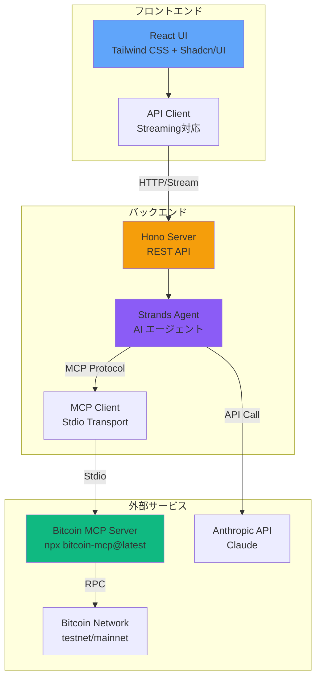
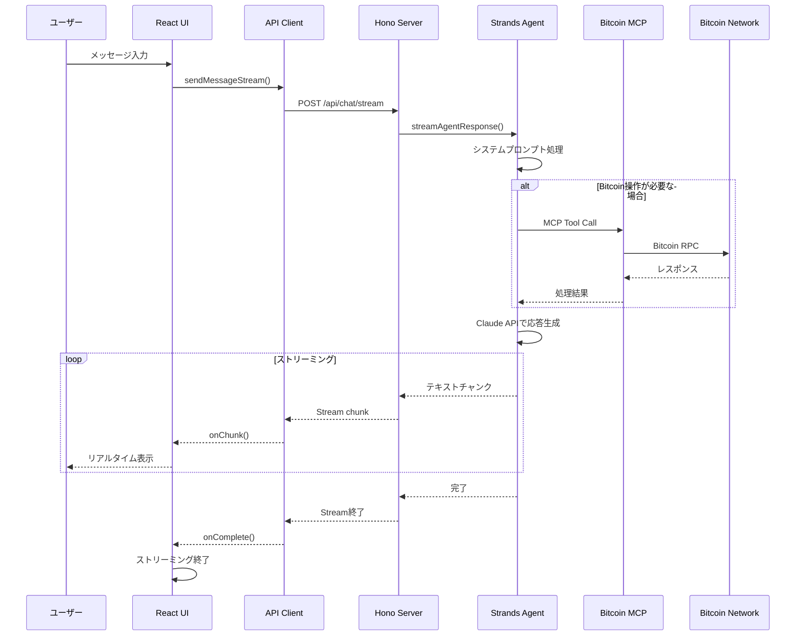

この記事は [Model Context Protocol Advent Calendar 2025](https://qiita.com/advent-calendar/2025/mcp) の記事です。

https://qiita.com/advent-calendar/2025/mcp

こんにちは！エンジニアの皆さん、**MCP (Model Context Protocol)** はもう触っていますか？

最近、Linux Foundationに移管したことも大きな話題になりましたよね！

https://japan.zdnet.com/article/35241502/

これからももっと利用シーンが増加していくことが想定されます！

MCPが登場するまでは、AIモデルに外部ツール（データベース、API、ファイルシステムなど）を使わせるには、各モデル固有の実装が必要でした。

しかし、MCPを使えば**一度作ったツールをClaudeやその他のMCP対応クライアントで共通して使えるようになる**のです。

> MCPについては以下の資料がわかりやすいです！

https://speakerdeck.com/minorun365/yasasiimcpru-men

今回は、このMCPを使って **「Bitcoinを操作できるAIエージェント」** を爆速で作ってみました！！

> 今回採用した bitcoin-mcp

https://github.com/AbdelStark/bitcoin-mcp

バックエンドには軽量で高速な **Hono**、エージェントフレームワークには **Strands Agent** を採用しています！

https://hono.dev/

https://strandsagents.com/latest/

**Mastra**よりも簡単に実装できたのでAWSユーザーの方はこちらの方が良いのではないかと感じました！

https://mastra.ai/

この記事では、実際のコードを交えながら、MCPサーバーをAIエージェントに統合する方法を解説します。

ぜひ最後まで読んでいってください！

## 作ったもの：BitcoinAgent

今回作成したのは、チャット形式でBitcoinのネットワーク情報を取得したり、アドレスを生成したりできるAIエージェントです。

> GitHubリポジトリ

https://github.com/mashharuki/BitcoinAgent

### プロジェクト構成

フロントエンドとバックエンドを一つのリポジトリで管理する **モノレポ構成** を採用しています。

```
bitcoin-agent/
├── packages/
│   ├── backend/         # Hono + Strands Agent TypeScript SDK
│   └── frontend/        # React + Vite 
├── biome.json          # Biome設定
├── tsconfig.base.json  # TypeScript共通設定
├── tsconfig.json       # TypeScriptプロジェクト参照設定
└── pnpm-workspace.yaml # pnpmワークスペース設定
```

### システムアーキテクチャ

全体的なアーキテクチャは以下の通りです。
フロントエンドからHonoサーバーへリクエストを送り、Honoサーバー内のStrands AgentがMCPクライアントを通じて `bitcoin-mcp` サーバーと通信します。



ポイントは、**Bitcoinの操作ロジックを自前で実装していない**点です。既存の `bitcoin-mcp` というMCPサーバーを、`npx` 経由で呼び出して利用しています。これがMCPの強力なところです！

ちなみに、図中の `Stdio Transport` は標準入出力を使った通信方式、`RPC` (Remote Procedure Call) は外部のBitcoinノードと通信するためのプロトコルです。これらを意識せずに使えるのがMCPの利点ですね。

### 処理シーケンス

ユーザーがメッセージを送信してから、AIがBitcoinネットワークを操作し、応答を返すまでの流れは以下のようになります。



### API仕様 (OpenAPI)

バックエンドのAPIはOpenAPI仕様に基づいて定義されています。
主要なエンドポイントは `/api/chat` (通常応答) と `/api/chat/stream` (ストリーミング応答) です。

:::details openapi.yaml
```yaml
openapi: 3.0.3
info:
  title: Bitcoin Agent API
  description: |
    Bitcoin Agent APIは、Bitcoin MCP（Model Context Protocol）を使用して構築されたAIエージェントのバックエンドAPIです。
  version: 0.1.0

paths:
  /api/chat:
    post:
      summary: 非ストリーミングチャット
      description: エージェントに問い合わせを行い、完全なレスポンスを一度に受け取ります。
      tags:
        - chat
      requestBody:
        required: true
        content:
          application/json:
            schema:
              type: object
              properties:
                message:
                  type: string
  
  /api/chat/stream:
    post:
      summary: ストリーミングチャット
      description: エージェントからの応答をリアルタイムにストリーミングで受け取ります。
      tags:
        - chat
      requestBody:
        required: true
        content:
          application/json:
            schema:
              type: object
              properties:
                message:
                  type: string
```
:::

## 実装のポイント

### 1. MCPクライアントのセットアップ

まず、バックエンドでMCPサーバー（今回は `bitcoin-mcp`）に接続するためのクライアントを作成します。
`@modelcontextprotocol/sdk` と `@strands-agents/sdk` を使用します。

```typescript:packages/backend/src/lib/bitconMcp.ts
import { StdioClientTransport } from '@modelcontextprotocol/sdk/client/stdio.js';
import { McpClient } from '@strands-agents/sdk';

export function createBitcoinMCPTools() {
  // Stdio転送を使って、ローカルで動作するMCPサーバーに接続
  const bitcoinMcpTools = new McpClient({
    transport: new StdioClientTransport({
      command: 'npx',
      args: ['-y', 'bitcoin-mcp@latest'], // 既存のMCPサーバーをそのまま利用！
    }),
  });

  return bitcoinMcpTools;
}
```

たったこれだけで、Bitcoinの複雑なRPC操作などをカプセル化したツール群がAIから使えるようになります。

### 2. エージェントの初期化

次に、このツールをエージェントに渡します。
ここで使用している **Strands Agent** は、TypeScriptで型安全にエージェントを構築できるフレームワークです。

https://github.com/mashharuki/BitcoinAgent/blob/main/packages/backend/src/lib/agent.ts

### 3. HonoでのストリーミングAPI

AIの応答は時間がかかることがあるため、UX向上のためにストリーミングレスポンスを実装します。Honoの `stream` ヘルパーを使うと非常に簡単に書けます。

https://github.com/mashharuki/BitcoinAgent/blob/main/packages/backend/src/index.ts#L67-L103

## 実際に動かしてみる

それでは実際に動かしてみましょう！！

> 動かす前にAWS CLIで認証済みであることが必要です！

依存関係をインストールしましょう！

```bash
pnpm install
```

次にバックエンド側を起動します！

```bash
pnpm backend run dev
```

別タブでフロントエンドを起動します！

```bash
pnpm frontend run dev
```

これでアクセス可能になりました！

以下のような画面にアクセスできるはずです！


鍵ペアを作ってもらったり(**テスト用です！！**)


最新のブロック高の情報を取得したりすることができました！！


実際にテストネットのブロックエクスプローラーを確認してみると一致していました！！


これは良さげですね！！

## まとめ

MCPを使うことで、**「車輪の再発明」をせずに、既存の強力なツール群をAIエージェントに組み込む**ことができました。

- **Hono**:   
  高速なWebサーバーとストリーミング対応
- **Strands Agent**:   
  柔軟なエージェント構築
- **MCP**:   
  外部ツールとの標準化された接続

この3つを組み合わせることで、実用的なAIアプリケーションが驚くほど簡単に作れます！！

皆さんもぜひ、色々なMCPサーバーを組み合わせて、独自のAIエージェントを作ってみてください！

ここまで読んでいただきありがとうございました！！

良いお年を！！

## 参考文献

- [bitcoin-mcp](https://github.com/AbdelStark/bitcoin-mcp)
- [Model Context Protocol](https://modelcontextprotocol.io/) 
- [Strands Agent SDK](https://github.com/strands-ai/strands-sdk-js) 
- [Hono](https://hono.dev/)
- [技術調査 - AG-UIプロトコルとCopilotKit](https://zenn.dev/suwash/articles/agui_copilotkit_20250523)
- [GitHub - AG-UI](https://github.com/ag-ui-protocol/ag-ui)
- [AG-UI 公式サイト](https://docs.ag-ui.com/introduction)
