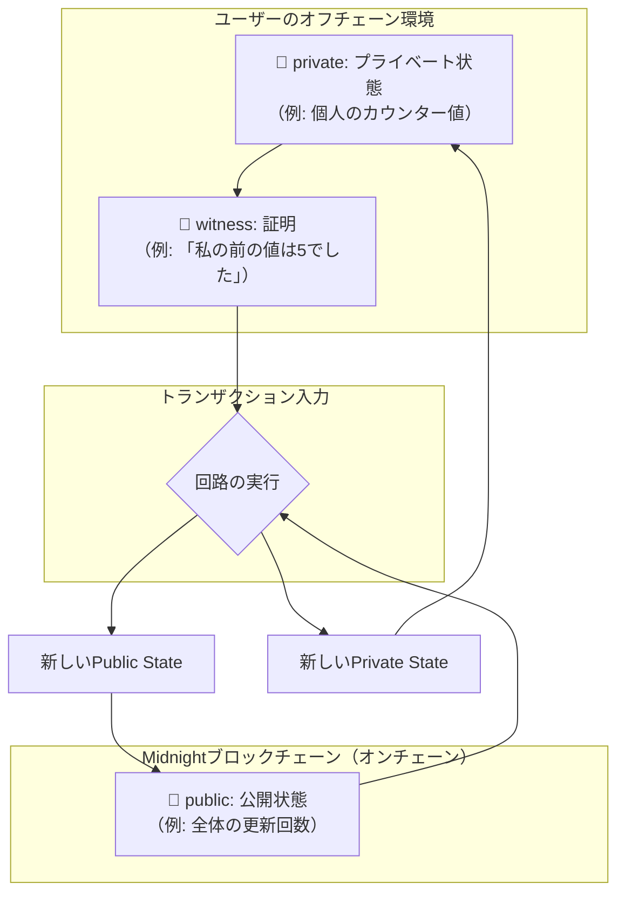

## はじめに：ブロックチェーンの「透明すぎる」問題

Bitcoinのホワイトペーパーが登場して以来、ブロックチェーン技術は「トラストレス」と「透明性」そして「対改ざん性」を強みとして、金融からサプライチェーンまで様々な分野に革命をもたらしてきました。

https://bitcoin.org/bitcoin.pdf

誰もが分散した同じ内容の台帳を検証できることで、中央集権的な管理者を必要としないトラスト（信頼）のネットワークを築き上げる現実的な方法を打ち出したことはまさに革命的でした。

しかし、その「完全な透明性」は時として大きな弱点となります。

- **企業の機密情報**が競合他社に漏洩してしまったら？
- **個人の金融取引履歴**が世界中に公開されてしまったら？
- **プライベートな医療情報や投票履歴**が誰でも閲覧可能だったら？

考えただけでも恐ろしいですよね。

この「透明すぎる」問題こそが、パブリックブロックチェーン技術がエンタープライズ領域や個人の日常に広く浸透するのを阻む、大きな壁の一つとなっていました。

このジレンマを解決するため、**Cardano**エコシステムから画期的なプロジェクトが登場しました。

それが**Midnight**です。

https://www.midnight.network/

:::message
Midnightはデータ保護とプライバシーに特化したCardanoのサイドチェーンです。
:::

ゼロ知識証明（ZKP）[^1]という最先端の暗号技術を活用し、 **「証明したい事実だけを、それ以外の情報を一切明かさずに証明する」** ことを可能にします。

:::message
ゼロ知識証明はプライバシー保護の観点でよく言及される技術ですが、用途次第では計算コストの圧縮にも活用できます！

代表的な活用事例は EVM系のL2チェーン実現のアプローチとして存在する**ZkEVM**や**INTMAX**があります。

https://intmax.io/
:::

先日ロンドンにて開催された**Midnight Hackathon**参加のためにCompactのことを調べたので、この記事ではその学びをシェアするため環境構築からコントラクトの実装、テスト、デプロイまで、ハンズオン形式で徹底的に解説しています！

https://midnightsummit.io/

Midnightの概要から知りたいという方は以下の記事を参照ください！

https://zenn.dev/mashharuki/articles/midnight_zkp-1

> [^1]: ゼロ知識証明（Zero-Knowledge Proof）とは、ある命題が真であることを、それ以外の情報（なぜ真であるかなど）を一切伝えることなく証明できる暗号学的な手法です。

## Compact言語：TypeScriptで書けるプライベートスマートコントラクト

Midnightの革新性を支えるもう一つの柱が、スマートコントラクト言語「**Compact**」です。

:::message
「ゼロ知識証明なんて、一部の暗号学者にしか扱えないのでは？」
:::

Compactは、そのハードルを劇的に下げるために設計されています。

### TypeScriptベースの構文

Compactの最大の特徴は、**TypeScriptをベースにしたドメイン固有言語（DSL）** である点です。

これにより世界中の膨大な数のWeb開発者が新たな言語をゼロから学ぶことなく、慣れ親しんだ構文でプライバシー保護アプリケーションを開発できるされています(実際には色々調べることになりましたが笑)。

Compactコンパイラが、開発者が書いたロジックを自動的にゼロ知識証明の生成に必要な暗号コンポーネントに変換してくれるため、開発者はZKPの複雑な数学を意識する必要がありません。

### データの3つの状態：Public, Private, Witness

Compactにおけるデータ管理の核心は、データのプライバシーレベルを明確に区別することにあります。

データは主に3つの状態で扱われます。



1.  **`public` (公開状態)**
    - ブロックチェーン上に公開され、誰でも閲覧可能なデータです。
    - 従来のスマートコントラクトの状態変数に似ています。
    - `ledger` キーワードを使って定義されます。

2.  **`private` (プライベート状態)**
    - ユーザーのローカル環境（オフチェーン）でのみ管理される、秘匿されたデータです。
    - このデータそのものがブロックチェーンに記録されることはありません。
    - `private` キーワードで定義されます。

3.  **`witness` (証明)**
    - トランザクション実行時に、ユーザーが「私はこのデータを知っている」と証明するために提供する入力値です。
    - `private` な状態を更新する際の根拠として使われます。
    - `witness` キーワードで定義されます。

### 基本的な文法とカウンタースマートコントラクトの例

これらの概念を、簡単なCounterスマートコントラクトの例で見ていきましょう。

このコントラクトはただ数字を加算していくだけという非常にシンプルなコードとなっており、公式のチュートリアルでも紹介されています。


このコントラクトには、

- **公開カウンター（`publicRound`）**
- **プライベートカウンター（`privateCount`）**

が存在します。

```typescript:counter.compact
pragma language_version >= 0.25.0;
import CompactStandardLibrary;

// 各ユーザーがオフチェーンで管理するプライベートな状態
let privateCount: private Field;

// オンチェーンで公開されるパブリックな状態
export ledger publicRound: Counter;

// プライベートカウンターをインクリメントし、
// その事実をパブリックカウンターに記録する回路
export circuit increment(
  // トランザクションを送信するユーザーが「自分の前の値はこれだった」と証明するための入力
  previousPrivateCount: witness Field
) {
  // --- 検証フェーズ ---
  // ユーザーが提供した `previousPrivateCount` が、
  // 自分の知っている `privateCount` の実際の値と一致するかを検証する。
  assert(privateCount === previousPrivateCount);

  // --- 状態更新フェーズ ---
  // 検証が成功した場合のみ、状態を更新する

  // 1. プライベートな状態を更新する (値は秘匿されたまま)
  privateCount = privateCount + 1;

  // 2. パブリックな状態を更新する (インクリメントされたという事実を記録)
  publicRound.increment(1);
}

// 初期状態を設定するための特別な回路
export circuit initialize(initialPrivateCount: witness Field) {
  privateCount = initialPrivateCount;
}
```

- **`circuit`**:   
  トランザクションによって呼び出される関数（ステート遷移関数）です。  
  この中で状態の検証と更新が行われます。
- **`assert(...)`**:   
  カッコ内の条件が真であることを証明します。もし条件が偽であれば、トランザクションは失敗します。これは、ゼロ知識証明における中核的な役割を果たし、「ユーザーが正しい `previousPrivateCount` を知っている」ことを、その値を公開することなく検証します。

<br/>

このように、Compactを使えばTypeScriptライクな構文で、データのプライバシーを細かく制御しつつその正当性を証明するロジックを直感的に記述できます！

## ハンズオン：Midnight開発環境を構築しよう

理論を学んだところで、いよいよ実践です。

ここからは、`counter.compact` を実際に動かすための開発環境を構築していきます。

:::message
この記事を執筆している2025年11月時点ではフロントエンドのとの接続はまだ不安定なようです。

よってこのハンズオンではスマートコントラクトのデプロイとデプロイ後のコントラクトをCLIで操作することをGoalとします。
:::

開発に必要なコンポーネントは以下の通りです。

1.  **Compact CLI**:   
  スマートコントラクトをコンパイルし、テストするためのコマンドラインツール。
2.  **Lace Midnight Preview Wallet**:   
  Midnight Testnetと対話するためのブラウザ拡張ウォレット。
3.  **Testnet Faucet**:   
  テスト用のトークンを入手するためのサービス。
4.  **ZK Proof Server**:   
  ローカルでゼロ知識証明を生成・検証するためのサーバー。
5.  **サンプルリポジトリ**:   
  この記事で利用するコード一式。

### Step 1: Compact CLI のインストール

まず、Compact言語のコンパイラである`compact` CLIをインストールします。

以下のコマンドをターミナルで実行してください。

```bash
curl --proto '=https' --tlsv1.2 -LsSf https://github.com/midnightntwrk/compact/releases/latest/download/compact-installer.sh | sh
```

次に、特定のバージョン（この記事では`0.25.0`）を使用するように設定します。

```bash
compact update 0.25.0
```

インストールが成功したか、バージョンを確認してみましょう。

```bash
compact --version
# compact 0.2.0 or similar
compact compile --version
# 0.25.0
```

`compact compile --version` が `0.25.0` と表示されればOKです。

### Step 2: Lace Wallet の準備とTestnetトークンの入手

次に、Midnight Testnetに接続するためのウォレットを準備し、テストに必要なトークンを受け取ります。

1.  **Lace Walletのインストール**:  
    Chromeウェブストアから「[Lace Midnight Preview](https://chromewebstore.google.com/detail/lace-midnight-preview/hgeekaiplokcnmakghbdfbgnlfheichg)」をブラウザに追加します。
2.  **ウォレットの作成**:  
    画面の指示に従い、新しいウォレットを作成します。リカバリーフレーズは必ず安全な場所に保管してください。
3.  **アドレスのコピー**:  
    ウォレットのメイン画面で「Receive」ボタンを押し、自分のウォレットアドレスをコピーします。
4.  **Faucetでトークンを入手**:  
    [Midnight Testnet Faucet](https://midnight.network/test-faucet)にアクセスします。コピーしたアドレスを貼り付け、「Request funds」をクリックします。しばらくすると、テスト用の`tDUST`トークンがウォレットに届きます。

### Step 3: ZK Proof Server の起動

スマートコントラクトのプライベートな部分（証明の生成など）は、ローカルで実行される`Proof Server`と通信して処理されます。

このサーバーをMidnight公式が発表しているDockerコンテナイメージを使って起動します。

:::message
このステップにはDocker Destopがインストールされている必要があります。
:::

以下のコマンドを実行して、Proof Serverを起動してください。

```bash
docker run -p 6300:6300 midnightnetwork/proof-server -- 'midnight-proof-server --network testnet'
```

ターミナルにログが流れ始めれば成功です。  
このターミナルは起動したままにしておいてください。

### Step 4: サンプルリポジトリの準備

最後に、この記事で解説するコードが含まれたリポジトリを準備します。

```bash
# リポジトリをクローン(事前に自分のアカウントにフォークしておくこと！)
git clone https://github.com/<user-name>/midnight-sample.git
cd midnight-sample

# 依存関係をインストール
yarn
```

:::message 
`git clone`のURLは、実際のサンプルリポジトリのURLに置き換えてください。
:::

以上で開発環境の準備は完了です！

次のセクションでは、いよいよスマートコントラクトの実装とテストを行っていきます。

## Counterコントラクトの実装とテスト

環境が整ったので、いよいよスマートコントラクトを実装し、テストしていきましょう。

### コードの解説

`pkgs/contract/src/counter.compact` に、先ほど解説したカウンタースマートコントラクトを記述します。（サンプルリポジトリには、よりシンプルなコードが含まれている場合がありますが、ここでは学習のために `private` な状態を持つこちらのコードを使用します）

```typescript:pkgs/contract/src/counter.compact
pragma language_version >= 0.25.0;
import CompactStandardLibrary;

// 各ユーザーがオフチェーンで管理するプライベートな状態
let privateCount: private Field;

// オンチェーンで公開されるパブリックな状態
export ledger publicRound: Counter;

// プライベートカウンターをインクリメントし、
// その事実をパブリックカウンターに記録する回路
export circuit increment(
  // 「私の前の値はこれだった」と証明するための入力
  previousPrivateCount: witness Field
) {
  // 検証：ユーザーが提供した`previousPrivateCount`が実際の`privateCount`と一致するか
  assert(privateCount === previousPrivateCount);

  // 状態更新
  privateCount = privateCount + 1; // プライベートな状態を更新
  publicRound.increment(1);      // パブリックな状態を更新
}

// 初期状態を設定するための回路
export circuit initialize(initialPrivateCount: witness Field) {
  privateCount = initialPrivateCount;
}
```

コードを記述したら、`compact` CLIを使ってコンパイルします。

これにより、ゼロ知識証明の生成に必要な暗号マテリアル（proving key, verification keyなど）が生成されます。

```bash
yarn contract compact
```

成功すると、`Fetching public parameters...` のようなログが表示されます。

### ユニットテストの実装

Compactでは、コントラクトのロジックをオフチェーンでシミュレートしてテストすることができます。

`pkgs/contract/src/test/counter.test.ts` で、そのテストコードを見てみましょう。

テストには `CounterSimulator` というヘルパークラス（内部でCompactのテスト用ライブラリを使用）を利用します。

```typescript:pkgs/contract/src/test/counter.test.ts
import { describe, it, expect } from "vitest";
import { CounterSimulator } from "./counter-simulator.js"; // これは架空のシミュレーター

describe("Counter Smart Contract with Private State", () => {
  it("should initialize private and public states correctly", () => {
    // シミュレーターを初期化
    const simulator = new CounterSimulator();

    // `initialize` 回路を実行してプライベートカウンターを `42` に設定
    // .prove()メソッドで回路を呼び出し、witnessデータを渡す
    simulator.prove("initialize", { initialPrivateCount: 42n });

    // プライベートな状態が正しく設定されたか確認
    expect(simulator.getPrivateState().privateCount).toEqual(42n);
    // パブリックな状態はまだ変わらない
    expect(simulator.getLedger().publicRound).toEqual(0n);
  });

  it("should increment both private and public counters correctly", () => {
    // プライベートカウンターが `42` の状態でシミュレーターを開始
    const simulator = new CounterSimulator({ privateCount: 42n });

    // `increment` 回路を実行。正しい `previousPrivateCount` を `witness` として渡す
    simulator.prove("increment", { previousPrivateCount: 42n });

    // プライベートカウンターがインクリメントされたか確認
    expect(simulator.getPrivateState().privateCount).toEqual(43n);
    // パブリックカウンターもインクリメントされたか確認
    expect(simulator.getLedger().publicRound).toEqual(1n);
  });

  it("should fail to increment with incorrect witness", () => {
    // プライベートカウンターが `42` の状態でシミュレーターを開始
    const simulator = new CounterSimulator({ privateCount: 42n });

    // `assert` が失敗するように、間違った `previousPrivateCount` を渡す
    const execution = () => {
      simulator.prove("increment", { previousPrivateCount: 99n }); // 99nは間違い
    };

    // `assert`の失敗により、トランザクションがエラーになることを確認
    expect(execution).toThrow("Assertion failed");
  });
});
```

このテストコードは、以下の3つのシナリオを検証しています。
1. `initialize` 回路でプライベート状態が正しく設定されること。
2. 正しい `witness` を使えば、プライベートとパブリック両方の状態が正しく更新されること。
3. 間違った `witness` を使うと、`assert` が機能してトランザクションが失敗すること。

### テストの実行

それでは、実際にテストを実行してみましょう。以下のコマンドを実行します。

```bash
yarn contract test
```

すべてのテストが成功すれば、以下のような出力が表示されます。

```
 RUN  v4.0.8 /path/to/your/project/pkgs/contract

 ✓ test/counter.test.ts (3 tests)
   ✓ Counter Smart Contract with Private State
     ✓ should initialize private and public states correctly
     ✓ should increment both private and public counters correctly
     ✓ should fail to increment with incorrect witness

 Test Files  1 passed (1)
      Tests  3 passed (3)
   Start at  ...
   Duration  ...

Done in ...s.
```

これで、コントラクトのロジックが意図通りに動作することが確認できました。

次は、このコントラクトをTestnetにデプロイするためのCLIツールを作成していきます。

## CLIからTestnetにデプロイ＆実行

ローカルでのテストが完了したら、いよいよコントラクトをTestnetにデプロイします。

`pkgs/cli` パッケージには、デプロイやコントラクトとの対話を行うためのスクリプトが含まれています。

### TypeScript APIの生成

まず、`contract`パッケージのビルドを行います。

これにより、コンパイルされたコントラクトの情報に基づいて、CLIから利用するためのTypeScriptの型定義やAPIが自動生成されます。

```bash
yarn contract build
```

このステップにより、`cli`パッケージから`contract`パッケージの回路（`increment`など）を型安全に呼び出すことができるようになります！

### 環境変数の設定

Testnetへのデプロイには、トランザクションに署名するためのウォレットの秘密鍵が必要です。

`pkgs/cli` ディレクトリにある `.env.example` ファイルをコピーして `.env` ファイルを作成し、Lace Walletの秘密鍵を設定します。

```bash
cp pkgs/cli/.env.example pkgs/cli/.env
```

そして、作成した `pkgs/cli/.env` ファイルを編集します。

```:pkgs/cli/.env

# デプロイするコントラクトアドレス（デプロイ後に設定）
CONTRACT_ADDRESS=""
```

:::message
**秘密鍵の取り扱いには最大限の注意を払ってください。** 

このファイルがGitHubなどに公開されないよう、`.gitignore`に含まれていることを必ず確認してください。
:::

### デプロイスクリプトの解説

`pkgs/cli/scripts/deploy.ts` は、コントラクトをTestnetにデプロイするためのスクリプトです。

`@midnight-ntwrk/midnight-sdk` などのライブラリを使い、以下のような処理を行っています。

- `.env` ファイルから秘密鍵を読み込む。
- 秘密鍵を使ってウォレットオブジェクトを構築する。
- Testnetへの接続設定（Provider）を行う。
- `api.deploy` を呼び出し、コントラクトのデプロイを実行する。

### デプロイの実行

準備が整ったら、以下のコマンドでデプロイを実行します。

```bash
yarn cli deploy
```

成功すると、デプロイされたコントラクトのアドレスがターミナルに出力されます。

```bash

```

このコントラクトアドレスを、先ほど作成した `.env` ファイルの `CONTRACT_ADDRESS` に設定しておきましょう。

### `increment`の実行

最後に、デプロイしたコントラクトの `increment` 回路を呼び出してみましょう。

`pkgs/cli/scripts/increment.ts` がそのためのスクリプトです。

以下のコマンドを実行します。

```bash
yarn cli increment
```

このスクリプトは、`.env` ファイルからコントラクトアドレスを読み込み、`api.joinContract` で既存のコントラクトに接続し、`api.increment` を呼び出します。

成功すると、トランザクションIDや現在のカウンターの値が出力されます。

```bash

```

`Current counter value: 1` と表示され、パブリックなカウンターが1つ進んだことが確認できました！

プライベートなカウンターの値は、あなたのローカル環境でのみ更新され、外部からは見えないままです。

## 現状の制約と今後について

Midnightはこの記事を執筆している2025年11月現在、まだ**開発者向けTestnet**の段階にあり、Mainnetはローンチされていません。

そのため、いくつかの制約や注意点があります。

- **パフォーマンス**:   
  Testnet上でのトランザクションのファイナリティには時間がかかる場合があります。
- **APIの変更**:   
  開発段階にあるため、SDKやCLIの仕様が変更される可能性があります。公式ドキュメントを定期的に確認することをお勧めします。
- **機能の制限**:   
  利用できる機能やツールはまだ限定的ですが、コミュニティからのフィードバックを元に、急速に開発が進んでいます。
- **フロントエンドとの接続**:
  ハッカソン参加にあたり一番調査に時間を使ったのがこの部分でした。現地でMidnightチームにも確認しましたが、現状では安定してフロントエンドとコントラクトを接続させるライブラリ等はないとのことでした(今はCLIで呼び出すしかない)。

<br/>

Midnightは、プライバシーというWeb3の重要課題に取り組む、非常に野心的なプロジェクトです。

Cardanoの強力なコミュニティとセキュリティ基盤を背景に、今後の発展から目が離せません！

フロントエンドとの接続等課題もありますが、今後アップデート予定とのことなので続報を待ちたいと思います！

## おわりに

この記事では、Cardanoのプライバシー保護サイドチェーン**Midnight**と、そのスマートコントラクト用プログラミング言語**Compact**について、ハンズオン形式で解説しました。

- ブロックチェーンの「透明すぎる」問題を解決するMidnightのアーキテクチャ。
- TypeScriptライクな構文で直感的にプライベートDAppsを開発できるCompact言語。
- `public`, `private`, `witness` を使い分けたデータ管理。
- 開発環境の構築から、コントラクトの実装、テスト、Testnetへのデプロイまでの一連の流れ。

今後の発展が非常に楽しみですね！  

招待していただいたHackathonも本当に楽しかったので引き続きウォッチしようと思います！

ここまで読んでいただきありがとうございました！

## 参考文献
- [Midnight公式サイト](https://www.midnight.network/)
- [Midnightドキュメント](https://docs.midnight.network/)
- [Compact GitHubリポジトリ](https://github.com/midnightntwrk/compact)
- [Midnight Awesome DApps](https://github.com/midnightntwrk/midnight-awesome-dapps)
- [Lace Midnight Preview Wallet](https://chromewebstore.google.com/detail/lace-midnight-preview/hgeekaiplokcnmakghbdfbgnlfheichg)
- [Midnight Testnet Faucet](https://midnight.network/test-faucet)
- [Midnight Hackathon (Devpost)](https://midnight-hackathon.devpost.com/)
