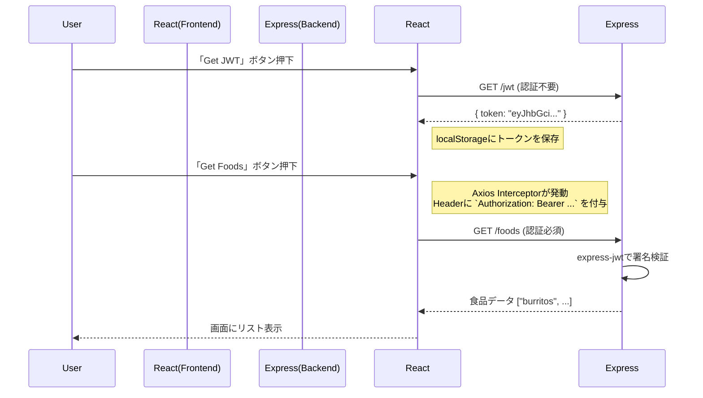

# はじめに

Webアプリケーション開発において避けては通れない「認証」。  

今回は、**「なんとなくライブラリがやってくれている」状態から脱却するため**、ReactとExpressを使ってJWT（JSON Web Token）認証の最小構成を自作してみました！

特に、フロントエンドでの**Axios Interceptor（リクエストの割り込み処理）** を使ったトークン付与の仕組みが非常に便利だったので、その実装パターンを中心に共有します！

ぜひ最後まで読んでいってください！

# 今回作ったものの全体像

一言で言うと、**「ボタンを押してトークンをもらい、そのトークンを使って秘密のデータを取得する」** というシンプルなアプリです。



## 技術スタック

- **Frontend:** 
  - React (Create React App)
  - Typescript
  - Axios
- **Backend:** 
  - Express
  - Typescript
  - express-jwt
  - jsonwebtoken

## 1. Backend: 3行で守る `express-jwt` の威力

バックエンドの実装で感動したのは、`express-jwt` ミドルウェアの手軽さです。 

これを入れるだけで、指定したルート以外の全てのエンドポイントを一括で保護できます。

**ファイル:** `pkgs/backend/src/server.ts`

```typescript
// ...imports

// JWT認証ミドルウェアの設定
// .unless() に指定したパス以外は、すべて認証が必要になる！
app.use(
  expressjwt({ 
    secret: 'secret123', // ※本番では環境変数を使用すること
    algorithms: ['HS256'] 
  }).unless({
    path: ['/jwt'] // ログイン(トークン発行)用APIは除外
  })
);

// トークン発行エンドポイント
app.get('/jwt', (_req, res) => {
  // 実際はここでDB照合などを行う
  res.json({
    token: jwt.sign({ user: 'johndoe' }, 'secret123')
  });
});

// 保護されたエンドポイント
app.get('/foods', (_req, res) => {
  // ここに到達した時点で、req.auth にユーザー情報が入っていることが保証される
  res.json(foods);
});
```

**ポイント:**
*   各ルーターハンドラ (`app.get('/foods'...)`) の中で個別にトークンチェックを書く必要がありません。
*   JWTの署名検証、有効期限チェックはミドルウェアが自動で行ってくれます。

---

## 2. Frontend: Axios Interceptor で「毎回書く」を卒業する

フロントエンドのハイライトはここです。  

APIを叩くたびに `header: { Authentication: ... }` を書くのはバグの温床になります。

Axiosの **Interceptors** 機能を使って、リクエスト送信直前に自動的にトークンを注入する仕組みを作りました。

**ファイル:** `pkgs/frontend/src/App.tsx`

```typescript
import axios from 'axios';

const apiUrl = 'http://localhost:3001';

// リクエストの「前」に割り込む設定
axios.interceptors.request.use(
  config => {
    // 1. 送信先が自分のAPIサーバーか確認（外部APIへの漏洩防止）
    const { origin } = new URL(config.url as string);
    const allowedOrigins = [apiUrl];

    // 2. localStorageからトークンを取得
    const token = localStorage.getItem('token');

    // 3. 条件に合致すればヘッダーに付与
    if (allowedOrigins.includes(origin) && token) {
      config.headers.authorization = `Bearer ${token}`;
    }
    return config;
  },
  error => {
    return Promise.reject(error);
  }
);
```

**この実装のメリット:**
*   **責務の分離:** 
  - UIコンポーネント側（`getFoods`関数など）は、「データを取ってくること」だけに集中でき、認証情報の付与という「通信の作法」を意識しなくて済みます。
*   **漏洩対策:** 
  - `allowedOrigins` のチェックを入れることで、例えば分析ツールや外部APIに対して誤って認証トークンを送信してしまう事故を防いでいます。

# 実装してみて学んだこと・注意点 (Deep Dive)

今回の実装を通して、いくつかの重要な学びに気づきました。  
もし本番運用するなら、以下の対応が必要です。

## 1. トークンの保存場所問題
今回は簡単のため `localStorage` に保存しましたが、これにはXSS（クロスサイトスクリプティング）脆弱性があった場合にトークンを盗まれるリスクがあります。

よりセキュアにするなら、**HttpOnly Cookie** を利用するのがベストプラクティスとされています。  

その方法については別記事にて解説しています！

https://zenn.dev/mashharuki/articles/access_token-1

## 2. 秘密鍵の管理 (Secret Key)
コード内の `'secret123'` はあくまで学習用です。

GitHub等にpushしてしまわないよう、必ず `.env` ファイルなどに切り出し、環境変数として読み込む必要があります。

## 3. エラーハンドリング
トークンの期限切れ（Expired）時の挙動も重要です。バックエンドからの `401 Unauthorized` を検知して、自動的にログアウト処理や再ログイン画面への遷移を行う実装が次は必要になりそうです。

# おわりに

JWT認証は「難しそう」というイメージがありましたが、コードに落としてみると、実質的なロジックは非常にシンプルであることがわかります。
特に **Axios Interceptor** パターンは、JWTに限らずAPIキー認証などでも応用が効く強力な武器になりそうです。

今回のソースコードの全量は以下に置いてあります。

https://github.com/mashharuki/jwt-how-to-use

最初は「コピペ」からでも良いので、ぜひ手元で動かして認証の流れを体感してみてください！
