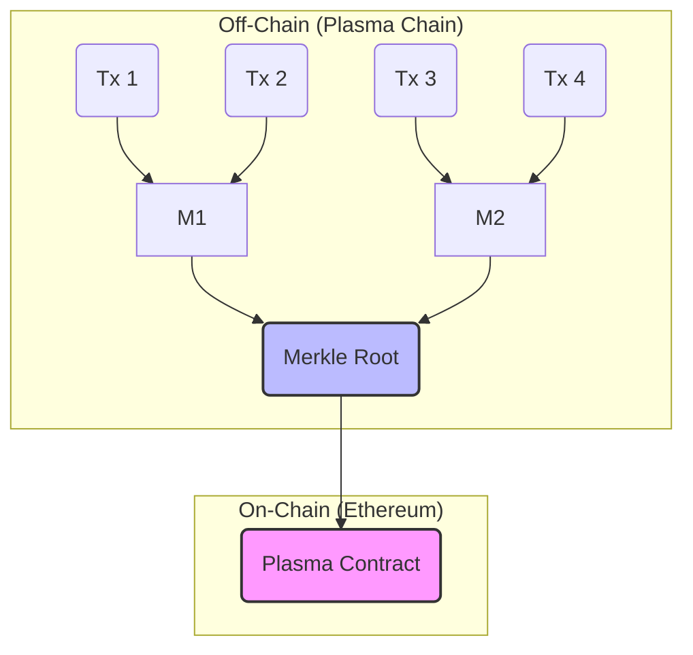
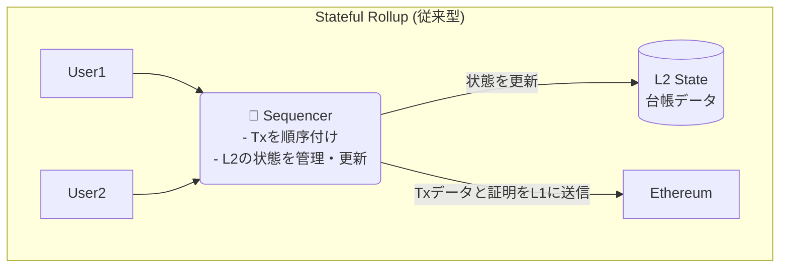
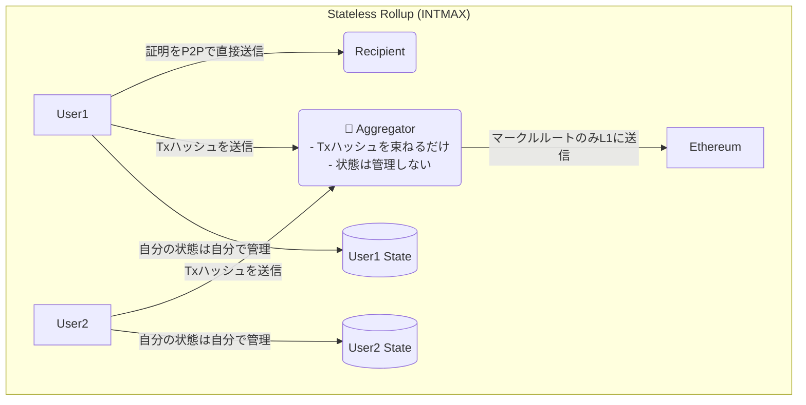
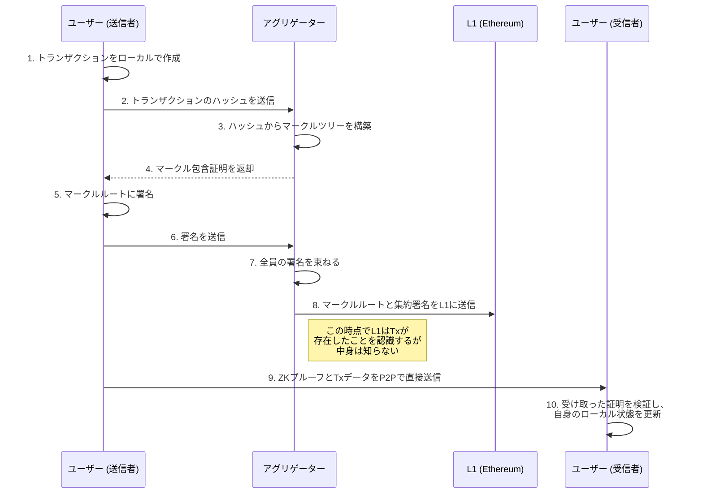

## 物語の始まり：イーサリアムのスケーリング問題とL2の夜明け

かつて、イーサリアムは夢のスマートコントラクト・プラットフォームとして輝かしいデビューを飾りました。しかし、その人気は諸刃の剣。利用者が増えるほどにトランザクションは詰まり、ガス代は高騰。「ワールドコンピューター」は、その性能の限界という大きな壁にぶつかりました。

この「スケーリング問題」を解決すべく、数々のヒーローたちが立ち上がりました。それが**レイヤー2（L2）**と呼ばれる技術群です。中でも近年、絶大な支持を集めているのが**Rollup（ロールアップ）**です。トランザクションをオフチェーンで実行し、その結果だけをイーサリアム本体（L1）に書き込むことで、スケーラビリティとセキュリティの両立を目指しました。

しかし、Rollupが主流となる少し前、もう一つの伝説的なスケーリング技術があったことを覚えているでしょうか？ その名は**Plasma（プラズマ）**。

イーサリアムの共同創設者であるVitalik Buterin氏自身も提唱したこの技術は、一時期、スケーリング問題の最終兵器として大きな期待を集めました。

> "Intmax is the next great thing, Intmax is the Plasma." - **Vitalik Buterin, Founder, Ethereum**

しかし、Plasmaは「データ可用性（DA）問題」などの複雑な課題を克服できず、いつしか「失敗した技術」として語られるようになり、歴史の影に追いやられていきました。

…だが、物語はまだ終わっていなかったのです。

今日、ご紹介する**INTMAX**は、まさにその"失敗したはず"のPlasmaの魂を受け継ぎ、zkRollupの技術と融合させることで、全く新しい地平を切り拓こうとしています。Vitalik氏やJustin Drake氏といったイーサリアム財団の重鎮たちが注目する理由も、まさにここにあります。

https://intmax.io/

この記事では、INTMAXがどのようにしてPlasmaを"再発明"し、既存のL2が抱える課題を解決しようとしているのか、その革新的なアーキテクチャの心臓部に迫っていきます。

## 第一章：Plasmaの栄光と挫折

INTMAXを理解するために、まずはPlasmaが何であり、なぜ一度は表舞台から姿を消したのかを振り返ってみましょう。

### Plasmaとは何だったのか？

Plasmaの基本思想は非常にシンプルです。

> **「本当に大事なことだけをL1（イーサリアム）に報告し、残りはオフチェーン（L1の外）でやろう」**

具体的には、大量のトランザクションをオフチェーンで処理し、その最終結果を証明する「マークルルート」という小さなデータだけをL1に刻みます。これにより、L1の負担を最小限に抑えつつ、絶大なスケーラビリティを実現しようとしました。



### なぜPlasmaは「失敗」したのか？

Plasmaの最大の弱点、それが**「データ可用性（Data Availability）問題」**です。

オフチェーンで処理されるトランザクションデータは、誰が、どこで、どのように保持するのでしょうか？ もし、Plasmaチェーンを管理する悪意のあるオペレーターがこのデータを隠蔽してしまったら、ユーザーは自分の資産が正しく処理されたことを証明できず、資金を引き出すことさえできなくなってしまいます。

この問題を解決するために複雑な仕組み（Exit Gameなど）が考案されましたが、ユーザー体験は著しく悪化しました。結果として、よりシンプルで安全な**Rollup**（特に、全てのトランザクションデータをL1に書き込むOptimistic RollupやzkRollup）がL2の主流となっていったのです。

## 第二章：INTMAXの登場 - 「ステートレス」という革命

Plasmaが歴史の闇に消えようとしていたその時、INTMAXは全く新しいアプローチでその魂を現代に蘇らせました。そのキーワードが**「ステートレス（Stateless）」**です。

### ステートレス・アーキテクチャとは？

従来のRollup（Stateful Rollup）では、L2の「状態（State）」、つまり「誰がどの資産をどれだけ持っているか」という最新の台帳を、シーケンサーと呼ばれる中央集権的な管理者が保持・更新していました。



これに対し、INTMAXの**ステートレス・アーキテクチャ**では、L2全体で共有する単一の状態（台帳）が存在しません。代わりに、**各ユーザーが自分自身の状態（残高など）をクライアントサイド（自分のデバイス）で管理**します。



驚くべきことに、INTMAXではトランザクションを束ねる**アグリゲーター（Aggregator）**でさえ、誰が誰にいくら送ったのかというトランザクションの中身を一切知りません。彼らの仕事は、ユーザーから送られてきたトランザクションの「ハッシュ値」を単純に集めて、マークルツリーを構築し、そのルートをL1に報告するだけ。まさに「ステートレスなデータバンダラー」なのです。

これにより、以下の革命的な利点が生まれます。

1.  **驚異的なスケーラビリティ**: L1に書き込むデータは、トランザクション数に関わらず、参加した**送信者の数に応じた約5バイト**という極小サイズ。これにより、EIP-4844適用後には**320,000 TPS**以上という、他のL2を圧倒する理論値を叩き出します。
2.  **デフォルトでのプライバシー**: トランザクションの中身（送金先、金額）はL1にもアグリゲーターにも渡りません。データは送信者と受信者の間でのみP2Pで直接共有されます。プライバシーはオプションではなく、標準機能なのです。
3.  **検閲耐性とパーミッションレス性**: アグリゲーターはトランザクションの中身を知らないため、特定の取引を検閲することができません。また、誰でもアグリゲーターになることができるため、中央集権的な単一障害点が存在しません。

### Plasmaの課題をどう克服したか？

では、INTMAXはこのアーキテクチャでPlasmaの「データ可用性問題」をどう解決したのでしょうか？

答えは、**ゼロ知識証明（ZKP）**と**クライアントサイド・ストレージ**の組み合わせにあります。

- **データの保持**: トランザクションのデータそのものは、送信者と受信者がP2Pで直接交換します。
- **正当性の証明**: 送信者は、自分が正当な残高を持っていることを証明するZKプルーフを生成し、トランザクションデータと共に受信者に渡します。
- **L1による保証**: L1には、どのトランザクションが含まれているかを示すマークルルートが記録されています。受信者は、受け取ったデータとZKプルーフ、そしてL1上のマークルルートを照合することで、その取引が正当なものであることを誰にも頼ることなく検証できます。

つまり、悪意のあるオペレーターがデータを隠蔽しようとしても、ユーザーは自分の手元にある証明を使って資産の所有権を主張できるのです。これは、Plasmaが目指した理想を、より洗練された形で実現した姿と言えるでしょう。

## 第三章：INTMAXアーキテクチャを支える登場人物と物語

INTMAXのトランザクションは、まるで壮大な物語のように、いくつかの登場人物とフェーズを経て完成します。

### 登場人物

- **ユーザー (Users)**: 物語の主人公。自分自身の状態を管理し、トランザクションを生成します。
- **アグリゲーター (Aggregators)**: トランザクションのハッシュを束ねる伝書鳩。中身は知りません。
- **受信者 (Recipients)**: ユーザーからZKプルーフとデータを直接受け取り、自身の状態を更新します。

### トランザクションのライフサイクル



この流れを見れば、いかにデータがオフチェーン、特にユーザー間で完結しているかがわかるでしょう。L1はあくまで「公証役場」として機能し、アグリゲーターは「書類を束ねる事務員」に過ぎません。真の主役は、自らのデータを主権的に管理するユーザー自身なのです。

## 第四章：INTMAXが拓く未来

この革新的なアーキテクチャは、一体どんな未来を私たちにもたらすのでしょうか？

- **真のマイクロペイメント**: 1円以下の決済が、ガス代を気にすることなく、プライバシーを守りながら可能になります。コンテンツの秒単位課金、IoTデバイス間の自動決済など、これまで夢物語だったユースケースが現実のものとなります。
- **プライベートなB2B決済**: 企業間の取引情報をブロックチェーンに載せることなく、高速かつ低コストな決済が実現します。
- **検閲耐性のある送金**: いかなる中央集権的な主体にも取引を止められることのない、真に自由な価値交換が可能になります。

INTMAXはすでに、誰でも使えるウォレット`INTMAX Wallet`や、ネイティブトークン`ITX`を獲得できる`Privacy Mining`など、エコシステムの構築も進めています。

## ハンズオン！ Block Builderを動かしてみた！

理論を学んだところで、いざ実践！

以下のドキュメントを参考に**INTMAX**の**Block Builder**を動かしてみました！

https://docs.network.intmax.io/developers-hub/intmax-block-builder

### セットアップ

まずはセットアップを行います！

セットアップ用のシェルスクリプトがあるのでまずはそれをダウンロードしてきます！

今回はテストネット用のものを使ってみました！

```bash
curl -o builder.sh https://raw.githubusercontent.com/InternetMaximalism/intmax2/refs/heads/main/scripts/block-builder-testnet.sh
chmod +x builder.sh
```

::::details buider.shの詳細

```bash
#!/bin/bash

#################################################################################
# INTMAX2 Block Builder セットアップ・管理スクリプト
#
# このスクリプトは INTMAX2 ネットワークのブロックビルダーを
# セットアップ・管理するためのツールです。
#
# 主な機能:
# - 初期セットアップ（設定ファイル生成）
# - 環境設定（RPC URL、プライベートキー設定）
# - サービスの起動・停止・監視
# - ヘルスチェック機能
# - 設定検証機能
# - クリーンアップ機能
#
# 使用方法: ./builder.sh [コマンド]
# 詳細なヘルプ: ./builder.sh help
#################################################################################

# エラーが発生した場合にスクリプトを終了
set -e

# API エンドポイントとURL設定
API_ENDPOINT="https://stage.api.indexer.intmax.io/v1/proxy/meta"
INDEXER_API_ENDPOINT="https://stage.api.indexer.intmax.io"
BUILDER_SCRIPT_URL="https://raw.githubusercontent.com/InternetMaximalism/intmax2/refs/heads/main/scripts/block-builder-testnet.sh"

# 期待されるネットワーク設定
EXPECTED_NETWORK_ID="534351"
EXPECTED_NETWORK_NAME="Scroll Sepolia Testnet"
ENVIRONMENT="testnet"

# 許可されたドメインのリスト（セキュリティ対策）
ALLOWED_DOMAINS="intmax.io,raw.githubusercontent.com"

# 環境変数用の設定値
REGISTRATION_FEE=0:2500000000000
NON_REGISTRATION_FEE=0:2000000000000
STORE_VAULT_SERVER_BASE_URL=https://stage.api.node.intmax.io/store-vault-server
VALIDITY_PROVER_BASE_URL=https://stage.api.node.intmax.io/validity-prover
ROLLUP_CONTRACT_ADDRESS=0xcEC03800074d0ac0854bF1f34153cc4c8bAEeB1E
BLOCK_BUILDER_REGISTRY_CONTRACT_ADDRESS=0x93a41F47ed161AB2bc58801F07055f2f05dfc74E

# API から取得する変数（初期値は空）
INTMAX2_VERSION=""
PROXY_DOMAIN=""
FRP_TOKEN=""

# 環境名から内部環境変数を設定する関数
set_env_from_environment() {
    case "$ENVIRONMENT" in
        "devnet")
            ENV="dev"
            ;;
        "testnet")
            ENV="staging"
            ;;
        "mainnet")
            ENV="prod"
            ;;
        *)
            echo "❌ Unknown ENVIRONMENT: $ENVIRONMENT"
            echo "💡 Supported values: devnet, testnet, mainnet"
            return 1
            ;;
    esac

    return 0
}

if set_env_from_environment; then
    :
else
    echo "❌ Failed to set ENV"
    exit 1
fi

# 現在の環境設定を色付きで表示する関数
show_current_environment() {
    if set_env_from_environment; then
        local env_color=""
        local env_label=""
        # 環境に応じて表示色を設定
        case "$ENVIRONMENT" in
            "devnet")
                env_color="\033[1;36m"  # シアン色
                env_label="🔧 DEVELOPMENT"
                ;;
            "testnet")
                env_color="\033[1;33m"  # 黄色
                env_label="🧪 TESTNET"
                ;;
            "mainnet")
                env_color="\033[1;32m"  # 緑色
                env_label="🚀 MAINNET"
                ;;
        esac
        local reset_color="\033[0m"  # 色をリセット

        echo ""
        echo "═══════════════════════════════════════════════════════════════"
        echo "🌍 ENVIRONMENT CONFIGURATION"
        echo -e "   ENVIRONMENT: ${env_color}${ENVIRONMENT}${reset_color}"
        echo "═══════════════════════════════════════════════════════════════"
        echo ""
    else
        echo "   ❌ INVALID ENVIRONMENT: $ENVIRONMENT"
        echo "   💡 Supported values: devnet, testnet, mainnet"
        echo ""
        return 1
    fi
}

# API エンドポイントのセキュリティ検証を行う関数
validate_api_endpoint() {
    local endpoint="$1"

    # HTTPS必須チェック
    if ! echo "$endpoint" | grep -q "^https://"; then
        echo "❌ API endpoint must use HTTPS"
        return 1
    fi

    # ドメイン部分を抽出
    local domain=$(echo "$endpoint" | sed 's|https://||' | cut -d'/' -f1)

    # 許可されたドメインリストを配列に変換
    IFS=',' read -ra allowed_domains_array <<< "$ALLOWED_DOMAINS"

    # ドメインの許可チェック
    local domain_allowed=false
    for allowed_domain in "${allowed_domains_array[@]}"; do
        # 前後の空白を削除
        allowed_domain=$(echo "$allowed_domain" | sed 's/^[[:space:]]*//;s/[[:space:]]*$//')

        # ドメインが完全一致またはサブドメインが許可されているかチェック
        if [ "$domain" = "$allowed_domain" ] || echo "$domain" | grep -q "\\.${allowed_domain}$"; then
            domain_allowed=true
            break
        fi
    done

    # 結果を返す
    if [ "$domain_allowed" = true ]; then
        return 0
    else
        echo "❌ Unauthorized API domain: $domain"
        echo "   Allowed domains: $ALLOWED_DOMAINS"
        return 1
    fi
}

# API レスポンスの妥当性を検証する関数
validate_api_response() {
    local response="$1"

    # 空のレスポンスチェック
    if [ -z "$response" ]; then
        echo "❌ Empty API response"
        return 1
    fi

    # JSONフォーマットの妥当性チェック
    if ! echo "$response" | jq empty 2>/dev/null; then
        echo "❌ Invalid JSON response from API"
        return 1
    fi

    # 必要なフィールドを抽出
    local domain=$(echo "$response" | jq -r '.domain // empty')
    local token=$(echo "$response" | jq -r '.token // empty')
    local version=$(echo "$response" | jq -r '.version // empty')

    # 必須フィールドの存在チェック
    if [ -z "$domain" ] || [ -z "$token" ] || [ -z "$version" ]; then
        echo "❌ Missing required fields in API response"
        return 1
    fi

    # ドメインフォーマットの妥当性チェック
    if ! echo "$domain" | grep -E '^[a-zA-Z0-9.-]+\.[a-zA-Z]{2,}$' >/dev/null; then
        echo "❌ Invalid domain format: $domain"
        return 1
    fi

    # バージョンフォーマットの妥当性チェック（セマンティックバージョニング）
    if ! echo "$version" | grep -E '^v?[0-9]+\.[0-9]+\.[0-9]+' >/dev/null; then
        echo "❌ Invalid version format: $version"
        return 1
    fi

    # トークンに危険な文字が含まれていないかチェック
    if echo "$token" | grep -E '[[:space:]<>"\|&;`$()]' >/dev/null; then
        echo "❌ Token contains invalid characters"
        return 1
    fi

    return 0
}

# API レスポンスから必要な値を解析して変数に設定する関数
parse_api_response() {
    local response="$1"

    # jq コマンドが利用可能な場合は高品質なJSONパースを使用
    if command -v jq >/dev/null 2>&1; then
        PROXY_DOMAIN=$(echo "$response" | jq -r '.domain // empty')
        FRP_TOKEN=$(echo "$response" | jq -r '.token // empty')
        local api_version=$(echo "$response" | jq -r '.version // empty')

        # バージョン番号から先頭の'v'を削除
        if [ -n "$api_version" ]; then
            INTMAX2_VERSION=$(echo "$api_version" | sed 's/^v//')
        fi
    else
        # jq が利用できない場合は基本的な文字列操作でパース
        echo "⚠️  jq not found, using basic parsing"
        PROXY_DOMAIN=$(echo "$response" | grep -o '"domain":"[^"]*"' | cut -d':' -f2 | tr -d '"')
        FRP_TOKEN=$(echo "$response" | grep -o '"token":"[^"]*"' | cut -d':' -f2 | tr -d '"')
        local api_version=$(echo "$response" | grep -o '"version":"[^"]*"' | cut -d':' -f2 | tr -d '"')

        # バージョン番号から先頭の'v'を削除
        if [ -n "$api_version" ]; then
            INTMAX2_VERSION=$(echo "$api_version" | sed 's/^v//')
        fi
    fi

    # 必要な値がすべて取得できたかチェック
    if [ -z "$PROXY_DOMAIN" ] || [ -z "$FRP_TOKEN" ] || [ -z "$INTMAX2_VERSION" ]; then
        echo "❌ Failed to parse required values from API response"
        return 1
    fi

    return 0
}

# 設定値のサニタイズとセキュリティ検証を行う関数
sanitize_config_values() {
    # プロキシドメインのサニタイズ
    if [ -n "$PROXY_DOMAIN" ]; then
        # 英数字、ドット、ハイフン以外の文字を除去
        local sanitized_domain=$(echo "$PROXY_DOMAIN" | sed 's/[^a-zA-Z0-9.-]//g')

        # ドメイン名の正規表現による妥当性チェック
        if echo "$sanitized_domain" | grep -qE '^[a-zA-Z0-9]([a-zA-Z0-9-]{0,61}[a-zA-Z0-9])?(\.[a-zA-Z0-9]([a-zA-Z0-9-]{0,61}[a-zA-Z0-9])?)*$'; then
            # 許可されたドメインリストを配列に変換
            IFS=',' read -ra allowed_domains_array <<< "$ALLOWED_DOMAINS"

            # ドメインが許可リストに含まれているかチェック
            local domain_allowed=false
            for allowed_domain in "${allowed_domains_array[@]}"; do
                allowed_domain=$(echo "$allowed_domain" | sed 's/^[[:space:]]*//;s/[[:space:]]*$//')

                if [ "$sanitized_domain" = "$allowed_domain" ] || echo "$sanitized_domain" | grep -qE "\\.${allowed_domain}$"; then
                    domain_allowed=true
                    break
                fi
            done

            if [ "$domain_allowed" = true ]; then
                PROXY_DOMAIN="$sanitized_domain"
            else
                echo "❌ PROXY_DOMAIN contains unauthorized domain: $sanitized_domain"
                echo "   Allowed domains: $ALLOWED_DOMAINS"
                return 1
            fi
        else
            echo "❌ PROXY_DOMAIN has invalid format after sanitization: $sanitized_domain"
            return 1
        fi
    else
        echo "❌ PROXY_DOMAIN is empty"
        return 1
    fi

    # FRPトークンのサニタイズ
    if [ -n "$FRP_TOKEN" ]; then
        # 英数字、アンダースコア、ハイフン以外の文字を除去
        local sanitized_token=$(echo "$FRP_TOKEN" | sed 's/[^a-zA-Z0-9_-]//g')

        # トークン長の妥当性チェック（32〜128文字）
        local token_length=$(echo -n "$sanitized_token" | wc -c)
        if [ "$token_length" -ge 32 ] && [ "$token_length" -le 128 ]; then
            # トークンの開始・終了文字が英数字であることをチェック
            if echo "$sanitized_token" | grep -qE '^[a-zA-Z0-9][a-zA-Z0-9_-]*[a-zA-Z0-9]$'; then
                FRP_TOKEN="$sanitized_token"
            else
                echo "❌ FRP_TOKEN has invalid pattern after sanitization"
                return 1
            fi
        else
            echo "❌ FRP_TOKEN length invalid after sanitization: $token_length (expected: 32-128)"
            return 1
        fi
    else
        echo "❌ FRP_TOKEN is empty"
        return 1
    fi

    # バージョン番号のサニタイズ
    if [ -n "$INTMAX2_VERSION" ]; then
        # 英数字、ドット、ハイフン以外の文字を除去
        local sanitized_version=$(echo "$INTMAX2_VERSION" | sed 's/[^a-zA-Z0-9.-]//g')

        # セマンティックバージョニング形式の妥当性チェック（例: 1.2.3 または 1.2.3-alpha.1）
        if echo "$sanitized_version" | grep -qE '^[0-9]+\.[0-9]+\.[0-9]+(-[a-zA-Z0-9.-]+)?$'; then
            # メジャー、マイナー、パッチバージョンを抽出
            local major=$(echo "$sanitized_version" | cut -d'.' -f1)
            local minor=$(echo "$sanitized_version" | cut -d'.' -f2)
            local patch=$(echo "$sanitized_version" | cut -d'.' -f3 | cut -d'-' -f1)

            # 各バージョン番号が有効範囲内であることをチェック（0-999）
            if [ "$major" -ge 0 ] && [ "$major" -le 999 ] && \
               [ "$minor" -ge 0 ] && [ "$minor" -le 999 ] && \
               [ "$patch" -ge 0 ] && [ "$patch" -le 999 ]; then
                # 0.0.0は無効なバージョンとして扱う
                if [ "$major" -eq 0 ] && [ "$minor" -eq 0 ] && [ "$patch" -eq 0 ]; then
                    echo "❌ INTMAX2_VERSION cannot be 0.0.0: $sanitized_version"
                    return 1
                fi
                INTMAX2_VERSION="$sanitized_version"
            else
                echo "❌ INTMAX2_VERSION out of valid range: $sanitized_version"
                echo "   Expected: 0.0.1 to 999.999.999 (excluding 0.0.0)"
                return 1
            fi
        else
            echo "❌ INTMAX2_VERSION has invalid semantic version format: $sanitized_version"
            return 1
        fi
    else
        echo "❌ INTMAX2_VERSION is empty"
        return 1
    fi

    # 最終的に全ての設定値が適切に設定されているかチェック
    if [ -z "$PROXY_DOMAIN" ] || [ -z "$FRP_TOKEN" ] || [ -z "$INTMAX2_VERSION" ]; then
        echo "❌ One or more configuration values became empty after sanitization"
        echo "   PROXY_DOMAIN: ${PROXY_DOMAIN:-'<empty>'}"
        echo "   FRP_TOKEN: ${FRP_TOKEN:+<set>}${FRP_TOKEN:-'<empty>'}"
        echo "   INTMAX2_VERSION: ${INTMAX2_VERSION:-'<empty>'}"
        return 1
    fi

    return 0
}

# API から設定情報を取得し検証する関数
fetch_api_config() {
    # APIエンドポイントの妥当性チェック
    if ! validate_api_endpoint "$API_ENDPOINT"; then
        return 1
    fi

    # curlコマンドの存在チェック
    if ! command -v curl >/dev/null 2>&1; then
        echo "❌ curl not found. Please install curl to fetch API configuration."
        return 1
    fi

    local api_response
    # curlのオプション: サイレント、10秒タイムアウト、HTTPエラー時に終了
    local curl_options="-s --max-time 10 --fail"

    # APIからレスポンスを取得し、各段階で検証を実行
    if api_response=$(curl $curl_options "$API_ENDPOINT" 2>/dev/null); then
        if validate_api_response "$api_response"; then
            if parse_api_response "$api_response"; then
                if sanitize_config_values; then
                    return 0
                fi
            fi
        fi
    fi

    echo "⚠️  API fetch failed or validation failed"
    return 1
}

# 設定情報を読み込む関数（APIから取得に失敗した場合は終了）
load_config() {
    if ! fetch_api_config; then
        echo "❌ API fetch failed, cannot proceed without valid configuration"
        echo "Please check your internet connection and API endpoint:"
        echo "   $API_ENDPOINT"
        exit 1
    fi
}

# システムアーキテクチャを検出して適切なDockerイメージを選択する関数
detect_architecture() {
    local arch=$(uname -m)
    case $arch in
        aarch64|arm64)
            # ARM64アーキテクチャ用のイメージ
            echo "ghcr.io/internetmaximalism/intmax2:${INTMAX2_VERSION}-arm64"
            ;;
        x86_64|amd64)
            # x86_64アーキテクチャ用のイメージ（デフォルト）
            echo "ghcr.io/internetmaximalism/intmax2:${INTMAX2_VERSION}"
            ;;
        *)
            # 未知のアーキテクチャの場合はx86_64を使用
            echo "⚠️  Unknown architecture: $arch. Using default x86_64 image."
            echo "ghcr.io/internetmaximalism/intmax2:${INTMAX2_VERSION}"
            ;;
    esac
}

# UUID（一意識別子）を生成する関数
generate_uuid() {
    # uuidgenコマンドの存在チェック
    if ! command -v uuidgen >/dev/null 2>&1; then
        echo "❌ uuidgen is required but not found" >&2
        echo "" >&2
        echo "Please install uuidgen:" >&2
        echo "" >&2
        return 1
    fi

    # UUIDを生成して小文字に変換
    uuidgen | tr '[:upper:]' '[:lower:]'
}

# 必要なツールの存在をチェックする関数
check_required_tools() {
    local missing_tools=()

    # 必須ツールの存在確認
    if ! command -v uuidgen >/dev/null 2>&1; then
        missing_tools+=("uuidgen")
    fi

    if ! command -v curl >/dev/null 2>&1; then
        missing_tools+=("curl")
    fi

    if ! command -v docker >/dev/null 2>&1; then
        missing_tools+=("docker")
    fi

    # 推奨ツールの存在確認
    local recommended_tools=()
    if ! command -v jq >/dev/null 2>&1; then
        recommended_tools+=("jq")
    fi

    # 必須ツールが不足している場合はエラーを表示
    if [ ${#missing_tools[@]} -gt 0 ]; then
        echo "❌ Missing required tools: ${missing_tools[*]}"
        echo ""
        echo "Installation commands:"

        for tool in "${missing_tools[@]}"; do
            echo "Missing tool: $tool"
            echo "Please install $tool using your system's package manager:"
            echo ""
        done

        return 1
    fi

    # 推奨ツールが不足している場合は警告を表示
    if [ ${#recommended_tools[@]} -gt 0 ]; then
        echo "⚠️  Recommended tools not found: ${recommended_tools[*]}"
        echo "   These tools will improve the script's functionality"
        echo ""
    fi

    echo "✅ All required tools are available"
    return 0
}

# Docker Swarm モードの有効性をチェックする関数
check_docker_swarm() {
    # Docker の情報からSwarmが有効かどうかを確認
    if ! docker info 2>/dev/null | grep -q "Swarm: active"; then
        echo "⚠️  Docker Swarm is not active"
        echo "💡 To enable Docker Swarm: docker swarm init"
        echo "🔄 After running 'docker swarm init', please re-execute the command"
        return 1
    fi
    return 0
}

# Docker Secret の存在をチェックする関数
check_docker_secret() {
    # まずDocker Swarmが有効かチェック
    if ! check_docker_swarm; then
        return 1
    fi

    # 環境に応じたSecret名を生成
    local secret_name="block_builder_private_key_${ENVIRONMENT}"

    # Docker Secretの存在確認
    if docker secret ls 2>/dev/null | grep -q "$secret_name"; then
        echo "✅ Docker secret '$secret_name' exists"
        return 0
    else
        echo "❌ Docker secret '$secret_name' not found"
        echo "💡 Run: $0 setup-env"
        return 1
    fi
}

# プライベートキーの設定状況をチェックする関数
check_private_key_config() {
    local has_docker_secret=false
    local secret_name="block_builder_private_key_${ENVIRONMENT}"

    # Docker SwarmとSecretの存在を確認
    if check_docker_swarm >/dev/null 2>&1; then
        if docker secret ls 2>/dev/null | grep -q "$secret_name"; then
            has_docker_secret=true
            echo "✅ Docker secret '$secret_name' exists"
        fi
    fi

    # プライベートキーが設定されていない場合はエラー
    if [ "$has_docker_secret" = false ]; then
        echo "❌ No private key configuration found"
        echo "💡 Please set up environment using:"
        echo "   $0 setup-env"
        return 1
    fi

    return 0
}

check_rpc_connectivity() {
    local l2_rpc_url="$1"
    local verbose="${2:-false}"

    if [ -z "$l2_rpc_url" ]; then
        echo "❌ RPC URL is required"
        return 1
    fi

    if ! command -v curl >/dev/null 2>&1; then
        echo "⚠️  curl not available, skipping connectivity test"
        return 0
    fi

    if [ "$verbose" = true ]; then
        echo "🔗 Testing L2 RPC connectivity..."
        echo "   Testing: $l2_rpc_url"
    fi

    local rpc_test_payload='{"jsonrpc":"2.0","method":"net_version","params":[],"id":1}'
    local curl_start_time=$(date +%s)
    local response_body
    local http_code

    if [ "$verbose" = true ]; then
        echo "   Method: net_version"
    fi

    if response_body=$(curl -s --connect-timeout 10 --max-time 15 \
        -H "Content-Type: application/json" \
        -d "$rpc_test_payload" \
        -w "%{http_code}" \
        "$l2_rpc_url" 2>/dev/null); then

        http_code="${response_body: -3}"
        response_body="${response_body%???}"

        local curl_end_time=$(date +%s)
        local response_time=$((curl_end_time - curl_start_time))

        if [ "$http_code" -eq 200 ]; then
            if [ "$verbose" = true ]; then
                echo "   ✅ RPC connectivity test passed (HTTP $http_code, ${response_time}s)"
            fi

            if command -v jq >/dev/null 2>&1 && echo "$response_body" | jq empty 2>/dev/null; then
                local result=$(echo "$response_body" | jq -r '.result // empty')
                local error=$(echo "$response_body" | jq -r '.error.message // empty')

                if [ -n "$result" ]; then
                    if [ "$verbose" = true ]; then
                        echo "   📊 Network ID: $result"

                        if [ "$result" = "$EXPECTED_NETWORK_ID" ]; then
                            echo "   🌐 Network: $EXPECTED_NETWORK_NAME ✅"
                        else
                            echo "   🌐 Network: Chain ID $result"
                            echo "   ⚠️  Note: Expected $EXPECTED_NETWORK_NAME ($EXPECTED_NETWORK_ID) for this setup"
                        fi
                    fi
                elif [ -n "$error" ]; then
                    if [ "$verbose" = true ]; then
                        echo "   ⚠️  RPC returned error: $error"
                    fi
                    return 1
                else
                    if [ "$verbose" = true ]; then
                        echo "   ⚠️  Unexpected RPC response format"
                    fi
                fi
            else
                if [ "$verbose" = true ]; then
                    echo "   📄 Response received (jq not available for detailed parsing)"
                    echo "   Response preview: $(echo "$response_body" | cut -c1-100)..."
                fi
            fi

            if [ "$verbose" = true ]; then
                echo ""
                echo "🔗 Testing latest block retrieval..."
            fi

            local block_test_payload='{"jsonrpc":"2.0","method":"eth_blockNumber","params":[],"id":2}'

            if response_body=$(curl -s --connect-timeout 10 --max-time 15 \
                -H "Content-Type: application/json" \
                -d "$block_test_payload" \
                -w "%{http_code}" \
                "$l2_rpc_url" 2>/dev/null); then

                http_code="${response_body: -3}"
                response_body="${response_body%???}"

                if [ "$http_code" -eq 200 ]; then
                    if [ "$verbose" = true ]; then
                        echo "   ✅ Block number retrieval passed (HTTP $http_code)"
                    fi

                    if command -v jq >/dev/null 2>&1 && echo "$response_body" | jq empty 2>/dev/null; then
                        local block_hex=$(echo "$response_body" | jq -r '.result // empty')
                        if [ -n "$block_hex" ] && [ "$block_hex" != "null" ]; then
                            if command -v printf >/dev/null 2>&1; then
                                local block_num=$(printf "%d" "$block_hex" 2>/dev/null || echo "$block_hex")
                                if [ "$verbose" = true ]; then
                                    echo "   📊 Latest block: $block_num ($block_hex)"
                                fi
                            else
                                if [ "$verbose" = true ]; then
                                    echo "   📊 Latest block: $block_hex"
                                fi
                            fi
                        else
                            if [ "$verbose" = true ]; then
                                echo "   ⚠️  Could not retrieve block number"
                            fi
                        fi
                    fi
                else
                    if [ "$verbose" = true ]; then
                        echo "   ⚠️  Block number test failed (HTTP $http_code)"
                    fi
                fi
            else
                if [ "$verbose" = true ]; then
                    echo "   ⚠️  Block number test connection failed"
                fi
            fi

            return 0

        elif [ "$http_code" -eq 405 ]; then
            if [ "$verbose" = true ]; then
                echo "   ❌ RPC endpoint doesn't support POST method (HTTP $http_code)"
                echo "   💡 Check if the URL is correct and supports JSON-RPC"
            fi
            return 1
        elif [ "$http_code" -eq 404 ]; then
            if [ "$verbose" = true ]; then
                echo "   ❌ RPC endpoint not found (HTTP $http_code)"
                echo "   💡 Check if the URL path is correct"
            fi
            return 1
        elif [ "$http_code" -ge 500 ]; then
            if [ "$verbose" = true ]; then
                echo "   ❌ RPC server error (HTTP $http_code)"
                echo "   💡 The RPC server might be temporarily unavailable"
            fi
            return 1
        else
            if [ "$verbose" = true ]; then
                echo "   ❌ RPC connectivity test failed (HTTP $http_code)"
                if [ -n "$response_body" ]; then
                    echo "   Response: $(echo "$response_body" | cut -c1-200)..."
                fi
            fi
            return 1
        fi
    else
        if [ "$verbose" = true ]; then
            echo "   ❌ Cannot reach L2 RPC endpoint"
            echo "   💡 Check your internet connection and RPC URL"
            echo "   💡 If using a local node, ensure it's running and accessible"
        fi
        return 1
    fi
}

# ユーザーに確認を求める関数
confirm_action() {
    local message="${1:-Are you sure?}"  # 確認メッセージ（デフォルト: "Are you sure?"）
    local default="${2:-N}"              # デフォルト値（デフォルト: "N"）

    echo "❓ $message (y/n)"

    read -p "Enter your choice: " confirm

    case "$confirm" in
        [yY]|[yY][eE][sS])
            echo "✅ Proceeding..."
            return 0
            ;;
        [nN]|[nN][oO])
            echo "❌ Operation cancelled"
            return 1
            ;;
        "")
            if [[ "$default" == "Y" || "$default" == "y" ]]; then
                echo "✅ Proceeding (default: Yes)..."
                return 0
            else
                echo "❌ Operation cancelled (default: No)"
                return 1
            fi
            ;;
        *)
            echo "❌ Invalid input. Operation cancelled"
            return 1
            ;;
    esac
}

# 初期セットアップを実行する関数（設定ファイル生成）
setup() {
    # 現在の環境設定を表示
    show_current_environment

    # 必要なツールの存在確認
    echo "🔍 Checking required tools..."
    if ! check_required_tools; then
        echo "❌ Setup cannot continue without required tools"
        echo "Please install the missing tools and try again"
        exit 1
    fi
    echo ""

    # 既存の設定ファイルが存在する場合は警告して終了
    if [ -f "frpc.toml" ] || [ -f "docker-compose.yml" ] || [ -f ".env.${ENVIRONMENT}" ] || [ -f "nginx.conf" ]; then
        echo "⚠️  Setup files already exist. The following files were found:"
        [ -f "frpc.toml" ] && echo "   - frpc.toml"
        [ -f "docker-compose.yml" ] && echo "   - docker-compose.yml"
        [ -f ".env.${ENVIRONMENT}" ] && echo "   - .env.${ENVIRONMENT}"
        [ -f "nginx.conf" ] && echo "   - nginx.conf"
        echo ""
        echo "🧹 Please run cleanup first before setting up again:"
        echo "   $0 clean"
        echo ""
        echo "💡 Or if you want to start fresh automatically:"
        echo "   $0 clean && $0 setup"
        return 1
    fi
    
    # API設定を読み込み
    load_config

    # 一意識別子（UUID）を生成
    uuid=$(generate_uuid)
    if [ $? -ne 0 ]; then
        echo "❌ Failed to generate UUID"
        exit 1
    fi

    # システムアーキテクチャに応じたDockerイメージを選択
    docker_image=$(detect_architecture)

    cat > frpc.toml << EOF
serverAddr = "$PROXY_DOMAIN"
serverPort = 7000
auth.token = "$FRP_TOKEN"

[[proxies]]
name = "$uuid-block-builder"
type = "http"
localIP = "nginx-proxy-$ENVIRONMENT"
localPort = 3000
customDomains = ["$PROXY_DOMAIN"]
locations = ["/$uuid"]
EOF

    cat > nginx.conf << EOF
events {
    worker_connections 1024;
}
http {
    upstream block_builder_${ENVIRONMENT} {
        server block-builder-${ENVIRONMENT}:8080;
    }
    server {
        listen 3000;
        location ~ "^/([^/]+)(/.*)$" {
            proxy_pass http://block_builder_${ENVIRONMENT}\$2;
            proxy_set_header Host \$host;
            proxy_set_header X-Real-IP \$remote_addr;
            proxy_set_header X-Forwarded-For \$proxy_add_x_forwarded_for;
            proxy_set_header X-Namespace \$1;
        }
        location / {
            return 404;
        }
    }
}
EOF

    cat > docker-compose.yml << 'EOF'
services:
  nginx-proxy-ENVIRONMENT:
    image: nginx:alpine
    ports:
      - "3000:3000"
    volumes:
      - ./nginx.conf:/etc/nginx/nginx.conf:ro
    networks:
      - builder-network-ENVIRONMENT
    tmpfs:
      - /var/cache/nginx
      - /var/run
      - /tmp
    logging:
      driver: "json-file"
      options:
        max-size: "10m"
        max-file: "3"

  block-builder-ENVIRONMENT:
    image: DOCKER_IMAGE_PLACEHOLDER
    command:
      [
        "export BLOCK_BUILDER_PRIVATE_KEY=$$(cat /run/secrets/block_builder_private_key_ENVIRONMENT | tr -d '\n') && exec /app/block-builder",
      ]
    env_file:
      - .env.ENVIRONMENT
    environment:
      - PORT=8080
      - BLOCK_BUILDER_URL=https://PROXY_DOMAIN_PLACEHOLDER/UUID_PLACEHOLDER
    secrets:
      - block_builder_private_key_ENVIRONMENT
    networks:
      - builder-network-ENVIRONMENT
    healthcheck:
      disable: true
    logging:
      driver: "json-file"
      options:
        max-size: "10m"
        max-file: "3"

  frp-client-ENVIRONMENT:
    image: snowdreamtech/frpc:latest
    volumes:
      - ./frpc.toml:/etc/frp/frpc.toml:ro
    networks:
      - builder-network-ENVIRONMENT
    logging:
      driver: "json-file"
      options:
        max-size: "10m"
        max-file: "3"

networks:
  builder-network-ENVIRONMENT:
    driver: overlay
    attachable: true

secrets:
  block_builder_private_key_ENVIRONMENT:
    external: true
EOF

sed -i.tmp "s|DOCKER_IMAGE_PLACEHOLDER|$docker_image|g" docker-compose.yml && rm -f docker-compose.yml.tmp
sed -i.tmp "s|PROXY_DOMAIN_PLACEHOLDER|$PROXY_DOMAIN|g" docker-compose.yml && rm -f docker-compose.yml.tmp
sed -i.tmp "s|UUID_PLACEHOLDER|$uuid|g" docker-compose.yml && rm -f docker-compose.yml.tmp
sed -i.tmp "s|ENVIRONMENT|$ENVIRONMENT|g" docker-compose.yml && rm -f docker-compose.yml.tmp

    cat > ".env.${ENVIRONMENT}" << EOF
#######
# Contents of .env.${ENVIRONMENT} for ${ENVIRONMENT}
#######

# app settings
PORT=8080

# builder settings
ETH_ALLOWANCE_FOR_BLOCK=0.001
TX_TIMEOUT=80
ACCEPTING_TX_INTERVAL=30
PROPOSING_BLOCK_INTERVAL=30
INITIAL_HEART_BEAT_DELAY=180
HEART_BEAT_INTERVAL=85800
GAS_LIMIT_FOR_BLOCK_POST=400000
CLUSTER_ID=1

# fee settings
REGISTRATION_FEE=${REGISTRATION_FEE}
NON_REGISTRATION_FEE=${NON_REGISTRATION_FEE}

# external settings
ENV=${ENV}
STORE_VAULT_SERVER_BASE_URL=${STORE_VAULT_SERVER_BASE_URL}
USE_S3=true
VALIDITY_PROVER_BASE_URL=${VALIDITY_PROVER_BASE_URL}
L2_RPC_URL=<your-rpc-url>
ROLLUP_CONTRACT_ADDRESS=${ROLLUP_CONTRACT_ADDRESS}
BLOCK_BUILDER_REGISTRY_CONTRACT_ADDRESS=${BLOCK_BUILDER_REGISTRY_CONTRACT_ADDRESS}
EOF

    echo "✅ Configuration files created with UUID: $uuid"
    echo "🏗️  Architecture: $(uname -m)"
    echo "🐳 Docker image: $docker_image"
    echo "🌐 Proxy domain: $PROXY_DOMAIN"
    echo "🔗 Block builder URL: https://$PROXY_DOMAIN/$uuid"
    echo "📄 Files created:"
    echo "   - frpc.toml"
    echo "   - nginx.conf"
    echo "   - docker-compose.yml"
    echo "   - .env.${ENVIRONMENT}"
    echo ""
    echo "🔧 Next steps:"
    echo "   1. Set up env: $0 setup-env"
    echo "   2. Run: $0 check"
    echo "   3. Run: $0 run"
}

# 環境設定を行う関数（RPC URL とプライベートキーの設定）
setup_env() {
    echo "🌍 Setting up environment configuration..."

    # 環境設定ファイルの存在確認
    local env_file=".env.${ENVIRONMENT}"

    if [ ! -f "$env_file" ]; then
        echo "❌ $env_file file not found"
        echo "💡 Run: $0 setup first to create the initial $env_file file"
        return 1
    fi

    # Dockerの状態確認
    echo "🐳 Checking Docker status..."
    if ! docker info >/dev/null 2>&1; then
        echo "❌ Docker is not running or not accessible"
        echo "💡 Please start Docker and try again"
        return 1
    fi

    # Docker Swarmの有効性確認
    if ! docker info 2>/dev/null | grep -q "Swarm: active"; then
        echo "❌ Docker Swarm is not active"
        echo "💡 Run: docker swarm init"
        echo "🔄 After running 'docker swarm init', please re-execute the command"
        return 1
    fi

    echo ""
    echo "🔧 This command will configure:"
    echo "   1. L2_RPC_URL in .env file"
    echo "   2. Private key as Docker secret"
    echo ""

    echo "📝 L2 RPC URL configuration:"
    echo "   This should be a valid HTTP/HTTPS URL to your Scroll (Sepolia) RPC endpoint"
    echo "   Examples:"
    echo ""
    echo "Mainnet RPC URLs:"
    echo "  • https://scroll-mainnet.infura.io/v3/YOUR_PROJECT_ID"
    echo "  • https://scroll-mainnet.g.alchemy.com/v2/YOUR_API_KEY"
    echo ""
    echo "Testnet RPC URLs:"
    echo "  • https://scroll-sepolia.infura.io/v3/YOUR_PROJECT_ID"
    echo "  • https://scroll-sepolia.g.alchemy.com/v2/YOUR_API_KEY"
    echo ""

    update_rpc=true
    current_rpc_url=$(grep "^L2_RPC_URL=" "$env_file" 2>/dev/null | cut -d'=' -f2-)
    if [ -n "$current_rpc_url" ] && [ "$current_rpc_url" != "<your-rpc-url>" ]; then
        echo "🔄 Current L2_RPC_URL: $current_rpc_url"
        echo "🔄 Do you want to update the existing L2_RPC_URL? (y/n)"
        echo -n "> "
        read -r update_rpc_choice

        if [ "$update_rpc_choice" != "y" ] && [ "$update_rpc_choice" != "Y" ]; then
            echo "ℹ️  Keeping existing L2_RPC_URL configuration"
            l2_rpc_url="$current_rpc_url"
            update_rpc=false
        fi
    fi

    if [ "$update_rpc" = true ]; then
        echo ""
        echo "🌐 Please enter your L2 RPC URL:"
        echo -n "> "
        read -r l2_rpc_url
        echo ""

        if [ -z "$l2_rpc_url" ]; then
            echo "❌ L2 RPC URL cannot be empty"
            return 1
        fi

        if ! echo "$l2_rpc_url" | grep -qE '^https?://[a-zA-Z0-9.-]+'; then
            echo "❌ Invalid URL format"
            echo "   L2 RPC URL must start with http:// or https://"
            echo "   Your input: $l2_rpc_url"
            return 1
        fi

        l2_rpc_url=$(echo "$l2_rpc_url" | sed 's|/$||')
    fi

    echo ""
    echo "🔐 Private key configuration:"

    local secret_name="block_builder_private_key_${ENVIRONMENT}"

    update_private_key=true
    if docker secret ls | grep -q "$secret_name"; then
        echo "⚠️  Docker secret '$secret_name' already exists"
        echo ""
        echo "🔄 Do you want to overwrite the existing private key? (y/n)"
        echo -n "> "
        read -r overwrite_choice

        if [ "$overwrite_choice" != "y" ] && [ "$overwrite_choice" != "Y" ]; then
            echo "ℹ️  Keeping existing private key configuration"
            update_private_key=false
        else
            echo "🗑️  Removing existing secret..."
            docker secret rm "$secret_name" || {
                echo "❌ Failed to remove existing secret"
                return 1
            }
            echo "✅ Existing secret removed"
        fi
    fi

    if [ "$update_private_key" = true ]; then
        echo ""
        echo "📝 Private key format requirements:"
        echo "   - Can be with or without '0x' prefix"
        echo "   - 64 characters (raw hex) or 66 characters (with 0x)"
        echo "   - Examples:"
        echo "     • 0x1234567890abcdef1234567890abcdef1234567890abcdef1234567890abcdef"
        echo "     •   1234567890abcdef1234567890abcdef1234567890abcdef1234567890abcdef"
        echo ""
        echo "🔐 Please enter your private key:"
        echo -n "> "
        read -s private_key
        echo ""

        if [ -z "$private_key" ]; then
            echo "❌ Private key cannot be empty"
            return 1
        fi

        private_key=$(echo "$private_key" | sed 's/^[[:space:]]*//;s/[[:space:]]*$//')

        has_0x_prefix=false
        if echo "$private_key" | grep -q "^0x"; then
            has_0x_prefix=true
            hex_part=$(echo "$private_key" | cut -c3-)
            expected_length=66
        else
            hex_part="$private_key"
            expected_length=64
        fi

        key_length=$(echo -n "$private_key" | wc -c)
        hex_length=$(echo -n "$hex_part" | wc -c)

        if [ "$key_length" -ne "$expected_length" ]; then
            echo "❌ Invalid private key length"
            echo "   Your input length: $key_length characters"
            if [ "$has_0x_prefix" = true ]; then
                echo "   Expected: 66 characters (0x + 64 hex characters)"
            else
                echo "   Expected: 64 characters (raw hex) or 66 characters (with 0x prefix)"
            fi
            return 1
        fi

        if ! echo "$hex_part" | grep -q "^[0-9a-fA-F]\{64\}$"; then
            echo "❌ Private key contains invalid characters"
            echo "   Only hexadecimal characters (0-9, a-f, A-F) are allowed"
            if [ "$has_0x_prefix" = true ]; then
                echo "   Invalid part: $(echo "$hex_part" | cut -c1-10)..."
            else
                echo "   Invalid part: $(echo "$private_key" | cut -c1-10)..."
            fi
            return 1
        fi

        if [ "$has_0x_prefix" = false ]; then
            echo "💡 Adding '0x' prefix to private key"
            private_key="0x$private_key"
            key_length=66
        fi
    fi

    echo ""
    echo "💾 Applying configurations..."

    if [ "$update_rpc" = true ]; then
        if grep -q "^L2_RPC_URL=" "$env_file"; then
            sed -i.tmp "s|^L2_RPC_URL=.*|L2_RPC_URL=$l2_rpc_url|" "$env_file" && rm -f "${env_file}.tmp"
            echo "✅ Updated L2_RPC_URL in $env_file file"
        else
            echo "L2_RPC_URL=$l2_rpc_url" >> "$env_file"
            echo "✅ Added L2_RPC_URL to $env_file file"
        fi
    else
        echo "ℹ️  L2_RPC_URL unchanged"
    fi

    if [ "$update_private_key" = true ]; then
       echo "$private_key" | docker secret create "$secret_name" - 2>/dev/null || {
            echo "❌ Failed to create Docker secret"
            echo "💡 Make sure Docker Swarm is properly initialized"
            return 1
        }
        echo "✅ Private key stored as Docker secret: $secret_name"
    else
        echo "ℹ️  Private key unchanged"
    fi

    echo ""
    echo "📊 Configuration Summary:"
    echo "   L2_RPC_URL: $l2_rpc_url"

    if echo "$l2_rpc_url" | grep -q "localhost\|127.0.0.1"; then
        echo "   RPC Type: Local endpoint ⚠️"
        echo "   Note: Make sure your local node is accessible from Docker containers"
    elif echo "$l2_rpc_url" | grep -q "^https://"; then
        echo "   RPC Type: HTTPS endpoint ✅"
    elif echo "$l2_rpc_url" | grep -q "^http://"; then
        echo "   RPC Type: HTTP endpoint ⚠️"
        echo "   Note: Consider using HTTPS for production"
    fi

    if [ "$update_private_key" = true ]; then
        echo "   Private key length: $key_length characters ✅"
        if [ "$has_0x_prefix" = false ]; then
            echo "   Private key format: 0x prefix added ✅"
        else
            echo "   Private key format: 0x prefix found ✅"
        fi
        echo "   Hex validation: ✅"

        start=$(echo "$private_key" | cut -c1-7)
        end=$(echo "$private_key" | cut -c62-66)
        echo "   Private key preview: ${start}...${end}"
    else
        echo "   Private key: Using existing secret ✅"
    fi

    unset private_key
    unset l2_rpc_url
    unset hex_part
    unset start
    unset end
    unset has_0x_prefix
    unset update_rpc
    unset update_private_key

    echo ""
    echo "🎉 Environment configuration completed!"
    echo ""
    echo "💡 Next steps:"
    echo "   0. Verify configuration (Optional): $0 verify-env"
    echo "   1. Check overall setup: $0 check"
    echo "   2. Start services: $0 run"
}

# 環境設定の妥当性を検証する関数
verify_env() {
    echo "🔍 Verifying environment configuration..."

    # 環境ファイルの存在確認
    local env_file=".env.${ENVIRONMENT}"

    if [ ! -f "$env_file" ]; then
        echo "❌ $env_file file not found"
        echo "💡 Run: $0 setup first to create the initial $env_file file"
        return 1
    fi

    echo "✅ $env_file file exists"
    echo ""

    # 検証結果を追跡するフラグ
    local verification_passed=true
    local network_mismatch=false

    # L2_RPC_URL の設定確認
    echo "🌐 Checking L2_RPC_URL configuration..."
    local l2_rpc_url=$(grep "^L2_RPC_URL=" "$env_file" 2>/dev/null | cut -d'=' -f2-)

    if [ -z "$l2_rpc_url" ]; then
        echo "❌ L2_RPC_URL not found in $env_file file"
        verification_passed=false
    elif [ "$l2_rpc_url" = "<your-rpc-url>" ]; then
        echo "⚠️  L2_RPC_URL is still set to placeholder value"
        verification_passed=false
    else
        echo "✅ L2_RPC_URL is configured: $l2_rpc_url"

        if echo "$l2_rpc_url" | grep -qE '^https?://[a-zA-Z0-9.-]+'; then
            echo "   Format: Valid URL ✅"

            if echo "$l2_rpc_url" | grep -q "localhost\|127.0.0.1"; then
                echo "   Type: Local endpoint ⚠️"
                echo "   Note: Ensure your local node is accessible from Docker containers"
            elif echo "$l2_rpc_url" | grep -q "^https://"; then
                echo "   Security: HTTPS ✅"
            elif echo "$l2_rpc_url" | grep -q "^http://"; then
                echo "   Security: HTTP ⚠️ (Consider HTTPS for production)"
            fi

            echo ""
            if check_rpc_connectivity "$l2_rpc_url" true; then
                echo "   Connectivity: ✅"

                local network_id=$(get_network_id "$l2_rpc_url")
                local expected_network_id=""
                local expected_network_name=""

                case "${ENVIRONMENT}" in
                    "devnet"|"testnet")
                        expected_network_id="534351"
                        expected_network_name="Scroll Sepolia Testnet"
                        ;;
                    "mainnet")
                        expected_network_id="534352"
                        expected_network_name="Scroll Mainnet"
                        ;;
                    *)
                        echo "   Network: Unknown environment '$ENVIRONMENT', skipping network validation"
                        ;;
                esac

                if [ -n "$expected_network_id" ] && [ -n "$network_id" ]; then
                    if [ "$network_id" = "$expected_network_id" ]; then
                        echo "   Network: ✅ Correct network (Chain ID: $network_id - $expected_network_name)"
                    else
                        echo "   Network: ❌ NETWORK MISMATCH DETECTED!"
                        echo "   Expected: Chain ID $expected_network_id ($expected_network_name)"
                        echo "   Actual: Chain ID $network_id"
                        echo ""
                        echo "🚨 CRITICAL WARNING: NETWORK CONFIGURATION MISMATCH!"
                        echo "   Environment: $ENVIRONMENT"
                        echo "   Expected Network: $expected_network_name (Chain ID: $expected_network_id)"
                        echo "   Connected Network: Chain ID $network_id"
                        echo ""
                        echo "   This configuration mismatch could lead to:"
                        echo "   • Transactions sent to wrong network"
                        echo "   • Funds lost or stuck"
                        echo "   • Application malfunction"
                        echo ""
                        echo "   💡 Recommended actions:"
                        echo "   1. Verify your L2_RPC_URL in $env_file"
                        echo "   2. Ensure you're using the correct RPC endpoint for $ENVIRONMENT"
                        echo "   3. Update RPC URL to match expected network: $expected_network_name"
                        echo ""
                        network_mismatch=true
                        verification_passed=false
                    fi
                fi
            else
                echo "   Connectivity: ❌"
                verification_passed=false
            fi
        else
            echo "   Format: Invalid URL ❌"
            echo "   Expected: http:// or https:// URL"
            verification_passed=false
        fi
    fi

    echo ""

    echo "🔐 Checking private key configuration..."

    local secret_name="block_builder_private_key_${ENVIRONMENT}"

    if ! docker info 2>/dev/null | grep -q "Swarm: active"; then
        echo "❌ Docker Swarm is not active"
        echo "💡 Run: docker swarm init"
        verification_passed=false
    else
        if docker secret ls 2>/dev/null | grep -q "$secret_name"; then
            echo "✅ Docker secret '$secret_name' exists"

            echo "🔍 Verifying private key content..."

            docker service create \
                --name temp-secret-reader \
                --secret "$secret_name" \
                --detach \
                alpine:latest \
                sleep 30 > /dev/null 2>&1

            sleep 3

            container_id=$(docker ps --filter "label=com.docker.swarm.service.name=temp-secret-reader" --format "{{.ID}}")

            if [ -n "$container_id" ]; then
                private_key_content=$(docker exec "$container_id" cat "/run/secrets/$secret_name" 2>/dev/null)

                if [ -n "$private_key_content" ]; then
                    if echo "$private_key_content" | grep -q "^0x[0-9a-fA-F]\{64\}$"; then
                        echo "   Format: Valid private key ✅"
                        start=$(echo "$private_key_content" | cut -c1-7)
                        end=$(echo "$private_key_content" | cut -c62-66)
                        echo "   Preview: ${start}...${end}"
                    else
                        echo "   Format: Invalid private key ❌"
                        verification_passed=false
                    fi
                else
                    echo "   Content: Empty or inaccessible ❌"
                    verification_passed=false
                fi
            else
                echo "   Verification: Could not access secret content ⚠️"
            fi

            docker service rm temp-secret-reader > /dev/null 2>&1

        else
            echo "❌ Docker secret '$secret_name' not found"
            verification_passed=false
        fi
    fi

    echo ""

    echo "📄 Environment verification summary:"
    echo "   .env file: ✅"

    if [ "$verification_passed" = true ]; then
        echo "   L2_RPC_URL: ✅"
        echo "   Private key: ✅"
        echo ""
        echo "✅ All environment configurations are valid!"

        echo ""
        echo "💡 Next steps:"
        echo "   1. Check overall setup: $0 check"
        echo "   2. Start services: $0 run"

        return 0
    else
        echo "   Configuration: ❌ Issues found"
        echo ""

        if [ "$network_mismatch" = true ]; then
            echo "🚨 ENVIRONMENT VERIFICATION FAILED - CRITICAL NETWORK MISMATCH!"
            echo ""
            echo "⛔ DO NOT PROCEED with current configuration!"
            echo "   Continuing could result in:"
            echo "   • Transactions on wrong network"
            echo "   • Loss of funds"
            echo "   • System malfunction"
            echo ""
            echo "🔧 REQUIRED ACTION:"
            echo "   Update L2_RPC_URL in $env_file to match $ENVIRONMENT environment"
        else
            echo "❌ Environment verification failed"
        fi

        echo "💡 Run: $0 setup-env to configure missing settings"
        return 1
    fi
}

get_network_id() {
    local rpc_url="$1"
    local response=$(curl -s -X POST "$rpc_url" \
        -H "Content-Type: application/json" \
        -d '{"jsonrpc":"2.0","method":"net_version","params":[],"id":1}' \
        2>/dev/null)

    if [ $? -eq 0 ] && [ -n "$response" ]; then
        echo "$response" | grep -o '"result":"[^"]*"' | cut -d'"' -f4
    fi
}

check() {
    show_current_environment

    echo "🔍 Checking required tools..."
    if ! check_required_tools; then
        echo ""
        echo "❌ Required tools are missing. Please install them before proceeding."
        return 1
    fi
    echo ""

    local files_exist=true
    local config_valid=true
    local network_mismatch=false

    local env_file=".env.${ENVIRONMENT}"

    if [ -f "frpc.toml" ]; then
        echo "✅ frpc.toml exists"
    else
        echo "❌ frpc.toml not found"
        files_exist=false
    fi

    if [ -f "nginx.conf" ]; then
        echo "✅ nginx.conf exists"
    else
        echo "❌ nginx.conf not found"
        files_exist=false
    fi

    if [ -f "docker-compose.yml" ]; then
        echo "✅ docker-compose.yml exists"
    else
        echo "❌ docker-compose.yml not found"
        files_exist=false
    fi

    if [ -f "$env_file" ]; then
        echo "✅ $env_file exists"
        echo ""

        echo "🌐 Checking L2_RPC_URL configuration..."
        local l2_rpc_url=$(grep "^L2_RPC_URL=" "$env_file" 2>/dev/null | cut -d'=' -f2-)

        if [ -z "$l2_rpc_url" ]; then
            echo "❌ L2_RPC_URL not found in $env_file file"
            config_valid=false
        elif [ "$l2_rpc_url" = "<your-rpc-url>" ]; then
            echo "⚠️  L2_RPC_URL is still set to placeholder value"
            echo "   Current value: $l2_rpc_url"
            echo "💡 Run: $0 setup-env to configure L2_RPC_URL"
            config_valid=false
        else
            echo "✅ L2_RPC_URL is configured"
            echo "   Value: $l2_rpc_url"

            if echo "$l2_rpc_url" | grep -qE '^https?://[a-zA-Z0-9.-]+'; then
                echo "   Format: Valid URL ✅"

                if echo "$l2_rpc_url" | grep -q "^https://"; then
                    echo "   Security: HTTPS ✅"
                elif echo "$l2_rpc_url" | grep -q "^http://"; then
                    echo "   Security: HTTP ⚠️"
                fi

                echo ""
                if check_rpc_connectivity "$l2_rpc_url" true; then
                    echo ""

                    local network_id=$(get_network_id "$l2_rpc_url")
                    local expected_network_id=""
                    local expected_network_name=""

                    case "${ENVIRONMENT}" in
                        "devnet"|"testnet")
                            expected_network_id="534351"
                            expected_network_name="Scroll Sepolia Testnet"
                            ;;
                        "mainnet")
                            expected_network_id="534352"
                            expected_network_name="Scroll Mainnet"
                            ;;
                        *)
                            echo "   Network: Unknown environment '$ENVIRONMENT', skipping network validation"
                            ;;
                    esac

                    if [ -n "$expected_network_id" ] && [ -n "$network_id" ]; then
                        if [ "$network_id" = "$expected_network_id" ]; then
                            echo "   Network: ✅ Correct network (Chain ID: $network_id - $expected_network_name)"
                        else
                            echo "   Network: ❌ NETWORK MISMATCH DETECTED!"
                            echo "   Expected: Chain ID $expected_network_id ($expected_network_name)"
                            echo "   Actual: Chain ID $network_id"
                            echo ""
                            echo "🚨 CRITICAL WARNING: NETWORK CONFIGURATION MISMATCH!"
                            echo "   Environment: $ENVIRONMENT"
                            echo "   Expected Network: $expected_network_name (Chain ID: $expected_network_id)"
                            echo "   Connected Network: Chain ID $network_id"
                            echo ""
                            echo "   This configuration mismatch could lead to:"
                            echo "   • Transactions sent to wrong network"
                            echo "   • Funds lost or stuck"
                            echo "   • Application malfunction"
                            echo ""
                            echo "   💡 Recommended actions:"
                            echo "   1. Verify your L2_RPC_URL in $env_file"
                            echo "   2. Ensure you're using the correct RPC endpoint for $ENVIRONMENT"
                            echo "   3. Update RPC URL to match expected network: $expected_network_name"
                            echo ""
                            network_mismatch=true
                            config_valid=false
                        fi
                    fi
                else
                    config_valid=false
                fi
            else
                echo "   Format: Invalid URL ❌"
                echo "   Expected: http:// or https:// URL"
                config_valid=false
            fi
        fi
        echo ""
    else
        echo "❌ $env_file not found"
        files_exist=false
    fi

    echo "🔐 Checking private key configuration..."
    if ! check_private_key_config; then
        config_valid=false
    fi
    echo ""

    if [ "$files_exist" = false ]; then
        echo "❌ Missing configuration files"
        echo "💡 Run: $0 setup"
        return 1
    fi

    if [ "$config_valid" = false ]; then
        if [ "$network_mismatch" = true ]; then
            echo "🚨 CONFIGURATION VALIDATION FAILED - CRITICAL NETWORK MISMATCH!"
            echo ""
            echo "⛔ DO NOT PROCEED with current configuration!"
            echo "   Continuing could result in:"
            echo "   • Transactions on wrong network"
            echo "   • Loss of funds"
            echo "   • System malfunction"
            echo ""
            echo "🔧 REQUIRED ACTION:"
            echo "   Update L2_RPC_URL in $env_file to match $ENVIRONMENT environment"
            echo ""
            echo "💡 Fix network configuration: $0 setup-env"
        else
            echo "❌ Configuration validation failed"
            echo "💡 Run: $0 setup-env to fix configuration issues"
        fi
        return 1
    fi

    if [ -f "frpc.toml" ]; then
        local server_addr=$(grep "serverAddr" frpc.toml | sed 's/serverAddr = "\([^"]*\)"/\1/')
        local uuid=$(grep "locations" frpc.toml | sed 's/.*\/\([^"]*\)".*/\1/')

        if [ -n "$server_addr" ] && [ -n "$uuid" ]; then
            echo "🌐 Your block builder URL: https://${server_addr}/${uuid}"
            echo ""
        fi
    fi

    echo "📄 frpc.toml content:"
    sed 's/\(auth\.token = "\)\([^"]\{5\}\)[^"]*\([^"]\{5\}\)\(".*\)/\1\2...\3\4/' frpc.toml
    echo ""

    echo "🎉 All checks passed! Your configuration is ready:"
    echo "   ✅ Configuration files exist"
    echo "   ✅ L2 RPC URL is configured and accessible"
    echo "   ✅ Network configuration is correct"
    echo "   ✅ Private key is configured"
    echo ""
    echo "💡 Next step: $0 run"
}

# Docker Stackサービスを起動する関数
run() {
    # 現在の環境設定を表示
    show_current_environment

    # 必要な設定ファイルの存在確認
    if [ ! -f "frpc.toml" ] || [ ! -f "nginx.conf" ]; then
        echo "❌ Configuration files not found"
        echo "Run: $0 setup first"
        return 1
    fi

    # Dockerの状態確認
    echo "🐳 Checking Docker status..."
    if ! docker info >/dev/null 2>&1; then
        echo "❌ Docker is not running or not accessible"
        echo "💡 Please start Docker and try again"
        return 1
    fi

    # プライベートキー設定の確認
    echo "🔐 Checking private key configuration..."
    if ! check_private_key_config; then
        echo "❌ Cannot start without private key configuration"
        return 1
    fi
    echo ""

    echo "🌐 Checking .env configuration..."
    local env_file=".env.${ENVIRONMENT}"

    if [ ! -f "$env_file" ]; then
        echo "❌ $env_file file not found"
        echo "💡 Run: $0 setup first to create the initial $env_file file"
        return 1
    fi

    local l2_rpc_url=$(grep "^L2_RPC_URL=" "$env_file" 2>/dev/null | cut -d'=' -f2-)

    if [ -z "$l2_rpc_url" ]; then
        echo "❌ L2_RPC_URL not found in $env_file file"
        echo "💡 Run: $0 setup-env to configure L2_RPC_URL"
        return 1
    elif [ "$l2_rpc_url" = "<your-rpc-url>" ]; then
        echo "❌ L2_RPC_URL is still set to placeholder value"
        echo "   Current value: $l2_rpc_url"
        echo "💡 Run: $0 setup-env to configure L2_RPC_URL and private key"
        return 1
    else
        echo "✅ L2_RPC_URL is configured: $l2_rpc_url"
        if ! echo "$l2_rpc_url" | grep -qE '^https?://[a-zA-Z0-9.-]+'; then
            echo "❌ Invalid L2_RPC_URL format"
            echo "   Current value: $l2_rpc_url"
            echo "💡 Run: $0 setup-env to fix L2_RPC_URL configuration"
            return 1
        fi
    fi

    server_addr=$(grep "serverAddr" frpc.toml | sed 's/serverAddr = "\([^"]*\)"/\1/')
    uuid=$(grep "locations" frpc.toml | sed 's/.*\/\([^"]*\)".*/\1/')

    if [ -z "$server_addr" ] || [ -z "$uuid" ]; then
        echo "❌ serverAddr or UUID not found in frpc.toml"
        return 1
    fi

    block_builder_url="https://${server_addr}/${uuid}"

    echo "🚀 Starting Docker Stack..."
    echo "📍 BLOCK_BUILDER_URL: $block_builder_url"
    echo ""
    echo "🩺 Health Check Command:"
    echo "   curl ${block_builder_url}/health-check"
    echo ""

     if ! check_docker_swarm >/dev/null 2>&1; then
        echo "⚠️  Docker Swarm is not active, initializing..."
        docker swarm init
        echo "✅ Docker Swarm initialized"
    fi

    stack_name="block-builder-stack-${ENVIRONMENT}"

    BLOCK_BUILDER_URL="$block_builder_url" docker stack deploy --detach=true -c docker-compose.yml "$stack_name"
    echo "✅ Started successfully as Docker Stack"
    echo ""
    echo "💡 To check health, run: $0 health"
    echo "💡 To monitor the services, run: $0 monitor"
}

# Docker Stackサービスを停止する関数
stop() {
    # 設定ファイルの存在確認
    if [ ! -f "docker-compose.yml" ]; then
        echo "❌ docker-compose.yml not found"
        echo "Run: $0 setup first"
        return 1
    fi

    # ユーザー確認
    if ! confirm_action "Are you sure you want to stop Docker Stack services?"; then
        return 0
    fi

    echo "🛑 Stopping Docker Stack services..."

    # Dockerの状態確認
    echo "🐳 Checking Docker status..."
    if ! docker info >/dev/null 2>&1; then
        echo "❌ Docker is not running or not accessible"
        echo "💡 Please start Docker and try again"
        return 1
    fi

    # Docker Swarmの状態確認
    if ! docker info 2>/dev/null | grep -q "Swarm: active"; then
        echo "⚠️  Docker Swarm is not active, no stack to stop"
        return 0
    fi

    stack_name="block-builder-stack-${ENVIRONMENT}"

    if docker stack ls | grep -q "$stack_name"; then
        docker stack rm "$stack_name"
        echo "✅ Docker Stack '$stack_name' removed successfully"

        echo "⏳ Waiting for services to be completely removed..."
        sleep 5

        while docker service ls | grep -q "$stack_name"; do
            echo "   Still removing services..."
            sleep 2
        done

        echo "✅ All stack services stopped successfully"
    else
        echo "ℹ️  Stack '$stack_name' not found or already stopped"
    fi

    echo ""
    echo "💡 To restart, run: $0 run"
}

# ブロックビルダーサービスのヘルスチェックを実行する関数
health_check() {
    echo "🩺 Testing your block builder health..."

    # curlコマンドの存在確認
    if ! command -v curl >/dev/null 2>&1; then
        echo "❌ curl not found. Cannot test health check."
        return 1
    fi

    # 設定ファイルの存在確認
    if [ ! -f "frpc.toml" ]; then
        echo "❌ frpc.toml not found"
        echo "💡 Run: $0 setup first to create configuration"
        return 1
    fi

    # 設定ファイルからサーバーアドレスとUUIDを抽出
    local server_addr=$(grep "serverAddr" frpc.toml | sed 's/serverAddr = "\([^"]*\)"/\1/')
    local uuid=$(grep "locations" frpc.toml | sed 's/.*\/\([^"]*\)".*/\1/')

    if [ -z "$server_addr" ] || [ -z "$uuid" ]; then
        echo "❌ Could not extract server address or UUID from frpc.toml"
        return 1
    fi

    local block_builder_url="https://${server_addr}/${uuid}"
    local health_endpoint="${block_builder_url}/health-check"
    local fee_info_endpoint="${block_builder_url}/fee-info"
    local indexer_registration_endpoint="${INDEXER_API_ENDPOINT}/v1/indexer/builders/registration"

    echo "🔗 Block Builder URL: $block_builder_url"
    echo "🩺 Testing endpoints..."
    echo ""

    local overall_success=true
    local block_builder_address=""

    echo "1️⃣ Testing health-check endpoint..."
    echo "   URL: $health_endpoint"

    local http_code
    local response_body
    local curl_start_time=$(date +%s)

    if response_body=$(curl -s --connect-timeout 10 --max-time 30 -w "%{http_code}" "$health_endpoint" 2>/dev/null); then
        http_code="${response_body: -3}"
        response_body="${response_body%???}"

        local curl_end_time=$(date +%s)
        local response_time=$((curl_end_time - curl_start_time))

        if [ "$http_code" -eq 200 ]; then
            echo "   ✅ Health check passed (HTTP $http_code, ${response_time}s)"

            if [ -n "$response_body" ]; then
                echo "   📄 Response:"
                if command -v jq >/dev/null 2>&1 && echo "$response_body" | jq empty 2>/dev/null; then
                    echo "$response_body" | jq . | sed 's/^/      /'
                else
                    echo "      $response_body"
                fi
            fi
        else
            echo "   ❌ Health check failed (HTTP $http_code)"
            if [ -n "$response_body" ]; then
                echo "   Response: $response_body"
            fi
            overall_success=false
        fi
    else
        echo "   ❌ Cannot reach health check endpoint"
        overall_success=false
    fi

    echo ""

    echo "2️⃣ Testing fee-info endpoint..."
    echo "   URL: $fee_info_endpoint"

    curl_start_time=$(date +%s)

    if response_body=$(curl -s --connect-timeout 10 --max-time 30 -w "%{http_code}" "$fee_info_endpoint" 2>/dev/null); then
        http_code="${response_body: -3}"
        response_body="${response_body%???}"

        curl_end_time=$(date +%s)
        response_time=$((curl_end_time - curl_start_time))

        if [ "$http_code" -eq 200 ]; then
            echo "   ✅ Fee info endpoint passed (HTTP $http_code, ${response_time}s)"

            if [ -n "$response_body" ]; then
                echo "   📄 Fee Information:"
                if command -v jq >/dev/null 2>&1 && echo "$response_body" | jq empty 2>/dev/null; then
                    echo "$response_body" | jq . | sed 's/^/      /'

                    block_builder_address=$(echo "$response_body" | jq -r '.blockBuilderAddress // empty')

                    if echo "$response_body" | jq -e '.registration_fee' >/dev/null 2>&1; then
                        local reg_fee=$(echo "$response_body" | jq -r '.registration_fee // "N/A"')
                        echo "   💰 Registration Fee: $reg_fee"
                    fi

                    if echo "$response_body" | jq -e '.non_registration_fee' >/dev/null 2>&1; then
                        local non_reg_fee=$(echo "$response_body" | jq -r '.non_registration_fee // "N/A"')
                        echo "   💰 Non-Registration Fee: $non_reg_fee"
                    fi
                else
                    echo "      $response_body"
                fi
            fi
        elif [ "$http_code" -eq 404 ]; then
            echo "   ⚠️  Fee info endpoint not found (HTTP $http_code)"
            echo "   💡 This endpoint might not be implemented yet"
        elif [ "$http_code" -ge 500 ]; then
            echo "   ❌ Fee info endpoint server error (HTTP $http_code)"
            overall_success=false
        else
            echo "   ⚠️  Unexpected response from fee info endpoint (HTTP $http_code)"
            if [ -n "$response_body" ]; then
                echo "   Response: $response_body"
            fi
        fi
    else
        echo "   ❌ Cannot reach fee info endpoint"
        overall_success=false
    fi

    echo ""

    if [ -n "$block_builder_address" ]; then
        echo "3️⃣ Testing indexer registration endpoint..."
        local indexer_endpoint="${indexer_registration_endpoint}/${block_builder_address}"
        echo "   URL: $indexer_endpoint"
        echo "   📍 Block Builder Address: $block_builder_address"

        curl_start_time=$(date +%s)

        if response_body=$(curl -s --connect-timeout 10 --max-time 30 -w "%{http_code}" "$indexer_endpoint" 2>/dev/null); then
            http_code="${response_body: -3}"
            response_body="${response_body%???}"

            curl_end_time=$(date +%s)
            response_time=$((curl_end_time - curl_start_time))

            if [ "$http_code" -eq 200 ]; then
                echo "   ✅ Indexer registration endpoint passed (HTTP $http_code, ${response_time}s)"

                if [ -n "$response_body" ]; then
                    echo "   📄 Registration Information:"
                    if command -v jq >/dev/null 2>&1 && echo "$response_body" | jq empty 2>/dev/null; then
                        echo "$response_body" | jq . | sed 's/^/      /'

                        if echo "$response_body" | jq -e '.isRegistered' >/dev/null 2>&1; then
                            local is_registered=$(echo "$response_body" | jq -r '.isRegistered // "N/A"')
                            echo "   📋 Registration Status: $is_registered"
                        fi

                        if echo "$response_body" | jq -e '.registrationDate' >/dev/null 2>&1; then
                            local reg_date=$(echo "$response_body" | jq -r '.registrationDate // "N/A"')
                            echo "   📅 Registration Date: $reg_date"
                        fi

                        if echo "$response_body" | jq -e '.status' >/dev/null 2>&1; then
                            local status=$(echo "$response_body" | jq -r '.status // "N/A"')
                            echo "   🟢 Status: $status"
                        fi
                    else
                        echo "      $response_body"
                    fi
                fi
            elif [ "$http_code" -eq 404 ]; then
                echo "   ⚠️  Block builder not found in indexer (HTTP $http_code)"
                echo "   💡 This block builder might not be registered yet"
            elif [ "$http_code" -ge 500 ]; then
                echo "   ❌ Indexer registration endpoint server error (HTTP $http_code)"
                overall_success=false
            else
                echo "   ⚠️  Unexpected response from indexer endpoint (HTTP $http_code)"
                if [ -n "$response_body" ]; then
                    echo "   Response: $response_body"
                fi
            fi
        else
            echo "   ❌ Cannot reach indexer registration endpoint"
            overall_success=false
        fi

        echo ""
    else
        echo "3️⃣ Skipping indexer registration check..."
        echo "   ⚠️  Could not extract blockBuilderAddress from fee-info response"
        echo ""
    fi

    if [ "$overall_success" = true ]; then
        echo "🎉 Your block builder is healthy and all endpoints are accessible!"
        echo ""
        if [ -n "$block_builder_address" ]; then
            echo "🏗️  Block Builder Address: $block_builder_address"
            echo ""
        fi
        echo "📋 Endpoint Summary:"
        echo "   ✅ Health Check: $health_endpoint"
        echo "   ✅ Fee Info: $fee_info_endpoint"
        if [ -n "$block_builder_address" ]; then
            echo "   ✅ Indexer Registration: ${indexer_registration_endpoint}/${block_builder_address}"
        fi
        return 0
    else
        echo "⚠️  Some issues detected with your block builder"
        echo ""
        if [ -n "$block_builder_address" ]; then
            echo "🏗️  Block Builder Address: $block_builder_address"
            echo ""
        fi
        echo "📋 Endpoint Summary:"
        echo "   Health Check: $health_endpoint"
        echo "   Fee Info: $fee_info_endpoint"
        if [ -n "$block_builder_address" ]; then
            echo "   Indexer Registration: ${indexer_registration_endpoint}/${block_builder_address}"
        fi
        echo ""
        echo "🔧 Debugging steps:"
        echo "   1. Check if services are running: $0 monitor"
        echo "   2. View service logs: docker service logs -f block-builder-stack-${ENVIRONMENT}_block-builder-${ENVIRONMENT}"
        echo "   3. Restart services if needed: $0 run"
        echo ""
        echo "🌐 Manual testing commands:"
        echo "   curl $health_endpoint"
        echo "   curl $fee_info_endpoint"
        if [ -n "$block_builder_address" ]; then
            echo "   curl ${indexer_registration_endpoint}/${block_builder_address}"
        fi

        return 1
    fi
}

# Docker Stackサービスの状態を監視する関数
monitor() {
    # 設定ファイルの存在確認
    if [ ! -f "docker-compose.yml" ]; then
        echo "❌ docker-compose.yml not found"
        echo "Run: $0 setup first"
        return 1
    fi

    # スタック名を設定
    stack_name="block-builder-stack-${ENVIRONMENT}"

    # Dockerの状態確認
    echo "🐳 Checking Docker status..."
    if ! docker info >/dev/null 2>&1; then
        echo "❌ Docker is not running or not accessible"
        echo "💡 Please start Docker and try again"
        return 1
    fi

    if ! docker info 2>/dev/null | grep -q "Swarm: active"; then
        echo "❌ Docker Swarm is not active"
        return 1
    fi

    if ! docker stack ls | grep -q "$stack_name"; then
        echo "❌ Stack '$stack_name' not found"
        echo "💡 Run: $0 run to start the services"
        return 1
    fi

    echo "📊 Monitoring Docker Stack '$stack_name'..."
    echo ""

    echo "🔍 Stack Services:"
    docker stack services "$stack_name"
    echo ""

    echo "💻 Container Processes:"
    for service in $(docker service ls --filter "label=com.docker.stack.namespace=$stack_name" --format "{{.Name}}"); do
        echo "--- $service ---"
        docker service ps "$service"
        echo ""
    done

    echo "📝 Recent Logs (last 5 lines):"
    echo "--- block-builder logs ---"
    docker service logs --tail 5 "${stack_name}_block-builder-${ENVIRONMENT}" 2>/dev/null || echo "No logs available"
    echo ""

    echo "--- nginx-proxy logs ---"
    docker service logs --tail 5 "${stack_name}_nginx-proxy-${ENVIRONMENT}" 2>/dev/null || echo "No logs available"
    echo ""

    echo "--- frp-client logs ---"
    docker service logs --tail 5 "${stack_name}_frp-client-${ENVIRONMENT}" 2>/dev/null || echo "No logs available"
    echo ""

    server_addr=$(grep "serverAddr" frpc.toml 2>/dev/null | sed 's/serverAddr = "\([^"]*\)"/\1/')
    uuid=$(grep "locations" frpc.toml 2>/dev/null | sed 's/.*\/\([^"]*\)".*/\1/')

    if [ -n "$server_addr" ] && [ -n "$uuid" ]; then
        echo "🌐 Health Check:"
        block_builder_url="https://${server_addr}/${uuid}"
        echo "Testing: ${block_builder_url}/health-check"

        if curl -s --max-time 10 "${block_builder_url}/health-check" >/dev/null 2>&1; then
            echo "✅ Health check passed"
        else
            echo "❌ Health check failed"
        fi
    fi

    echo ""
    echo "💡 Commands:"
    echo "   View live logs: docker service logs -f builder-stack_block-builder"
    echo "   Restart service: $0 run"
    echo "   Health check: $0 health"
    echo "   Stop all: $0 stop"
}

update() {
    echo "🔄 Starting update process..."
    echo ""

    echo "⚠️  This will:"
    echo "   1. Stop all running services"
    echo "   2. Clean up files"
    echo "   3. Download the latest version of this script"
    echo ""

    echo "❓ Do you want to continue? (y/n)"
    echo -n "> "
    read -r continue_choice

    if [ "$continue_choice" != "y" ] && [ "$continue_choice" != "Y" ]; then
        echo "❌ Update cancelled"
        return 1
    fi

    clean

    echo ""
    echo "📥 Downloading latest script..."

    if ! command -v curl >/dev/null 2>&1; then
        echo "❌ curl not found. Please install curl to update."
        return 1
    fi

    if ! validate_api_endpoint "$BUILDER_SCRIPT_URL"; then
        echo "❌ Builder script URL validation failed"
        return 1
    fi

    local temp_script="builder_new.sh"
    local current_script="$0"

    if curl -o "$temp_script" "$BUILDER_SCRIPT_URL" 2>/dev/null; then
        echo "✅ Downloaded latest script"
    else
        echo "❌ Failed to download script"
        echo "   URL: $BUILDER_SCRIPT_URL"
        echo "💡 Please check your internet connection and try again"
        return 1
    fi

    echo ""
    echo "🔍 Validating downloaded script..."

    if [ ! -f "$temp_script" ]; then
        echo "❌ Downloaded file not found"
        return 1
    fi

    if [ ! -s "$temp_script" ]; then
        echo "❌ Downloaded file is empty"
        rm -f "$temp_script"
        return 1
    fi

    if ! head -1 "$temp_script" | grep -q "#!/bin/bash"; then
        echo "❌ Downloaded file doesn't appear to be a valid shell script"
        rm -f "$temp_script"
        return 1
    fi

    echo "✅ Script validation passed"

    echo ""
    echo "🔄 Replacing current script..."

    chmod +x "$temp_script"

    if mv "$temp_script" "$current_script"; then
        echo "✅ Script updated successfully"
    else
        echo "❌ Failed to replace script"
        rm -f "$temp_script"
        return 1
    fi

    echo ""
    echo "📋 Checking preserved configuration..."

    local config_files=("frpc.toml" "nginx.conf" "docker-compose.yml" ".env")
    local found_configs=()

    for file in "${config_files[@]}"; do
        if [ -f "$file" ]; then
            found_configs+=("$file")
        fi
    done

    if [ ${#found_configs[@]} -gt 0 ]; then
        echo "✅ Configuration files preserved:"
        for file in "${found_configs[@]}"; do
            echo "   - $file"
        done
    else
        echo "ℹ️  No configuration files found"
    fi

    echo ""
    echo "🎉 Update completed successfully!"
    echo ""
    echo "💡 What's next:"
    if [ ${#found_configs[@]} -gt 0 ]; then
        echo "   1. Check configuration: $current_script check"
        echo "   2. Restart services: $current_script run"
        echo "   3. Monitor status: $current_script monitor"
    else
        echo "   1. Set up configuration: $current_script setup"
        echo "   2. Configure environment: $current_script setup-env"
        echo "   3. Start services: $current_script run"
    fi
    echo ""
    echo "📖 Check version: $current_script version"
}

docker_clean() {
    echo "🧹 Starting Docker cleanup process..."

    stack_name="block-builder-stack-${ENVIRONMENT}"

    if [ -f "docker-compose.yml" ]; then
        echo "🛑 Stopping Docker Stack services first..."

    if docker info 2>/dev/null | grep -q "Swarm: active"; then
            if docker stack ls | grep -q "$stack_name"; then
                docker stack rm "$stack_name"
                echo "✅ Docker Stack '$stack_name' removed"

                echo "⏳ Waiting for stack services to be completely removed..."
                sleep 5

                while docker service ls | grep -q "$stack_name"; do
                    echo "   Still removing stack services..."
                    sleep 2
                done
                echo "✅ All stack services removed"
            else
                echo "ℹ️  Stack '$stack_name' not found"
            fi
        else
            echo "⚠️  Docker Swarm not active, skipping stack cleanup"
        fi

        echo "🗑️  Removing any remaining related containers..."
        docker rm -f $(docker ps -aq --filter "name=${stack_name}_nginx-proxy-${ENVIRONMENT}" --filter "name=${stack_name}_block-builder-${ENVIRONMENT}" --filter "name=${stack_name}_frp-client-${ENVIRONMENT}") 2>/dev/null || true
        docker rm -f "nginx-proxy-${ENVIRONMENT}" "block-builder-${ENVIRONMENT}" "frp-client-${ENVIRONMENT}" 2>/dev/null || true

        echo "🗑️  Removing Docker images from docker-compose.yml..."

        if command -v docker-compose >/dev/null 2>&1; then
            IMAGES=$(docker-compose config --images 2>/dev/null | grep -v "^$" | sort -u)
        else
            IMAGES=$(grep -E "^\s*image:\s*" docker-compose.yml | sed 's/.*image:\s*//' | sed 's/["\x27]//g' | sort -u)
        fi

        if [ -n "$IMAGES" ]; then
            echo "   Found images in docker-compose.yml:"
            echo "$IMAGES" | while read -r image; do
                if [ -n "$image" ]; then
                    echo "   - $image"
                fi
            done

            echo "$IMAGES" | while read -r image; do
                if [ -n "$image" ]; then
                    if docker rmi "$image" 2>/dev/null; then
                        echo "   ✅ Removed: $image"
                    else
                        echo "   ℹ️  Image not found or still in use: $image"
                    fi
                fi
            done
        else
            echo "   ⚠️  No images found in docker-compose.yml"
        fi

    else
        echo "⚠️  docker-compose.yml not found, skipping cleanup"
        return 1
    fi

    echo "🔐 Removing Docker secrets..."
    local secret_name="block_builder_private_key_${ENVIRONMENT}"

    if docker info 2>/dev/null | grep -q "Swarm: active"; then
        if docker secret ls 2>/dev/null | grep -q "$secret_name"; then
            docker secret rm "$secret_name" 2>/dev/null && echo "   ✅ Removed: $secret_name" || echo "   ⚠️  Failed to remove: $secret_name"
        else
            echo "   ℹ️  No $secret_name secret found"
        fi
    else
        echo "   ⚠️  Docker Swarm not active, skipping secret cleanup"
    fi

    echo "🌐 Removing Docker networks..."
    docker network rm "builder-network-${ENVIRONMENT}" 2>/dev/null && echo "   ✅ Removed: builder-network-${ENVIRONMENT}" || echo "   ℹ️  Network not found or still in use: builder-network-${ENVIRONMENT}"

    echo "✅ Docker cleanup completed"
}

clean() {
    echo "🧹 Starting cleanup process..."

    if ! confirm_action "Are you sure you want to stop Docker Stack services?"; then
        return 0
    fi

    local files_to_remove=("frpc.toml" "nginx.conf" "docker-compose.yml" ".env.${ENVIRONMENT}")
    local files_removed=0

    docker_clean

    echo "📁 Removing configuration files..."
    for file in "${files_to_remove[@]}"; do
        if [ -f "$file" ]; then
            rm -f "$file"
            echo "   ✅ Removed: $file"
            ((files_removed++))
        else
            echo "   ⚠️  Not found: $file"
        fi
    done

    if [ $files_removed -eq 0 ]; then
        echo "ℹ️  No configuration files found to remove"
    else
        echo "✅ Removed $files_removed configuration file(s)"
    fi

    echo ""
    echo "✨ Cleanup process completed!"
    echo "💡 To start fresh, run: $0 setup"
}

version() {
    show_current_environment

    echo "Block Builder Setup Script"

    local version_source=""
    local proxy_domain=""
    local intmax2_version=""

    if [ -f "docker-compose.yml" ]; then
        local docker_image=$(grep -E "^\s*image:\s*" docker-compose.yml | grep "ghcr.io/internetmaximalism/intmax2" | head -1 | sed 's/.*image:\s*//' | sed 's/["\x27]//g' | xargs)

        if [ -n "$docker_image" ]; then
            intmax2_version=$(echo "$docker_image" | sed 's/.*intmax2://' | sed 's/-arm64$//')

            if [ -n "$intmax2_version" ]; then
                version_source="docker-compose.yml"
            else
                echo "⚠️  Could not extract version from docker image"
            fi
        else
            echo "⚠️  Could not find intmax2 image in docker-compose.yml"
        fi

        if [ -f "frpc.toml" ]; then
            proxy_domain=$(grep "serverAddr" frpc.toml | sed 's/serverAddr = "\([^"]*\)"/\1/')
            if [ -n "$proxy_domain" ]; then
            :
            fi
        fi
    fi

    if [ -z "$intmax2_version" ]; then
        if load_config; then
            intmax2_version="$INTMAX2_VERSION"
            proxy_domain="$PROXY_DOMAIN"
        else
            echo "❌ Failed to fetch configuration from API"
            echo "💡 Check your internet connection and try again"
            return 1
        fi
    fi

    echo ""
    echo "📊 Version Information Summary:"
    echo "   INTMAX2 Version: $intmax2_version"
    echo "   Proxy Domain: ${proxy_domain:-'Not available'}"
    echo "   Architecture: $(uname -m)"
    echo "   Expected Docker Image: $(detect_architecture 2>/dev/null || echo 'ghcr.io/internetmaximalism/intmax2:${intmax2_version}')"
}

# メインの処理分岐（コマンドライン引数に基づいて適切な関数を呼び出し）
case "${1:-help}" in
    setup)
        # 初期セットアップ（設定ファイル生成）
        setup
        ;;
    setup-env)
        # 環境設定（RPC URL とプライベートキー設定）
        setup_env
        ;;
    verify-env)
        # 環境設定の検証
        verify_env
        ;;
    check)
        # 設定ファイルの存在確認と内容表示
        check
        ;;
    run)
        # サービス起動
        run
        ;;
    stop)
        # サービス停止
        stop
        ;;
    health)
        # ヘルスチェック実行
        health_check
        ;;
    monitor)
        # サービス監視
        monitor
        ;;
    update)
        # スクリプトの更新
        update
        ;;
    docker-clean)
        # Dockerリソースのクリーンアップ
        docker_clean
        ;;
    clean)
        # 完全クリーンアップ
        clean
        ;;
    version)
        version
        ;;
    *)
        echo "Usage: $0 {setup|setup-env|verify-env|check|run|stop|monitor|update|clean|docker-clean|version}"
        echo ""
        echo "Commands:"
        echo "  setup        - Create frpc.toml, nginx.conf, docker-compose.yml, and .env with unique UUID"
        echo "  setup-env    - Configure L2_RPC_URL and private key (unified environment setup)"
        echo "  verify-env   - Verify L2_RPC_URL and private key configuration"
        echo "  check        - Check if config files exist and show content"
        echo "  run          - Start Docker Stack with Nginx proxy"
        echo "  stop         - Stop all Docker Stack services"
        echo "  health       - Check health of the Block Builder service"
        echo "  monitor      - Monitor Docker Stack services status and logs"
        echo "  update       - Download and install the latest version of this script"
        echo "  docker-clean - Remove all Docker containers, images, secrets, and networks related to this setup"
        echo "  clean        - Remove all configuration files with Docker cleanup"
        echo "  version      - Show version information"
        echo ""
        echo "Quick start workflow:"
        echo "  1. $0 setup      # Create initial configuration files"
        echo "  2. $0 setup-env  # Configure L2_RPC_URL and private key"
        echo "  3. $0 check      # Verify all configurations"
        echo "  4. $0 run        # Start the services"
        echo "  5. $0 health     # Check the health status of the services"
        echo "  6. $0 monitor    # Monitor running services"
        echo ""
        echo "Maintenance:"
        echo "  $0 stop          # Stop services"
        echo "  $0 update        # Update to latest version"
        echo "  $0 clean         # Complete cleanup"
        echo ""
        ;;
esac
```

::::

以下で動くことを確認！

```bash
./builder.sh help
```

ヘルプコマンドが実行できればOKです！

```bash
Commands:
  setup        - Create frpc.toml, nginx.conf, docker-compose.yml, and .env with unique UUID
  setup-env    - Configure L2_RPC_URL and private key (unified environment setup)
  verify-env   - Verify L2_RPC_URL and private key configuration
  check        - Check if config files exist and show content
  run          - Start Docker Stack with Nginx proxy
  stop         - Stop all Docker Stack services
  health       - Check health of the Block Builder service
  monitor      - Monitor Docker Stack services status and logs
  update       - Download and install the latest version of this script
  docker-clean - Remove all Docker containers, images, secrets, and networks related to this setup
  clean        - Remove all configuration files with Docker cleanup
  version      - Show version information

Quick start workflow:
  1. ./builder.sh setup      # Create initial configuration files
  2. ./builder.sh setup-env  # Configure L2_RPC_URL and private key
  3. ./builder.sh check      # Verify all configurations
  4. ./builder.sh run        # Start the services
  5. ./builder.sh health     # Check the health status of the services
  6. ./builder.sh monitor    # Monitor running services

Maintenance:
  ./builder.sh stop          # Stop services
  ./builder.sh update        # Update to latest version
  ./builder.sh clean         # Complete cleanup
```

### 設定ファイルを生成する

ダウンロードしてきたシェルスクリプトで初期セットアップを行います！

```bash
./builder.sh setup
```

するともろもろ設定ファイルが生成されます！

- **docker-compose.yaml**
  ::::details docker-compose.yamlの詳細
  ```yaml
  services:
    nginx-proxy-testnet:
      image: nginx:alpine
      ports:
        - "3000:3000"
      volumes:
        - ./nginx.conf:/etc/nginx/nginx.conf:ro
      networks:
        - builder-network-testnet
      tmpfs:
        - /var/cache/nginx
        - /var/run
        - /tmp
      logging:
        driver: "json-file"
        options:
          max-size: "10m"
          max-file: "3"

    block-builder-testnet:
      image: ghcr.io/internetmaximalism/intmax2:0.1.33-arm64
      command:
        [
          "export BLOCK_BUILDER_PRIVATE_KEY=$$(cat /run/secrets/block_builder_private_key_testnet | tr -d '\n') && exec /app/block-builder",
        ]
      env_file:
        - .env.testnet
      environment:
        - PORT=8080
        - BLOCK_BUILDER_URL=https://stage.proxy.builder.intmax.io/33986a0d-4010-4950-8f7a-558edd632e33
      secrets:
        - block_builder_private_key_testnet
      networks:
        - builder-network-testnet
      healthcheck:
        disable: true
      logging:
        driver: "json-file"
        options:
          max-size: "10m"
          max-file: "3"

    frp-client-testnet:
      image: snowdreamtech/frpc:latest
      volumes:
        - ./frpc.toml:/etc/frp/frpc.toml:ro
      networks:
        - builder-network-testnet
      logging:
        driver: "json-file"
        options:
          max-size: "10m"
          max-file: "3"

  networks:
    builder-network-testnet:
      driver: overlay
      attachable: true

  secrets:
    block_builder_private_key_testnet:
      external: true
  ```
  ::::

- **frpc.toml**

  ::::details frpc.tomlの詳細

  ```toml
  serverAddr = "stage.proxy.builder.intmax.io"
  serverPort = 7000
  auth.token = "<ここは固有値>"

  [[proxies]]
  name = "33986a0d-4010-4950-8f7a-558edd632e33-block-builder"
  type = "http"
  localIP = "nginx-proxy-testnet"
  localPort = 3000
  customDomains = ["stage.proxy.builder.intmax.io"]
  locations = ["/33986a0d-4010-4950-8f7a-558edd632e33"]
  ```

  ::::

- **nginx.conf**

  ::::details nginx.confの詳細
  ```conf
  events {
      worker_connections 1024;
  }
  http {
      upstream block_builder_testnet {
          server block-builder-testnet:8080;
      }
      server {
          listen 3000;
          location ~ "^/([^/]+)(/.*)$" {
              proxy_pass http://block_builder_testnet$2;
              proxy_set_header Host $host;
              proxy_set_header X-Real-IP $remote_addr;
              proxy_set_header X-Forwarded-For $proxy_add_x_forwarded_for;
              proxy_set_header X-Namespace $1;
          }
          location / {
              return 404;
          }
      }
  }
  ```
  ::::


### swarm init コマンド実行

生成されたDocker Composeファイルを使ってコンテナを起動します。

```bash
docker swarm init
```

```bash
Swarm initialized: current node (3ryn4c1bx6c6116qr5q0i0ixo) is now a manager.
```

### 環境変数用の設定ファイルを生成

```bash
./builder.sh setup-env
```

ちゃんと環境変数が設定されたかは以下のコマンドでチェックできます！

```bash
./builder.sh verify-env
```

### 最終チェック

環境変数のセットアップもできたら以下のコマンドを実行します！

```bash
./builder.sh check
```

以下の通り表示されればOKです!

```bash
🎉 All checks passed! Your configuration is ready:
   ✅ Configuration files exist
   ✅ L2 RPC URL is configured and accessible
   ✅ Network configuration is correct
   ✅ Private key is configured

💡 Next step: ./builder.sh run
```

### Block Builder 起動

それではいよいよ**Block Builder**を起動してみます。

以下のコマンドを実行してみます。

```bash
./builder.sh run
```

以下の通りになればOKです!

```bash
Creating network block-builder-stack-testnet_builder-network-testnet
Creating service block-builder-stack-testnet_block-builder-testnet
Creating service block-builder-stack-testnet_frp-client-testnet
Creating service block-builder-stack-testnet_nginx-proxy-testnet
✅ Started successfully as Docker Stack

💡 To check health, run: ./builder.sh health
💡 To monitor the services, run: ./builder.sh monitor
```

以下のようなコンテナが起動しているはずです！！

```bash
CONTAINER ID   IMAGE                                             COMMAND                  CREATED          STATUS          PORTS     NAMES
08102e225a98   nginx:alpine                                      "/docker-entrypoint.…"   21 seconds ago   Up 20 seconds   80/tcp    block-builder-stack-testnet_nginx-proxy-testnet.1.z03bidepf0nwpnun7427xryag
496f2c681f06   snowdreamtech/frpc:latest                         "/usr/bin/frpc -c /e…"   25 seconds ago   Up 24 seconds             block-builder-stack-testnet_frp-client-testnet.1.35klexbg4sdhld7dfyw5943et
5afd44de4d83   ghcr.io/internetmaximalism/intmax2:0.1.33-arm64   "/bin/sh -c 'export …"   27 seconds ago   Up 26 seconds             block-builder-stack-testnet_block-builder-testnet.1.za5ai2vc44y9hpzfyk341ybg3
```

### ヘルスチェック

ヘルスチェックコマンドも実行してみます。

```bash
./builder.sh health
```

以下のようになればOKです！

```bash
🩺 Testing your block builder health...
🔗 Block Builder URL: https://stage.proxy.builder.intmax.io/33986a0d-4010-4950-8f7a-558edd632e33
🩺 Testing endpoints...

1️⃣ Testing health-check endpoint...
   URL: https://stage.proxy.builder.intmax.io/33986a0d-4010-4950-8f7a-558edd632e33/health-check
   ✅ Health check passed (HTTP 200, 1s)
   📄 Response:
      {
        "name": "block-builder",
        "version": "0.1.33"
      }

2️⃣ Testing fee-info endpoint...
   URL: https://stage.proxy.builder.intmax.io/33986a0d-4010-4950-8f7a-558edd632e33/fee-info
   ✅ Fee info endpoint passed (HTTP 200, 1s)
   📄 Fee Information:
      {
        "version": "0.1.33",
        "blockBuilderAddress": "0x51908f598a5e0d8f1a3babfa6df76f9704dad072",
        "beneficiary": "T6foGVBypeTVc1nCM479pb7CeT6Rb2bp1L8EVCeQR8oeLQtYhwcLRSB7ZFpkhMAxu4AqMq8udoTm84Q2qxeihoqGP8imFdm",
        "registrationFee": [
          {
            "token_index": 0,
            "amount": "2500000000000"
          }
        ],
        "nonRegistrationFee": [
          {
            "token_index": 0,
            "amount": "2000000000000"
          }
        ],
        "registrationCollateralFee": null,
        "nonRegistrationCollateralFee": null
      }

3️⃣ Testing indexer registration endpoint...
   URL: https://stage.api.indexer.intmax.io/v1/indexer/builders/registration/0x51908f598a5e0d8f1a3babfa6df76f9704dad072
   📍 Block Builder Address: 0x51908f598a5e0d8f1a3babfa6df76f9704dad072
   ✅ Indexer registration endpoint passed (HTTP 200, 0s)
   📄 Registration Information:
      {
        "registered": false,
        "ready": false
      }

🎉 Your block builder is healthy and all endpoints are accessible!

🏗️  Block Builder Address: 0x51908f598a5e0d8f1a3babfa6df76f9704dad072

📋 Endpoint Summary:
   ✅ Health Check: https://stage.proxy.builder.intmax.io/33986a0d-4010-4950-8f7a-558edd632e33/health-check
   ✅ Fee Info: https://stage.proxy.builder.intmax.io/33986a0d-4010-4950-8f7a-558edd632e33/fee-info
   ✅ Indexer Registration: https://stage.api.indexer.intmax.io/v1/indexer/builders/registration/0x51908f598a5e0d8f1a3babfa6df76f9704dad072
```

### モニタリング

```bash
./builder.sh monitor
```

以下のようになっていれば OK!

```bash
🐳 Checking Docker status...
📊 Monitoring Docker Stack 'block-builder-stack-testnet'...

🔍 Stack Services:
ID             NAME                                                MODE         REPLICAS   IMAGE                                             PORTS
8np2jy7r7oqj   block-builder-stack-testnet_block-builder-testnet   replicated   1/1        ghcr.io/internetmaximalism/intmax2:0.1.33-arm64
60fqwozp831v   block-builder-stack-testnet_frp-client-testnet      replicated   1/1        snowdreamtech/frpc:latest
n3vwa3hnb9l7   block-builder-stack-testnet_nginx-proxy-testnet     replicated   1/1        nginx:alpine                                      *:3000->3000/tcp

💻 Container Processes:
--- block-builder-stack-testnet_block-builder-testnet ---
ID             NAME                                                  IMAGE                                             NODE             DESIRED STATE   CURRENT STATE           ERROR     PORTS
za5ai2vc44y9   block-builder-stack-testnet_block-builder-testnet.1   ghcr.io/internetmaximalism/intmax2:0.1.33-arm64   docker-desktop   Running         Running 2 minutes ago

--- block-builder-stack-testnet_frp-client-testnet ---
ID             NAME                                               IMAGE                       NODE             DESIRED STATE   CURRENT STATE           ERROR     PORTS
35klexbg4sdh   block-builder-stack-testnet_frp-client-testnet.1   snowdreamtech/frpc:latest   docker-desktop   Running         Running 2 minutes ago

--- block-builder-stack-testnet_nginx-proxy-testnet ---
ID             NAME                                                IMAGE          NODE             DESIRED STATE   CURRENT STATE           ERROR     PORTS
z03bidepf0nw   block-builder-stack-testnet_nginx-proxy-testnet.1   nginx:alpine   docker-desktop   Running         Running 2 minutes ago

📝 Recent Logs (last 5 lines):
--- block-builder logs ---
block-builder-stack-testnet_block-builder-testnet.1.za5ai2vc44y9@docker-desktop    | {"timestamp":"2025-09-23T13:29:28.519080Z","level":"INFO","fields":{"message":"new"},"span":{"http.client_ip":"10.0.1.4","http.flavor":"HTTP/1.0","http.host":"stage.proxy.builder.intmax.io","http.method":"GET","http.route":"/fee-info","http.scheme":"http","http.user_agent":"curl/8.6.0","otel.kind":"server","otel.name":"GET /fee-info","request_id":"bba73aee-f399-429a-b9b3-1bf50682199c","name":"http-request"},"spans":[]}
block-builder-stack-testnet_block-builder-testnet.1.za5ai2vc44y9@docker-desktop    | {"timestamp":"2025-09-23T13:29:28.519343Z","level":"INFO","fields":{"message":"check_balance","log.target":"block_builder::app::block_builder","log.module_path":"block_builder::app::block_builder","log.file":"block-builder/src/app/block_builder.rs","log.line":243},"span":{"http.client_ip":"10.0.1.4","http.flavor":"HTTP/1.0","http.host":"stage.proxy.builder.intmax.io","http.method":"GET","http.route":"/fee-info","http.scheme":"http","http.user_agent":"curl/8.6.0","otel.kind":"server","otel.name":"GET /fee-info","request_id":"bba73aee-f399-429a-b9b3-1bf50682199c","name":"http-request"},"spans":[{"http.client_ip":"10.0.1.4","http.flavor":"HTTP/1.0","http.host":"stage.proxy.builder.intmax.io","http.method":"GET","http.route":"/fee-info","http.scheme":"http","http.user_agent":"curl/8.6.0","otel.kind":"server","otel.name":"GET /fee-info","request_id":"bba73aee-f399-429a-b9b3-1bf50682199c","name":"http-request"}]}
block-builder-stack-testnet_block-builder-testnet.1.za5ai2vc44y9@docker-desktop    | {"timestamp":"2025-09-23T13:29:29.183912Z","level":"INFO","fields":{"message":"block builder balance: 106319668723955262421","log.target":"block_builder::app::block_builder","log.module_path":"block_builder::app::block_builder","log.file":"block-builder/src/app/block_builder.rs","log.line":252},"span":{"http.client_ip":"10.0.1.4","http.flavor":"HTTP/1.0","http.host":"stage.proxy.builder.intmax.io","http.method":"GET","http.route":"/fee-info","http.scheme":"http","http.user_agent":"curl/8.6.0","otel.kind":"server","otel.name":"GET /fee-info","request_id":"bba73aee-f399-429a-b9b3-1bf50682199c","name":"http-request"},"spans":[{"http.client_ip":"10.0.1.4","http.flavor":"HTTP/1.0","http.host":"stage.proxy.builder.intmax.io","http.method":"GET","http.route":"/fee-info","http.scheme":"http","http.user_agent":"curl/8.6.0","otel.kind":"server","otel.name":"GET /fee-info","request_id":"bba73aee-f399-429a-b9b3-1bf50682199c","name":"http-request"}]}
block-builder-stack-testnet_block-builder-testnet.1.za5ai2vc44y9@docker-desktop    | {"timestamp":"2025-09-23T13:29:29.184196Z","level":"INFO","fields":{"message":"request-end"},"span":{"http.client_ip":"10.0.1.4","http.flavor":"HTTP/1.0","http.host":"stage.proxy.builder.intmax.io","http.method":"GET","http.route":"/fee-info","http.scheme":"http","http.user_agent":"curl/8.6.0","latency":"665.209ms","otel.kind":"server","otel.name":"GET /fee-info","request_id":"bba73aee-f399-429a-b9b3-1bf50682199c","status_code":200,"name":"http-request"},"spans":[{"http.client_ip":"10.0.1.4","http.flavor":"HTTP/1.0","http.host":"stage.proxy.builder.intmax.io","http.method":"GET","http.route":"/fee-info","http.scheme":"http","http.user_agent":"curl/8.6.0","latency":"665.209ms","otel.kind":"server","otel.name":"GET /fee-info","request_id":"bba73aee-f399-429a-b9b3-1bf50682199c","status_code":200,"name":"http-request"}]}
block-builder-stack-testnet_block-builder-testnet.1.za5ai2vc44y9@docker-desktop    | {"timestamp":"2025-09-23T13:29:29.184264Z","level":"INFO","fields":{"message":"close","time.busy":"5.38ms","time.idle":"660ms"},"span":{"http.client_ip":"10.0.1.4","http.flavor":"HTTP/1.0","http.host":"stage.proxy.builder.intmax.io","http.method":"GET","http.route":"/fee-info","http.scheme":"http","http.user_agent":"curl/8.6.0","latency":"665.209ms","otel.kind":"server","otel.name":"GET /fee-info","request_id":"bba73aee-f399-429a-b9b3-1bf50682199c","status_code":200,"name":"http-request"},"spans":[]}

--- nginx-proxy logs ---
block-builder-stack-testnet_nginx-proxy-testnet.1.z03bidepf0nw@docker-desktop    | /docker-entrypoint.sh: Launching /docker-entrypoint.d/20-envsubst-on-templates.sh
block-builder-stack-testnet_nginx-proxy-testnet.1.z03bidepf0nw@docker-desktop    | /docker-entrypoint.sh: Launching /docker-entrypoint.d/30-tune-worker-processes.sh
block-builder-stack-testnet_nginx-proxy-testnet.1.z03bidepf0nw@docker-desktop    | /docker-entrypoint.sh: Configuration complete; ready for start up
block-builder-stack-testnet_nginx-proxy-testnet.1.z03bidepf0nw@docker-desktop    | 10.0.1.4 - - [23/Sep/2025:13:29:27 +0000] "GET /33986a0d-4010-4950-8f7a-558edd632e33/health-check HTTP/1.1" 200 43 "-" "curl/8.6.0"
block-builder-stack-testnet_nginx-proxy-testnet.1.z03bidepf0nw@docker-desktop    | 10.0.1.4 - - [23/Sep/2025:13:29:29 +0000] "GET /33986a0d-4010-4950-8f7a-558edd632e33/fee-info HTTP/1.1" 200 397 "-" "curl/8.6.0"

--- frp-client logs ---
block-builder-stack-testnet_frp-client-testnet.1.35klexbg4sdh@docker-desktop    | 2025-09-23 13:28:41.185 [I] [sub/root.go:149] start frpc service for config file [/etc/frp/frpc.toml]
block-builder-stack-testnet_frp-client-testnet.1.35klexbg4sdh@docker-desktop    | 2025-09-23 13:28:41.185 [I] [client/service.go:319] try to connect to server...
block-builder-stack-testnet_frp-client-testnet.1.35klexbg4sdh@docker-desktop    | 2025-09-23 13:28:41.612 [I] [client/service.go:311] [e7410396f5a510c7] login to server success, get run id [e7410396f5a510c7]
block-builder-stack-testnet_frp-client-testnet.1.35klexbg4sdh@docker-desktop    | 2025-09-23 13:28:41.612 [I] [proxy/proxy_manager.go:177] [e7410396f5a510c7] proxy added: [33986a0d-4010-4950-8f7a-558edd632e33-block-builder]
block-builder-stack-testnet_frp-client-testnet.1.35klexbg4sdh@docker-desktop    | 2025-09-23 13:28:41.747 [I] [client/control.go:172] [e7410396f5a510c7] [33986a0d-4010-4950-8f7a-558edd632e33-block-builder] start proxy success

🌐 Health Check:
Testing: https://stage.proxy.builder.intmax.io/33986a0d-4010-4950-8f7a-558edd632e33/health-check
✅ Health check passed

💡 Commands:
   View live logs: docker service logs -f builder-stack_block-builder
   Restart service: ./builder.sh run
   Health check: ./builder.sh health
   Stop all: ./builder.sh stop
```

シェルスクリプトがかなり丁寧に作られているので、こんな感じで簡単に動かすことができます！！

## 結論："失敗"から学ぶ、技術進化の美しい物語

INTMAXの物語は、単なる新しいL2プロジェクトの紹介ではありません。それは、一度は「失敗した」と見なされたアイデアが、異なる技術（zkRollup）と出会い、その核心的な思想を昇華させることで、時代が求める全く新しい価値を生み出すという、技術進化の美しいプロセスそのものです。

Plasmaが描いた「究極のスケーラビリティ」という夢。INTMAXは、そこに「ステートレス」と「プライバシー」という現代的な解釈を加え、見事に再発明してみせました。

私たちが今日目撃しているのは、イーサリアムの歴史の新たな一ページかもしれません。さあ、開発者の皆さん、この新しい世界で何を作りますか？

## 参考資料
- [INTMAX 公式サイト](https://intmax.io/)
- [INTMAX Developer Hub](https://docs.network.intmax.io/developers-hub/)
- [INTMAX 開発者ドキュメント](https://docs.network.intmax.io/)
- [INTMAX Client SDK](https://github.com/InternetMaximalism/intmax2-client-sdk)
- [INTMAX ホワイトペーパー](https://eprint.iacr.org/2023/1082.pdf)
- [INTMAX App](https://app.intmax.io/)
- [INTMAX ユーザーガイド](https://docs.network.intmax.io/user-guides)
- [GitHub INTMAX](https://github.com/InternetMaximalism)
- [Block Builder Full Network](https://docs.network.intmax.io/developers-hub/intmax-block-builder/full-netwrok)
