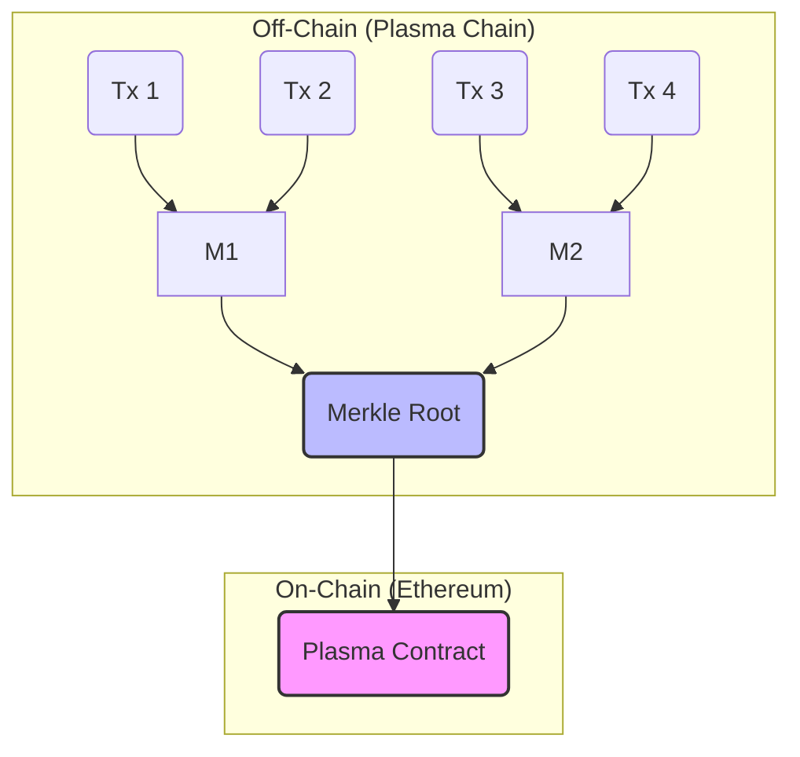
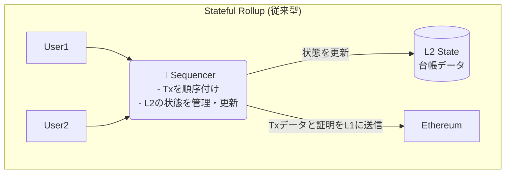
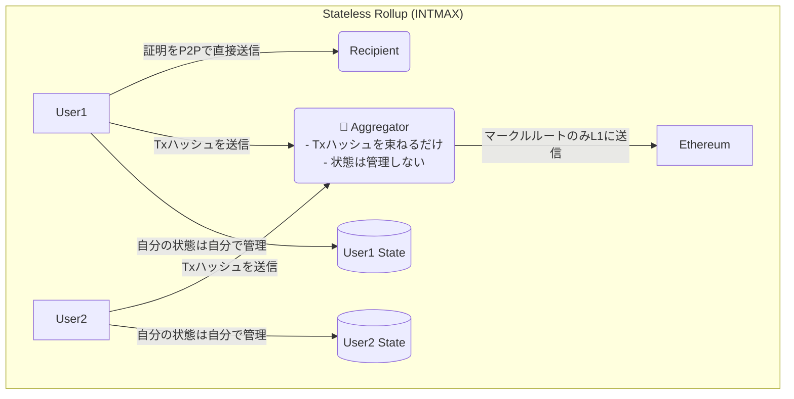
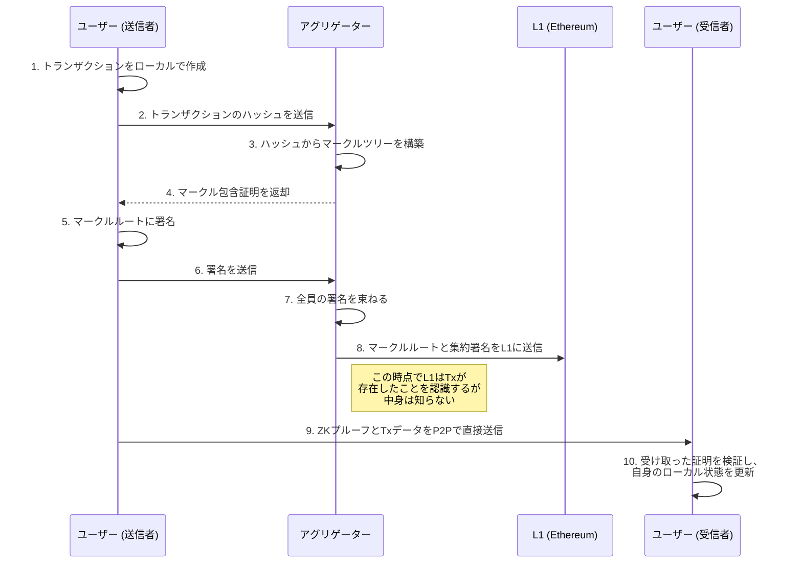
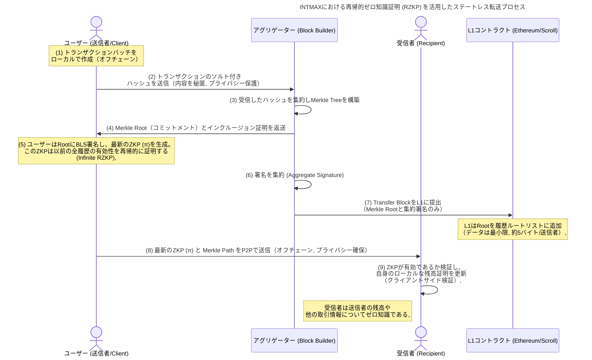

## はじめに

かつて、イーサリアムは夢のスマートコントラクト・プラットフォームとして輝かしいデビューを飾りました。

当初は画期的なアイディアに多くの人が感化され、利用する人が増えていきましたが利用者が増えるほどにトランザクションは詰まってガス代は高騰するなどの問題が発生するようになりました。

この **「スケーリング問題」** を解決すべく、いくつか解決策が打ち出されました。

その一つが **レイヤー2（L2）** と呼ばれる技術群です。

中でも近年、絶大な支持を集めているのが **Rollup（ロールアップ）** です。

トランザクションをオフチェーンで実行し、その結果だけをイーサリアム本体（L1）に書き込むことで、スケーラビリティとセキュリティの両立を目指しました。

しかし、Rollupが主流となる少し前、もう一つの伝説的なスケーリング技術があったことを覚えているでしょうか？ それは **Plasma（プラズマ）** と呼ばれるものです。

イーサリアムの共同創設者であるVitalik Buterin氏自身も提唱したこの技術は、一時期、スケーリング問題の最終兵器として大きな期待を集めました。

> "Intmax is the next great thing, Intmax is the Plasma." - **Vitalik Buterin, Founder, Ethereum**

しかし、Plasmaは「データ可用性（DA）問題」などの複雑な課題を克服できず、そうこうしているうちにゼロ知識証明を活用した画期的な**zkRollup**が登場し業界の注目はそっちにシフトしていきました。

…でも**Plasma**は完全になくなったわけではありませんでしたs。

今回のテーマである**INTMAX**は、まさにそのPlasmaの魂を受け継ぎ、**zkRollup**の技術と融合させることで、全く新しい地平を切り拓こうとしています。

Vitalik氏やJustin Drake氏といったイーサリアム財団の重鎮たちが注目する理由もまさにここにあります！

https://intmax.io/

この記事では、INTMAXがどのようにしてPlasmaを"再発明"し、既存のL2が抱える課題を解決しようとしているのか、その革新的なアーキテクチャの心臓部に迫っていきます。

ぜひ最後まで読んでいってください！

## 第一章：Plasmaの栄光と挫折

INTMAXを理解するために、まずはPlasmaが何であり、なぜ一度は表舞台から姿を消したのかを振り返ってみましょう。

### Plasmaとは何だったのか？

Plasmaの基本思想は非常にシンプルです。

> **「本当に大事なことだけをL1（イーサリアム）に報告し、残りはオフチェーン（L1の外）でやろう」**

具体的には、大量のトランザクションをオフチェーンで処理し、その最終結果を証明する「マークルルート」という小さなデータだけをL1に刻みます。これにより、L1の負担を最小限に抑えつつ、絶大なスケーラビリティを実現しようとしました。

> **マークルツリー**とは
>
> データのハッシュ値を木構造（ツリー）に組織化したもの
> **データの整合性を効率的に検証できること**がマークルツリーの本質

> **マークルルート**とは
>
> 最終的に得られるマークルツリーの頂点のハッシュ値のこと



マークルツリーなどについてはユウキさんの記事が図解付きで分かりやすいです。

https://note.com/standenglish/n/n90e0b365214a

### なぜPlasmaはうまく実現しなかったのか？

Plasmaの最大の弱点、それが **「データ可用性（Data Availability）問題」** です。

オフチェーンで処理されるトランザクションデータは、誰が、どこで、どのように保持するのでしょうか？ 

もし、Plasmaチェーンを管理する悪意のあるオペレーターがこのデータを隠蔽してしまったら、ユーザーは自分の資産が正しく処理されたことを証明できず、資金を引き出すことさえできなくなってしまいます。

この問題を解決するために複雑な仕組み（Exit Gameなど）が考案されましたが、ユーザー体験は著しく悪化しました。結果として、よりシンプルで安全な**Rollup**（特に、全てのトランザクションデータをL1に書き込む**Optimistic Rollup**や**zkRollup**）がL2の主流となっていったのです。

現に今主流となっているL2のほとんどのがこのうちの2つのどちらかを使っています。  

https://ethereum.org/ja/developers/docs/scaling/optimistic-rollups/

https://ethereum.org/ja/developers/docs/scaling/zk-rollups/

特に**Optimistic Rollup**側については、複数のレイヤー2(L2)ブロックチェーンネットワークを統合するという**SuperChain**構想があり注目されています。

https://docs.optimism.io/app-developers/guides/superchain

**L2**の中でもトップクラスにされている**Base**もこの**Optimistic Rollup**を採用しています。

https://www.base.org/build

## 第二章：INTMAXの登場 - 「ステートレス」という革命

Plasmaが歴史の闇に消えようとしていたその時、INTMAXは全く新しいアプローチで蘇らせました。

そのキーワードが **「ステートレス（Stateless）」** です。

### ステートレス・アーキテクチャとは？

従来のRollup（Stateful Rollup）では、L2の「状態（State）」つまり「誰がどの資産をどれだけ持っているか」という最新の台帳を**シーケンサー**と呼ばれる中央集権的な管理者が保持・更新していました。

https://www.binance.com/ja/square/post/33380347523409



これに対し、INTMAXの**ステートレス・アーキテクチャ**では、L2全体で共有する単一の状態（台帳）が存在しません。

代わりに、**各ユーザーが自分自身の状態（残高など）をクライアントサイド（自分のデバイス）で管理**します。



驚くべきことに、INTMAXではトランザクションを束ねる **アグリゲーター（Aggregator）** でさえ、誰が誰にいくら送ったのかというトランザクションの中身を一切知りません。

彼らの仕事は、ユーザーから送られてきたトランザクションの「ハッシュ値」を単純に集めて、マークルツリーを構築し、そのルートをL1に報告するだけ。

**まさに「ステートレスなデータバンドラー」なのです**。

これにより、ファウンダーの[leo_hio](https://x.com/leo_hio)さんが言う以下のような革命的な利点が得られることになります。

1.  **驚異的なスケーラビリティ**:   
    L1に書き込むデータは、トランザクション数に関わらず、参加した**送信者の数に応じた約5バイト**という極小サイズ。これにより、EIP-4844適用後には**320,000 TPS**以上という、他のL2を圧倒する理論値を叩き出します。
2.  **デフォルトでのプライバシー**:   
    トランザクションの中身（送金先、金額）はL1にもアグリゲーターにも渡りません。データは送信者と受信者の間でのみP2Pで直接共有されます。プライバシーはオプションではなく、標準機能なのです。
3.  **検閲耐性とパーミッションレス性**:   
    アグリゲーターはトランザクションの中身を知らないため、特定の取引を検閲することができません。また、誰でもアグリゲーターになることができるため、中央集権的な単一障害点が存在しません。

### Plasmaの課題をどう克服したか？

では、INTMAXはこのアーキテクチャでPlasmaの「データ可用性問題」をどう解決したのでしょうか？

答えは、**ゼロ知識証明（ZKP）**と**クライアントサイド・ストレージ**の組み合わせにあります。

:::message
これまでほとんどのプロジェクトでは、演算の負荷をほぼ全てサーバー側で行うアプローチでしたが、INTMAXではその一部をクライアント側も担当するようにして負荷分散しています。
:::

- **データの保持**: 
    トランザクションのデータそのものは、送信者と受信者がP2Pで直接交換します。
- **正当性の証明**: 
    送信者は、自分が正当な残高を持っていることを証明するZKプルーフを生成し、トランザクションデータと共に受信者に渡します。
- **L1による保証**: 
    L1には、どのトランザクションが含まれているかを示すマークルルートが記録されています。受信者は、受け取ったデータとZKプルーフ、そしてL1上のマークルルートを照合することで、その取引が正当なものであることを誰にも頼ることなく検証できます。

つまり、悪意のあるオペレーターがデータを隠蔽しようとしても、ユーザーは自分の手元にある証明を使って資産の所有権を主張できるのです。これは、Plasmaが目指した理想を、より洗練された形で実現した姿と言えるでしょう。

## 第三章：INTMAXアーキテクチャ

次にINTMAXのトランザクションがどのように処理されるのかを解説していきます！

### 登場人物

- **ユーザー (Users)**: 
    トランザクション送信元。自分自身の状態を管理し、トランザクションを生成します。
- **アグリゲーター (Aggregators)**:   
    トランザクションのハッシュを束ねる伝書鳩。中身は知りません。
- **受信者 (Recipients)**:   
    ユーザーからZKプルーフとデータを直接受け取り、自身の状態を更新します。

### トランザクションのライフサイクル



この流れを見れば、いかにデータがオフチェーン、特にユーザー間で完結しているかがわかるでしょう。

L1はあくまで「公証役場」として機能し、アグリゲーターは「書類を束ねる事務員」に過ぎません。

**真の主役は、自らのデータを主権的に管理するユーザー自身なのです**。

プライバシーを重視するファウンダーの思想が強く反映されてますね！

### 再帰的ゼロ知識証明（Recursive ZK-proofs）

もう少しだけ技術を深く掘り下げようと思います。

**INTMAX**を支える重要な技術として **再帰的ゼロ知識証明（Recursive ZK-proofs）** と呼ばれるものがあります。

再帰的ZKPは、**あるZKPが他のZKPの有効性を証明する**という仕組みです。



長期署名に似ていますね。

https://www.jnsa.org/result/e-signature/2023/2023-002.pdf

再帰的ゼロ知識証明を使って一回のZKPの検証だけで過去の取引履歴の整合性を検証できるようにしている点がものすごく良く考えられています。

INTMAXは、冒頭に少し紹介した**ゼロ知識証明**に加えて**ハッシュ値やマークルツリーの仕組みをとても上手に活用している**アーキテクチャであることが分かると思います！！

このようなアプローチは他にL2ではみられません。

## 第四章：INTMAXが拓く未来

INTMAXは私たちの生活に今後どのように影響してくるのでしょうか？

公式ドキュメント等でも触れられていますが、以下のような場面での利用が想定されます！

- **真のマイクロペイメント**:   
    1円以下の決済が、ガス代を気にすることなく、プライバシーを守りながら可能になります。コンテンツの秒単位課金、IoTデバイス間の自動決済など、これまで夢物語だったユースケースが現実のものとなります。
- **プライベートなB2B決済**:   
    企業間の取引情報をブロックチェーンに載せることなく、高速かつ低コストな決済が実現します。
- **検閲耐性のある送金**:   
    いかなる中央集権的な主体にも取引を止められることのない、真に自由な価値交換が可能になります。

INTMAXはすでに、誰でも使えるウォレット`INTMAX Wallet`や、ネイティブトークン`ITX`を獲得できる`Privacy Mining`など、エコシステムの構築も進めています。

https://wallet.intmax.io/ja

https://docs.network.intmax.io/user-guides/privacy-mining

## ハンズオン！ Block Builderを動かしてみた！

理論を学んだところで、いざ実践！

以下のドキュメントを参考に**INTMAX**の**Block Builder**を動かしてみました！

https://docs.network.intmax.io/developers-hub/intmax-block-builder

### Block Builderとは？

**他のブロックチェーンにおけるバリデーター（検証者）に相当する役割を果たすノードのことです**。

INTMAXは、従来のZK-Rollupとは根本的に異なるステートレスなZK-Rollupアーキテクチャを採用しているため、Block Builderの役割も従来のブロックチェーンノードとは大きく異なります！

#### Block Builderの主な役割と特徴

Block Builderは、ユーザーから送信されたトランザクションの集約とL1へのコミットメント投稿を担当しますが、トランザクションの内容やグローバルな状態（ステート）を保持する必要がありません！

- **トランザクションの集約とブロックの作成**
    - ユーザーから送信されたトランザクションハッシュのコミットメントを受信します。
    - これらのハッシュを集約してMerkleツリーを構築し、Merkleルート（コミットメント）を生成します。
    - その後、集約したユーザーの署名とMerkleルートなどを含む **転送ブロック（Transfer Block）** を作成します。
- **L1へのコミットメントの提出**
    - 作成した転送ブロックをL1のロールアップコントラクトに送信し、ネットワークの状態を更新します。
- **パーミッションレス（許可不要）でステートレス**
    - Block Builderの役割は完全にトラストレスかつ許可不要であり、誰でもノードを立ち上げて参加できます。

ステートレスなアーキテクチャなので、他のノードとの同期は必要なく、ノードの負荷が極めて小さくなります(ラズパイのような低スペックな環境でも動かせる！！)。

加えてデータ永続的なストレージを必要としないので検閲耐性が高いソリューションを実現しています。

### セットアップ

まずはセットアップを行います！

セットアップ用のシェルスクリプトがあるのでまずはそれをダウンロードしてきます！

今回はテストネット用のものを使ってみました！

```bash
curl -o builder.sh https://raw.githubusercontent.com/InternetMaximalism/intmax2/refs/heads/main/scripts/block-builder-testnet.sh
chmod +x builder.sh
```

https://github.com/mashharuki/IntmaxRepo/blob/main/docs/blockbuilder/builder.sh

以下で動くことを確認！

```bash
./builder.sh help
```

ヘルプコマンドが実行できればOKです！

```bash
Commands:
  setup        - Create frpc.toml, nginx.conf, docker-compose.yml, and .env with unique UUID
  setup-env    - Configure L2_RPC_URL and private key (unified environment setup)
  verify-env   - Verify L2_RPC_URL and private key configuration
  check        - Check if config files exist and show content
  run          - Start Docker Stack with Nginx proxy
  stop         - Stop all Docker Stack services
  health       - Check health of the Block Builder service
  monitor      - Monitor Docker Stack services status and logs
  update       - Download and install the latest version of this script
  docker-clean - Remove all Docker containers, images, secrets, and networks related to this setup
  clean        - Remove all configuration files with Docker cleanup
  version      - Show version information

Quick start workflow:
  1. ./builder.sh setup      # Create initial configuration files
  2. ./builder.sh setup-env  # Configure L2_RPC_URL and private key
  3. ./builder.sh check      # Verify all configurations
  4. ./builder.sh run        # Start the services
  5. ./builder.sh health     # Check the health status of the services
  6. ./builder.sh monitor    # Monitor running services

Maintenance:
  ./builder.sh stop          # Stop services
  ./builder.sh update        # Update to latest version
  ./builder.sh clean         # Complete cleanup
```

### 設定ファイルを生成する

ダウンロードしてきたシェルスクリプトで初期セットアップを行います！

```bash
./builder.sh setup
```

するともろもろ設定ファイルが生成されます！

- **docker-compose.yaml**
  ::::details docker-compose.yamlの詳細
  ```yaml
  services:
    nginx-proxy-testnet:
      image: nginx:alpine
      ports:
        - "3000:3000"
      volumes:
        - ./nginx.conf:/etc/nginx/nginx.conf:ro
      networks:
        - builder-network-testnet
      tmpfs:
        - /var/cache/nginx
        - /var/run
        - /tmp
      logging:
        driver: "json-file"
        options:
          max-size: "10m"
          max-file: "3"

    block-builder-testnet:
      image: ghcr.io/internetmaximalism/intmax2:0.1.33-arm64
      command:
        [
          "export BLOCK_BUILDER_PRIVATE_KEY=$$(cat /run/secrets/block_builder_private_key_testnet | tr -d '\n') && exec /app/block-builder",
        ]
      env_file:
        - .env.testnet
      environment:
        - PORT=8080
        - BLOCK_BUILDER_URL=https://stage.proxy.builder.intmax.io/<ここは固有値>
      secrets:
        - block_builder_private_key_testnet
      networks:
        - builder-network-testnet
      healthcheck:
        disable: true
      logging:
        driver: "json-file"
        options:
          max-size: "10m"
          max-file: "3"

    frp-client-testnet:
      image: snowdreamtech/frpc:latest
      volumes:
        - ./frpc.toml:/etc/frp/frpc.toml:ro
      networks:
        - builder-network-testnet
      logging:
        driver: "json-file"
        options:
          max-size: "10m"
          max-file: "3"

  networks:
    builder-network-testnet:
      driver: overlay
      attachable: true

  secrets:
    block_builder_private_key_testnet:
      external: true
  ```
  ::::

- **frpc.toml**

  ::::details frpc.tomlの詳細

  ```toml
  serverAddr = "stage.proxy.builder.intmax.io"
  serverPort = 7000
  auth.token = "<ここは固有値>"

  [[proxies]]
  name = "<ここは固有値>-block-builder"
  type = "http"
  localIP = "nginx-proxy-testnet"
  localPort = 3000
  customDomains = ["stage.proxy.builder.intmax.io"]
  locations = ["/<ここは固有値>"]
  ```

  ::::

- **nginx.conf**

  ::::details nginx.confの詳細
  ```conf
  events {
      worker_connections 1024;
  }
  http {
      upstream block_builder_testnet {
          server block-builder-testnet:8080;
      }
      server {
          listen 3000;
          location ~ "^/([^/]+)(/.*)$" {
              proxy_pass http://block_builder_testnet$2;
              proxy_set_header Host $host;
              proxy_set_header X-Real-IP $remote_addr;
              proxy_set_header X-Forwarded-For $proxy_add_x_forwarded_for;
              proxy_set_header X-Namespace $1;
          }
          location / {
              return 404;
          }
      }
  }
  ```
  ::::


### swarm init コマンド実行

生成されたDocker Composeファイルを使ってコンテナを起動します。

```bash
docker swarm init
```

```bash
Swarm initialized: current node (3ryn4c1bx6c6116qr5q0i0ixo) is now a manager.
```

### 環境変数用の設定ファイルを生成

```bash
./builder.sh setup-env
```

ちゃんと環境変数が設定されたかは以下のコマンドでチェックできます！

```bash
./builder.sh verify-env
```

### 最終チェック

環境変数のセットアップもできたら以下のコマンドを実行します！

```bash
./builder.sh check
```

以下の通り表示されればOKです!

```bash
🎉 All checks passed! Your configuration is ready:
   ✅ Configuration files exist
   ✅ L2 RPC URL is configured and accessible
   ✅ Network configuration is correct
   ✅ Private key is configured

💡 Next step: ./builder.sh run
```

### Block Builder 起動

それではいよいよ**Block Builder**を起動してみます。

以下のコマンドを実行してみます。

```bash
./builder.sh run
```

以下の通りになればOKです!

```bash
Creating network block-builder-stack-testnet_builder-network-testnet
Creating service block-builder-stack-testnet_block-builder-testnet
Creating service block-builder-stack-testnet_frp-client-testnet
Creating service block-builder-stack-testnet_nginx-proxy-testnet
✅ Started successfully as Docker Stack

💡 To check health, run: ./builder.sh health
💡 To monitor the services, run: ./builder.sh monitor
```

以下のようなコンテナが起動しているはずです！！

```bash
CONTAINER ID   IMAGE                                             COMMAND                  CREATED          STATUS          PORTS     NAMES
08102e225a98   nginx:alpine                                      "/docker-entrypoint.…"   21 seconds ago   Up 20 seconds   80/tcp    block-builder-stack-testnet_nginx-proxy-testnet.1.z03bidepf0nwpnun7427xryag
496f2c681f06   snowdreamtech/frpc:latest                         "/usr/bin/frpc -c /e…"   25 seconds ago   Up 24 seconds             block-builder-stack-testnet_frp-client-testnet.1.35klexbg4sdhld7dfyw5943et
5afd44de4d83   ghcr.io/internetmaximalism/intmax2:0.1.33-arm64   "/bin/sh -c 'export …"   27 seconds ago   Up 26 seconds             block-builder-stack-testnet_block-builder-testnet.1.za5ai2vc44y9hpzfyk341ybg3
```

### ヘルスチェック

ヘルスチェックコマンドも実行してみます。

```bash
./builder.sh health
```

以下のようになればOKです！

```bash
🩺 Testing your block builder health...
🔗 Block Builder URL: https://stage.proxy.builder.intmax.io/<ここは固有値>
🩺 Testing endpoints...

1️⃣ Testing health-check endpoint...
   URL: https://stage.proxy.builder.intmax.io/<ここは固有値>/health-check
   ✅ Health check passed (HTTP 200, 1s)
   📄 Response:
      {
        "name": "block-builder",
        "version": "0.1.33"
      }

2️⃣ Testing fee-info endpoint...
   URL: https://stage.proxy.builder.intmax.io/<ここは固有値>/fee-info
   ✅ Fee info endpoint passed (HTTP 200, 1s)
   📄 Fee Information:
      {
        "version": "0.1.33",
        "blockBuilderAddress": "0x51908f598a5e0d8f1a3babfa6df76f9704dad072",
        "beneficiary": "T6foGVBypeTVc1nCM479pb7CeT6Rb2bp1L8EVCeQR8oeLQtYhwcLRSB7ZFpkhMAxu4AqMq8udoTm84Q2qxeihoqGP8imFdm",
        "registrationFee": [
          {
            "token_index": 0,
            "amount": "2500000000000"
          }
        ],
        "nonRegistrationFee": [
          {
            "token_index": 0,
            "amount": "2000000000000"
          }
        ],
        "registrationCollateralFee": null,
        "nonRegistrationCollateralFee": null
      }

3️⃣ Testing indexer registration endpoint...
   URL: https://stage.api.indexer.intmax.io/v1/indexer/builders/registration/0x51908f598a5e0d8f1a3babfa6df76f9704dad072
   📍 Block Builder Address: 0x51908f598a5e0d8f1a3babfa6df76f9704dad072
   ✅ Indexer registration endpoint passed (HTTP 200, 0s)
   📄 Registration Information:
      {
        "registered": false,
        "ready": false
      }

🎉 Your block builder is healthy and all endpoints are accessible!

🏗️  Block Builder Address: 0x51908f598a5e0d8f1a3babfa6df76f9704dad072

📋 Endpoint Summary:
   ✅ Health Check: https://stage.proxy.builder.intmax.io/<ここは固有値>/health-check
   ✅ Fee Info: https://stage.proxy.builder.intmax.io/<ここは固有値>/fee-info
   ✅ Indexer Registration: https://stage.api.indexer.intmax.io/v1/indexer/builders/registration/0x51908f598a5e0d8f1a3babfa6df76f9704dad072
```

### モニタリング

```bash
./builder.sh monitor
```

以下のようになっていれば OK!

```bash
🐳 Checking Docker status...
📊 Monitoring Docker Stack 'block-builder-stack-testnet'...

🔍 Stack Services:
ID             NAME                                                MODE         REPLICAS   IMAGE                                             PORTS
8np2jy7r7oqj   block-builder-stack-testnet_block-builder-testnet   replicated   1/1        ghcr.io/internetmaximalism/intmax2:0.1.33-arm64
60fqwozp831v   block-builder-stack-testnet_frp-client-testnet      replicated   1/1        snowdreamtech/frpc:latest
n3vwa3hnb9l7   block-builder-stack-testnet_nginx-proxy-testnet     replicated   1/1        nginx:alpine                                      *:3000->3000/tcp

💻 Container Processes:
--- block-builder-stack-testnet_block-builder-testnet ---
ID             NAME                                                  IMAGE                                             NODE             DESIRED STATE   CURRENT STATE           ERROR     PORTS
za5ai2vc44y9   block-builder-stack-testnet_block-builder-testnet.1   ghcr.io/internetmaximalism/intmax2:0.1.33-arm64   docker-desktop   Running         Running 2 minutes ago

--- block-builder-stack-testnet_frp-client-testnet ---
ID             NAME                                               IMAGE                       NODE             DESIRED STATE   CURRENT STATE           ERROR     PORTS
35klexbg4sdh   block-builder-stack-testnet_frp-client-testnet.1   snowdreamtech/frpc:latest   docker-desktop   Running         Running 2 minutes ago

--- block-builder-stack-testnet_nginx-proxy-testnet ---
ID             NAME                                                IMAGE          NODE             DESIRED STATE   CURRENT STATE           ERROR     PORTS
z03bidepf0nw   block-builder-stack-testnet_nginx-proxy-testnet.1   nginx:alpine   docker-desktop   Running         Running 2 minutes ago

📝 Recent Logs (last 5 lines):
--- block-builder logs ---
block-builder-stack-testnet_block-builder-testnet.1.za5ai2vc44y9@docker-desktop    | {"timestamp":"2025-09-23T13:29:28.519080Z","level":"INFO","fields":{"message":"new"},"span":{"http.client_ip":"10.0.1.4","http.flavor":"HTTP/1.0","http.host":"stage.proxy.builder.intmax.io","http.method":"GET","http.route":"/fee-info","http.scheme":"http","http.user_agent":"curl/8.6.0","otel.kind":"server","otel.name":"GET /fee-info","request_id":"bba73aee-f399-429a-b9b3-1bf50682199c","name":"http-request"},"spans":[]}
block-builder-stack-testnet_block-builder-testnet.1.za5ai2vc44y9@docker-desktop    | {"timestamp":"2025-09-23T13:29:28.519343Z","level":"INFO","fields":{"message":"check_balance","log.target":"block_builder::app::block_builder","log.module_path":"block_builder::app::block_builder","log.file":"block-builder/src/app/block_builder.rs","log.line":243},"span":{"http.client_ip":"10.0.1.4","http.flavor":"HTTP/1.0","http.host":"stage.proxy.builder.intmax.io","http.method":"GET","http.route":"/fee-info","http.scheme":"http","http.user_agent":"curl/8.6.0","otel.kind":"server","otel.name":"GET /fee-info","request_id":"bba73aee-f399-429a-b9b3-1bf50682199c","name":"http-request"},"spans":[{"http.client_ip":"10.0.1.4","http.flavor":"HTTP/1.0","http.host":"stage.proxy.builder.intmax.io","http.method":"GET","http.route":"/fee-info","http.scheme":"http","http.user_agent":"curl/8.6.0","otel.kind":"server","otel.name":"GET /fee-info","request_id":"bba73aee-f399-429a-b9b3-1bf50682199c","name":"http-request"}]}
block-builder-stack-testnet_block-builder-testnet.1.za5ai2vc44y9@docker-desktop    | {"timestamp":"2025-09-23T13:29:29.183912Z","level":"INFO","fields":{"message":"block builder balance: 106319668723955262421","log.target":"block_builder::app::block_builder","log.module_path":"block_builder::app::block_builder","log.file":"block-builder/src/app/block_builder.rs","log.line":252},"span":{"http.client_ip":"10.0.1.4","http.flavor":"HTTP/1.0","http.host":"stage.proxy.builder.intmax.io","http.method":"GET","http.route":"/fee-info","http.scheme":"http","http.user_agent":"curl/8.6.0","otel.kind":"server","otel.name":"GET /fee-info","request_id":"bba73aee-f399-429a-b9b3-1bf50682199c","name":"http-request"},"spans":[{"http.client_ip":"10.0.1.4","http.flavor":"HTTP/1.0","http.host":"stage.proxy.builder.intmax.io","http.method":"GET","http.route":"/fee-info","http.scheme":"http","http.user_agent":"curl/8.6.0","otel.kind":"server","otel.name":"GET /fee-info","request_id":"bba73aee-f399-429a-b9b3-1bf50682199c","name":"http-request"}]}
block-builder-stack-testnet_block-builder-testnet.1.za5ai2vc44y9@docker-desktop    | {"timestamp":"2025-09-23T13:29:29.184196Z","level":"INFO","fields":{"message":"request-end"},"span":{"http.client_ip":"10.0.1.4","http.flavor":"HTTP/1.0","http.host":"stage.proxy.builder.intmax.io","http.method":"GET","http.route":"/fee-info","http.scheme":"http","http.user_agent":"curl/8.6.0","latency":"665.209ms","otel.kind":"server","otel.name":"GET /fee-info","request_id":"bba73aee-f399-429a-b9b3-1bf50682199c","status_code":200,"name":"http-request"},"spans":[{"http.client_ip":"10.0.1.4","http.flavor":"HTTP/1.0","http.host":"stage.proxy.builder.intmax.io","http.method":"GET","http.route":"/fee-info","http.scheme":"http","http.user_agent":"curl/8.6.0","latency":"665.209ms","otel.kind":"server","otel.name":"GET /fee-info","request_id":"bba73aee-f399-429a-b9b3-1bf50682199c","status_code":200,"name":"http-request"}]}
block-builder-stack-testnet_block-builder-testnet.1.za5ai2vc44y9@docker-desktop    | {"timestamp":"2025-09-23T13:29:29.184264Z","level":"INFO","fields":{"message":"close","time.busy":"5.38ms","time.idle":"660ms"},"span":{"http.client_ip":"10.0.1.4","http.flavor":"HTTP/1.0","http.host":"stage.proxy.builder.intmax.io","http.method":"GET","http.route":"/fee-info","http.scheme":"http","http.user_agent":"curl/8.6.0","latency":"665.209ms","otel.kind":"server","otel.name":"GET /fee-info","request_id":"bba73aee-f399-429a-b9b3-1bf50682199c","status_code":200,"name":"http-request"},"spans":[]}

--- nginx-proxy logs ---
block-builder-stack-testnet_nginx-proxy-testnet.1.z03bidepf0nw@docker-desktop    | /docker-entrypoint.sh: Launching /docker-entrypoint.d/20-envsubst-on-templates.sh
block-builder-stack-testnet_nginx-proxy-testnet.1.z03bidepf0nw@docker-desktop    | /docker-entrypoint.sh: Launching /docker-entrypoint.d/30-tune-worker-processes.sh
block-builder-stack-testnet_nginx-proxy-testnet.1.z03bidepf0nw@docker-desktop    | /docker-entrypoint.sh: Configuration complete; ready for start up
block-builder-stack-testnet_nginx-proxy-testnet.1.z03bidepf0nw@docker-desktop    | 10.0.1.4 - - [23/Sep/2025:13:29:27 +0000] "GET /<ここは固有値>/health-check HTTP/1.1" 200 43 "-" "curl/8.6.0"
block-builder-stack-testnet_nginx-proxy-testnet.1.z03bidepf0nw@docker-desktop    | 10.0.1.4 - - [23/Sep/2025:13:29:29 +0000] "GET /<ここは固有値>/fee-info HTTP/1.1" 200 397 "-" "curl/8.6.0"

--- frp-client logs ---
block-builder-stack-testnet_frp-client-testnet.1.35klexbg4sdh@docker-desktop    | 2025-09-23 13:28:41.185 [I] [sub/root.go:149] start frpc service for config file [/etc/frp/frpc.toml]
block-builder-stack-testnet_frp-client-testnet.1.35klexbg4sdh@docker-desktop    | 2025-09-23 13:28:41.185 [I] [client/service.go:319] try to connect to server...
block-builder-stack-testnet_frp-client-testnet.1.35klexbg4sdh@docker-desktop    | 2025-09-23 13:28:41.612 [I] [client/service.go:311] [e7410396f5a510c7] login to server success, get run id [e7410396f5a510c7]
block-builder-stack-testnet_frp-client-testnet.1.35klexbg4sdh@docker-desktop    | 2025-09-23 13:28:41.612 [I] [proxy/proxy_manager.go:177] [e7410396f5a510c7] proxy added: [<ここは固有値>-block-builder]
block-builder-stack-testnet_frp-client-testnet.1.35klexbg4sdh@docker-desktop    | 2025-09-23 13:28:41.747 [I] [client/control.go:172] [e7410396f5a510c7] [<ここは固有値>-block-builder] start proxy success

🌐 Health Check:
Testing: https://stage.proxy.builder.intmax.io/<ここは固有値>/health-check
✅ Health check passed

💡 Commands:
   View live logs: docker service logs -f builder-stack_block-builder
   Restart service: ./builder.sh run
   Health check: ./builder.sh health
   Stop all: ./builder.sh stop
```

シェルスクリプトがかなり丁寧に作られているので、こんな感じで簡単に動かすことができます！！

## まとめ

INTMAXの物語は、単なる新しいL2プロジェクトの紹介ではありません。それは、一度は「失敗した」と見なされたアイデアが、異なる技術（zkRollup）と出会い、その核心的な思想を昇華させることで、時代が求める全く新しい価値を生み出すという、技術進化の美しいプロセスそのものです。

Plasmaが描いた「究極のスケーラビリティ」という夢。INTMAXは、そこに「ステートレス」と「プライバシー」という現代的な解釈を加え、見事に再発明してみせました。

私たちが今日目撃しているのは、イーサリアムの歴史の新たな一ページかもしれません。さあ、開発者の皆さん、この新しい世界で何を作りますか？

https://intmax.io/ecosystem/plasma-free

ここまで読んでいただきありがとうございました！

## 参考資料
- [INTMAX 公式サイト](https://intmax.io/)
- [INTMAX Developer Hub](https://docs.network.intmax.io/developers-hub/)
- [INTMAX 開発者ドキュメント](https://docs.network.intmax.io/)
- [INTMAX Client SDK](https://github.com/InternetMaximalism/intmax2-client-sdk)
- [INTMAX ホワイトペーパー](https://eprint.iacr.org/2023/1082.pdf)
- [INTMAX App](https://app.intmax.io/)
- [INTMAX ユーザーガイド](https://docs.network.intmax.io/user-guides)
- [GitHub INTMAX](https://github.com/InternetMaximalism)
- [Block Builder Full Network](https://docs.network.intmax.io/developers-hub/intmax-block-builder/full-netwrok)
