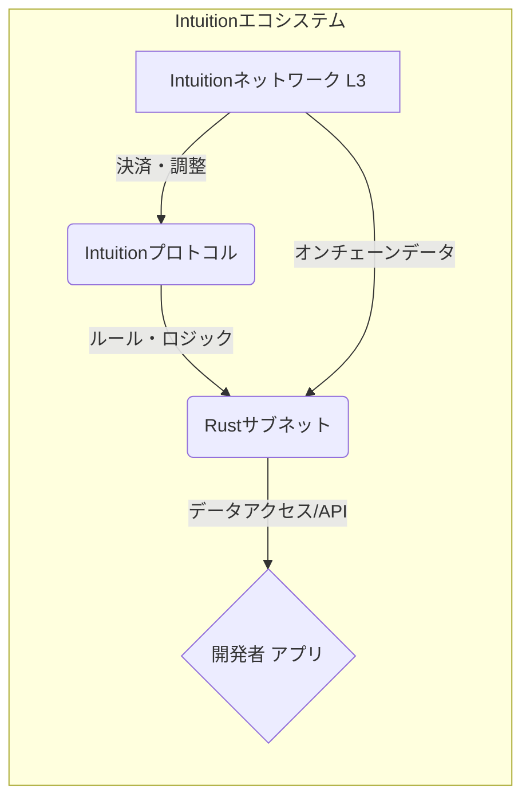
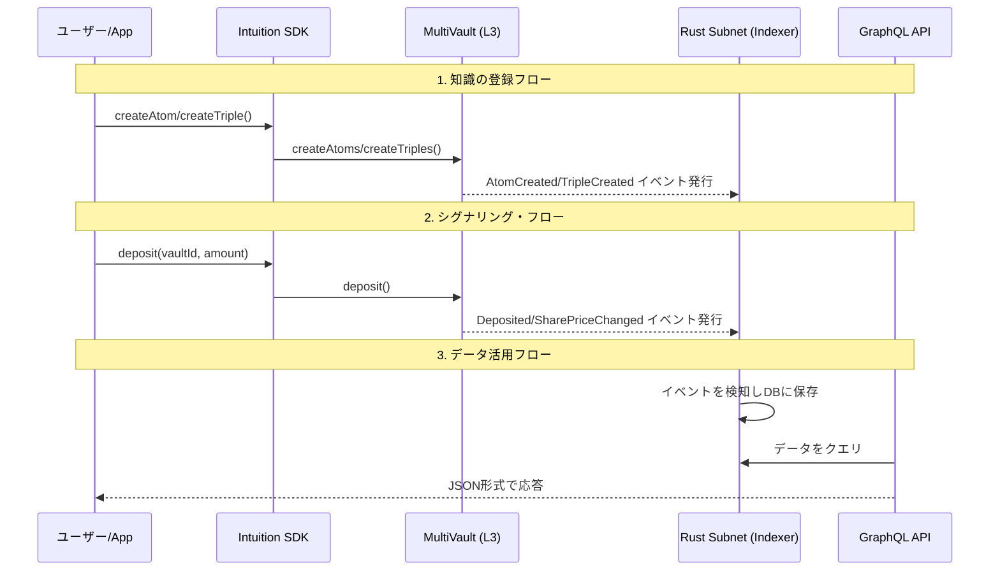

## 1. はじめに

今回の記事では最近**Web3✖︎AI**の文脈で注目されている**Intuition**というプロジェクトを取り上げます！

非常に面白い取り組みをしているプロジェクトなのでぜひ最後まで読んでいってください！

---

現代のインターネットはデジタルアイデンティティの断片化そして中央集権的なプラットフォームがもたらす **「信頼のパラドックス」** という根深い課題を抱えています。

私たちのオンライン上の評判や人間関係は、**情報のサイロ化**によってサービスごとに分断され、一貫した信頼プロファイルを構築できていません。

> 情報のサイロ化とは？
> 
> 情報が特定のシステムやサービス内に孤立し、外部からアクセス・連携することが困難な状態

AmazonやGoogleのような巨大プラットフォームはそのアルゴリズムやデータをブラックボックス化し、私たちは知らず知らずのうちに検閲や情報操作のリスクに晒されています。

Xとか見ていると特にそう感じます(サイレントでアルゴリズムが変わっている...)。

**「コードは法である」** という分散型システムの理想も**究極的には人間による社会的合意に依存する**という矛盾を内包しています。

こうした課題を解決すべく、全く新しいアプローチで「信頼」そのものを再定義しようとするプロジェクト、それが**Intuition**です！

https://www.intuition.systems/

本記事では、この壮大なビジョンを持つ分散型信頼レイヤーについてその思想的背景から技術的仕組みそして未来の可能性までを徹底的に解説します。

### この記事で得られること

:::message
- **Intuition**が解決しようとしている課題とその革新的なビジョン
- **Intuition**を支えるL3アーキテクチャと3つのコア・プリミティブの技術的詳細
- **$TRUST**トークンを中心とした、信頼を形成するための暗号経済モデル
- AIエージェント経済における**Intuition**の役割と具体的なユースケース
- **Intuition**エコシステムでの開発を始めるための第一歩
:::

## 2. Intuitionの思想：情報金融と真実のフラクタルプリズム

**Intuition**は単なるプロトコルではありません。

私たちがデジタル空間で情報をどう扱い、価値をどう見出すかという根本的なパラダイムシフトを提案する思想そのものです。

### 2.1. ビジョン：「信頼のインターネット」の構築

Intuitionの究極の目標は、誰もが検証可能なデータを簡単に作成・管理・利用できる **「信頼のインターネット」** を構築することです。

これにより、ユーザーは自身の好みや信頼グラフ、評判をウェブ全体で自由に持ち運び特定のプラットフォームに縛られることなく、一貫したデジタル・アイデンティティを確立できます。

### 2.2. 情報金融（InfoFi）とは

このビジョンの中核をなすのが **「情報金融（InfoFi / Information Finance）」** という概念です。

これは、**情報そのものを構造化され、検証可能でプログラム可能な第一級のオンチェーン資産**として扱う考え方です。

データはもはやプラットフォームに搾取される商品ではなく、ユーザーが所有し、形成し、収益化できる **「動的な資本」** となります。

あなたが提供した役立つ情報や、その正しさを証明する「表明（**アテステーション**）」が、経済的な価値を持つようになるのです。

> アテステーションとは？
> 
> あるエンティティが別のエンティティについて行うデジタル署名された『表明』や『証明』のこと

### 2.3. AIエージェント経済の基盤へ

AIエージェントの数が今後ますます増加していくこれからのインターネットにこの信頼レイヤーは不可欠なインフラとなります。

自律的に活動するAIエージェント同士が互いのアイデンティティ、能力、評判をオンチェーンで検証し、信頼に基づいて協調作業を行う。

Intuitionはそのような「**エージェント・スウォーム（群れ）**」が自律的に発見と協調を行うためのオープンで分散化された基盤の提供を目指しています。

> エージェント・スウォーム（群れ）とは？
> 
> 自律的に動作する多数のAIエージェントが、共通の目標を達成するために協調・連携する集合体

## 3. 技術アーキテクチャ：Intuitionを支える3つの柱

Intuitionは、スケーラビリティ、パフォーマンス、相互運用性を実現するために、専門的な3つのレイヤーで構成されています。

### 3.1. 全体像

### 3.2. 各レイヤーの詳細

| コンポーネント | 役割 | 特徴 |
| :--- | :--- | :--- |
| **Intuitionネットワーク** | 決済・調整レイヤー | **Base**上に構築された**Arbitrum Orbit**ベースのL3。 超高速（<1秒のファイナリティ）、超低コスト（<$0.001/tx）な取引環境を提供し、高頻度な知識グラフの操作を可能にします。 |
| **Intuitionプロトコル** | ルール・ロジックレイヤー | 知識の表現方法と収益化のルールを定義します。 DID、アトム、トリプルといったプリミティブやボンディングカーブを利用した情報市場の経済モデルを含みます。 |
| **Rustサブネット** | データアクセスレイヤー | オンチェーンデータをインデックス化し、開発者向けにリアルタイムAPI（GraphQL、TypeScript SDK）を提供する高性能なオフチェーンインフラです。 |

## 4. コア・プリミティブ：知識を構成する原子

Intuitionの**ナレッジグラフ**はセマンティック・ウェブの概念に触発された以下の基本要素（プリミティブ）によって構成されています。

> ナレッジグラフとは？
>
> 現実世界のエンティティとその関係性を機械が理解可能なグラフ構造で表現した知識ベース

> セマンティック・ウェブとは？
> 
> ウェブ上の情報に「意味」を付与し、コンピューターがその意味を理解・解釈できるようにする技術や構想のこと

### 4.1. アトム (Atoms)

人、概念、オブジェクトなど、あらゆるエンティティを表すデータの基本単位で、ナレッジグラフにおける **「単語」** に相当します。

各アトムは **分散型識別子（DID）** を持ち一意に識別されます。

アトムのIDはそのデータ内容から決定論的に（入力が同じなら常に同じ出力が得られるように）生成されるため、システム全体で重複なくエンティティを参照できます。

> DIDとは？
> 
> 中央集権的な管理者に依存しない、世界的に一意な新しいタイプの識別子。エンティティ自身がIDを管理できます

### 4.2. トリプル (Triples)

`[主語] - [述語] - [目的語]` の形式でアトム間の関係性を表現する構造化データでナレッジグラフにおける **「文」** の役割を果たします。

例えば `[Vitalik] - [founderOf] - [Ethereum]` のような事実を機械が読み取り可能な形で表現します。トリプル自体もアトムとして扱えるため、再帰的で複雑なデータ構造を構築できます。

### 4.3. シグナルとボールト (Signals and Vaults)

ユーザーがアトムやトリプルの妥当性や重要性に対する経済的な確信を表明するためのトークン化されたステークです。これは情報の信頼性を示す **「重み」** として機能します。

各アトムやトリプルには**ERC-4626**標準に類似した「ボールト（金庫）」があり、ユーザーはここに資産（$TRUSTなど）を預け入れ（デポジット）ます。

> ERC-4626とは？
> 
> あるトークンを保有しているときに報酬が受け取れるという標準規格。
> DeFi領域で注目されている。
> 
> 以下の技術ブログで詳細が解説されています。
> https://qiita.com/cardene/items/99db4ee3074ab6c8c4e2

トリプルには、主張を支持する「Positive Vault」と反対する「Negative Vault」の2種類が存在します。

### 4.4. ボンディングカーブ (Bonding Curves)

ボールトへのデポジットと引き出しの価格を動的に決定する**数学的曲線**です。  
これにより各情報に独自の市場が形成されます。

> 数学的曲線とは？
> 
> 入力量に応じて価格が変動するよう設計されたあらかじめ定義された関数に基づく曲線。スマートコントラクトで実装されトークン供給と価格の関係を規定します

需要が高まる（多くの人がステークする）ほど価格が上昇し、早期の支持者（ステーカー）にはより大きなリターンがもたらされる可能性があります。この仕組みが情報のキュレーションを金融的な投機活動へと昇華させ、価値ある情報の発見を促進します。

## 5. 暗号経済学：自律的な秩序を形成する$TRUSTトークン

Intuitionは中央集権的な管理者に頼ることなく、自律的な秩序と価値創造を促すために巧みな暗号経済学のメカニズムを導入しています。

### 5.1. ケインジアン・ビューティー・コンテスト

経済学者ケインズが提唱したこの原理を応用し、エンティティに対する正規の識別子（Canonical ID）への社会的コンセンサスを促します。

ユーザーは自分が個人的に好むものではなく、 **「他の誰もが採用するであろう」** 識別子を選択するようインセンティブ付けられます。これにより、自然発生的にデータの標準化が進みます。

### 5.2. $TRUSTトークンの4つの役割

`$TRUST`はIntuitionエコシステムのネイティブトークンであり以下の主要な機能を持っています。

| ユーティリティ | 説明 |
| :--- | :--- |
| **データ作成・キュレーション** | ナレッジグラフへのデータ追加手数料やアトム/トリプルのボールトにステークしてその妥当性を表明するために使用されます。 |
| **ガバナンス (veTRUST)** | `$TRUST`をロックすることで投票権エスクロー（ve）`$TRUST`を取得し、プロトコルのガバナンスへの参加権や報酬の分配先を決定する権利を得ます。 |
| **デリゲーション** | ネットワークを維持・保護するノードオペレーターに自身の`$TRUST`を委任（デリゲート）し、報酬の一部を受け取ることができます。 |
| **価値の獲得** | プロトコルの手数料、ステーキング利回り、データアクセス料など実際の利用から生まれる収益が`$TRUST`の価値を直接的に支えます。 |

### 5.3. 利用率（Utilization）メカニズム

Intuitionのステーキング報酬は単なるトークンのロックアップだけでは最大化されません。プロトコルへの積極的な貢献を測る **「利用率（Utilization）」** という指標が重要になります。

- **個人利用率**:   
    ユーザーが得た報酬に対し、どれだけの`$TRUST`を新たに知識グラフのボールトに再投資したかを測定するスコア。
- **システム利用率**:   
    ネットワーク全体で分配された総報酬に対し、どれだけの`$TRUST`が新たにプロトコルに再投資されたかを測定するスコア。

このメカニズムにより、トークンを保有するだけの「パッシブなステーカー」を避けナレッジグラフの成長に貢献する参加者に報酬が向かうように設計されています。

## 6. ユースケースと広がるエコシステム

Intuitionのビジョンは具体的なアプリケーションやパートナーシップを通じて現実のものとなりつつあります。

### 6.1. 具体的な応用例

- **評判スコア**:   
    個人やエンティティの文脈に応じた信頼性を評価する指標を構築。  
    DeFiにおけるクレジットスコアリングなどに応用。
- **Q&Aプラットフォーム**:   
    専門知識の表明とコミュニティによる回答の検証を通じて、信頼できる専門家を特定。
- **不正検出と検証**:   
    悪意のあるスマートコントラクトやウェブサイトを専門家コミュニティがフラグ付けし、ユーザーを保護。
- **オラクル**:   
    信頼できるアカウント群によってなされたオンチェーンの主張を他のスマートコントラactのトリガーとして利用。
- **検証可能な投票**:   
    DAOの提案投票などで検証済みIDを持つメンバーによる透明性の高い意思決定を実現。

### 6.2. 主要なパートナーシップ

- **AI主権アライアンス**:   
    **Billions**, **Recall**, **Lit Protocol**などのプロジェクトと連携し、AIエージェントのアイデンティティと信頼性の標準化を推進。
- **DappRadar**:   
    AgentRadarを共同開発し、エージェントの評判システムを構築。
- **Phala Network**:   
    PhalaのTEE（信頼できる実行環境）を活用し、データのプライバシーを保護しつつ、検証可能なクレーム生成を可能に。
- **Coral Protocol**:   
    Coralのエージェント・オーケストレーションレイヤーとIntuitionの信頼レイヤーを統合し、信頼性の高いエージェント間協調のための基盤を構築。

## 7. 開発者向けガイド：Intuitionでアプリを構築する方法

**Intuition**は開発者が信頼レイヤーの上にアプリケーションを構築するための包括的なツールセットを提供しています。

### 7.1. ツール選定

ツールとして以下の3つが提供されています。

| ツール | 主な役割 | ユースケース |
| :--- | :--- | :--- |
| **GraphQL API** | データの読み取り・解析 | 読み取り専用クエリ、データ視覚化、分析ダッシュボード、リアルタイム更新の購読。 |
| **TypeScript SDK** | アプリケーション開発 | Webアプリ、dAppでの書き込み操作（アトム/トリプル作成、デポジット）の抽象化。React Hooksとの統合。 |
| **スマートコントラクト** | 低レベルな直接操作 | 他のコントラクトとの連携、ガス代の最適化、カスタムロジックの実装。 |

ほとんどのWebアプリケーション開発では、**TypeScript SDK**と**GraphQL API**を組み合わせて使用することが推奨されます。

### 7.2. 代表的な機能の処理シーケンス図

ユーザーのアクションがどのように処理され、知識グラフが構築・活用されるかの流れを以下に示します。

### 7.3. 開発を始めるための第一歩

Intuitionは、開発者の参入障壁を下げるために「**Builder's Epoch**」のようなキャンペーンを積極的に開催しています。

https://medium.com/0xintuition/intuition-the-builders-epoch-72f367169c4b

AI支援ツールや「Vibe Coding」（自然言語でのアプリ記述）が奨励されており、初心者でもプロトタイプを作成しやすい環境が整いつつあります。

まずは公式ドキュメントを確認し、テストネットに参加して、シンプルなERC-20トークンやNFTをデプロイしてみることから始めるのが良いでしょう！

## 8. Intuitionの利点と今後の課題

### 8.1. 利点

- **分散化された信頼**:   
    中央集権的な仲介者なしに、情報の信頼性をボトムアップで構築できます。
- **データの主権と構成可能性**:   
    ユーザーは自身の評判やデータを所有し、あらゆるアプリケーションで再利用（コンポーズ）できます。
- **革新的な経済モデル**:   
    「情報金融」は、価値ある情報提供に直接的なインセンティブを与え、知識のキュレーションを促進します。
- **AIとの親和性**:   
    構造化され、検証可能なデータは、自律型AIエージェントが活動するための理想的な基盤となります。

### 8.2. 課題

- **ネットワーク効果の必要性**:   
    知識グラフの価値は、参加者とデータの量に大きく依存するため、初期のユーザーベースをいかに獲得するかが鍵となります。
- **経済モデルの複雑性**:   
    ボンディングカーブや利用率といった独自の経済メカニズムは強力ですが、一般ユーザーが直感的に理解するにはハードルが高い可能性があります。
- **社会的合意への最終的な依存**:   
    「トラスト・パラドックス」が示すように、プロトコルのアップグレードや危機対応など、最終的にはコミュニティによる主観的な意思決定（社会的合意）から逃れることはできません。

## 9. おわりに：信頼のインターネットの夜明け

Intuitionが描くのは単なる新しいブロックチェーンやdAppではありません。

私たちがデジタル世界と関わる方法そのものを変革する、野心的かつ壮大な試みです。

情報の信頼性が経済的な価値と結びつき、AIエージェントが自律的に協調する未来。その基盤となる「信頼のインターネット」は、今まさに構築され始めたばかりです！！

このプロジェクトは、 **Web3×AIの最前線に立つエンジニアにとって、知的好奇心を刺激する技術的な挑戦と次世代のデジタル社会を形作る大きな機会の両方を提供してくれる**でしょう！！

自分もさらに理解を深めるためにこの後チュートリアルにもチャレンジしてみようと思います(そこで得られた学びも技術ブログ化する予定です)！

ここまで読んでいただきありがとうございました！

## 参考文献
- [公式サイト](https://www.intuition.systems/)
- [開発者向けドキュメント](https://www.docs.intuition.systems/docs)
- [GitHub Intuition](https://github.com/0xintuition)
- [ブログ](https://medium.com/0xintuition/)