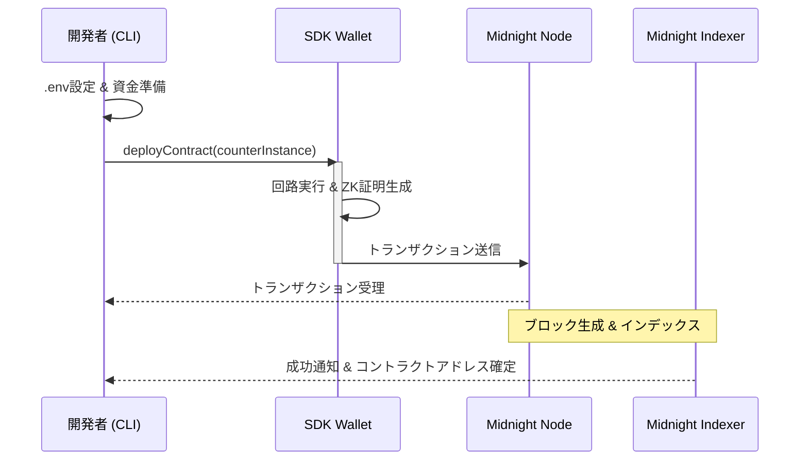
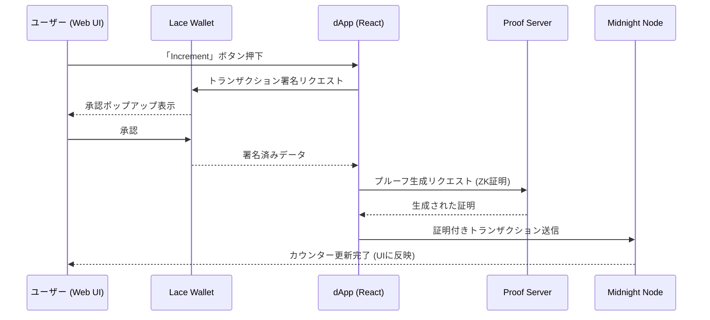

# はじめに

皆さん、こんにちは！

今回はプライバシー特化のブロックチェーンである**Midnight**がテーマの記事になります！

前回まではフロントエンドと**Lace Wallet**を接続する部分の実装の解説がメインでしたが、今回はいよいよスマートコントラクトとの接続にチャレンジしてみます！

ぜひ最後まで読んでいってください！

## この記事で学べること

- Midnight上で動くフルスタックアプリケーションの開発方法が学べます！
- フロントエンドからLace Wallet越しにスマートコントラクトの機能を呼び出す具体的なソースコードが学べます！
- ハマりどころが学べます！

# Midnight上で動くフルスタックアプリケーションを作ろう！

## 前提条件

サンプルコードを動かす前に以下のことが必要となります！

- [Lace Wallet](https://www.lace.io/) ブラウザ拡張機能（Midnight 対応版）をインストール済みであること
- Lace の設定で **PreProd** ネットワークが選択されていること
- [テストネット用のfaucetサイト](https://midnight-tmnight-preprod.nethermind.dev/)であらかじめ少額のテスト用**NIGHT**トークンを取得しておくこと
- スマートコントラクトはシンプルな**Counter**コントラクトを採用します

## サンプルコードのGitHubリポジトリ

https://github.com/mashharuki/midnight-sample-fullstack-app

## アプリの起動イメージ

今回はLace Walletを接続して残高表示とカウンターコントラクトの値と加算を行うという非常にシンプルなアプリです！


## アプリの機能一覧表

| カテゴリ | 機能名 | 説明 | 実行パッケージ |
| :--- | :--- | :--- | :--- |
| **Contract** | コントラクトビルド | Compactファイルをコンパイルし、WASM/ZKIR/Managed Codeを生成。 | `pkgs/contract` |
| **Contract** | シミュレータテスト | `CounterSimulator`を用いて、実ネットワークなしでロジックを検証。 | `pkgs/contract` |
| **CLI** | デプロイ | Standalone/TestNet環境へコントラクトをデプロイし、アドレスを取得。 | `pkgs/cli` |
| **CLI** | カウンター操作 | CLIから直接カウンターのインクリメントや値の確認が可能。 | `pkgs/cli` |
| **App** | Lace Wallet接続 | ブラウザ拡張機能のLaceと接続し、アカウント情報を取得。 | `pkgs/app` |
| **App** | カウンター同期 | 指定したアドレスのコントラクトへ参加し、現在の値を自動取得。 | `pkgs/app` |
| **App** | ZKインクリメント | UIからボタン一つでZK証明を生成し、トランザクションを送信。 | `pkgs/app` |

## 技術スタック

| Layer | Technology |
|---|---|
| **Frontend** | React 19, Vite 5, Tailwind CSS v4, Lucide React, RxJS |
| **Contract** | Compact (Midnight ZK DSL) |
| **SDK** | `@midnight-ntwrk/*` (SDK v2 / DApp Connector API v4) |
| **Infrastructure** | Midnight Node, Indexer, Proof Server (Docker) |
| **Tooling** | Bun, Biome, Vitest, TypeScript |

## 重要な部分のソースコードの解説

重要な部分の実装は`src/lib/counter.ts`と`src/hooks/useCounter.ts`にまとめてあります！

この2つのファイルの実装が今回最もハマったポイントでありこのアプリの核となる実装部分になります！

ハマった理由としてはSDKのバージョン違いやLace Walletとの互換性(存在しないメソッドを使おうとしていたこと)などでエラーがなかなか解決しなかったからです。

### `src/lib/counter.ts`

https://github.com/mashharuki/midnight-sample-fullstack-app/blob/main/pkgs/app/src/lib/counter.ts

このファイルには以下のロジックが実装してあります!

- コントラクトインスタンスの生成
- 残高取得
- incrementメソッドの呼び出し

コントラクトのインスタンス生成はSDKで提供されているメソッドを利用して以下のように実装します！

```ts
import * as CompactJs from "@midnight-ntwrk/compact-js";

// Counter コントラクトのコンパイル済みインスタンスを生成。型アサーションで CounterContract として扱う。
// eslint-disable-next-line @typescript-eslint/no-explicit-any
export const counterContractInstance: CounterContract = (CompactJs.CompiledContract.make(
  "counter",
  Counter.Contract as any,
) as any).pipe(
  CompactJs.CompiledContract.withVacantWitnesses,
);
```

残高取得のロジックは以下のようになります！

`queryContractState`メソッドを利用してコントラクトの状態を取得します。

```ts
/**
 * 現在のカウンター値を1回取得する（単発クエリ）。
 * @param providers CounterProviders（プロバイダのセット）
 * @param contractAddress クエリ対象のコントラクトアドレス
 * @returns 現在のカウンター値（bigint）。コントラクトが見つからない場合は null。
 * @throws クエリに失敗した場合などにエラーをスロー
 */
export const getCounterValue = async (
  providers: CounterProviders,
  contractAddress: ContractAddress,
): Promise<bigint | null> => {
  assertIsContractAddress(contractAddress);
  // コントラクトの状態をクエリしてカウンター値を取得
  const contractState = await providers.publicDataProvider.queryContractState(
    contractAddress,
  );
  return contractState != null
    ? Counter.ledger(contractState.data as any).round
    : null;
};
```

そして肝となる更新系のメソッドの呼び出し方はどのように実装するかという以下のようになります！

コントラクトインスタンスの中に存在する`callTx`配下にコントラクトのメソッドが存在するのでそれを呼び出してあげるようにすればOKです！

```ts
/**
 * カウンター値をインクリメントする。トランザクションがファイナライズされるまで待機する。
 * @param counterContract DeployedCounterContract（インクリメント対象のコントラクト）
 */
export const incrementCounter = async (
  counterContract: DeployedCounterContract,
): Promise<void> => {
  // increment() を呼び出してトランザクションを送信
  // eslint-disable-next-line @typescript-eslint/no-explicit-any
  await (counterContract as any).callTx.increment();
};
```

### `src/hooks/useCounter.ts`

https://github.com/mashharuki/midnight-sample-fullstack-app/blob/main/pkgs/app/src/hooks/useCounter.ts

このファイルは上記で紹介した`src/lib/counter.ts`の各メソッドをReactコンポーネントから呼び出しやすくするためにReact Hookとして実装しています！

# Agent SKILLの作成

今回の実装結果を踏まえてMidnight上でのフルスタックアプリケーションの開発をサポートするAgent SKILLを新たに作ってみました！

自分も実際にこのSKILLを使ってバグ分析や実装を行い、完成させることができました！

皆さんもぜひお試しあれ！

https://github.com/mashharuki/midnight-sample-fullstack-app/tree/main/.claude/skills

# アプリの動かし方

## クローン

```bash
git clone https://github.com/mashharuki/midnight-lace-react-sample-app.git
```

## インストール

```bash
bun install
```

## Proof Server用のDockerコンテナの起動

**Midnight**ではコントラクトのデプロイや書き込み系の処理を行う際にゼロ知識証明用のZK Proofを生成するために事前に **Proof Server** を起動しておくことが必要となります。

公式からDockerコンテナが提供されていますのでそれを使います！

```bash
cd pkgs/cli
# Proof Serverを起動します。(バージョンが8.0.3であることを確認します)
docker compose -f standalone.yml up -d
```

## スマートコントラクトのビルドとデプロイ

```bash
bun contract build

# preprodネットワークにコントラクトをデプロイします。
bun cli preprod
```

最終的に以下のようになればOKです！

```bash
[15:58:30.712] INFO (37564): Deploying counter contract...
  ⠋ Deploying counter contract[15:58:51.164] INFO (37564): Deployed contract at address: 64c73de16b1054f970e4decaa3372b99771a67c73c27d91cfd0aee35512349bf
  ✓ Deploying counter contract
  Contract deployed at: 64c73de16b1054f970e4decaa3372b99771a67c73c27d91cfd0aee35512349bf
```

ここで表示されたコントラクトのアドレスは後で使うので控えておきます！

## フロントエンド用の環境変数のセットアップ

```bash
cp pkgs/app/.env.local.example pkgs/app/.env
```

## フロントエンドのビルド＆起動

```bash
bun app build

bun app dev
```

うまくいけば localhost:5173 で以下のような画面が表示されるはずです！


あとはウォレットを接続して以下の画面でコントラクトのアドレスを入力する欄が出てくると思うのでそこにアドレスを入れて`join`ボタンをクリックします。

そうすると現在のカウンターコントラクトの値が表示されるはずです(初期値は0)！


`increment`ボタンを押すと署名が求められるので承認を行います！  
ちょっと時間がかかりますが、問題なく処理されるとトランザクションがMidnight上に書き込まれます！！


しばらく経ってからもう一度現在の値を取得して値が増えていればOKです！！


## 主な処理の流れ

今回はコントラクトのデプロイの処理の流れとCounterコントラクトの`increment`機能を呼び出すまでの2種類の処理シーケンス図を整理してみました！

通常のブロックチェーンと異なるのは毎回**ZK Proof**の生成処理が存在しているという点です！

### コントラクトのデプロイフロー



### Counterコントラクトの`increment`機能を呼び出すフロー



# まとめ

今回はここまでになります！

前回までで**LaceWallet**とフロントエンドを接続して残高表示するところまで実装していましたが、今回はスマートコントラクトの機能を呼び出してみるところまでチャレンジしてみました！

公式ドキュメント通りに実装してもうまく動かない部分があったのですが、自分でAgent SKILLを自作してみたりしてなんとか一通り動かしてみることができました！

基本的な動かし方はこれでマスターしたので次回以降はハッカソンに挑戦してより本格的なアプリの実装にチャレンジしてみたいと思います！

ここまで読んでいただきありがとうございました！！

## 参考文献

- [Midnight公式サイト](https://www.midnight.network/)
- [Midnightドキュメント](https://docs.midnight.network/)