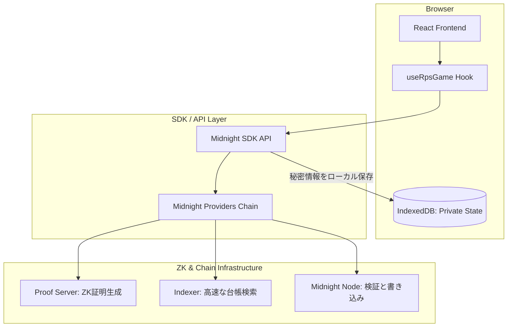
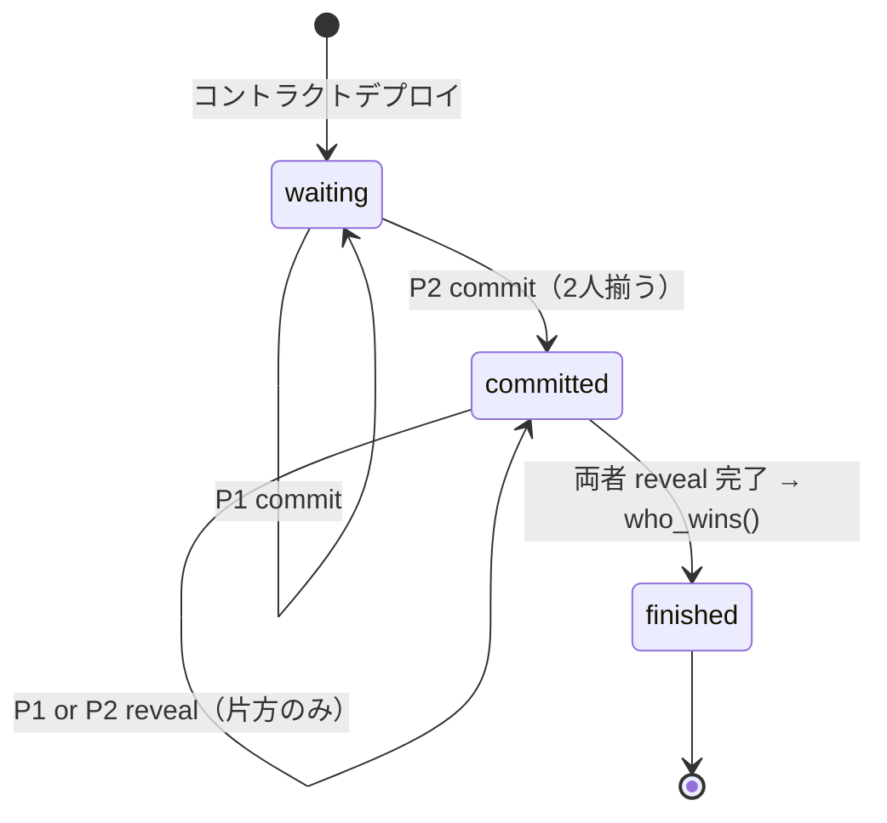

# はじめに

じゃんけんをオンチェーンで実装しようとした瞬間、詰まった。

「グー」を選んでトランザクションを投げた時点で、相手のウォレットはもう私の手をブロックチェーンの台帳から読み取れてしまう。これではゲームにならないよなと....

コミット・リビール方式を自前で実装しようとしたが、ソルトの管理、フロントランニング対策、判定ロジックの公平性……考えれば考えるほど沼だった。

そこで **Midnight** を使ってじゃんけんの「後出し禁止」を数学的に保証できるフルスタックアプリを作ってみました！

本記事では、Midnight のスマートコントラクト言語 **Compact** で実装した Rock-Paper-Scissors（RPS）dApp を題材に、ZK 回路の設計思想と実際に開発してぶつかった壁を共有すします！

> **⚠️ ZK が守る範囲について**: ZK 証明が保証するのは「コミット段階での手の秘匿性」＝フェアネスです。reveal 後、双方の手はパブリック台帳に記録されます！

アプリのイメージは以下のような感じです！


## この記事で学べること

- Midnight における「隠す」と「見せる」の切り分け設計
- Compact 言語によるコミット・リビールパターンの極意
- ZK 証明生成待ち（10秒の壁）を克服するフロントエンド UX
- Midnight JS SDK による堅牢なプロバイダー構成

## 今回実装したサンプルコードのリポジトリ

https://github.com/mashharuki/midnight-rps-sample-app

---

# クイックスタート

手元で動かすまでの全手順をまとめました！

「とりあえず動かしてみたい」という方はまずはこちらからどうぞ！

正直に言うと、**ZK 回路のコンパイルと Docker イメージの初回 Pull を含めると合計 15〜20 分**はかかる。覚悟して進んでほしい。

## 環境情報

以下の環境で動作確認済みです！

```bash
Docker version 27.4.0
compact 0.2.0
bun 1.3.13
node 23.3.0
```

## 0. Git リポジトリのクローン

```bash
git clone https://github.com/mashharuki/midnight-rps-sample-app.git
```

## 1. 依存関係のインストール

```bash
bun install
```

## 2. コントラクトのコンパイルとビルド

```bash
# Compact -> ZK 回路資産の生成（ここが一番時間がかかる）
bun contract compact  

# CLI とフロントエンドアプリのビルド
bun cli build
bun app build
```

> `bun contract compact` は Compact コンパイラが ZK 証明回路（proving key / verification key）を生成するステップです。

## 3. Proof Server の起動（初回 Docker Pull：〜3分）

ZK 証明の生成を担うサーバーを Docker で立ち上げるます！  

このサーバー起動なしでは コントラクトのデプロイやcommit / reveal のトランザクションが送れないので注意です！

> バージョン `8.0.3` は Compact `0.2.0` との動作確認済みバージョン。  
> Midnight の SDK とバージョンを揃えないと証明生成に失敗するので注意。

```bash
docker run -d -p 127.0.0.1:6300:6300 midnightntwrk/proof-server:8.0.3 midnight-proof-server
```

---

# Midnight アーキテクチャの本質：情報の「局所化」

Midnight での開発は、スマートコントラクト開発で主流の言語である**Solidity**を使った開発とは設計方針が異なってきます。

これまでの記事でも紹介した通り、 Midnightには**2種類のステートが存在します**。


- **パブリックステート**:   
  全員が見れるステート
- **プライベートステート**:   
  自分だけが見れるステート

この 2 つを繋ぐのが **Compact** で記述される ZK サーキット(算術回路)です。

## 今回のアプリのアーキテクチャ



---

# 【コード詳解】 後出しを数学的に禁止する ZK 回路

## 1. セキュリティの要：ドメイン分離

秘密鍵から公開鍵を導出する際、Midnight では以下のパターンが推奨されます！

```rs
pure circuit derive_pk(sk: Bytes<32>): Bytes<32> {
  // "rps:pk:v1" という固定文字列でドメインを分離
  return persistentHash<Vector<2, Bytes<32>>>([pad(32, "rps:pk:v1"), sk]);
}
```

そのままま使っていたら、別のアプリで同じ秘密鍵を使用したときに公開鍵が同一になり秘密したい情報が漏洩するリスクが生まれます。

「アプリ名 + バージョン」の固定プレフィックスを混ぜることで、同じ秘密鍵から生成される公開鍵がアプリごとに必ず異なるようにもしました

## 2. コミット・リビール回路の全容

### コミット（手を隠して宣言）

```rs
export circuit commit(): [] {
  assert(!game_over,                 "Game is already over");
  assert(state == GameState.waiting, "Not in waiting state");

  const sk         = local_secret_key(); // witness：手元のプライベート入力
  const pk         = derive_pk(sk);
  const my_move    = get_my_move();
  const my_salt    = get_my_salt();
  const commitment = make_commit(my_move, my_salt);
  store_move_and_salt(my_move, my_salt); // ⭐ プライベートステートに手とソルトを保存

  // Player 1 か Player 2 かで台帳の書き込み先を分岐
  if (!p1_joined) {
    p1_key    = disclose(pk);
    p1_commit = disclose(commitment);
    p1_joined = true;
  } else {
    assert(!p2_joined, "Both players already committed");
    p2_key    = disclose(pk);
    p2_commit = disclose(commitment);
    p2_joined = true;
    state     = GameState.committed; // 2人揃ったら committed 状態へ
  }
}
```

ここで導入した **`store_move_and_salt`** に注目してほしいです。

これは witness 関数の一つで、選んだ手とソルトをブラウザの IndexedDB（プライベートステート）に保存する処理を実装した関数です。reveal 時に同じ手とソルトで「コミットした内容と一致する」ことを ZK 証明するため、この 1 行なしではゲームが成立しないようになっています。

`disclose()` を使っている点も重要で、ZK 回路内の「秘密」の計算結果のうちどれを「公開」するかを開発者が厳密にコントロールできるようにしました。

### ゲームの状態遷移

commit / reveal の 2 フェーズがどう連鎖するかを状態遷移で整理することになります。



## 3. リビール回路：ZK 証明が輝く瞬間

> コミットが「宣言」なら、リビールは「証明」です！。

ここが Midnight の ZKスタックが活きてくる部分になります！

```rs
export circuit reveal(): [] {
  assert(!game_over,                   "Game is already over");
  assert(state == GameState.committed, "Not in committed state");

  const sk      = local_secret_key();
  const pk      = derive_pk(sk);
  const my_move = get_my_move();   // プライベートステートから復元
  const my_salt = get_my_salt();   // プライベートステートから復元
  const computed = make_commit(my_move, my_salt);

  const is_p1 = disclose(p1_key == pk);
  const is_p2 = disclose(p2_key == pk);
  assert(is_p1 || is_p2, "Caller is not a registered player");

  if (is_p1) {
    assert(!p1_revealed, "Player 1 already revealed");
    assert(disclose(computed == p1_commit), "Commitment mismatch for P1");
    p1_move     = disclose(my_move); // ここで初めて手が台帳に書かれる
    p1_revealed = true;
  }
  if (is_p2) {
    assert(!p2_revealed, "Player 2 already revealed");
    assert(disclose(computed == p2_commit), "Commitment mismatch for P2");
    p2_move     = disclose(my_move);
    p2_revealed = true;
  }

  if (disclose(p1_revealed && p2_revealed)) {
    result    = who_wins(p1_move, p2_move); // 勝敗判定
    game_over = true;
    state     = GameState.finished;
  }
}
```

`assert(disclose(computed == p1_commit), "Commitment mismatch for P1")` この 1 行こそが核心部分になります！

- `my_move` と `my_salt` は手元のプライベートステートにしか存在しない
- `make_commit(my_move, my_salt)` を再計算し、commit 時に台帳に記録した `p1_commit` と一致するかを ZK 回路内で検証する
- 「私の手はコミットした手と同一である」という事実を、じゃんけんの手の中身を明かさずに数学的に証明できる

reveal が完了して初めて `p1_move` / `p2_move` がオンチェーンに書き込まれ、`who_wins()` で勝敗が確定することになります！

コミット段階では相手の手はZKによって秘匿され理ビールされるまでわかりません。   
これが **「後出しを数学的に禁止」** する仕組みです。

---

# ZK dApp 開発最大の壁「UX」をどう突破するか

実際に実装して最も苦労したのは、**「ZK 証明の生成待ち時間」** のハンドリングです。


## 10秒の沈黙をどう埋めるか

Midnight では、TX を投げる前に手元のマシン（または Proof Server）で証明を作る必要があり、これに 5〜10 秒ほどかかります。

ユーザーに「フリーズした？」と思わせないための工夫が不可欠です。

- **楽観的 UI アップデート**:   
  証明生成を開始した瞬間に、UI 上の状態を「証明生成中...」に切り替え、何が起きているかを明確に伝える。
- **Provider の永続化**:    
  `levelPrivateStateProvider` を使い、証明生成中にブラウザがリロードされても、生成済みのデータや選択した「手」が失われないように設計する。


```typescript
// levelPrivateStateProvider の設定例
privateStateProvider: levelPrivateStateProvider({ 
  accountId, 
  namespace: "rpsPrivateState", // ゲームごとに名前空間を分ける
  privateStoragePasswordProvider: () => storagePassword // 安全な保存
}),
```

---

# 処理シーケンス：コミットからゲーム終了まで

改めてここまでの流れを整理したいと思います！

```mermaid
%%{init: {'theme': 'dark', 'themeVariables': {'actorTextColor': '#ffffff', 'signalColor': '#aaaaaa', 'signalTextColor': '#ffffff', 'labelTextColor': '#ffffff', 'loopTextColor': '#ffffff', 'noteTextColor': '#ffffff', 'noteBkgColor': '#2a2a4a', 'sequenceNumberColor': '#ffffff', 'activationBorderColor': '#aaaaaa'}}}%%
sequenceDiagram
    autonumber
    participant User as ユーザー
    participant App as React App
    participant SDK as Midnight JS
    participant PS as Proof Server
    participant Node as Midnight Node

    rect rgb(30, 40, 60)
        Note over User,Node: 「コミット」フェーズ
        User->>App: 「グー」を選択して送信
        App->>SDK: commitMove(rock)
        SDK->>SDK: store_move_and_salt(rock, salt) → IndexedDB
        App->>User: 「証明生成中... (約10秒)」と表示
        SDK->>PS: commit() 回路の証明要求
        Note right of PS: ZK 証明の数学的演算
        PS-->>SDK: ZK Proof
        App->>User: 「TX 送信中...」に更新
        SDK->>Node: Transaction 送信
        Node-->>App: TX 確定
        App->>User: 「コミット完了！」
    end

    rect rgb(20, 50, 40)
        Note over User,Node: 「リビール」フェーズ（両者がコミット完了後）
        User->>App: 「手を開く」をリクエスト
        App->>SDK: revealMove()
        SDK->>SDK: IndexedDB から move + salt を復元
        App->>User: 「証明生成中... (約10秒)」と表示
        SDK->>PS: reveal() 回路の証明要求
        Note right of PS: computed == p1_commit 検証
        PS-->>SDK: ZK Proof
        SDK->>Node: Transaction 送信
        Node-->>App: TX 確定
        App->>User: 「リビール完了！」
    end

    rect rgb(50, 30, 30)
        Note over User,Node: 「判定」フェーズ（両者リビール完了後）
        Node-->>App: who_wins(p1_move, p2_move) 実行
        App->>User: ゲーム結果表示
    end
```



---

# やってみてわかった残った課題

Midnight と Compact の設計は実際に榽を作って初めて分かることが多いです(実装例がまだまだ少ないというのもありますが)。 

例えば今回のアプリだと以下のような課題がまだ残っています、

**1. ゲーム放棄問題（Griefing Attack）** 

P1 がコミットしたまま P2 が永遠に参加しない場合、コントラクトがロックされてしまいます。  
タイムアウト・キャンセルの仕組みが今の実装にはなく、次のアップデートで対処したいです。

**2. ビルド資産のバージョン管理**

`bun contract compact` で生成される ZK 回路資産（proving key）は、Compact のバージョンやコンパイラの微妙な変化で無効になります。  

今回ハマったポイントもバージョン違いだったので皆さんも類似のアプリをmidnight上で開発している場合にはライブラリやProof Serverのバージョンを見直してみてください！


この 2 つの課題を解決すれば、**Midnight** を活用したZK Appをもっと多く作っていけそうです！

---

# まとめ

今回の後出し禁止じゃんけんアプリを実装してみて以下の3つのことに注意が必要だということがわかりました！

1. **ライブラリ等のバージョンの確認**: Proof ServerのバージョンによってはZK Proofをうまく生成できないことがあるため確認が必要。
2. **`store_move_and_salt` を流さない**: reveal のためのプライベートステート保存は不可欠。
3. **UX を最優先する**: ZK 特有の待ち時間を退屈させないUI/UXの設計が大事

次はマルチラウンド対応とタイムアウト処理に挑戦してみようと思います！

Midnight のプライバシー技術に興味がある方は、ぜひリポジトリや他の技術ブログも見てみてほしいです！！

ここまで読んでいただきありがとうございました！

# よろしければXのフォローもよろしくお願いします！

https://x.com/haruki_web3

---

# 参考資料
- [Midnight 公式ドキュメント](https://docs.midnight.network/)
- [Compact 言語リファレンス](https://docs.midnight.network/develop/reference/compact/lang-ref)
- [Midnight RPS サンプルコード](https://github.com/mashharuki/midnight-rps-sample-app)
