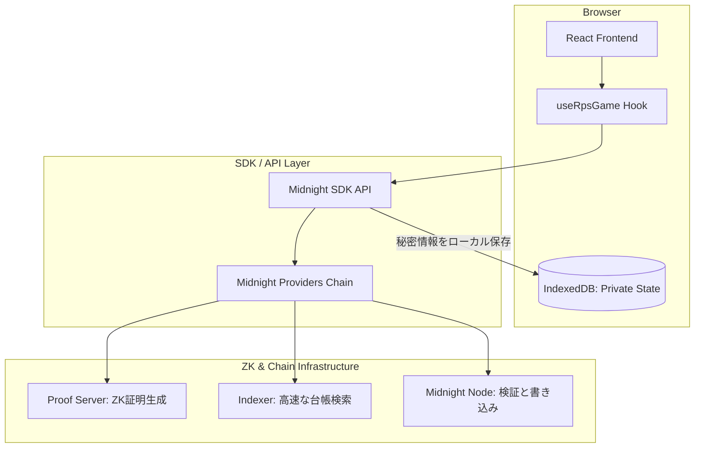
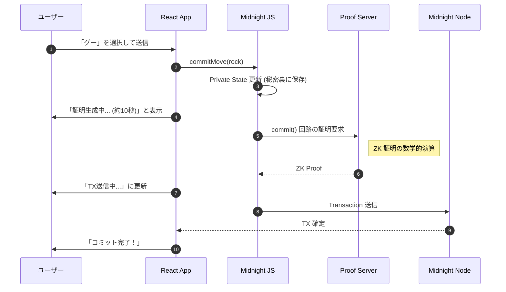

## はじめに

ブロックチェーンの世界において、「透明性」は最大の武器である一方、特定のアプリケーションにおいては「プライバシー」が決定的な障壁となります。

例えば、じゃんけん（RPS）をオンチェーンで行う場合、相手の手が台帳から丸見えではゲームになりません。

これを数学的な魔法で解決するのが、Cardano のサイドチェーンとして注目を集めるプライバシー保護ブロックチェーン **Midnight** です。

本記事では、Midnight のスマートコントラクト言語 **Compact** を使用して実装した「Rock-Paper-Scissors（RPS）」を題材に、ZK dApp 開発の核心と、実際に開発して分かった「UX 設計の極意」を共有します！


ぜひ最後まで読んでいってください！

### この記事で学べること

- Midnight における「隠す」と「見せる」の切り分け設計
- Compact 言語によるコミット・リビールパターンの極意
- ZK 証明生成待ち（10秒の壁）を克服するフロントエンド UX
- Midnight JS SDK による堅牢なプロバイダー構成

---

## クイックスタート：3分で環境構築

まずは、伝説の第一歩を手元で動かす手順です。

### 0. Gitリポジトリのクローン

```bash
git clone https://github.com/mashharuki/midnight-rps-sample-app.git
```

### 1. 依存関係のインストール

```bash
bun install
```

### 2. コントラクトのコンパイルとビルド
```bash
# Compact -> ZK回路資産の生成
bun contract compact  

# CLIとフロントエンドアプリのビルド
bun cli build
bun app build
```

### 3. Proof Server の起動

次にZK 証明の生成を担うサーバーを Docker で立ち上げます。

> このサーバーを起動しておかないとデプロイや書き込み系の処理時にエラーが発生します！

```bash
docker run -d -p 127.0.0.1:6300:6300 midnightntwrk/proof-server:8.0.3 midnight-proof-server
```

---

## Midnight アーキテクチャの本質：情報の「局所化」

Midnight での開発は、これまでの Solidity などの開発とは思考回路が異なります。

- **パブリック台帳**:   
  全員が合意する「共有の真実」。
- **プライベートステート**:   
  あなたのブラウザだけに留まる「秘密の真実」。

この 2 つを繋ぐのが **Compact** で記述される ZK サーキットです。

### 開発者が意識すべき境界線




---

## 【コード詳解】Compact 言語で書く ZK 回路

### 1. セキュリティの要：ドメイン分離
秘密鍵から公開鍵を導出する際、Midnight では以下のパターンが推奨されます。

```compact
pure circuit derive_pk(sk: Bytes<32>): Bytes<32> {
  // "rps:pk:v1" という固定文字列でドメインを分離
  return persistentHash<Vector<2, Bytes<32>>>([pad(32, "rps:pk:v1"), sk]);
}
```

これは非常に重要なポイントです。

同じ秘密鍵を別のアプリで使ったとしても、生成される公開鍵が異なるようになり、プライバシーがより強固に守られます。

### 2. コミット・リビール回路の全容


#### コミット（手を隠して宣言）

```compact
export circuit commit(): [] {
  assert(!game_over, "Game is already over");
  
  const sk         = local_secret_key(); // プライベート入力
  const pk         = derive_pk(sk);
  const my_move    = get_my_move();
  const my_salt    = get_my_salt();
  const commitment = make_commit(my_move, my_salt);
  
  // Player 1 か Player 2 かで台帳の書き込み先を分岐
  if (!p1_joined) {
    p1_key    = disclose(pk);
    p1_commit = disclose(commitment);
    p1_joined = true;
  } else {
    assert(!p2_joined, "Both players already committed");
    p2_key    = disclose(pk);
    p2_commit = disclose(commitment);
    p2_joined = true;
    state     = GameState.committed; // 2人揃ったら committed 状態へ
  }
}
```

ここで `disclose()` を使っている点に注目してください。ZK 回路内の「秘密」の計算結果のうち、どれを「公開」するかを開発者が厳密にコントロールできます。

---

## 【独自知見】ZK dApp 開発最大の壁「UX」をどう突破するか

実際に実装して最も苦労したのは、**「ZK 証明の生成待ち時間」**のハンドリングです。


### 10秒の沈黙をどう埋めるか
Midnight では、TX を投げる前に手元のマシン（または Proof Server）で証明を作る必要があり、これに 5〜10 秒ほどかかります。
ユーザーに「フリーズした？」と思わせないための工夫が不可欠です。

- **楽観的 UI アップデート**:   
  証明生成を開始した瞬間に、UI 上の状態を「証明生成中...」に切り替え、何が起きているかを明確に伝える。
- **Provider の永続化**:  `levelPrivateStateProvider` を使い、証明生成中にブラウザがリロードされても、生成済みのデータや選択した「手」が失われないように設計する。


```typescript
// levelPrivateStateProvider の設定例
privateStateProvider: levelPrivateStateProvider({ 
  accountId, 
  namespace: "rpsPrivateState", // ゲームごとに名前空間を分ける
  privateStoragePasswordProvider: () => storagePassword // 安全な保存
}),
```

---

## 処理シーケンス：証明生成の裏側



---

## まとめ：Midnight Aliit 候補生として


Midnight と Compact は、単なる技術的な道具ではありません。それは、**「個人の主権を守りながら、信頼を構築する」**ための新しい言語です。

じゃんけんというシンプルなゲームでも、その裏側には高度な暗号学と、緻密な UX 設計が詰まっています。

1. **情報の境界線を引く**: 常に「何が秘密で、何が公開か」を問い続ける。
2. **UX を最優先する**: ZK 特有の待ち時間を、ユーザーとの対話に変える。
3. **ドメイン分離で守る**: 些細な設計判断が、将来のプライバシー漏洩を防ぐ。

Midnight が切り拓くプライバシー保護の未来は、まだ始まったばかりです。本記事が、皆さんの挑戦の種火になれば幸いです。共に、より自由でプライベートな Web3 を築きましょう！

---

## 参考資料
- [Midnight 公式ドキュメント](https://docs.midnight.network/)
- [Compact 言語リファレンス](https://docs.midnight.network/develop/reference/compact/lang-ref)
- [Midnight RPS サンプルコード](https://github.com/...)
