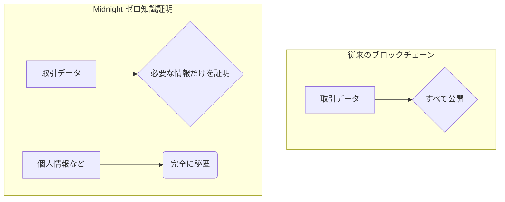
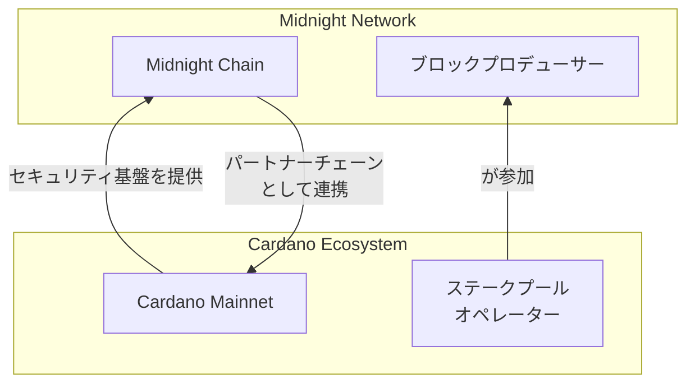

## はじめに：ブロックチェーンの「透明すぎる」問題

**Bitcoin**のホワイトペーパーが公開されてから17年...。

ブロックチェーンが持つ耐改ざん性と透明性は取引の信頼性を担保する画期的な仕組みとして称賛されてきました。

誰もが台帳を検証できることで、改ざん不可能なトラスト（信頼）を築き上げたのです。

しかし、その「完全な透明性」はビジネスや個人のプライバシーが関わる領域において、障壁も生み出しています。  

特にエンタープライズ企業ではこの問題が顕著に見られ、それゆえにプライベートチェーンを構築する動きが流行りました。

- **あなたの銀行取引履歴が、世界中の誰からでも見えてしまったら？**
- **企業の極秘のサプライチェーン情報が、競合他社に筒抜けだったら？**
- **個人の医療情報や投票履歴が、公開されてしまったら？**

考えただけでも恐ろしいですよね。

この「透明すぎる」問題こそが、ブロックチェーン技術が真に社会の隅々まで浸透するのを阻んできた要因の一つにもなっていると思います。

なんでもかんでもオープンに...というわけにはいきませんよね。

そんな中このジレンマを解決すべく、一筋の光が差し込んできました。

それが、今回ご紹介する**midnight**です。

https://midnight.network/

Midnightは、データ保護とプライバシーに特化した、Cardanoのパートナーチェーン（サイドチェーン）です。

この記事では、midnightの世界に飛び込みその革新的な技術と未来の可能性を理解できるようにストーリー仕立てで分かりやすく解説しています！

ぜひ最後まで読んでいってください！

## 第1章：midnightとは？ - プライバシーを守る新世代ブロックチェーン

midnightは、一言で言えば **「選択的な開示（Selective Disclosure）」** を可能にする、データ保護を目的としたブロックチェーンです。

従来の多くのブロックチェーンが「すべてを公開する」しかなかったのに対し、Midnightは **「証明したい事実だけを、それ以外の情報を一切明かさずに証明する」** ことを可能にします。

:::message
**zcash**のような類似のアプローチを採用しているブロックチェーンも存在します。
:::

これを実現するのが、 **ゼロ知識証明（Zero-Knowledge Proofs, ZKP）** という非常に高度な暗号技術です。



**ゼロ知識証明（Zero-Knowledge Proofs, ZKP）** については別記事で紹介していますのでぜひそちらもご覧になってください！

https://zenn.dev/mashharuki/articles/zk_groth16-plonk

### midnightが実現しようとしていること

Midnightの使命は、データ保護、所有権、そしてデータの有用性の間で発生していたトレードオフを解消することです。

- **ユーザーは…** 
  自分のデータを完全にコントロールし、誰に何をどこまで見せるかを自分で決められる。
- **開発者や企業は…**  
  ユーザーのプライバシーを侵害するリスクを負うことなく、データを活用した革新的なサービスを構築できる。

これにより、これまでブロックチェーン上では不可能だった、機密性が求められる領域でのユースケースが増加する可能性があります。

### midnightの心臓部：アーキテクチャとコンセンサス

Midnightは、Cardanoのパートナーチェーンとして、その堅牢なセキュリティインフラの上に構築されています。

- **アーキテクチャ**: 
  Midnightは、スマートコントラクトの状態を2つに分割します。
    1.  **パブリックな状態**: 
      従来通りブロックチェーン上で公開されるデータ。
    2.  **プライベートな状態**:  
      各ユーザーがオフチェーン（自分のローカル環境）で管理するデータ。

- **Kachinaプロトコル**: 
  このパブリックとプライベートの状態を安全に連携させるのが、研究主導の統一フレームワーク「Kachina」です。
  ユーザーはプライベートなデータを使い、ローカルでゼロ知識証明を生成。その「証明」だけをブロックチェーンに送信することで、データの正しさを検証します。
- **コンセンサスアルゴリズム**: 
  Midnightは、**AURA**（ブロック生成）と**GRANDPA**（ファイナリティ）を組み合わせたハイブリッドコンセンサスを採用しており、Cardanoのステークプールオペレーター（SPO）がブロックプロデューサーとして参加することで、分散性とセキュリティを確保しています。

### 2つのネイティブトークン：NIGHT と DUST

Midnightは、ユニークなデュアルトークンモデルを採用しています。

| トークン | 役割                                                                                             | 特徴                                                               |
| :------- | :----------------------------------------------------------------------------------------------- | :----------------------------------------------------------------- |
| **NIGHT**  | ガバナンス、コンセンサス参加、ブロック生成報酬                                                     | **非シールドトークン**。取引所での取引が可能で、ネットワークの安全性を担保します。 |
| **DUST**   | トランザクション手数料（ガス代）                                                                 | **シールドリソース**。転送不可能で、プライバシーを保護します。価格変動が少なく、予測可能な手数料を実現します。 |

`DUST`は「燃料」の役割を果たしますが、それ自体が取引される資産ではないため、トランザクションのメタデータ（誰が誰にいくら払ったか）のプライバシーが守られ、かつ安定した手数料でサービスを運用できるのです。

## 第2章：Cardanoとの絆 - なぜパートナーチェーンなのか？

**midnight**を語る上で欠かせないのが、その親チェーンである**Cardano**との関係です。

**midnight**は独立したブロックチェーンでありながら、**Cardano**と深く連携することで、その真価を発揮します。



### セキュリティの継承

新しいブロックチェーンが直面する最大の課題の一つが、ネットワークのセキュリティの担保です。

midnightは、この課題を「Cardanoのパートナーチェーンになる」という方法で解決しました。

- **セキュリティのブートストラップ**: 
  Midnightは、Cardanoの巨大で分散化されたステークプールオペレーター（SPO）のネットワークを活用します。  
  Midnightのブロックプロデューサーになるには、まずCardanoのSPOである必要があります。

- **信頼のインフラ**: 
  これにより、Midnightはローンチ直後から、世界中に分散した信頼性の高いエンタープライズグレードのインフラを手に入れることができるのです。

### Cardanoとの違い

改めて midnightとCardanoの違いをまとめたいと思います！

- **Cardano**: 
  価値の保存と移転、そして安全な分散型アプリケーションのための「決済レイヤー」および「汎用プラットフォーム」としての役割に重点を置いています。
- **midnight**: 
  Cardanoのセキュリティを基盤としながら、**データ保護とプライバシー**という特定の機能に特化した「計算レイヤー」です。

両者は競合するのではなく、互いの強みを活かし合う補完的な関係なのです。Cardanoが信頼の土台を築き、その上でMidnightがプライバシーを必要とする複雑なアプリケーションを動かします。

## 第3章：Compact言語 - TypeScriptで書けるZKPスマートコントラクト

:::message
「ゼロ知識証明なんて、一部の暗号学者にしか扱えないのでは？」
:::

そう思った方も多いでしょう。

しかし、Midnightはそのハードルを劇的に下げるための切り札を用意しています。  
それが、スマートコントラクトのための新しいプログラミング言語 **`Compact`** です。

https://github.com/midnightntwrk/compact

### Compactの驚くべき特徴

1.  **TypeScriptベースのDSL**: 
  Compactは、世界で最も人気のあるプログラミング言語の一つであるTypeScriptをベースにしたドメイン固有言語（DSL）です。これにより、膨大な数のWeb開発者が、特別な言語を学ぶことなく、慣れ親しんだ構文でプライバシー保護アプリケーションを開発できます。

2.  **ZKの複雑さを抽象化**: 
  開発者は、ゼロ知識証明の複雑な数学や暗号理論を意識する必要がありません。Compactコンパイラが、書かれたロジックを自動的にZK証明の生成に必要な暗号マテリアルに変換してくれます。

3.  **プライバシー・バイ・デザイン（Privacy by Design）**: 
  Compactは、「うっかり情報漏洩」を防ぐための賢い仕組みを持っています。
    - データは**デフォルトでプライベート**として扱われます。
    - プライベートなデータを公開状態にするには、`disclose()`という関数で明示的に囲む必要があります。
    - これを忘れると、コンパイラがエラーを出してくれるため、意図しないデータ漏洩を未然に防げます。

```typescript
// Compactの概念的なコード例

// プライベートなユーザーの投票内容
witness userVote: private Field;

// パブリックな開票結果
let results: public Field;

// 投票回路
circuit vote() {
  // ... 投票の正当性を検証するロジック ...

  // 検証が通れば、結果を更新する
  // この時、誰が何に投票したかは秘匿される
  results = results + 1;

  // もし投票内容を公開したい場合は、明示的にdisclose()を使う
  // disclose(userVote);
}
```

### 開発ワークフロー

開発者は、DAppのフロントエンドやビジネスロジックをTypeScript/JavaScriptで書き、コアとなるプライベートなロジックをCompactで記述します。

Compactコンパイラが両者を繋ぐためのTypeScript APIを自動生成するため、シームレスな開発体験が実現されます。

## 第4章：Midnightが拓くユースケース

プライバシーが保護されることで、どのような未来が実現するのでしょうか？  
**midnight** が可能にするユースケースは無限大です。

- **デジタルID / KYC**: 
  「18歳以上である」ことを証明するために、生年月日を提示する必要がなくなります。  
  年齢や国籍といった事実だけを、個人情報を一切明かすことなく証明できます。

- **匿名投票**: 
  誰が誰に投票したかを秘密にしたまま、有権者であることの証明と投票の正当性を担保した、真に公正な投票システムを構築できます。

- **ヘルスケア**: 
  個人の医療記録のプライバシーを完全に保護しながら、研究機関が統計データとして活用したり、AIが創薬のための学習を行ったりすることが可能になります。

- **DeFi（分散型金融）**: 
  あなたの金融資産や取引戦略を他人に知られることなく、分散型金融サービスを利用できます。

- **AIとLLM**: 
  機密性の高い企業データや個人データをAIに学習させる際、データのプライバシーを維持したまま、モデルのトレーニングを行うことができます。

## まとめ：プライバシー新時代の幕開け

最後に要点をまとめたいと思います！

- ✅**midnight**は、ゼロ知識証明という暗号技術を使ってこれまでブロックチェーンが抱えていた「透明すぎる」という根本的な課題を解決しようとしている。
- ✅**Cardano**との戦略的パートナーシップにより、ローンチ当初から堅牢なセキュリティと分散性を確保。
- ✅**Compact言語**とTypeScriptエコシステムの融合により、世界中の開発者がプライバシー保護アプリケーションを構築する道を開きました。

Midnightは単なる新しいブロックチェーンではありません。  

それは、個人のデータ主権を守り、企業が安心してイノベーションを追求できる、より公正で安全なデジタル社会を実現するための基盤技術です。

もっとmidnightのことが知りたいという方はぜひ公式ドキュメントをチェックしてみてはいかがでしょうか？

ここまで読んでいただきありがとうございました！！

## 開発者向けドキュメントの紹介

midnight上で何かアプリを作りたいという方は以下のサイトが参考になります！

https://midnight.network/developer-hub

https://github.com/midnightntwrk/midnight-awesome-dapps

https://github.com/MeshJS/midnight-starter-template

https://github.com/DEGAorg/midnight-mcp

Deepwikiでも聞けるようにしてみました！

https://deepwiki.com/midnightntwrk/midnight-zk

https://deepwiki.com/midnightntwrk/midnight-docs

https://deepwiki.com/midnightntwrk/compact

https://deepwiki.com/midnightntwrk/midnight-js

https://deepwiki.com/midnightntwrk/midnight-awesome-dapps

https://deepwiki.com/DEGAorg/midnight-mcp

## midnight summit 2025

2025年11月にロンドンにて midnight summit 2025が開催されます！  

最新情報は以下のサイトをチェックしてみてください！

https://midnightsummit.io/

## 参考文献

- [Midnight公式サイト](https://www.midnight.network/)
- [Midnightドキュメント](https://docs.midnight.network/)