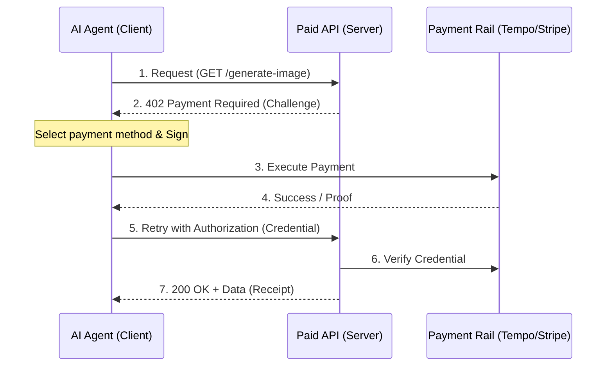

> この記事はAIと力を合わせて執筆しました！

# はじめに

みなさん、こんにちは！

Web3やAIエージェントの界隈で、今最も注目すべきプロトコルをご存知でしょうか？

それは、StripeとL1ブロックチェーンのTempoが共同で策定した**Machine Payments Protocol (MPP)** です。 

https://stripe.com/blog/machine-payments-protocol

**Tempo**については別記事にして取り上げているのでぜひそちらもご覧ください！


この記事では、HTTP 402ステータスコードを20年越しに「実用化」するこのプロトコルの全貌を、エンジニア目線で徹底解剖します。

# 1. MPPとは？：HTTP 402の逆襲

HTTPステータスコード **402 「Payment Required」**。

RFCで定義されながら、長らく「将来のために予約済み」として放置されてきたこのコードが、ついに標準化されます。

https://mpp.dev/protocol/http-402

**MPP（Machine Payments Protocol）** は、AIエージェントやアプリケーションが、**単一のHTTPリクエスト内でサービスの発見・交渉・支払い・利用を完結できる**オープン規格です。すでにIETF（Internet Engineering Steering Group）にもドラフトが提出されており、インターネットの基盤層に決済を組み込もうとする壮大なプロジェクトです。

### MPPが解決する課題

- **人間中心のUIの排除**:   
  CAPTCHAや手動のチェックアウトフローを不要にする。
- **アカウントレス決済**:   
  事前のサインアップやOAuthなしで、その場で自律的に支払える。
- **アグノスティックな設計**:   
  [Tempo](https://mpp.dev/payment-methods/tempo)（ステーブルコイン）、[Stripe](https://mpp.dev/payment-methods/stripe)（カード）、[Lightning](https://mpp.dev/payment-methods/lightning)（BTC）など、決済レールを選ばない。

# 2. 核心のメカニズム：Challenge-Credential-Receipt

MPPの通信は、以下のシンプルなシーケンスで構成されます。 

https://mpp.dev/protocol



1. **Challenge**:   
  サーバーは「いくら、どの通貨で、どの決済レールで支払ってほしいか」を返します。 ([Challenges](https://mpp.dev/protocol/challenges))
2. **Credential**:   
  クライアントはそれに基づき支払いを実行し、「支払い証明」を付けて再送します。 ([Credentials](https://mpp.dev/protocol/credentials))
3. **Receipt**:   
  サーバーは検証し、リソースと共に「受領証」を返します。 ([Receipts](https://mpp.dev/protocol/receipts))

# 3. 選べる2つの支払い形態（インテント）

MPPには、ユースケースに合わせて2つのモードが用意されています。

| 特徴 | **[Charge（一括決済）](https://mpp.dev/intents/charge)** | **Session（セッション決済）** |
| :--- | :--- | :--- |
| **パターン** | 1リクエストにつき1決済 | 事前デポジットによる従量課金 |
| **レイテンシ** | オンチェーン確定を待つ（数百ms〜） | **マイクロ秒（オフチェーン署名検証）** |
| **スループット** | 普通 | **極めて高い（LLMトークン課金に最適）** |
| **コスト** | 決済ごとの手数料 | 手数料を1回に集約（ほぼゼロ） |

特に **Session** モードは強力です。

最初にデポジットを行い、以降は「オフチェーンの署名済みバウチャー」を提示するだけで良いため**1リクエストあたりの決済オーバーヘッドがほぼゼロ**になります。

https://mpp.dev/guides/pay-as-you-go

# 4. TIP-20：MPPの最強の相棒

MPPでステーブルコイン決済を行う際の中心となるのがTempo L1のトークン規格である**TIP-20**です。 

https://mpp.dev/payment-methods/tempo

### ERC-20 とは何が違うのか？

- **32バイトの転送メモ**: 請求書番号や顧客IDをオンチェーンに直接記録。
- **手数料トークンの選択**: ガス代をUSDXなどのステーブルコインで直接支払える。
- **報酬分配機能**: ステーキングせずとも保有量に応じた報酬を効率的に分配。

この「メモ機能」があるおかげでバックエンドシステム側で「どのリクエストに対してどの支払いが紐付いているのか」を複雑なDB検索なしに一意に特定できます。

# 5. Tempo vs x402：似ているようで違う「守備範囲」

よく混同される **x402** との関係性についても整理しておきましょう。

- **x402**:   
  もともと「HTTP 402 × Web3」の文脈で生まれた用語ですが、主にブロックチェーン上での決済にフォーカスしています。
- **MPP**:   
  x402の思想を継承しつつ、**Stripe（カード決済）やLightning Networkなども包含した、より実用的で汎用的な「オープン標準」** としてStripe/Tempoが共同策定したものです。 ([FAQ: x402 comparison](https://mpp.dev/faq))

戦略的には、MPPは「実社会の既存金融（Stripe）とWeb3（Tempo）を一つのインターフェースで統合する」というより広範なマーケットをターゲットにしています。

後発なだけあってめちゃくちゃよく考えられています！

# 6. 今後の展望：マシン経済のインフラへ

MPPは、AIエージェントが自律的にサービスを売り買いする **「マシン経済（Agentic Economy）」** のミッシングリンクを埋める存在です。

https://mpp.dev/guides/building-with-an-llm

例えば、AIが「情報を検索し、要約し、画像を生成する」という一連のタスクをこなす際、背後で複数のAPIに対してMPPで数セントずつ自律的に支払っていく。そんな未来がすでに数行のミドルウェア導入だけで実現可能になっています！

https://mpp.dev/sdk

```typescript
// Honoでの実装例
import { paymentMiddleware } from 'mppx/hono';

app.get('/premium-data', 
  paymentMiddleware({ price: '$0.01', currency: 'USD' }), 
  async (c) => {
    return c.json({ data: 'This is premium content paid by AI!' });
  }
);
```

導入のしやすさなどもよく考えられていますね。

**Hono**とか**Cloudflare Workers**とかモダンなフレームワークやプラットフォームを使っているプロジェクトであればすぐに導入できそうです！

# まとめ

MPPは、単なる新しい決済方法ではなく **「マシンのためのインターネット・プロトコル」** です。

IETFへもドラフトが提出されており、Stripeという巨大なプラットフォームが本気で普及に乗り出しています。

今開発者としてこの波に乗らない手はありません！

まずは、公式の `mppx` CLIを使ってAIエージェントに決済機能を追加してみてはいかがでしょうか？

https://mpp.dev/quickstart/client

ここまで読んでいただきありがとうございました！

--- 

**参考文献:**
- [Stripe Blog: Introducing the Machine Payments Protocol](https://stripe.com/blog/machine-payments-protocol)
- [MPP Official Site](https://mpp.dev/)
- [MPP Documentation](https://mpp.dev/overview)
- [Machine Payments Protocol Specification](https://mpp.dev/protocol)
