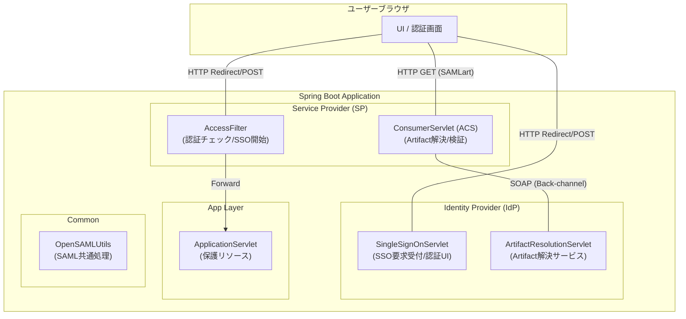
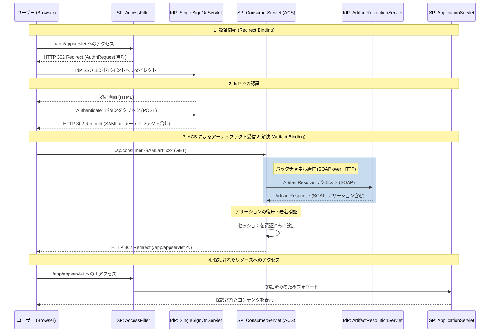
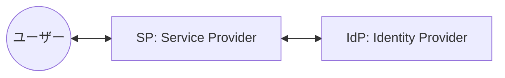
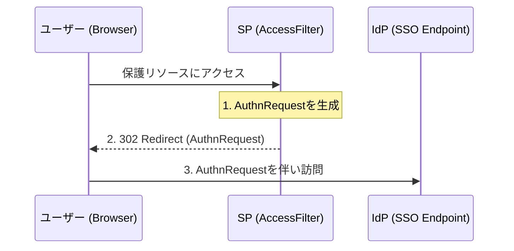
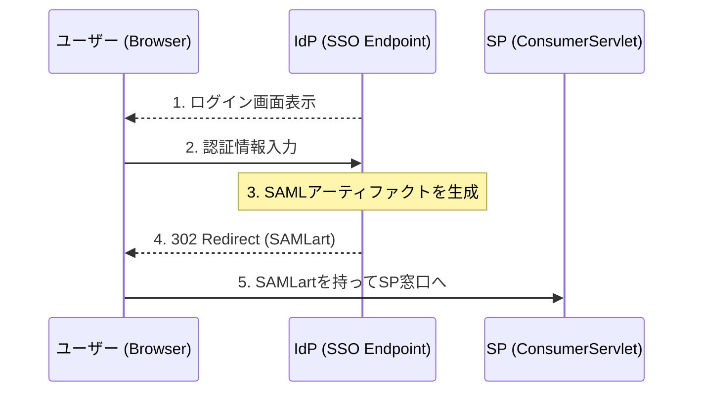
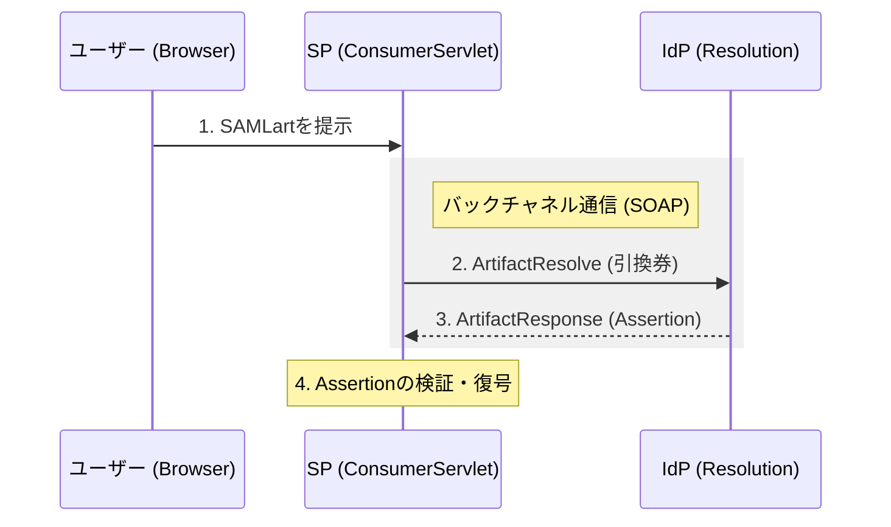

最近**SAML認証**について調べる機会があり、学ぶ過程でサンプルアプリも作ってみたのでその学びをシェアするための記事を書いてみました！

**SAML（Security Assertion Markup Language）** は、エンタープライズ領域のシングルサインオン（SSO）において欠かせない技術です。

しかし、その仕様の複雑さから「中身がよくわからないブラックボックス」として扱われることも少なくありません(自分も最初全く分からなかったです...)。

この記事では、Javaの標準的なライブラリである **OpenSAML 5** を使用したサンプルプロジェクトを題材に特にセキュリティレベルの高い **Artifact Binding** の仕組みと実装方法を詳しく解説していきます！

---

## この記事の対象読者

- SAMLについて学びたい方
- Spring Bootでの開発経験がある方
- OpenSAML5について学びたい方
- 認証・認可の基礎知識（Cookie/Sessionなど）がある方
- SAMLの概要は知っているが、具体的な実装やメッセージフローを理解したい方

---

## 今回作成したサンプルアプリ

ソースコードは以下のGitHubリポジトリに格納しています。

https://github.com/mashharuki/OpenSAML-sample-code

なお、こちらのソースコードは以下のコードをベースを作り直したものになります！

https://github.com/rasmusson/OpenSAML-sample-code

### 全体像



### 処理シーケンス図



### 技術スタック

- Java 21
- Spring Boot 3.3.0
- OpenSAML 5.1.6
- Jakarta EE 10

### エンドポイント

| パス | 説明 |
|------|------|
| `/app/appservlet` | 保護されたリソース（認証が必要） |
| `/idp/singleSignOnService` | IdP シングルサインオンエンドポイント |
| `/sp/consumer` | SP Assertion Consumer Service |
| `/idp/artifactResolutionService` | Artifact 解決エンドポイント |
| `/actuator/health` | ヘルスチェックエンドポイント |

## SAMLについて

### SAML関連の用語集 

SAML認証に関連する主要な用語の解説です！！

知らない用語が多かったのでまとめてみました！

| 用語 | 説明 |
| :--- | :--- |
| **Entity ID** | SPやIdPを一意に識別するためのURL形式の識別子。 |
| **Service Provider (SP)** | SAML認証を利用してサービスを提供する側のシステム（このアプリの `AccessFilter` や `ConsumerServlet`）。 |
| **Identity Provider (IdP)** | ユーザーの認証を行い、認証結果（アサーション）を発行する側のシステム（このアプリの `SingleSignOnServlet` や `ArtifactResolutionServlet`）。 |
| **Assertion (アサーション)** | ユーザーの認証成功事実や属性情報（名前、メールアドレス等）が含まれたXMLデータ。 |
| **AuthnRequest** | SPがIdPに対して「このユーザーを認証してほしい」と要求する際に送るリクエストメッセージ。 |
| **Response** | IdPが認証結果をSPに返すためのメッセージ。成功時にはアサーションが含まれる。 |
| **Protocol Binding** | SAMLメッセージをどのように伝送するかを定義する方式。以下の HTTP Redirect, POST, Artifact などの種類がある。 |
| **HTTP Redirect Binding** | メッセージをURLのクエリパラメータとして送信する方式（GET）。データは圧縮・エンコードされるため、AuthnRequestなどの小規模な通信に利用される。 |
| **HTTP POST Binding** | メッセージをHTMLフォームの隠しフィールドとして送信する方式（POST）。大容量のデータ（Assertionを含むResponseなど）を送信でき、ブラウザのURL履歴にメッセージが残らない。 |
| **Artifact Binding** | 本体メッセージの代わりに一時的な「引換券（アーティファクト）」をブラウザ経由で送る方式。本体はサーバー間で直接交換（バックチャネル）するため、最も安全性が高い。 |
| **SAML Artifact** | SAMLレスポンスの代わりに使用される、一時的な「引換券（チケット）」。有効期限が非常に短く、一度の交換で無効化される。 |
| **Artifact Resolve** | SPが受け取ったアーティファクト（引換券）を、本物のSAMLレスポンスと交換するためにIdPへ送るリクエスト。 |
| **ACS (Assertion Consumer Service)** | SP側でSAMLレスポンス（またはアーティファクト）を受け取るためのエンドポイント（このアプリの `ConsumerServlet`）。 |
| **Metadata** | SPとIdPの間で信頼関係を築くために交換する設定情報。エンドポイントURLや公開鍵証明書などが含まれる。 |
| **Front-channel** | ユーザーのブラウザを介した通信。リダイレクトやフォームPOSTなど、ユーザーの目に触れる経路。 |
| **Back-channel** | サーバー間で直接行われる通信（このアプリのArtifactResolveなど）。ユーザーのブラウザを介さないため安全。 |

### SAMLメッセージの構造 

SAMLでやり取りされるXMLメッセージの主要な構造と各要素の意味を解説していきます！！

#### 1. SAML Metadata
SPとIdPが互いの設定を共有するためのXMLファイルです。

- `<EntityDescriptor>`: 
  メタデータのルート要素。`entityID`属性でシステムを識別します。
- `<SPSSODescriptor>` / `<IDPSSODescriptor>`: 
  SP(サービスプロバイダー)またはIdP(認証プロバイダー)としての機能定義。
- `<KeyDescriptor>`: 
  署名検証や暗号化に使用する公開鍵証明書 (`X509Certificate`) が含まれます。
- `<SingleSignOnService>` (IdP用): 
  SPが認証リクエストを送る先のエンドポイント。
- `<AssertionConsumerService>` (SP用): 
  IdPが認証レスポンスを返す先のエンドポイント。

**例 (SPメタデータの一部):**

```xml
<md:EntityDescriptor 
    entityID="TestSP"  <!-- SPを一意に識別するID -->
    xmlns:md="urn:oasis:names:tc:SAML:2.0:metadata"
>
    <!-- SPとしての設定定義 -->
    <md:SPSSODescriptor protocolSupportEnumeration="urn:oasis:names:tc:SAML:2.0:protocol">
        <!-- 署名に使用する公開鍵情報 -->
        <md:KeyDescriptor use="signing">
            <ds:KeyInfo xmlns:ds="http://www.w3.org/2000/09/xmldsig#">
                <ds:X509Data>
                    <ds:X509Certificate>
                        MIIDDTCCAfWgAw... <!-- 公開鍵証明書本体 -->
                    </ds:X509Certificate>
                </ds:X509Data>
            </ds:KeyInfo>
        </md:KeyDescriptor>
        <!-- IdPからのレスポンス(アーティファクト)を受け取るURL -->
        <md:AssertionConsumerService 
            Binding="urn:oasis:names:tc:SAML:2.0:bindings:HTTP-Artifact" 
            Location="http://localhost:8080/opensaml5-webprofile-demo/sp/consumer" index="1"/>
    </md:SPSSODescriptor>
</md:EntityDescriptor>
```

#### 2. AuthnRequest (SAMLリクエスト)
SPが認証を要求する際に生成するXMLです。

- `<saml2p:AuthnRequest>`: 
  ルート要素。`ID`、`IssueInstant`（発行時刻）、`Destination`（送信先）などの属性を持ちます。
- `<saml2:Issuer>`: 
  リクエストを発行したSPのEntity ID。
- `<saml2p:NameIDPolicy>`: 
  要求するユーザー識別子（NameID）の形式。本アプリでは一時的なIDである `Transient` を指定しています。
- `<saml2p:RequestedAuthnContext>`: 
  要求する認証レベル。本アプリではパスワード認証 (`Password`) を最低条件として指定しています。

**例:**

```xml
<saml2p:AuthnRequest 
    xmlns:saml2p="urn:oasis:names:tc:SAML:2.0:protocol" 
    ID="_a1b2c3d4e5f6..." <!-- リクエストの一意なID -->
    IssueInstant="2024-01-01T00:00:00Z" <!-- 作成日時 -->
    Version="2.0"
    Destination="http://localhost:8080/opensaml5-webprofile-demo/idp/singleSignOnService" <!-- 送信先(IdP) -->
    ProtocolBinding="urn:oasis:names:tc:SAML:2.0:bindings:HTTP-Artifact" <!-- 応答にArtifactを要求 -->
    AssertionConsumerServiceURL="http://localhost:8080/opensaml5-webprofile-demo/sp/consumer"> <!-- 戻り先URL -->
    <saml2:Issuer xmlns:saml2="urn:oasis:names:tc:SAML:2.0:assertion">
        TestSP <!-- 発行元のSP名 -->
    </saml2:Issuer>
    <!-- ユーザー識別子(NameID)のポリシー設定 -->
    <saml2p:NameIDPolicy 
        AllowCreate="true" 
        Format="urn:oasis:names:tc:SAML:2.0:nameid-format:transient"
    />
    <!-- 要求する認証コンテキスト(認証方法) -->
    <saml2p:RequestedAuthnContext Comparison="minimum">
        <saml2:AuthnContextClassRef xmlns:saml2="urn:oasis:names:tc:SAML:2.0:assertion">
            urn:oasis:names:tc:SAML:2.0:ac:classes:Password <!-- パスワード認証を要求 -->
        </saml2:AuthnContextClassRef>
    </saml2p:RequestedAuthnContext>
</saml2p:AuthnRequest>
```

#### 3. SAML Response & Assertion (SAMLレスポンス)
IdPが認証結果を伝えるためのXMLです。

- `<saml2p:Response>`: 
  レスポンス全体のルート。
- `<saml2p:Status>`: 
  認証の成否。`<saml2p:StatusCode Value="...Success">` であれば成功です。
- `<saml2:Assertion>`: 
  **最重要要素。** 認証されたユーザーに関する「主張（Assertion）」が含まれます。
    - `<saml2:Subject>`: 
      誰が認証されたかを表す `NameID`。
    - `<saml2:Conditions>`: 
      アサーションの有効期限（`NotBefore`, `NotOnOrAfter`）。
    - `<saml2:AuthnStatement>`: 
      認証が行われた時刻や方法。
    - `<saml2:AttributeStatement>`: 
      ユーザーの属性情報（氏名、メールアドレス、ロールなど）。
- `<ds:Signature>`: 
  メッセージやアサーションが正当な送信者から送られ、改ざんされていないことを証明するデジタル署名。

**例:**

```xml
<saml2p:Response 
    xmlns:saml2p="urn:oasis:names:tc:SAML:2.0:protocol" 
    ID="_f0e9d8c7..." 
    InResponseTo="_a1b2c3d4..." <!-- どのリクエストへの応答か -->
    IssueInstant="2024-01-01T00:00:05Z" 
    Version="2.0"
    Destination="http://localhost:8080/opensaml5-webprofile-demo/sp/consumer"
>
    <!-- 発行者(IdP)の情報 -->
    <saml2:Issuer xmlns:saml2="urn:oasis:names:tc:SAML:2.0:assertion">
        TestIDP
    </saml2:Issuer>
    <!-- ステータスコード(成功/失敗) -->
    <saml2p:Status>
        <saml2p:StatusCode Value="urn:oasis:names:tc:SAML:2.0:status:Success"/>
    </saml2p:Status>
    <!-- アサーション本体 -->
    <saml2:Assertion 
        xmlns:saml2="urn:oasis:names:tc:SAML:2.0:assertion" 
        ID="_m0n9b8v7..." 
        IssueInstant="2024-01-01T00:00:05Z" 
        Version="2.0"
    >
        <saml2:Issuer>TestIDP</saml2:Issuer>
        <!-- 認証されたユーザー情報 -->
        <saml2:Subject>
            <saml2:NameID Format="urn:oasis:names:tc:SAML:2.0:nameid-format:transient">
                user-123 <!-- ユーザーID(一時ID) -->
            </saml2:NameID>
        </saml2:Subject>
        <!-- 認証に関する詳細(時刻・方法など) -->
        <saml2:AuthnStatement AuthnInstant="2024-01-01T00:00:05Z">
            <saml2:AuthnContext>
                <saml2:AuthnContextClassRef>
                    urn:oasis:names:tc:SAML:2.0:ac:classes:Password
                </saml2:AuthnContextClassRef>
            </saml2:AuthnContext>
        </saml2:AuthnStatement>
        <!-- ユーザーの属性情報 -->
        <saml2:AttributeStatement>
            <saml2:Attribute Name="email">
                <saml2:AttributeValue>
                    user@example.com
                </saml2:AttributeValue>
            </saml2:Attribute>
        </saml2:AttributeStatement>
    </saml2:Assertion>
</saml2p:Response>
```

ここから重要なポイントをかいつまんで解説していきます！！

## 1. 登場人物と役割の整理

SAML連携において、システムは以下の2つの役割のいずれか（あるいは両方）を演じます。

| 役割 | 略称 | 説明 | 本プロジェクトでの実装例 |
| :--- | :--- | :--- | :--- |
| **Service Provider** | **SP** | サービスを提供する側<br/>ユーザーの認証状態を管理する。 | `AccessFilter`<br/> `ConsumerServlet` |
| **Identity Provider** | **IdP** | 本人確認を行う側<br/>ユーザー情報を管理し、証明書を発行する。 | `SingleSignOnServlet`<br/> `ArtifactResolutionServlet` |




---

## 2. SAML Artifact Binding の詳細シーケンス

SAMLには複数の運び方（Binding）がありますが、今回はブラウザ経由で機密情報を直接流さない **Artifact Binding** を採用したフローを追います。

### Scene 1: 認証リクエストの送出 (SAML Request)

未認証のユーザーがSPの保護リソースにアクセスすると、SPの門番（`AccessFilter`）が **AuthnRequest** を生成し、ユーザーをIdPへリダイレクトさせます。



### Scene 2: 認証とアーティファクトの発行(SAML レスポンスの生成)

IdPはユーザーを認証（ログイン）させた後、情報の「引換券」である **SAMLアーティファクト** を発行します。本物のデータ（Assertion）はこの時点ではユーザーに渡されません。



### Scene 3: バックチャネルによる情報交換 (Artifact Resolve)

SPの窓口（`ConsumerServlet`）は受け取ったアーティファクトを使い、サーバー間通信（バックチャネル）でIdPに本物のデータを問い合わせます。



#### なぜ Artifact Binding なのか？（セキュリティの観点）

Artifact Binding が他の方式（HTTP POST Bindingなど）より優れている点は以下の通りです。

- **機密性の向上**: 
  ユーザー情報を保持する `Assertion` がユーザーのブラウザを通過しません。これにより、ブラウザの履歴やキャッシュから機密情報が漏洩するリスクを低減します。
- **リプレイ攻撃への耐性**: 
  アーティファクトは一度きりの使い捨てであり、短時間で有効期限が切れるように設計されています。
- **サイズ制限の回避**: 
  HTTP RedirectではURLの長さに制限がありますが、バックチャネル通信であれば大きなデータも安全に送受信できます。

### Scene 4: 認証完了とセッション確立
SPは取得した情報を検証し、正当であればアプリケーション内でのログイン状態（Session）を確立します。その後、ユーザーを本来のSPのページ(ダッシュボードかトップページ)にリダイレクトさせます。

---

## 3. 実装深掘り：OpenSAML 5 によるコード解説

主要なコンポーネントにおける実装のポイントを、例外処理を含めて見ていきましょう！

### ① AuthnRequest の生成

**クラス**: `no.steras.opensamlSamples.opensaml4WebprofileDemo.sp.AccessFilter`  
**メソッド**: `buildAuthnRequest()`

このメソッドでは、必要なデータを色々詰めてSAMLリクエストに必要なXMLを作成します。

```java
/**
	 * OpenSAML オブジェクトを使用して AuthnRequest を詳細に構成します。
	 */
	private AuthnRequest buildAuthnRequest() {
		AuthnRequest authnRequest = OpenSAMLUtils.buildSAMLObject(AuthnRequest.class);
		
		// 1. 各種メタデータの設定
		authnRequest.setIssueInstant(Instant.now());
		authnRequest.setDestination(getIPDSSODestination()); // 送信先(IdP)のSSOエンドポイント
		
		// 2. 認証後のレスポンスとして Artifact Binding を要求
		authnRequest.setProtocolBinding(SAMLConstants.SAML2_ARTIFACT_BINDING_URI);
		
		// 3. 認証後の戻り先（ACS）を指定
		authnRequest.setAssertionConsumerServiceURL(getAssertionConsumerEndpoint());
		
		// 4. 一意なIDと発行者（SP）の設定
		authnRequest.setID(OpenSAMLUtils.generateSecureRandomId());
		authnRequest.setIssuer(buildIssuer());
		
		// 5. ユーザー識別子(NameID)のポリシーと必須認証レベルの設定
		authnRequest.setNameIDPolicy(buildNameIdPolicy());
		authnRequest.setRequestedAuthnContext(buildRequestedAuthnContext());

		return authnRequest;
	}
```

### ② バックチャネルでのアーティファクト解決(SAMLレスポンスとアサーションの検証)

**クラス**: `no.steras.opensamlSamples.opensaml4WebprofileDemo.sp.ConsumerServlet`  
**呼び出しフロー**: `doGet()` -> `resolveArtifact()`

SOAP通信を用いてIdPからアサーションを受け取ります。  

その後、アサーションの検証を行い、問題なければ認証が成功しセッションが確立されることになります。

```java
// SOAP/1.1 パイプラインの構築
AbstractPipelineHttpSOAPClient soapClient = new AbstractPipelineHttpSOAPClient() {
    protected HttpClientMessagePipeline newPipeline() throws SOAPException {
        // エンコーダー、デコーダー、および署名ハンドラー等の設定
        // ...
        return new BasicHttpClientMessagePipeline(encoder, decoder);
    }
};

try {
    soapClient.send(IDP_RESOLUTION_URL, context);
} catch (IOException | MessageException e) {
    log.error("IdPとの通信に失敗しました", e);
    throw new ServletException("Artifact resolution failed");
}
```

### ③ Assertion の完全性と機密性の保護

取得したデータは、**「改ざんされていないか（署名検証）」** と **「中身を保護できているか（復号）」** の両面から検証が必要です。

```java
	/**
	 * メッセージが自分宛であること、および発行から時間が経ちすぎていないことを検証します。
	 */
	private void validateDestinationAndLifetime(ArtifactResponse artifactResponse, HttpServletRequest request) {
		MessageContext context = new MessageContext();
		context.setMessage(artifactResponse);

		SAMLMessageInfoContext messageInfoContext = context.getSubcontext(SAMLMessageInfoContext.class, true);
		messageInfoContext.setMessageIssueInstant(artifactResponse.getIssueInstant());

		// メッセージ有効期限のチェック（発行時刻から指定時間内であること）
		MessageLifetimeSecurityHandler lifetimeSecurityHandler = new MessageLifetimeSecurityHandler();
		lifetimeSecurityHandler.setClockSkew(Duration.ofMillis(1000)); // クロックのずれ許容
		lifetimeSecurityHandler.setMessageLifetime(Duration.ofMillis(2000)); // 有効期間
		lifetimeSecurityHandler.setRequiredRule(true);
		
		// 宛先 URL のチェック（Destination 属性がリクエスト URL と一致すること）
		ReceivedEndpointSecurityHandler receivedEndpointSecurityHandler = new ReceivedEndpointSecurityHandler();
		receivedEndpointSecurityHandler.setHttpServletRequestSupplier(() -> request);
		
		try {
			lifetimeSecurityHandler.initialize();
			receivedEndpointSecurityHandler.initialize();
			
			// ハンドラーチェーンとして実行
			BasicMessageHandlerChain handlerChain = new BasicMessageHandlerChain();
			List<MessageHandler> handlers = new ArrayList<>();
			handlers.add(lifetimeSecurityHandler);
			handlers.add(receivedEndpointSecurityHandler);
			handlerChain.setHandlers(handlers);
			
			handlerChain.initialize();
			handlerChain.doInvoke(context);
		} catch (ComponentInitializationException | MessageHandlerException e) {
			throw new RuntimeException("メッセージのセキュリティ検証に失敗しました", e);
		}
	}

	/**
	 * SP の秘密鍵を使用して、暗号化されたアサーションを復号します。
	 */
	private Assertion decryptAssertion(EncryptedAssertion encryptedAssertion) {
		StaticKeyInfoCredentialResolver keyInfoCredentialResolver = new StaticKeyInfoCredentialResolver(
				SPCredentials.getCredential());

		// 復号機の設定
		Decrypter decrypter = new Decrypter(null, keyInfoCredentialResolver, new InlineEncryptedKeyResolver());
		decrypter.setRootInNewDocument(true);

		try {
			return decrypter.decrypt(encryptedAssertion);
		} catch (DecryptionException e) {
			throw new RuntimeException("アサーションの復号に失敗しました", e);
		}
	}

	/**
	 * アサーションのデジタル署名を検証します。
	 */
	private void verifyAssertionSignature(Assertion assertion) {
		if (!assertion.isSigned()) {
			throw new RuntimeException("SAMLアサーションに署名がありません。セキュリティリスクがあります。");
		}

		try {
			// XML署名の構文とプロファイルが正しいか検証
			SAMLSignatureProfileValidator profileValidator = new SAMLSignatureProfileValidator();
			profileValidator.validate(assertion.getSignature());

			// IdP の公開鍵を使用して署名を数学的に検証
			SignatureValidator.validate(assertion.getSignature(), IDPCredentials.getCredential());
		} catch (SignatureException e) {
			throw new RuntimeException("アサーションの署名検証に失敗しました。メッセージが改ざんされている可能性があります。", e);
		}
	}
```

---

## 4. OpenSAML 5 重要メソッド・リファレンス

OpenSAML5における重要なメソッドを紹介します！

**SAML認証**の処理の実態は、**XMLファイルとアサーションの生成**とその**検証**です。

| メソッド | 引数 / 戻り値 | 役割 |
| :--- | :--- | :--- |
| **`buildSAMLObject`** | `(Class<T>)` / `T` | SAML各要素に対応するビルダーを呼び出し、適切なNamespaceを持つオブジェクトを生成する。 |
| **`initialize`** | `()` / `void` | コンポーネント（署名、暗号化、検証器など）の設定を確定させ、使用可能な状態にする。 |
| **`profileValidator.validate`** | `(Signature)` / `void` | 署名の構造がSAML仕様（プロファイル）に適合しているか、許容されないアルゴリズムがないかを確認する。 |
| **`SignatureValidator.validate`** | `(Signature, Credential)` / `void` | 公開鍵を用いてデジタル署名の数学的な正当性を検証する。 |

---

## 5. 動かし方

### ローカル版

`backend`配下で実行してください。

まずはコンパイルします。

```bash
mvn clean package
```

コンパイルが完了したら以下のコマンドでSpringBootアプリを起動させます！


```bash
mvn spring-boot:run
```

または、JARファイルを直接実行してもOKです！

```bash
java -jar target/opensaml5-webprofile-demo-1.0-SNAPSHOT.jar
```

その後、ブラウザを開いて http://127.0.0.1:8080/opensaml5-webprofile-demo/app/appservlet にアクセスしてください！

IdPの認証画面にアクセスできるはずです！！

### AWS Lambdaで動かしてみた

せっかくなのでAWSでも動かしてみました。

今回も**Lambda Web Adapter**を採用(便利すぎる)！

AWSのリソースは**CDK**で管理しています！

> スタックファイルは以下で確認が可能です。

API Gateway + Lambdaによるめちゃくちゃシンプルな実装です。

https://github.com/mashharuki/OpenSAML-sample-code/blob/main/cdk/lib/cdk-stack.ts

ECRにログインしておく必要があるためまずは以下のコマンドを順番に実行します。

```bash
# アカウントIDとリージョンを環境変数化
export AWS_ACCOUNT_ID=$(aws sts get-caller-identity --query Account --output text)
export AWS_REGION=$(aws configure get region)
# ECR にログイン
aws ecr get-login-password --region $AWS_REGION | docker login --username AWS --password-stdin $AWS_ACCOUNT_ID.dkr.ecr.$AWS_REGION.amazonaws.com
```

これでOK!

`cdk`ディレクトリ配下で以下のコマンドを打てばリソースが展開されます！

```bash
bun run deploy
```

成果物としてAPI GatewayのURLが出力されるのであとはローカルでアクセスした時と同じエンドポイントにアクセスすればOKです！！

## 6. まとめ

SAML 2.0 は一見複雑ですが、以下の3つの原則に基づいて設計されています！

1.  **信頼の確立**: 
  メタデータ（xml）を事前交換し、Entity IDや証明書を共有しておく。
2.  **安全な伝達**: 
  フロントチャネル（ブラウザ）とバックチャネル（サーバー間）を使い分け、情報の露出を最小化する。
3.  **検証可能性**: 
  すべての主張（Assertion）がデジタル署名によって立証可能である。

特に Artifact Binding はセキュリティ要件の厳しい商用環境において非常に重要なパターンです。

この記事が、OpenSAML 5 を用いた堅牢な SSO 実装への一助となれば幸いです。

ここまで読んでいただきありがとうございました！！

