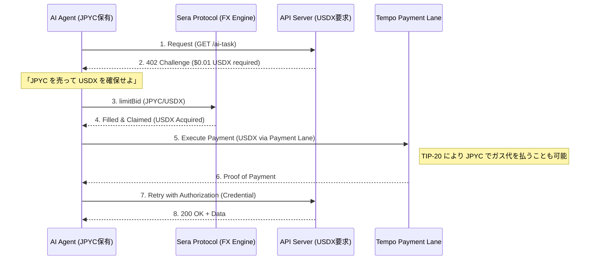

:::message
この記事はAIと力を合わせて執筆しました！
:::

# エバンジェリストとして、最初の「大仕事」を始めます。

みなさん、こんにちは！

これまで連載形式で **Sera Protocol** の技術を追いかけ、MCPサーバーを組み、[Agent SKILL](https://zenn.dev/mashharuki/articles/web3_sera_protocol-7) まで作り込んできました。

そして今日のテーマは、先日Stripe と Tempo が共同発表した **Machine Payments Protocol (MPP)** との組み合わせについての考察です！

https://zenn.dev/mashharuki/articles/mpp-machine-payments-protocol

MPP によって AI は「支払う手」を手に入れました。しかし、国境を越えた瞬間に **「通貨の壁」** という現実が立ちはだかります。この壁を Sera Protocol がどう解決するのかを考察してみました。

# 1. AIエージェントが直面する「両替の壁」

MPP（Machine Payments Protocol）は、HTTP 402 「Payment Required」を 20 年越しに実用化し、AI が単一のリクエストでサービスの発見から決済までを完結させるためのプロトコルです。

しかし、現場ではこんな悲劇が起きています。

- **APIサーバー（米国）**:   
  「この画像生成は **$0.01 USDX**（USDステーブルコイン）だよ」
- **AIエージェント（日本）**:   
  「自分、**JPYC**（日本円ステーブルコイン）しか持ってないっす...」

人間なら「クレカが裏でやってくれるでしょ」で済みますが、自律的に動く AI エージェントにとってこの通貨の不一致は **「サービス利用不可」** を意味します。

マシンの世界では、誰かがオンチェーンでかつ瞬時に両替を代行しなければなりません。これがマシンのための外貨両替 **「OnChain FX」** の必然性です。

# 2. Tempo L1 が敷く「高速道路」と、Sera が提供する「ガソリン」

Tempo の公式ドキュメント（[OnChain FX](https://docs.tempo.xyz/learn/tempo/fx#onchain-fx)）を読むと、彼らが目指しているのは「ステーブルコイン・サンドイッチ」の解消であることがわかります。

従来のクロスボーダー決済は、「ローカル通貨 → USDステーブルコイン → ローカル通貨」という多段構成で、オフチェーンの銀行や取引所を介すため、時間も手数料もかかりすぎていました。

ここで **Tempo L1** と **Sera Protocol** のシナジーが爆発します。

### Tempo L1 の「Payment Lanes」
Tempo は決済専用のブロックスペース **「Payment Lanes」** を持っています。NFT のミント騒ぎでガス代が跳ね上がっても、決済トラフィックだけは影響を受けずに 0.1 セントで駆け抜けます。

### TIP-20 の「マルチ通貨手数料」
Tempo のトークン規格 **TIP-20** の凄いところは、**「USDX でも JPYC でも、好きなステーブルコインでガス代を支払える」** 点です。わざわざネイティブトークン（ETH等）を別に持つ必要がありません。

この「決済に特化した高速道路」の上で、**異なる通貨をアトミックに結びつけるエンジン**。それが Sera Protocol です。

# 3. なぜ AI エージェントには「板取引（CLOB）」が必要なのか？

「Uniswap みたいな AMM でいいじゃん」と思うかもしれません。しかし、AI エージェントにとって AMM は **「不確実性の塊」** です。

1. **「納得感」のある指値**:    
   AI は論理で動きます。AMM のように「いくらで約定するかは運次第」というスリッページを AI は嫌います。Sera なら「このレートなら買う、そうでなければ待つ」という **自律的な意思決定** が可能です。
2. **インデックス管理の魔術**:   
   Sera の算術価格モデル（Arithmetic Price Model）は、価格を `uint16` のインデックスで管理します。これは AI にとって「数値」として扱いやすく、複数のマーケット間での裁定や価格比較を爆速で行えることを意味します。
3. **Order NFT による権利の移転**:   
   Sera の注文は NFT です。AI は「両替した USDX そのもの」を渡すのではなく、「両替が完了したという権利（NFT）」をそのままサービス提供側に転送する、といった次世代の決済フローも構築できます。

# 4. シナジー解剖：MPP + Sera のアトミック・フロー

AI エージェントが Sera と MPP を組み合わせてクロスボーダー決済を行う際、もはや「両替所に行く」という概念は消え、**「支払いのプロセスの一部に両替が組み込まれる」** ようになります。



このフローにより、AI は **「自分がどの通貨を持っているか」を意識せずに、世界中のリソースを買い叩ける** ようになります。

# 5. 実装イメージ：自律型エージェントの「両替・決済」ロジック

もしあなたが [MCP サーバー](https://zenn.dev/mashharuki/articles/web3_sera_protocol-6) で AI に手足を与えているなら、そのコードは驚くほどシンプルになります。

```typescript
// AIエージェントが 402 Challenge を受け取った時の内部思考
async function onPaymentRequired(challenge: MPPChallenge) {
  const { amount: usdAmount, currency } = challenge; // 0.01 USDX
  
  // 1. レートを納得するまでチェック
  const bestRate = await sera.getBestPrice('JPYC/USDX');
  if (bestRate > MY_ACCEPTABLE_LIMIT) {
    throw new Error("為替レートが悪すぎるため、今は買いません。");
  }

  // 2. 支払いに必要な分だけピンポイントで両替
  // Sera の Index 指定なら、10.5 JPYC などの端数も正確に扱える
  const tx = await sera.swapAndClaim({
    from: 'JPYC',
    to: 'USDX',
    amount: usdAmount,
    index: bestRate
  });

  // 3. 確保した USDX で即座に支払い
  return await mpp.pay(challenge, {
    useToken: 'USDX',
    gasToken: 'JPYC' // ここが Tempo の真骨頂！
  });
}
```

「自分がどの通貨を使い、どの通貨で手数料を払うか」を AI がその場のレートで最適化する。これこそが、Stripe と Sera が作る **「プログラム可能な経済」** の実態です。

# マシン経済の夜明けは、すぐそこまで来ています。

これまで Sera Protocol を「新しい DEX」として紹介してきましたが、Tempo MPP と出会うことでその輪郭が完全に見えました。

Sera は、**マシン経済における「通貨の翻訳機」** です。

Stripe が広げた決済の網、Tempo が敷いた高速道路、そして Sera Protocol が整えた「通貨の形」。この 3 つが揃った今、AI エージェントが真の意味で自由に世界中を駆け巡る準備が整いました。

エバンジェリストとして、このエキサイティングな未来を皆さんと一緒に実装していきたい。ハッカソンで、この「自律両替支払いエージェント」の実物をお披露目できる日を楽しみにしています。

次はあなたの AI に、Sera という「最強の両替商」を授けてみませんか？

--- 

**参考文献:**
- [Tempo Docs: Onchain FX](https://docs.tempo.xyz/learn/tempo/fx#onchain-fx)
- [Stripe Blog: Machine Payments Protocol](https://stripe.com/blog/machine-payments-protocol)
- [Sera Protocol Official Documentation](https://docs.sera.cx/)
- [連載：Sera Protocol 徹底解説シリーズ](https://zenn.dev/mashharuki)
