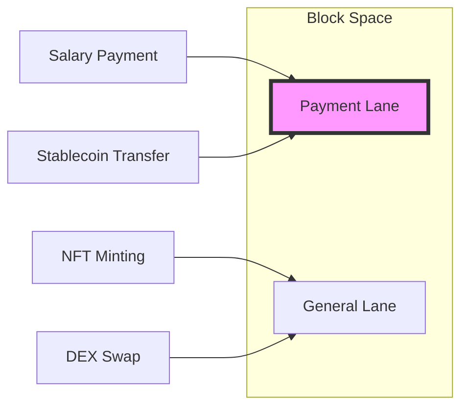
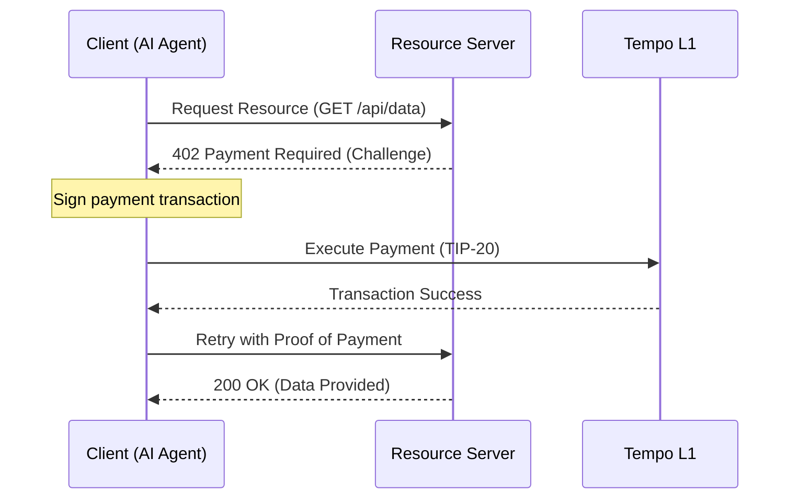

# はじめに

みなさん、こんにちは！

ついに、あの「決済の巨人」Stripeが独自のL1ブロックチェーン**Tempo**をメインネットローンチしました。Web3界隈だけでなく、既存のフィンテック業界にも激震が走っています。

正直に告白しましょう。私は以前、あるプロジェクトで報酬をステーブルコインで支払おうとした際、メインネットのガス代が急騰。**数ドルの送金に数十ドルのガス代を要求され、結局支払いを断念せざるを得なかったという「冷や汗モノ」の苦い経験があります。** あの時の「ブロックチェーンは決済にはまだ早いのか…」という絶望感。

しかし、Tempoの技術ドキュメントを読み込んだ今、断言できます。
これは単なる「もう一つの高速チェーン」ではありません。**インターネット・ネイティブな決済インフラとしての「究極の解答」に他なりません。**

この記事では、Tempoの概要から、決済に特化したユニークな機能、そしてAIエージェント時代を見据えた新規格「MPP（x402）」との関係性まで、エンジニア目線で徹底的に解剖していきます。

# 1. Tempoとは？：決済のために再定義されたL1

**Tempo**は、ステーブルコインによる決済、即時かつ決定論的な確定性（ファイナリティ）、そして予測可能で低コストな手数料を実現するために最適化された、汎用目的のブロックチェーンです。

技術的な最大の特徴は、**最もパフォーマンスが高いEVM実行クライアントである「Reth SDK」を基盤にしていること**です。

### 主要なスペック
- **コンセンサス:** Simplex BFT（約0.5秒という極めて短いブロック時間）
- **パフォーマンス:** テストネットで20,000 TPS以上を記録
- **互換性:** 完全なEVM互換（SolidityやFoundryがそのまま利用可能）

単に速いだけではありません。従来のブロックチェーンが抱えていた「NFTのミント騒ぎでガス代が跳ね上がり、給与支払いが滞る」といった決済における致命的な課題を、プロトコルレベルでねじ伏せています。

# 2. 決済の「痛み」を解決する3つの独自機能

Tempoには、従来のERC-20やEthereumにはなかった、決済実務に不可欠な機能が「標準装備」されています。

## ① Payment Lanes（決済専用レーン）
DeFi活動や複雑なスマートコントラクトによる混雑から決済を保護するため、Tempoはプロトコルレベルで「専用ブロックスペース」を確保しています。



これにより、市場の混乱に左右されず、目標1件あたり**0.1セント**という極めて低コストで決済が実行可能です。これが決済特化型L1の「正解」です。

## ② TIP-20 トークン規格
従来のERC-20を拡張したTempoネイティブの規格が**TIP-20**です。

- **転送メモ (32バイト):** トランザクションに参照データを付加できます。請求書番号や顧客IDを記録することで、バックエンドシステムとの自動照合が可能になります。
- **手数料トークンの選択:** なんと、**USD建てのステーブルコインで直接ガス代を支払えます**。ユーザーが別途ネイティブトークンを保有する必要はありません。

## ③ モダンなトランザクション構造
EIP-2718を採用し、他のチェーンではサードパーティ製のミドルウェアが必要だった機能をネイティブサポートしています。
- **パスキー認証:** Face IDや指紋認証で署名可能。
- **ガス代スポンサーシップ:** アプリ側がユーザーの代わりに手数料を肩代わり。
- **並列トランザクション:** 「期限付きナンス」により、複数の取引を同時に送信可能。

# 3. コンプライアンスの「新標準」：TIP-403

決済において避けて通れないのが規制対応です。Tempoはここにも独自の解答を用意しています。それが**TIP-403（ポリシーレジストリ）**です。

通常、複数のステーブルコインを発行する場合、個々のコントラクトでブラックリストなどを管理する必要があります。しかしTIP-403では、**「ポリシー（規約）」を一度作成すれば、複数のトークンで共有可能**です。

例えば、ある特定のアドレスを規制対象とする場合、ポリシーレジストリを1回更新するだけで、そのポリシーを参照しているすべてのTIP-20トークンに対して即座にルールが適用されます。この運用効率の高さこそ、実務を知り尽くしたStripeならではの設計です。

# 4. x402 / MPP との関係性：マシン経済のインフラへ

ここが最もエキサイティングなポイントです。StripeとTempoは、共同で**Machine Payments Protocol (MPP)** というオープン規格を策定しました。

Web3業界では「x402」とも呼ばれるこのプロトコルは、HTTP 402 「Payment Required」ステータスコードを活用した、**AIエージェントやアプリ間での自律的な決済**を可能にします。



TempoはこのMPPにおける**「決済レール（Stablecoin Rail）」**としての役割を担い、マシンのための財布として機能します。AIエージェントがAPIコールごとに自律的に支払う未来は、もうすぐそこです。

# 5. 今すぐ始める：Tempo SDK で決済を送る

「理屈はわかった。で、どうやって動かすの？」という方のために、TypeScript SDKでの最小実装例を紹介します。

```typescript
import { TempoClient, Wallet } from '@tempoxyz/sdk';

const client = new TempoClient('https://rpc.tempo.xyz');
const wallet = new Wallet(process.env.PRIVATE_KEY!);

// ステーブルコインでの送金（メモ付き）
const tx = await client.transfer({
  to: '0x...',
  amount: '10.00',
  token: 'USDX', // TIP-20
  memo: 'INV-2026-001', // 32バイトの転送メモ
});

console.log(`Payment Sent: ${tx.hash}`);
```

これだけで、ステーブルコインでの決済が完了します。従来のWeb2的な直感でWeb3を操作できる、この開発体験の良さがTempoの真骨頂です。

# おわりに

StripeがTempoを作った理由は、単なるWeb3への進出ではありません。彼らが目指しているのは、**「プログラム可能な経済」の基盤そのもの**を構築することです。

開発者としての視点で見れば、パスキー認証、ステーブルコインでのガス代支払い、そしてMPPによるマシン決済。これらが揃うことで、ユーザー体験はこれまでのブロックチェーンとは比較にならないほど滑らかになります。

まさに、**「ブロックチェーンを意識させない決済体験」**の始まりです。

決済の未来は、すでにここ（Tempo）で動き始めています。さあ、あなたもこのリズム（Tempo）に乗って、新しい決済の形を構築してみませんか？

---
**参考文献:**
- [Tempo Docs: Learn](https://docs.tempo.xyz/learn)
- [Modern Transactions on Tempo](https://docs.tempo.xyz/learn/tempo/modern-transactions)
- [Machine Payments Protocol Specification](https://docs.tempo.xyz/protocol/machine-payments)
- [TIP-20: Native Stablecoins](https://docs.tempo.xyz/protocol/tip20/overview)
