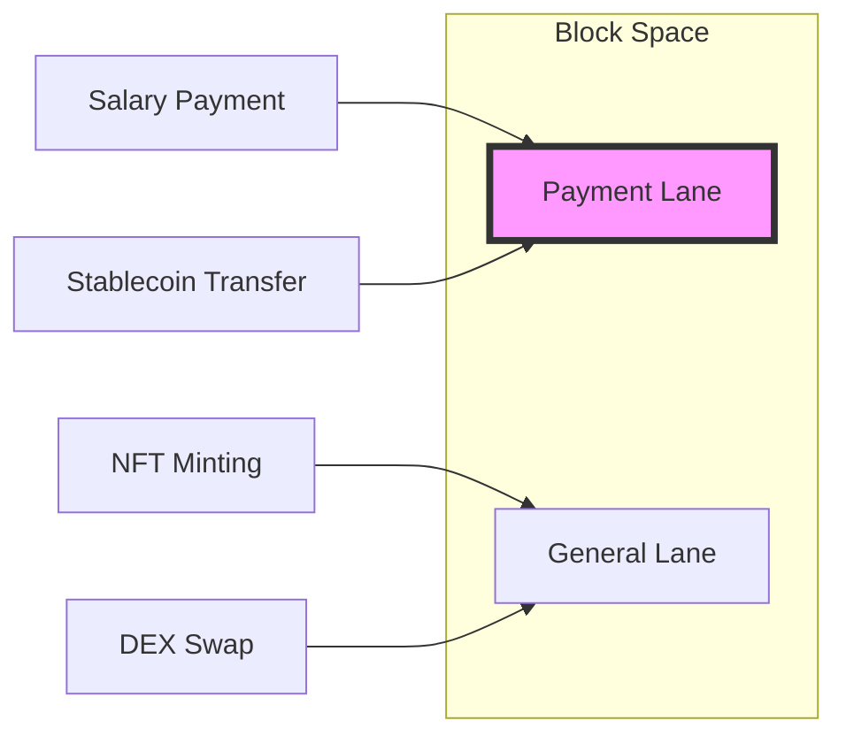
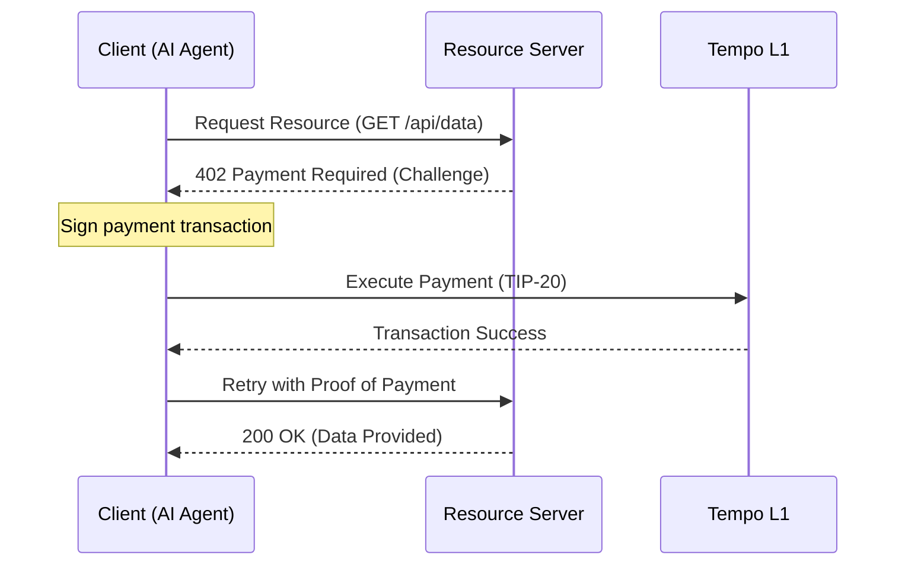

> この記事はAIと力を合わせて執筆しました！

# はじめに

みなさん、こんにちは！

金融業界で著名な**Stripe**が独自のL1ブロックチェーン**Tempo**をメインネットローンチしました。Web3界隈だけでなく、既存のフィンテック業界にも激震が走っています！


実は**Stripe**は暗号資産ウォレットを提供する**privy**を買収したり、イベントではステーブルコインをテーマにしたセッションを組んでいたりとこの領域に踏み込むための準備を着々と進めていました。

https://privy.io/blog/announcing-our-acquisition-by-stripe

https://stripe.com/jp/newsroom/news/tour-newyork-2025

正直、Stripeがブロックチェーンを作るといったときに「またブロックチェーン作るのか...」と思っていましたが、Tempoの技術ドキュメントを読み込んで見たところ他のブロックチェーンとは異なるアプローチを採用していることなどがわかってきました！

この記事ではTempoの概要から決済に特化したユニークな機能、そしてAIエージェント時代を見据えた新規格 **「MPP」** との関係性までエンジニア目線で徹底的に解剖していきます。

ぜひ最後まで読んでいってください！

# 1. Tempoとは？：決済のために再定義されたL1

**Tempo**はステーブルコインによる決済、即時かつ決定論的な確定性（ファイナリティ）、そして予測可能で低コストな手数料を実現するために最適化された汎用目的のブロックチェーンです。 

https://docs.tempo.xyz/learn/tempo

技術的な最大の特徴は、**最もパフォーマンスが高いEVM実行クライアントである「Reth SDK」を基盤にしていること**です。

https://docs.tempo.xyz/learn/tempo/performance

### 主要なスペック

- **コンセンサス:** Simplex BFT（約0.5秒という極めて短いブロック時間）
- **パフォーマンス:** テストネットで20,000 TPS以上を記録
- **互換性:** [完全なEVM互換](https://docs.tempo.xyz/quickstart/evm-compatibility)（SolidityやFoundryがそのまま利用可能）

https://docs.tempo.xyz/quickstart/evm-compatibility

単に速いだけではありません。

従来のブロックチェーンが抱えていた「NFTのミント騒ぎでガス代が跳ね上がり、給与支払いが滞る」といった決済における致命的な課題をプロトコルレベルで解決しようとしています。

# 2. 決済の「痛み」を解決する3つの独自機能

Tempoには、従来のERC-20やEthereumにはなかった、決済実務に不可欠な機能が「標準装備」されています。 

ttps://docs.tempo.xyz/learn/tempo/native-stablecoins

## ① Payment Lanes（決済専用レーン）
DeFi活動や複雑なスマートコントラクトによるトランザクション混雑から決済を保護するためTempoはプロトコルレベルで **「専用ブロックスペース」** を確保しています。 

https://docs.tempo.xyz/protocol/blockspace/payment-lane-specification



これにより、市場の混乱に左右されず目標1件あたり**0.1セント**という極めて低コストで決済が実行可能です。

このように決済に特化した設計となっているところが他のブロックチェーンとは少し異なる点ですね。

## ② TIP-20 トークン規格

従来のERC-20を拡張したTempoネイティブの規格が**TIP-20**です。

https://docs.tempo.xyz/protocol/tip20/overview

- **転送メモ (32バイト):** 
    トランザクションに参照データを付加できます。請求書番号や顧客IDを記録することで、バックエンドシステムとの自動照合が可能になります。 ([Transfer Memos Guide](https://docs.tempo.xyz/guide/payments/transfer-memos))
- **手数料トークンの選択:**  
    なんと、**USD建てのステーブルコインで直接ガス代を支払えます**。ユーザーが別途ネイティブトークンを保有する必要はありません。 ([Pay Fees in Stablecoins](https://docs.tempo.xyz/guide/payments/pay-fees-in-any-stablecoin))

## ③ モダンなトランザクション構造

EIP-2718を採用し他のチェーンではサードパーティ製のミドルウェアが必要だった機能をネイティブサポートしています。 

https://docs.tempo.xyz/learn/tempo/modern-transactions

- **パスキー認証:**   
    Face IDや指紋認証で署名可能。 ([Embed Passkeys Guide](https://docs.tempo.xyz/guide/use-accounts/embed-passkeys))
- **ガス代スポンサーシップ:**.  
    アプリ側がユーザーの代わりに手数料を肩代わり。 ([Sponsor User Fees Guide](https://docs.tempo.xyz/guide/payments/sponsor-user-fees))
- **並列トランザクション:**.  
    「期限付きナンス」により、複数の取引を同時に送信可能。 ([Send Parallel Transactions](https://docs.tempo.xyz/guide/payments/send-parallel-transactions))

**privy**を買収したのでウォレット周りにUI/UXは最高に良いですね！

後発のブロックチェーンではありますが、随所から先発のプロジェクトのことをよく研究されているなと感じました。

# 3. コンプライアンスの「新標準」：TIP-403

決済において避けて通れないのが規制対応です。Tempoはここにも独自の解答を用意しています。

それが **TIP-403（ポリシーレジストリ）** です。

https://docs.tempo.xyz/protocol/tip403/overview

通常、複数のステーブルコインを発行する場合個々のコントラクトでブラックリストなどを管理する必要があります。

しかしTIP-403では、**「ポリシー（規約）」を一度作成すれば、複数のトークンで共有可能**です。

例えば、ある特定のアドレスを規制対象とする場合、ポリシーレジストリを1回更新するだけでそのポリシーを参照しているすべてのTIP-20トークンに対して即座にルールが適用されます。

この運用効率の高さこそ、実務を知り尽くしたStripeならではの設計だと感じました。

# 4. x402 / MPP との関係性：マシン経済のインフラへ

ここが一番面白くTempoが期待できるポイントです。

StripeとTempoは共同で**Machine Payments Protocol (MPP)** というオープン規格を策定しました。

https://docs.tempo.xyz/learn/tempo/machine-payments

Web3業界では「x402」とも呼ばれるこのプロトコルは、HTTP 402 「Payment Required」ステータスコードを活用した**AIエージェントやアプリ間での自律的な決済**を可能にします。



TempoはこのMPPにおける **「決済レール（Stablecoin Rail）」** としての役割を担い、マシンのための財布として機能します。AIエージェントがAPIコールごとに自律的に支払う未来はもうすぐそこです。

# 5. 今すぐ始める：Tempo SDK で決済を送る

**「理屈はわかった。で、どうやって動かすの？」** という方のために、TypeScript SDKでの最小実装例を紹介します。 

https://docs.tempo.xyz/sdk/typescript

```typescript
import { TempoClient, Wallet } from '@tempoxyz/sdk';

const client = new TempoClient('https://rpc.tempo.xyz');
// 秘密鍵はMetamask等から取得する
const wallet = new Wallet(process.env.PRIVATE_KEY!);

// ステーブルコインでの送金（メモ付き）
const tx = await client.transfer({
  to: '0x...', // 好きなアドレスを指定してください。
  amount: '10.00',
  token: 'USDX', // TIP-20
  memo: 'INV-2026-001', // 32バイトの転送メモ
});

console.log(`Payment Sent: ${tx.hash}`);
```

これだけで、ステーブルコインでの決済が試せます！  

従来のWeb2的な直感でWeb3を操作できる、この開発体験の良さがTempoの真骨頂ですね！

素晴らしい！！

# おわりに

StripeがTempoを作った理由は単なるWeb3への進出ではありません。  
彼らが目指しているのは **「プログラム可能な経済」の基盤そのもの** を構築することです。

開発者としての視点で見れば

- パスキー認証
- ステーブルコインネイティブ
- ステーブルコインでのガス代支払い
- そしてMPPによるマシン決済

これらが揃うことでユーザー体験はこれまでのブロックチェーンとは比較にならないほど滑らかになります！

まさに **「ブロックチェーンを意識させない次世代の決済体験」** の始まりです。

今回はここまでになります！

読んでいただきありがとうございました！

--- 

**参考文献:**
- [Tempo Docs: Learn](https://docs.tempo.xyz/learn)
- [Modern Transactions on Tempo](https://docs.tempo.xyz/learn/tempo/modern-transactions)
- [Machine Payments Protocol Specification](https://docs.tempo.xyz/protocol/machine-payments)
- [TIP-20: Native Stablecoins](https://docs.tempo.xyz/protocol/tip20/overview)
