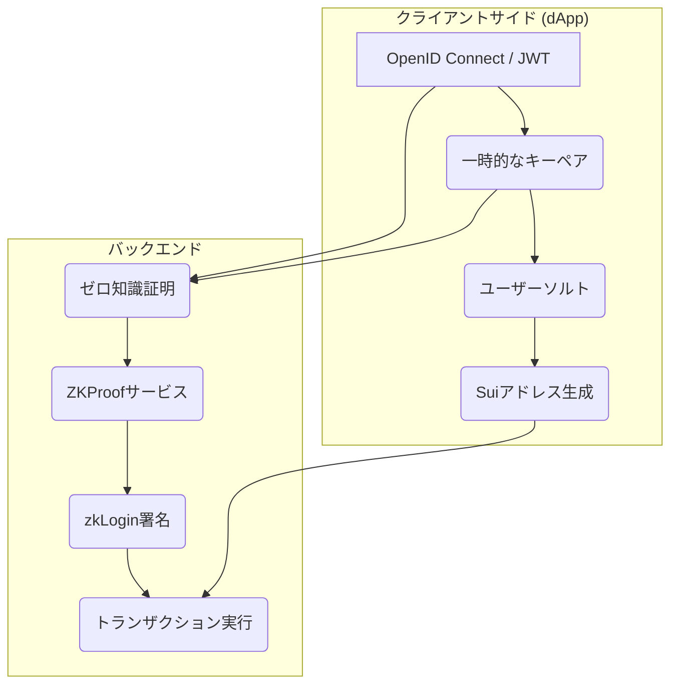
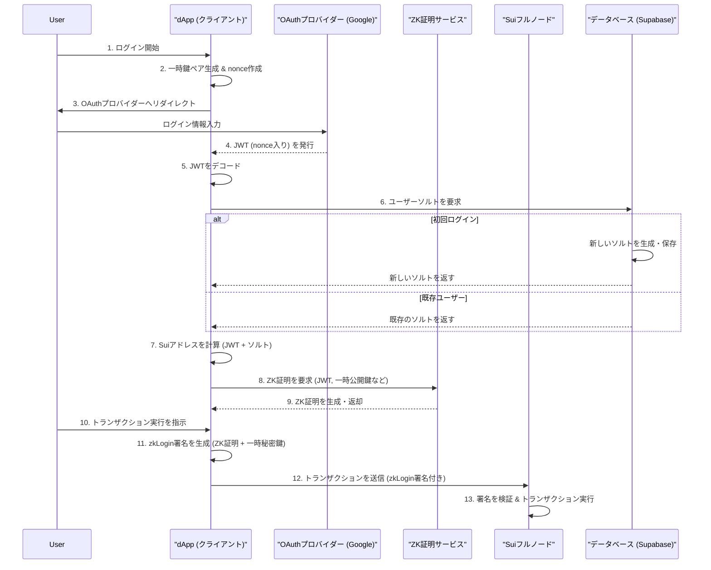

## はじめに

Web3の世界が大きな可能性を秘めている一方で、多くのユーザーにとってはまだ「使いにくい」と感じる点が多いのが現実です。

特に、**シードフレーズや秘密鍵の管理**や**ウォレットの作成**といった煩雑なステップは、Web2のシームレスな体験に慣れた人々にとって大きな参入障壁となっています。

---

ではもし、**いつも使っているGoogleアカウントで、パスワードレスでWeb3アプリケーションにログインできたらどうでしょうか？**

---

それを実現するのが、Suiブロックチェーンに実装された画期的な機能「**zkLogin**」です！

https://sui.io/zklogin

この記事では、Web3のマスアダプション（大衆化）の切り札と目されるzkLoginについて、以下の内容を徹底的に解説します。

1.  **zkLoginの概要**: 
  なぜ画期的なのか、どんな課題を解決するのか。
2.  **支える技術**: 
  OpenID Connectやゼロ知識証明など、zkLoginを成り立たせる技術要素を分かりやすく解説。
3.  **認証フロー**:  
  実際にどのような流れで認証が行われるのかを図解。
4.  **実践ハンズオン**: 
  React + TypeScript製のdAppを構築し、GoogleログインからSui上でのトークン送金＆NFTミントまでを体験。

この記事を読み終える頃には、あなたもzkLoginの全体像を理解し、自身のdAppに組み込むための第一歩を踏み出せるようになっているはずです。それでは、未来のWeb3 UXを一緒に体験しにいきましょう！

最終的に以下のようなアプリを開発できる状態を目指します！


## zkLoginの概要

zkLoginとは、一言で言えば

:::message
「**使い慣れたSNSアカウント（Google, Facebook, Twitchなど）の認証情報を使って、Suiブロックチェーン上のウォレット（Suiアドレス）を直接コントロールできる仕組み**」
:::

です。

これにより、ユーザーは以下のようなメリットを享受できます。

- **シードフレーズや秘密鍵は不要**: 　　
  従来のウォレットのように12個の単語を覚えたり、紙に書いて保管したりする必要がありません。
- **パスワードレス**:   
  SNSアカウントにログインするだけで、dAppが利用可能になります。
- **Web2ライクなUX**:   
  ユーザーはブロックチェーンを意識することなく、自然にWeb3サービスを使い始めることができます。

これは、dApp開発者がユーザーにオンボーディングする際の障壁を劇的に下げ、Web3サービスのマスアダプションを加速させるための強力な武器となります。

## zkLoginを支える技術要素

zkLoginの魔法のような体験は、複数の既存技術と暗号技術を巧みに組み合わせることで実現されています。  
ここでは、主要な5つの技術要素を解説します。



### 1. OpenID Connect (OIDC) と JSON Web Token (JWT)

:::message
**OIDC**   
GoogleやFacebookなどのIDプロバイダーが、ユーザーの身元を安全に認証するための標準規格です。
:::

:::message
**JWT**. 
ユーザーがOIDCによる認証に成功すると、プロバイダーから発行される「身分証明書」のようなものです。

このトークンには、ユーザーID (`sub`) などの情報がJSON形式で含まれており、電子署名によって改ざんが防止されています。
:::

zkLoginは、この**JWTを「ユーザーが本人であること」の証明の基盤**として利用します。

### 2. 一時的なキーペア (Ephemeral Key Pair)

ユーザーがログインするたびに、dAppはセッション中のみ有効な一時的な秘密鍵と公開鍵のペアを生成します。

この一時公開鍵は、後述する`nonce`に含められ、JWTの不正利用を防ぐ役割を果たします。  

セッション終了後には破棄されるため、ユーザーが管理する必要はありません。

### 3. ユーザーソルト (User Salt)

JWTに含まれるユーザーID (`sub`) をそのまま使うと、SNSアカウントとウォレットアドレスが1対1で紐づいてしまい、プライバシーが損なわれる可能性があります。

そこでzkLoginでは、「**ソルト**」と呼ばれるランダムな値を各ユーザーに割り当てます。

Suiアドレスを生成する際に、このソルトとJWTの情報を組み合わせることで、**元のアカウントを特定できないようにプライバシーを保護**します。このソルトは、dAppごとに管理されます（今回のハンズオンでは**Supabase**を使用）。

### 4. ゼロ知識証明 (Zero-Knowledge Proof, ZKP)

**「ある情報を知っている」という事実を、その情報自体を明かすことなく証明する技術**です。

zkLoginでは、ZKPを使って以下の2点をSuiネットワークに対して証明します。

1.  **あなたが、信頼できるOIDCプロバイダー（Googleなど）が発行した有効なJWTを持っていること。**
2.  **そのJWTに、あなたの一時公開鍵が含まれていること。**

このゼロ知識証明を用いることで、IDプロバイダーから取得したメールアドレスなどの個人情報がブロックチェーン上のウォレットアドレスと直接紐づかない仕組みになっています！

### 5. ZK証明サービス (ZK Proving Service)

ゼロ知識証明の生成には複雑な計算が必要です。    
これをユーザーのデバイスで行うと、大きな負荷がかかってしまいます。

そこでzkLoginでは、Mysten Labsが運営する専門のバックエンドサーバー（Prover）に証明生成をオフロードします。

dAppは必要な情報をこのProverに送り、計算済みのZK証明を受け取るだけです(自分で建てることも可能ですが、今回はMysten lab社が提供しているAPIエンドポイントを利用します)。

## zkLogin 認証の8ステップ

これらの技術要素がどのように連携して認証を実現するのか、全体の流れを8つのステップで見ていきましょう。



1.  **一時的な鍵ペア生成**:   
  dAppがユーザーのために一時的な鍵ペアと`nonce`（リプレイ攻撃を防ぐ使い捨ての値）を生成します。
2.  **JWT取得**:   
  ユーザーをGoogleのログイン画面にリダイレクトし、認証が成功すると`nonce`を含んだJWTがdAppに返されます。
3.  **JWTデコード**:   
  dAppはJWTをデコードし、中身の情報を読み取ります。
4.  **ユーザーソルト取得**:    
  dAppはデータベース（Supabase）に問い合わせ、ユーザー固有の`salt`を取得します（なければ新規作成）。
5.  **Suiアドレス生成**:   
  JWTの情報と`salt`を組み合わせて、ユーザーのSuiアドレスを計算します。
6.  **ZK証明取得**:   
  dAppはJWTなどの情報をZK証明サービス（Prover）に送り、ゼロ知識証明を要求します。
7.  **zkLogin署名生成**:   
  ユーザーが実行したいトランザクションを、Proverから受け取ったZK証明と一時秘密鍵を使って署名します。
8.  **トランザクション送信**:   
  生成されたzkLogin署名付きのトランザクションをSuiネットワークに送信し、実行します。

## zkLoginを使ったアプリケーションのハンズオン

それでは、理論を学んだところで、実際にzkLoginを使ったdAppを構築してみましょう！

このハンズオンでは、UNCHAINのオープンソース教材をベースに、以下の機能を実装します。

- Google OAuthによるログイン
- Supabaseを使ったユーザーソルトの管理
- zkLoginによるSuiアドレスの生成
- ログイン後のSUI送金とNFTミント

以下の学習コンテンツとGitHubを見ればご自身で構築できるようになっているので興味がある方はぜひ覗いてみてください！

https://github.com/unchain-tech/sui-zklogin-app

https://buidl.unchain.tech/Sui/Sui-zklogin/

---

### Step 1: 環境構築・セットアップ

まず、開発環境を整え、プロジェクトをクローンします。

- **必要なツール**:
  - Node.js (v23以上推奨)
  - Bun
  - Git

```bash
# リポジトリをクローン
git clone https://github.com/unchain-tech/sui-zklogin-app.git
cd sui-zklogin-app

# スターターブランチに切り替え
git checkout main
bun install
```

次に、環境変数を設定します。`.env.example`をコピーして`.env.local`を作成してください。

```bash
cp .env.example .env.local
```

`.env.local`の中身は以下のようになっています。これらの値は後ほど設定していきます。

```txt
VITE_GOOGLE_CLIENT_ID=
VITE_SUI_NETWORK_NAME=devnet
VITE_SUI_FULLNODE_URL=https://fullnode.devnet.sui.io
VITE_SUI_DEVNET_FAUCET=https://faucet.devnet.sui.io
VITE_SUI_PROVER_DEV_ENDPOINT=https://prover-dev.mystenlabs.com/v1
VITE_REDIRECT_URI=http://localhost:5173/
VITE_SUPABASE_URL=
VITE_SUPABASE_ANON_KEY=
```

---

### Step 2: Supabaseのセットアップ

ユーザーソルトを安全に保管するためのデータベースとしてSupabaseを利用します。

1.  [Supabase](https://supabase.com/)でアカウントを作成し、新しいプロジェクトを作成します。


2.  プロジェクトのSQL Editorを開き、以下のSQLを実行して`profiles`テーブルを作成します。このテーブルでユーザーの`sub` IDと`user_salt`を管理します。

    

    ```sql
    -- ユーザープロフィールを保存するテーブル
    CREATE TABLE profiles (
      id uuid PRIMARY KEY,
      sub text UNIQUE NOT NULL,
      name text,
      email text,
      user_salt text NOT NULL,
      max_epoch integer NOT NULL,
      created_at timestamptz NOT NULL DEFAULT now(),
      updated_at timestamptz NOT NULL DEFAULT now()
    );

    -- インデックスの追加（subカラムでの検索性能向上のため）
    CREATE INDEX idx_profiles_sub ON profiles(sub);

    -- updated_atカラムの自動更新関数とトリガー
    CREATE OR REPLACE FUNCTION update_updated_at_column()
    RETURNS TRIGGER AS $$
    BEGIN
      NEW.updated_at = now();
      RETURN NEW;
    END;
    $$ LANGUAGE plpgsql;

    CREATE TRIGGER update_profiles_updated_at
    BEFORE UPDATE ON profiles
    FOR EACH ROW EXECUTE FUNCTION update_updated_at_column();
    ```
3.  プロジェクト設定の `API` ページに移動し、`Project URL` と `Project API keys` の `anon` `public` キーを取得します。


4.  取得した値を、`.env.local`の`VITE_SUPABASE_URL`と`VITE_SUPABASE_ANON_KEY`にそれぞれ設定します。

---

### Step 3: Google Cloudのセットアップ

Googleログインを有効にするため、Google CloudでOAuthクライアントIDを取得します。


1.  [Google Cloud コンソール](https://console.cloud.google.com/apis/credentials)にアクセスします。


2.  「認証情報を作成」から「OAuth クライアント ID」を選択します。

3.  以下の設定で新しい認証情報を作成します。
    - **アプリケーションの種類**: ウェブアプリケーション
    - **名前**: sui-zklogin (任意)
    - **承認済みのリダイレクトURI**: `http://localhost:5173/`


4.  作成後、表示される「クライアントID」をコピーし、`.env.local`の`VITE_GOOGLE_CLIENT_ID`に設定します。

---

### Step 4: NFTコントラクトのデプロイ

ハンズオンでミントするNFTのスマートコントラクトをデプロイします。

今回は簡単な[Chain IDE](https://chainide.com)を利用します。

https://chainide.com

1.  [Chain IDEのSuiテンプレート](https://chainide.com/s/sui/461d77b23e934de4bad422db11cf3d0d)を開き、`Non Fousible Token`を選択します。


2.  Suiウォレットを接続し、`devnet`ネットワークでコントラクトをデプロイします。
3.  デプロイが成功すると、コンソールに`Package published to chain with digest:`というログが表示されます。この`digest`（パッケージID）をコピーします。


4.  `src/utils/constant.ts`ファイルを開き、`NFT_PACKAGE_ID`の値をコピーしたパッケージIDに置き換えます。

    ```ts
    // src/utils/constant.ts
    export const NFT_PACKAGE_ID = "<ここにデプロイしたコントラクトのパッケージIDを貼り付ける>";
    ```

---

### Step 5: アプリケーションの実装

いよいよアプリケーションのロジックを実装していきます。

このプロジェクトでは、認証ロジックの複雑さをReact Context APIとカスタムフックを使ってきれいに分離しています。

#### `GlobalProvider.tsx`: 認証フローの心臓部

`src/context/GlobalProvider.tsx`は、zkLoginの複雑な状態管理とリアクティブな認証フローを担う最も重要なコンポーネントです。

`useEffect`フックを連鎖させ、必要なデータが揃うと次のステップが自動的に実行される仕組みになっています。

以下のコードを貼り付けてください。

https://github.com/unchain-tech/sui-zklogin-app/blob/complete/src/context/GlobalProvider.tsx

**主な処理の流れ:**
1.  **認証準備**:   
  `useZKLogin`フックから`startLogin`が呼ばれると、一時鍵ペア生成・エポック取得・ランダムネス生成が行われます。
2.  **Nonce生成 & OAuthリダイレクト**:   
  準備が整うと`useEffect`が発火し、`nonce`を生成。さらに`nonce`の生成を検知した別の`useEffect`がGoogleの認証ページへ自動リダイレクトします。
3.  **コールバック処理 & Salt管理**:   
  Google認証後、URLハッシュに含まれる`id_token` (JWT) を`useEffect`が検知。JWTから`sub`を取り出し、Supabaseに`user_salt`を問い合わせます。なければ新規作成し、DBに保存します。
4.  **ZK Proof取得**:   
  JWTと`user_salt`が揃うと、Suiアドレスが生成されます。そして、全ての情報が揃ったことを検知した`useEffect`がProverにZK証明を要求します。
5.  **ログイン完了**:   
  `zkProof`が取得できたら、ユーザーはログイン済みと見なされ、トランザクションを実行できる状態になります。

#### `useSui.ts`: ブロックチェーンとの対話

`src/hooks/useSui.ts`は、Suiブロックチェーンとのやり取り（残高取得、トランザクション実行、NFTミントなど）を担当するカスタムフックです。

以下のコードになるように実装してください。

https://github.com/unchain-tech/sui-zklogin-app/blob/complete/src/hooks/useSui.ts

SUIを送金する`executeTransaction`とNFTをミントする`mintNFT`関数を実装しています！

どちらの関数も、

- `getZkLoginSignature`を呼び出してzkLogin署名を生成する
- `suiClient.executeTransactionBlock`でトランザクションをネットワークに送信する

という共通のパターンを持っています！

zkLoginで生成されたウォレットを使ってトランザクションを送信する場合には、このような実装パターンとなります。

#### `App.tsx`: UIの組み立て

最後に、`src/App.tsx`を更新して、作成したロジックを呼び出すためのUIコンポーネントを配置します。

以下のコードになるように実装してください。

https://github.com/unchain-tech/sui-zklogin-app/blob/complete/src/App.tsx


ここまでに実装したコンポーネント + すでに用意してあるUIコンポーネントを組み合わせているだけになっています！

---

### Step 6: 動作確認

お疲れ様でした！これで実装は完了です！！

アプリを起動して動作を確認しましょう。

```bash
# 開発サーバーを起動
bun run dev
```

ブラウザで `http://localhost:5173` を開くと、ログイン画面が表示されるはずです。

1.  「Sign in with Google」ボタンをクリックしてログインします。
2.  ログインが成功すると、あなたのアカウント情報（Suiアドレス、残高など）が表示されます。
3.  「Execute Transaction」ボタンでSUIの送金、「Mint a Test NFT」ボタンでNFTのミントを試してみてください。
4.  Sui Explorerでトランザクションが成功したことや、NFTがミントされたことを確認できれば、ハンズオンは成功です！


## まとめ

この記事では、Suiの画期的な機能であるzkLoginの概念からそれを支える技術、そして実際にdAppを構築するハンズオンまでを駆け足で解説しました。

zkLoginは、Web3のUXを根底から変え、開発者がより多くのユーザーをシームレスにオンボーディングするための強力なソリューションです。

シードフレーズの呪縛からユーザーを解放し、Web2と同じくらい直感的な体験を提供することで、Web3のマスアダプションを大きく前進させる可能性を秘めています。

今回構築したアプリケーションは、その第一歩です。

ぜひこの知識を活かして、あなたのプロダクトにzkLoginを組み込み、未来のWeb3体験を創造してみてください。

## 参考文献

- [GitHub - unchain-tech/sui-zklogin-app](https://github.com/unchain-tech/sui-zklogin-app)
- [Sui zkLogin公式サイト](https://sui.io/zklogin)