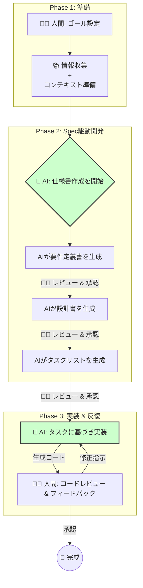
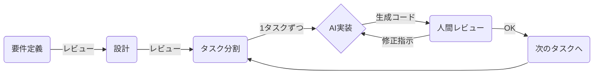
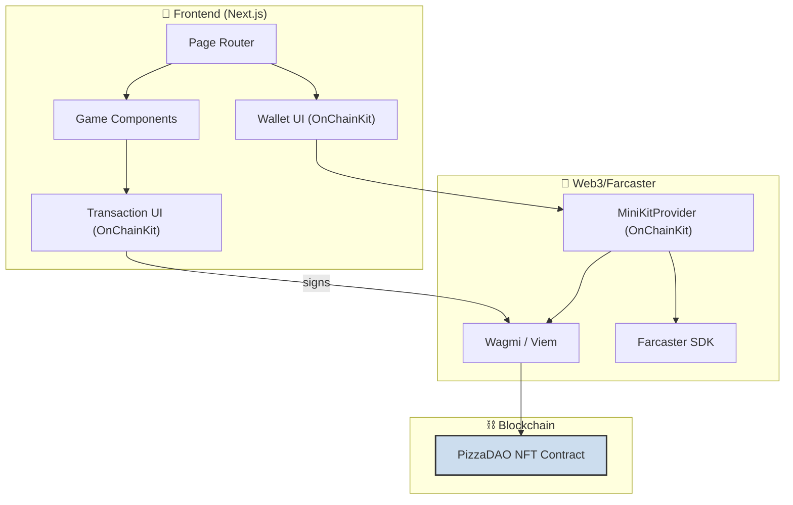

## はじめに

:::message
「ハッカソンで入賞したいけど、アイデアを形にする時間がない…」
「AIを開発プロセスに取り入れたいけど、どうすればいいかわからない…」
:::

多くのエンジニアが抱えるそんな悩みを解決する、新しい開発スタイル「**Spec駆動開発**」をご存知でしょうか？

先日、私は [ETH Tokyo](https://ethtokyo.org/) のサイドイベントとして開催された「[PizzaDAO × Ethreactor Mini Hackathon](https://luma.com/p6leyvgj?tk=JuHl69)」に参加し、この**Spec駆動開発**を駆使して**わずか数時間でWeb3ネイティブなゲームアプリを開発し、入賞を果たすことができました。**

https://ethtokyo.org/

https://luma.com/p6leyvgj

この記事では、AIエージェントと人間がタッグを組み、驚異的なスピードとクオリティで開発を進める「**Spec駆動開発**」の威力と、それを支えるツール「**Kiro**」と「**CodeX**」をはじめとする**AI Coding Agent**の活用法について、ハッカソンでの実体験を元に余すところなくお伝えします！！

ぜひ最後まで読んでいってください！

:::message
開発したアプリはこちらで実際に触れますので、ぜひ体験してみてください！
:::

[Mini Pizza Game on Farcaster](https://farcaster.xyz/miniapps/__UcwcJwPaVN/mini-pizza-game)

https://farcaster.xyz/miniapps/__UcwcJwPaVN/mini-pizza-game

:::message
GitHubはこちら！
:::

https://github.com/mashharuki/PizzaDaoMiniHackathon

## Spec駆動開発の世界へようこそ

まず、**Spec駆動開発**の全体像について整理したいと思います。

**Spec駆動開発**は以下の3つのフェーズで構成される開発プロセスです。



<br/>

このように、人間はプロジェクトの**監督**や**アーキテクト**そして**プロジェクトマネージャー**の役割に徹し、AIエージェントが仕様書という名の設計図を元に実装を進めることになります！

もちろん、必要に応じて人間がコーディングも行います。

:::message
ただの**AI駆動開発**との違いは**最初に要件や設計書、タスクリスト**を明確にしてから実装に移る点です！！
:::

## なぜ「Spec駆動開発」が最強なのか？

「AIにコードを書かせる」と聞くと　**「プロンプトに要件を書いて投げるだけ」** というイメージを持つかもしれません。

しかし、複雑なアプリケーションをゼロから作り上げるには**それだけでは不十分**です。

AIの能力を最大限に引き出し、望むアウトプットを得るための鍵、それが「**Spec駆動開発**」です！

### Spec駆動開発とは？

Spec駆動開発とは、**いきなり実装を始めるのではなく、まず初めにアプリケーションの仕様書（Specification）を徹底的に作り込みつつ生成AIを活用する開発手法**です。

ハッカソンのような時間的制約が厳しい場面でこそ、このアプローチは絶大な効果を発揮します。

なぜなら、明確な仕様書はAIエージェントにとって「**完璧な指示書**」となり、手戻りや意図しないアウトプットを劇的に減らすことができるからです。

開発サイクルは以下のようになります。



今回のハッカソンで、私はAI Coding Agentに対し、以下のような厳格なルールを課しました。

これは、私が普段使っているしている「**Gemini CLI**」の設定ファイル（`.gemini/GEMINI.md` と `.gemini/settings.json`）です！。

- **.gemini/GEMINI.mdの一部**

  :::details .gemini/GEMINI.mdの一部
  ```markdown
  あなたは超優秀なフルスタックWeb3エンジニアです。

  このワークスペースでコーディングを行う際には必ず以下のルールに従ってください。

  # 実装方針

  ## 全体的な方針

  - まずプロジェクトのディレクトリ内に `.kiro/specs` フォルダが存在するか確認してください。
  - `.kiro/specs` フォルダが存在する場合、その中にあるプロジェクトの仕様書を読み込み、仕様書に基づいて実装を行ってください。
    - 例えば シューティングゲーム用の仕様書だったら `shooting-game` というフォルダがあるはずです。
    - その場合、フォルダ内にある仕様書をすべて読み込み、仕様書に基づいて実装を行ってください。
      - requirements.md : 要件定義書
      - design.md: 設計書
      - tasks.md
    - 仕様書がない場合は、実装を開始する前に必ず仕様書を作成してください。
    - 仕様書を作成する順番は以下の通りです。
      1. requirements.md : 要件定義書
      2. design.md: 設計書
      3. tasks.md タスクリスト
    - 仕様書は３つ同時に作成するのではなく、順番に作成してください。作成したら必ず私にレビューを依頼してください。
    - 私がレビューして内容を承認をしない限り次の仕様書の作成に進んではいけません。
    - 実装時は、必ずタスクリストに基づいて順番に実装を行ってください。
    - 段階的に進めることで、各ステップでのフィードバックを反映しやすくなり成果物のクオリティが上がります。

  ## 仕様書のサンプル

  以下に各仕様書のサンプルを示します。  
  必ずこれらのフォーマットにしたがって仕様書を作成してください。

  繰り返しになりますが、以下はあくまでサンプルです。  
  あなたに求められているのは、あくまでこのフォーマットに従った仕様書の作成です。  
  プロンプトに与えられた要件を読み解いて各プロジェクトに合った仕様書を作成するようにしてください。

  ### requirements.md

  ````markdown
  # AMM DEX 設計書

  ## 概要

  Ethereum Sepolia テストネットワーク上で動作するAMM（自動マーケットメーカー）型DEXの技術設計書です。Uniswap V2のコア機能を参考に、流動性プール管理とトークンスワップ機能を提供します。

  ## アーキテクチャ

  ### システム全体構成

  ```mermaid
  graph TB
      subgraph "フロントエンド"
          UI[Next.js App]
          Wagmi[Wagmi/Viem]
          RainbowKit[RainbowKit]
      end

      subgraph "ブロックチェーン"
          Factory[Factory Contract]
          Pair1[USDC/JPYC Pair]
          Pair2[USDC/PYUSD Pair]
          Pair3[JPYC/PYUSD Pair]
          Router[Router Contract]
      end

      subgraph "外部トークン"
          USDC[USDC Token]
          JPYC[JPYC Token]
          PYUSD[PYUSD Token]
      end

      UI --> Wagmi
      Wagmi --> Router
      Router --> Factory
      Factory --> Pair1
      Factory --> Pair2
      Factory --> Pair3
      Router --> USDC
      Router --> JPYC
      Router --> PYUSD
  ```
  ````

  ### レイヤー構成

  1. **プレゼンテーション層**: Next.js + TailwindCSS
  2. **Web3インタラクション層**: wagmi + viem + RainbowKit
  3. **スマートコントラクト層**: Solidity + Hardhat
  4. **ブロックチェーン層**: Ethereum Sepolia

  ## コンポーネントとインターフェース

  ### フロントエンドコンポーネント構成

  ````
  src/
  ├── app/                     # Next.js App Router
  │   ├── page.tsx            # ホーム/スワップページ
  │   ├── pools/              # プール管理ページ
  │   │   ├── page.tsx        # プール一覧
  │   │   └── [id]/page.tsx   # プール詳細
  │   └── layout.tsx          # 共通レイアウト
  ├── components/
  │   ├── layout/
  │   │   └── Header.tsx      # ヘッダー（ウォレット接続含む）
  │   ├── swap/
  │   │   ├── SwapCard.tsx    # スワップインターフェース
  │   │   └── TokenSelector.tsx # トークン選択
  │   ├── pools/
  │   │   ├── PoolCard.tsx    # プール情報カード
  │   │   ├── AddLiquidity.tsx # 流動性追加
  │   │   └── RemoveLiquidity.tsx # 流動性削除
  │   └── ui/                 # 基本UIコンポーネント
  ├── hooks/
  │   ├── useSwap.ts          # スワップロジック
  │   ├── usePools.ts         # プール管理
  │   └── useTokens.ts        # トークン情報
  ├── lib/
  │   ├── contracts.ts        # コントラクト設定
  │   ├── constants.ts        # 定数定義
  │   └── utils.ts            # ユーティリティ関数
  └── types/
      ├── contracts.ts        # コントラクト型定義
      └── tokens.ts           # トークン型定義
  ```###
  スマートコントラクト構成

  ````

  contracts/
  ├── core/
  │ ├── AMMFactory.sol # ペア作成・管理
  │ ├── AMMPair.sol # 流動性プール実装
  │ └── AMMRouter.sol # スワップ・流動性管理
  ├── interfaces/
  │ ├── IAMMFactory.sol # Factory インターフェース
  │ ├── IAMMPair.sol # Pair インターフェース
  │ └── IAMMRouter.sol # Router インターフェース
  ├── libraries/
  │ ├── AMMLibrary.sol # 価格計算ライブラリ
  │ └── SafeMath.sol # 安全な数学演算
  └── utils/
  └── WETH.sol # Wrapped Ether（テスト用）

  ````

  ### 主要インターフェース

  #### IAMMRouter.sol
  ```solidity
  interface IAMMRouter {
      function swapExactTokensForTokens(
          uint amountIn,
          uint amountOutMin,
          address[] calldata path,
          address to,
          uint deadline
      ) external returns (uint[] memory amounts);

      function addLiquidity(
          address tokenA,
          address tokenB,
          uint amountADesired,
          uint amountBDesired,
          uint amountAMin,
          uint amountBMin,
          address to,
          uint deadline
      ) external returns (uint amountA, uint amountB, uint liquidity);

      function removeLiquidity(
          address tokenA,
          address tokenB,
          uint liquidity,
          uint amountAMin,
          uint amountBMin,
          address to,
          uint deadline
      ) external returns (uint amountA, uint amountB);
  }
  ````

  #### IAMMPair.sol

  ```solidity
  interface IAMMPair {
    function getReserves()
      external
      view
      returns (uint112 reserve0, uint112 reserve1, uint32 blockTimestampLast);
    function mint(address to) external returns (uint liquidity);
    function burn(address to) external returns (uint amount0, uint amount1);
    function swap(
      uint amount0Out,
      uint amount1Out,
      address to,
      bytes calldata data
    ) external;
    function token0() external view returns (address);
    function token1() external view returns (address);
  }
  ```

  ## データモデル

  ### フロントエンド型定義

  ```typescript
  // types/tokens.ts
  export interface Token {
    address: `0x${string}`;
    symbol: string;
    name: string;
    decimals: number;
    logoURI?: string;
  }

  export interface TokenBalance {
    token: Token;
    balance: bigint;
    formatted: string;
  }

  // types/contracts.ts
  export interface Pool {
    id: string;
    token0: Token;
    token1: Token;
    reserve0: bigint;
    reserve1: bigint;
    totalSupply: bigint;
    lpTokenBalance?: bigint;
  }

  export interface SwapQuote {
    amountIn: bigint;
    amountOut: bigint;
    priceImpact: number;
    minimumAmountOut: bigint;
    path: `0x${string}`[];
  }

  export interface LiquidityPosition {
    pool: Pool;
    lpTokenBalance: bigint;
    token0Amount: bigint;
    token1Amount: bigint;
    shareOfPool: number;
  }
  ```

  ### コントラクト定数

  ```typescript
  // lib/constants.ts
  export const SUPPORTED_TOKENS: Record<string, Token> = {
    USDC: {
      address: '0x1c7D4B196Cb0C7B01d743Fbc6116a902379C7238',
      symbol: 'USDC',
      name: 'USD Coin',
      decimals: 6,
    },
    JPYC: {
      address: '0x431D5dfF03120AFA4bDf332c61A6e1766eF37BDB',
      symbol: 'JPYC',
      name: 'JPY Coin',
      decimals: 18,
    },
    PYUSD: {
      address: '0xCaC524BcA292aaade2DF8A05cC58F0a65B1B3bB9',
      symbol: 'PYUSD',
      name: 'PayPal USD',
      decimals: 6,
    },
  } as const;

  export const CONTRACT_ADDRESSES = {
    FACTORY: '0x...', // デプロイ後に設定
    ROUTER: '0x...', // デプロイ後に設定
  } as const;

  export const SLIPPAGE_OPTIONS = [0.1, 0.5, 1.0, 3.0] as const;
  export const DEFAULT_SLIPPAGE = 0.5;
  export const MAX_SLIPPAGE = 50;
  ```

  .
  .
  .

  # READMEについて

  READMEファイルには、誰が見てもどんなGitHubリポジトリなのかわかるように以下の内容をわかりやすく簡潔に記述するようにしてください。

  - プロジェクトの概要
  - セットアップ手順(APIキーなどの環境変数の設定を含む)
  - 動かすためのコマンド一覧の紹介
  - 使用している技術スタックの説明(ライブラリ名と簡単な概要説明とバージョンをテーブル形式で記述したもの)

  ```
  :::

- **.gemini/settings.json**

  こちらは`Gemini CLI`の細かい設定を行うファイルです！  
  後述する**MCP**の設定もこのファイルで行います！

  :::details .gemini/settings.json
  ```json
  {
    "theme": "GitHub",
    "contextFileName": ".gemini/GEMINI.md",
    "preferredEditor": "vscode",
    "selectedAuthType": "oauth-personal",
    "fileFiltering": {
      "respectGitIgnore": true, // .gitignore考慮
      "enableRecursiveFileSearch": true // 再帰検索
    },
    "checkpointing": {
      "enabled": true
    },
    // バグ報告カスタマイズ
    "bugCommand": {
      "urlTemplate": "https://github.com/myorg/myrepo/issues/new?title={title}&body={info}"
    },
    // テレメトリ
    "telemetry": {
      "enabled": false,
      "target": "local", // "local" or "gcp"
      "otlpEndpoint": "http://localhost:4317",
      "logPrompts": true
    },
    // 使用統計
    "usageStatisticsEnabled": true,
    "mcpServers": {
      "context7": {
        "type": "stdio",
        "command": "npx",
        "args": ["-y", "@upstash/context7-mcp@latest"]
      },
      "sequential-thinking": {
        "command": "npx",
        "args": ["-y", "@modelcontextprotocol/server-sequential-thinking"]
      },
      "OpenZeppelinSolidityContracts": {
        "command": "npx",
        "args": ["mcp-remote", "https://mcp.openzeppelin.com/contracts/solidity/mcp"]
      }
    }
  }
  ```
  :::


このように、AIに

- 「**今回あなたにお願いするプロジェクトの概要や背景はこんな内容だよ！**」
- 「**こんな制約があるから守ってね！**」
- 「**まず要件定義書と仕様書を作ってね！**」
- 「**そしてその仕様書に従ってゴールを達成するために必要なタスクリストを作ってね！**」
- 「**タスクリストを作ったらそれを順番に取り組んでね！**」

と命じることで、プロジェクト全体の骨格が固まり一貫性のある高品質な開発が可能になります。

人間と仕事をするときでも**同じ**ですよね。

Kiroで**Spec駆動開発**を体験してから他のAI Coding Agentでも同じような振る舞いにできないか考えて設定ファイルをこのようにしました(これが正しいかどうかは分かりませんが...笑 知っている人いたら教えてください！！)。

設定ファイルを色々事前に準備するのは面倒ですが、実装したいと考えているプロダクトの**背景情報(コンテキスト)** を正しく伝えることで、複雑な構成ながらも質の高い結果を得ることができるのです！

これにより、AIは単なるコード生成マシンではなく、プロジェクトの哲学を理解した「チームの一員」として振る舞うようになります。

最近だと**プロンプトエンジニアリング**だけではなくAIに渡す背景情報を調整する**コンテキストエンジニアリング**が非常に重要になってきています。

この辺りのお話は **Oikon**さんの以下の資料がとても参考になるので共有します！

https://speakerdeck.com/oikon48/kirotoxue-bukontekisutoenziniaringu

## Kiro: Spec駆動開発を支える最強ツール

Spec駆動開発を実践する上で、私の開発体験を劇的に向上させてくれたのが「**Kiro**」というツールです。

https://kiro.dev

### Kiroとは？

Kiroは、AWS初のIDEでAI Coding Agent系のツールの中では後発でしたがアプローチがそれまでのものと全く異なっており、開発者から非常に高い評価を得ています。

そのアプローチこそが**Spec駆動開発**でした！！

いきなり実装に移らずにまずは要件を明確にしようというのがKiroの考え方です！！

Kiroも**Gemini CLI**や**CodeX**と同様に設定ファイル(steeringファイル)を作成することで、より質の高いアウトプットを出力することができます！

今回は以下の4つの設定ファイルを調整して**Spec駆動開発**に挑戦してみました！

なおKiroの設定ファイルを作成するにあたり以下のリポジトリが大変参考になりましたのでぜひ覗いてみることをおすすめします！

https://github.com/yoshidashingo/getting-started-with-kiro

- **.kiro/settings/mcp.json**

  このファイルではKiroで使うMCPの設定ができます！

  :::details .kiro/settings/mcp.json
  ```json
  {
    "mcpServers": {
      "context7": {
        "command": "npx",
        "args": ["--yes", "@upstash/context7-mcp"],
        "disabled": false
      },
      "sequential-thinking": {
        "command": "npx",
        "args": ["-y", "@modelcontextprotocol/server-sequential-thinking"],
        "disabled": false
      },
      "OpenZeppelinSolidityContracts": {
        "command": "npx",
        "args": ["mcp-remote", "https://mcp.openzeppelin.com/contracts/solidity/mcp"],
        "disabled": false
      }
    }
  }
  ```
  :::

- **.kiro/steering/product.md**

  このファイルにはプロジェクトの基本原則を記載します。

  :::details .kiro/steering/product.md
  ```markdown
  ---
  inclusion: always
  ---

  # PizzaDAOミニハッカソン用プロジェクト基本原則

  AI支援開発ワークフローを使用してPizzaDAOミニハッカソン用プロダクトを開発するためのWeb3 AI Vibe Codingスターターキットです。

  ## 開発哲学

  ### 段階的なAI駆動開発

  このプロジェクトは**段階的なAI支援開発**を重視し、スマートコントラクトとフロントエンド開発フェーズを明確に分離します。

  次のコンポーネントに進む前に、各段階で徹底的なテストと検証を優先するアプローチを採用しています。

  ### ユーザーファースト

  - ユーザー体験を最優先に考える
  - 使いやすさと直感性を重視
  - アクセシビリティを標準として組み込む
  - ユーザーフィードバックを積極的に取り入れる

  ### 品質重視

  - 動作するコードより、保守可能なコードを書く
  - テストファーストの開発を実践
  - コードレビューを必須とする
  - 継続的な品質改善を行う
  - ソースコードにはわかりやすいコメントを付与すること

  ### 継続的改善

  - 小さな改善を積み重ねる
  - フィードバックを積極的に取り入れる
  - 技術的負債を定期的に解消する
  - 学習と成長を重視する

  ## ファイル命名規約

  - ディレクトリとファイルには**kebab-case**を使用
  - スマートコントラクト: **PascalCase**（例：`NFTMarketplace.sol`）
  - コンポーネント: React コンポーネントは**PascalCase**
  - ユーティリティ: JavaScript/TypeScript ファイルは**camelCase**
  - ドキュメント: markdown ファイルは**snake_case**
  - 定数: **UPPER_SNAKE_CASE**

  ## コーディング規約

  ### TypeScript/JavaScript

  - 関数の引数・戻り値には型を明記する
  - メソッド名は動詞から始める
  - 数値を扱う変数名には単位がわかるような接尾辞をつける
  - 冗長な実装は避け、同じロジックは関数として切り出して再利用する

  ### コメント規約

  - コメントは日本語で記述
  - 変数コメント:
    ```ts
    // 変数の概要を記述する
    const variableName: Type = value;
    ```
  - メソッドコメント:
    ```ts
    /**
     * メソッドの概要を記述する
    *
    * @param param1 パラメータ1の説明
    * @param param2 パラメータ2の説明
    * @returns 戻り値の説明
    */
    function methodName(param1: Type1, param2: Type2): ReturnType {
      // メソッドの処理内容を記述する
    }
    ```

  ## README 要件

  README ファイルには以下の内容を含める：

  - プロジェクトの概要
  - セットアップ手順（API キーなどの環境変数設定を含む）
  - 動かすためのコマンド一覧
  - 使用技術スタック（ライブラリ名、概要、バージョンをテーブル形式で記述）

  ## コード構成原則

  - **関心の分離**: コントラクトとフロントエンドロジックの明確な境界
  - **モジュラーアーキテクチャ**: 再利用可能なコンポーネントとユーティリティ
  - **段階的拡張**: コア機能を最初に構築し、その後機能を追加
  - **テスト駆動開発**: 実装と並行してテストを作成
  - **DRY 原則**: 同じロジックの重複を避け、関数として切り出して再利用

  ## 品質基準

  ### コード品質

  - **テストカバレッジ**: 80%以上
  - **複雑度**: 関数あたり10以下
  - **重複コード**: 3%以下
  - **ESLintエラー**: 0件
  - **TypeScriptエラー**: 0件

  ### パフォーマンス

  - **ページ読み込み時間**: 2秒以内
  - **API応答時間**: 500ms以内（95パーセンタイル）
  - **Core Web Vitals**: 全て Good
  - **ガス最適化**: スマートコントラクトについてはガス最適化を考慮して開発すること

  ### セキュリティ

  - **脆弱性**: 高リスクなし
  - **依存関係**: 定期的な更新
  - **認証**: 多要素認証対応

  ## 開発プロセス

  ### ブランチ戦略

  - **メインブランチ**: `main`
  - **開発ブランチ**: `develop`
  - **機能ブランチ**: `feature/[機能名]`
  - **修正ブランチ**: `hotfix/[修正内容]`

  ### コミット規約

  ```
  <type>(<scope>): <subject>

  <body>

  <footer>
  ```

  **タイプ定義:**

  - `feat`: 新機能
  - `fix`: バグ修正
  - `docs`: ドキュメント更新
  - `style`: コードスタイル修正
  - `refactor`: リファクタリング
  - `test`: テスト追加・修正
  - `chore`: その他の変更

  ### レビュープロセス

  1. **セルフレビュー**: 作成者による事前確認
  2. **ピアレビュー**: チームメンバーによるレビュー
  3. **シニアレビュー**: 上級者による最終確認
  4. **自動チェック**: CI/CDによる品質チェック

  ## セキュリティ

  ### 開発時の注意事項

  - **機密情報**: コードに含めない(.envファイルから読み込むようにすること)
  - **依存関係**: 定期的な脆弱性チェック
  - **認証情報**: 環境変数で管理
  - **ログ**: 個人情報を含めない

  ## 対象ネットワーク

  - **Base Sepolia**（テストネット）開発・テスト用
  - チェーンID: 84532

  ## その他

  - 特段の指定がない限り出力は簡潔かつわかりやすい日本語にすること
  - MCPが接続されている場合はその恩恵を最大限享受するように振る舞うこと
  ```
  :::

- **.kiro/steering/structure.md**

  このファイルにはプロジェクトのフォルダ構造などに関する情報を記述します。

  :::details　.kiro/steering/structure.md
  ```markdown 
  ---
  inclusion: always
  ---

  # プロジェクト構造

  ## ルートディレクトリ構成

  ```
  ├── .kiro/                   # Kiro設定とステアリングルール
  ├── README.md                # プロジェクト概要とセットアップガイド
  ├── README.md                # プロジェクト概要とセットアップガイド
  └── LICENSE                  # プロジェクトライセンス(MIT)
  ```

  ## 構造規約

  プロジェクト構成は以下のフォルダ構成を参考にしてください。

  ```bash
  ├── README.md               # README.md
  ├── template                # Base Mini Appを開発するためのテンプレートプロジェクト
  ├── app
  │   ├── api
  │   │   ├── .well-known
  │   │   │   └── farcaster.json
  │   │   │       └──route.ts     # Farcaster用のメタデータAPI
  │   │   ├── notify
  │   │   │   └── route.ts    # 通知用のAPI
  │   │   └── webhook
  │   │       └── route.ts    # Webhook用のAPI
  │   ├── layout.tsx          # レイアウト
  │   ├── page.tsx            # Pageコンポーネント
  │   └── providers.tsx       # プロバイダーコンポーネント
  ├── components              # 各コンポーネントを格納するフォルダ
  │   ├── common              # 全画面共通コンポーネントを格納するフォルダ
  │   └── TransactionCard.tsx # トランザクションカードコンポーネント
  ├── css                     # スタイルシート用フォルダ
  ├── lib
  │   ├── notification-client.ts
  │   ├── notification.ts
  │   └── redis.ts
  ├── next-env.d.ts
  ├── next.config.mjs
  ├── package.json
  ├── pnpm-lock.yaml
  ├── postcss.config.mjs
  ├── public
  │   ├── hero.png
  │   ├── icon.png
  │   ├── logo.png
  │   └── splash.png
  ├── tailwind.config.ts
  ├── tsconfig.json
  └── utils             # ユーティリティ関数用フォルダ
      ├── abis          # ABI格納用フォルダ
      └── constants.ts  # 定数用フォルダ
  ```
  ```
  :::

- **.kiro/steering/tech.md**

  このファイルにはプロジェクトで取り扱う技術スタックの情報を記述します。

  :::details .kiro/steering/tech.md
  ```markdown 
  ---
  inclusion: always
  ---

  ## 技術スタック

  ### 全体

  - **パッケージマネージャー**: pnpm
  - **ランタイム**: Node.js
  - **フォーマッター**: prittier

  ### フロントエンド

  - **フレームワーク**: Next.js (App Router)
  - **言語**: TypeScript
  - **スタイリング**:
    - TailwindCSS
  - **ライブラリ**：
    - viem
    - wagmi
    - @farcaster/frame-sdk
    - @coinbase/onchainkit
    - @upstash/redis
    - @tanstack/react-query
  - **状態管理**: useState

  ### インフラ・DevOps

  - **CI/CD**: GitHub Actions

  #### .gitignore

  `.gitignore` ファイルには、以下の内容を必ず含めてください。

  ```txt
  **/node_modules
  **/.DS_Store
  ```

  ## 開発ツール設定

  ### パッケージマネージャー

  - **pnpm**: 高速で効率的なパッケージ管理
  - `pnpm-workspace.yaml`: モノレポワークスペース設定

  ### フォーマッター・リンター

  - **Biome**: 高速なフォーマッターとリンター
  - `biome.json`: 設定ファイル

  ### Git 設定

  - `.gitignore`: 必須除外項目
    - `**/node_modules`
    - `**/.DS_Store`
  ```
  :::

<br/>

ここまで設定ファイルを準備した上で要件定義書、設計書、タスクリストの作成をKiroにお願いしてみました！

最終的に出来上がったのが以下の3つのファイルです！

- **.kiro/specs/pizza-roulette-game/requirements.md**

  :::details .kiro/specs/pizza-roulette-game/requirements.md
  ```markdown
  # Requirements Document

  ## Introduction

  PizzaDAO × Ethreactor Mini Hackathon @ ETHTokyo '25に提出するピザルーレットゲームアプリです。ユーザーは回転するピザボードをタップしてピザを完成させ、スコアに応じてNFTをミントできるWeb3ミニゲームです。1画面完結型のシンプルなゲーム体験を提供し、Farcaster MiniAppとして動作します。

  ## Requirements

  ### Requirement 1

  **User Story:** As a ゲームプレイヤー, I want ウォレットを接続してゲームにアクセスしたい, so that 自分のアカウントでNFTをミントできる

  #### Acceptance Criteria

  1. WHEN ユーザーがFarcasterのミニアプリにアクセス THEN システム SHALL OnChainKitのウォレット接続UIを表示する
  2. WHEN ユーザーがウォレット接続ボタンをクリック THEN システム SHALL Base Sepoliaネットワークへの接続を要求する
  3. WHEN ウォレット接続が成功 THEN システム SHALL 接続されたウォレットアドレスをヘッダーに表示する
  4. IF ウォレットが未接続 THEN システム SHALL ゲーム機能へのアクセスを制限する

  ### Requirement 2

  **User Story:** As a ゲームプレイヤー, I want ピザルーレットゲームをプレイしたい, so that 楽しみながらピザを完成させることができる

  #### Acceptance Criteria

  1. WHEN ページが読み込まれる THEN システム SHALL 12切れのピザボード（ダーツの的形状）を表示する
  2. WHEN ユーザーが「ゲームスタート」ボタンをクリック THEN システム SHALL ピザボードを回転させる
  3. WHEN ユーザーがボードをタップ THEN システム SHALL タップした位置のピザ切れを6種類の味からランダムに選択して埋める
  4. WHEN ピザ切れが埋められる THEN システム SHALL 視覚的なフィードバック（色の変化、アニメーション）を提供する
  5. WHEN 全12切れが埋まる THEN システム SHALL ゲーム終了状態に移行する

  ### Requirement 3

  **User Story:** As a ゲームプレイヤー, I want スコアシステムでピザの完成度を評価されたい, so that 戦略的にピザを作ることができる

  #### Acceptance Criteria

  1. WHEN ピザ切れが配置される THEN システム SHALL 基本ポイント10点を付与する
  2. WHEN 隣接する2つのピザ切れが同じ味 THEN システム SHALL 隣接ボーナス20点を加算する
  3. WHEN 3つ以上連続で同じ味が隣接 THEN システム SHALL 連続ボーナス（連続数 × 10点）を追加する
  4. WHEN 全12切れが同じ味 THEN システム SHALL パーフェクトボーナス500点を付与する
  5. WHEN ゲーム終了時 THEN システム SHALL 最終スコアを計算して表示する
  6. WHEN 最終スコア >= 800点 THEN システム SHALL ダイアモンドランクを付与する
  7. WHEN 最終スコア >= 600点 AND < 800点 THEN システム SHALL ゴールドランクを付与する
  8. WHEN 最終スコア >= 400点 AND < 600点 THEN システム SHALL シルバーランクを付与する
  9. WHEN 最終スコア < 400点 THEN システム SHALL ブロンズランクを付与する
  10. WHEN ランクが決定される THEN システム SHALL ランクに応じたビジュアル表示（色、アイコン、エフェクト）を行う
  11. WHEN 特定のピザパターンが完成 THEN システム SHALL 楽しい役職名とアニメーション演出を表示する

  ### Requirement 4

  **User Story:** As a ゲームプレイヤー, I want 獲得したスコアに応じてNFTをミントしたい, so that ゲームの成果を永続的に保存できる

  #### Acceptance Criteria

  1. WHEN ゲームが終了してランクが決定される THEN システム SHALL 「NFTをミント」ボタンを表示する
  2. WHEN ユーザーが「NFTをミント」ボタンをクリック THEN システム SHALL Base Sepolia上でNFTミント処理を実行する
  3. WHEN NFTミント処理が開始される THEN システム SHALL ローディング状態を表示する
  4. WHEN NFTミントが成功 THEN システム SHALL 成功メッセージとNFTの詳細を表示する
  5. WHEN NFTミントが失敗 THEN システム SHALL エラーメッセージを表示してリトライオプションを提供する
  6. WHEN NFTミントが完了 THEN システム SHALL 「もう一度プレイ」ボタンを表示する

  ### Requirement 5

  **User Story:** As a ゲームプレイヤー, I want ゲームをリセットして再プレイしたい, so that 何度でもゲームを楽しむことができる

  #### Acceptance Criteria

  1. WHEN ユーザーが「もう一度プレイ」ボタンをクリック THEN システム SHALL ゲーム状態を初期化する
  2. WHEN ゲーム状態が初期化される THEN システム SHALL 全てのピザ切れを空の状態に戻す
  3. WHEN ゲーム状態が初期化される THEN システム SHALL スコアを0にリセットする
  4. WHEN ゲーム状態が初期化される THEN システム SHALL 新しいゲームを開始可能な状態にする

  ### Requirement 6

  **User Story:** As a Farcasterユーザー, I want MiniAppとしてゲームにアクセスしたい, so that Farcaster内でシームレスにゲームを楽しめる

  #### Acceptance Criteria

  1. WHEN アプリがFarcaster内で起動される THEN システム SHALL MiniAppKitを使用してFarcasterコンテキストを取得する
  2. WHEN Farcasterユーザー情報が利用可能 THEN システム SHALL ユーザー名を表示に含める
  3. WHEN ゲームが完了 THEN システム SHALL Farcasterでの共有オプションを提供する
  4. IF Farcaster外でアクセスされる THEN システム SHALL 通常のWeb3アプリとして動作する

  ### Requirement 7

  **User Story:** As a ユーザー, I want レスポンシブなUIでゲームをプレイしたい, so that モバイルデバイスでも快適にゲームができる

  #### Acceptance Criteria

  1. WHEN アプリがモバイルデバイスで表示される THEN システム SHALL タッチ操作に最適化されたUIを提供する
  2. WHEN アプリが異なる画面サイズで表示される THEN システム SHALL レスポンシブデザインで適切にレイアウトを調整する
  3. WHEN ピザボードが表示される THEN システム SHALL 画面サイズに応じて適切なサイズで表示する
  4. WHEN タップ操作が行われる THEN システム SHALL 正確なタップ位置を検出してピザ切れを特定する

  ### Requirement 8

  **User Story:** As a ゲームプレイヤー, I want 楽しい演出とユーモアな役職名を見たい, so that ゲームをより楽しく体験できる

  #### Acceptance Criteria

  1. WHEN 全12切れが同じ味 THEN システム SHALL 「ロイヤルストレートピザフラッシュ！」の演出を表示する
  2. WHEN 6切れ以上が同じ味で連続 THEN システム SHALL 「ピザマスター」の称号を表示する
  3. WHEN 4つの異なる味が均等に配置 THEN システム SHALL 「バランス職人」の称号を表示する
  4. WHEN 隣接ボーナスが5回以上発生 THEN システム SHALL 「コンボキング」の称号を表示する
  5. WHEN 特別な役職が発生 THEN システム SHALL アニメーション、効果音、パーティクルエフェクトを表示する
  6. WHEN 役職演出が表示される THEN システム SHALL ユーモラスで楽しいメッセージを含める
  7. WHEN 演出が完了 THEN システム SHALL SNS共有用のスクリーンショット機能を提供する
  ```
  :::

- **.kiro/specs/pizza-roulette-game/design.md**

  :::details .kiro/specs/pizza-roulette-game/design.md
  ```markdown
  # Design Document

  ## Overview

  ピザルーレットゲームは、PizzaDAO × Ethreactor Mini Hackathon @ ETHTokyo '25向けのFarcaster MiniAppです。ユーザーは回転するピザボードをタップしてピザを完成させ、スコアに応じてNFTをミントできるWeb3ミニゲームです。1画面完結型のシンプルなゲーム体験を提供し、短期間のハッカソンに適した実装可能な設計を採用します。

  ## Architecture

  ### システム構成

  ```mermaid
  graph TB
      subgraph "Frontend (Next.js)"
          A[App Router Page] --> B[Game Component]
          A --> C[Wallet Component]
          B --> D[Pizza Board]
          B --> E[Score System]
          B --> F[NFT Mint]
      end

      subgraph "Web3 Integration"
          C --> G[OnChainKit]
          F --> H[Base Sepolia]
          G --> I[Wallet Connection]
          H --> J[NFT Contract]
      end

      subgraph "Farcaster Integration"
          A --> K[MiniAppKit]
          K --> L[Farcaster Context]
          F --> M[Share Feature]
      end
  ```

  ### 技術スタック

  - **フロントエンド**: Next.js 15.3.3 (App Router), TypeScript
  - **スタイリング**: Tailwind CSS
  - **Web3**: OnChainKit (latest), viem 2.27.2, wagmi 2.16.0
  - **Farcaster**: @farcaster/frame-sdk 0.1.8
  - **ブロックチェーン**: Base Sepolia
  - **状態管理**: React useState/useEffect, @tanstack/react-query
  - **その他**: @upstash/redis 1.34.4

  ## Components and Interfaces

  ### 1. メインページコンポーネント (`app/page.tsx`)

  ```typescript
  interface GameState {
    pizzaSlices: PizzaSlice[];
    currentScore: number;
    gameStatus: 'idle' | 'playing' | 'completed';
    isSpinning: boolean;
    rank: 'diamond' | 'gold' | 'silver' | 'bronze' | null;
  }

  interface PizzaSlice {
    id: number;
    flavor: PizzaFlavor | null;
    position: number; // 0-11 (12切れ)
  }

  type PizzaFlavor = 'margherita' | 'pepperoni' | 'mushroom' | 'hawaiian' | 'veggie' | 'meat';
  ```

  ### 2. ピザボードコンポーネント

  ```typescript
  interface PizzaBoardProps {
    slices: PizzaSlice[];
    isSpinning: boolean;
    onSliceClick: (sliceId: number) => void;
  }

  interface PizzaBoardState {
    rotation: number;
    animationDuration: number;
  }
  ```

  ### 3. ウォレットアドレスの取得

  ```typescript
  // wagmiのReactHookを利用する
  import { useAccount } from 'wagmi';

  const { address } = useAccount();
  ```

  ### 4. スコアシステム

  ```typescript
  interface ScoreCalculator {
    calculateScore(slices: PizzaSlice[]): number;
    determineRank(score: number): GameRank;
    getAdjacentBonus(slices: PizzaSlice[]): number;
    getPerfectBonus(slices: PizzaSlice[]): number;
    detectSpecialPatterns(slices: PizzaSlice[]): SpecialPattern[];
  }

  type GameRank = 'diamond' | 'gold' | 'silver' | 'bronze';

  interface SpecialPattern {
    name: string;
    title: string;
    description: string;
    bonus: number;
    animation: string;
    emoji: string;
  }

  const RANK_THRESHOLDS = {
    diamond: 800,
    gold: 600,
    silver: 400,
    bronze: 0,
  } as const;

  const SPECIAL_PATTERNS = {
    ROYAL_STRAIGHT_PIZZA_FLUSH: {
      name: 'royal_straight_pizza_flush',
      title: 'ロイヤルストレートピザフラッシュ！',
      description: '全て同じ味で完璧なピザを完成！まさに伝説のピザ職人！',
      bonus: 500,
      animation: 'rainbow-explosion',
      emoji: '👑🍕✨',
    },
    PIZZA_MASTER: {
      name: 'pizza_master',
      title: 'ピザマスター',
      description: '6切れ以上の連続同味！あなたはピザの達人です！',
      bonus: 200,
      animation: 'golden-sparkle',
      emoji: '🎖️🍕',
    },
    BALANCE_CRAFTSMAN: {
      name: 'balance_craftsman',
      title: 'バランス職人',
      description: '4種類の味を均等配置！完璧なバランス感覚！',
      bonus: 150,
      animation: 'harmony-wave',
      emoji: '⚖️🍕',
    },
    COMBO_KING: {
      name: 'combo_king',
      title: 'コンボキング',
      description: '隣接ボーナス5回達成！連続技の王者！',
      bonus: 100,
      animation: 'combo-flash',
      emoji: '🔥🍕',
    },
    RAINBOW_PIZZA: {
      name: 'rainbow_pizza',
      title: 'レインボーピザ',
      description: '全6種類の味を使用！多様性の美しさ！',
      bonus: 120,
      animation: 'rainbow-spin',
      emoji: '🌈🍕',
    },
    LUCKY_SEVEN: {
      name: 'lucky_seven',
      title: 'ラッキーセブン',
      description: '7切れが同じ味！幸運のピザ！',
      bonus: 77,
      animation: 'lucky-stars',
      emoji: '🍀🍕',
    },
  } as const;
  ```

  ### 5. NFTミントコンポーネント

  ```typescript
  interface NFTMintProps {
    rank: GameRank;
    score: number;
    flavorCombination: string;
    onMintSuccess: (tokenId: number) => void;
    onMintError: (error: Error) => void;
  }

  interface NFTMetadata {
    name: string;
    description: string;
    image: string;
    attributes: Array<{
      trait_type: string;
      value: string | number;
    }>;
  }

  // safeMint関数の呼び出し用インターフェース
  interface MintParams {
    to: string; // ウォレットアドレス
    uri: string; // メタデータURI
  }
  ```

  ### 6. トランザクションカードコンポーネント

  OnChainKit及びMiniAppKitの恩恵を最大限享受するためにトランザクション実行のコンポーネントは以下を共通のコンポーネントとして必ず利用する実装としてください。

  ```ts
  import { useNotification } from '@coinbase/onchainkit/minikit';
  import {
    Transaction,
    TransactionButton,
    TransactionError,
    TransactionResponse,
    TransactionStatus,
    TransactionStatusAction,
    TransactionStatusLabel,
    TransactionToast,
    TransactionToastAction,
    TransactionToastIcon,
    TransactionToastLabel,
  } from '@coinbase/onchainkit/transaction';
  import { useCallback } from 'react';
  import { Abi } from 'viem';
  import { useAccount } from 'wagmi';

  type TransactionProps = {
    calls: {
      address: `0x${string}`,
      abi: Abi,
      functionName: string,
      args: (string | number | bigint | boolean | `0x${string}`)[],
    }[];
  };

  /**
   * トランザクションカードコンポーネント
   * @returns
   */
  export function TransactionCard({ calls }: TransactionProps) {
    const { address } = useAccount();

    const sendNotification = useNotification();

    /**
     * トランザクションが正常に実行された時に実行するコールバック関数
     */
    const handleSuccess = useCallback(
      async (response: TransactionResponse) => {
        const transactionHash = response.transactionReceipts[0].transactionHash;

        console.log(`Transaction successful: ${transactionHash}`);

        // トランザクション成功時に MiniKit 通知を送る
        await sendNotification({
          title: 'Congratulations!',
          body: `You sent your a transaction, ${transactionHash}!`,
        });
      },
      [sendNotification]
    );

    return (
      <div className="w-full">
        {address ? (
          <Transaction
            calls={calls}
            onSuccess={handleSuccess}
            onError={(error: TransactionError) => console.error('Transaction failed:', error)}
          >
            <TransactionButton className="text-md text-white" text="Mint NFT" />
            <TransactionStatus>
              <TransactionStatusAction />
              <TransactionStatusLabel />
            </TransactionStatus>
            <TransactionToast className="mb-4">
              <TransactionToastIcon />
              <TransactionToastLabel />
              <TransactionToastAction />
            </TransactionToast>
          </Transaction>
        ) : (
          <p className="mt-2 text-center text-sm text-yellow-400">
            Connect your wallet to send a transaction
          </p>
        )}
      </div>
    );
  }
  ```

  メソッド名の指定や引数は呼び出し元のコンポーネントにて実装する

  以下はERC1155のNFTをミントする時の実装例。

  ```ts
  // NFTを発行するためのコールデータ
    const calls = useMemo(
      () =>
        address && score > 0
          ? [
              {
                address: NFT_ADDRESS as `0x${string}`,
                abi: SHOOTING_GAME_NFT_ABI,
                functionName: 'mint',
                args: [address as `0x${string}`, 0, score, '0x'] as [
                  string,
                  number,
                  number,
                  string,
                ],
              },
            ]
          : [],
      [address, score]
    );

    console.log('calls', calls);

    return (
      <Card title="Mini Shooting Game">
        <div ref={containerRef} className="flex w-full flex-col items-center">
          <canvas
            ref={canvasRef}
            className="rounded-lg border border-[var(--app-card-border)] bg-[var(--app-background)]"
          />
          {!running && !gameOver && (
            <button
              onClick={startGame}
              className="mt-4 rounded-md bg-[var(--app-accent)] px-4 py-2 text-sm font-medium text-white hover:bg-[var(--app-accent-hover)] active:bg-[var(--app-accent-active)]"
            >
              Tap / Space to Start
            </button>
          )}
          {gameOver && score > 0 && <TransactionCard calls={calls} />}
          {gameOver && score === 0 && (
            <p className="mt-3 text-sm text-yellow-400">
              Score is 0 — nothing to mint. Try again!
            </p>
          )}
        </div>
      </Card>
    );
  ```

  ### 7. Providerコンポーネント

  OnChainKit及びMiniAppKitの恩恵を最大限享受するために`providers.tsx`は必ず以下の実装にしてください。

  ```ts
  'use client';

  // アプリ全体のプロバイダー（MiniKitProvider）
  // - OnchainKit の設定（API Key / Chain / 外観）
  // - フレームの文脈や Wagmi のコネクタを内部で設定
  import { MiniKitProvider } from '@coinbase/onchainkit/minikit';
  import { type ReactNode } from 'react';
  import { baseSepolia } from 'wagmi/chains';

  /**
   * Providers コンポーネント
   * @param props
   * @returns
   */
  export function Providers(props: { children: ReactNode }) {
    return (
      <MiniKitProvider
        apiKey={process.env.NEXT_PUBLIC_ONCHAINKIT_API_KEY}
        chain={baseSepolia}
        config={{
          appearance: {
            mode: 'auto',
            theme: 'mini-app-theme',
            name: process.env.NEXT_PUBLIC_ONCHAINKIT_PROJECT_NAME,
            logo: process.env.NEXT_PUBLIC_ICON_URL,
          },
        }}
      >
        {props.children}
      </MiniKitProvider>
    );
  }
  ```

  ## Data Models

  ### ゲーム状態管理

  ```typescript
  // ゲーム状態のContext
  interface GameContextType {
    gameState: GameState;
    startGame: () => void;
    spinBoard: () => void;
    selectSlice: (sliceId: number) => void;
    resetGame: () => void;
    mintNFT: () => Promise<void>;
  }

  // ローカルストレージ用のデータ構造
  interface GameHistory {
    gamesPlayed: number;
    highScore: number;
    nftsMinted: number;
    lastPlayedAt: string;
  }
  ```

  ### NFTコントラクト構造

  ```solidity
  // SPDX-License-Identifier: MIT
  // Compatible with OpenZeppelin Contracts ^5.4.0
  pragma solidity ^0.8.27;

  import {ERC721} from "@openzeppelin/contracts/token/ERC721/ERC721.sol";
  import {ERC721URIStorage} from "@openzeppelin/contracts/token/ERC721/extensions/ERC721URIStorage.sol";
  import {Ownable} from "@openzeppelin/contracts/access/Ownable.sol";

  contract PizzaDaoMiniHackathon is ERC721, ERC721URIStorage, Ownable {
      uint256 private _nextTokenId;

      constructor(address initialOwner)
          ERC721("PizzaDaoMiniHackathon", "PDMH")
          Ownable(initialOwner)
      {}

      function _baseURI() internal pure override returns (string memory) {
          return "https://chocolate-nice-gazelle-823.mypinata.cloud/ipfs/bafybeicqgesjwbsbs6kfe5mduz56o7ooeh7ynonjozel3lc5t2jer7v52a/";
      }

      function safeMint(address to, string memory uri)
          public
          returns (uint256)
      {
          uint256 tokenId = _nextTokenId++;
          _safeMint(to, tokenId);
          _setTokenURI(tokenId, uri);
          return tokenId;
      }

      // The following functions are overrides required by Solidity.
      function tokenURI(uint256 tokenId)
          public
          view
          override(ERC721, ERC721URIStorage)
          returns (string memory)
      {
          return super.tokenURI(tokenId);
      }

      function supportsInterface(bytes4 interfaceId)
          public
          view
          override(ERC721, ERC721URIStorage)
          returns (bool)
      {
          return super.supportsInterface(interfaceId);
      }
  }
  ```

  ### NFT Mint ABI

  ```json
  {
    "inputs": [
      {
        "internalType": "address",
        "name": "to",
        "type": "address"
      },
      {
        "internalType": "string",
        "name": "uri",
        "type": "string"
      }
    ],
    "name": "safeMint",
    "outputs": [
      {
        "internalType": "uint256",
        "name": "",
        "type": "uint256"
      }
    ],
    "stateMutability": "nonpayable",
    "type": "function"
  }
  ```

  ## Error Handling

  ### エラータイプ定義

  ```typescript
  enum GameErrorType {
    WALLET_CONNECTION_FAILED = 'WALLET_CONNECTION_FAILED',
    NETWORK_MISMATCH = 'NETWORK_MISMATCH',
    NFT_MINT_FAILED = 'NFT_MINT_FAILED',
    INSUFFICIENT_FUNDS = 'INSUFFICIENT_FUNDS',
    GAME_STATE_ERROR = 'GAME_STATE_ERROR',
  }

  interface GameError {
    type: GameErrorType;
    message: string;
    details?: any;
  }
  ```

  ### エラーハンドリング戦略

  1. **ウォレット接続エラー**: ユーザーフレンドリーなメッセージで再試行を促す
  2. **ネットワークエラー**: Base Sepoliaへの切り替えを案内
  3. **NFTミントエラー**: ガス不足やトランザクション失敗の詳細を表示
  4. **ゲーム状態エラー**: 自動リセット機能を提供

  ### エラー表示コンポーネント

  ```typescript
  interface ErrorDisplayProps {
    error: GameError | null;
    onRetry?: () => void;
    onDismiss: () => void;
  }
  ```

  ## Testing Strategy

  ### 単体テスト

  1. **スコア計算ロジック**
    - 隣接ボーナスの正確性
    - パーフェクトボーナスの計算
    - ランク判定の境界値テスト

  2. **ゲーム状態管理**
    - 状態遷移の正確性
    - リセット機能の動作確認

  3. **ピザボード操作**
    - クリック位置の正確な検出
    - 回転アニメーションの制御

  ### 統合テスト

  1. **ウォレット接続フロー**
    - OnChainKitとの統合テスト
    - Base Sepoliaネットワーク接続

  2. **NFTミント機能**
    - コントラクトとの相互作用
    - メタデータの正確性

  3. **Farcaster統合**
    - MiniAppKitの動作確認
    - 共有機能のテスト

  ### E2Eテスト

  1. **完全なゲームフロー**
    - ゲーム開始からNFTミントまで
    - エラーケースの処理

  2. **レスポンシブデザイン**
    - モバイルデバイスでの操作性
    - 異なる画面サイズでの表示

  ### テスト環境

  - **単体テスト**: Jest + React Testing Library
  - **E2Eテスト**: Playwright
  - **Web3テスト**: Hardhat + Base Sepolia Testnet

  ## UI/UX Design

  ### レイアウト構成

  ```
  ┌─────────────────────────────────┐
  │ Header: Wallet Connection       │
  ├─────────────────────────────────┤
  │                                 │
  │     Pizza Board (Circular)      │
  │        12 slices arranged       │
  │         like dart board         │
  │                                 │
  ├─────────────────────────────────┤
  │ Score: XXX | Rank: GOLD        │
  ├─────────────────────────────────┤
  │ [Start Game] [Mint NFT]        │
  └─────────────────────────────────┘
  ```

  ### カラーパレット

  ```typescript
  const PIZZA_COLORS = {
    margherita: '#FF6B6B', // 赤（トマト）
    pepperoni: '#FF8E53', // オレンジ
    mushroom: '#4ECDC4', // ティール
    hawaiian: '#FFE66D', // 黄色（パイナップル）
    veggie: '#95E1D3', // 緑
    meat: '#A8E6CF', // ライトグリーン
  } as const;

  const RANK_COLORS = {
    diamond: '#B9F2FF', // ダイアモンドブルー
    gold: '#FFD700', // ゴールド
    silver: '#C0C0C0', // シルバー
    bronze: '#CD7F32', // ブロンズ
  } as const;
  ```

  ### アニメーション

  1. **ボード回転**: CSS transform + transition
  2. **スライス選択**: ホバー効果 + クリックフィードバック
  3. **スコア更新**: カウントアップアニメーション
  4. **ランク表示**: フェードイン + スケールエフェクト
  5. **特別演出アニメーション**:
    - `rainbow-explosion`: 虹色の爆発エフェクト（ロイヤルストレートピザフラッシュ用）
    - `golden-sparkle`: 金色のキラキラエフェクト（ピザマスター用）
    - `harmony-wave`: 調和の波エフェクト（バランス職人用）
    - `combo-flash`: 連続フラッシュエフェクト（コンボキング用）
    - `rainbow-spin`: レインボー回転エフェクト（レインボーピザ用）
    - `lucky-stars`: 幸運の星エフェクト（ラッキーセブン用）
  6. **パーティクルエフェクト**: 役職達成時の祝福エフェクト
  7. **バウンス効果**: 役職タイトル表示時のバウンスアニメーション
  8. **フェードイン演出**: 役職説明文の段階的表示

  ## Project Structure

  ### フォルダ構成

  MiniAppKitテンプレートをベースとした構成：

  .well-known
  /farcaster.json

  ```
  pizza-roulette-game/
  ├── app/                          # Next.js App Router
  │   ├── .well-known
  │   │   └── farcaster.json
  |   │        └── route.ts         # farcaster用のメタデータファイル
  │   ├── api/                      # API Routes
  │   │   ├── notify                # Farcaster通知に関するAPI
  │   │   ├── webhook               # Farcaster WebHookに関するAPI
  │   │   └── metadata/             # NFTメタデータ生成API
  │   ├── layout.tsx                # ルートレイアウト
  │   ├── providers.tsx             # 全コンポーネント共通のプロバイダーコンポーネント
  │   └── page.tsx                  # メインゲームページ
  ├── css
  │   ├── globals.css               # グローバルスタイル
  │   └── theme.css                 # テーマスタイル
  ├── components/                   # Reactコンポーネント
  │   ├── game/                     # ゲーム関連コンポーネント
  │   │   ├── PizzaBoard.tsx        # ピザボードコンポーネント
  │   │   ├── ScoreDisplay.tsx      # スコア表示
  │   │   ├── GameControls.tsx      # ゲーム操作ボタン
  │   │   ├── SpecialPatternDisplay.tsx # 特別役職演出表示
  │   │   └── AnimationEffects.tsx  # アニメーションエフェクト
  │   ├── wallet/                   # ウォレット関連
  │   │   └── WalletConnect.tsx     # ウォレット接続
  │   └── ui/                       # 共通UIコンポーネント
  ├── lib/
  │   ├── notification-client.ts
  │   ├── notification.ts
  │   ├── redis.ts
  │   └── game/                     # ゲームロジック
  │       ├── scoreCalculator.ts    # スコア計算
  │       ├── patternDetector.ts    # 特別パターン検出
  │       ├── gameState.ts          # ゲーム状態管理
  │       └── animations/           # アニメーション関連
  │           └── effects.ts        # エフェクト定義
  ├── utils
  │    ├── abis                     # ABIを格納するフォルダ
  │    └── constants.ts             # NFTコントラクトアドレス等の定数を格納するファイル
  ├── types/                        # TypeScript型定義
  │   ├── game.ts                   # ゲーム関連型
  │   └── nft.ts                    # NFT関連型
  ├── public/                       # 静的ファイル
  │   ├── images/                   # 画像ファイル
  │   └── icons/                    # アイコンファイル
  ├── package.json                  # 依存関係定義
  ├── tailwind.config.js            # Tailwind設定
  ├── next.config.js                # Next.js設定
  ├── .prettierrc                   # フォーマッター設定
  ├── .eslintrc.json                # リンター設定
  ├── tsconfig.json                 # TypeScript設定
  └── .env.local                    # 環境変数
  ```

  ### Package.json

  ```json
  {
    "name": "unchain-base-mini-app",
    "version": "0.1.0",
    "private": true,
    "scripts": {
      "dev": "next dev",
      "build": "next build",
      "start": "next start",
      "lint": "next lint",
      "format": "npx prettier --write ."
    },
    "dependencies": {
      "@coinbase/onchainkit": "latest",
      "@farcaster/frame-sdk": "^0.1.8",
      "@tanstack/react-query": "^5",
      "@upstash/redis": "^1.34.4",
      "next": "^15.3.3",
      "react": "^18",
      "react-dom": "^18",
      "viem": "^2.27.2",
      "wagmi": "^2.16.0"
    },
    "devDependencies": {
      "@types/node": "^22.18.0",
      "@types/react": "^18",
      "@types/react-dom": "^18",
      "eslint": "^8",
      "eslint-config-next": "15.3.3",
      "eslint-config-prettier": "^10.1.1",
      "eslint-plugin-prettier": "^5.2.3",
      "eslint-plugin-react": "^7.37.4",
      "eslint-plugin-react-hooks": "^5.2.0",
      "postcss": "^8",
      "prettier": "^3.5.3",
      "prettier-plugin-tailwindcss": "^0.6.14",
      "tailwindcss": "^3.4.1",
      "typescript": "^5"
    }
  }
  ```

  ## NFTのメタデータ情報

  ### 共通 URI

  https://chocolate-nice-gazelle-823.mypinata.cloud/ipfs/bafybeicqgesjwbsbs6kfe5mduz56o7ooeh7ynonjozel3lc5t2jer7v52a

  ### 各NFTまでのメタデータ情報

  - `bronze`

    共通URI/bronze

  - `silver`

    共通URI/silver

  - `gold`

    共通URI/gold

  - `diamond`

    共通URI/diamond

  ## Performance Considerations

  ### 最適化戦略

  1. **画像最適化**: Next.js Image コンポーネント使用
  2. **コード分割**: 動的インポートでバンドルサイズ削減
  3. **状態管理**: 不要な再レンダリングを防ぐuseMemo/useCallback
  4. **Web3最適化**: トランザクション待機時間の最小化

  ### ハッカソン制約への対応

  1. **開発時間短縮**: 既存コード及びライブラリの最大活用
  2. **デプロイ簡素化**: Vercel + Base Sepolia
  3. **機能絞り込み**: コア機能に集中
  4. **エラー処理**: 基本的なケースのみ対応
  ```
  :::

- **.kiro/specs/pizza-roulette-game/tasks.md**

  :::details .kiro/specs/pizza-roulette-game/tasks.md
  ```markdown
  # Implementation Plan

  - [ ] 1. テンプレートフォルダの作成と基本構造の準備
    - `template`フォルダの内容をルートディレクトリにコピーする
    - `template`フォルダを削除する
    - コピーしてきた状態で依存関係のインストールを行う
    - コピーしてきたソースコード全体の把握
    - ビルドコマンドを行い、問題なくビルドできることを確認する
    - MiniAppKitベースのフォルダ構造をテンプレートとして準備
    - package.json、設定ファイル群（tailwind.config.js、tsconfig.json等）をテンプレートに配置
    - 基本的なapp、components、lib、types、utilsフォルダ構造の準備
    - _Requirements: 1.1, 6.4, 7.1, 7.2_

  - [ ] 2. テンプレートからプロジェクトファイルのコピーと初期化
    - templateフォルダから実際のプロジェクトフォルダへファイルコピー
    - package.jsonの依存関係インストール
    - Tailwind CSS、TypeScript、ESLint、Prettierの設定確認
    - 基本的なレイアウトコンポーネントの実装
    - _Requirements: 1.1, 6.4, 7.1, 7.2_

  - [ ] 3. 基本的なゲーム状態管理とデータ構造の実装
    - ゲーム状態の型定義（GameState、PizzaSlice、PizzaFlavor等）
    - 基本的なゲーム状態管理フック（useGame）の実装
    - ピザスライスの初期化とリセット機能
    - ゲーム状態の遷移ロジック（idle → playing → completed）
    - _Requirements: 2.1, 2.5, 5.1, 5.2, 5.3, 5.4_

  - [ ] 4. ピザボードUIコンポーネントの実装
    - 12切れの円形ピザボードの描画（ダーツの的形状）
    - CSS/SVGを使用した円形レイアウトの実装
    - ピザスライスの視覚的表現（6種類の味の色分け）
    - レスポンシブデザインの実装（モバイル対応）
    - _Requirements: 2.1, 7.1, 7.2, 7.3_

  - [ ] 5. ピザボード回転とタップ操作の実装
    - ボード回転アニメーションの実装（CSS transform）
    - タップ位置の正確な検出とスライス特定ロジック
    - スライス選択時の視覚的フィードバック
    - 回転中のタップ無効化処理
    - _Requirements: 2.2, 2.3, 2.4, 7.4_

  - [ ] 6. スコア計算システムの実装
    - 基本ポイント、隣接ボーナス、連続ボーナスの計算ロジック
    - パーフェクトボーナス（全12切れ同じ味）の実装
    - ランク判定システム（ダイアモンド、ゴールド、シルバー、ブロンズ）
    - スコア表示コンポーネントとカウントアップアニメーション
    - _Requirements: 3.1, 3.2, 3.3, 3.4, 3.5, 3.6, 3.7, 3.8, 3.9_

  - [ ] 7. 特別パターン検出と楽しい演出システムの実装
    - 特別パターン検出ロジック（ロイヤルストレートピザフラッシュ等）
    - 6種類の役職システム（ピザマスター、バランス職人、コンボキング等）
    - 各役職に対応するアニメーションエフェクトの実装
    - パーティクルエフェクトとバウンスアニメーション
    - _Requirements: 3.11, 8.1, 8.2, 8.3, 8.4, 8.5, 8.6_

  - [ ] 8. OnChainKitを使用したウォレット接続機能の実装
    - OnChainKitのWalletコンポーネント統合
    - Base Sepoliaネットワークへの接続設定
    - ウォレット接続状態の管理とヘッダー表示
    - 未接続時のゲーム機能制限
    - _Requirements: 1.1, 1.2, 1.3, 1.4_

  - [ ] 9. NFTコントラクト統合とミント機能の実装
    - PizzaDaoMiniHackathonコントラクトのABI設定
    - safeMint関数の呼び出し処理
    - NFTメタデータ生成（JSON形式、IPFS対応）
    - ミント処理のローディング状態とエラーハンドリング
    - _Requirements: 4.1, 4.2, 4.3, 4.4, 4.5, 4.6_

  - [ ] 10. Farcaster MiniApp統合の実装
    - @farcaster/frame-sdkの統合
    - Farcasterコンテキストの取得と表示
    - MiniApp環境の検出とフォールバック処理
    - Farcaster外でのWeb3アプリとしての動作確認
    - _Requirements: 6.1, 6.2, 6.3, 6.4_

  - [ ] 11. ゲーム完了時の演出とNFTミント画面の実装
    - ゲーム終了時のランク表示とビジュアルエフェクト
    - 特別役職達成時の祝福演出
    - NFTミントボタンの表示と状態管理
    - ミント成功/失敗時のフィードバック表示
    - _Requirements: 3.10, 4.1, 4.4, 4.5, 8.5_

  - [ ] 12. ゲームリセットと継続プレイ機能の実装
    - 「もう一度プレイ」ボタンの実装
    - ゲーム状態の完全リセット処理
    - スコア履歴の保存（ローカルストレージ）
    - 新しいゲーム開始の準備処理
    - _Requirements: 5.1, 5.2, 5.3, 5.4_

  - [ ] 13. SNS共有機能と追加演出の実装
    - 役職達成時のスクリーンショット機能
    - Farcaster共有オプションの実装
    - 共有用メッセージの生成
    - 共有ボタンのUI実装
    - _Requirements: 6.3, 8.7_

  - [ ] 14. エラーハンドリングとユーザビリティの向上
    - 各種エラータイプの定義と処理
    - ユーザーフレンドリーなエラーメッセージ
    - リトライ機能の実装
    - ローディング状態の改善
    - _Requirements: 4.5, 4.6_

  - [ ] 15. レスポンシブデザインとモバイル最適化
    - 各画面サイズでのレイアウト調整
    - タッチ操作の最適化
    - ピザボードサイズの動的調整
    - モバイルでのアニメーション性能最適化
    - _Requirements: 7.1, 7.2, 7.3, 7.4_

  - [ ] 16. 最終テストと統合確認
    - 全ゲームフローのE2Eテスト
    - 各種エラーケースの動作確認
    - パフォーマンス最適化
    - ハッカソン提出用のデモ準備
    - _Requirements: 全要件の統合確認_
  ```
  :::

### CodeX: OpenAI製のAI Coding Agent

要件定義まではKiroにやらせてタスクを順番に実行するところは**CodeX**を使いました！

https://github.com/openai/codex/

CodeXは、OpenAI製のAI Coding Agentです。  

実装までKiroでやってしまっても良かったのですが、ローカルとリモートで並列でタスクをこなしたり、GitHubと連携したりと最近話題で試してみたいということもあり今回は**CodeX**を使ってみました！

Claude Codeの性能が落ちてきているような評判もあり、Claude CodeからCodeXへ移行している人も多い印象です。

設定ファイルである`AGENTS.md` には、諸々設定を記載することができます！  

https://github.com/mashharuki/PizzaDaoMiniHackathon/blob/main/AGENTS.md

## AIの能力を120%引き出す「コンテキストエンジニアリング」

Spec駆動開発の成功は、「**いかに質の高いコンテキストをAIに与えるか**」つまり「**コンテキストエンジニアリング**」が関係してきます。

AIは人間のように「行間を読む」ことはできません。

新しくて特殊なライブラリを使わせたい場合や、複雑なロジックを実装させたい場合は、こちら側で丁寧なコンテキストを用意する必要があります。

特にまだ世に周り出回っていない(つまり実装例がない)新規のライブラリやプログラミング言語などを使う場合にはこの辺りのケアが必須だと考えています。

- **ライブラリ名とバージョン**:   
  どのパッケージを使うかを明確に指定します。

- **ライブラリの使い方**:   
  公式ドキュメントの要約や、具体的なコード例を提示します。

- **フォルダ構成**:   
  プロジェクト全体の構造をAIに理解させます。

- **ベースとなるテンプレートを用意する(これ結構良かった)**:   
  既存のテンプレートコードを提供することで、AIはそれを元に実装を行えるようになります。

実際に今回のハッカソンでは、期待通りのコードを生成させるために以下ようなコンテキストエンジニアリングを実践してみました！

- **`OnChainKit`や`MiniApp Kit`などのライブラリに関する詳細な情報をコンテキストとして与えた**
- **最小限の構成で動くことを確認したソースコード一式をテンプレートをコンテキストとして与えた**

結果これらのアプローチは良かったと思います！

新しめのライブラリが多かったですが、バグもほとんどなくコードを生成してくれました！

## AI Coding Agentをさらに強化するMCP

そして**MCP (Model Context Protocol)** を活用してAIエージェントを強化してあげましょう！

MCPは、AIに特定の能力や知識を与えるための拡張機能のようなものです。

- **context7**:   
  ライブラリに関する最新の外部リソースへのアクセスを可能とする。

https://context7.com/

- **sequential-thinking**:   
  複雑な問題を段階的に考えさせ、思考のプロセスを可視化する。

- **serena**:   
  プロジェクト全体のコードベースを理解し、より文脈に沿ったコードを生成させる。

https://github.com/oraios/serena/

これらのMCPを組み合わせることで、AIエージェントはより高度なタスクを自律的に実行できるようになります！

ここで紹介しているMCPはほんの一例です！

他にも**Docker**や**GitHub**、**Database**など有用なMCPは沢山出てきています！

色々試してみて僕が考えた最強のMCP設定を作りましょう笑！

## 開発を成功に導くための人間側のマインドセット

そして最後に**最も重要だと感じたこと**を共有したいと思います。

AIがどれだけ進化しても、開発の主役はあくまで人間です。

今回の経験を通して**Spec駆動開発**を成功させるためには、僕たち人間側にも特定のマインドセットと習慣が必要だということを認識ました。

### 1. 知識のインプットを怠らない

的確なコンテキストや設計書を用意するには、当然ながら人間側に幅広い知識が必要です。

日々の生活の中で常に情報をインプットすることを習慣化することが大事だと感じました。

例えば以下のようなことです。

- **情報収集**:   
  XやQiita、Zenn、Linkedin などで著名なプロジェクトや開発者をフォローし、常に最新の技術トレンドが入ってくる状態を作る。

  <br/>

  まず、どんなトレンドが出てきているのかを**知る**ことが重要だと考えています。

- **コミュニティ参加**:   
  テック系のミートアップやカンファレンスに足を運び、生の情報に触れる(登壇している方もお話は本当に参考になるものばかりです)。

  <br/>

  例えば 
  - **AWS**だったら **JAWS-UG**
  - **Google Cloud**だったら **GDG**
  - **フロントエンド**だったら **React Tokyo**
  - **生成AI**だったら**AIAU**
  - **Web3**だったら**UNCHAIN**
  <br/>

  ...など色々あります！

  ここに参加すれば正解というのはないと思いますので色々足を運んでみることをおすすめします！

- **他分野にまたがるフルスタックな知識の学習**:   
  フロントエンド、バックエンド、クラウド、Web3、AI、セキュリティ…プロダクトを完成させるには、**結局のところ幅広い知識が必要になります**。

  <br/>

  一見関係なさそうに思える技術でもチュートリアルレベルで良いので触れておくと良いと思います！

  <br/>

  あと、**プロジェクトマネジメントの知識も非常に重要だと感じました**。

  <br/>

  目標設定、目標を達成するために必要なタスクの洗い出し、タスクの管理、、これって全部プロジェクトマネジメントで必要なことです。

  <br/>

  実装でやることが少なくなった分、マネジメントと企画の部分に力を入れていく必要があると感じました。

### 2. とにかく手を動かす

AIに実装させる前にやっぱり**自分の手で実装して理解することが結局は質の高いアウトプットを出すために最も必要です**！

- **毎日コーディング**:   
  15分でも良いので、毎日コードに触れる習慣をつける。

- **チュートリアルを試す**:   
  新しい技術は、まずチュートリアルをやってみる。**エラーが出ても構いません。むしろ、そのハマりどころがAIに渡すコンテキストの質を高めます**。

- **テンプレート化**:   
  よく使うコードパターンは自分だけの「テンプレート」としてストックしておく。これがAIとの開発で非常に役立ちます。

- **ブログを書く**:   
  学んだことを技術ブログとしてアウトプットすることで、理解がさらに深まります。

- **ハッカソンに出場する**：  
  アウトプットとしてハッカソンに出場したりすると尚良いです！Spec駆動開発を実践する場として使えますし、エラー解決するために試行錯誤した経験は必ず役に立ちます！

### 3. 便利なツールを使いこなす

情報収集や調査を効率化するツールも積極的に活用することをおすすめます！  
特に以下の2つは新しい技術を理解するのにとても役に立ちます！！

**公式ドキュメント** と **公式が出しているGitHubリポジトリ** が一番信頼できる情報源です！

これらのツールを駆使してより的確なコンテキストをAIに渡せるようにしましょう！

技術進歩のスピードが非常に早い時代です。  
キャッチアップ方法も効率良くやっていきましょう！！！

- **NotebookLM**: 
  - ドキュメントやPDF、WebサイトURLを読み込ませ、対話形式で情報を引き出す。
  - マインドマップや音声解説、動画まで作ってくれるで理解するのがとても楽になる。

https://notebooklm.google.com/

- **Deepwiki**: 
  - GitHubを情報源として複雑な技術トピックについて、構造化された解説を生成してくれる。
  - ソースコードを情報源にしているだけあって、細かい技術的なことについても答えてくれる。
  - 概要やコアな実装部分などについてはとりあえずDeepWikiを使って聞いてみるのがおすすめ

https://deepwiki.org/

## 成果物：Mini Pizza Game のアプリとアーキテクチャ

最終的に完成したアプリは以下のようなゲームです！

**Farcaster** という分散型SNS上でVercelにデプロイしたアプリのURLを投稿するだけであっという前にミニアプリに大変身します！

https://farcaster.xyz/

条件を満たしたアプリのURLを貼り付けるとこんな風にアプリを起動するボタンに返信します！


作ったのはピザをルーレットに見立てたシンプルなミニゲームです！！


タップして12切れのスライスをすべて完成させます！！  
麻雀のように役職があり、条件を満たすとボーナスポイントが加算されます！


そして最終的なスコアに応じてNFTがミントできるようなアプリになっています！！

シンプルですが、ブロックチェーンともしっかり連動したフルスタックな**サーバーレスアプリケーション**となっています！


今回、これらの手法を駆使して開発した「Mini Pizza Game」のアーキテクチャは以下のようになっています。



Spec駆動でAIと開発を進めた結果、新しいライブラリをたくさんつかいながらもフルスタックなサーバーレスアプリを短時間で実現することができました！！

## まとめ：AI Coding Agentは思考やできることを拡張する最強のパートナー

今回の経験を通じて、AIが単なる「コード生成ツール」ではなく、「**思考を拡張し、開発を加速させる最強のパートナー**」であることを改めて確信しました。

**Kiro**と**AI Coding Agent**を用いたSpec駆動開発は、AIとの協調作業を新たな次元へと引き上げます。

明確な仕様と質の高いコンテキストを与えることで、AIはその能力を最大限に発揮し、人間はより創造的で本質的なタスクに集中できるようになるのです！

今後ももっと面白いプロジェクトを生み出せるようにインプットとアウトプットを繰り替えていこうと思います！

今回はここまでになります！

読んでいただきありがとうございました！！

## 関連リンク

- **LiveDemo**: [Mini Pizza Game on Farcaster](https://farcaster.xyz/miniapps/__UcwcJwPaVN/mini-pizza-game)
- **GitHub**: [PizzaDaoMiniHackathon Repository](https://github.com/mashharuki/PizzaDaoMiniHackathon)
- **ETH Tokyo**: [https://ethtokyo.org/](https://ethtokyo.org/)
- **Hackathon Event**: [Luma - PizzaDAO × Ethreactor Mini Hackathon](https://luma.com/p6leyvgj?tk=JuHl69)

## おまけ

記事の中で紹介したコミュニティのリンクを共有します！

実際に参加しなくてもconpassやSlack、Discordとか登録しておくだけで最新トレンドがどんなことなのか掴めたりします！

**JAWS-UG**

https://jaws-ug.jp/

**GDG**

https://gdg.community.dev/

**React Tokyo**

https://react-tokyo.vercel.app/

**UNCHAIN**

https://www.unchain.tech/