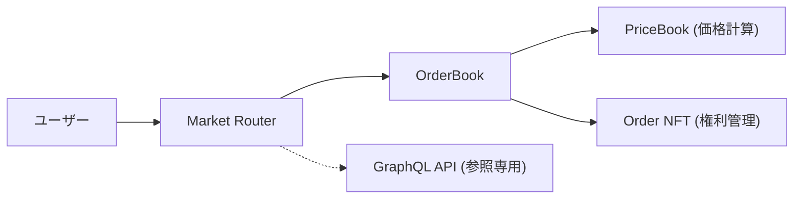
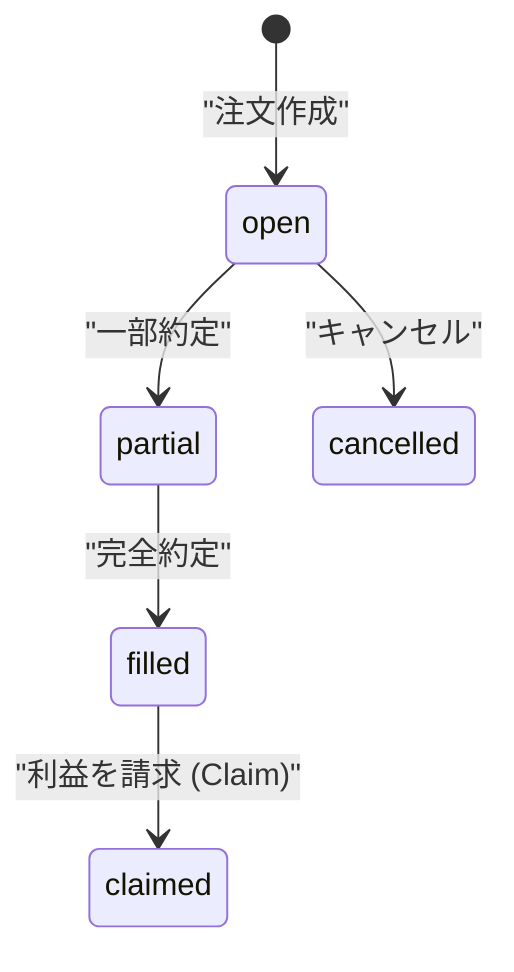

# 1. 導入：既存DEXがFX決済で直面する「限界」

現在、DeFi（分散型金融）の世界ではUniswapに代表されるAMM（自動マーケットメーカー）が主流です。

しかし、USDCとJPYCのような「ステーブルコイン同士の交換（オンチェーンFX）」においてAMMは必ずしも最適解ではありません。

そこで登場したのが今回紹介する**Sera Protocol**です。


### 1.1 なぜUniswap（AMM）では不十分なのか？

AMMの根幹である `$x 	imes y = k$` モデルは、未知の資産に対して「価格を発見する」のには優れています。しかし、ステーブルコインはすでにオフチェーンの法定通貨市場で価格が決まっています。

既存のAMMには、以下の3つの大きな課題があります：

1.  **スリッページ**: 取引量が増えるほど価格が不利になる。
2.  **インパーマネントロス**: 流動性提供者が常にリスクにさらされる。
3.  **資本効率**: 流動性をプールに「死蔵」させる必要がある。

### 1.2 Sera Protocolの挑戦

Sera Protocolは、Ethereum Sepoliaテストネットで稼働する、**完全オンチェーンの中央リミット・オーダーブック（CLOB）** です。

「すでに価格が決まっているFXに価格発見は不要」という思想のもと伝統的な金融（TradFi）に近い板取引を実現しています。

この記事では、Seraがどのようにしてガス代を抑えつつ、オンチェーンで高効率なFX決済を実現しているのか、その技術的背景を解剖します。

# 2. Sera Protocolの核心アーキテクチャ

Seraは複数の専門的なスマートコントラクトが連携して動作する高度にモジュール化された設計を採用しています。

### 2.1 コンポーネント構成

主要なコンポーネントの役割は以下の通りです：

- **Market Router**: ユーザーが直接対話するメインエントリポイント。
- **OrderBook**: 各ペアごとの注文マッチングと決済を担当。
- **PriceBook**: Sera独自の「算術価格モデル」を処理。
- **Order NFT**: 各注文をNFTとして表現し、所有権を管理。



### 2.2 算術価格モデル（Arithmetic Price Book）の魔術

オンチェーンで板取引を行う最大の障壁は「ガス代」です。

Seraは価格を `uint256` の生数値ではなく、0〜65,535（`uint16`）の**インデックス**で管理することでこの問題を解決しました。

**価格計算式：**
$$Price = minPrice + (priceIndex 	imes tickSpace)$$

- `minPrice`: 市場でサポートされる最小価格。
- `tickSpace`: 各価格インデックス間の刻み幅（Tick間隔）。

この仕組みにより、ストレージコストを大幅に削減しつつ、精密な価格設定が可能になります。

### 2.3 Order NFT：注文のコンポーザビリティ

Seraでリミットオーダーを出すと、その注文の権利を表す**NFT**が発行されます。
これにより、以下のような高度な活用が可能になります：

- 注文の権利を他者に譲渡する。
- 注文自体を担保に別のアセットを借りる。
- AIエージェントがプログラムを通じて注文を管理する。

# 3. 実装ガイド：Seraを「叩く」エンジニアの実践

開発者はデータの読み取りには高速な **GraphQL** を状態の変更（注文の実行）には **スマートコントラクト** を使用します。

### 3.1 データの読み取り（Read）：GraphQLの活用

板の深さ（Depth）を取得するにはGoldskyパワードのAPIを使用します。
これはガス代がかからず、リアルタイムに近い速度でレスポンスが得られます。

```graphql
query GetDepth($market: String!) {
  # 買い板（Bids）を取得
  bids: depths(
    where: { market: $market, isBid: true, rawAmount_gt: "0" },
    orderBy: priceIndex,
    orderDirection: desc,
    first: 10
  ) {
    priceIndex
    price
    rawAmount
  }
}
```

### 3.2 注文の実行（Write）：Market Routerの呼び出し

指値注文（Limit Bid）を出す際の Solidity 関数シグネチャの一部を紹介します。

```json
{
  "name": "limitBid",
  "inputs": [{
    "name": "params",
    "type": "tuple",
    "components": [
      { "name": "market", "type": "address" },
      { "name": "priceIndex", "type": "uint16" },
      { "name": "rawAmount", "type": "uint64" },
      { "name": "postOnly", "type": "bool" }
      // ... 他のパラメータ
    ]
  }]
}
```

### 3.3 注文のライフサイクル

注文は以下の遷移を辿ります。  
特に、約定後にユーザーが自ら利益を請求（Claim）する仕組みに注意が必要です。



# 4. 応用展望：日本の規制 × AIエージェント × ステーブルコイン

Sera Protocolは単なるDEX以上の可能性を秘めています。

### 4.1 日本におけるステーブルコインのハブ

日本でも改正資金決済法により、JPYCなどの法定通貨担保型ステーブルコインの普及が加速しています。

SeraはJPYC/USDCのようなペアに対して**ゼロ・スリッページ**の決済を提供できるため、グローバル企業の日本法人やクロスボーダー決済を行うフィンテック企業にとって強力なインフラとなります。

### 4.2 AIエージェントが意思を持つ決済

将来、AIエージェントがウォレットを持ち、自律的に取引を行う世界が来ます。

SeraのOrder NFTとGraphQL APIは、エージェントが「最も有利なレートで自動的にFX決済を完了させる」ための理想的なプレイグラウンドを提供します。

# 5. 結論：オンチェーン金融のラストワンマイル

Sera Protocolは、**AMMの限界を「算術価格モデル」と「CLOB」という伝統的かつ革新的なアプローチで突破**しました。

**この記事のまとめ：**

1. **ゼロ・スリッページ**: 指値注文により、FX決済に不可欠な確実性を実現。
2. **ガス最適化**: `uint16` インデックス管理により、オンチェーン板取引を低コスト化。
3. **高機能API**: GraphQLにより、エンジニアフレンドリーな開発環境を提供。

現在、Sera Protocolは **Ethereum Sepoliaテストネット** で稼働中です。

テストユーザーには1,000万トークンのテスト用ステーブルコインが配布されるため、今すぐその資本効率を体験することができます。

### 参考資料

- [Sera Protocol 公式ドキュメント](https://docs.sera.cx/)
- [Sera App (Sepolia Testnet)](https://testnet.sera.cx/)
