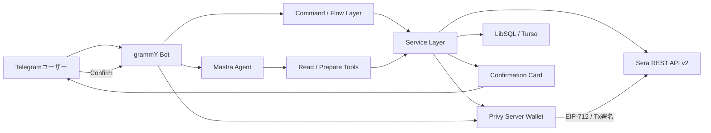
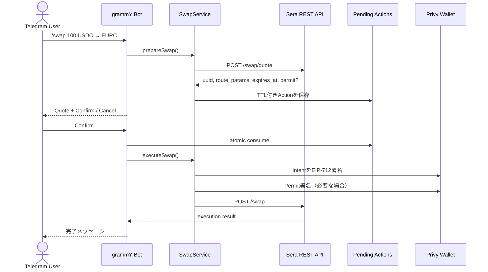
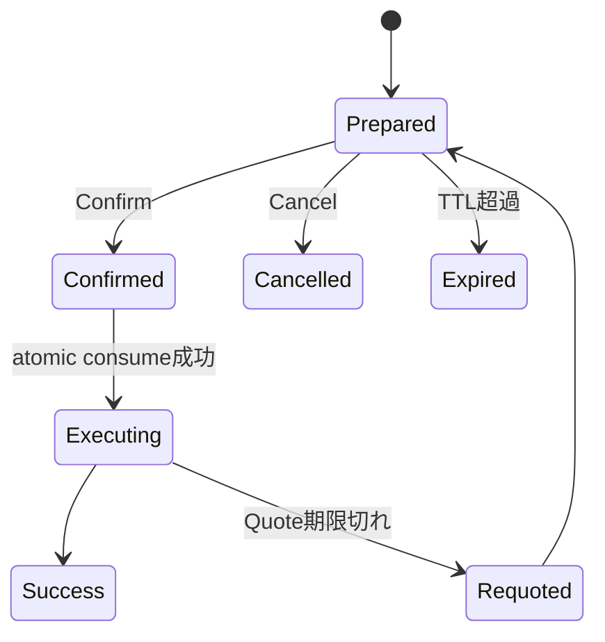

こんにちは！

これまで、Sera Protocolの概要、GraphQL API、コントラクト操作、Reactフロントエンド、MCPサーバー、Agent Skillと、連載形式でSeraの技術を追いかけてきました。

今回はその第8弾として、**TelegramだけでステーブルコインFXを操作できるBot**を開発しました！

この記事は、TypeScriptとWeb3の基礎を知っている開発者を対象にしています。Sera Protocolを初めて知る方でも、Botの全体像からREST API v2、Privyによるウォレット作成、EIP-712署名、安全な確認フローまで追える構成です。

先に完成したBotのデモとソースコードを紹介します！

https://youtu.be/vDMDAgapwSU

https://github.com/mashharuki/SeraProtocol-Sample/tree/main/telegram-bot

:::message
この記事は2026年7月時点の実装をもとにしています。SeraのAPI、対応通貨、コントラクトアドレスは変更される可能性があるため、実際に組み込む際は必ず[公式ドキュメント](https://docs.testnet.sera.cx/)と`GET /config`の結果を確認してください。
:::

## 開発したSera FX Telegram Botとは

今回開発したのは、**Sera ProtocolのREST API v2とPrivyサーバーウォレットを利用し、TelegramだけでステーブルコインFXを行えるオンチェーン取引Bot**です。

ユーザーは専用のWeb画面を開いたり、最初からMetaMaskを用意したりする必要がありません。Telegramで`/start`を実行すると、Privy上にEthereumウォレットが作成され、そのままレート確認や取引の準備へ進めます。

主な特徴は次の4つです。

- シードフレーズ入力なしでオンボーディングできる
- Ethereum Mainnet／Sepolia、日本語／英語に対応する
- Swap、別アドレスへの送金、指値注文、流動性提供をTelegram内で操作できる
- AIは取引を「準備」するだけで、ユーザーがConfirmを押すまで署名・送信しない

最後の設計が、今回もっともこだわったポイントです。

便利だからといって、LLMに秘密鍵や署名権限を直接渡すのは危険です。このBotでは、自然言語を理解するAI Agentと、資金を動かす署名処理を分離しました。

## Botの機能一覧

実装したコマンドは次のとおりです。

| 分類 | コマンド | 内容 |
| --- | --- | --- |
| 初期設定 | `/start` | 言語選択、Privyウォレット作成、Sera APIキー発行 |
| 資産管理 | `/wallet`, `/balance` | アドレス、入金用QR、Wallet／Vault残高の表示 |
| 市場情報 | `/rate`, `/liquidity` | 為替レート、実際にSwap可能な主要ペアの確認 |
| 即時取引 | `/swap` | ガス代込みのQuoteを使った即時両替 |
| 送金 | `/send` | 両替した通貨を指定アドレスへ送付 |
| 指値取引 | `/order`, `/orders` | 指値注文の作成、状態確認、キャンセル |
| 流動性 | `/provide` | Virtual Liquidityで複数市場へ気配を提示 |
| Vault | `/deposit` | ERC-20のapproveとSera Vaultへの入金 |
| Wallet | `/exportkey`, `/importkey` | 秘密鍵のエクスポート／インポート |
| 設定 | `/network`, `/language` | Mainnet／Sepolia、英語／日本語の切り替え |
| AI | 自由入力 | Mastra Agentによる説明と取引の準備 |

`/swap`は自分のウォレットへ両替結果を返し、`/send`は同じSwapフローの`recipient`だけを第三者アドレスに変えています。そのため「100 USDCをEURCへ両替して、このアドレスへ送る」というクロスボーダー送金も1つのIntentとして扱えます。

:::message alert
Sepoliaの板は時期や通貨ペアによって流動性が少なく、`NO_LIQUIDITY`になることがあります。これはBotの障害とは限りません。`/liquidity`で実際にQuote可能なペアを確認するか、`/deposit`から`/order`へ進み、指値注文のフローを試すのがおすすめです。
:::

## 技術スタック

| レイヤー | 採用技術 | 役割 |
| --- | --- | --- |
| Runtime | Bun + TypeScript | Bot、API、テストの実行 |
| Telegram | grammY 1.44 | Command、Session、Inline Keyboard |
| HTTP API | Hono 4.12 + Zod OpenAPI | Webhook、Health Check、Swagger UI |
| Sera | REST API v2 | Rate、Swap、Order、Vault、Virtual Liquidity |
| Wallet | Privy Node SDK 0.25 | Ethereumウォレット、EIP-712／Transaction署名 |
| Web3 | viem 2.55 | Address、Typed Data、単位変換 |
| AI Agent | Mastra 1.x + Claude | 自然言語理解、read／prepareツール |
| DB | LibSQL／Turso | User、API Key、Order、Pending Action、Memory |
| Validation | Zod 4 | 環境変数とAPIレスポンスの検証 |
| Quality | Bun Test、TypeScript、Biome | Test、型検査、Lint／Format |
| Deployment | Docker、Cloud Run | polling／webhookモードでの運用 |

Bot本体は`grammY`で構築し、同じプロセス内でHonoのHTTPサーバーも起動します。ローカルではpolling、本番のCloud Runではwebhookを使えるようにしました。

また、読み取り専用のAPIとSwagger UIも公開しています。資金移動やユーザー固有情報はHTTP APIへ出さず、Telegram側だけに閉じています。

## 全体アーキテクチャ

全体像は次のようになっています。



コマンド処理とMastra Toolは、どちらも共通のService Layerを呼び出します。ここにはレート取得、Swap、Order、Depositなどのドメインロジックを集約しました。

重要なのは、**Mastra Agentから`PrivySigner`へ直接到達する経路を作っていない**ことです。

AIが実行できるのは、読み取りとPending Actionの作成までです。署名処理へ進めるのは、Telegramの確認カードでユーザーがConfirmを押した場合だけです。

## Sera Protocol REST API v2をどう使っているのか

過去の記事では、GraphQL Subgraphやv1の`Router`／`OrderBook`／`PriceBook`を扱いました。

今回のBotはそれとは異なり、**SeraのREST API v2**を利用しています。v2ではユーザーがEIP-712のOrderまたはIntentへ署名し、オフチェーンでマッチング、Vaultを通じてオンチェーン決済します。

新規アプリケーションでは、OrderのTyped Data生成、Smart Order Routing、Transaction構築などを担ってくれるREST APIを利用すると、統合処理を大幅に減らせます。

### 利用している主なエンドポイント

| 用途 | Endpoint |
| --- | --- |
| システム情報 | `GET /health`, `/system/time`, `/config` |
| 通貨・市場 | `GET /tokens`, `/markets`, `/fx/rate` |
| APIキー | `POST /api-keys` |
| Swap | `POST /swap/quote`, `/swap` |
| 指値注文 | `POST /orders/preview`, `/orders`, `/orders/cancel` |
| 注文状態 | `GET /orders/{order_id}` |
| Virtual Liquidity | `POST /orders/vl/batch`, `/orders/vl/cancel` |
| 残高 | `GET /balances` |
| Vault入金 | `POST /approve`, `/deposit`, `/tx/send` |

### 型安全なAPIクライアント

APIアクセスは`SeraClient`へ集約しました。共通リクエスト処理では、API Key認証、429のリトライ、JSONのパース、Zodによるレスポンス検証を行っています。

```typescript:src/sera/client.ts
private async request<T>(
  path: string,
  schema: z.ZodType<T>,
  opts: RequestOptions = {},
): Promise<T> {
  const url = new URL(this.baseUrl + path);
  for (const [key, value] of Object.entries(opts.query ?? {})) {
    if (value !== undefined) url.searchParams.set(key, String(value));
  }

  const headers: Record<string, string> = { accept: "application/json" };
  if (opts.body !== undefined) headers["content-type"] = "application/json";
  if (opts.auth) {
    if (!this.apiKey) throw new Error("API key not configured");
    headers.authorization = `Bearer ${this.apiKey.key}:${this.apiKey.secret}`;
  }

  let res: Response;
  for (let attempt = 0; ; attempt++) {
    res = await this.fetchImpl(url, {
      method: opts.method ?? (opts.body !== undefined ? "POST" : "GET"),
      headers,
      body: opts.body !== undefined ? JSON.stringify(opts.body) : undefined,
    });
    if (res.status !== 429 || attempt >= 2) break;

    const retryAfter = Number(res.headers.get("retry-after"));
    const waitSec = Number.isFinite(retryAfter) ? retryAfter : 1;
    await new Promise((resolve) => setTimeout(resolve, waitSec * 1000 + 100));
  }

  const text = await res.text();
  const json = text ? JSON.parse(text) : {};
  if (!res.ok) {
    throw new SeraApiError(res.status, extractErrorCode(json), text, path);
  }

  const parsed = schema.safeParse(json);
  if (!parsed.success) {
    throw new SeraApiError(res.status, "SCHEMA_MISMATCH", parsed.error.message, path);
  }
  return parsed.data;
}
```

記事用に一部を短くしていますが、実装ではレスポンスがJSONでなかった場合も含めてエラーを正規化しています。

`GET /config`は10分間キャッシュします。Chain ID、コントラクトアドレス、EIP-712 domainはネットワークごとに変わる可能性があるため、コードへハードコードしていません。

もう1つハマりやすいのがAddressの大文字・小文字です。

```typescript:src/sera/client.ts
async getBalances(ownerAddress: string): Promise<SeraBalanceRow[]> {
  const res = await this.request("/balances", balancesResponseSchema, {
    auth: true,
    query: { owner_address: ownerAddress.toLowerCase() },
  });
  return res.balances;
}
```

読み取りEndpointの`owner_address`は小文字へ揃えます。一方、EIP-712で署名するpayloadはAPIが返した値、またはチェックサム済みAddressをそのまま使います。この2つを同じ正規化処理へ通してはいけません。

## SwapをQuoteから実行するまで

Botの中心となるSwapフローを詳しく見ていきます。



### 1. Quoteを取得する

まず、ユーザー入力を検証してraw unitへ変換し、`POST /swap/quote`を呼び出します。

```typescript:src/services/swap-service.ts
async prepareSwap(user: UserRow, input: PrepareSwapInput): Promise<SwapCard> {
  const [fromToken, toToken] = await Promise.all([
    this.rateService.findToken(user.network, input.fromSymbol),
    this.rateService.findToken(user.network, input.toSymbol),
  ]);
  if (!fromToken || !toToken) throw new Error("Unknown token");

  const check = validateAmount(input.amount, fromToken.decimals);
  if (!check.ok) throw new Error(`Invalid amount (${check.reason})`);

  const rawAmount = toRawUnits(input.amount, fromToken.decimals);
  const sera = this.publicSera(user.network);
  const serverTime = await sera.getSystemTime();
  const quote = await sera.swapQuote({
    from_token: fromToken.address,
    to_token: toToken.address,
    from_amount: rawAmount.toString(),
    owner_address: user.walletAddress,
    recipient: input.recipient ?? user.walletAddress,
    expiration: serverTime + 300,
    gas_mode: "receive_less",
  });

  return this.quoteToCard(user, quote, {
    fromSymbol: fromToken.symbol,
    toSymbol: toToken.symbol,
    fromAmount: input.amount,
    toDecimals: toToken.decimals,
    recipient: input.recipient,
  });
}
```

ローカル時刻ではなく`GET /system/time`を使うのは、署名期限とSera側の時刻がずれて無効になるのを防ぐためです。

`gas_mode: "receive_less"`では、実行コストが受取額へ反映されたQuoteが返ります。そのためSwap利用者はガス用ETHを別途用意する必要がありません。指値注文用のVault入金は別フローなので、こちらはETHが必要です。

この時点では署名も資金移動も行いません。Quoteの`route_params`、`uuid`、有効期限をPending Actionへ保存し、Telegramに確認カードを返すだけです。

### 2. Confirm後にEIP-712署名する

ユーザーがConfirmを押した後、初めてPrivyへ署名を依頼します。

```typescript:src/services/swap-service.ts
async executeSwap(user: UserRow, payload: SwapActionPayload) {
  const sera = this.publicSera(user.network);
  const config = await sera.getConfig();

  const signature = await this.signer.signTypedData(user.walletId, {
    domain: config.eip712_domain as Record<string, unknown>,
    types: INTENT_EIP712_TYPES,
    primaryType: "Intent",
    message: payload.routeParams,
  });

  const permitSignature = payload.permitEip712
    ? await this.signer.signTypedData(user.walletId, payload.permitEip712)
    : undefined;

  try {
    await sera.submitSwap({
      uuid: payload.uuid,
      signature,
      ...(permitSignature && payload.permitDeadline
        ? {
            permit_signature: permitSignature,
            permit_deadline: payload.permitDeadline,
          }
        : {}),
    });
    return { status: "success" as const };
  } catch (error) {
    if (error instanceof SeraApiError && error.isStaleQuote) {
      return {
        status: "requoted" as const,
        card: await this.prepareSwap(user, {
          fromSymbol: payload.fromSymbol,
          toSymbol: payload.toSymbol,
          amount: payload.fromAmount,
          recipient: payload.recipient,
        }),
      };
    }
    throw error;
  }
}
```

ここには重要な違いがあります。

:::message alert
`/swap/quote`の`route_params`は、完成済みTyped Data全体ではなく、`Intent`構造体のmessageです。`domain`は`GET /config`から取得し、`types`と`primaryType`を付けて署名します。

一方、Quote内の`permit.eip712`はPermit用の完成済みTyped Dataです。こちらは再構築せず、そのまま署名します。
:::

つまり「APIレスポンスを何でも同じ形で`signTypedData`へ渡す」のは誤りです。Endpointごとのwire formatを確認し、**署名対象のフィールド値は変更しない**ことが重要です。

Quoteが期限切れになっていた場合は、そのまま失敗表示にせず再Quoteします。ただし新しい価格を黙って実行してはいけないので、新しい確認カードを表示して再度Confirmを求めます。

## Privyを採用した理由

Telegram Botで悩むのがウォレット接続です。

WebアプリならWalletConnectやブラウザ拡張を使えますが、チャットUIから外部ウォレットへ何度も移動させると、体験が複雑になります。そこで今回はPrivyのNode SDKを使い、TelegramユーザーごとにEthereumサーバーウォレットを作成しました。

```typescript:src/privy/signer.ts
async createWallet(telegramUserId: number): Promise<CreatedWallet> {
  const externalId = `tg-${telegramUserId}`;
  const wallet = await this.privy.wallets().create({
    chain_type: "ethereum",
    external_id: externalId,
    display_name: `Telegram user ${telegramUserId}`,
    idempotency_key: `create-${externalId}`,
    ...(this.walletAuth
      ? { owner: { public_key: this.walletAuth.publicKeySpki } }
      : {}),
  });

  return { walletId: wallet.id, address: wallet.address };
}
```

`external_id`でTelegram user IDとの対応を持たせ、`idempotency_key`で`/start`の二重タップやリトライによる重複作成を防いでいます。

DBへ保存するのは`walletId`とAddressです。通常の取引フローで秘密鍵を取得したり、DBへ保存したりはしません。

EIP-712署名は次のようにPrivyへ委譲します。

```typescript:src/privy/signer.ts
async signTypedData(
  walletId: string,
  typedData: SeraTypedDataPayload,
): Promise<string> {
  const result = await this.privy
    .wallets()
    .ethereum()
    .signTypedData(walletId, {
      params: {
        typed_data: {
          domain: typedData.domain,
          types: typedData.types,
          primary_type: typedData.primaryType,
          message: typedData.message,
        },
      },
    });

  if (!result.signature) throw new Error("No signature returned");
  return result.signature;
}
```

任意のP-256 authorization keyをウォレットownerとして設定すると、`/exportkey`と`/importkey`も有効化できます。この機能ではPrivy SDKの高レベルAPIを使い、HPKE処理をSDKへ任せています。

- Exportした秘密鍵を含むTelegramメッセージは60秒後に削除する
- Import元のメッセージは直ちに削除する
- 秘密鍵をDBやログへ書き込まない
- authorization key未設定時は機能自体を無効化する

ただし、サーバー側のauthorization keyがウォレットを制御する構成では、バックエンドの秘密管理が非常に重要です。Cloud Secret Managerなどを使い、ソースコードや`.env`を公開しないようにしてください。

## 指値注文とVault

SwapはWallet残高から直接実行できますが、指値注文はあらかじめSera Vaultへ資金を入れておく必要があります。

Botでは次の順に処理します。

1. `GET /markets`で`tick_precision`と`quantity_precision`を取得
2. 価格と数量が市場の精度ルールに合うか検証
3. Vault残高を確認
4. `POST /orders/preview`でEIP-712 Orderを生成
5. APIが返したTyped DataをPrivyで署名
6. `POST /orders`へ署名付き注文を送信
7. `order_id`と`uuid_int`をDBへ保存

注文はクライアント側でUUIDを作成します。再送時も同じ`order_id`を使うことで、サーバー側の重複排除を利用できます。`uuid_int`はオンチェーンで署名されるuint256表現で、`order_id`と一致するエンコードが必要です。

Vault残高が足りない場合は、`/deposit`で次のフローを実行します。

```text
POST /approve  → unsigned approve transaction
Privyで署名
POST /tx/send  → approveをbroadcast

POST /deposit  → unsigned deposit transaction
Privyで署名
POST /tx/send  → depositをbroadcast
```

:::message
SwapはQuoteへガスコストを含められるためETH不要ですが、Vaultへのapprove／depositはユーザーのウォレットからオンチェーントランザクションを送るため、少量のETHが必要です。
:::

注文のキャンセルにはクールダウンがあります。Botは注文時刻を保存し、期間内にCancelが押された場合は、残り時間を案内します。

## Virtual Liquidityで複数市場へ気配を出す

`/provide`では、Sera v2のVirtual Liquidityを利用しています。

通常、3つの市場へそれぞれ1,000 USDC分の注文を出すなら、合計3,000 USDCの担保が必要に見えます。Virtual Liquidityでは、異なる市場に出す2〜50本の注文が1つの予算を共有し、Vaultが凍結するのは最大1レッグ分です。

```text
1,000 USDC → EURC/USDCのBid
1,000 USDC → XSGD/USDCのBid
1,000 USDC → JPYC/USDCのBid

共有予算: 1,000 USDC
```

どれかが約定して予算を消費すると、残りの兄弟注文が自動的に縮小されます。複数のFX市場へ流動性を出したいMarket Makerにとって、資本効率の高い仕組みです。

実装上は、各レッグが同じVL group IDを共有し、`leg_id`だけを変えた`uuid_int`を署名します。通常注文用のエンコードをそのまま使うとAPIに拒否されるため、VL preview後に`uuid`フィールドだけをVL形式へ差し替え、その他のフィールドはAPIの値を変更しないようにしています。

## 資金移動を安全にするPending Action

今回のBotでは、すべての資金移動を次の経路へ統一しました。

```text
取引を準備
  ↓
pending_actionsへ保存
  ↓
Telegramに確認カードを表示
  ↓
ユーザーがConfirm
  ↓
単回使用Actionをconsume
  ↓
Privyで署名
  ↓
Sera APIへ送信
```

Pending Actionには、Quoteや注文payloadのほか、Telegram user ID、ネットワーク、有効期限、消費時刻を保存します。

```typescript:src/services/pending-actions.ts
async consume<T>(id: string, telegramUserId: number): Promise<ConsumeResult<T>> {
  const row = await this.repo.find(id);
  if (!row) return { status: "not_found" };
  if (row.telegramUserId !== telegramUserId) return { status: "wrong_user" };
  if (row.consumedAt !== null) return { status: "already_used" };
  if (row.expiresAt < Date.now()) return { status: "expired" };

  const won = await this.repo.consume(id);
  if (!won) return { status: "already_used" };

  return {
    status: "ok",
    payload: JSON.parse(row.payload) as T,
    row,
  };
}
```

`repo.consume()`は、未使用の場合だけ`consumed_at`を更新します。確認ボタンを連打したり、同じcallbackが再送されたりしても、atomic updateに勝った1回だけが実行されます。

また、Action IDはTelegramの`callback_data`上限へ収まる短いランダム文字列にしています。payloadそのものをボタンへ埋め込まず、DB側から取り出す設計です。



この仕組みにより、次のケースをまとめて防げます。

- 別ユーザーによるAction IDの使用
- 期限切れQuoteの実行
- Confirmの二重タップ
- Cancel済みActionの再利用
- AIが作成したActionの無承認実行

## Mastra AI Agentを安全に組み込む

自由入力のメッセージはMastra Agentへ渡しています。例えば「100 USDCをEURCに替えたい」と入力すると、Agentが必要なToolを選び、Swapの確認カードを準備します。

MastraのAgentには次のToolだけを登録しました。

- Read: FX Rate、Market、Liquidity、Balance、Order
- Prepare: Swap、Send、Limit Order

Prepare Toolの実装は次のようになっています。

```typescript:src/mastra/tools/prepare-tools.ts
export const prepareSwapTool = createTool({
  id: "prepare-swap",
  description: "Prepare a swap. The user must tap Confirm before execution.",
  inputSchema: z.object({
    fromSymbol: z.string(),
    toSymbol: z.string(),
    amount: z.string(),
  }),
  outputSchema: z.object({ result: z.string() }),
  execute: async (input, context) => {
    const resolved = await requireUser(context?.requestContext);
    if ("error" in resolved) return { result: resolved.error };

    const card = await resolved.services.swaps.prepareSwap(
      resolved.user,
      input,
    );
    getCardCollector(context?.requestContext)?.push({
      kind: "swap",
      actionId: card.actionId,
      card,
    });

    return {
      result: "Swap prepared. Ask the user to review and tap Confirm.",
    };
  },
});
```

`requestContext`にはBot側で確認済みのTelegram user ID、言語、Network、Wallet Addressを設定します。モデルが生成した引数からユーザーIdentityを受け取らないのがポイントです。

Agentが作った確認カードも、コマンド操作と同じcallbackへ合流します。つまり、AI用の特別な署名ルートはありません。

> AIが取引を実行するのではなく、AIが取引内容を準備し、人間が実行を承認する。

この境界を守れば、自然言語の便利さを取り入れながら、LLMの誤解やPrompt Injectionがそのまま資金移動につながるリスクを減らせます。

`ANTHROPIC_API_KEY`が設定されていない場合は自由入力だけを無効化し、通常コマンドはそのまま利用できるようにしています。

## セットアップ

### 前提環境

- Git
- Bun 1.x
- Telegram Bot Token
- Privy App ID／App Secret
- Sepoliaで試す場合はテスト用ETHと対応トークン

### 1. リポジトリを取得する

```bash
git clone https://github.com/mashharuki/SeraProtocol-Sample.git
cd SeraProtocol-Sample/telegram-bot
bun install
cp .env.example .env
```

### 2. 環境変数を設定する

最低限、次の値を設定します。

```dotenv
# Telegram @BotFatherで取得
TELEGRAM_BOT_TOKEN=

# Privy Dashboardで取得
PRIVY_APP_ID=
PRIVY_APP_SECRET=

DEFAULT_NETWORK=sepolia
```

AIチャットや永続DB、鍵のExport／Importを使う場合は次も設定します。

```dotenv
ANTHROPIC_API_KEY=

# ローカルはSQLite、Cloud RunではTursoを推奨
DATABASE_URL=file:./data/bot.db
DATABASE_AUTH_TOKEN=

# bun scripts/gen-wallet-auth-key.tsで生成
WALLET_AUTH_PRIVATE_KEY=
WALLET_AUTH_PUBLIC_KEY=
```

:::message alert
`.env`にはTelegram Token、Privy App Secret、authorization private keyなどの秘密情報が含まれます。Gitへコミットせず、本番ではSecret Managerを使用してください。
:::

### 3. Botを起動する

```bash
bun run dev
```

デフォルトはpollingモードです。起動後、作成したBotをTelegramで開き、`/start`を送信します。

### 4. 動作確認する

1. `/start`で言語を選択し、Walletを作成する
2. `/wallet`でAddressと入金用QRを確認する
3. Sepolia ETHとテスト用トークンを送る
4. `/balance`で残高を確認する
5. `/rate`で通貨ペアのレートを確認する
6. `/swap`または`/order`で確認カードを表示する
7. 内容を確認してConfirmを押す
8. 自由入力でAIのprepare-onlyフローを試す

Mainnetで試す場合は、必ず少額から始めてください。

### 5. Testと型検査

```bash
bun run typecheck
bun test
bun run check
```

Testでは、数量精度、UUID変換、Pending Actionの単回使用、Quote期限切れ、Order、Deposit、Virtual Liquidity、秘密鍵Export／Importなどを確認しています。

### Dockerで起動する

```bash
docker compose up --build -d
docker compose logs -f sera-fx-bot
```

ローカルSQLiteは`./data`へマウントされます。Cloud Runで`file:`のまま使うと再起動時に消えるため、本番ではTursoなどの永続LibSQLを設定します。

## 実装して分かったこと

最後に、今回の開発で特に重要だった点をまとめます。

### 署名payloadはEndpointごとに形が違う

`/orders/preview`は完成済みのEIP-712 payloadを返します。一方、`/swap/quote`の`route_params`はIntentのmessageです。似ているからと同じ処理へ押し込まず、API仕様と実レスポンスを確認する必要がありました。

### EIP-712のフィールド値を勝手に変更しない

Addressや数値を「親切に」整形すると署名が変わります。APIが署名用として返した値は、そのまま扱うのが原則です。表示用のフォーマット処理と署名用payloadは分離しました。

### Quoteは期限切れになる前提で設計する

チャットでは、ユーザーが確認カードを見たまま数分離席することがあります。期限切れを単なるエラーにせず、再Quote→再確認へ戻すことで安全性とUXを両立できます。

### TelegramにはUI上の制約がある

`callback_data`は短く保つ必要があり、数千市場をInline Keyboardへ並べることもできません。そのため、ボタン操作では主要通貨へ絞り、その他の市場はAIチャットから検索できるようにしました。

### Cloud Runのスケールアウトには追加対応が必要

注文やSwapの永続情報はLibSQLへ保存していますが、入力途中の会話フローは一部インメモリです。現在は`max-instances=1`を前提としており、複数Instanceへ広げる場合はSessionも共有DBへ移す必要があります。

## まとめ

今回は、Sera ProtocolのREST API v2、Privy、grammY、Mastraを組み合わせて、Telegramから操作できるオンチェーンFX Botを開発しました。

実装を通じて得られたポイントは次の3つです。

- Sera REST API v2を使うと、Swap、送金、指値注文、Vault、Virtual LiquidityをTypeScriptから統合できる
- Privyを使うことで、TelegramユーザーごとのWallet作成とEIP-712署名をバックエンドへ組み込める
- AIと署名処理を分離し、単回使用の確認カードを必須にすることで、便利さと安全性を両立できる

単に「AIが勝手に取引してくれるBot」を目指すのではなく、**AIが準備し、人間が確認し、決定的な処理だけを信頼できるコードが実行する**という役割分担が、金融Agentを作るうえで非常に重要だと感じました。

興味を持った方は、ぜひデモ動画とソースコードを確認してみてください！

https://youtu.be/vDMDAgapwSU

https://github.com/mashharuki/SeraProtocol-Sample/tree/main/telegram-bot

## Xのフォローもよろしくお願いします！

https://x.com/haruki_web3

## 参考リンク

- [Sera Protocol公式ドキュメント](https://docs.testnet.sera.cx/)
- [Sera Protocol API Reference](https://docs.testnet.sera.cx/api-reference/)
- [Sera Orderbook Contract v2](https://github.com/sera-cx/orderbook-contract-v2)
- [Privy公式ドキュメント](https://docs.privy.io/)
- [Privy: Create a wallet](https://docs.privy.io/wallets/wallets/create/create-a-wallet)
- [grammY公式ドキュメント](https://grammy.dev/guide/)
- [Mastra公式ドキュメント](https://mastra.ai/docs/agents/overview)
- [過去のSera Protocol記事一覧](https://zenn.dev/mashharuki)
