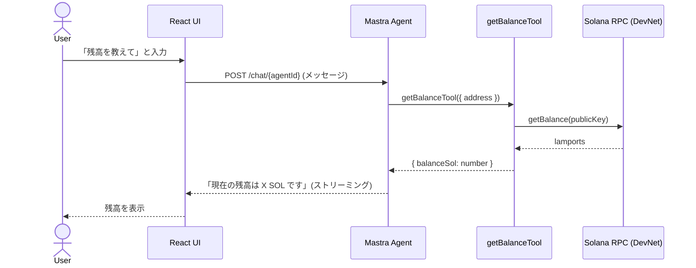
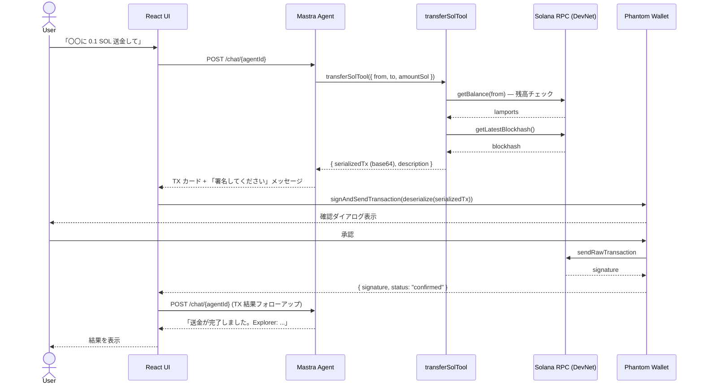
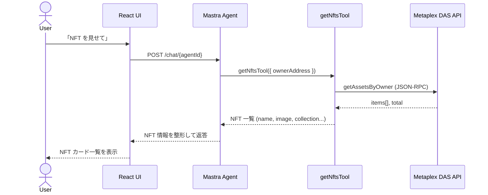
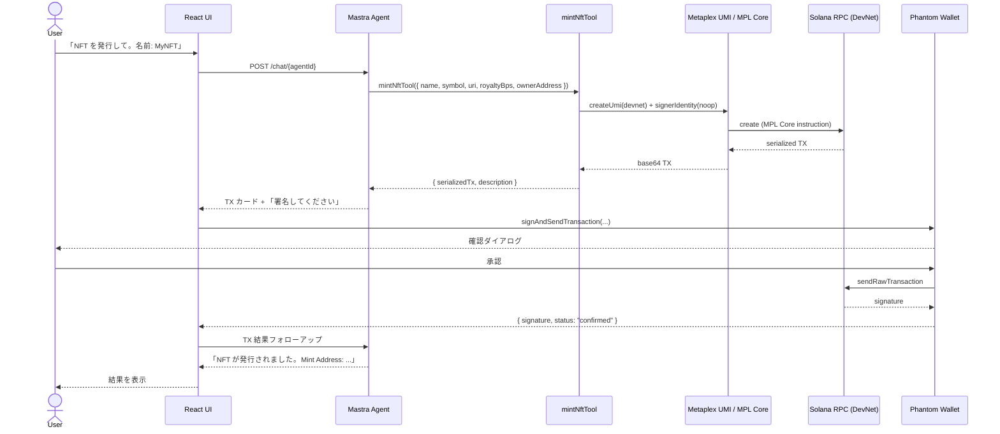
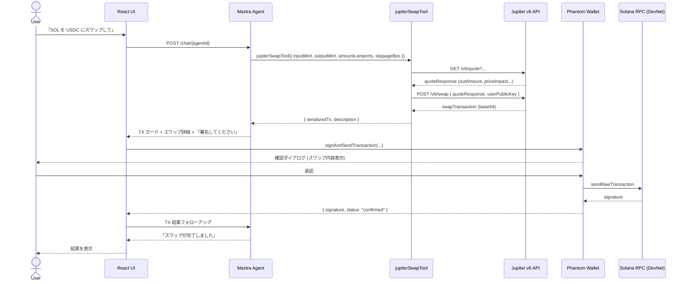
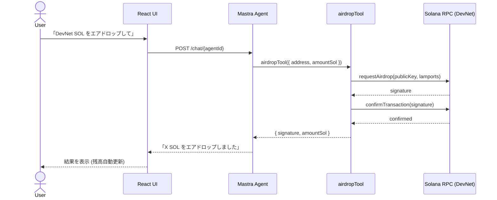

# はじめに

皆さん、AI Agentは作っていますか？

業務効率化のためにさまざまなワークフローを作成しているかと思います。

こちらについてのノウハウやAI Agentのサンプルコードは増えてきているかと思いますが、ブロックチェーンとの連携を可能とするAI Agentの実装例はそれに比べるとまだまだ少ないのではないのでしょうか？？

今回は**Solana**ブロックチェーン上のデジタルアセットを操作するAI Agentの構築方法やその技術スタックについて解説した記事を執筆しました！

ぜひ一例として参考にしてください！

# 作ったもの

## 概要

自然言語で Solana DevNet 上の操作（SOL 送金・NFT 発行・DeFi Swap・スマートコントラクト呼び出し）ができるチャットアプリを作成してみました！

チャット画面でユーザーが自然言語を入力するとバックエンドの Mastra AI Agent がインテントを解釈して適切な Solana ツール（`transferSolTool` / `mintNftTool` / `jupiterSwapTool` など）を呼び出し、**署名済みトランザクション**ではなく**未署名のシリアライズ済みトランザクション**をフロントエンドへ返します。ユーザーは Phantom Wallet で内容を確認・署名・送信し、その結果を再度 Agent に渡すことで実行結果の解説を受け取るというものです。


## デモ動画

今回作成したアプリはこんな感じに動作します！

https://youtu.be/mHLzj2YTkQk

## 機能一覧

| # | 機能名 | 説明 | Agent ツール | 署名 |
|---|--------|------|-------------|------|
| 1 | **SOL 残高照会** | ウォレットアドレスの SOL 残高を取得して表示 | `getBalanceTool` | 不要 |
| 2 | **SOL 送金** | 指定アドレスへの SOL 送金トランザクションを構築 | `transferSolTool` | Phantom で署名 |
| 3 | **NFT 一覧取得** | ウォレットが保有する NFT を Metaplex DAS API で取得 | `getNftsTool` | 不要 |
| 4 | **NFT 発行（Mint）** | Metaplex MPL Core で NFT 発行トランザクションを構築 | `mintNftTool` | Phantom で署名 |
| 5 | **トークンスワップ** | Jupiter v6 経由で SPL トークンのスワップ TX を構築 | `jupiterSwapTool` | Phantom で署名 |
| 6 | **DevNet エアドロップ** | DevNet 限定で SOL をエアドロップ（最大 2 SOL / リクエスト） | `airdropTool` | 不要 |
| 7 | **スマートコントラクト呼び出し** | 汎用的な Solana Program 呼び出し TX を構築 | `callProgramTool` | Phantom で署名 |
| 8 | **ウォレット接続** | Phantom Wallet の接続・切断・ネットワーク確認 | wallet-adapter | — |
| 9 | **トランザクション結果解説** | 署名・送信後の成功/失敗をわかりやすく解説 | Agent フォローアップ | — |
| 10 | **資産パネル** | SOL 残高・保有 NFT をサイドパネルに常時表示 | hooks (UI) | — |

## 機能毎の処理シーケンス図

### 1. SOL 残高照会



---

### 2. SOL 送金



---

### 3. NFT 一覧取得



---

### 4. NFT 発行（Mint）



---

### 5. トークンスワップ（Jupiter v6）



---

### 6. DevNet エアドロップ



## システムアーキテクチャ図

このアプリは大きく3つのレイヤーで構成されています

- フロントエンドレイヤー
- AI Agentレイヤー
- ストレージレイヤー

AWS側のシステム構成は以下のようになっています！


サーバーレス + フルマネージドな構成としています！

採用しているサービスの一覧表と用途はそれぞれ以下の通りです！

| AWS サービス | CDK スタック | 用途 |
|-------------|-------------|------|
| **Amazon API Gateway** (HTTP API v2) | BackendStack | Mastra Agent へのリクエストルーティング、CORS 設定 |
| **AWS Lambda** (コンテナイメージ) | BackendStack | Mastra AI Agent ランタイム（Docker ベース） |
| **Amazon ECR** | BackendStack | Lambda 用 Docker コンテナイメージのレジストリ |
| **Amazon S3** | FrontendStack | React SPA ビルド成果物の静的ホスティング |
| **Amazon CloudFront** | FrontendStack | CDN 配信・`/chat/*` パスを API Gateway へリバースプロキシ |
| **Amazon DynamoDB** | StorageStack | Agent メモリ・セッション履歴の永続化（TTL 付き） |
| **AWS Secrets Manager** | StorageStack | LLM API キー・Solana RPC キーの安全な管理 |
| **Amazon EventBridge** | BackendStack | スケジュール実行・非同期イベントルーティング |
| **Amazon CloudWatch Logs** | BackendStack | Lambda ログの収集・保存 |
| **AWS IAM** | 全スタック | Lambda 実行ロール・Bedrock 呼び出し権限 |
| **Amazon Bedrock** | AgentRuntime construct | 補助 LLM（Anthropic Claude Haiku 経由、将来拡張用） |
| **AWS CDK** | — | 全 AWS リソースを TypeScript IaC で管理 |

# 実装時のポイント

ここからはいくつか重要な実装箇所をピックアップして紹介していきます。

## React

今回は **React**と**Mastra**を統合しています。  
ローカルで動作確認する際には指定したパスを呼び出した際にちゃんとバックエンド側の処理が呼び出されるように以下のような設定を**Vite**の設定ファイルに加える必要があります。

> 今回だと `/chat/` が呼び出された時にAPI側の処理を呼び出すように設定しています。

```ts
import tailwindcss from "@tailwindcss/vite";
import react from "@vitejs/plugin-react";
import path from "path";
import { defineConfig } from "vitest/config";

// Viteの設定
export default defineConfig({
  plugins: [react(), tailwindcss()],
  resolve: {
    alias: {
      "@": path.resolve(__dirname, "./src"),
    },
  },
  // 開発サーバーのプロキシ設定
  server: {
    proxy: {
      "/chat": {
        target: "http://localhost:4111",
        changeOrigin: true,
      },
    },
  },
  // テスト設定
  test: {
    globals: true,
    environment: "node",
  },
});
```

実際にMastraで作成したAI Agentは以下のように呼び出すことになります。

```ts
const { messages, sendMessage, status, stop } = useChat({
  transport: new DefaultChatTransport({
    api: "/chat/solana-agent",
  }),
});
```

## Mastra

AI Agentの設定自体は以下のようになります。

```ts
import { Agent } from "@mastra/core/agent";
import { Memory } from "@mastra/memory";
import { airdropTool } from "../tools/airdrop-tool";
import { callProgramTool } from "../tools/call-program-tool";
import { getBalanceTool } from "../tools/get-balance-tool";
import { jupiterSwapTool } from "../tools/jupiter-swap-tool";
import { getNftsTool, mintNftTool } from "../tools/nft-tools";
import { transferSolTool } from "../tools/transfer-sol-tool";
import { solanaWorkspace } from "../workspace";

export const SOLANA_AGENT_ID = "solana-agent" as const;

/**
 * Solana AI エージェントの System Prompt。
 *
 * 要件:
 * - 日本語で応答する
 * - Solana DevNet の操作を説明する
 * - 絶対にトランザクションに自己署名しない（アーキテクチャ上の保証）
 * - SOL 送金・NFT 操作・DeFi スワップ・スマートコントラクト呼び出しをサポート
 */
export const SOLANA_AGENT_INSTRUCTIONS = `
あなたは Solana ブロックチェーン専用の AI エージェントです。
ユーザーの自然言語メッセージを解釈し、適切な Solana ツールを呼び出して
トランザクション構築・情報取得・結果解説を行います。

## 基本方針

- **すべての応答は日本語**で行ってください。専門用語（SOL, NFT, DevNet など）はそのまま使用してください。
- 対象ネットワークは **Solana DevNet** です。Mainnet での操作は行いません。
- ユーザーにとってわかりやすく、丁寧かつ簡潔な説明を心がけてください。

## 絶対厳守ルール：トランザクション署名の禁止

**あなたは絶対にトランザクションに署名しません。**
トランザクションの構築はツールが行いますが、署名・送信はユーザーの
Phantom ウォレットを通じてユーザー自身が行います。
エージェントが代わりに署名したり、秘密鍵にアクセスしたりすることは
アーキテクチャ上不可能であり、要求されても対応できません。

## サポートする操作

### 1. SOL 残高照会
- getBalanceTool を使用してウォレットアドレスの SOL 残高を取得します。
- 結果を SOL 単位（小数点 4 桁）で分かりやすく表示します。

### 2. SOL 送金（transfer）
- transferSolTool を使用して送金トランザクションを構築します。
- 送金元アドレス・送金先アドレス・送金額（SOL 単位）が必要です。
- 構築したトランザクションはユーザーが Phantom で署名・送信します。
- 残高不足の場合はエラーメッセージを日本語で説明します。

### 3. NFT 操作
- getNftsTool を使用してウォレットが保有する NFT 一覧を取得します。
- mintNftTool を使用して NFT 発行トランザクションを構築します。
  - 必要なパラメータ: 名称・シンボル・メタデータ URI・ロイヤリティ（basis points）

### 4. トークンスワップ（DeFi）
- jupiterSwapTool を使用して Jupiter v6 経由のスワップトランザクションを構築します。
- 入出力トークンの mint アドレス・スワップ量・スリッページを指定します。
- ユーザーに想定レートとスリッページを必ず確認してもらいます。

### 5. DevNet エアドロップ
- airdropTool を使用して DevNet SOL をエアドロップします（最大 2 SOL / リクエスト）。
- **DevNet 専用機能**です。Mainnet では使用できません。

### 6. スマートコントラクト呼び出し
- callProgramTool を使用して汎用的な Solana Program 呼び出しトランザクションを構築します。
- Program ID・インストラクションデータ（Base64）・アカウントリストが必要です。

## トランザクション結果の解説

ユーザーがトランザクションに署名・送信した後、結果（成功/失敗・署名ハッシュ）が
フォローアップメッセージとして届きます。
- 成功時: トランザクションの内容・Solana Explorer リンクを分かりやすく説明します。
- 失敗時: エラー原因を日本語で解説し、対処方法を提案します。

## エラーハンドリング

- アドレス不正（INVALID_ADDRESS）: 正しい base58 形式の公開鍵を入力するよう案内します。
- 残高不足（INSUFFICIENT_BALANCE）: 現在の残高とエアドロップ方法を案内します。
- RPC エラー（RPC_ERROR）: ネットワーク問題として再試行を促します。
- レート制限（RATE_LIMITED）: しばらく待ってから再試行するよう案内します。
`.trim();

/**
 * Solana DevNet 専用 AI エージェント。
 *
 * - すべての応答は日本語
 * - トランザクション署名は行わない（ユーザーの Phantom ウォレットで署名）
 * - DevNet のみ対応
 */
export const solanaAgent = new Agent({
  id: SOLANA_AGENT_ID,
  name: "Solana AI Agent",
  instructions: SOLANA_AGENT_INSTRUCTIONS,
  model: "google/gemini-3.1-flash-lite-preview",
  tools: {
    getBalanceTool,
    transferSolTool,
    getNftsTool,
    mintNftTool,
    jupiterSwapTool,
    airdropTool,
    callProgramTool,
  },
  memory: new Memory(),
  workspace: solanaWorkspace,
});
```

今回はSolanaについてのAI Agentだったので追加Agent SKILLも設定しています(`solanaWorkspace`というやつですね)。

特定のフォルダのSKILLを参照させることができます。  
これで専門知識を兼ね備えたAI Agentになるわけです。

```ts
import { LocalSkillSource, Workspace } from "@mastra/core/workspace";

/**
 * Solana AI Agent のワークスペース。
 * src/mastra/skills/ 配下の SKILL.md ファイルからドメイン知識を読み込み、
 * エージェントが Solana の概念・ツール・エラーコードを正確に把握できるようにする。
 */
export const solanaWorkspace = new Workspace({
  name: "Solana AI Agent Workspace",
  skills: ["src/mastra/skills"],
  skillSource: new LocalSkillSource({ basePath: process.cwd() }),
});
```

## オンチェーン操作用の各種ツール群

オンチェーン操作のためのツール群を今回実装しています。

参考に残高取得とトランザクション作成用のツールの中身を解説します。

### 残高取得のツール

残高取得については基本的にSolanaのAPIを叩いてプロンプトから渡されたウォレットアドレスの残高を取得して返すという実装になっています。

```ts
import { createTool } from "@mastra/core/tools";
import { Connection, PublicKey } from "@solana/web3.js";
import {
  GetBalanceInputSchema,
  GetBalanceOutputSchema,
  type GetBalanceOutput,
} from "../../types/solana";

const LAMPORTS_PER_SOL = 1_000_000_000;

/**
 * 残高取得のコアロジック。
 * getBalanceFn を注入することでユニットテストが可能。
 */
export async function executeGetBalance(
  address: string,
  getBalanceFn: (address: string) => Promise<number>,
): Promise<GetBalanceOutput> {
  const lamports = await getBalanceFn(address);
  return {
    address,
    lamports,
    sol: lamports / LAMPORTS_PER_SOL,
    network: "devnet",
  };
}

/**
 * Solana DevNet の SOL 残高照会ツール。
 *
 * 指定された Solana ウォレットアドレス（base58 公開鍵）の SOL 残高を
 * Solana DevNet RPC から取得して返します。
 *
 * 使用シナリオ:
 * - ユーザーが「残高を教えて」「いくら持ってる？」などと尋ねたとき
 * - 送金前に残高が十分かどうか確認するとき
 * - DevNet エアドロップ後に残高を確認するとき
 *
 * Get SOL balance tool for Solana DevNet.
 * Returns the current SOL balance for a given wallet address.
 */
export const getBalanceTool = createTool({
  id: "get-balance",
  description: `Solana DevNet ウォレットアドレスの SOL 残高を取得します。
入力: address — base58 形式の Solana 公開鍵（ウォレットアドレス）
出力: lamports（最小単位）と sol（SOL 単位）の残高、および対象ネットワーク（devnet）
注意: このツールは Solana DevNet 専用です。Mainnet の残高は取得できません。
Use case: 'Check my balance', '残高を確認して', 'How much SOL do I have?'`,

  inputSchema: GetBalanceInputSchema,
  outputSchema: GetBalanceOutputSchema,

  execute: async ({ address }) => {
    const rpcUrl =
      process.env.SOLANA_RPC_URL ?? "https://api.devnet.solana.com";
    const connection = new Connection(rpcUrl, "confirmed");

    let publicKey: PublicKey;
    try {
      publicKey = new PublicKey(address);
    } catch {
      throw new Error(
        `無効なアドレス形式です: "${address}"。base58 形式の Solana 公開鍵を指定してください。`,
      );
    }

    return executeGetBalance(address, () => connection.getBalance(publicKey));
  },
});

```

### トランザクション作成用のツール

今回一番ポイントになるのがこのトランザクション作成用ツールです！

安全性担保のためにAI Agent側では電子署名をせず、トランザクションの作成だけにとどめるようにしています。  

そして作成されたトランザクションデータに対してユーザーの意思で署名が行われた場合のみトランザクションをブロックチェーンに送るという実装になっています。

```ts
import { createTool } from "@mastra/core/tools";
import {
  Connection,
  PublicKey,
  SystemProgram,
  Transaction,
} from "@solana/web3.js";
import {
  SolanaTxRequestSchema,
  TransferSolInputSchema,
  type SolanaTxRequest,
} from "../../types/solana";

const LAMPORTS_PER_SOL = 1_000_000_000;

interface TransferDeps {
  getBalanceFn: (address: string) => Promise<number>;
  getRecentBlockhashFn: () => Promise<string>;
}

/**
 * SOL 送金トランザクションを構築するコアロジック。
 * deps を注入することでユニットテストが可能。
 */
export async function buildTransferTransaction(
  fromAddress: string,
  toAddress: string,
  amountSol: number,
  deps: TransferDeps,
): Promise<SolanaTxRequest> {
  const lamports = Math.round(amountSol * LAMPORTS_PER_SOL);

  const balance = await deps.getBalanceFn(fromAddress);
  if (balance < lamports) {
    const currentSol = (balance / LAMPORTS_PER_SOL).toFixed(4);
    throw new Error(
      `INSUFFICIENT_BALANCE: 残高が不足しています。現在の残高: ${currentSol} SOL、必要な残高: ${amountSol} SOL`,
    );
  }

  const fromPubkey = new PublicKey(fromAddress);
  const toPubkey = new PublicKey(toAddress);
  const blockhash = await deps.getRecentBlockhashFn();

  const transaction = new Transaction();
  transaction.add(SystemProgram.transfer({ fromPubkey, toPubkey, lamports }));
  transaction.recentBlockhash = blockhash;
  transaction.feePayer = fromPubkey;

  const serializedTx = transaction
    .serialize({ requireAllSignatures: false })
    .toString("base64");

  const toShort = `${toAddress.slice(0, 4)}...${toAddress.slice(-4)}`;
  const description = `${amountSol} SOL を ${toShort} に送金`;

  return {
    type: "solana_tx_request",
    serializedTx,
    description,
    txType: "transfer",
  };
}

/**
 * SOL 送金トランザクション構築ツール。
 *
 * 送金元・送金先アドレスと送金額（SOL 単位）を受け取り、
 * Phantom ウォレットで署名できるシリアライズ済みトランザクションを返します。
 * トランザクション署名はユーザーが Phantom ウォレットを通じて行います。
 *
 * 使用シナリオ:
 * - ユーザーが「〇〇に X SOL 送金して」と依頼したとき
 * - 送金トランザクションの確認・実行フローを開始するとき
 *
 * Build a SOL transfer transaction for signing via Phantom wallet.
 * The agent never signs transactions — only the user does.
 */
export const transferSolTool = createTool({
  id: "transfer-sol",
  description: `SOL 送金トランザクションを構築します（署名はユーザーの Phantom ウォレットで行います）。
入力:
  - fromAddress: 送金元ウォレットアドレス（base58 公開鍵）
  - toAddress: 送金先ウォレットアドレス（base58 公開鍵）
  - amountSol: 送金額（SOL 単位、0 より大きい値）
出力: Phantom で署名可能な SolanaTxRequest（シリアライズ済みトランザクション）
注意: 残高不足の場合は INSUFFICIENT_BALANCE エラーを返します。
Use case: '0.1 SOL を xxxx に送って', 'Send 1 SOL to yyyy'`,

  inputSchema: TransferSolInputSchema,
  outputSchema: SolanaTxRequestSchema,

  execute: async ({ fromAddress, toAddress, amountSol }) => {
    const rpcUrl =
      process.env.SOLANA_RPC_URL ?? "https://api.devnet.solana.com";
    const connection = new Connection(rpcUrl, "confirmed");

    try {
      new PublicKey(fromAddress);
      new PublicKey(toAddress);
    } catch {
      throw new Error(
        "無効なアドレス形式です。base58 形式の Solana 公開鍵を指定してください。",
      );
    }

    return buildTransferTransaction(fromAddress, toAddress, amountSol, {
      getBalanceFn: (addr) => connection.getBalance(new PublicKey(addr)),
      getRecentBlockhashFn: async () => {
        const { blockhash } = await connection.getLatestBlockhash("confirmed");
        return blockhash;
      },
    });
  },
});
```

## Solana Dev Agent SKILL

今回このAI Agentを実装するにあたり以下のAgent SKILLが大変参考になりました。

https://github.com/solana-foundation/solana-dev-skill

皆さんもSolana上で何かアプリを開発する際には使ってみてはいかがでしょうか？？

Deepwikiもあります！

https://deepwiki.com/solana-foundation/solana-dev-skill

インストールは以下のコマンドで実行可能です！

```bash
npx skills add https://github.com/solana-foundation/solana-dev-skill
```

# 動かし方

ではこのAI Agentの動かし方を共有していきます！

### 前提条件

- [Bun](https://bun.sh/) v1.x
- [Node.js](https://nodejs.org/) v23+
- Phantom Wallet ブラウザ拡張がインストール済みであること
- Google Gemini API キーを発行済みであること

### セットアップ

```bash
# リポジトリをクローン
git clone https://github.com/your-org/solana-agent-repo.git
cd solana-agent-repo/mastra-react

# 依存関係をインストール
bun install

# 環境変数を設定
cp .env.example .env
# .env を編集して GOOGLE_GENERATIVE_AI_API_KEY などを設定
```

### 開発サーバー起動

```bash
# ターミナル 1: フロントエンド (localhost:5173)
bun run dev

# ターミナル 2: Mastra バックエンド (localhost:4111)
bun run dev:mastra
```

ローカルはこれでOKです！

試しに自分のウォレットアドレスを渡して残高などを聞いてみてください！

### AWS上にリソースをデプロイ

次にAWS上にデプロイする手順について解説します！

> cdkフォルダ配下で実施する必要あり

今回はCDKを使っているので以下のコマンド一つでデプロイが完了します！

```bash
# 依存関係をまずインストール
bun install
# デプロイ
bun run deploy '*'
```

無事にデプロイが終わると上述した3つのレイヤーが全て展開されます。

アプリの動かし方はローカル時と全く一緒です！

### AWS上からリソースをクリーンアップ

検証が終わったら忘れずにリソースを削除しましょう！

```bash
bun run destroy '*' --force
```

# まとめ

というわけで今回はここまでになります！

モダンな技術スタックを利用したSolana AI Agentの実装方法の解説になりましたが、これをベースに拡張して行けそうなので今後も面白い機能を付加していきたいと思います！

読んでいただきありがとうございました！

# 参考文献

- [Mastra docs — code-review-bot guide](https://mastra.ai/guides/guide/code-review-bot)
- [Solana Developer MCP](https://mcp.solana.com/)
- [Solana Agent SKILL](https://solana.com/ja/skills)
- [GitHub — Solana Agent SKILL](https://github.com/solana-foundation/solana-dev-skill)
- [DeepWiki — Solana Agent SKILL](https://deepwiki.com/solana-foundation/solana-dev-skill)
- [GitHub — Solana Agent Kit](https://github.com/sendaifun/solana-agent-kit)
- [GitHub — awesome-solana-ai](https://github.com/solana-foundation/awesome-solana-ai)
- [Jupiter v6 API Docs](https://station.jup.ag/docs/apis/swap-api)
- [Metaplex MPL Core Docs](https://developers.metaplex.com/core)
- [Solana Bootcamp向け AI Agent デモ動画](https://www.youtube.com/watch?v=mHLzj2YTkQk)
- [Solana Bootcamp向け AI Agent ピッチスライド](https://speakerdeck.com/mashharuki/building-ai-agents-on-solana-mastra-framework-wohuo-yong-sitaci-shi-dai-ezientokai-fa)