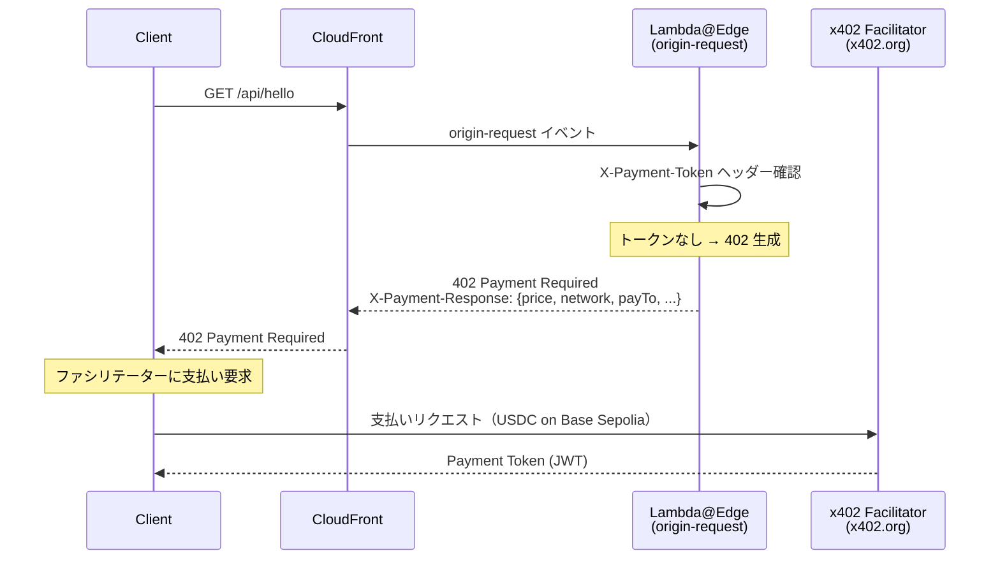
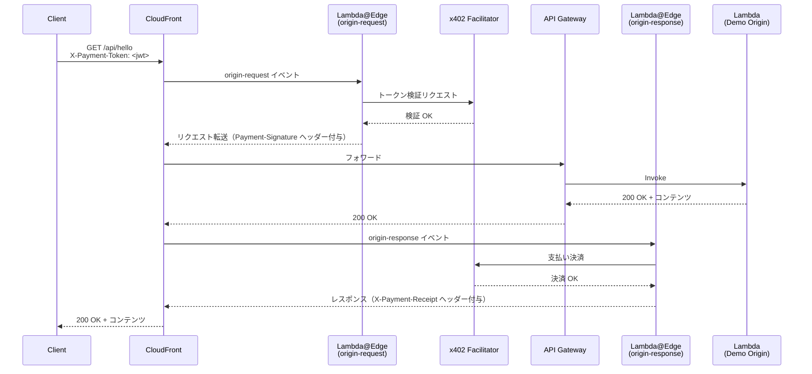
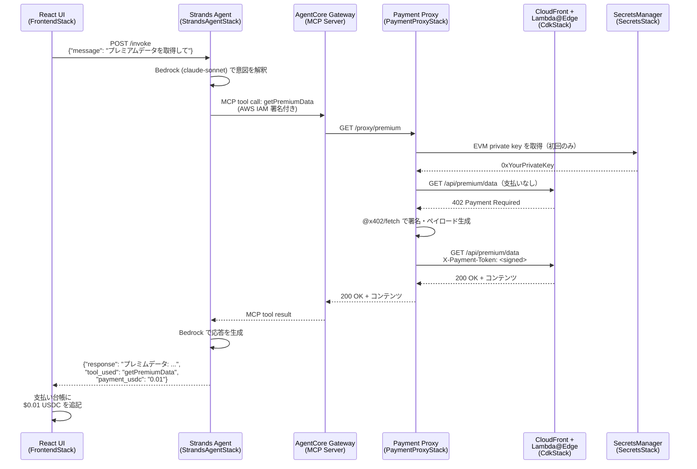
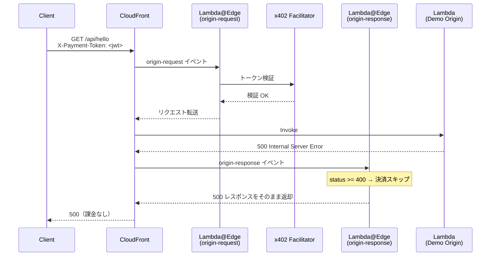

# はじめに

最近**x402**という言葉を聞く機会が増えてきたのではないでしょうか？  

AI Agent同士の決済も現実味を帯びている中マイクロペイメント決済の手法としてこの**x402**が注目を集めています。

既存のAPIをx402化させる方法はいくつかありますが、AWSからかなりイケてる構成案が出ていたので今回はこれを使ってチャットUIのAI Agentを作成してみました！

https://builder.aws.com/content/38fLQk6zKRfLnaUNzcLPsUexUlZ/monetize-any-http-application-with-x402-and-cloudfront-lambdaedge

技術スタックとかも解説しているのでぜひ最後まで読んでいってください！

# 作ったもの

## 概要

**x402 プロトコル**を使い、AWS CloudFront + Lambda@Edge でHTTPリクエストをマイクロペイメントでマネタイズするサンプル実装です。

具体的には**Strands Agent × AgentCore Gateway (MCP)** を統合し、**AIエージェントが自律的にUSDCで支払いながらコンテンツを取得する**アプリになっています！

**Base Sepolia (EVM)** と **Solana Devnet** の両方をサポートし、クライアントはどちらのネットワークで支払っても OK です。

## アプリの概要をまとめたスライド

とりあえずポイントだけ知りたいという方は以下のスライドをご覧ください！

https://speakerdeck.com/mashharuki/building-ai-agents-on-solana-mastra-framework-wohuo-yong-sitaci-shi-dai-ezientokai-fa

## スクリーンショット


## 全体像

今回作成したアプリは以下のように**5**つのレイヤーで構成されています。

```bash
┌──────────────────────────────────────────────────────────────────┐
│  [FrontendStack]  CloudFront (S3)                                │
│  React "Neon Noir Payment Terminal" UI                           │
│  ・左ペイン: AIチャット  ・右ペイン: 支払い台帳                    │
└────────────────────────┬─────────────────────────────────────────┘
                         │ POST /invoke
┌────────────────────────▼─────────────────────────────────────────┐
│  [StrandsAgentStack]  API GW → Strands Agent Lambda (Python)     │
│  ・Bedrock claude-sonnet-4-6 でユーザーの自然言語を解釈            │
│  ・MCP ツールを呼び出してコンテンツを取得                           │
└────────────────────────┬─────────────────────────────────────────┘
                         │ MCP protocol (HTTP/Streamable)
                         │ AWS IAM 認証
┌────────────────────────▼─────────────────────────────────────────┐
│  [AgentCoreGatewayStack]  AgentCore Gateway (MCP Server)         │
│  ・Payment Proxy API を MCP ツールとして公開                       │
│  ・getHelloContent / getPremiumData / getArticleContent          │
└────────────────────────┬─────────────────────────────────────────┘
                         │ HTTP call
┌────────────────────────▼─────────────────────────────────────────┐
│  [PaymentProxyStack]  API GW → Payment Proxy Lambda (TypeScript) │
│  ・x402 フロー（402受信 → @x402/fetch で署名 → リトライ）を内部完結 │
│  ・EVM private key は SecretsManager から取得                      │
└────────────────────────┬─────────────────────────────────────────┘
                         │ HTTPS + X-Payment-Token header
┌────────────────────────▼─────────────────────────────────────────┐
│  [CdkStack]  CloudFront → Lambda@Edge → API GW → Lambda  │
│  ・origin-request: トークン検証 / 402 返却                         │
│  ・origin-response: 支払い決済（オリジン成功時のみ）                │
└──────────────────────────────────────────────────────────────────┘
```

それぞれのスタックの役割分担は以下の通りになっています。

| スタック | ファイル | 役割 |
|---------|---------|------|
| `SecretsStack` | `lib/secrets-stack.ts` | EVM / Solana private key を SecretsManager で管理 |
| `CdkStack` | `lib/cdk-stack.ts` | CloudFront + Lambda@Edge (x402 エッジゲートウェイ) |
| `PaymentProxyStack` | `lib/payment-proxy-stack.ts` | x402 自動支払いプロキシ Lambda + API GW |
| `AgentCoreGatewayStack` | `lib/agent-core-gateway-stack.ts` | AgentCore Gateway (MCP Server) |
| `StrandsAgentStack` | `lib/strands-agent-stack.ts` | Strands Agent Lambda (Python) + API GW |
| `FrontendStack` | `lib/frontend-stack.ts` | React UI の CloudFront + S3 配信 |

## 機能毎の処理シーケンス図

### 1. x402 基本フロー — 未払い → 402



### 2. x402 基本フロー — 支払い済み → 成功



### 3. AI Agent フロー — エンドツーエンド



### 4. オリジンエラー時（課金なし）



## システムアーキテクチャ図


# 実装時のポイント

## 任意のオリジンをx402化させる2つのLambda関数

### lambda-edge

今回重要となるのがこの**lambda@Ddge**用Lambda関数です。

https://github.com/mashharuki/x402-Cloudfront-LambdaEdge-Sample/tree/main/cdk/functions/lambda-edge

オリジンとアクセス元との間に立ち、x402関連のロジックの処理をこのLambda関数で担当します。

今回はオリジンに対して以下のパスにアクセスしたきた場合にそれぞれいくらステーブルコインの支払いを要求するかを設定しています。

```ts
/**
 * x402 Configuration
 *
 * Values are injected at bundle time via esbuild --define flags by the CDK stack.
 * Lambda@Edge does NOT support environment variables, so config is baked in at build time.
 *
 * Set the following environment variables before running `cdk deploy`:
 *   PAY_TO_ADDRESS      — EVM wallet address to receive payments (required)
 *   SVM_PAY_TO_ADDRESS  — Solana wallet address to receive payments (required)
 *   X402_NETWORK        — CAIP-2 EVM network ID (default: eip155:84532 = Base Sepolia)
 *   SOLANA_NETWORK      — CAIP-2 Solana network ID (default: solana:EtWTRABZaYq6iMfeYKouRu166VU2xqa1 = Devnet)
 *   FACILITATOR_URL     — x402 facilitator URL (default: https://x402.org/facilitator)
 */

import type { RoutesConfig } from "@x402/core/server";

// These constants are replaced by esbuild --define at bundle time.
// CDK reads the env vars at synth time and injects the values here.
declare const __PAY_TO_ADDRESS__: string;
declare const __SVM_PAY_TO_ADDRESS__: string;
declare const __X402_NETWORK__: string;
declare const __SOLANA_NETWORK__: string;
declare const __FACILITATOR_URL__: string;

export const FACILITATOR_URL: string = __FACILITATOR_URL__;
export const PAY_TO: string = __PAY_TO_ADDRESS__;
export const SVM_PAY_TO: string = __SVM_PAY_TO_ADDRESS__;
export const NETWORK: string = __X402_NETWORK__;
export const SOLANA_NETWORK: string = __SOLANA_NETWORK__;

// Route configuration — which paths require payment and at what price.
// Each route accepts both EVM (Base Sepolia) and Solana (Devnet) payments.
export const ROUTES: RoutesConfig = {
	"/api/*": {
		accepts: [
			{
				scheme: "exact",
				network: NETWORK,
				payTo: PAY_TO,
				price: "$0.001",
			},
			{
				scheme: "exact",
				network: SOLANA_NETWORK,
				payTo: SVM_PAY_TO,
				price: "$0.001",
			},
		],
		description: "API access ($0.001 USDC)",
	},
	"/api/premium/**": {
		accepts: [
			{
				scheme: "exact",
				network: NETWORK,
				payTo: PAY_TO,
				price: "$0.01",
			},
			{
				scheme: "exact",
				network: SOLANA_NETWORK,
				payTo: SVM_PAY_TO,
				price: "$0.01",
			},
		],
		description: "Premium API access ($0.01 USDC)",
	},
	"/content/**": {
		accepts: [
			{
				scheme: "exact",
				network: NETWORK,
				payTo: PAY_TO,
				price: "$0.005",
			},
			{
				scheme: "exact",
				network: SOLANA_NETWORK,
				payTo: SVM_PAY_TO,
				price: "$0.005",
			},
		],
		description: "Premium content ($0.005 USDC)",
	},
};
```

x402関連のリクエスト・レスポンスの処理はここで担当することでオリジン側はx402の存在をほぼ意識する必要がありません。

オリジンへのリクエストとオリジンからのレスポンスはそれぞれ以下のように処理されるようになっています。

```ts
/**
 * x402のorigin-request処理。署名の検証と支払い要件のチェックを行う。
 *
 * @param request - CloudFront request object
 * @param distributionDomain - CloudFront distribution domain name
 * @returns Result indicating whether to continue or respond
 */
async function processOriginRequest(
  request: CloudFrontRequest,
  distributionDomain: string,
): Promise<OriginRequestResult> {
  console.log("x402 origin-request:", request.uri);

  // Security: Remove any pre-existing settlement header to prevent bypass attacks
  delete request.headers[PENDING_SETTLEMENT_HEADER];

  try {
    // x402サーバーを取得しする
    const server = await getServer();
    // CloudFrontのリクエストとドメインをアダプターでHTTPサーバー用のコンテキストに変換
    const adapter = new CloudFrontHTTPAdapter(request, distributionDomain);

    // contextには、HTTPサーバーが必要とする情報を渡す（パス、メソッド、支払い署名など）
    const context = {
      adapter,
      path: adapter.getPath(),
      method: adapter.getMethod(),
      paymentHeader: adapter.getHeader("payment-signature"),
    };

    // x402サーバーでHTTPリクエストを処理し、支払いの必要性と有効性を判断
    const result = await server.processHTTPRequest(context);

    switch (result.type) {
      case HTTPProcessResultType.NO_PAYMENT_REQUIRED:
        return { type: MiddlewareResultType.CONTINUE, request };

      case HTTPProcessResultType.PAYMENT_ERROR:
        console.log("Payment required or invalid");
        return {
          type: MiddlewareResultType.RESPOND,
          response: toLambdaResponse(
            result.response.status,
            result.response.headers,
            result.response.body,
          ),
        };

      case HTTPProcessResultType.PAYMENT_VERIFIED:
        console.log(
          "Payment verified, forwarding to origin (settlement deferred)",
        );

        const paymentData = JSON.stringify({
          payload: result.paymentPayload,
          requirements: result.paymentRequirements,
        });

        request.headers[PENDING_SETTLEMENT_HEADER] = [
          {
            key: PENDING_SETTLEMENT_HEADER,
            value: Buffer.from(paymentData).toString("base64"),
          },
        ];

        return { type: MiddlewareResultType.CONTINUE, request };
    }

    // Should never reach here - all cases handled above
    throw new Error(`Unexpected result type`);
  } catch (error) {
    console.error("x402 origin-request error:", error);
    return {
      type: MiddlewareResultType.RESPOND,
      response: toLambdaResponse(
        500,
        { "Content-Type": "application/json" },
        {
          error: "Internal server error",
        },
      ),
    };
  }
}

/**
 * Process origin-response for x402 payment settlement.
 * Only settles if origin returned success (status < 400).
 *
 * @param request - Original CloudFront request (contains payment data)
 * @param response - CloudFront response from origin
 * @returns Result indicating whether to continue or replace response
 */
async function processOriginResponse(
  request: CloudFrontRequest,
  response: CloudFrontResponse,
): Promise<OriginResponseResult> {
  const pendingSettlement =
    request.headers[PENDING_SETTLEMENT_HEADER]?.[0]?.value;

  if (!pendingSettlement) {
    return { type: MiddlewareResultType.CONTINUE, response };
  }

  const status = parseInt(response.status, 10);
  console.log("x402 origin-response:", request.uri, "status:", status);

  // Only settle if origin succeeded
  if (status >= 400) {
    console.log("Origin failed, skipping settlement - customer not charged");
    return { type: MiddlewareResultType.CONTINUE, response };
  }

  try {
    const paymentData = JSON.parse(
      Buffer.from(pendingSettlement, "base64").toString("utf-8"),
    );

    const server = await getServer();
    // CloudFrontのリクエストとレスポンスをアダプターでHTTPサーバー用のコンテキストに変換
    const settlement = await server.processSettlement(
      paymentData.payload,
      paymentData.requirements,
    );

    if (settlement.success) {
      console.log("Payment settled successfully");
      for (const [key, value] of Object.entries(settlement.headers)) {
        response.headers[key.toLowerCase()] = [{ key, value: String(value) }];
      }
      return { type: MiddlewareResultType.CONTINUE, response };
    } else {
      console.error("Settlement failed:", settlement.errorReason);
      return {
        type: MiddlewareResultType.RESPOND,
        response: toLambdaResponse(
          402,
          { "Content-Type": "application/json" },
          {
            error: "Settlement failed",
            details: settlement.errorReason,
          },
        ),
      };
    }
  } catch (error) {
    console.error("x402 origin-response settlement error:", error);
    return {
      type: MiddlewareResultType.RESPOND,
      response: toLambdaResponse(
        402,
        { "Content-Type": "application/json" },
        {
          error: "Settlement failed",
          details: error instanceof Error ? error.message : "Unknown error",
        },
      ),
    };
  }
}
```

スケーラビリティも優れている非常にイケている設計だと思います。

### payment-proxy

x402 自動支払いプロキシのLambda関数となります。

```ts
import {
	GetSecretValueCommand,
	SecretsManagerClient,
} from "@aws-sdk/client-secrets-manager";
import { createKeyPairSignerFromBytes } from "@solana/kit";
import { x402Client } from "@x402/core/client";
import { wrapFetchWithPayment } from "@x402/fetch";
import { ExactSvmScheme } from "@x402/svm/exact/client";
import type { APIGatewayProxyEvent, APIGatewayProxyResult } from "aws-lambda";
import bs58 from "bs58";

// 環境変数から CloudFront URL と秘密鍵の ARN を取得
const CLOUDFRONT_URL = process.env.CLOUDFRONT_URL!;
const SVM_SECRET_ARN = process.env.SVM_PRIVATE_KEY_SECRET_ARN!;

// ルートマッピング: プロキシパス → CloudFront パス
const ROUTE_MAP: Record<string, string> = {
	"/proxy/hello": "/api/hello",
	"/proxy/premium": "/api/premium/data",
	"/proxy/article": "/content/article",
};

// Lambda ウォームアップ時に初期化（コールドスタート対策）
let payFetch: typeof fetch | null = null;

/**
 * 支払いクライアントを初期化して fetch をラップする関数。
 * Solana (Devnet) のみ登録し、x402 クライアントが Solana で支払いを行う。
 * @returns ラップされた fetch 関数
 */
async function getPayFetch(): Promise<typeof fetch> {
	if (payFetch) return payFetch;
	// AWS Secrets Manager クライアントを初期化
	const sm = new SecretsManagerClient({});

	// Solana 秘密鍵を取得
	const svmSecret = await sm.send(
		new GetSecretValueCommand({ SecretId: SVM_SECRET_ARN }),
	);

	if (!svmSecret.SecretString) {
		throw new Error("Solana private key secret is empty");
	}

	// Solana signer (base58 encoded private key → ClientSvmSigner)
	const svmSigner = await createKeyPairSignerFromBytes(
		bs58.decode(svmSecret.SecretString),
	);

	// x402 クライアントに Solana スキームのみ登録
	const client = new x402Client();
	client.register("solana:*", new ExactSvmScheme(svmSigner));

	// fetch を支払い対応にラップしてキャッシュ
	payFetch = wrapFetchWithPayment(fetch, client);
	return payFetch;
}

/**
 * Proxyハンドラーメソッド。
 * API Gateway からのリクエストを受け取り、対応する CloudFront のエンドポイントに転送する。
 * @param event
 * @returns
 */
export const handler = async (
	event: APIGatewayProxyEvent,
): Promise<APIGatewayProxyResult> => {
	// リクエストされたパスに対応する CloudFront のパスを取得
	const proxyPath = event.path;
	const targetPath = ROUTE_MAP[proxyPath];

	if (!targetPath) {
		return {
			statusCode: 404,
			headers: { "Content-Type": "application/json" },
			body: JSON.stringify({ error: `Unknown proxy path: ${proxyPath}` }),
		};
	}

	let fetchFn: typeof fetch;
	try {
		// 支払いクライアントを初期化して fetch を取得
		fetchFn = await getPayFetch();
	} catch (err) {
		console.error("Failed to initialize payment client:", err);
		return {
			statusCode: 500,
			headers: { "Content-Type": "application/json" },
			body: JSON.stringify({ error: "Failed to initialize payment client" }),
		};
	}

	try {
		// リクエストされたパスに対応する CloudFront のエンドポイントにリクエストを転送
		const res = await fetchFn(`${CLOUDFRONT_URL}${targetPath}`);
		// CloudFront からのレスポンスをそのまま API Gateway のレスポンスとして返す
		const body = await res.text();
		return {
			statusCode: res.status,
			headers: { "Content-Type": "application/json" },
			body,
		};
	} catch (err) {
		console.error("Payment proxy request failed:", err);
		return {
			statusCode: 500,
			headers: { "Content-Type": "application/json" },
			body: JSON.stringify({ error: String(err) }),
		};
	}
};
```

## MCPサーバー

**AgentCore Gateway**ではAPIをMCP化することができます。

その際に必要なのがOpenAPI使用のyamlファイルになります！

上述のproxyサーバーをMCPサーバー化します。

```yaml
openapi: "3.0.1"
info:
  title: "x402 Payment Proxy API"
  version: "1.0.0"
  description: "MCP tools for accessing x402-protected content via auto-payment proxy"
paths:
  # Say Hello エンドポイント
  /proxy/hello:
    get:
      operationId: "getHelloContent"
      summary: "Get hello content"
      description: "Get hello content (costs $0.001 USDC on Base Sepolia). Payment is handled automatically."
      responses:
        "200":
          description: "Success"
          content:
            application/json:
              schema:
                type: object
  # Premium Analytics エンドポイント
  /proxy/premium:
    get:
      operationId: "getPremiumData"
      summary: "Get premium analytics data"
      description: "Get premium analytics data (costs $0.01 USDC on Base Sepolia). Payment is handled automatically."
      responses:
        "200":
          description: "Success"
          content:
            application/json:
              schema:
                type: object
  # 記事を取得するエンドポイント
  /proxy/article:
    get:
      operationId: "getArticleContent"
      summary: "Get article content"
      description: "Get article content (costs $0.005 USDC on Base Sepolia). Payment is handled automatically."
      responses:
        "200":
          description: "Success"
          content:
            application/json:
              schema:
                type: object
```

## Strands Agentで実装したAI Agent

x402 対応コンテンツに MCP 経由でアクセスする AI エージェントの実装を担当する部分です。

**Python**と**Strands Agent SDK**を使って実装しています。

実行環境に**Bedrock AgentCore**を採用しています。

```python
"""
Strands Agent Lambda handler
x402 対応コンテンツに MCP 経由でアクセスする AI エージェント。

AgentCore Gateway に AWS IAM 認証付きで接続し、
x402 保護されたコンテンツへのアクセスを MCP ツールとして利用する。
"""
import json
import os

# AgentCore Gateway は AWS IAM 認証が必要 → mcp-proxy-for-aws を使用
from mcp_proxy_for_aws.client import aws_iam_streamablehttp_client
from strands import Agent
from strands.models import BedrockModel
from strands.tools.mcp import MCPClient

# 環境変数から AgentCore Gateway の URL と AWS リージョンを取得
GATEWAY_MCP_URL = os.environ["AGENT_CORE_GATEWAY_MCP_URL"]
AWS_REGION = os.environ.get("AWS_REGION", "us-east-1")

# BedrockModel を初期化（モデルIDは適宜変更）
model = BedrockModel(
    model_id="us.anthropic.claude-haiku-4-5-20251001-v1:0",
    region_name=AWS_REGION,
)

# AgentCore Gateway に MCP クライアントとして接続（AWS IAM 署名付き）
# MCPClient はトランスポートファクトリ関数（lambda）を受け取る
mcp_client = MCPClient(
    lambda: aws_iam_streamablehttp_client(
        endpoint=GATEWAY_MCP_URL,
        aws_region=AWS_REGION,
        aws_service="bedrock-agentcore",
    )
)

# マネージドパターン: Agent に MCPClient を直接渡すとライフサイクルを自動管理
agent = Agent(
    model=model,
    tools=[mcp_client],
    system_prompt="""
        You are an AI assistant that can access x402-protected premium content.

        You have access to the following tools via MCP:
        - getHelloContent: Fetch hello content (auto-pays $0.001 USDC)
        - getPremiumData: Fetch premium analytics (auto-pays $0.01 USDC)
        - getArticleContent: Fetch article content (auto-pays $0.005 USDC)

        Payment for each tool call is handled automatically. 
        Always inform the user what content was accessed and summarize the results clearly.
    """,
)

# 共通 CORS ヘッダー
CORS_HEADERS = {
    "Content-Type": "application/json",
    "Access-Control-Allow-Origin": "*",
    "Access-Control-Allow-Headers": "Content-Type",
    "Access-Control-Allow-Methods": "POST,OPTIONS",
}

# Lambda ハンドラー
def handler(event, context):
    # OPTIONS プリフライトへの応答 (proxy: true では Lambda 側で対応が必要)
    if event.get("httpMethod") == "OPTIONS":
        return {"statusCode": 200, "headers": CORS_HEADERS, "body": ""}

    body = json.loads(event.get("body", "{}"))
    # プロンプトを受け取る（例: {"message": "What is the latest premium content?"}）
    user_message = body.get("message", "")
    session_id = body.get("session_id", "default")

    if not user_message:
        return {
            "statusCode": 400,
            "headers": CORS_HEADERS,
            "body": json.dumps({"error": "message is required"}),
        }

    try:
        # Agent にユーザーメッセージを渡して応答を生成
        response = agent(user_message)

        return {
            "statusCode": 200,
            "headers": CORS_HEADERS,
            "body": json.dumps({
                "session_id": session_id,
                "response": str(response),
            }),
        }
    except Exception as e:
        print(f"Agent error: {e}")
        return {
            "statusCode": 500,
            "headers": CORS_HEADERS,
            "body": json.dumps({"error": str(e)}),
        }
```

## フロントエンド

フロントエンドの実装は **React.js**と**Vite**で行っています。

AI Agentの機能はAPIとして呼び出すように**React Hook**として実装しています。

```ts
import { useCallback, useRef, useState } from "react";
import { loadConfig } from "../lib/config";
import type { Message, PaymentRecord } from "../types";

export function useAgent() {
  const [messages, setMessages] = useState<Message[]>([]);
  const [payments, setPayments] = useState<PaymentRecord[]>([]);
  const [isLoading, setIsLoading] = useState(false);
  const sessionId = useRef(crypto.randomUUID());

  /**
   * Bedrock AgentCore のAI Agentを呼び出す
   */
  const sendMessage = useCallback(async (text: string) => {
    const config = await loadConfig();

    const userMsg: Message = {
      id: crypto.randomUUID(),
      role: "user",
      content: text,
      timestamp: new Date(),
    };
    setMessages((prev) => [...prev, userMsg]);
    setIsLoading(true);

    try {
      // invokeメソッドを呼び出すと返答が得られる
      const res = await fetch(`${config.strandsAgentApiUrl}/invoke`, {
        method: "POST",
        headers: { "Content-Type": "application/json" },
        body: JSON.stringify({ message: text, session_id: sessionId.current }),
      });
      const data = await res.json();

      const agentMsg: Message = {
        id: crypto.randomUUID(),
        role: "agent",
        content: data.response ?? data.error ?? "No response",
        timestamp: new Date(),
        toolUsed: data.tool_used,
        paymentUsdc: data.payment_usdc,
      };
      setMessages((prev) => [...prev, agentMsg]);

      if (data.tool_used && data.payment_usdc) {
        setPayments((prev) => [
          {
            id: crypto.randomUUID(),
            tool: data.tool_used,
            amountUsdc: data.payment_usdc,
            timestamp: new Date(),
            status: "confirmed",
          },
          ...prev,
        ]);
      }
    } catch (err) {
      const errMsg: Message = {
        id: crypto.randomUUID(),
        role: "agent",
        content: `Error: ${String(err)}`,
        timestamp: new Date(),
      };
      setMessages((prev) => [...prev, errMsg]);
    } finally {
      setIsLoading(false);
    }
  }, []);

  return { messages, payments, isLoading, sendMessage };
}
```

# 動かし方

## Phase A: 既存 x402 エッジゲートウェイのデプロイ

### 1. リポジトリのクローン

```bash
git clone https://github.com/your-org/x402-Cloudfront-LambdaEdge-Sample.git
cd x402-Cloudfront-LambdaEdge-Sample
```

### 2. CDK 依存パッケージのインストール

```bash
cd cdk
bun install

# Lambda@Edge の依存関係
bun install --cwd functions/lambda-edge
```

### 3. 全スタック一括デプロイ

```bash
cd cdk

# 全スタックをまとめてデプロイ（SecretsStack は先にデプロイし、秘密鍵設定後に残りを実行）
bunx cdk deploy SecretsStack

aws secretsmanager put-secret-value \
  --secret-id x402/evm-private-key \
  --secret-string "0xYOUR_EVM_PRIVATE_KEY"

aws secretsmanager put-secret-value \
  --secret-id x402/svm-private-key \
  --secret-string "YOUR_SOLANA_BASE58_PRIVATE_KEY"

PAY_TO_ADDRESS=0xYourEVMAddress \
SVM_PAY_TO_ADDRESS=YourSolanaAddress \
npx cdk deploy CdkStack PaymentProxyStack AgentCoreGatewayStack StrandsAgentStack

cd ../frontend && bun run build && cd ../cdk
bunx cdk deploy FrontendStack
```

デプロイが完了したら**CloudFront**のURLが出力されるはずなので

## スタックの削除

検証が終わったら忘れずにリソースを削除しました！

```bash
cd cdk
npx cdk destroy --all
```

Lambda@Edgeだけは数時間後(レプリカが削除された後)に手動で削除する必要があるので注意です！

```bash
aws lambda delete-function --function-name CdkStack-OriginResponseFn0BEDF56E-RYprtghbLxd7 --region us-east-1
aws lambda delete-function --function-name CdkStack-OriginRequestFn5947795F-p5ZOi0xo6Fi9 --region us-east-1
```

## テストスクリプトでの検証方法

`scripts/` には x402 支払いペイロードの生成と動作検証を行うスクリプトが含まれています！

### セットアップ

```bash
cp scripts/.env.example scripts/.env
```

`scripts/.env` を編集：

```dotenv
# EVM 秘密鍵（Base Sepolia テストネット用）
EVM_PRIVATE_KEY=0x_YOUR_EVM_PRIVATE_KEY_HERE

# Solana 秘密鍵（Solana Devnet 用、base58 形式）※ EVM または Solana どちらか一方でも可
SVM_PRIVATE_KEY=YOUR_SOLANA_BASE58_PRIVATE_KEY_HERE

# cdk deploy 後に出力される CloudFrontUrl
CLOUDFRONT_URL=https://XXXXX.cloudfront.net
```

```bash
cd scripts && bun install
```

### generate モード — 署名済みペイロードを生成（決済なし）

まずは以下の手順で決済なしバージョンの処理を試してみましょう！

```bash
cd scripts
bun run generate           # /api/hello のペイロードを生成
bun run generate:premium   # /api/premium/data のペイロードを生成
bun run generate:content   # /content/article のペイロードを生成
```

### pay モード — フル支払い（実際に USDC を消費）

次に実際に支払い実行するスクリプトを試してみましょう。

```bash
cd scripts
bun run pay                # /api/hello を支払い
bun run pay:premium        # /api/premium/data を支払い
bun run pay:content        # /content/article を支払い
```

**出力例:**

```bash
x402 Payment Script
Mode:     フル支払い (--pay) ※ 実際に USDC を消費します
Endpoint: /api/hello

Status: 200 OK
Response: {
  "message": "Hello from the paid endpoint!",
  "data": {
    "greeting": "You successfully paid $0.001 USDC to access this content.",
    "timestamp": "2026-01-01T00:00:00.000Z",
    "network": "Base Sepolia",
    "protocol": "x402 v2"
  }
}

════════════════════════════════════════
支払い完了!
════════════════════════════════════════
```


# まとめ

**CloudFront** + **Lambda@Edge** で任意のオリジンをx402化させる方法を試してみました！

マネージドサービスをフル活用しつつ、本質的なロジックが実装されているオリジン側のコードをほぼ変える必要がない構成はとてもイケてるなという印象です。

とはいえ、ブロックチェーンの知識やウォレット、ステーブルコインの事前準備など手間なステップが発生することはまだ必要なのでこの辺りの環境セットアップもカバーしてもらえるようになるとさらに強くなりそうです。

今後はこのような実装がどんどん増えていきそうですね。

というわけで今回はここまでになります！

読んでいただきありがとうございました！

# 参考文献

- [GitHub x402-Cloudfront-LambdaEdge-Sample](https://github.com/mashharuki/x402-Cloudfront-LambdaEdge-Sample)
- [Monetize Any HTTP Application with x402 and CloudFront + Lambda@Edge](https://builder.aws.com/content/38fLQk6zKRfLnaUNzcLPsUexUlZ/monetize-any-http-application-with-x402-and-cloudfront-lambdaedge)
- [Coinbase x402 GitHub — CloudFront Lambda@Edge Example](https://github.com/coinbase/x402/tree/main/examples/typescript/servers/cloudfront-lambda-edge)
- [x402 Protocol Specification](https://x402.org)
- [AWS Bedrock AgentCore Gateway ドキュメント](https://docs.aws.amazon.com/bedrock/latest/userguide/agentcore-gateway.html)
- [Strands Agents SDK](https://github.com/strands-agents/sdk-python)
- [AWS Lambda@Edge ドキュメント](https://docs.aws.amazon.com/AmazonCloudFront/latest/DeveloperGuide/lambda-at-the-edge.html)
- [Model Context Protocol (MCP)](https://modelcontextprotocol.io/)
- [実際のトランザクション記録](https://sepolia.basescan.org/tx/0x9cdbb690d4740a30b98e7cc60ee45a819a909721f4c470ae25b808f510d3fc64)