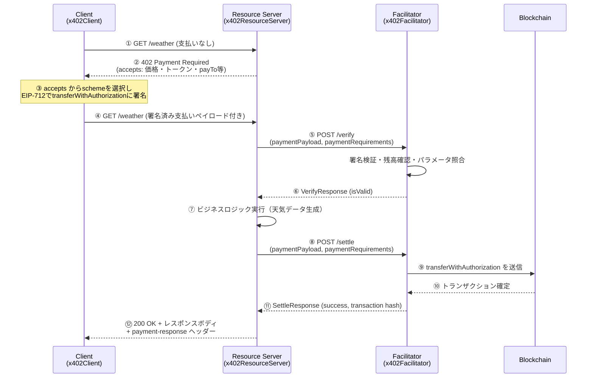
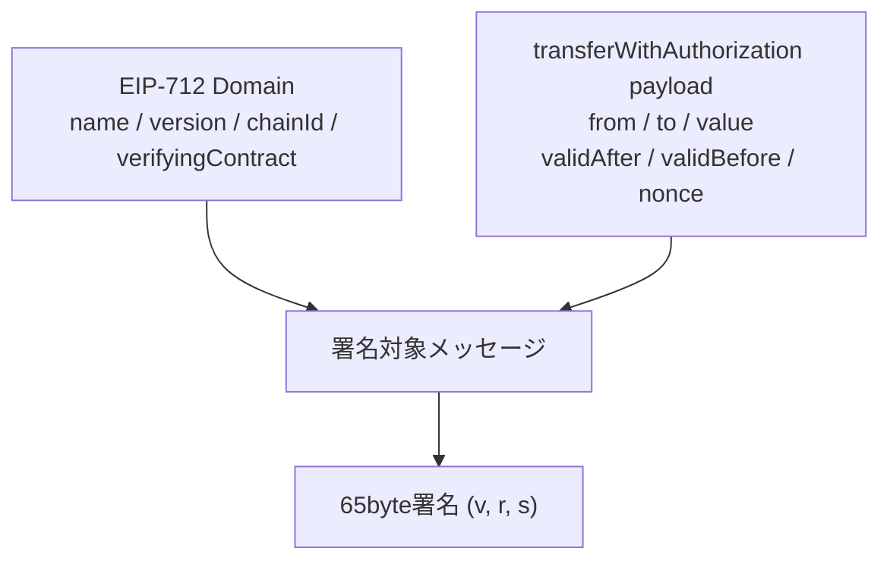
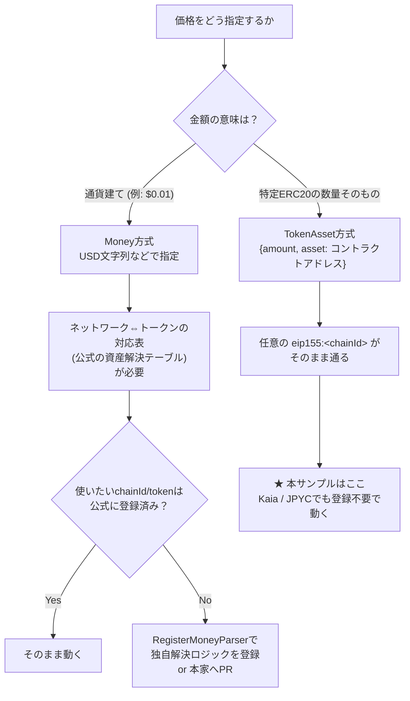
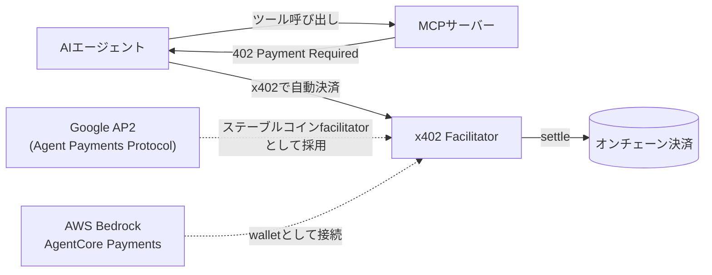

## この記事でわかること（TL;DR）

- x402プロトコルの`verify`/`settle`フローを、1枚のシーケンス図で他人に説明できるようになる
- 「なぜx402は公式にサポートしていないチェーン・トークンでも動くのか」を仕様レベルで理解し、**自分の好きなEVM互換チェーン×任意のERC20**で同じことを再現できるようになる
- x402がAIエージェントの自律決済にフィットする技術的根拠を、業界動向（AP2 / AgentCore Payments / x402 Foundation）を踏まえて語れるようになる

成果物はこちら: [mashharuki/kaia-x402-sample](https://github.com/mashharuki/kaia-x402-sample)（Kaiaテストネット + JPYCでx402決済フローを動かすclient/server/facilitatorのサンプル一式）

https://github.com/mashharuki/kaia-x402-sample

## はじめに

x402は「HTTP 402 Payment Required」を使ってAPIやWebリソースに支払いを紐付ける、Coinbase発のオープンなペイメントプロトコルです。2025年に発表されて以降、x402 Foundationが設立され、Anthropic・Google・AWS・Visa・Circle・Vercelなど名だたる企業が参加するエコシステムに急拡大しています。

今回x402をあらためて学び直すために、client・x402サーバー（リソースサーバー）・facilitatorの3コンポーネントを実装してみて、**Kaiaテストネット（Kairos）上のJPYC（日本円ステーブルコイン）** を使った決済フローを動かすサンプルを作ってみました！ 

KaiaもJPYCも、x402が公式にデフォルトサポートしているチェーン・トークンではありません。つまりこのサンプルを動かすには「仕様のどこが拡張ポイントになっているか」を理解している必要がありました。

:::message
本記事は、x402関連の技術記事を数多く発信されているKomlock Lab社の[「Polygon JPYCでx402を動かす：自作Facilitatorで実機検証してみた」](https://zenn.dev/komlock_lab/articles/d4cc55a2ecf543)にも大きな刺激を受けています。

同記事はPolygon上での実装に踏み込んだ良質な記事ですが、本記事では「特定チェーンへの実装」で終わらせず、**任意のチェーン・任意のERC20に一般化できる手順**として整理し直すこと、そして`verify`/`settle`の内部構造をシーケンス図で解剖することに重点を置いています。
:::

### 想定読者

- viem・EIP-712・EOAウォレットあたりの基礎知識がある、EVM/Web3の中〜上級者
- x402の概念は聞いたことがあるが、内部の署名・検証フローや、公式非対応チェーンへの対応方法までは追えていない人

### この記事のスコープ外

- SVM (Solana) / TON / Stellar など非EVM系チェーンへの対応
- `batch-settlement`スキーム（後述）の実装
- AIエージェントに実際にx402決済を自律実行させるエンドツーエンドのデモ実装

## x402とは何か（最短要約）

x402は、

- HTTPリクエストに対して`402 Payment Required`を返し
- レスポンスに支払い条件（`accepts`）を含めることでクライアント側がその場で支払いを行い
- リクエストを再送して初めてリソースが得られる

というシンプルな設計のプロトコルです。

従来のAPIキー課金やサブスクリプションと違い、**リクエスト単位のマイクロペイメント**をHTTPの標準的なやり取りの中だけで完結させられるのが特徴です。

現在の主流は2025年後半に整理されたv2仕様で、支払いの**検証(`verify`)と決済実行(`settle`)を明確に分離**しています。これにより「支払い能力の検証だけ先に済ませておき、実行は後で行う」といった、認可の再利用やセッション的なアクセス制御が可能になりました（v1からv2への変更点はKomlock Labの[「x402 v2はv1とどう変わった？」](https://zenn.dev/komlock_lab/articles/49b787f67c9392)で詳しく解説されています）。

x402の仕様そのものは現在[x402-foundation/x402](https://github.com/x402-foundation/x402)で管理されており、x402 Foundationには Coinbase を筆頭に Anthropic・Google・AWS・Visa・Circle・Vercel などが名を連ねています。

## プロトコル内部解剖：1枚のシーケンス図で見るx402

まずはverify/settleを含めた全体のシーケンスを図解します。

登場人物はClient・Resource Server（今回でいう`x402server`）・Facilitator・Blockchainの4者です。



実際に本サンプルを動かすと、クライアント側では最終的にこのような結果が得られます！

```
payment-response: eyJzdWNjZXNzIjp0cnVlLCJwYXllciI6IjB4ZTZBQTFCNjBjNEVDNzYwNjY4ZEIzQzA2ZDdBODk0YzVGZDM5RDBhYSIsInRyYW5zYWN0aW9uIjoiMHgxMGI1Yzg4NDkwZjYyMDA3NGI0NjI1ODk1NWYzYTk1MzhkMGMzY2MwMzkyMTM1ZGY3OGI5ZjVlY2Q0MjQwZGEzIiwibmV0d29yayI6ImVpcDE1NToxMDAxIn0=
Payment settled: {
  success: true,
  payer: '0xe6AA1B60c4EC760668dB3C06d7A894c5Fd39D0aa',
  transaction: '0x10b5c88490f620074b46258955f3a9538d0c3cc0392135df78b9f5ecd4240da3',
  network: 'eip155:1001'
}
```

`payment-response`ヘッダーの中身は、base64デコードすると`{success, payer, transaction, network}`というSettleResponseそのものです。図の⑫が実際にどう見えるかが分かると思います。

### 3つのスキーム

x402の`accepts`には`scheme`フィールドがあり、現在仕様上は主に3つのスキームが定義されています。

| scheme | 概要 | 用途 |
|---|---|---|
| `exact` | 固定額を事前に署名・認可し、そのまま送金する | 単価が確定しているAPI課金（本サンプルはこれ） |
| `upto` | 上限額だけ認可し、実使用量に応じて課金する | 従量課金・LLMトークン課金のような可変コスト |
| `batch-settlement` | 高頻度の少額決済をまとめて後から決済する | マイクロペイメントの連打（本記事ではスコープ外） |

本サンプルのfacilitatorは`exact`と`upto`の両方を登録していますが（[`pkgs/facilitator/src/index.ts`](https://github.com/mashharuki/kaia-x402-sample/blob/main/pkgs/facilitator/src/index.ts)）、リソースサーバー・クライアント側で実際に使っているのは`exact`のみです。

### `exact`スキームの署名の中身

EVM向けの`exact`スキームは、EIP-712の型付き署名の上に **EIP-3009 `transferWithAuthorization`** を乗せた設計です。署名対象のメッセージは概ね以下のフィールドを持ちます。



ポイントは`nonce`が**トランザクションのアカウントnonceとは独立したランダム値**であることです。ERC20の`approve`のようにアカウント単位でnonceを直列に消費していく方式と違い、`nonce`が衝突さえしなければ**複数の認可を同時並行で発行・検証できます**。この性質は後半のAIエージェント編で効いてきます。

またEVM版の`exact`にはPermit2互換のプロキシコントラクト（`x402ExactPermit2Proxy`）を使う設計もあり、CREATE2デプロイによって**対応する全EVMチェーンで同一アドレス**（`0x402085c248EeA27D92E8b30b2C58ed07f9E20001`）になるよう設計されています。これにより、facilitator側は「チェーンが変わっても検証先コントラクトのアドレスは変わらない」という前提でロジックを共通化できます。

### facilitatorの役割：`verify`と`settle`

facilitatorは

- 「署名済みの支払いデータが正しいかを検証する」verify
- 「実際にチェーンに送金する」settle

という責務がはっきり分離された2つの処理を主に担当します。本サンプルのfacilitatorはHonoで実装されており、該当部分は次の通りです。

```ts:pkgs/facilitator/src/index.ts
app.post("/verify", async (c) => {
  const { paymentPayload, paymentRequirements } = await c.req.json();
  const response: VerifyResponse = await facilitator.verify(
    paymentPayload,
    paymentRequirements,
  );
  return c.json(response);
});

app.post("/settle", async (c) => {
  const { paymentPayload, paymentRequirements } = await c.req.json();
  const response: SettleResponse = await facilitator.settle(
    paymentPayload,
    paymentRequirements,
  );
  return c.json(response);
});
```

`verify`は署名検証・残高確認・パラメータ照合・シミュレーションまでを行い、実際のブロードキャストは一切しません。

`settle`側で初めて`transferWithAuthorization`のトランザクションを送信し、確認(confirmation)を待ちます！この分離のおかげで「支払い能力だけ先に確かめる」というユースケース（後述のAIエージェントの意思決定フローと相性がいい）が成立します。

facilitatorには支払いのライフサイクルにフックできる仕組みもあり、本サンプルでは以下のように各段階でログを仕込んでいます。

```ts:pkgs/facilitator/src/index.ts
export const facilitator = new x402Facilitator()
  .onBeforeVerify(async (context) => { /* ... */ })
  .onAfterVerify(async (context) => { /* ... */ })
  .onVerifyFailure(async (context) => { /* ... */ })
  .onBeforeSettle(async (context) => { /* ... */ })
  .onAfterSettle(async (context) => { /* ... */ })
  .onSettleFailure(async (context) => { /* ... */ });
```

## なぜ「公式未対応チェーン」でも動くのか：拡張ポイントの正体

ここが本記事のコアです。KaiaもJPYCも、x402の公式ドキュメントが挙げる[対応チェーン・トークンの一覧](https://docs.x402.org/core-concepts/network-and-token-support)には載っていません。

それでもこのサンプルは動きます！なぜか。

x402の`accepts`に含める価格指定には、実は2つの流儀があります。



`Money`方式（`"$0.01"`のような通貨建て文字列）は、内部的に「このチェーンのこのトークンが1USDに相当する」という対応表を解決する必要があるため、公式が対応表を持っていないチェーン・トークンでは追加のパーサ実装（`RegisterMoneyParser`）か、公式への登録（PR）が必要になります。

一方`TokenAsset`方式は「このコントラクトアドレスのトークンをこの数量だけ動かす」という**具体的な指定**なので、ネットワーク側の対応表に頼りません。本サンプルの`x402Config`はまさにこの方式を使っています。

```ts:pkgs/server/src/config.ts
export const CHAIN_ID = "eip155:1001" as `${string}:${string}`

export const x402Config = {
  "GET /weather": {
    accepts: [
      {
        scheme: "exact",
        price: {
          amount: "10000000000000000000",
          asset: "0xE7C3D8C9a439feDe00D2600032D5dB0Be71C3c29" as `0x${string}`, // JPYC
          extra: { name: "JPY Coin", version: "1" },
        },
        network: CHAIN_ID, // eip155:1001 = Kaia Kairos
        payTo: process.env.EVM_ADDRESS as `0x${string}`,
      },
    ],
    // ...
  },
};
```

`price`が`amount`（最小単位での数量）と`asset`（コントラクトアドレス）の組み合わせで指定されているのがわかります。`network`にはCAIP-2形式の`eip155:1001`（Kaia Kairos）をそのまま渡すだけです。

逆に言えば、ここで一般化できる知見は「x402が公式にサポートしている・していないは、`TokenAsset`方式で価格指定する限りは本質的な障害にならない」ということです。次章ではこれを踏まえて、任意のチェーン・任意のERC20で同じことをするための再現手順をまとめます。

:::message
今回だと KaiaテストネットとJPYCのコントラクトアドレスを指定
:::

## ハンズオン：任意チェーン×任意ERC20で動かす再現手順

ここからは「Kaia × JPYC」を具体例にしつつ、**他のどんなEVM互換チェーン・どんなERC20にも読み替えられる**ようにチェックリスト形式でまとめます。実際に動かす場合は[リポジトリ](https://github.com/mashharuki/kaia-x402-sample)をcloneし、READMEの手順に沿って`pnpm i`後、各パッケージの`.env`を用意してください。各パッケージが読む主要な環境変数は以下の通りです。

| パッケージ | 環境変数 | 用途 |
|---|---|---|
| facilitator | `EVM_PRIVATE_KEY` | facilitatorの署名用アカウント秘密鍵（settle送金元） |
| facilitator | `PORT`（任意, 既定4022） | facilitatorのlisten port |
| server (x402server) | `EVM_ADDRESS` | 支払いの受取先（`payTo`） |
| server (x402server) | `FACILITATOR_URL` | facilitatorのエンドポイントURL |
| client | `EVM_PRIVATE_KEY` | 支払い側（購入者）の署名用秘密鍵 |
| client | `PAYWALL_API_BASE_URL` / `PAYWALL_PATH` | 課金対象APIのベースURLとパス |

対象チェーンを変える場合は、テストネットであればFaucetでのガス代・対象ERC20トークンの入手手段を別途用意してください（ここは仕様ではなく運用の話なので割愛します）。

KaiaとJPYCのテストネット用のfaucetはそれぞれ以下のサイトで入手できます。

https://www.kaia.io/faucet

https://faucet.jpyc.co.jp/login/

### ステップ1: 対象チェーンを定義する

facilitatorはviemのウォレットクライアントを介してチェーンとやり取りします。viemに組み込み済みのチェーン（`viem/chains`）があればそれを使い、なければ`defineChain`でカスタム定義します。本サンプルはKairos（Kaiaテストネット）が`viem/chains`にあるため、そのまま利用しています。

```ts:pkgs/facilitator/src/viem.ts
import { kairos } from "viem/chains";

export const chainInfo = {
  chain: kairos,
  chainId: "eip155:1001", // CAIP-2形式。ここを対象チェーンのchainIdに変える
};
```

> 💡 別チェーンに応用する場合はここを`base`や`polygon`、あるいは`defineChain({...})`で自作したチェーン定義に差し替えるだけです。

### ステップ2: facilitator側でSchemeを登録する

facilitatorのEVM signerを作り、使いたいscheme（`ExactEvmScheme`・`UptoEvmScheme`）をchainIdに紐付けてregisterします。

```ts:pkgs/facilitator/src/index.ts
const viemClient = getViemClientForChain(chainInfo.chain);
const evmSigner = getFacilitatorEvmSignerForChain(viemClient);

facilitator.register(
  chainInfo.chainId as `eip155:${number}`,
  new ExactEvmScheme(evmSigner, { eip6492AllowedFactories: [] }),
);
facilitator.register(
  chainInfo.chainId as `eip155:${number}`,
  new UptoEvmScheme(evmSigner),
);
```

`evmSigner`は`toFacilitatorEvmSigner`（`@x402/evm`）で、viemクライアントの`getCode`・`readContract`・`verifyTypedData`・`writeContract`・`sendTransaction`・`waitForTransactionReceipt`をラップするだけのアダプタです（[`pkgs/facilitator/src/viem.ts`](https://github.com/mashharuki/kaia-x402-sample/blob/main/pkgs/facilitator/src/viem.ts)）。チェーンが変わってもこのアダプタの形は変わらないため、**移植性が高い**です。

### ステップ3: リソースサーバー側でSchemeとPriceを登録する

`x402ResourceServer`にfacilitatorクライアントを渡し、同じchainIdでSchemeをregisterします。

```ts:pkgs/server/src/resourceServer.ts
export const resourceServer = new x402ResourceServer(facilitatorClient);
resourceServer.register(CHAIN_ID, new ExactEvmScheme());
```

価格は前章の通り`TokenAsset`方式（`amount` + `asset`）で指定します。ここを対象のERC20コントラクトアドレスと桁数に合わせた`amount`に変えるだけで、任意のトークンに対応できます。

### ステップ4: クライアント側でSchemeとSpend Controlsを登録する

クライアントも同じchainIdでSchemeを登録し、`setSpendControls`で「どのネットワーク・どのアセットへの支払いを許可するか」をホワイトリスト化します。これはウォレットが意図しないトークンを勝手に送金してしまう事故を防ぐガードレールに当たるものです！これをしないと402の支払い時にエラーが発生します。

```ts:pkgs/client/src/config.ts
const client = new x402Client();
client.register("eip155:1001", new ExactEvmScheme(signer));

// ここで指定
client.setSpendControls({
  allowedAssets: [
    { 
      network: "eip155:1001", 
      asset: "0xE7C3D8C9a439feDe00D2600032D5dB0Be71C3c29" 
    },
  ],
});

export const api = wrapAxiosWithPayment(
  axios.create({ baseURL: process.env.PAYWALL_API_BASE_URL }),
  client,
);
```

`wrapAxiosWithPayment`でラップされたAxiosインスタンスを使えば、402応答を受け取った際の「署名して再送する」処理はライブラリ側が自動で行ってくれます。

呼び出し側のコードは通常のAxios呼び出しと変わりません。

```ts:pkgs/client/src/index.ts
const response = await api.get(process.env.PAYWALL_PATH);
const result = httpClient.parsePaymentResult({
  status: response.status,
  getHeader: (name) => response.headers[name.toLowerCase()],
  body: response.data,
});

if (result.paymentStatus === "settled") {
  console.log("Payment settled:", result.header);
}
```

### ステップ5: 動作確認

3サービスを起動順に立ち上げ、ヘルスチェック→サポート状況確認→実決済フルサイクルの順で確認します。

```bash
pnpm facilitator run dev   # :4022
pnpm x402server run dev    # :4021
curl http://localhost:4022/supported
curl http://localhost:4021/health
pnpm x402client run dev    # 実際に支払いを実行して /weather を取得
```

`/supported`のレスポンスに、登録したchainId・schemeが載っていることを確認できれば、facilitator側の登録は成功しています。あとはクライアントを実行し、`payment-response`ヘッダーに`success: true`が返ってくれば、任意チェーン×任意ERC20でのx402環境構築は完了です。

以下はレスポンス例です！

```bash
Response: { report: { weather: 'sunny', temperature: 70 } }
Payment settled: {
  success: true,
  payer: '0xe6AA1B60c4EC760668dB3C06d7A894c5Fd39D0aa',
  transaction: '0x10b5c88490f620074b46258955f3a9538d0c3cc0392135df78b9f5ecd4240da3',
  network: 'eip155:1001'
}
```

## x402はなぜAIエージェントの自律決済に向いているのか

ここまでの内部構造を踏まえた上で、x402がAIエージェントの決済に向いていると言われる理由を、雰囲気ではなく技術的な根拠から整理します。

### 技術的根拠：nonceベース署名は並行処理に強い

3章で触れた通り、`exact`スキームの署名はアカウントnonceに依存せず、リクエストごとに独立した`nonce`を持つEIP-3009ベースです。

これはAIエージェントのように「複数のツール呼び出しを並行して行い、その都度小さな支払いが発生する」ワークロードと構造的に相性が良い設計です。ERC20の`approve`方式のようにアカウントnonceを直列に消費する方式だと、エージェントが同時に複数の支払いを試みた際に片方が失敗しやすくなりますが、x402の`exact`スキームはその制約を受けません。

さらに`verify`/`settle`の分離により、 **「まず支払い能力だけ検証してからタスクの実行計画を立て、実際に成果物が得られたタイミングで`settle`する」** というエージェントの意思決定フローと親和性の高いパターンが組めます。

### エコシステム上の位置付け



- **MCPとの住み分け**: 
  MCP（Model Context Protocol）は「エージェントがどんなツールを使えるか」を発見・呼び出すための層、x402は「その呼び出しに支払いが必要な場合、どう決済するか」を担う層です。MCPサーバー側はJSON-RPCのスキーマを変えずに402を返すだけで課金化できます。
- **Google AP2との連携**: 
  2025年9月、Google主導でMastercard・PayPal・Coinbaseなど60社超が参加する[AP2 (Agent Payments Protocol)](https://cloud.google.com/blog/products/ai-machine-learning/announcing-agents-to-payments-ap2-protocol)が発表されました。ここにCoinbase・Ethereum Foundation・MetaMaskが共同で[x402拡張を追加](https://www.coinbase.com/developer-platform/discover/launches/google_x402)しており、x402はAP2における「ステーブルコイン決済のfacilitator」という位置付けを得ています。
- **AWS Bedrock AgentCore Payments**: 
  [AgentCore Payments](https://aws.amazon.com/blogs/machine-learning/agents-that-transact-introducing-amazon-bedrock-agentcore-payments-built-with-coinbase-and-stripe/)は、CoinbaseのCDPウォレットやStripeのPrivyウォレットと接続し、エージェントが402を受け取った際に**推論ループを中断せずその場で交渉・支払い・証明の受け取りまでを自動化**します。セッション単位の支出上限も設定可能で、「暴走したエージェントが際限なく支払い続ける」リスクにも運用上の歯止めをかけられる設計です。
- **ガバナンスの座組み**: 
  x402 FoundationにはAnthropic・Google・Visa・AWS・Circle・Vercelなどが参加しており、一企業のマーケティング施策ではなく業界横断のインフラとして扱われ始めています。

## まとめ・今後の展望

- x402は`verify`（検証）と`settle`（決済実行）を分離した設計により、HTTPの標準的なやり取りだけでマイクロペイメントを完結させるプロトコルである
- `TokenAsset`方式で価格指定する限り、公式非対応のチェーン・トークンでも仕様上の障害なくx402環境を構築できる（Kaia × JPYCのサンプルはその実証）
- EIP-3009のnonceベース署名と`verify`/`settle`の分離は、AIエージェントの並行的・自律的な意思決定フローと構造的に相性が良い

今後は`batch-settlement`スキームへの対応やSVM/TONなど非EVM系チェーンへの拡張、MPPのSDKからの呼び出しなども試してみたいと思います！

ここまで読んでいただきありがとうございました！！

## 参考資料

- [coinbase/x402 (GitHub)](https://github.com/coinbase/x402)
- [x402-foundation/x402 - specs](https://github.com/x402-foundation/x402)
- [x402 公式ドキュメント: Network & Token Support](https://docs.x402.org/core-concepts/network-and-token-support)
- [x402 公式ドキュメント: Schemes Overview](https://docs.x402.org/schemes/overview)
- [Google Cloud Blog: Announcing Agents to Payments (AP2) Protocol](https://cloud.google.com/blog/products/ai-machine-learning/announcing-agents-to-payments-ap2-protocol)
- [Coinbase: Google x402 launch](https://www.coinbase.com/developer-platform/discover/launches/google_x402)
- [AWS Blog: Agents that transact - Amazon Bedrock AgentCore Payments](https://aws.amazon.com/blogs/machine-learning/agents-that-transact-introducing-amazon-bedrock-agentcore-payments-built-with-coinbase-and-stripe/)
- [Komlock Lab: Polygon JPYCでx402を動かす：自作Facilitatorで実機検証してみた](https://zenn.dev/komlock_lab/articles/d4cc55a2ecf543)
- [Komlock Lab: x402 v2はv1とどう変わった？](https://zenn.dev/komlock_lab/articles/49b787f67c9392)
- [Komlock Lab × TDSE 国内初商用実証（CoinPost）](https://coinpost.jp/?p=677237)
- [本記事のサンプルコード: mashharuki/kaia-x402-sample](https://github.com/mashharuki/kaia-x402-sample)
