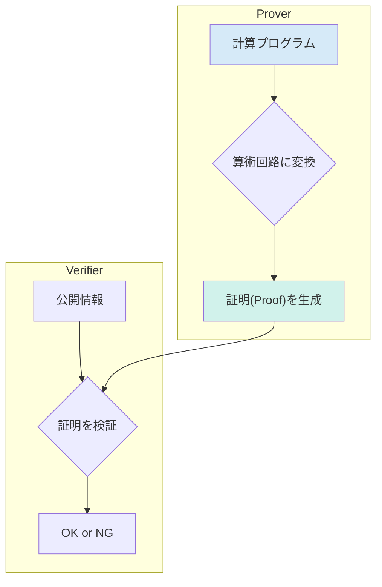
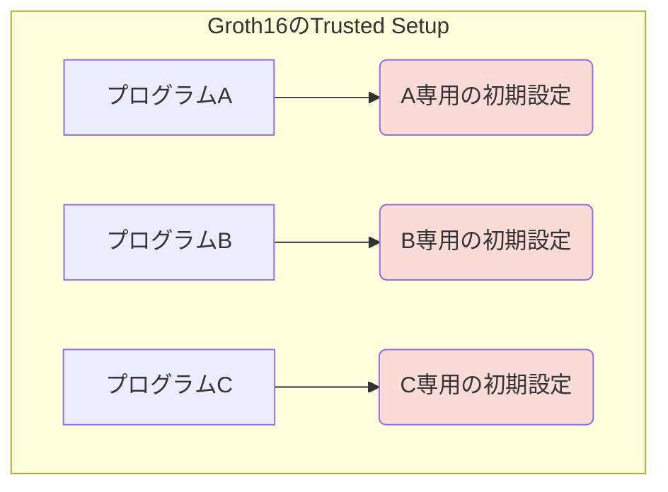
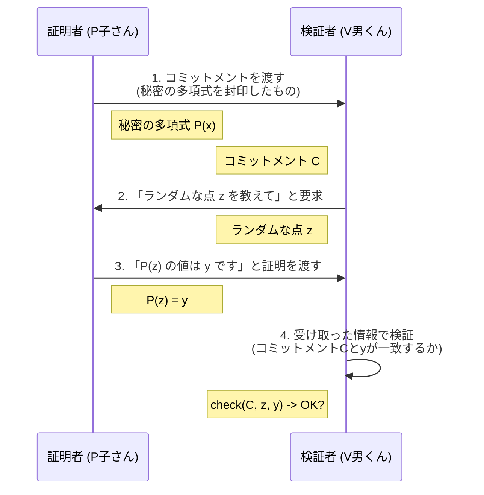
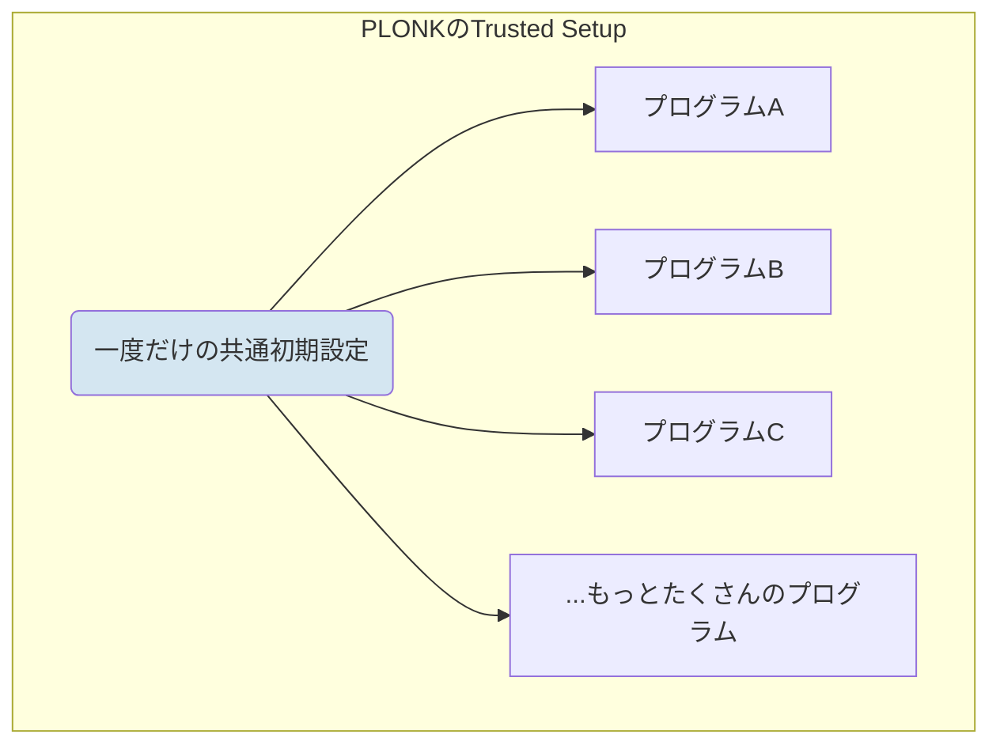
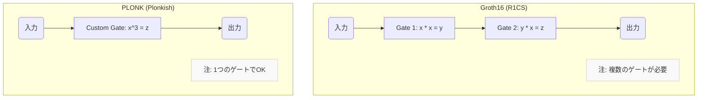

## はじめに

「ゼロ知識証明（Zero-Knowledge Proof, ZKP）」という言葉を耳にしたことはありますか？ 🤔

Web3やブロックチェーンの世界で、プライバシー保護やスケーラビリティ問題※を解決する魔法の技術として、今大きな注目を集めています。

> **スケーラビリティ問題**
> 
> ブロックチェーンの利用者が増えることで、取引の処理が遅れたり手数料が高騰したりする問題のこと。

ゼロ知識証明には様々な種類がありますが、その中でも特に重要で多くのプロジェクトで採用されているのが **"PLONK"** というプロトコルです。

この記事では

- 🤔 **ゼロ知識証明ってそもそも何？**
- ⛓️ **どんなことに使われているの？**
- ✨ **PLONKの何がすごいの？**
- 🆚 **よく聞く "Groth16" と何が違うの？**

といった疑問を、暗号技術の初心者の方でもスッキリ理解できるように図解や絵文字をたくさん使って世界一わかりやすく解説します！

## ゼロ知識証明とは

### ゼロ知識証明の概要

ゼロ知識証明とは

**「ある秘密の情報を持っていることを、その情報を一切明かさずに相手に証明する技術」** 

です。

なんだか不思議ですよね？

有名な「アリババの洞窟」の例え話で考えてみましょう。

---

**📖 アリババの洞窟の物語**

ある洞窟には、AとBの2つの入口があり、奥は秘密の呪文を知らないと通れない魔法の扉でつながっています。

- **証明者（P子さん）**: 
  「私は魔法の扉を開ける呪文を知っている」と主張しています。

- **検証者（V男くん）**: 
  「本当に知っているの？でも呪文は教えてほしくないな」と思っています。

どうすればP子さんは、V男くんに呪文を教えずに「呪文を知っていること」を証明できるでしょうか？

**【証明の手順】**
1. V男くんは洞窟の外で待機。P子さんがAかBどちらかの道から洞窟に入るのを見届けます（どちらから入ったかは見えません）。
2. V男くんは洞窟の入口に行き、ランダムに「Bから出てきて！」と叫びます。
3. もしP子さんが本当に呪文を知っていれば、魔法の扉を通って、必ず指定されたBの道から出られます。
4. もし呪文を知らなければ、入った道からしか出られません。例えばAから入っていた場合、Bから出ることはできません。
5. この手順を何度も繰り返します。毎回P子さんが指定通りに出てくることができれば、V男くんは「P子さんは偶然ではなく、本当に呪文を知っているんだな」と確信できるわけです。

---

このように、P子さんは「呪文（秘密の情報）」そのものをV男くんに見せることなく、「呪文を知っているという事実」を証明できました。

これがゼロ知識証明の基本的な考え方です。

### ゼロ知識証明でできること

この「秘密を隠したまま証明する」技術は、様々な分野で応用が期待されています。

- **プライバシー保護**:
  - **匿名認証**:   
    年齢や国籍などの個人情報を明かさずに、「成人であること」や「特定の国籍であること」を証明する。
  - **プライベート取引**:   
    取引の送金者、受取人、金額を隠したまま、その取引が正当なものであることを証明する。
- **スケーラビリティ向上**:
  - 大量の計算や取引をオフチェーン（ブロックチェーンの外）で実行し、その計算が「正しく行われたこと」の証明だけをブロックチェーンに記録する。これにより、ブロックチェーン本体の負担を大幅に減らすことができます。

実際に上記のような使い方をしているプロジェクトとして **INTMAX** というレイヤー2ブロックチェーンが存在します！

https://intmax.io/

### ゼロ知識証明の処理の流れ

実際のゼロ知識証明は、以下のような流れで処理されます。



1.  **証明者（Prover）**:
    1.  証明したい計算プログラム（例：「100個の取引をすべて処理しました」）を、数学的な「算術回路」という形式に変換します。
    2.  この算術回路と秘密の情報をインプットとして、非常に小さな「証明（Proof）」を生成します。

2.  **検証者（Verifier）**:
    1.  証明者から受け取った「証明」と、公開されている情報（プログラムの内容など）を使って、証明が正しいかどうかを検証します。
    2.  検証が成功すれば、証明者は「計算を正しく実行した」と認められます。この検証プロセスは、元の計算をすべて再実行するよりもはるかに高速です。

#### Groth16: 最速・最小の証明プロトコル

Groth16は、2016年に発表されたzk-SNARKsの代表格です。

内部では **R1CS (Rank-1 Constraint System)** という回路形式がよく使われます。

**🚀 Groth16のすごいところ**
- **最小の証明サイズ**:   
  証明が非常に小さく、ブロックチェーンに記録する際のコスト（ガス代）を極限まで抑えられます。

- **最速の検証時間**:   
  検証が圧倒的に速く、多くのノードが素早く検証を終えることができます。

この効率性の高さから、匿名通貨のZcashをはじめ、多くの初期のZK-Rollupプロジェクトで採用されました。

**😥 Groth16の弱点**
- **回路固有の信頼されたセットアップ (Trusted Setup)**
  - Groth16は、証明したい計算（プログラム）の種類ごとに、**個別の初期設定（Trusted Setup）** を行う必要があります。
  - この設定は非常に手間がかかる上、もし設定時に生成される「秘密のパラメータ（有毒な秘密パラメータ）」が漏洩すると、偽の証明が作れてしまうリスクがあります。これは「誰にも知られてはいけないマスターキー」のようなもので、その管理が非常に重要になります。
  - 新しいプログラムを作るたびに、この大変な初期設定をやり直さなければならないのが大きな課題でした。

最初のセットアップが重要になってくる部分は、 **PKI** のキーセレモニーでも同じですね。



### PLONK: 新世代の柔軟な証明プロトコル

Groth16の課題を解決するために、2019年に登場したのが **PLONK** です。

PLONKは "Permutations over Lagrange-bases for Oecumenical Noninteractive arguments of Knowledge" の略で、zk-SNARKs技術における大きなブレークスルーとなりました。

PLONKの革新性を理解するために、まずその心臓部である **「多項式コミットメントスキーム」** について少しだけ触れておきましょう。

---

#### 🔑 PLONKを理解する鍵：多項式コミットメント

ゼロ知識証明の内部では、**証明したい計算が「多項式」という数学的な表現に変換**されます。

証明者は「私はこの秘密の条件を満たす多項式を知っています」ということを、検証者に証明しなくてはなりません。

しかし、多項式そのものを渡してしまっては、秘密がバレてしまいますよね。

そこで使われるのが **コミットメントスキーム（Commitment Scheme）** 、日本語でいうと「約束の仕組み」です。

これは、情報を **「固く封印して相手に渡す技術」** だとイメージしてください。



1.  **コミット (約束する)** ✋
    - 証明者は、秘密の多項式から非常に短い **「コミットメント」** というデータ（指紋のようなもの）を計算する
    - 計算したコミットメントを検証者に渡す
    - このコミットメントから元の多項式を復元することはできない

コミットメントのイメージについては以下のbanriさんのXでのポストの内容が非常にわかりやすいです！！

https://x.com/banr1_/status/1978756892190286168

2.  **オープン (開封して見せる)** 👀
    - 検証者は、後から証明者に「その多項式の“ある一点”だけ教えて」と要求する
    - 証明者がその点を教えると、検証者は受け取ったコミットメントと照合する
    - そのコミットメントが本当に正しい多項式から作られたものかを確認する

PLONKのすごいところは、このコミットメントスキームに **「KZGコミットメント」** という方式を採用した点にあります。

KZGコミットメントの最大の特徴は、**初期設定で作られるパラメータが、特定のプログラム（回路）に依存しない「汎用的な構造」を持っている**ことです。

これにより、Groth16が抱えていた「回路ごとの設定」という大きな問題を解決し、PLONKの2つの大きな革新を可能にしました。

---

**✨ 革新点1: ユニバーサルで更新可能なTrusted Setup**

PLONKの最大の功績は、Groth16の「プログラムごとに初期設定が必要」という問題を解決したことです。

- **普遍性 (Universal)**:
  - 一度だけ初期設定を行えば、そのパラメータを**様々な種類のプログラムで使い回す**ことができます。
  - これにより、開発者は新しいプログラムを開発するたびに面倒なセットアップを行う必要がなくなり、開発スピードが劇的に向上しました。

- **更新可能性 (Updatable)**:
  - 初期設定のセキュリティは、後から参加者を追加することで継続的に強化できます。
  - 例えば、最初に100人で設定を行った後、新たに101人目が参加してパラメータを「上書き」することで、セキュリティがさらに向上します。攻撃者は「すべての参加者の秘密」を手に入れない限り偽の証明を作れないため、参加者のうち一人でも正直者がいれば安全性が保たれるのです。



**✨ 革新点2: カスタムゲートによる高い柔軟性**

もう一つの大きな革新が、**カスタムゲート**という仕組みです。

例えば、「ハッシュ関数」のような複雑な計算を考えてみましょう。

- **Groth16**: 回路の基本演算が「足し算」と「掛け算」に限定されているため、ハッシュ関数を表現するには数千個ものゲートが必要になることもあります。
- **PLONK**: 「ハッシュ計算専用のカスタムゲート」を定義できるため、わずか数十個のゲートで同じ計算を効率的に表現できます。



これにより、より複雑なプログラムを効率的に表現できるようになり、例えば「Ethereumのすべてのプログラムをゼロ知識証明化する」という壮大な構想である **"zkEVM"** の実現に道を開きました。

### PLONK vs. Groth16 比較表

最後に、2つのプロトコルの違いを表でまとめてみましょう。

| 特徴 | Groth16 (2016年) | PLONK (2019年) |
| :--- | :--- | :--- |
| **初期設定** | 😥 **回路固有** (プログラムごとに必要) | ✨ **普遍的 & 更新可能** (一度でOK、使い回せる) |
| **柔軟性** | 📉 **低い** (R1CSの足し算/掛け算が基本) | 📈 **高い** (カスタムゲートで複雑な計算も効率的) |
| **証明サイズ** | 🥇 **最小** (約128-256バイト) | 🥈 Groth16より大きい (約500-1000バイトだが、十分小さい) |
| **検証時間** | 🥇 **最速** | 🥈 Groth16よりわずかに長い |
| **採用例** | Zcash, Circom, Gnark | Aztec, zkSync, Polygon ZKEVM, Halo2※ |

> ※ **Halo2**
> 
> PLONKをベースにしていますが、Trusted Setupが不要なIPAという技術を使うなど、さらに発展させたものです。

**【トレードオフのまとめ】**
- **Groth16**: 「効率性」を極限まで追求したプロトコル。証明サイズと検証速度が最優先される場面で今でも強力です。
- **PLONK**: 「柔軟性」と「開発のしやすさ」を重視したプロトコル。多少の効率性を犠牲にしてでも、普遍的なセットアップの恩恵は絶大で、現在の主流となりつつあります。

## ゼロ知識証明はどこで使われている？（実利用例）

PLONKとその関連技術は、その柔軟性から、現在多くの最先端プロジェクトで採用されています。

- **ZK-Rollups**
  - Ethereumのスケーラビリティ問題を解決するための技術。大量のトランザクションをオフチェーンでまとめて処理し、その正しさの"証明"だけをEthereumに書き込むことで、ガス代を大幅に削減し、処理速度を向上させています。

- **zkLogin**
  - GoogleやFacebookなどのSNSアカウントを使って、暗号資産ウォレットを管理できる仕組み。
  - ゼロ知識証明を利用して、ユーザーのSNSアカウント情報（メールアドレスなど）をブロックチェーン上に公開することなく、正当なデジタルアセットの所有者であることを証明します。

## 【ハンズオン】 Groth16とPLONKを比較してみた！

ZK Core Programのカリキュラムを参考にGroth16とPLONKの違いを比較することができるサンプルプログラムを作ってみました！！

https://github.com/mashharuki/core-program/tree/main/sample/week1/Q2

### 今回試したサーキット

今回試したサーキットは a と b と c という3つの値を掛け算した結果が正しい情報かどうかをチェックするだけの非常にシンプルなサーキットになっています。

https://github.com/mashharuki/core-program/blob/main/sample/week1/Q2/contracts/circuits/Multiplier3.circom

### 事前準備

まずGitHubリポジトリをクローンしてきます

```bash
git clone https://github.com/mashharuki/core-program
```

次にサーキット、コントラクトが格納されているフォルダに移動します

```bash
cd sample/week1/Q2
```

依存関係をインストールします

```bash
npm i
```

これで準備OKです！！

### コンパイル

#### Gloth16の場合

コンパイル用のシェルスクリプトは以下のような内容となります

Gloth16の場合は回路ごとに個別にTrusted Setupを行なっていることがわかります

https://github.com/mashharuki/core-program/blob/main/sample/week1/Q2/scripts/compile-Multiplier3-groth16.sh

最終的には検証用のスマートコントラクトを出力するようにしています。

これをブロックチェーン上にデプロイすることでサーバーレスな環境でいつでもZKPの検証が行えるというわけです。

https://github.com/mashharuki/core-program/blob/main/sample/week1/Q2/contracts/Multiplier3Verifier.sol

#### PLONKの場合

コンパイル用のシェルスクリプトは以下のような内容となります

PLONKの場合ではサーキット共通の初期設定情報を使っているので個別にTrusted Setupを行なっていないことがわかります！

https://github.com/mashharuki/core-program/blob/main/sample/week1/Q2/scripts/compile-Multiplier3-plonk.sh

こちらも同様に検証用のスマートコントラクトを出力させるようにしています。

https://github.com/mashharuki/core-program/blob/main/sample/week1/Q2/contracts/Multiplier3VerifierPlonk.sol

注目してもらいたいのはそのサイズの違いです！

Gloth16でコンパイルした時は**170**行ぐらいだったのに対してPLONKでコンパイルした場合には**700**行ぐらいになっています！！

最初のセットアップを簡単にする代わりに検証時にコストが上がっていることがここからもわかりますね！

### ユニットテスト

**chai**と**snarkjs**を使ってJavaScript/TypeScriptでユニットテストコードを書くこともできます！！

https://github.com/mashharuki/core-program/blob/main/sample/week1/Q2/test/circuit.test.js

今回該当するのは以下の2つです。

- Multiplier3 with Groth16
- Multiplier3 with PLONK

**snarkjs**ライブラリから**gloth16**か**plonk**を選んで、ZK Proofの生成と検証を行うことができます！

```js
const { groth16, plonk } = require("snarkjs");
```

ユニットテストコードでやっていることはシンプルで以下のシナリオを共有してテストするようにしています。

- 検証用のスマートコントラクトのインスタンス化
- ZK Proofの生成
- ZK Proofをスマートコントラクト検証メソッド用の引数に変換
- 検証用のスマートコントラクト側で検証メソッドを呼び出して問題なく検証が通るか確認

実際に動かしてみると実行時間に違いがあることが確認できます！

```bash:実際の実行結果例
  Multiplier3 with Groth16
    ✔ Circuit should multiply three numbers correctly
2 x 3 x 4 =  24
    ✔ Should return true for correct proof (394ms)
    ✔ Should return false for invalid proof (144ms)

  Multiplier3 with PLONK
2 x 3 x 4 =  24
    ✔ Should return true for correct proof (485ms)
    ✔ Should return false for invalid proof (129ms)s
```

ハンズオンセクションはここまでになります！

## まとめ

今回は、ゼロ知識証明の基本から、その応用を大きく広げたPLONKプロトコルまでを解説しました。

- **ゼロ知識証明**は、「秘密を隠したまま正しさを証明する」魔法のような技術。
- **zk-SNARKs**は、証明が「小さくて速い」非対話式のゼロ知識証明。
- **Groth16**は、最高効率だけど「初期設定が面倒」という弱点があった。
- **PLONK**は、「普遍的な初期設定」でその弱点を克服し、開発のハードルを劇的に下げた新世代のスター！

PLONKの登場により、多くの開発者がゼロ知識証明を気軽に利用できるようになり、ZK-RollupやzkEVMといった革新的な技術が生まれました。

ゼロ知識証明の世界は猛スピードで進化しており、PLONKをベースにしたさらに新しい技術（Plonky2, Halo2など）も登場しています。

今後はもっと簡単に多くの人がゼロ知識証明の技術を使えるようになっていくと考えられています。  

Web3領域のみならずAI領域で応用が可能な汎用性の高い技術として今のうちからしっかり抑えておくと良いかもしれません！

最後までお読みいただき、ありがとうございました！  
この記事が、ゼロ知識証明への理解を深める一助となれば幸いです。
