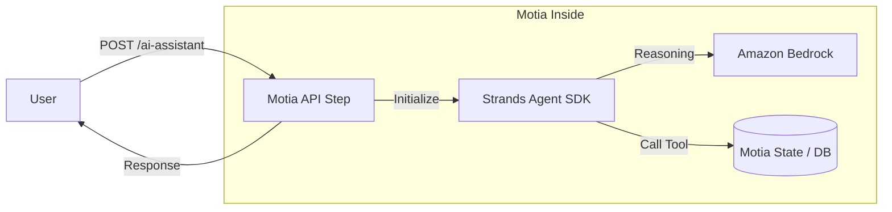

:::message
This article was written in collaboration with AI.
:::

## Introduction

Hello everyone!

I'm thrilled to announce that I've been selected as an **AWS Community Builder** (in the AI Engineering category)! 🚀

This year, my theme is "AI Engineering × Modern Backend," and I plan to actively share practical insights that you can use in real-world projects.

As the first installment of this journey, I'll be starting a series on building practical AI applications combining **Motia**, the backend framework I'm most excited about right now, and **Strands Agent**, the AI agent SDK recently released by AWS.

In this first post, we'll focus on **"How to integrate the AWS Strands Agent TypeScript SDK into an API built with Motia,"** covering everything from conceptual explanations to concrete implementation code!

**Motia** is incredibly interesting, so I hope you'll read through to the end!

---

## 1. What is AWS Strands Agent?

**AWS Strands Agent** is an open-source SDK for AI agent development provided by AWS!

https://strandsagents.com/latest/

By using this SDK, you can develop AI Agent applications in just a few lines of code!

### Key Features

- **The Arrival of the TypeScript Version**:   
  The long-awaited TypeScript SDK (`@strands-agents/sdk`) was released in preview at the end of 2025, finally making development possible in TypeScript!
- **Abstraction of the Agent Loop**:   
  The SDK handles the "Thought," "Action," and "Observation" loops on your behalf.
- **AWS Native**:   
  It has excellent affinity with Amazon Bedrock (Claude 3.5/4, Nova, etc.) and is easy to deploy to AWS Lambda or ECS.

I've summarized more about the TypeScript SDK in a separate article, so feel free to check that out as well.

https://zenn.dev/mashharuki/articles/strands_agent_ts_sdk-1

---

## 2. Motia: Redefining Backend Development with "Steps"

Have you heard of **Motia**, the backend framework??


Motia is a next-generation framework that consolidates APIs, background jobs, and workflows into a single primitive called a "**Step**."

It's currently gaining massive momentum, having ranked #1 in the Backend category of JavaScript Rising Stars 2025, surpassing heavyweights like **Hono** and **Next.js**!


### Core Concepts of Motia

- **Everything is a "Step"**:   
  Whether it's a REST API or a cron job, everything is defined as a "Step." This enables backend development through event-driven patterns!

  

- **Infrastructure Abstraction via the iii Engine**:   
  Developers only need to define infrastructure (queues and state) in `config.yaml`, allowing them to focus entirely on business logic.

- **Polyglot Support**:   
  You can mix TypeScript and Python within the same project and have them collaborate via events!

  For example, if only a Python SDK is available for a specific feature, you can flexibly switch languages to implement that API.

---

## 3. Practical: Integrating Strands Agent into Motia

Now, let's get our hands dirty!

We'll assume a "Ticket Management System" scenario and build an API where an AI answers user inquiries.

### Sample Repository

The code for this project is available in the following repository:

https://github.com/mashharuki/Motia-Strands-Agent-Sample

### Environment Setup

First, initialize the project using `motia-cli`!

```bash
cd my-project && iii -c iii-config.yaml
```

If the API starts up at `http://localhost:3111`, you're good to go!

### Implementing a Step: 

In Motia, we implement API endpoints as `Step` units.

Below is an implementation example of an API endpoint that retrieves a list of tickets.

```typescript
import type { Handlers, StepConfig } from 'motia';
import { z } from 'zod';

// Endpoint Configuration
export const config = {
  name: 'ListTickets',
  description: 'Returns all tickets from state',
  flows: ['support-ticket-flow'],
  triggers: [
    {
      type: 'http',
      method: 'GET',
      path: '/tickets',
      responseSchema: {
        200: z.object({
          tickets: z.array(z.record(z.string(), z.any())),
          count: z.number(),
        }),
      },
    },
  ],
  enqueues: [],
} as const satisfies StepConfig;

/**
 * Handler to retrieve all tickets
 * @param _ 
 * @param param1 
 * @returns 
 */
export const handler: Handlers<typeof config> = async (
  _,
  { state, logger },
) => {
  // Retrieve all tickets from state
  const tickets = await state.list<Record<string, unknown>>('tickets');

  logger.info('Listing tickets', { count: tickets.length });

  return {
    status: 200,
    body: { tickets, count: tickets.length },
  };
};
```

The clean separation between configuration and the handler makes it very easy to understand!

### Configuring Strands Agent

For clarity, we'll implement the Strands Agent settings in a separate file.

```ts
import { Agent } from "@strands-agents/sdk";
import { getTicketTool, listOpenTicketsTool } from "./tools";

// Initialize Agent: Set system prompt and tools
export const agent = new Agent({
  systemPrompt:
    'You are a concise support operations AI assistant. Use tools to reference real tickets before answering. Respond with practical next actions.',
  tools: [getTicketTool, listOpenTicketsTool],
});
```

And here are the tool definitions!

```ts
import { tool } from "@strands-agents/sdk";
import { state } from "motia";
import z from "zod";

// Tool Definition: Retrieve ticket info by ID
export const getTicketTool = tool({
  name: 'get_ticket',
  description: 'Get one support ticket by ticketId',
  inputSchema: z.object({ ticketId: z.string() }),
  callback: async (input) => {
    const ticket = await state.get<Record<string, unknown>>('tickets', input.ticketId);
    if (!ticket) {
      return `Ticket ${input.ticketId} not found`;
    }
    return JSON.stringify(ticket);
  },
});

// Tool Definition: List open tickets (max 10)
export const listOpenTicketsTool = tool({
  name: 'list_open_tickets',
  description: 'List currently open support tickets (max 10)',
  inputSchema: z.object({
    limit: z.number().int().min(1).max(10).optional().default(5),
  }),
  callback: async (input) => {
    // Get list of tickets from state, filter by "open" status
    const tickets = await state.list<Record<string, unknown>>('tickets');
    const openTickets = tickets
      .filter((ticket) => ticket.status === 'open')
      .slice(0, input.limit);
    return JSON.stringify(openTickets);
  },
});
```

### Implementing the AI Agent Assistant Endpoint

Using the Strands Agent features implemented above, I built an endpoint with AI Agent assistant functionality like this:

The base follows **Motia**'s rules, but the basic usage isn't much different from using other frameworks.

```ts
import type { Handlers, StepConfig } from 'motia';
import { z } from 'zod';
import { agent } from './lib/ai/agent';

const requestSchema = z.object({
  prompt: z.string().min(1),
  ticketId: z.string().optional(),
});

const responseSchema = z.object({
  answer: z.string(),
  referencedTicketId: z.string().nullable(),
  openTicketCount: z.number(),
  modelProvider: z.string(),
});

// Step definition for AI Assistant
export const config = {
  name: 'AiTicketAssistant',
  description: 'AI support assistant powered by Strands Agent SDK',
  flows: ['support-ticket-flow'],
  triggers: [
    {
      type: 'http',
      method: 'POST',
      path: '/tickets/ai-assistant',
      bodySchema: requestSchema,
      responseSchema: {
        200: responseSchema,
        400: z.object({ error: z.string() }),
        500: z.object({ error: z.string(), hint: z.string().optional() }),
      },
    },
  ],
  enqueues: [],
} as const satisfies StepConfig;

/**
 * Handler for AI Assistant
 * @param request
 * @param param1
 * @returns
 */
export const handler: Handlers<typeof config> = async (
  request,
  { logger, state },
) => {
  const { prompt, ticketId } = request.body;

  if (!prompt) {
    return {
      status: 400,
      body: { error: 'prompt is required' },
    };
  }

  const referencedTicket =
    ticketId
      ? await state.get<Record<string, unknown>>('tickets', ticketId)
      : null;

  // Build agent prompt: include user prompt, specific ticket ID, and referenced ticket data
  const agentPrompt = [
    `User request: ${prompt}`,
    ticketId ? `Focused ticketId: ${ticketId}` : 'No specific ticketId provided.',
    referencedTicket ? `Focused ticket data: ${JSON.stringify(referencedTicket)}` : '',
  ]
    .filter(Boolean)
    .join('
');

  try {
    // Invoke Agent: pass the built prompt and get the response
    const result = await agent.invoke(agentPrompt);
    // Count open tickets from state
    const tickets = await state.list<Record<string, unknown>>('tickets');
    const openTicketCount = tickets.filter((ticket) => ticket.status === 'open').length;
    
    const answer =
      typeof result === 'string'
        ? result
        : typeof result?.toString === 'function'
          ? result.toString()
          : JSON.stringify(result);

    logger.info('AI assistant generated response', {
      ticketId: ticketId ?? null,
      openTicketCount,
    });

    return {
      status: 200,
      body: {
        answer,
        referencedTicketId: ticketId ?? null,
        openTicketCount,
        modelProvider: 'strands-default-bedrock',
      },
    };
  } catch (error) {
    logger.error('AI assistant invocation failed', {
      ticketId: ticketId ?? null,
      error: error instanceof Error ? error.message : String(error),
    });

    return {
      status: 500,
      body: {
        error: 'Failed to invoke Strands Agent. Check model credentials and runtime configuration.',
        hint: 'If using Bedrock default provider, ensure AWS credentials and region are configured.',
      },
    };
  }
};
```

### Implementation Highlights

1. **Trigger Definition**:   
  By simply specifying `http` in the `triggers` array, it's immediately published as an API.
2. **Leveraging the ctx Object**:   
  Easily access logs and the database (state) managed by Motia through `ctx.logger` and `ctx.state`.
3. **Type-Safe Tool Usage**:   
  Since Strands Agent supports Zod, you can strictly define tool inputs/outputs, preventing unintended behavior.

## 4. Testing the Endpoint

I've prepared a `sample.http` for easy testing using a REST Client. Let's call each process one by one!

Here is an example of having Strands Agent reference active tickets:

```bash
curl -X POST http://127.0.0.1:3111/tickets/ai-assistant 
  -H 'Content-Type: application/json' 
  -d '{
    "prompt": "Tell me which tickets should be prioritized.",
    "ticketId": "TKT-EXAMPLE-001"
  }'
```

If you see something like this, it's working correctly!

```json
{
  "answer": "I've reviewed the status for ticket TKT-1772723527561-e4a8w.

## Analysis:
- **Severity**: Critical
- **Status**: Escalated (auto-escalated to engineering-lead)
- **Issue**: Payment error (PMT-402)
- **SLA Violation**: Unresolved for 2039 minutes (~34 hours)

## 3 Recommended Next Actions:

### 1. **Immediate Follow-up with Engineering-lead**
   - Check progress post-escalation
   - Confirm the root cause analysis status for PMT-402
   - Inquire about temporary workarounds

### 2. **Update the Customer**
   - Report current investigation status to customer@example.com
   - Suggest alternative payment methods (if possible)
   - Provide a timeline for the next update (e.g., within 4 hours)

### 3. **Emergency Check on Payment System**
   - Verify frequency of PMT-402 errors (impact on other customers)
   - Check payment gateway status
   - Coordinate with the incident response team if necessary

**Priority**: Recommendation is to execute in order: 1→2→3.
",
  "modelProvider": "strands-default-bedrock",
  "openTicketCount": 2,
  "referencedTicketId": "TKT-1772723527561-e4a8w"
}
```

## 5. Visual Flow Diagram

Using Mermaid syntax, here’s a diagram of the request flow.



As you can see, Motia acts as the **"Gateway for API" and "Data Storage,"** while Strands Agent orchestrates them as the "Brain." It's a very clean architecture.

## Summary and Next Preview

In this post, we covered the basics of an AI backend combining Motia and AWS Strands Agent!

**Advantages of this configuration:**
- **Development Speed**:   
  Motia hides complex infrastructure setup, and Strands abstracts the agent loop.
- **Operability**:   
  With Motia's `traceId`, you can easily track which data the AI referenced to generate an answer.
- **Flexibility**:  
  It offers the flexibility to implement parts in Python if you need to use an SDK that only supports Python!

In the next installment, I plan to dive into **"Frontend implementation and full-stack integration"** for calling this backend.

Thank you for reading!

### References

- [Motia Official Documentation](https://motia.dev/)
- [Strands Agents SDK (GitHub)](https://github.com/aws-samples/strands-agents-sdk)
- [Amazon Bedrock AgentCore](https://aws.amazon.com/bedrock/agentcore/)
