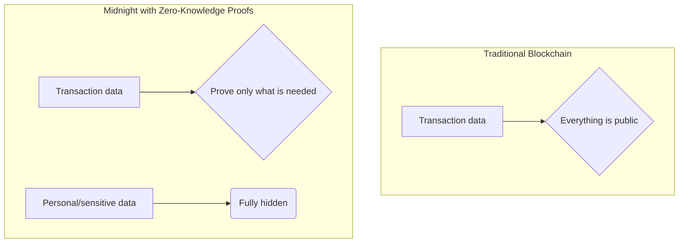
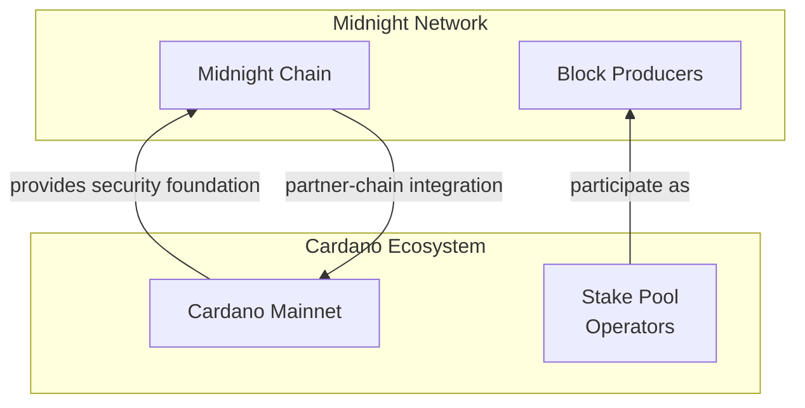

## Introduction: The "Too Transparent" Problem in Blockchain

Seventeen years have passed since the Bitcoin whitepaper was released.

Blockchain's immutability and transparency have been praised as groundbreaking mechanisms for trustworthy transactions. Because anyone can verify the ledger, blockchains created a new model of tamper-resistant trust.

However, that same "complete transparency" also creates barriers in areas involving business and personal privacy. This issue has been especially clear in enterprise settings, which is one reason private chain adoption became popular.

*   What if your full banking transaction history were visible to anyone in the world?
*   What if a company's confidential supply chain information were exposed to competitors?
*   What if personal medical records or voting history became public?

Even imagining this is unsettling. I believe this "too transparent" problem is one of the key reasons blockchain technology has not yet fully penetrated all parts of society.

Not everything can be public all the time. To solve this dilemma, a new light has emerged: **Midnight**.

https://midnight.network/

Midnight is Cardano's partner chain (sidechain) specialized for data protection and privacy. In this article, I will guide you through Midnight in a story-driven way so you can understand its innovative technology and future potential.

## Chapter 1: What Is Midnight? - A New Blockchain for Privacy

In one sentence, Midnight is a data-protection blockchain that enables **Selective Disclosure**. While many traditional blockchains force everything to be public, Midnight makes it possible to **prove only the facts that need to be proven, without revealing anything else**.

> **Note**
> There are other blockchains, such as **Zcash**, that adopt similar privacy-oriented approaches.

The technology that enables this is **Zero-Knowledge Proofs (ZKPs)**.

<details>
<summary>View Architecture Diagram (Mermaid)</summary>


</details>

I have another article dedicated to **Zero-Knowledge Proofs (ZKPs)**, so feel free to check that out as well:
[Zero-Knowledge Proofs Deep Dive](https://zenn.dev/mashharuki/articles/zk_groth16-plonk)

### What Midnight aims to achieve

Midnight's mission is to remove the long-standing trade-off between data protection, ownership, and data utility.

*   **For users**: They can fully control their own data and decide who can see what, and how much.
*   **For developers and enterprises**: They can build innovative data-driven services without taking on privacy-violation risk.

This opens the door to use cases that were previously difficult or impossible on public blockchains due to confidentiality requirements.

### Midnight's core: architecture and consensus

As a Cardano partner chain, Midnight is built on top of Cardano's robust security infrastructure.

*   **Architecture**: Midnight splits smart contract state into two parts:
    1.  **Public state**: Data that remains publicly available on-chain.
    2.  **Private state**: Data each user manages off-chain in their own local environment.
*   **Kachina protocol**: Public and private states are linked securely through **Kachina**, a research-driven unified framework. Users generate ZK proofs locally using private data, then submit only the proof to the blockchain for verification.
*   **Consensus algorithm**: Midnight adopts a hybrid consensus model combining **AURA** (block production) and **GRANDPA** (finality). Cardano stake pool operators (SPOs) participate as block producers.

### Two native tokens: NIGHT and DUST

Midnight uses a unique dual-token model.

| Token | Role | Characteristics |
| :---- | :--- | :-------------- |
| **NIGHT** | Governance, consensus | **Unshielded token**. Tradable and contributes to network security. |
| **DUST** | Transaction fees (gas) | **Shielded resource**. Non-transferable and privacy-preserving. |

`DUST` acts as fuel, but because it is not a tradable asset, transaction metadata privacy is better preserved while keeping service costs more predictable.

## Chapter 2: The Bond with Cardano - Why a Partner Chain?

Midnight is an independent chain, but its deep integration with Cardano is what unlocks its full potential.

<details>
<summary>View Ecosystem Diagram (Mermaid)</summary>


</details>

### Inheriting security

Midnight addresses the challenge of network security by becoming a Cardano partner chain. It leverages Cardano's large, decentralized SPO network, allowing Midnight to access globally distributed, enterprise-grade infrastructure from day one.

### How Midnight differs from Cardano

*   **Cardano**: Focuses on value storage/transfer and serving as a secure general-purpose decentralized platform.
*   **Midnight**: Uses Cardano's security as a base while specializing in **データ保護とプライバシー** as a dedicated computation layer.

They are complementary: Cardano provides the trust foundation, while Midnight enables privacy-sensitive applications.

## Chapter 3: Compact - ZKP Smart Contracts with TypeScript-like Syntax

> **Note**
> "Aren't zero-knowledge proofs only for cryptography specialists?"

Midnight addresses this challenge with a new smart contract language: **Compact**.



### Why Compact is exciting

1.  **TypeScript-based DSL**: Based on one of the world's most popular languages, allowing web developers to build privacy-focused apps with familiar syntax.
2.  **Abstraction of ZK complexity**: The Compact compiler translates contract logic into the cryptographic material required for proof generation.
3.  **Privacy by Design**: Data is treated as **private by default**. To expose private data, you must explicitly wrap it with `disclose()`.

```typescript
// Conceptual Compact example

// Private user vote
witness userVote: private Field;

// Public vote result
let results: public Field;

// Voting circuit
circuit vote() {
  // Update result when validation passes
  // Who voted for what remains private
  results = results + 1;

  // If you want to reveal vote content, do it explicitly
  // disclose(userVote);
}
```

## Chapter 4: Use Cases Unlocked by Midnight

*   **Digital ID / KYC**: Prove you are over 18 without revealing your full birth date.
*   **Anonymous voting**: Truly fair voting systems with verified eligibility and ballot secrecy.
*   **Healthcare**: Private medical records used for aggregate analysis or AI research.
*   **DeFi**: Access financial services without exposing portfolios or strategies.
*   **AI and LLMs**: Use sensitive data for model training while preserving privacy.

## Summary: The Dawn of a New Privacy Era

Midnight is foundational technology for a safer, fairer digital society where individuals retain data sovereignty and enterprises can innovate responsibly.

Thank you for reading! 🚀

## Developer Resources

*   [Midnight Developer Hub](https://midnight.network/developer-hub)
*   
*   

## References

*   [Midnight Official Website](https://www.midnight.network/)
*   [Midnight Documentation](https://docs.midnight.network/)
