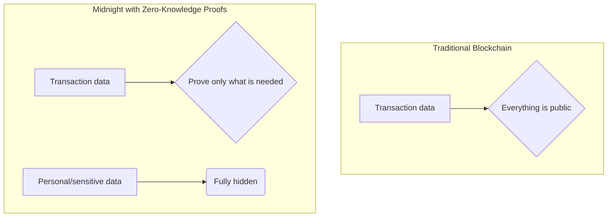
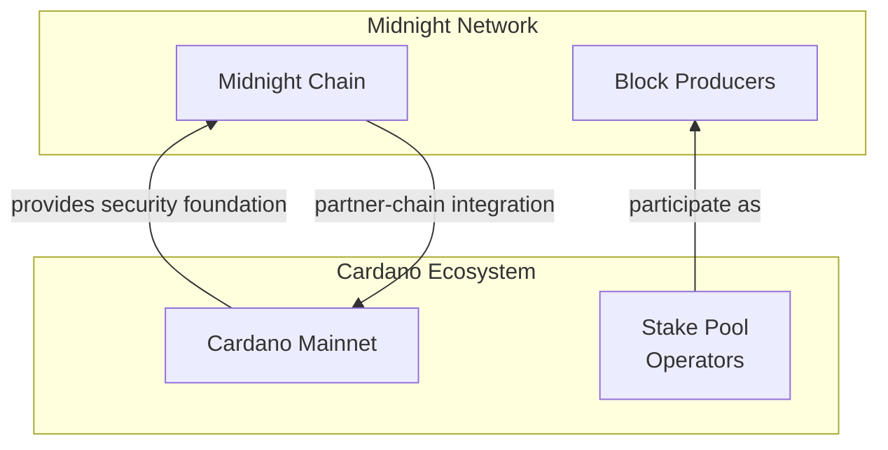

## Introduction: The "Too Transparent" Problem in Blockchain

Seventeen years have passed since the Bitcoin whitepaper was released.

Blockchain's immutability and transparency have been praised as groundbreaking mechanisms for trustworthy transactions.

Because anyone can verify the ledger, blockchains created a new model of tamper-resistant trust.

However, that same "complete transparency" also creates barriers in areas involving business and personal privacy.

This issue has been especially clear in enterprise settings, which is one reason private chain adoption became popular.

- What if your full banking transaction history were visible to anyone in the world?
- What if a company's confidential supply chain information were exposed to competitors?
- What if personal medical records or voting history became public?

Even imagining this is unsettling.

I believe this "too transparent" problem is one of the key reasons blockchain technology has not yet fully penetrated all parts of society.

Not everything can be public all the time.

To solve this dilemma, a new light has emerged.

That is **Midnight**.

https://midnight.network/

Midnight is Cardano's partner chain (sidechain) specialized for data protection and privacy.

In this article, I will guide you through Midnight in a story-driven way so you can understand its innovative technology and future potential.

Let's dive in.

## Chapter 1: What Is Midnight? - A New Blockchain for Privacy

In one sentence, Midnight is a data-protection blockchain that enables **Selective Disclosure**.

While many traditional blockchains force everything to be public, Midnight makes it possible to **prove only the facts that need to be proven, without revealing anything else**.

:::message
There are other blockchains, such as **Zcash**, that adopt similar privacy-oriented approaches.
:::

The technology that enables this is **Zero-Knowledge Proofs (ZKPs)**.



I have another article dedicated to **Zero-Knowledge Proofs (ZKPs)**, so feel free to check that out as well:

https://zenn.dev/mashharuki/articles/zk_groth16-plonk

### What Midnight aims to achieve

Midnight's mission is to remove the long-standing trade-off between data protection, ownership, and data utility.

- **For users**
  They can fully control their own data and decide who can see what, and how much.
- **For developers and enterprises**
  They can build innovative data-driven services without taking on privacy-violation risk.

This opens the door to use cases that were previously difficult or impossible on public blockchains due to confidentiality requirements.

### Midnight's core: architecture and consensus

As a Cardano partner chain, Midnight is built on top of Cardano's robust security infrastructure.

- **Architecture**
  Midnight splits smart contract state into two parts:
  1. **Public state**
     Data that remains publicly available on-chain.
  2. **Private state**
     Data each user manages off-chain in their own local environment.

- **Kachina protocol**
  Public and private states are linked securely through **Kachina**, a research-driven unified framework.
  Users generate ZK proofs locally using private data, then submit only the proof to the blockchain for verification.

- **Consensus algorithm**
  Midnight adopts a hybrid consensus model combining **AURA** (block production) and **GRANDPA** (finality).
  Cardano stake pool operators (SPOs) participate as block producers, helping ensure decentralization and security.

### Two native tokens: NIGHT and DUST

Midnight uses a unique dual-token model.

| Token | Role | Characteristics |
| :---- | :--- | :-------------- |
| **NIGHT** | Governance, consensus participation, block production rewards | **Unshielded token**. Tradable on exchanges and contributes to network security. |
| **DUST** | Transaction fees (gas) | **Shielded resource**. Non-transferable and privacy-preserving. Designed for stable, predictable fees. |

`DUST` acts as fuel, but because it is not a tradable asset, transaction metadata privacy (who paid whom and how much) is better preserved while keeping service costs more predictable.

## Chapter 2: The Bond with Cardano - Why a Partner Chain?

You cannot talk about **Midnight** without discussing its relationship with **Cardano**.

Midnight is an independent chain, but its deep integration with Cardano is what unlocks its full potential.



### Inheriting security

One of the hardest challenges for any new blockchain is bootstrapping network security.

Midnight addresses this by becoming a Cardano partner chain.

- **Security bootstrap**
  Midnight leverages Cardano's large, decentralized SPO network.
  To become a Midnight block producer, you first need to be a Cardano SPO.

- **Trusted infrastructure**
  This allows Midnight to access globally distributed, enterprise-grade infrastructure from day one.

### How Midnight differs from Cardano

Let's summarize the differences clearly:

- **Cardano**
  Focuses on value storage/transfer and serving as a secure general-purpose decentralized platform.
- **Midnight**
  Uses Cardano's security as a base while specializing in **data protection and privacy** as a dedicated computation layer.

They are complementary, not competitors.

Cardano provides a trust foundation, while Midnight enables complex privacy-sensitive applications on top.

## Chapter 3: Compact - ZKP Smart Contracts with TypeScript-like Syntax

:::message
"Aren't zero-knowledge proofs only for cryptography specialists?"
:::

Many people feel that way.

Midnight addresses this challenge with a new smart contract language: **Compact**.

https://github.com/midnightntwrk/compact

### Why Compact is exciting

1. **TypeScript-based DSL**
   Compact is a domain-specific language based on TypeScript, one of the world's most popular programming languages.
   This allows a huge number of web developers to build privacy-focused apps with familiar syntax.

2. **Abstraction of ZK complexity**
   Developers do not need to handle advanced cryptography or complex proof mathematics directly.
   The Compact compiler translates contract logic into the cryptographic material required for proof generation.

3. **Privacy by Design**
   Compact includes smart safeguards to prevent accidental information leakage.
   - Data is treated as **private by default**.
   - To expose private data to public state, you must explicitly wrap it with `disclose()`.
   - If you forget this rule, the compiler throws an error, reducing accidental leaks.

```typescript
// Conceptual Compact example

// Private user vote
witness userVote: private Field;

// Public vote result
let results: public Field;

// Voting circuit
circuit vote() {
  // ... logic to validate vote legitimacy ...

  // Update result when validation passes
  // Who voted for what remains private
  results = results + 1;

  // If you want to reveal vote content, do it explicitly
  // disclose(userVote);
}
```

### Development workflow

Developers can write frontend and business logic in TypeScript/JavaScript, while implementing core private logic in Compact.

The Compact compiler automatically generates TypeScript APIs connecting both layers, providing a seamless development experience.

## Chapter 4: Use Cases Unlocked by Midnight

What becomes possible when privacy is protected?

The possibilities are broad.

- **Digital ID / KYC**
  You can prove "I am over 18" without revealing your full birth date.
  Facts can be proven without exposing personal data.

- **Anonymous voting**
  You can build truly fair voting systems where voter eligibility and vote validity are verified, while preserving ballot secrecy.

- **Healthcare**
  Personal medical records can remain fully private while still allowing aggregate analysis for research and AI-driven drug discovery.

- **DeFi (Decentralized Finance)**
  Users can access financial services without exposing portfolios or trading strategies.

- **AI and LLMs**
  Sensitive enterprise or personal data can be used for model training while preserving privacy requirements.

## Summary: The Dawn of a New Privacy Era

Key takeaways:

- ✅ **Midnight** uses zero-knowledge proofs to address blockchain's core "too transparent" challenge.
- ✅ Through strategic integration with **Cardano**, Midnight can secure strong security and decentralization from launch.
- ✅ By combining the **Compact language** with the TypeScript ecosystem, Midnight lowers the barrier for developers to build privacy-preserving applications.

Midnight is more than just another blockchain.

It is foundational technology for a safer, fairer digital society where individuals retain data sovereignty and enterprises can innovate responsibly.

If you want to explore further, I highly recommend checking the official docs.

Thank you for reading.

## Developer Resources

If you want to build applications on Midnight, these are great starting points:

https://midnight.network/developer-hub

https://github.com/midnightntwrk/midnight-awesome-dapps

https://github.com/MeshJS/midnight-starter-template

https://github.com/DEGAorg/midnight-mcp

I also made it easier to explore Midnight repos via Deepwiki:

https://deepwiki.com/midnightntwrk/midnight-zk

https://deepwiki.com/midnightntwrk/midnight-docs

https://deepwiki.com/midnightntwrk/compact

https://deepwiki.com/midnightntwrk/midnight-js

https://deepwiki.com/midnightntwrk/midnight-awesome-dapps

https://deepwiki.com/DEGAorg/midnight-mcp

## Midnight Summit 2025

Midnight Summit 2025 will be held in London in November 2025.

For updates, check:

https://midnightsummit.io/

## References

- [Midnight official website](https://www.midnight.network/)
- [Midnight documentation](https://docs.midnight.network/)
