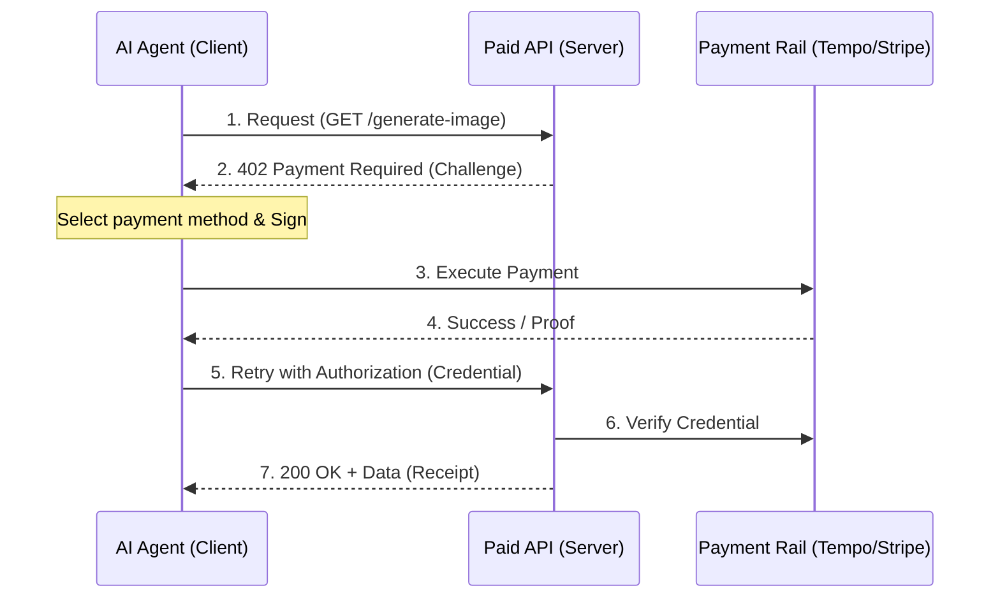

# Introduction

Do you know the most noteworthy protocol in the current "AI x Web3" era?

It is the **Machine Payments Protocol (MPP)**, jointly formulated by Stripe and the L1 blockchain Tempo.

https://stripe.com/blog/machine-payments-protocol

I have also written a separate article about **Tempo**, so please check that out as well!


https://dev.to/mashharuki/the-ultimate-guide-to-stripes-payment-focused-l1-tempo-dissecting-the-new-standard-for-the-1d1m

In this article, I will thoroughly analyze this protocol, which "realizes" the HTTP 402 status code after 20 years, from an engineer's perspective.

# 1. What is MPP?: The Return of HTTP 402

HTTP status code **402 "Payment Required"**.

Defined in the RFC but long left as "reserved for future use," this code has been heard more frequently since Coinbase announced x402 last year.

https://mpp.dev/protocol/http-402

**MPP (Machine Payments Protocol)** is a standard that allows AI agents and applications to **complete service discovery, negotiation, payment, and usage within a single HTTP request**.

A draft has already been submitted to the IETF (Internet Engineering Steering Group), making it an ambitious project aimed at embedding payments into the foundational layer of the internet. If adopted, it will become an international standard.

### Challenges MPP Solves

MPP is designed to solve the following challenges:

- **Elimination of Human-Centric UI**: 
  Removes the need for CAPTCHAs and manual checkout flows.
- **Account-less Payments**: 
  Enables autonomous, on-the-spot payments without prior sign-up or OAuth.
- **Agnostic Design**: 
  Compatible with various payment rails like [Tempo](https://mpp.dev/payment-methods/tempo) (stablecoins), [Stripe](https://mpp.dev/payment-methods/stripe) (cards), and [Lightning](https://mpp.dev/payment-methods/lightning) (BTC).

# 2. Core Mechanism: Challenge-Credential-Receipt

MPP communication consists of the following sequence:

https://mpp.dev/protocol



1. **[Challenges](https://mpp.dev/protocol/challenges)**: 
  The server specifies "how much, in what currency, and via which payment rail" it wants to be paid.
2. **[Credentials](https://mpp.dev/protocol/credentials)**: 
  The client executes the payment based on the challenge and retries the request with "proof of payment."
3. **[Receipts](https://mpp.dev/protocol/receipts)**: 
  The server verifies the proof and returns the resource along with a "receipt."

# 3. Two Payment Intents

MPP offers two modes depending on the use case.

| Feature | **[Charge (One-time)](https://mpp.dev/intents/charge)** | **Session (Subscription/Usage-based)** |
| :--- | :--- | :--- |
| **Pattern** | One payment per request | Metered billing via pre-deposit |
| **Latency** | Wait for on-chain confirmation (100ms+) | **Microseconds (off-chain signature verification)** |
| **Throughput** | Normal | **Extremely high (ideal for LLM token billing)** |
| **Cost** | Fee per payment | Consolidated fee (approaching zero) |

The **Session** mode is particularly powerful. By initially making a deposit and subsequently presenting "off-chain signed vouchers," the **payment overhead per request becomes almost zero**.

https://mpp.dev/guides/pay-as-you-go

> This is also highly compatible with the **Lightning Network** (Bitcoin L2)!!

# 4. TIP-20: The Ultimate Partner for MPP

**TIP-20**, the token standard of the Tempo L1, plays a central role when performing stablecoin payments with MPP.

https://mpp.dev/payment-methods/tempo

### How is it different from ERC-20?

> While famous ERC-20 tokens include **USDC** and **JPYC**, TIP-20 differs in the following ways:

- **32-Byte Transfer Memo**: 
  Directly records invoice numbers or customer IDs on-chain.
- **Fee Token Selection**: 
  Gas fees can be paid directly with stablecoins like USDX.
- **Reward Distribution**: 
  Efficiently distributes rewards based on holdings without requiring staking.

Thanks to the "memo feature," backend systems can uniquely identify which payment corresponds to which request without complex database searches.

# 5. Relationship with x402: Are they Competitors?

Let's clarify the relationship with the often-confused **x402**. **This part is crucial**.

After reviewing the documentation, I believe these two are not competitors but rather take different approaches that complement each other.

- **x402**: 
  A term born from the "HTTP 402 x Web3" context, focusing primarily on blockchain-based payments.
- **MPP**: 
  A "practical and versatile open standard" jointly formulated by Stripe and Tempo. It inherits the philosophy of x402 but also encompasses **Stripe (card payments) and the Lightning Network**. ([FAQ: x402 comparison](https://mpp.dev/faq))

Strategically, MPP targets a broader market by "integrating existing real-world finance (Stripe) and Web3 (Tempo) into a single interface."

> MPP feels like an expanded payment protocol that adds on-chain (stablecoin) payments as a new option alongside existing methods.

Being a later arrival, it is incredibly well-thought-out! With the rise of stablecoins, existing financial institutions are clearly moving into this territory.

# 6. Future Outlook: Infrastructure for the Machine Economy

MPP fills the missing link in the **"Machine Economy (Agentic Economy)"**, where AI agents autonomously buy and sell services.

https://mpp.dev/guides/building-with-an-llm

> For example, when an AI performs a series of tasks like "search information, summarize it, and generate an image," it could autonomously pay a few cents to multiple APIs in the background via MPP. Such a future is already possible by introducing just a few lines of middleware!

https://mpp.dev/sdk

```typescript
// Implementation example with Hono
import { paymentMiddleware } from 'mppx/hono';

app.get('/premium-data', 
  paymentMiddleware({ price: '$0.01', currency: 'USD' }), 
  async (c) => {
    return c.json({ data: 'This is premium content paid by AI!' });
  }
);
```

The ease of introduction is also well-considered. It can be quickly adopted in projects using modern frameworks like **Hono** or platforms like **Cloudflare Workers**.

# Summary

My research has shown that MPP is designed not just as a new payment method, but as an **"internet protocol for machines."**

With a draft submitted to the IETF and a massive platform like Stripe backing its adoption, it has a high potential to become a hot topic this year, much like x402. I will continue to keep an eye on it and brainstorm product ideas using this technology for hackathons!

Why not check out the official quickstart and try adding payment features to your AI agent using the `mppx` CLI?

https://mpp.dev/quickstart/client

Thank you for reading!

--- 

**References:**
- [Stripe Blog: Introducing the Machine Payments Protocol](https://stripe.com/blog/machine-payments-protocol)
- [MPP Official Site](https://mpp.dev/)
- [MPP Documentation](https://mpp.dev/overview)
- [Machine Payments Protocol Specification](https://mpp.dev/protocol)
