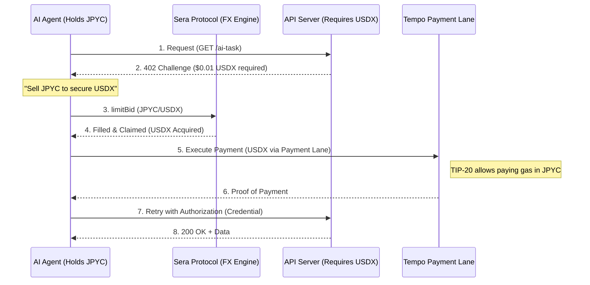

:::message
This article was written in collaboration with AI!
:::

# Introduction

Hello everyone!

In our ongoing series exploring **Sera Protocol**, we've built MCP servers and even developed a specialized [Agent SKILL](https://zenn.dev/mashharuki/articles/web3_sera_protocol-7).

Today, we're diving into a fascinating concept: the synergy between Sera Protocol and the recently announced **Machine Payments Protocol (MPP)** from Stripe and Tempo!

https://zenn.dev/mashharuki/articles/mpp-machine-payments-protocol

MPP has finally given AI the "hands to pay." However, the moment they cross borders, they hit a hard reality: the **"Currency Wall."** Let's explore how Sera Protocol smashes this barrier.

# 1. The "Exchange Wall" Facing AI Agents

MPP (Machine Payments Protocol) brings HTTP 402 "Payment Required" to life after 20 years, allowing AI to discover, negotiate, and settle payments in a single request.

But in practice, we encounter this tragic scenario:

-   **API Server (USA):**  
    "This image generation costs **$0.01 USDX** (USD Stablecoin)."
-   **AI Agent (Japan):**  
    "I only have **JPYC** (Japanese Yen Stablecoin)..."

For humans, credit cards handle this behind the scenes. For an autonomous AI agent, this currency mismatch means **"Service Unavailable."**

In the machine world, someone must act as an instant, on-chain middleman. This is the necessity of **"OnChain FX"** for machines.

# 2. The Tempo L1 "Highway" and Sera's "Gasoline"

According to the Tempo official documentation ([OnChain FX](https://docs.tempo.xyz/learn/tempo/fx#onchain-fx)), their goal is to eliminate the "Stablecoin Sandwich."

Traditional cross-border payments often look like "Local Currency → USD Stablecoin → Local Currency," relying on off-chain banks and exchanges that are slow and expensive.

This is where the synergy between **Tempo L1** and **Sera Protocol** explodes.

### Tempo L1's "Payment Lanes"
Tempo features dedicated block space called **"Payment Lanes."** Even if a sudden NFT minting craze spikes gas fees elsewhere, payment traffic glides through at 0.1 cents, completely unaffected.

### TIP-20 "Multi-Currency Fees"
The genius of Tempo’s **TIP-20** token standard is that **"you can pay gas fees in any stablecoin—USDX, JPYC, you name it."** Agents don't need to hold a separate native token (like ETH) just for gas.

On this "payment-optimized highway," Sera Protocol acts as the **engine that atomically bridges different currencies.**

# 3. Why AI Agents Need a Central Limit Order Book (CLOB)

You might wonder, "Why not just use an AMM like Uniswap?" For an AI agent, an AMM is often a **"bundle of uncertainty."**

1.  **"Rational" Limit Orders:**  
    AI operates on logic. It dislikes the "luck-based" slippage of AMMs. With Sera, an agent can make **autonomous decisions**: "I will buy at this rate; otherwise, I will wait."
2.  **The Magic of Index Management:**  
    Sera’s Arithmetic Price Model manages prices using `uint16` indices. For an AI, these are easy-to-process "numeric values," allowing for lightning-fast arbitrage and price comparisons across multiple markets.
3.  **Rights Transfer via Order NFTs:**  
    Sera orders are NFTs. Instead of sending the exchanged USDX itself, an AI could transfer the "right to the completed exchange (the NFT)" directly to the service provider, enabling next-generation payment flows.

# 4. Synergy Breakdown: The MPP + Sera Atomic Flow

When an AI agent combines Sera and MPP for cross-border payments, the concept of "going to an exchange" disappears. Instead, **"currency exchange becomes a seamless step within the payment process."**



With this flow, the AI can **buy resources worldwide without even caring which currency it holds.**

# 5. Implementation Concept: Autonomous Exchange & Payment Logic

If you are giving your AI "hands and feet" using an [MCP Server](https://zenn.dev/mashharuki/articles/web3_sera_protocol-6), the code becomes surprisingly simple.

```typescript
// Internal logic for an AI agent receiving a 402 Challenge
async function onPaymentRequired(challenge: MPPChallenge) {
  const { amount: usdAmount, currency } = challenge; // 0.01 USDX
  
  // 1. Check the rate until satisfied
  const bestRate = await sera.getBestPrice('JPYC/USDX');
  if (bestRate > MY_ACCEPTABLE_LIMIT) {
    throw new Error("Exchange rate is too poor; aborting purchase for now.");
  }

  // 2. Exchange exactly what is needed
  // Sera's Index-based precision handles fractions like 10.5 JPYC perfectly
  const tx = await sera.swapAndClaim({
    from: 'JPYC',
    to: 'USDX',
    amount: usdAmount,
    index: bestRate
  });

  // 3. Pay immediately with the secured USDX
  return await mpp.pay(challenge, {
    useToken: 'USDX',
    gasToken: 'JPYC' // The power of Tempo!
  });
}
```

The AI optimizes which currency to use and which currency to pay fees with based on real-time rates. This is the true face of the **"Programmable Economy"** built by Stripe and Sera.

# The Dawn of the Machine Economy is Here.

I’ve previously introduced Sera Protocol as a "new DEX," but seeing it paired with Tempo MPP reveals its full silhouette.

Sera is the **"Currency Translator" for the Machine Economy.**

With the payment network expanded by Stripe, the highway paved by Tempo, and the "shape of currency" refined by Sera Protocol, AI agents are finally ready to roam the world freely.

As an evangelist, I’m excited to implement this future with all of you. I look forward to showcasing a "Self-Exchanging Payment Agent" at an upcoming hackathon.

Why not empower your AI with Sera—the ultimate money changer?

--- 

**References:**
- [Tempo Docs: Onchain FX](https://docs.tempo.xyz/learn/tempo/fx#onchain-fx)
- [Stripe Blog: Machine Payments Protocol](https://stripe.com/blog/machine-payments-protocol)
- [Sera Protocol Official Documentation](https://docs.sera.cx/)
- [Series: Deep Dive into Sera Protocol](https://zenn.dev/mashharuki)
