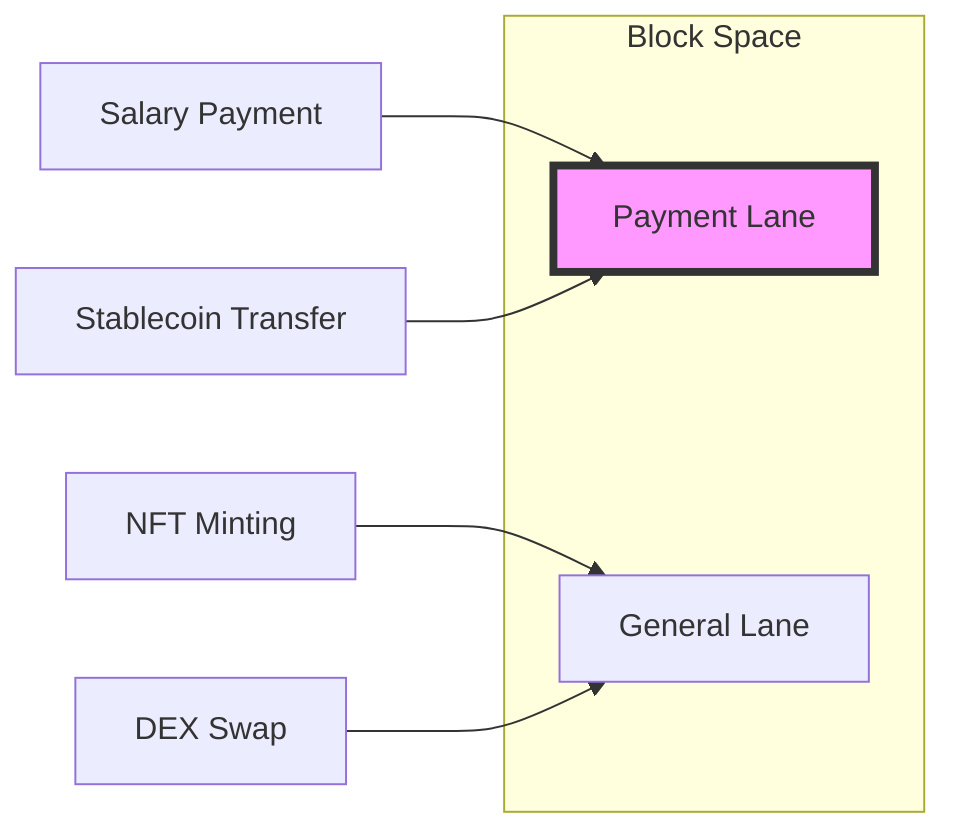
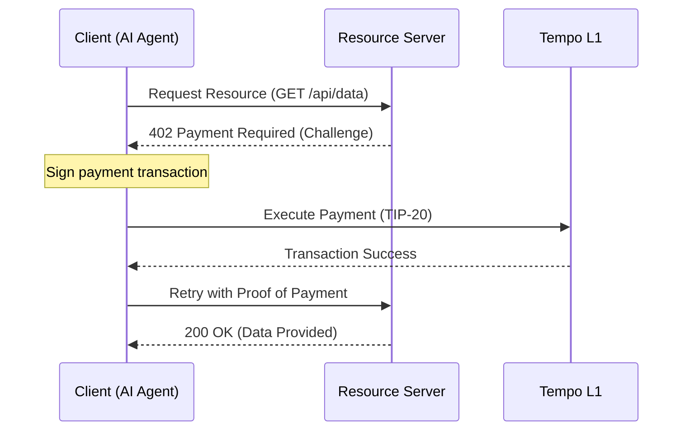

> This article was written in collaboration with AI!

# Introduction

Hello everyone!

**Stripe**, a giant in the financial industry, has launched its own L1 blockchain, **Tempo**, on the mainnet. This has sent shockwaves not only through the Web3 community but also the existing fintech industry!


Actually, **Stripe** has been steadily preparing to step into this field by acquiring **privy**, a crypto wallet provider, and organizing sessions themed around stablecoins at their events.

https://privy.io/blog/announcing-our-acquisition-by-stripe

https://stripe.com/jp/newsroom/news/tour-newyork-2025

Honestly, when I first heard that Stripe was building a blockchain, I thought, "Another one?..." However, after diving into Tempo's technical documentation, I discovered that it takes a unique approach quite different from other blockchains!

In this article, I will thoroughly analyze Tempo from an engineer's perspective, covering everything from its overview to its unique payment-focused features and its relationship with the new **MPP** standard designed for the AI agent era.

Please read on until the end!

# 1. What is Tempo?: L1 Redefined for Payments

**Tempo** is a general-purpose blockchain optimized to achieve stablecoin payments with instant, deterministic finality and predictable, low-cost fees.

https://docs.tempo.xyz/learn/tempo

The biggest technical highlight is that it is built on the **"Reth SDK"**, which is currently the highest-performance EVM execution client.

https://docs.tempo.xyz/learn/tempo/performance

### Key Specs

- **Consensus:** Simplex BFT (extremely short block time of approximately 0.5 seconds)
- **Performance:** Recorded over 20,000 TPS on the testnet
- **Compatibility:** [Full EVM Compatibility](https://docs.tempo.xyz/quickstart/evm-compatibility) (Solidity and Foundry can be used as-is)

https://docs.tempo.xyz/quickstart/evm-compatibility

It's not just about speed. It aims to solve fatal payment issues inherent in traditional blockchains, such as gas fees skyrocketing due to NFT minting frenzies, which can delay salary payments, right at the protocol level.

# 2. Three Unique Features Solving Payment "Pain Points"

Tempo comes "standard" with features essential for payment operations that traditional ERC-20 or Ethereum lacked.

https://docs.tempo.xyz/learn/tempo/native-stablecoins

## ① Payment Lanes
To protect payments from transaction congestion caused by DeFi activities or complex smart contracts, Tempo reserves **"dedicated block space"** at the protocol level.

https://docs.tempo.xyz/protocol/blockspace/payment-lane-specification



This ensures that payments can be executed at an extremely low cost, targeting **0.1 cents** per transaction, regardless of market turmoil. This payment-centric design is what sets it apart from other blockchains.

## ② TIP-20 Token Standard

**TIP-20** is Tempo's native standard that extends the traditional ERC-20.

https://docs.tempo.xyz/protocol/tip20/overview

- **Transfer Memos (32 bytes):** 
    Allows attaching reference data to transactions. By recording invoice numbers or customer IDs, automatic reconciliation with backend systems becomes possible. ([Transfer Memos Guide](https://docs.tempo.xyz/guide/payments/transfer-memos))
- **Choice of Fee Token:**  
    Incredibly, you can **pay gas fees directly in USD-pegged stablecoins**. Users do not need to hold separate native tokens. ([Pay Fees in Stablecoins](https://docs.tempo.xyz/guide/payments/pay-fees-in-any-stablecoin))

## ③ Modern Transaction Structure

By adopting EIP-2718, it natively supports features that required third-party middleware on other chains.

https://docs.tempo.xyz/learn/tempo/modern-transactions

- **Passkey Authentication:**   
    Sign using Face ID or fingerprint. ([Embed Passkeys Guide](https://docs.tempo.xyz/guide/use-accounts/embed-passkeys))
- **Gas Fee Sponsorship:**  
    Apps can cover fees on behalf of users. ([Sponsor User Fees Guide](https://docs.tempo.xyz/guide/payments/sponsor-user-fees))
- **Parallel Transactions:**  
    Allows sending multiple transactions simultaneously via "timed nonces." ([Send Parallel Transactions](https://docs.tempo.xyz/guide/payments/send-parallel-transactions))

Since they acquired **privy**, the UI/UX around wallets is excellent! Although it's a latecomer blockchain, you can feel that they have thoroughly studied preceding projects.

# 3. The New Standard for Compliance: TIP-403

Regulatory compliance is unavoidable in payments. Tempo provides its own solution here as well.

That is **TIP-403 (Policy Registry)**.

https://docs.tempo.xyz/protocol/tip403/overview

Normally, when issuing multiple stablecoins, you need to manage blacklists and other policies within each individual contract. However, with TIP-403, once you create a **"Policy," it can be shared across multiple tokens**.

For example, if a specific address needs to be restricted, updating the policy registry once immediately applies the rule to all TIP-20 tokens referencing that policy. This operational efficiency is a design only Stripe, who knows the practicalities of the business, could achieve.

# 4. Relationship with x402 / MPP: Infrastructure for the Machine Economy

This is the most exciting part where Tempo shows great promise.

Stripe and Tempo have jointly formulated an open standard called the **Machine Payments Protocol (MPP)**.

https://docs.tempo.xyz/learn/tempo/machine-payments

This protocol, also known as "x402" in the Web3 industry, leverages the HTTP 402 "Payment Required" status code to enable **autonomous payments between AI agents and apps**.



Tempo acts as the **"Stablecoin Rail"** in this MPP, functioning as a wallet for machines. A future where AI agents pay autonomously for each API call is just around the corner.

# 5. Get Started Now: Sending Payments with Tempo SDK

For those wondering **"I get the theory, but how do I run it?"**, here is a minimal implementation example using the TypeScript SDK.

https://docs.tempo.xyz/sdk/typescript

```typescript
import { TempoClient, Wallet } from '@tempoxyz/sdk';

const client = new TempoClient('https://rpc.tempo.xyz');
// Obtain the private key from Metamask or similar
const wallet = new Wallet(process.env.PRIVATE_KEY!);

// Transferring stablecoins (with a memo)
const tx = await client.transfer({
  to: '0x...', // Specify any address
  amount: '10.00',
  token: 'USDX', // TIP-20
  memo: 'INV-2026-001', // 32-byte transfer memo
});

console.log(`Payment Sent: ${tx.hash}`);
```

With just this, you can try out stablecoin payments! This ease of development—operating Web3 with the intuition of traditional Web2—is the true essence of Tempo!

Amazing!!

# Conclusion

The reason Stripe created Tempo isn't just to enter the Web3 space. They are aiming to build the **infrastructure for a "programmable economy" itself**.

From a developer's perspective:

- Passkey authentication
- Stablecoin native
- Paying gas fees in stablecoins
- And autonomous machine payments via MPP

With all these elements in place, the user experience becomes incomparably smoother than traditional blockchains!

It is truly the beginning of a **"next-generation payment experience where you don't even have to be aware of the blockchain."**

That's all for now! Thank you for reading!

--- 

**References:**
- [Tempo Docs: Learn](https://docs.tempo.xyz/learn)
- [Modern Transactions on Tempo](https://docs.tempo.xyz/learn/tempo/modern-transactions)
- [Machine Payments Protocol Specification](https://docs.tempo.xyz/protocol/machine-payments)
- [TIP-20: Native Stablecoins](https://docs.tempo.xyz/protocol/tip20/overview)
