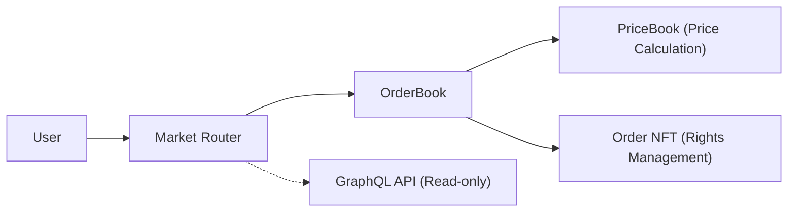
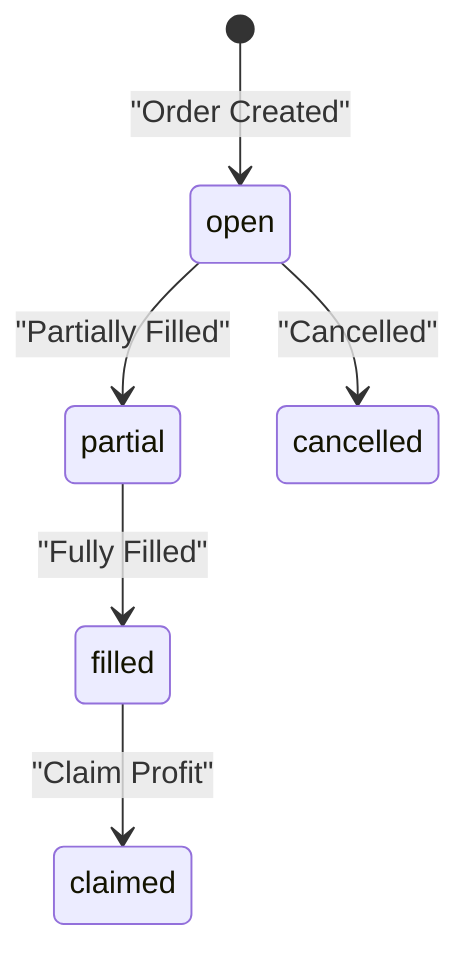

# 1. Introduction: The "Limits" of Existing DEXs in FX Settlement

In the current DeFi (Decentralized Finance) landscape, AMMs (Automated Market Makers) like Uniswap are the dominant force.

However, for "stablecoin-to-stablecoin swaps (on-chain FX)" such as USDC and JPYC, AMMs are not necessarily the optimal solution.

This is where **Sera Protocol** comes in.


### 1.1 Why is Uniswap (AMM) Not Enough?

The foundational `$x 	imes y = k$` model of AMMs is excellent for "price discovery" of unknown assets. However, for stablecoins, the price is already determined in off-chain fiat markets.

Existing AMMs face three major challenges:

1.  **Slippage**: Prices become increasingly unfavorable as trading volume grows.
2.  **Impermanent Loss**: Liquidity providers are constantly exposed to risk.
3.  **Capital Efficiency**: Liquidity must be "locked away" in pools, leading to underutilization.

### 1.2 The Challenge of Sera Protocol

Sera Protocol is a **fully on-chain Central Limit Order Book (CLOB)** currently operating on the Ethereum Sepolia testnet.

Based on the philosophy that "price discovery is unnecessary for FX where prices are already fixed," Sera achieves high-efficiency board trading similar to Traditional Finance (TradFi).

In this article, we will dissect the technical background of how Sera minimizes gas costs while achieving highly efficient on-chain FX settlements.

# 2. Core Architecture of Sera Protocol

Sera adopts a highly modular design where multiple specialized smart contracts work in coordination.

### 2.1 Component Structure

The roles of the main components are as follows:

- **Market Router**: The main entry point for direct user interaction.
- **OrderBook**: Responsible for order matching and settlement for each pair.
- **PriceBook**: Handles Sera's unique "Arithmetic Price Model."
- **Order NFT**: Represents each order as an NFT to manage ownership.



### 2.2 The Magic of the Arithmetic Price Book

The biggest hurdle for on-chain order book trading is "gas fees."

Sera solves this by managing prices as **indices** from 0 to 65,535 (`uint16`) instead of raw `uint256` values.

**Price Calculation Formula:**
$$Price = minPrice + (priceIndex 	imes tickSpace)$$

- `minPrice`: The minimum supported price in the market.
- `tickSpace`: The step size between each price index (Tick spacing).

This mechanism significantly reduces storage costs while allowing for precise price setting.

### 2.3 Order NFT: The Composability of Orders

When you place a limit order on Sera, an **NFT** representing the rights to that order is issued.
This enables advanced use cases such as:

- Transferring the rights of an order to another party.
- Using the order itself as collateral to borrow other assets.
- Allowing AI agents to manage orders programmatically.

# 3. Implementation Guide: A Developer's Practice in "Calling" Sera

Developers use high-speed **GraphQL** for reading data and **smart contracts** for changing state (executing orders).

### 3.1 Reading Data (Read): Leveraging GraphQL

To retrieve the depth of the order book, use the API powered by Goldsky. It incurs no gas fees and provides responses at near-real-time speeds.

```graphql
query GetDepth($market: String!) {
  # Retrieve Buy Orders (Bids)
  bids: depths(
    where: { market: $market, isBid: true, rawAmount_gt: "0" },
    orderBy: priceIndex,
    orderDirection: desc,
    first: 10
  ) {
    priceIndex
    price
    rawAmount
  }
}
```

### 3.2 Executing Orders (Write): Calling the Market Router

Here is a snippet of the Solidity function signature for placing a limit bid.

```json
{
  "name": "limitBid",
  "inputs": [{
    "name": "params",
    "type": "tuple",
    "components": [
      { "name": "market", "type": "address" },
      { "name": "priceIndex", "type": "uint16" },
      { "name": "rawAmount", "type": "uint64" },
      { "name": "postOnly", "type": "bool" }
      // ... other parameters
    ]
  }]
}
```

### 3.3 The Order Lifecycle

An order goes through the following transitions.
Note the mechanism where users must manually "Claim" their profits after a fill.



# 4. Future Outlook: Japan Regulations x AI Agents x Stablecoins

Sera Protocol holds potential far beyond being just a DEX.

### 4.1 A Hub for Stablecoins in Japan

In Japan, the adoption of fiat-backed stablecoins like JPYC is accelerating due to the revised Payment Services Act.

Sera provides **zero-slippage** settlement for pairs like JPYC/USDC, making it a powerful infrastructure for Japanese subsidiaries of global corporations and Fintech companies engaged in cross-border payments.

### 4.2 Payments with Intent: The AI Agent Era

In the future, we will see a world where AI agents hold wallets and conduct transactions autonomously.

Sera's Order NFT and GraphQL API provide the ideal playground for agents to "automatically complete FX settlements at the most favorable rates."

# 5. Conclusion: The Last Mile of On-Chain Finance

Sera Protocol has broken through the limits of AMMs using a traditional yet innovative approach: the **Arithmetic Price Model** and **CLOB**.

**Summary of this article:**

1. **Zero Slippage**: Limit orders provide the certainty essential for FX settlements.
2. **Gas Optimization**: `uint16` index management reduces the cost of on-chain order books.
3. **Powerful API**: GraphQL offers an engineer-friendly development environment.

Currently, Sera Protocol is running on the **Ethereum Sepolia testnet**.

Test users are distributed 10 million test stablecoins, so you can experience its capital efficiency right now.

### Reference Materials

- [Sera Protocol Official Documentation](https://docs.sera.cx/)
- [Sera App (Sepolia Testnet)](https://testnet.sera.cx/)
