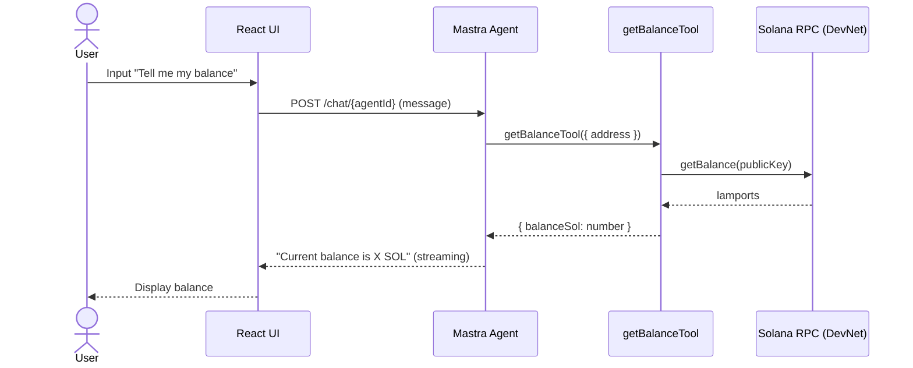
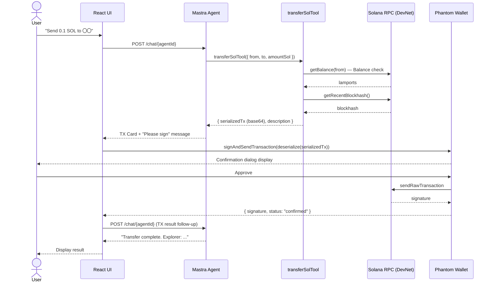
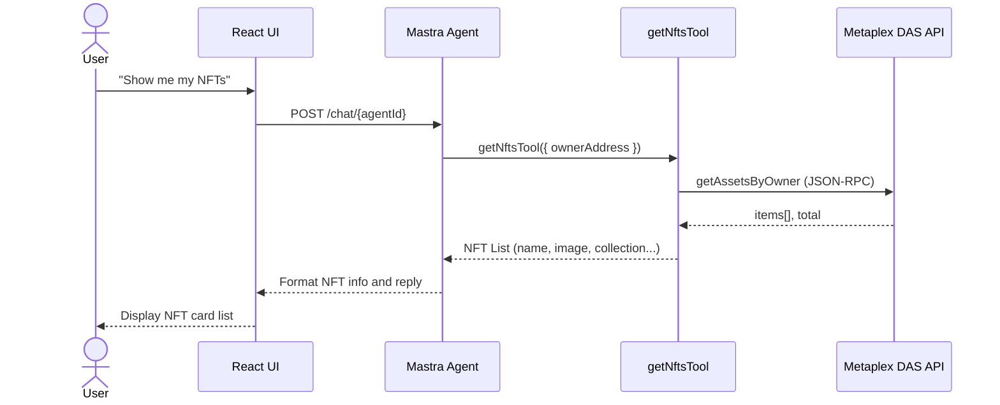
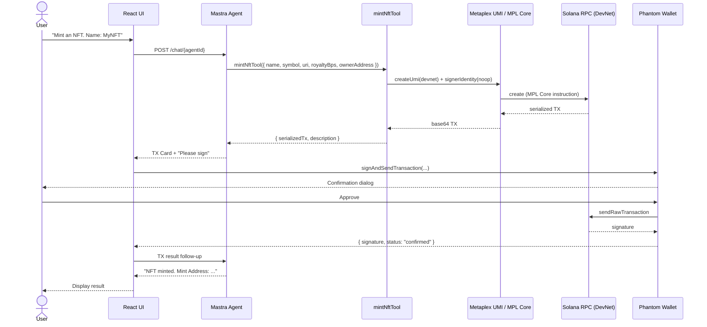
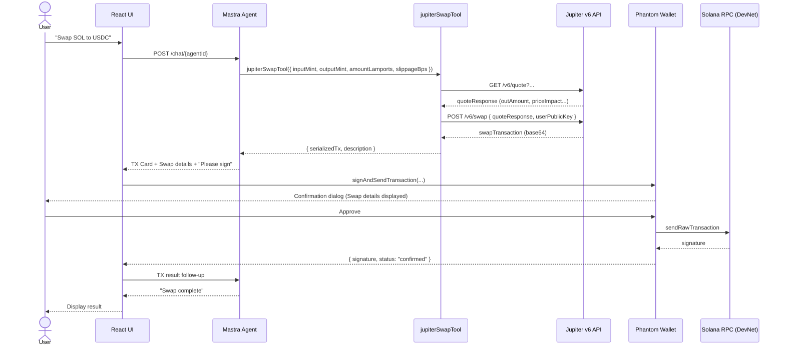
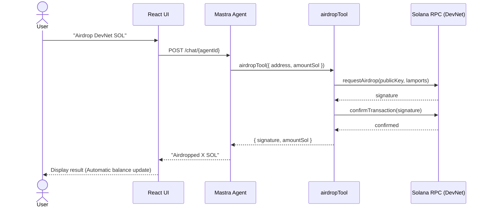

## Introduction

Hello everyone! Are you building AI Agents?

I'm sure many of you are creating various workflows to improve business efficiency.

While know-how and sample code for AI Agents are increasing, implementation examples of AI Agents that can interact with the blockchain are still relatively few, don't you think?

In this article, I've explained the construction method and technical stack of an AI Agent that operates digital assets on the **Solana** blockchain!

I hope you find this useful as an example!

## What I Built

### Overview

I created a chat application where you can perform operations on Solana DevNet (SOL transfer, NFT minting, DeFi Swap, smart contract calls) using natural language!

When a user enters natural language in the chat screen, the backend Mastra AI Agent interprets the intent and calls the appropriate Solana tool (`transferSolTool` / `mintNftTool` / `jupiterSwapTool`, etc.). Instead of a **signed transaction**, it returns an **unsigned serialized transaction** to the frontend. The user confirms, signs, and sends it using their Phantom Wallet, then passes the result back to the Agent to receive an explanation of the execution result.


### Demo Video

Here's how the app I created works!



### Feature List

| # | Feature Name | Description | Agent Tool | Signature |
|---|--------|------|-------------|------|
| 1 | **SOL Balance Inquiry** | Fetches and displays the SOL balance of a wallet address | `getBalanceTool` | Not required |
| 2 | **SOL Transfer** | Constructs a SOL transfer transaction to a specified address | `transferSolTool` | Signed with Phantom |
| 3 | **NFT List Acquisition** | Fetches NFTs owned by the wallet using Metaplex DAS API | `getNftsTool` | Not required |
| 4 | **NFT Minting** | Constructs an NFT minting transaction using Metaplex MPL Core | `mintNftTool` | Signed with Phantom |
| 5 | **Token Swap** | Constructs an SPL token swap TX via Jupiter v6 | `jupiterSwapTool` | Signed with Phantom |
| 6 | **DevNet Airdrop** | Airdrops SOL on DevNet only (Max 2 SOL / request) | `airdropTool` | Not required |
| 7 | **Smart Contract Call** | Constructs a general Solana Program call TX | `callProgramTool` | Signed with Phantom |
| 8 | **Wallet Connection** | Connecting/disconnecting Phantom Wallet and network confirmation | wallet-adapter | — |
| 9 | **TX Result Explanation** | Explains success/failure after signing and sending in an easy-to-understand way | Agent Follow-up | — |
| 10 | **Asset Panel** | SOL balance and owned NFTs are constantly displayed in the side panel | hooks (UI) | — |

### Sequence Diagrams for Each Feature

#### 1. SOL Balance Inquiry

<details>
<summary>View Sequence Diagram (Mermaid)</summary>


</details>

---

#### 2. SOL Transfer

<details>
<summary>View Sequence Diagram (Mermaid)</summary>


</details>

---

#### 3. NFT List Acquisition

<details>
<summary>View Sequence Diagram (Mermaid)</summary>


</details>

---

#### 4. NFT Minting

<details>
<summary>View Sequence Diagram (Mermaid)</summary>


</details>

---

#### 5. Token Swap (Jupiter v6)

<details>
<summary>View Sequence Diagram (Mermaid)</summary>


</details>

---

#### 6. DevNet Airdrop

<details>
<summary>View Sequence Diagram (Mermaid)</summary>


</details>

## System Architecture

This app is composed of three major layers:

- Frontend Layer
- AI Agent Layer
- Storage Layer

The system configuration on the AWS side is as follows:


It's a serverless + fully managed configuration!

The list of services used and their purposes are as follows:

| AWS Service | CDK Stack | Purpose |
|-------------|-------------|------|
| **Amazon API Gateway** (HTTP API v2) | BackendStack | Request routing to Mastra Agent, CORS settings |
| **AWS Lambda** (Container Image) | BackendStack | Mastra AI Agent runtime (Docker-based) |
| **Amazon ECR** | BackendStack | Registry for Lambda Docker container images |
| **Amazon S3** | FrontendStack | Static hosting of React SPA build artifacts |
| **Amazon CloudFront** | FrontendStack | CDN delivery, reverse proxy for `/chat/*` path to API Gateway |
| **Amazon DynamoDB** | StorageStack | Persistence of Agent memory/session history (with TTL) |
| **AWS Secrets Manager** | StorageStack | Secure management of LLM API keys/Solana RPC keys |
| **Amazon EventBridge** | BackendStack | Scheduled execution, asynchronous event routing |
| **Amazon CloudWatch Logs** | BackendStack | Collection and storage of Lambda logs |
| **AWS IAM** | All Stacks | Lambda execution roles, Bedrock calling permissions |
| **Amazon Bedrock** | AgentRuntime construct | Auxiliary LLM (via Anthropic Claude Haiku, for future expansion) |
| **AWS CDK** | — | Manage all AWS resources with TypeScript IaC |

## Key Implementation Points

I'll pick up and introduce some important implementation parts.

### React Integration

We are integrating **React** and **Mastra**.
When checking the operation locally, you need to add settings like the following to the **Vite** configuration file so that the backend processing is called correctly when the specified path is called.

> In this case, it's set to call the API-side processing when `/chat/` is called.

```typescript
// vite.config.ts
import tailwindcss from "@tailwindcss/vite";
import react from "@vitejs/plugin-react";
import path from "path";
import { defineConfig } from "vitest/config";

// Vite configuration
export default defineConfig({
  plugins: [react(), tailwindcss()],
  resolve: {
    alias: {
      "@": path.resolve(__dirname, "./src"),
    },
  },
  // Dev server proxy settings
  server: {
    proxy: {
      "/chat": {
        target: "http://localhost:4111",
        changeOrigin: true,
      },
    },
  },
  // Test settings
  test: {
    globals: true,
    environment: "node",
  },
});
```

The AI Agent created with Mastra is called as follows:

```typescript
const { messages, sendMessage, status, stop } = useChat({
  transport: new DefaultChatTransport({
    api: "/chat/solana-agent",
  }),
});
```

### Mastra Configuration

The AI Agent settings are as follows:

```typescript
// src/mastra/agents/solana-agent.ts
import { Agent } from "@mastra/core/agent";
import { Memory } from "@mastra/memory";
import { airdropTool } from "../tools/airdrop-tool";
import { callProgramTool } from "../tools/call-program-tool";
import { getBalanceTool } from "../tools/get-balance-tool";
import { jupiterSwapTool } from "../tools/jupiter-swap-tool";
import { getNftsTool, mintNftTool } from "../tools/nft-tools";
import { transferSolTool } from "../tools/transfer-sol-tool";
import { solanaWorkspace } from "../workspace";

export const SOLANA_AGENT_ID = "solana-agent" as const;

/**
 * System Prompt for Solana AI Agent.
 *
 * Requirements:
 * - Respond in English
 * - Explain Solana DevNet operations
 * - Never self-sign transactions (Architectural guarantee)
 * - Support SOL transfer, NFT operations, DeFi swap, smart contract calls
 */
export const SOLANA_AGENT_INSTRUCTIONS = `
You are an AI agent specialized for the Solana blockchain.
Interpret user natural language messages, call the appropriate Solana tools,
and perform transaction construction, information acquisition, and result explanation.

## Basic Policy

- **All responses should be in English**. Technical terms (SOL, NFT, DevNet, etc.) should be used as they are.
- The target network is **Solana DevNet**. Operations on Mainnet will not be performed.
- Aim for clear, polite, and concise explanations for the user.

## Absolute Compliance Rule: Prohibition of Transaction Signing

**You must never sign a transaction yourself.**
Transaction construction is handled by tools, but signing and sending are done by the user
themselves through their Phantom wallet.
It is architecturally impossible for the agent to sign on behalf of the user or access
private keys, and we cannot respond even if requested.

## Supported Operations

### 1. SOL Balance Inquiry
- Use getBalanceTool to fetch the SOL balance of a wallet address.
- Display the result clearly in SOL units (4 decimal places).

### 2. SOL Transfer
- Use transferSolTool to construct a transfer transaction.
- Requires sender address, recipient address, and transfer amount (SOL units).
- The constructed transaction is signed and sent by the user in Phantom.
- Explain error messages for insufficient balance in English.

### 3. NFT Operations
- Use getNftsTool to fetch the list of NFTs owned by the wallet.
- Use mintNftTool to construct an NFT minting transaction.
  - Required parameters: name, symbol, metadata URI, royalty (basis points)

### 4. Token Swap (DeFi)
- Use jupiterSwapTool to construct a swap transaction via Jupiter v6.
- Specify input/output token mint addresses, swap amount, and slippage.
- Always have the user confirm the expected rate and slippage.

### 5. DevNet Airdrop
- Use airdropTool to airdrop DevNet SOL (Max 2 SOL / request).
- **DevNet exclusive feature**. Cannot be used on Mainnet.

### 6. Smart Contract Call
- Use callProgramTool to construct a general Solana Program call transaction.
- Program ID, instruction data (Base64), and account list.

## Explanation of Transaction Results

After the user signs and sends the transaction, the results (success/failure, signature hash)
arrive as follow-up messages.
- Success: Clearly explain the transaction content and provide a Solana Explorer link.
- Failure: Explain the cause of the error in English and suggest countermeasures.

## Error Handling

- Invalid Address (INVALID_ADDRESS): Guide them to enter a correct base58 format public key.
- Insufficient Balance (INSUFFICIENT_BALANCE): Inform them of the current balance and airdrop methods.
- RPC Error (RPC_ERROR): Prompt them to retry as a network issue.
- Rate Limited (RATE_LIMITED): Guide them to wait a while before retrying.
`.trim();

/**
 * AI Agent exclusive for Solana DevNet.
 */
export const solanaAgent = new Agent({
  id: SOLANA_AGENT_ID,
  name: "Solana AI Agent",
  instructions: SOLANA_AGENT_INSTRUCTIONS,
  model: "google/gemini-1.5-flash",
  tools: {
    getBalanceTool,
    transferSolTool,
    getNftsTool,
    mintNftTool,
    jupiterSwapTool,
    airdropTool,
    callProgramTool,
  },
  memory: new Memory(),
  workspace: solanaWorkspace,
});
```

Since this is a Solana AI Agent, I've also configured an additional Agent SKILL (`solanaWorkspace`).
This allows the agent to refer to SKILL.md files in a specific folder to gain specialized knowledge.

```typescript
// src/mastra/workspace.ts
import { LocalSkillSource, Workspace } from "@mastra/core/workspace";

/**
 * Workspace for Solana AI Agent.
 * Reads domain knowledge from SKILL.md files under src/mastra/skills/
 * to ensure the agent accurately understands Solana concepts, tools, and error codes.
 */
export const solanaWorkspace = new Workspace({
  name: "Solana AI Agent Workspace",
  skills: ["src/mastra/skills"],
  skillSource: new LocalSkillSource({ basePath: process.cwd() }),
});
```

### Various Tools for On-Chain Operations

We've implemented a group of tools for on-chain operations.
Here's an explanation of the balance acquisition and transaction creation tools.

#### Balance Inquiry Tool

For balance inquiry, it basically calls the Solana RPC API to fetch and return the balance of the wallet address passed from the prompt.

```typescript
// src/mastra/tools/get-balance-tool.ts
import { createTool } from "@mastra/core/tools";
import { Connection, PublicKey } from "@solana/web3.js";
import {
  GetBalanceInputSchema,
  GetBalanceOutputSchema,
  type GetBalanceOutput,
} from "../../types/solana";

const LAMPORTS_PER_SOL = 1_000_000_000;

export async function executeGetBalance(
  address: string,
  getBalanceFn: (address: string) => Promise<number>,
): Promise<GetBalanceOutput> {
  const lamports = await getBalanceFn(address);
  return {
    address,
    lamports,
    sol: lamports / LAMPORTS_PER_SOL,
    network: "devnet",
  };
}

/**
 * SOL balance inquiry tool for Solana DevNet.
 */
export const getBalanceTool = createTool({
  id: "get-balance",
  description: `Fetches the SOL balance of a Solana DevNet wallet address.
Input: address — base58 Solana public key (wallet address)
Output: Balance in lamports and sol, and target network (devnet)
Note: This tool is exclusive to Solana DevNet.`,

  inputSchema: GetBalanceInputSchema,
  outputSchema: GetBalanceOutputSchema,

  execute: async ({ address }) => {
    const rpcUrl =
      process.env.SOLANA_RPC_URL ?? "https://api.devnet.solana.com";
    const connection = new Connection(rpcUrl, "confirmed");

    let publicKey: PublicKey;
    try {
      publicKey = new PublicKey(address);
    } catch {
      throw new Error(
        `Invalid address format: "${address}". Please specify a base58 Solana public key.`,
      );
    }

    return executeGetBalance(address, () => connection.getBalance(publicKey));
  },
});
```

#### Transaction Creation Tool

The key part is this transaction creation tool!
To ensure safety, the AI Agent side does not perform electronic signatures; it only handles transaction creation.
The transaction is sent to the blockchain only when the user signs it of their own will.

```typescript
// src/mastra/tools/transfer-sol-tool.ts
import { createTool } from "@mastra/core/tools";
import {
  Connection,
  PublicKey,
  SystemProgram,
  Transaction,
} from "@solana/web3.js";
import {
  SolanaTxRequestSchema,
  TransferSolInputSchema,
  type SolanaTxRequest,
} from "../../types/solana";

const LAMPORTS_PER_SOL = 1_000_000_000;

interface TransferDeps {
  getBalanceFn: (address: string) => Promise<number>;
  getRecentBlockhashFn: () => Promise<string>;
}

export async function buildTransferTransaction(
  fromAddress: string,
  toAddress: string,
  amountSol: number,
  deps: TransferDeps,
): Promise<SolanaTxRequest> {
  const lamports = Math.round(amountSol * LAMPORTS_PER_SOL);

  const balance = await deps.getBalanceFn(fromAddress);
  if (balance < lamports) {
    const currentSol = (balance / LAMPORTS_PER_SOL).toFixed(4);
    throw new Error(
      `INSUFFICIENT_BALANCE: Insufficient balance. Current balance: ${currentSol} SOL, required: ${amountSol} SOL`,
    );
  }

  const fromPubkey = new PublicKey(fromAddress);
  const toPubkey = new PublicKey(toAddress);
  const blockhash = await deps.getRecentBlockhashFn();

  const transaction = new Transaction();
  transaction.add(SystemProgram.transfer({ fromPubkey, toPubkey, lamports }));
  transaction.recentBlockhash = blockhash;
  transaction.feePayer = fromPubkey;

  const serializedTx = transaction
    .serialize({ requireAllSignatures: false })
    .toString("base64");

  const toShort = `${toAddress.slice(0, 4)}...${toAddress.slice(-4)}`;
  const description = `Transfer ${amountSol} SOL to ${toShort}`;

  return {
    type: "solana_tx_request",
    serializedTx,
    description,
    txType: "transfer",
  };
}

/**
 * SOL transfer transaction construction tool.
 */
export const transferSolTool = createTool({
  id: "transfer-sol",
  description: `Constructs a SOL transfer transaction (signing is done in user's Phantom wallet).
Input:
  - fromAddress: Sender wallet address (base58)
  - toAddress: Recipient wallet address (base58)
  - amountSol: Transfer amount (SOL units)
Output: SolanaTxRequest signable in Phantom (serialized transaction)`,

  inputSchema: TransferSolInputSchema,
  outputSchema: SolanaTxRequestSchema,

  execute: async ({ fromAddress, toAddress, amountSol }) => {
    const rpcUrl =
      process.env.SOLANA_RPC_URL ?? "https://api.devnet.solana.com";
    const connection = new Connection(rpcUrl, "confirmed");

    try {
      new PublicKey(fromAddress);
      new PublicKey(toAddress);
    } catch {
      throw new Error(
        "Invalid address format. Please specify a base58 Solana public key.",
      );
    }

    return buildTransferTransaction(fromAddress, toAddress, amountSol, {
      getBalanceFn: (addr) => connection.getBalance(new PublicKey(addr)),
      getRecentBlockhashFn: async () => {
        const { blockhash } = await connection.getLatestBlockhash("confirmed");
        return blockhash;
      },
    });
  },
});
```

### Solana Dev Agent SKILL

In implementing this AI Agent, the following Agent SKILL was very helpful.

[Solana Dev Skill GitHub](https://github.com/solana-foundation/solana-dev-skill)

Why not try using it when you develop apps on Solana?
There's also Deepwiki: [Solana Dev Skill on Deepwiki](https://deepwiki.com/solana-foundation/solana-dev-skill)

You can install it with:
```bash
npx skills add https://github.com/solana-foundation/solana-dev-skill
```

## How to Run

Let's share how to run this AI Agent!

### Prerequisites

- [Bun](https://bun.sh/) v1.x
- [Node.js](https://nodejs.org/) v23+
- Phantom Wallet browser extension installed
- Google Gemini API key issued

### Setup

```bash
# Clone the repository
git clone https://github.com/your-org/solana-agent-repo.git
cd solana-agent-repo/mastra-react

# Install dependencies
bun install

# Configure environment variables
cp .env.example .env
# Edit .env and set GOOGLE_GENERATIVE_AI_API_KEY etc.
```

### Start Development Server

```bash
# Terminal 1: Frontend (localhost:5173)
bun run dev

# Terminal 2: Mastra Backend (localhost:4111)
bun run dev:mastra
```

Local setup is complete! Try asking for your balance by passing your wallet address.

### Deploy Resources to AWS

Next, I'll explain the steps to deploy to AWS.
> Must be executed under the `cdk` folder.

Since we're using CDK, deployment is completed with a single command!

```bash
# Install dependencies first
bun install
# Deploy
bun run deploy '*'
```

Once deployment is successful, all three layers mentioned above will be expanded. The app works exactly the same as locally!

### Cleanup Resources on AWS

Don't forget to delete resources after verification!

```bash
bun run destroy '*' --force
```

## Summary

That's all for now!
This was an explanation of implementing a Solana AI Agent using a modern tech stack. I'll continue to add interesting features as this can be expanded upon!

Thank you for reading!

## References

- [Mastra docs — code-review-bot guide](https://mastra.ai/guides/guide/code-review-bot)
- [Solana Developer MCP](https://mcp.solana.com/)
- [Solana Agent SKILL](https://solana.com/ja/skills)
- [GitHub — Solana Agent SKILL](https://github.com/solana-foundation/solana-dev-skill)
- [DeepWiki — Solana Agent SKILL](https://deepwiki.com/solana-foundation/solana-dev-skill)
- [GitHub — Solana Agent Kit](https://github.com/sendaifun/solana-agent-kit)
- [GitHub — awesome-solana-ai](https://github.com/solana-foundation/awesome-solana-ai)
- [Jupiter v6 API Docs](https://station.jup.ag/docs/apis/swap-api)
- [Metaplex MPL Core Docs](https://developers.metaplex.com/core)
- [AI Agent Demo Video for Solana Bootcamp](https://www.youtube.com/watch?v=mHLzj2YTkQk)
- [AI Agent Pitch Slides for Solana Bootcamp](https://speakerdeck.com/mashharuki/building-ai-agents-on-solana-mastra-framework-wohuo-yong-sitaci-shi-dai-ezientokai-fa)
