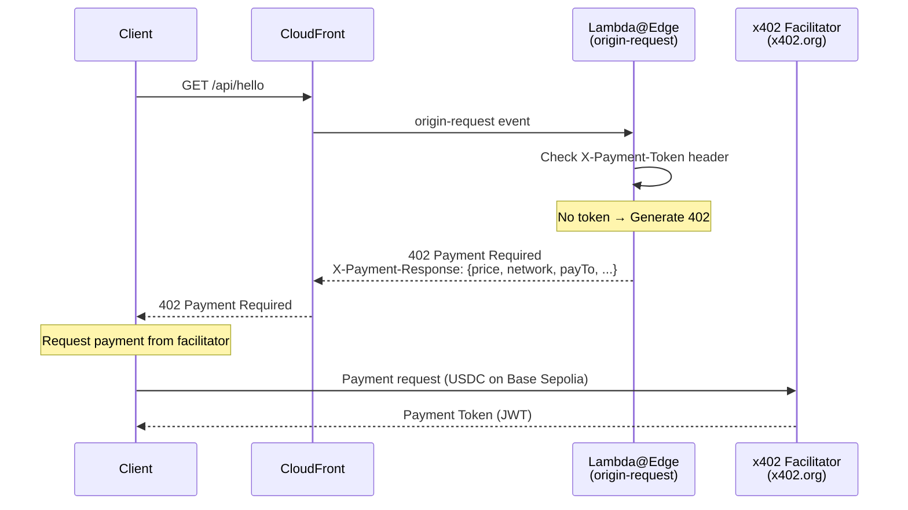
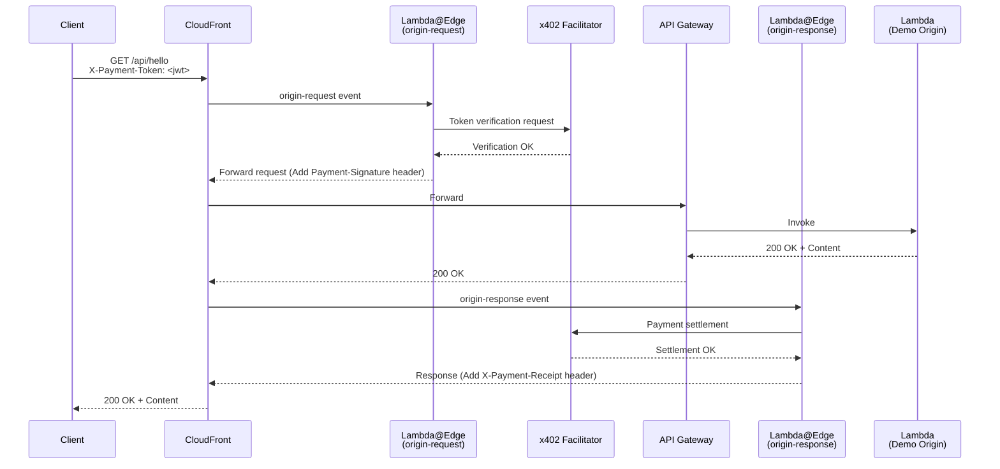
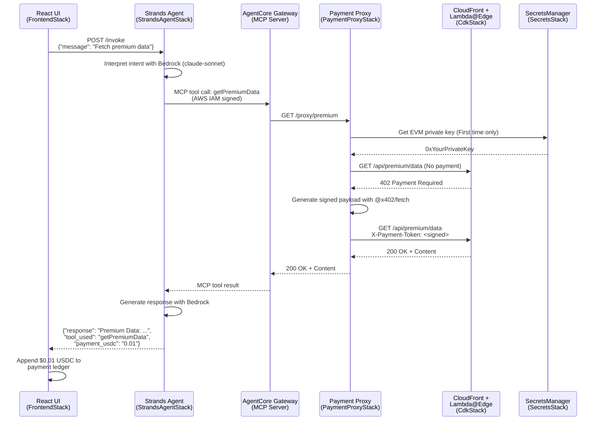
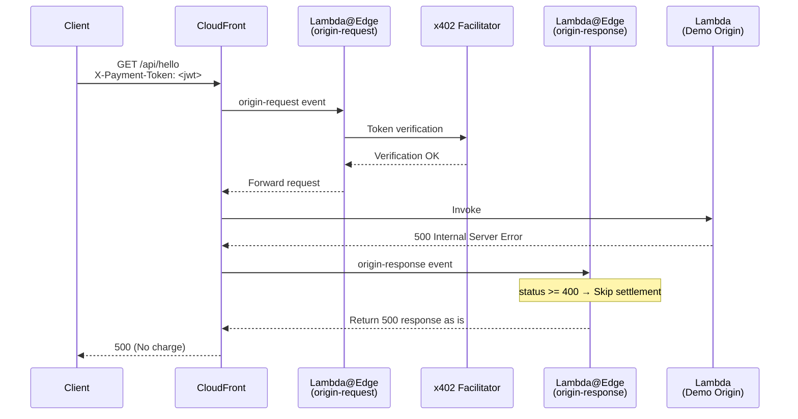

## Introduction

Recently, have you been hearing the term **x402** more often?

As payments between AI Agents become a reality, **x402** is attracting attention as a micropayment method.

While there are several ways to "x402-ify" existing APIs, AWS has come up with a very cool architectural proposal. This time, I've used it to create an AI Agent with a chat UI!



I've also explained the tech stack, so please read until the end!

## What I Built

### Overview

This is a sample implementation that monetizes HTTP requests with micropayments using AWS CloudFront + Lambda@Edge and the **x402 protocol**.

Specifically, it's an app that integrates **Strands Agent × AgentCore Gateway (MCP)**, where an **AI agent autonomously pays in USDC while fetching content**!

It supports both **Base Sepolia (EVM)** and **Solana Devnet**, and clients can pay on either network.

### Slide Summary of the App

If you want to know just the main points, please see the slides below!



### Screenshots


### The Big Picture

The app I created is composed of **5** layers as follows:

```text
┌──────────────────────────────────────────────────────────────────┐
│  [FrontendStack]  CloudFront (S3)                                │
│  React "Neon Noir Payment Terminal" UI                           │
│  ・Left pane: AI Chat  ・Right pane: Payment Ledger               │
└────────────────────────┬─────────────────────────────────────────┘
                         │ POST /invoke
┌────────────────────────▼─────────────────────────────────────────┐
│  [StrandsAgentStack]  API GW → Strands Agent Lambda (Python)     │
│  ・Interpret user natural language with Bedrock claude-3-5-sonnet │
│  ・Call MCP tools to fetch content                                 │
└────────────────────────┬─────────────────────────────────────────┘
                         │ MCP protocol (HTTP/Streamable)
                         │ AWS IAM Authentication
┌────────────────────────▼─────────────────────────────────────────┐
│  [AgentCoreGatewayStack]  AgentCore Gateway (MCP Server)         │
│  ・Expose Payment Proxy API as MCP tools                          │
│  ・getHelloContent / getPremiumData / getArticleContent          │
└────────────────────────┬─────────────────────────────────────────┘
                         │ HTTP call
┌────────────────────────▼─────────────────────────────────────────┐
│  [PaymentProxyStack]  API GW → Payment Proxy Lambda (TypeScript) │
│  ・Internally handle x402 flow (Recv 402 → Sign with @x402/fetch  │
│    → Retry)                                                      │
│  ・Fetch EVM private key from SecretsManager                     │
└────────────────────────┬─────────────────────────────────────────┘
                         │ HTTPS + X-Payment-Token header
┌────────────────────────▼─────────────────────────────────────────┐
│  [CdkStack]  CloudFront → Lambda@Edge → API GW → Lambda          │
│  ・origin-request: Token verification / Return 402               │
│  ・origin-response: Payment settlement (Only on origin success)  │
└──────────────────────────────────────────────────────────────────┘
```

The responsibilities of each stack are as follows:

| Stack | File | Role |
|---------|---------|------|
| `SecretsStack` | `lib/secrets-stack.ts` | Manage EVM / Solana private keys in SecretsManager |
| `CdkStack` | `lib/cdk-stack.ts` | CloudFront + Lambda@Edge (x402 Edge Gateway) |
| `PaymentProxyStack` | `lib/payment-proxy-stack.ts` | x402 Auto-payment Proxy Lambda + API GW |
| `AgentCoreGatewayStack` | `lib/agent-core-gateway-stack.ts` | AgentCore Gateway (MCP Server) |
| `StrandsAgentStack` | `lib/strands-agent-stack.ts` | Strands Agent Lambda (Python) + API GW |
| `FrontendStack` | `lib/frontend-stack.ts` | CloudFront + S3 delivery of React UI |

### Sequence Diagrams for Each Feature

#### 1. x402 Basic Flow — Unpaid → 402

<details>
<summary>View Sequence Diagram (Mermaid)</summary>


</details>

#### 2. x402 Basic Flow — Paid → Success

<details>
<summary>View Sequence Diagram (Mermaid)</summary>


</details>

#### 3. AI Agent Flow — End-to-End

<details>
<summary>View Sequence Diagram (Mermaid)</summary>


</details>

#### 4. On Origin Error (No Charge)

<details>
<summary>View Sequence Diagram (Mermaid)</summary>


</details>

## System Architecture Diagram


## Key Implementation Points

### Two Lambda Functions to x402-ify Any Origin

#### lambda-edge

The **lambda@Edge** function is the key component here.

[lambda-edge functions on GitHub](https://github.com/mashharuki/x402-Cloudfront-LambdaEdge-Sample/tree/main/cdk/functions/lambda-edge)

It stands between the origin and the client, handling all x402-related logic.
In this case, we've set how much stablecoin payment to request for each path accessed on the origin.

```typescript
// cdk/functions/lambda-edge/config.ts
import type { RoutesConfig } from "@x402/core/server";

// Replaced at build time via esbuild
declare const __PAY_TO_ADDRESS__: string;
declare const __SVM_PAY_TO_ADDRESS__: string;
declare const __X402_NETWORK__: string;
declare const __SOLANA_NETWORK__: string;
declare const __FACILITATOR_URL__: string;

export const FACILITATOR_URL: string = __FACILITATOR_URL__;
export const PAY_TO: string = __PAY_TO_ADDRESS__;
export const SVM_PAY_TO: string = __SVM_PAY_TO_ADDRESS__;
export const NETWORK: string = __X402_NETWORK__;
export const SOLANA_NETWORK: string = __SOLANA_NETWORK__;

// Route configuration — which paths require payment and at what price.
export const ROUTES: RoutesConfig = {
	"/api/*": {
		accepts: [
			{ scheme: "exact", network: NETWORK, payTo: PAY_TO, price: "$0.001" },
			{ scheme: "exact", network: SOLANA_NETWORK, payTo: SVM_PAY_TO, price: "$0.001" },
		],
		description: "API access ($0.001 USDC)",
	},
	"/api/premium/**": {
		accepts: [
			{ scheme: "exact", network: NETWORK, payTo: PAY_TO, price: "$0.01" },
			{ scheme: "exact", network: SOLANA_NETWORK, payTo: SVM_PAY_TO, price: "$0.01" },
		],
		description: "Premium API access ($0.01 USDC)",
	},
	"/content/**": {
		accepts: [
			{ scheme: "exact", network: NETWORK, payTo: PAY_TO, price: "$0.005" },
			{ scheme: "exact", network: SOLANA_NETWORK, payTo: SVM_PAY_TO, price: "$0.005" },
		],
		description: "Premium content ($0.005 USDC)",
	},
};
```

By handling x402 requests/responses here, the origin side doesn't need to be aware of x402 at all.

#### payment-proxy

This is the Lambda function for the x402 automatic payment proxy.

```typescript
// cdk/functions/payment-proxy/index.ts
import { GetSecretValueCommand, SecretsManagerClient } from "@aws-sdk/client-secrets-manager";
import { createKeyPairSignerFromBytes } from "@solana/kit";
import { x402Client } from "@x402/core/client";
import { wrapFetchWithPayment } from "@x402/fetch";
import { ExactSvmScheme } from "@x402/svm/exact/client";
import type { APIGatewayProxyEvent, APIGatewayProxyResult } from "aws-lambda";
import bs58 from "bs58";

const CLOUDFRONT_URL = process.env.CLOUDFRONT_URL!;
const SVM_SECRET_ARN = process.env.SVM_PRIVATE_KEY_SECRET_ARN!;

const ROUTE_MAP: Record<string, string> = {
	"/proxy/hello": "/api/hello",
	"/proxy/premium": "/api/premium/data",
	"/proxy/article": "/content/article",
};

let payFetch: typeof fetch | null = null;

async function getPayFetch(): Promise<typeof fetch> {
	if (payFetch) return payFetch;
	const sm = new SecretsManagerClient({});
	const svmSecret = await sm.send(new GetSecretValueCommand({ SecretId: SVM_SECRET_ARN }));

	if (!svmSecret.SecretString) throw new Error("Solana private key secret is empty");

	const svmSigner = await createKeyPairSignerFromBytes(bs58.decode(svmSecret.SecretString));
	const client = new x402Client();
	client.register("solana:*", new ExactSvmScheme(svmSigner));

	payFetch = wrapFetchWithPayment(fetch, client);
	return payFetch;
}

export const handler = async (event: APIGatewayProxyEvent): Promise<APIGatewayProxyResult> => {
	const proxyPath = event.path;
	const targetPath = ROUTE_MAP[proxyPath];

	if (!targetPath) {
		return {
			statusCode: 404,
			headers: { "Content-Type": "application/json" },
			body: JSON.stringify({ error: `Unknown proxy path: ${proxyPath}` }),
		};
	}

	try {
		const fetchFn = await getPayFetch();
		const res = await fetchFn(`${CLOUDFRONT_URL}${targetPath}`);
		const body = await res.text();
		return {
			statusCode: res.status,
			headers: { "Content-Type": "application/json" },
			body,
		};
	} catch (err) {
		console.error("Payment proxy request failed:", err);
		return {
			statusCode: 500,
			headers: { "Content-Type": "application/json" },
			body: JSON.stringify({ error: String(err) }),
		};
	}
};
```

### MCP Server

In **AgentCore Gateway**, you can "MCP-ify" your APIs.
What you need for that is an OpenAPI specification (YAML).

We'll turn the above proxy server into an MCP server.

```yaml
# cdk/mcp/openapi.yaml
openapi: "3.0.1"
info:
  title: "x402 Payment Proxy API"
  version: "1.0.0"
  description: "MCP tools for accessing x402-protected content via auto-payment proxy"
paths:
  /proxy/hello:
    get:
      operationId: "getHelloContent"
      summary: "Get hello content"
      description: "Get hello content (costs $0.001 USDC on Base Sepolia). Payment is handled automatically."
      responses:
        "200":
          description: "Success"
          content:
            application/json:
              schema:
                type: object
  /proxy/premium:
    get:
      operationId: "getPremiumData"
      summary: "Get premium analytics data"
      description: "Get premium analytics data (costs $0.01 USDC on Base Sepolia). Payment is handled automatically."
      responses:
        "200":
          description: "Success"
          content:
            application/json:
              schema:
                type: object
  /proxy/article:
    get:
      operationId: "getArticleContent"
      summary: "Get article content"
      description: "Get article content (costs $0.005 USDC on Base Sepolia). Payment is handled automatically."
      responses:
        "200":
          description: "Success"
          content:
            application/json:
              schema:
                type: object
```

### AI Agent Implemented with Strands Agent

This part handles the implementation of the AI Agent that accesses x402-supported content via MCP.
It's implemented using **Python** and the **Strands Agent SDK**, with **Bedrock AgentCore** as the execution environment.

```python
# strands_agent/lambda_function.py
import json
import os
from mcp_proxy_for_aws.client import aws_iam_streamablehttp_client
from strands import Agent
from strands.models import BedrockModel
from strands.tools.mcp import MCPClient

GATEWAY_MCP_URL = os.environ["AGENT_CORE_GATEWAY_MCP_URL"]
AWS_REGION = os.environ.get("AWS_REGION", "us-east-1")

model = BedrockModel(
    model_id="us.anthropic.claude-3-5-sonnet-20240620-v1:0",
    region_name=AWS_REGION,
)

mcp_client = MCPClient(
    lambda: aws_iam_streamablehttp_client(
        endpoint=GATEWAY_MCP_URL,
        aws_region=AWS_REGION,
        aws_service="bedrock-agentcore",
    )
)

agent = Agent(
    model=model,
    tools=[mcp_client],
    system_prompt="""
        You are an AI assistant that can access x402-protected premium content.
        ... (omitted for brevity) ...
    """,
)

def handler(event, context):
    # ... (omitted for brevity) ...
    try:
        response = agent(user_message)
        return {
            "statusCode": 200,
            "headers": CORS_HEADERS,
            "body": json.dumps({"session_id": session_id, "response": str(response)}),
        }
    except Exception as e:
        return {"statusCode": 500, "headers": CORS_HEADERS, "body": json.dumps({"error": str(e)})}
```

### Frontend

The frontend is implemented with **React.js** and **Vite**.
The AI Agent functionality is implemented as a **React Hook** to be called as an API.

```typescript
// frontend/src/hooks/useAgent.ts
import { useCallback, useRef, useState } from "react";
import { loadConfig } from "../lib/config";
import type { Message, PaymentRecord } from "../types";

export function useAgent() {
  const [messages, setMessages] = useState<Message[]>([]);
  const [payments, setPayments] = useState<PaymentRecord[]>([]);
  const [isLoading, setIsLoading] = useState(false);
  const sessionId = useRef(crypto.randomUUID());

  const sendMessage = useCallback(async (text: string) => {
    const config = await loadConfig();
    // ... (omitted for brevity) ...
    try {
      const res = await fetch(`${config.strandsAgentApiUrl}/invoke`, {
        method: "POST",
        headers: { "Content-Type": "application/json" },
        body: JSON.stringify({ message: text, session_id: sessionId.current }),
      });
      const data = await res.json();
      // ... (omitted for brevity) ...
    } catch (err) {
      // ...
    } finally {
      setIsLoading(false);
    }
  }, []);

  return { messages, payments, isLoading, sendMessage };
}
```

## How to Run

### Phase A: Deploy Existing x402 Edge Gateway

1.  **Clone the Repo**:
    ```bash
    git clone https://github.com/mashharuki/x402-Cloudfront-LambdaEdge-Sample.git
    cd x402-Cloudfront-LambdaEdge-Sample
    ```
2.  **Install Dependencies**:
    ```bash
    cd cdk && bun install
    bun install --cwd functions/lambda-edge
    ```
3.  **Batch Deploy All Stacks**:
    ```bash
    bunx cdk deploy SecretsStack
    # Set private keys in SecretsManager...
    PAY_TO_ADDRESS=0xYourEVMAddress SVM_PAY_TO_ADDRESS=YourSolanaAddress npx cdk deploy CdkStack PaymentProxyStack AgentCoreGatewayStack StrandsAgentStack
    ```

### Cleanup

Don't forget to delete resources after verification!
```bash
npx cdk destroy --all
```
Note: Lambda@Edge functions may need to be deleted manually after a few hours once replicas are gone.

## Summary

I've tried a way to "x402-ify" any origin using **CloudFront** + **Lambda@Edge**!

The architecture is very cool because it fully utilizes managed services while requiring almost no changes to the origin-side code where the core logic resides.

While steps like blockchain knowledge, wallets, and stablecoin preparation are still necessary, it would be even more powerful if environment setup was also covered.

I expect this kind of implementation to increase in the future.

Thank you for reading!

## References

- [GitHub x402-Cloudfront-LambdaEdge-Sample](https://github.com/mashharuki/x402-Cloudfront-LambdaEdge-Sample)
- [Monetize Any HTTP Application with x402 and CloudFront + Lambda@Edge](https://builder.aws.com/content/38fLQk6zKRfLnaUNzcLPsUexUlZ/monetize-any-http-application-with-x402-and-cloudfront-lambdaedge)
- [x402 Protocol Specification](https://x402.org)
- [Model Context Protocol (MCP)](https://modelcontextprotocol.io/)
