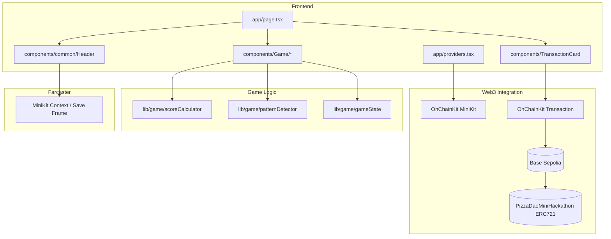

# Web3 AI VibeCoding用の技術ブログ執筆メモ

## この記事の目的

- 1. Web3 AI VibeCodingのコツや気をつけるべき点を共有すること
- 2. Web3 AI VibeCodingを成功させるために必要な具体的なタスクを紹介すること

## この記事で共有したいことの詳細メモ

- 1. Web3 AI VibeCodingのコツや気をつけるべき点を共有すること
  - コツ
    - いきなり実装は始めずにまずは要件定義から始めること
      - Spec駆動開発で進めよう！
    - コンテキストエンジニアリングが重要
      - 複雑な構成で質の高いアウトプットを求めるのであれば入力もそれに応じて質の高いものを用意する必要がある
      - 新しくて特定のライブラリを使ってもらいたい場合はそれについても丁寧なコンテキストを用意してあげること
        例えば以下のような情報を用意してあげること
        - ライブラリ名とバージョン
        - ライブラリの使い方(説明とコード例付き)
        - フォルダ構成
        - ベースとなるテンプレート(コード一式)
    - MCPを使ってAI Agentを強化しよう！
      - 例えば以下のようなMCPを設定しよう！
      - context7
      - sequenthing-thinking
      - serena
  - 気をつけるべき点
    - 段階的に進めること
    - 細かくテストは挟むこと
    - 都度自分の手で試してみるのも良い

- 2. Web3 AI VibeCodingを成功させるために必要な具体的なタスクを紹介すること. 
  自分が試してみてよかったこと、普段から実施しておくと良いこと. 
  - 的確なコンテキストや要件定義書を用意できるようにはやっぱり人間側に知識が必要
    - 情報を収集できる環境を用意する(作る)
      - Xやfacebook、linkedinなどのSNSで著名なプロジェクトやそのファウンダー、テックエバンジェリストのアカウントをフォローする
        - 幅広い領域で技術に対してアンテナを張っておくとなお良い
          結局プロダクションレベルまで仕上げることを目指すとフルスタックで技術に対する知識を持っておいた方が良いと感じた
          - フロントエンド
          - バックエンド
          - パブリッククラウド
          - セキュリティ
          - DevOps
          - Web3
          - 生成AI
          - 認証
          - デザイン
          - プロジェクトマネジメント(意外とめっちゃ大事)
      - テック系のミートアップ、カンファレンスに足を運ぶ
    - 15分でも良いので日常的に手を動かして体系的に技術を理解し、技術の引き出しを増やす
      - 的確なコンテキストを用意できるようになるためにはやっぱり手を動かして技術の概要をざっくりとでも良いので掴んでおくことが重要だと感じた
      - チュートリアルでも良いので実際に体感してみることがとにかく重要
        - エラーが出ても構わない(むしろハマりどころがわかるのでそれを考慮したコンテキストをAIに渡せるようになるので良い)
        - 実際に手を動かすところまで試した技術への理解度はそうではないものと雲泥の差がある！
      - パターンごとに **テンプレ** を用意しておく!
        - このテンプレをベースにAIに実装させると新しめのライブラリを使って場合でも実装がうまくいくことがわかった
      -  手を動かして学んだことを技術ブログ化すると理解が深まるので尚良い
    - 効率良く調査する方法. 
      以下のツールを使って簡単に調べられるようになったので絶対に活用すべき！！  
      ここで色々聞いてコンテキストに加えるのもあり
      - notebook LM
      - Deepwiki

## 記事で取り扱うリンク集

- LiveDemo. 
  https://farcaster.xyz/miniapps/__UcwcJwPaVN/mini-pizza-game

- GitHub. 
  https://github.com/mashharuki/PizzaDaoMiniHackathon

- ETH TokyoのHP
  https://ethtokyo.org/
  
- Luma - PizzaDAO × Ethreactor Mini Hackathon @ ETHTokyo '25
  https://luma.com/p6leyvgj?tk=JuHl69

## 技術スタック

- Web3
- ブロックチェーン
- 生成AI
- AI駆動開発
- Spec駆動開発
- Kiro
- Gemini CLI
- GitHub Copilot
- CodeX
- TypeScript
- スマートコントラクト
- Farcaster
- Farcaster SDK
- MiniApp Kit
- Base Sepolia
- ERC1155
- OnChainKit
- Next.js

## AI coding Agent用の設定ファイル

- Gemini CLI

  - `.gemini/GEMINI.md`

    ```markdown
    あなたは超優秀なフルスタックWeb3エンジニアです。

    このワークスペースでコーディングを行う際には必ず以下のルールに従ってください。

    # 実装方針

    ## 全体的な方針

    - まずプロジェクトのディレクトリ内に `.kiro/specs` フォルダが存在するか確認してください。
    - `.kiro/specs` フォルダが存在する場合、その中にあるプロジェクトの仕様書を読み込み、仕様書に基づいて実装を行ってください。
      - 例えば シューティングゲーム用の仕様書だったら `shooting-game` というフォルダがあるはずです。
      - その場合、フォルダ内にある仕様書をすべて読み込み、仕様書に基づいて実装を行ってください。
        - requirements.md : 要件定義書
        - design.md: 設計書
        - tasks.md
      - 仕様書がない場合は、実装を開始する前に必ず仕様書を作成してください。
      - 仕様書を作成する順番は以下の通りです。
        1. requirements.md : 要件定義書
        2. design.md: 設計書
        3. tasks.md タスクリスト
      - 仕様書は３つ同時に作成するのではなく、順番に作成してください。作成したら必ず私にレビューを依頼してください。
      - 私がレビューして内容を承認をしない限り次の仕様書の作成に進んではいけません。
      - 実装時は、必ずタスクリストに基づいて順番に実装を行ってください。
      - 段階的に進めることで、各ステップでのフィードバックを反映しやすくなり成果物のクオリティが上がります。

    ## 仕様書のサンプル

    以下に各仕様書のサンプルを示します。  
    必ずこれらのフォーマットにしたがって仕様書を作成してください。

    繰り返しになりますが、以下はあくまでサンプルです。  
    あなたに求められているのは、あくまでこのフォーマットに従った仕様書の作成です。  
    プロンプトに与えられた要件を読み解いて各プロジェクトに合った仕様書を作成するようにしてください。

    ### requirements.md

    ````markdown
    # AMM DEX 設計書

    ## 概要

    Ethereum Sepolia テストネットワーク上で動作するAMM（自動マーケットメーカー）型DEXの技術設計書です。Uniswap V2のコア機能を参考に、流動性プール管理とトークンスワップ機能を提供します。

    ## アーキテクチャ

    ### システム全体構成

    ```mermaid
    graph TB
        subgraph "フロントエンド"
            UI[Next.js App]
            Wagmi[Wagmi/Viem]
            RainbowKit[RainbowKit]
        end

        subgraph "ブロックチェーン"
            Factory[Factory Contract]
            Pair1[USDC/JPYC Pair]
            Pair2[USDC/PYUSD Pair]
            Pair3[JPYC/PYUSD Pair]
            Router[Router Contract]
        end

        subgraph "外部トークン"
            USDC[USDC Token]
            JPYC[JPYC Token]
            PYUSD[PYUSD Token]
        end

        UI --> Wagmi
        Wagmi --> Router
        Router --> Factory
        Factory --> Pair1
        Factory --> Pair2
        Factory --> Pair3
        Router --> USDC
        Router --> JPYC
        Router --> PYUSD
    ```
    ````

    ### レイヤー構成

    1. **プレゼンテーション層**: Next.js + TailwindCSS
    2. **Web3インタラクション層**: wagmi + viem + RainbowKit
    3. **スマートコントラクト層**: Solidity + Hardhat
    4. **ブロックチェーン層**: Ethereum Sepolia

    ## コンポーネントとインターフェース

    ### フロントエンドコンポーネント構成

    ````
    src/
    ├── app/                     # Next.js App Router
    │   ├── page.tsx            # ホーム/スワップページ
    │   ├── pools/              # プール管理ページ
    │   │   ├── page.tsx        # プール一覧
    │   │   └── [id]/page.tsx   # プール詳細
    │   └── layout.tsx          # 共通レイアウト
    ├── components/
    │   ├── layout/
    │   │   └── Header.tsx      # ヘッダー（ウォレット接続含む）
    │   ├── swap/
    │   │   ├── SwapCard.tsx    # スワップインターフェース
    │   │   └── TokenSelector.tsx # トークン選択
    │   ├── pools/
    │   │   ├── PoolCard.tsx    # プール情報カード
    │   │   ├── AddLiquidity.tsx # 流動性追加
    │   │   └── RemoveLiquidity.tsx # 流動性削除
    │   └── ui/                 # 基本UIコンポーネント
    ├── hooks/
    │   ├── useSwap.ts          # スワップロジック
    │   ├── usePools.ts         # プール管理
    │   └── useTokens.ts        # トークン情報
    ├── lib/
    │   ├── contracts.ts        # コントラクト設定
    │   ├── constants.ts        # 定数定義
    │   └── utils.ts            # ユーティリティ関数
    └── types/
        ├── contracts.ts        # コントラクト型定義
        └── tokens.ts           # トークン型定義
    ```###
    スマートコントラクト構成

    ````

    contracts/
    ├── core/
    │ ├── AMMFactory.sol # ペア作成・管理
    │ ├── AMMPair.sol # 流動性プール実装
    │ └── AMMRouter.sol # スワップ・流動性管理
    ├── interfaces/
    │ ├── IAMMFactory.sol # Factory インターフェース
    │ ├── IAMMPair.sol # Pair インターフェース
    │ └── IAMMRouter.sol # Router インターフェース
    ├── libraries/
    │ ├── AMMLibrary.sol # 価格計算ライブラリ
    │ └── SafeMath.sol # 安全な数学演算
    └── utils/
    └── WETH.sol # Wrapped Ether（テスト用）

    ````

    ### 主要インターフェース

    #### IAMMRouter.sol
    ```solidity
    interface IAMMRouter {
        function swapExactTokensForTokens(
            uint amountIn,
            uint amountOutMin,
            address[] calldata path,
            address to,
            uint deadline
        ) external returns (uint[] memory amounts);

        function addLiquidity(
            address tokenA,
            address tokenB,
            uint amountADesired,
            uint amountBDesired,
            uint amountAMin,
            uint amountBMin,
            address to,
            uint deadline
        ) external returns (uint amountA, uint amountB, uint liquidity);

        function removeLiquidity(
            address tokenA,
            address tokenB,
            uint liquidity,
            uint amountAMin,
            uint amountBMin,
            address to,
            uint deadline
        ) external returns (uint amountA, uint amountB);
    }
    ````

    #### IAMMPair.sol

    ```solidity
    interface IAMMPair {
      function getReserves()
        external
        view
        returns (uint112 reserve0, uint112 reserve1, uint32 blockTimestampLast);
      function mint(address to) external returns (uint liquidity);
      function burn(address to) external returns (uint amount0, uint amount1);
      function swap(
        uint amount0Out,
        uint amount1Out,
        address to,
        bytes calldata data
      ) external;
      function token0() external view returns (address);
      function token1() external view returns (address);
    }
    ```

    ## データモデル

    ### フロントエンド型定義

    ```typescript
    // types/tokens.ts
    export interface Token {
      address: `0x${string}`;
      symbol: string;
      name: string;
      decimals: number;
      logoURI?: string;
    }

    export interface TokenBalance {
      token: Token;
      balance: bigint;
      formatted: string;
    }

    // types/contracts.ts
    export interface Pool {
      id: string;
      token0: Token;
      token1: Token;
      reserve0: bigint;
      reserve1: bigint;
      totalSupply: bigint;
      lpTokenBalance?: bigint;
    }

    export interface SwapQuote {
      amountIn: bigint;
      amountOut: bigint;
      priceImpact: number;
      minimumAmountOut: bigint;
      path: `0x${string}`[];
    }

    export interface LiquidityPosition {
      pool: Pool;
      lpTokenBalance: bigint;
      token0Amount: bigint;
      token1Amount: bigint;
      shareOfPool: number;
    }
    ```

    ### コントラクト定数

    ```typescript
    // lib/constants.ts
    export const SUPPORTED_TOKENS: Record<string, Token> = {
      USDC: {
        address: '0x1c7D4B196Cb0C7B01d743Fbc6116a902379C7238',
        symbol: 'USDC',
        name: 'USD Coin',
        decimals: 6,
      },
      JPYC: {
        address: '0x431D5dfF03120AFA4bDf332c61A6e1766eF37BDB',
        symbol: 'JPYC',
        name: 'JPY Coin',
        decimals: 18,
      },
      PYUSD: {
        address: '0xCaC524BcA292aaade2DF8A05cC58F0a65B1B3bB9',
        symbol: 'PYUSD',
        name: 'PayPal USD',
        decimals: 6,
      },
    } as const;

    export const CONTRACT_ADDRESSES = {
      FACTORY: '0x...', // デプロイ後に設定
      ROUTER: '0x...', // デプロイ後に設定
    } as const;

    export const SLIPPAGE_OPTIONS = [0.1, 0.5, 1.0, 3.0] as const;
    export const DEFAULT_SLIPPAGE = 0.5;
    export const MAX_SLIPPAGE = 50;
    ```

    ## エラーハンドリング

    ### カスタムエラー定義

    ```solidity
    // contracts/core/AMMRouter.sol
    error InsufficientOutputAmount();
    error InsufficientLiquidity();
    error InvalidPath();
    error Expired();
    error InsufficientAAmount();
    error InsufficientBAmount();
    ```

    ### フロントエンドエラーハンドリング

    ```typescript
    // lib/errors.ts
    export class SwapError extends Error {
      constructor(
        message: string,
        public code: 'INSUFFICIENT_BALANCE' | 'SLIPPAGE_EXCEEDED' | 'NETWORK_ERROR'
      ) {
        super(message);
        this.name = 'SwapError';
      }
    }

    export const handleContractError = (error: unknown): string => {
      if (error instanceof Error) {
        if (error.message.includes('InsufficientOutputAmount')) {
          return 'スリッページが大きすぎます。設定を調整してください。';
        }
        if (error.message.includes('InsufficientLiquidity')) {
          return '流動性が不足しています。';
        }
        if (error.message.includes('User rejected')) {
          return 'トランザクションがキャンセルされました。';
        }
      }
      return '予期しないエラーが発生しました。';
    };
    ```

    ## テスト戦略

    ### スマートコントラクトテスト

    ```typescript
    // test/AMMRouter.test.ts
    describe('AMMRouter', () => {
      describe('swapExactTokensForTokens', () => {
        it('正常なスワップが実行される', async () => {
          // テストロジック
        });

        it('スリッページ制限でリバートする', async () => {
          // テストロジック
        });

        it('期限切れでリバートする', async () => {
          // テストロジック
        });
      });

      describe('addLiquidity', () => {
        it('初回流動性追加が成功する', async () => {
          // テストロジック
        });

        it('既存プールへの流動性追加が成功する', async () => {
          // テストロジック
        });
      });
    });
    ```

    ### フロントエンドテスト

    ```typescript
    // __tests__/components/SwapCard.test.tsx
    describe('SwapCard', () => {
      it('トークン選択が正常に動作する', () => {
        // テストロジック
      });

      it('スワップ金額の計算が正確である', () => {
        // テストロジック
      });

      it('スリッページ設定が反映される', () => {
        // テストロジック
      });
    });

    // __tests__/hooks/useSwap.test.ts
    describe('useSwap', () => {
      it('スワップクォートが正確に計算される', () => {
        // テストロジック
      });

      it('エラー状態が適切に処理される', () => {
        // テストロジック
      });
    });
    ```

    ### E2Eテスト

    ````typescript
    // e2e/swap.spec.ts
    test('完全なスワップフロー', async ({ page }) => {
      // 1. ウォレット接続
      // 2. トークン選択
      // 3. 金額入力
      // 4. スワップ実行
      // 5. 結果確認
    });

    test('流動性追加フロー', async ({ page }) => {
      // 1. プールページ移動
      // 2. トークンペア選択
      // 3. 金額入力
      // 4. 流動性追加実行
      // 5. LPトークン確認
    });
    ```## 技
    術実装詳細

    ### Wagmi設定

    ```typescript
    // lib/wagmi.ts
    import { createConfig, http } from 'wagmi';
    import { sepolia } from 'wagmi/chains';
    import { injected, metaMask } from 'wagmi/connectors';

    export const config = createConfig({
      chains: [sepolia],
      connectors: [
        injected(),
        metaMask(),
      ],
      transports: {
        [sepolia.id]: http('https://eth-sepolia.g.alchemy.com/v2/YOUR-PROJECT-ID'),
      },
    });
    ````

    ### コントラクトABI定義

    ```typescript
    // lib/abis.ts
    export const ammRouterAbi = [
      {
        inputs: [
          { name: 'amountIn', type: 'uint256' },
          { name: 'amountOutMin', type: 'uint256' },
          { name: 'path', type: 'address[]' },
          { name: 'to', type: 'address' },
          { name: 'deadline', type: 'uint256' },
        ],
        name: 'swapExactTokensForTokens',
        outputs: [{ name: 'amounts', type: 'uint256[]' }],
        stateMutability: 'nonpayable',
        type: 'function',
      },
      {
        inputs: [
          { name: 'tokenA', type: 'address' },
          { name: 'tokenB', type: 'address' },
          { name: 'amountADesired', type: 'uint256' },
          { name: 'amountBDesired', type: 'uint256' },
          { name: 'amountAMin', type: 'uint256' },
          { name: 'amountBMin', type: 'uint256' },
          { name: 'to', type: 'address' },
          { name: 'deadline', type: 'uint256' },
        ],
        name: 'addLiquidity',
        outputs: [
          { name: 'amountA', type: 'uint256' },
          { name: 'amountB', type: 'uint256' },
          { name: 'liquidity', type: 'uint256' },
        ],
        stateMutability: 'nonpayable',
        type: 'function',
      },
    ] as const;

    export const ammPairAbi = [
      {
        inputs: [],
        name: 'getReserves',
        outputs: [
          { name: 'reserve0', type: 'uint112' },
          { name: 'reserve1', type: 'uint112' },
          { name: 'blockTimestampLast', type: 'uint32' },
        ],
        stateMutability: 'view',
        type: 'function',
      },
      {
        inputs: [],
        name: 'token0',
        outputs: [{ name: '', type: 'address' }],
        stateMutability: 'view',
        type: 'function',
      },
      {
        inputs: [],
        name: 'token1',
        outputs: [{ name: '', type: 'address' }],
        stateMutability: 'view',
        type: 'function',
      },
    ] as const;

    export const erc20Abi = [
      {
        inputs: [{ name: 'account', type: 'address' }],
        name: 'balanceOf',
        outputs: [{ name: '', type: 'uint256' }],
        stateMutability: 'view',
        type: 'function',
      },
      {
        inputs: [
          { name: 'spender', type: 'address' },
          { name: 'amount', type: 'uint256' },
        ],
        name: 'approve',
        outputs: [{ name: '', type: 'bool' }],
        stateMutability: 'nonpayable',
        type: 'function',
      },
    ] as const;
    ```

    ### カスタムフック実装

    ```typescript
    // hooks/useSwap.ts
    import { useWriteContract, useReadContract } from 'wagmi';
    import { ammRouterAbi } from '@/lib/abis';
    import { CONTRACT_ADDRESSES } from '@/lib/constants';

    export const useSwap = () => {
      const { writeContract, isPending, error } = useWriteContract();

      const executeSwap = async (
        amountIn: bigint,
        amountOutMin: bigint,
        path: `0x${string}`[],
        to: `0x${string}`,
        deadline: bigint
      ) => {
        return writeContract({
          address: CONTRACT_ADDRESSES.ROUTER,
          abi: ammRouterAbi,
          functionName: 'swapExactTokensForTokens',
          args: [amountIn, amountOutMin, path, to, deadline],
        });
      };

      return {
        executeSwap,
        isPending,
        error,
      };
    };

    // hooks/usePools.ts
    import { useReadContract } from 'wagmi';
    import { ammPairAbi } from '@/lib/abis';

    export const usePoolReserves = (pairAddress: `0x${string}`) => {
      const { data, isLoading, error } = useReadContract({
        address: pairAddress,
        abi: ammPairAbi,
        functionName: 'getReserves',
      });

      return {
        reserves: data
          ? {
              reserve0: data[0],
              reserve1: data[1],
              blockTimestampLast: data[2],
            }
          : null,
        isLoading,
        error,
      };
    };
    ```

    ### 価格計算ロジック

    ```typescript
    // lib/calculations.ts
    export const calculateAmountOut = (
      amountIn: bigint,
      reserveIn: bigint,
      reserveOut: bigint
    ): bigint => {
      if (amountIn === 0n || reserveIn === 0n || reserveOut === 0n) {
        return 0n;
      }

      const amountInWithFee = amountIn * 997n;
      const numerator = amountInWithFee * reserveOut;
      const denominator = reserveIn * 1000n + amountInWithFee;

      return numerator / denominator;
    };

    export const calculatePriceImpact = (
      amountIn: bigint,
      amountOut: bigint,
      reserveIn: bigint,
      reserveOut: bigint
    ): number => {
      if (reserveIn === 0n || reserveOut === 0n) return 0;

      const currentPrice = Number(reserveOut) / Number(reserveIn);
      const executionPrice = Number(amountOut) / Number(amountIn);

      return Math.abs((executionPrice - currentPrice) / currentPrice) * 100;
    };

    export const calculateLiquidityMinted = (
      amountA: bigint,
      amountB: bigint,
      reserveA: bigint,
      reserveB: bigint,
      totalSupply: bigint
    ): bigint => {
      if (totalSupply === 0n) {
        // 初回流動性追加の場合
        return sqrt(amountA * amountB) - 1000n; // MINIMUM_LIQUIDITY
      }

      const liquidityA = (amountA * totalSupply) / reserveA;
      const liquidityB = (amountB * totalSupply) / reserveB;

      return liquidityA < liquidityB ? liquidityA : liquidityB;
    };

    // 平方根計算（Babylonian method）
    const sqrt = (value: bigint): bigint => {
      if (value === 0n) return 0n;

      let x = value;
      let y = (value + 1n) / 2n;

      while (y < x) {
        x = y;
        y = (value / x + x) / 2n;
      }

      return x;
    };
    ```

    ### RainbowKit統合

    ```typescript
    // app/providers.tsx
    'use client';

    import { QueryClient, QueryClientProvider } from '@tanstack/react-query';
    import { WagmiProvider } from 'wagmi';
    import { RainbowKitProvider, getDefaultConfig } from '@rainbow-me/rainbowkit';
    import { sepolia } from 'wagmi/chains';
    import '@rainbow-me/rainbowkit/styles.css';

    const config = getDefaultConfig({
      appName: 'AMM DEX',
      projectId: 'YOUR_PROJECT_ID',
      chains: [sepolia],
    });

    const queryClient = new QueryClient();

    export function Providers({ children }: { children: React.ReactNode }) {
      return (
        <WagmiProvider config={config}>
          <QueryClientProvider client={queryClient}>
            <RainbowKitProvider>
              {children}
            </RainbowKitProvider>
          </QueryClientProvider>
        </WagmiProvider>
      );
    }
    ```

    ### 状態管理

    ```typescript
    // lib/store.ts
    import { create } from 'zustand';
    import { Token, Pool } from '@/types';

    interface AppState {
      selectedTokens: {
        tokenA: Token | null;
        tokenB: Token | null;
      };
      slippage: number;
      pools: Pool[];
      setSelectedToken: (position: 'tokenA' | 'tokenB', token: Token) => void;
      setSlippage: (slippage: number) => void;
      setPools: (pools: Pool[]) => void;
      swapTokens: () => void;
    }

    export const useAppStore = create<AppState>((set) => ({
      selectedTokens: {
        tokenA: null,
        tokenB: null,
      },
      slippage: 0.5,
      pools: [],
      setSelectedToken: (position, token) =>
        set((state) => ({
          selectedTokens: {
            ...state.selectedTokens,
            [position]: token,
          },
        })),
      setSlippage: (slippage) => set({ slippage }),
      setPools: (pools) => set({ pools }),
      swapTokens: () =>
        set((state) => ({
          selectedTokens: {
            tokenA: state.selectedTokens.tokenB,
            tokenB: state.selectedTokens.tokenA,
          },
        })),
    }));
    ```

    ## パフォーマンス最適化

    ### フロントエンド最適化

    1. **React.memo**でコンポーネントの不要な再レンダリングを防止
    2. **useMemo**で重い計算結果をキャッシュ
    3. **useCallback**でイベントハンドラーを最適化
    4. **React Query**でAPIレスポンスをキャッシュ
    5. **Code Splitting**で初期バンドルサイズを削減

    ### スマートコントラクト最適化

    1. **ガス効率的なアルゴリズム**の採用
    2. **Storage読み書きの最小化**
    3. **関数修飾子**でアクセス制御を効率化
    4. **イベント**でオフチェーンデータ取得を最適化

    ### Web3インタラクション最適化

    1. **Multicall**で複数のコントラクト呼び出しをバッチ処理
    2. **適切なポーリング間隔**でリアルタイム更新を効率化
    3. **トランザクション状態管理**でUX向上

    ## セキュリティ考慮事項

    ### スマートコントラクト

    1. **ReentrancyGuard**で再入攻撃を防止
    2. **SafeMath**でオーバーフロー/アンダーフローを防止
    3. **アクセス制御**で権限管理を適切に実装
    4. **入力値検証**で不正なパラメータを拒否

    ### フロントエンド

    1. **入力値サニタイゼーション**
    2. **CSP（Content Security Policy）**の設定
    3. **HTTPS**の強制
    4. **ウォレット接続の検証**

    この設計書に基づいて、次のフェーズでタスクリストを作成し、段階的な実装を進めていきます。

    ````

    ### design.md

    ```markdown
    # AMM DEX 要件定義書

    ## 概要

    Ethereum Sepolia テストネットワーク上で動作する自動マーケットメーカー（AMM）型分散型取引所（DEX）を開発します。Uniswap V2 のコア機能を参考に、流動性プール管理とトークンスワップ機能を提供する検証用DEXです。

    対象トークン：

    - USDC: 0x1c7D4B196Cb0C7B01d743Fbc6116a902379C7238
    - JPYC: 0x431D5dfF03120AFA4bDf332c61A6e1766eF37BDB
    - PYUSD: 0xCaC524BcA292aaade2DF8A05cC58F0a65B1B3bB9

    ## 必要な画面一覧

    1. **ホーム/スワップ画面** - メインのトークン交換インターフェース
    2. **流動性プール画面** - 流動性の追加・削除管理
    3. **プール詳細画面** - 個別プールの詳細情報と統計

    ## 共通コンポーネント

    - **ヘッダーコンポーネント** - 全画面共通のナビゲーションとウォレット接続ボタン

    ## 必要な機能一覧

    ### コア機能

    - トークンスワップ（自動価格計算）
    - 流動性プール作成・管理
    - 流動性提供・削除
    - リアルタイム価格表示
    - ウォレット接続・管理

    ### 補助機能

    - スリッページ設定
    - 取引履歴表示
    - プール統計情報
    - トランザクション状態管理

    ## 採用技術スタック

    ### フロントエンド

    - **フレームワーク**: Next.js 14 (App Router)
    - **言語**: TypeScript
    - **スタイリング**: TailwindCSS + Shadcn/UI
    - **Web3ライブラリ**: wagmi + viem + RainbowKit
    - **状態管理**: React useState/useContext

    ### スマートコントラクト

    - **言語**: Solidity ^0.8.19
    - **開発環境**: Hardhat
    - **ライブラリ**: OpenZeppelin Contracts
    - **テスト**: Mocha/Chai + TypeScript

    ### インフラ

    - **ネットワーク**: Ethereum Sepolia (Chain ID: 11155111)
    - **パッケージマネージャー**: pnpm
    - **フォーマッター**: Prettier

    ## 要件

    ### 要件1: トークンスワップ機能

    **ユーザーストーリー:** トレーダーとして、サポートされているERC20トークン間で効率的に交換を行いたい。手数料と価格影響を事前に確認し、適切なスリッページ設定で安全に取引したい。

    #### 受け入れ基準

    1. WHEN ユーザーがスワップ画面でトークンペアを選択 THEN システム SHALL 現在の交換レートと推定ガス料金を表示する
    2. WHEN ユーザーが交換数量を入力 THEN システム SHALL リアルタイムで受け取り予定数量と価格影響を計算して表示する
    3. WHEN ユーザーがスリッページ許容値を設定 THEN システム SHALL 0.1%から50%の範囲で設定を受け付ける
    4. WHEN ユーザーがスワップを実行 THEN システム SHALL MetaMaskでトランザクション署名を要求する
    5. IF 流動性が不足している場合 THEN システム SHALL エラーメッセージを表示してトランザクションを防止する
    6. WHEN トランザクションが完了 THEN システム SHALL 成功通知と取引詳細を表示する

    ### 要件2: 流動性プール管理

    **ユーザーストーリー:** 流動性プロバイダーとして、トークンペアに流動性を提供し、取引手数料から報酬を得たい。また、必要に応じて流動性を引き出したい。

    #### 受け入れ基準

    1. WHEN ユーザーが流動性追加画面でトークンペアを選択 THEN システム SHALL 現在のプール比率と必要な各トークン数量を表示する
    2. WHEN ユーザーが一方のトークン数量を入力 THEN システム SHALL 自動的にもう一方のトークン数量を現在の比率に基づいて計算する
    3. WHEN ユーザーが流動性を追加 THEN システム SHALL LPトークンを発行してユーザーのウォレットに送信する
    4. WHEN ユーザーが流動性削除を選択 THEN システム SHALL 保有するLPトークンの割合に応じた各トークンの受け取り予定数量を表示する
    5. IF 新しいトークンペアの場合 THEN システム SHALL 初期流動性プロバイダーが初期価格を設定できるようにする
    6. WHEN 流動性が追加または削除される THEN システム SHALL プール統計情報をリアルタイムで更新する

    ### 要件3: ウォレット接続とアカウント管理

    **ユーザーストーリー:** ユーザーとして、全画面共通のヘッダーからMetaMaskウォレットを安全に接続し、自分のアカウント情報を確認したい。

    #### 受け入れ基準

    1. WHEN ユーザーがヘッダーのConnectWalletボタンをクリック THEN システム SHALL MetaMask接続ダイアログを表示する
    2. WHEN ウォレットが接続される THEN システム SHALL ヘッダーにユーザーのアドレス（短縮形）とアカウントドロップダウンを表示する
    3. IF ユーザーが異なるネットワークに接続している場合 THEN システム SHALL Sepoliaネットワークへの切り替えを促すモーダルを表示する
    4. WHEN ウォレットが接続されている THEN システム SHALL アカウントドロップダウンでサポートされている全トークンの残高を表示する
    5. WHEN ユーザーがアカウントドロップダウンを開く THEN システム SHALL 過去の取引履歴とLPトークン保有状況を表示する
    6. WHEN ウォレット接続が切断される THEN システム SHALL ヘッダーを未接続状態に戻し、全ての残高情報をクリアする

    ### 要件4: 価格表示とプール情報

    **ユーザーストーリー:** ユーザーとして、各トークンペアの現在価格、流動性、取引量などの市場情報をリアルタイムで確認したい。

    #### 受け入れ基準

    1. WHEN ユーザーがプール一覧を表示 THEN システム SHALL 全てのアクティブなプールの基本情報を表示する
    2. WHEN ユーザーが特定のプールを選択 THEN システム SHALL 詳細な統計情報（TVL、24時間取引量、手数料収益）を表示する
    3. WHEN 新しい取引が発生 THEN システム SHALL 価格とプール情報を自動的に更新する
    4. WHEN ユーザーがプール詳細画面を表示 THEN システム SHALL 過去24時間の価格チャートを表示する
    5. IF プールが存在しない場合 THEN システム SHALL 「プールが見つかりません」メッセージを表示する
    6. WHEN ページを読み込み THEN システム SHALL 全てのプール情報を3秒以内に表示する

    ### 要件5: エラーハンドリングとユーザビリティ

    **ユーザーストーリー:** ユーザーとして、取引中にエラーが発生した場合、明確な説明と解決方法を知りたい。また、取引の進行状況を常に把握したい。

    #### 受け入れ基準

    1. WHEN トランザクションが失敗 THEN システム SHALL 具体的なエラー理由と推奨される解決方法を表示する
    2. WHEN トランザクションが進行中 THEN システム SHALL ローディング状態と推定完了時間を表示する
    3. IF ガス料金が不足している場合 THEN システム SHALL 必要なETH数量を明示してエラーメッセージを表示する
    4. WHEN ネットワークエラーが発生 THEN システム SHALL 自動的に再試行し、3回失敗後にエラーメッセージを表示する
    5. IF トークン承認が必要な場合 THEN システム SHALL 承認トランザクションを先に実行するよう案内する
    6. WHEN 大きな価格影響が予想される THEN システム SHALL 警告メッセージと確認ダイアログを表示する
    ````

    ### tasks.md

    ```markdown
    # AMM DEX 実装タスクリスト

    ## 概要

    このタスクリストは、AMM DEX の段階的な実装を行うためのコーディングタスクです。各タスクは前のタスクの成果物を基に構築され、テスト駆動開発を重視した実装を行います。

    ## 実装タスク

    - [x] 1. プロジェクト基盤セットアップ
      - モノレポ構造の構築とパッケージ設定
      - 開発環境とツールチェーンの設定
      - 基本的なディレクトリ構造の作成
      - _要件: 1.1, 2.1, 3.1_

    - [x] 1.1 Hardhat プロジェクトセットアップ
      - Hardhat 設定ファイルの作成と Sepolia 設定
      - 必要な依存関係のインストール（OpenZeppelin、TypeChain 等）
      - テスト環境とデプロイスクリプトの基本構造作成
      - _要件: 2.1, 3.1_

    - [x] 1.2 Next.js フロントエンドプロジェクトセットアップ
      - Next.js 14 App Router プロジェクトの初期化
      - TailwindCSS、TypeScript、ESLint の設定
      - 基本的なディレクトリ構造とファイル作成
      - _要件: 1.1, 3.1_

    - [x] 2. コアスマートコントラクト実装
      - AMM Factory、Pair、Router コントラクトの実装
      - 基本的な流動性プール機能の実装
      - コントラクト間の連携機能実装
      - _要件: 2.1, 2.2_

    - [x] 2.1 AMMPair コントラクト実装
      - ERC20 ベースの LP トークン機能実装
      - mint/burn 関数による流動性管理実装
      - swap 関数によるトークン交換機能実装
      - getReserves 関数による残高取得機能実装
      - _要件: 2.1, 2.2_

    - [x] 2.2 AMMFactory コントラクト実装
      - ペア作成機能（createPair）の実装
      - ペア管理とアドレス取得機能の実装
      - イベント発行による透明性確保
      - _要件: 2.1, 2.2_

    - [x] 2.3 AMMRouter コントラクト実装
      - swapExactTokensForTokens 関数の実装
      - addLiquidity/removeLiquidity 関数の実装
      - 価格計算とスリッページ保護機能の実装
      - デッドライン機能による時間制限実装
      - _要件: 1.1, 1.2, 2.1, 2.2_

    - [x] 3. スマートコントラクトテスト実装
      - 各コントラクトの包括的なユニットテスト作成
      - 統合テストによるコントラクト間連携検証
      - エッジケースとエラーハンドリングのテスト
      - _要件: 5.1, 5.2_

    - [x] 3.1 AMMPair コントラクトテスト
      - 流動性追加・削除のテストケース作成
      - スワップ機能の正確性テスト
      - エラーケース（不正な入力値等）のテスト
      - _要件: 5.1, 5.2_

    - [x] 3.2 AMMRouter コントラクトテスト
      - スワップ機能の包括的テスト（正常系・異常系）
      - 流動性管理機能のテスト
      - スリッページ保護とデッドライン機能のテスト
      - _要件: 1.1, 1.2, 5.1, 5.2_

    - [ ] 4. Web3 設定とプロバイダー実装
      - Wagmi 設定と Sepolia ネットワーク接続
      - RainbowKit 統合とウォレット接続機能
      - コントラクト ABI 定義と TypeScript 型生成
      - _要件: 3.1, 3.2_

    - [ ] 4.1 Wagmi 設定とプロバイダー実装
      - createConfig による Wagmi 設定作成
      - Sepolia チェーン設定と RPC 接続設定
      - WagmiProvider と QueryClientProvider の実装
      - _要件: 3.1, 3.2_

    - [ ] 4.2 RainbowKit 統合実装
      - RainbowKitProvider の設定と実装
      - カスタムウォレット接続ボタンの作成
      - ウォレット状態管理とエラーハンドリング
      - _要件: 3.1, 3.2_

    - [ ] 5. 基本 UI コンポーネント実装
      - 共通 UI コンポーネント（Button、Input、Modal 等）の作成
      - レイアウトコンポーネント（Header、Footer）の実装
      - トークン選択コンポーネントの実装
      - _要件: 1.1, 3.1, 4.1_- [ ] 5.1
        共通 UI コンポーネント実装
      - Button、Input、Card、Modal コンポーネントの作成
      - TailwindCSS を使用したレスポンシブデザイン実装
      - TypeScript による型安全な props 定義
      - _要件: 4.1, 5.1_

    - [ ] 5.2 ヘッダーコンポーネント実装
      - ナビゲーションメニューの実装
      - ConnectWallet ボタンとアカウントドロップダウンの実装
      - ネットワーク切り替え機能の実装
      - _要件: 3.1, 3.2, 4.1_

    - [ ] 5.3 トークン選択コンポーネント実装
      - サポートトークン一覧表示機能
      - トークン検索とフィルタリング機能
      - 残高表示とトークン選択機能
      - _要件: 1.1, 3.1, 4.1_

    - [ ] 6. コントラクトインタラクション実装
      - カスタムフック（useSwap、usePools 等）の実装
      - コントラクト読み取り・書き込み機能の実装
      - トランザクション状態管理とエラーハンドリング
      - _要件: 1.1, 1.2, 2.1, 2.2_

    - [ ] 6.1 useSwap フック実装
      - スワップクォート計算機能の実装
      - swapExactTokensForTokens 実行機能の実装
      - トランザクション状態とエラー管理
      - _要件: 1.1, 1.2, 5.1_

    - [ ] 6.2 usePools フック実装
      - プール情報取得機能（getReserves 等）の実装
      - 流動性追加・削除機能の実装
      - LP トークン残高管理機能の実装
      - _要件: 2.1, 2.2, 4.1_

    - [ ] 6.3 useTokens フック実装
      - ERC20 トークン残高取得機能の実装
      - トークン承認（approve）機能の実装
      - 複数トークンの一括残高取得機能
      - _要件: 1.1, 3.1, 4.1_

    - [ ] 7. スワップ機能実装
      - スワップインターフェースの実装
      - 価格計算とスリッページ設定機能
      - トークン承認とスワップ実行機能
      - _要件: 1.1, 1.2, 5.1_

    - [ ] 7.1 SwapCard コンポーネント実装
      - トークン入力フィールドとトークン選択機能
      - スワップ方向切り替え機能の実装
      - 価格表示とスリッページ設定 UI
      - _要件: 1.1, 1.2, 4.1_

    - [ ] 7.2 価格計算ロジック実装
      - AMM 価格計算アルゴリズムの実装
      - 価格影響とスリッページ計算機能
      - 最小受取数量計算機能
      - _要件: 1.1, 1.2, 4.1_

    - [ ] 7.3 スワップ実行機能実装
      - トークン承認フローの実装
      - スワップトランザクション実行機能
      - 成功・失敗時の適切なフィードバック表示
      - _要件: 1.1, 1.2, 5.1_

    - [ ] 8. 流動性プール機能実装
      - プール一覧表示機能の実装
      - 流動性追加・削除インターフェースの実装
      - LP トークン管理機能の実装
      - _要件: 2.1, 2.2, 4.1_

    - [ ] 8.1 プール一覧ページ実装
      - アクティブプール一覧表示機能
      - プール統計情報（TVL、APY 等）表示
      - プール詳細ページへのナビゲーション
      - _要件: 2.1, 4.1_

    - [ ] 8.2 流動性追加機能実装
      - AddLiquidity コンポーネントの実装
      - トークンペア選択と数量入力機能
      - 流動性追加トランザクション実行機能
      - _要件: 2.1, 2.2, 5.1_

    - [ ] 8.3 流動性削除機能実装
      - RemoveLiquidity コンポーネントの実装
      - LP トークン残高表示と削除数量選択
      - 流動性削除トランザクション実行機能
      - _要件: 2.1, 2.2, 5.1_

    - [ ] 9. 状態管理とデータフロー実装
      - Zustand 状態管理の実装
      - リアルタイムデータ更新機能
      - ローカルストレージ連携機能
      - _要件: 1.1, 2.1, 4.1_

    - [ ] 9.1 グローバル状態管理実装
      - Zustand ストアの設計と実装
      - トークン選択状態とスリッページ設定管理
      - プール情報とユーザー設定の永続化
      - _要件: 1.1, 4.1_

    - [ ] 9.2 リアルタイムデータ更新実装
      - ブロック更新に基づく自動データ更新
      - WebSocket 接続による即座な価格更新
      - 効率的なポーリング戦略の実装
      - _要件: 4.1, 4.2_

    - [ ] 10. エラーハンドリングと UX 改善
      - 包括的なエラーハンドリング実装
      - ローディング状態とトランザクション進行表示
      - ユーザーフレンドリーなエラーメッセージ
      - _要件: 5.1, 5.2_

    - [ ] 10.1 エラーハンドリング実装
      - カスタムエラークラスとエラー分類
      - コントラクトエラーの適切な解釈と表示
      - ネットワークエラーとリトライ機能
      - _要件: 5.1, 5.2_

    - [ ] 10.2 UX 改善実装
      - ローディングスピナーとスケルトン UI
      - トランザクション進行状況の可視化
      - 成功・失敗時の適切なフィードバック
      - _要件: 5.1, 5.2_

    - [ ] 11. テストとデバッグ
      - フロントエンドコンポーネントのテスト実装
      - E2E テストによる完全なユーザーフロー検証
      - パフォーマンステストと最適化
      - _要件: 5.1, 5.2_

    - [ ] 11.1 コンポーネントテスト実装
      - React Testing Library を使用したユニットテスト
      - カスタムフックのテスト実装
      - モックを使用したコントラクトインタラクションテスト
      - _要件: 5.1, 5.2_

    - [ ] 11.2 E2E テスト実装
      - Playwright を使用した完全なユーザーフローテスト
      - ウォレット接続からスワップ・流動性管理までのテスト
      - 異なるブラウザとデバイスでの動作確認
      - _要件: 5.1, 5.2_

    - [ ] 12. デプロイメントと最終統合
      - スマートコントラクトの Sepolia デプロイ
      - フロントエンドの Vercel デプロイ
      - 本番環境での動作確認と最終調整
      - _要件: 全要件_

    - [ ] 12.1 スマートコントラクトデプロイ
      - Sepolia ネットワークへのコントラクトデプロイ
      - コントラクトアドレスの設定ファイル更新
      - Etherscan でのコントラクト検証
      - _要件: 2.1, 2.2_

    - [ ] 12.2 フロントエンドデプロイ
      - 本番環境用の環境変数設定
      - Vercel へのデプロイとドメイン設定
      - パフォーマンス監視とエラートラッキング設定
      - _要件: 全要件_

    ## 実装順序の重要性

    各タスクは前のタスクの成果物に依存しているため、順序通りに実装することが重要です：

    1. **基盤構築** (タスク 1-2): プロジェクト構造とコアコントラクト
    2. **テスト実装** (タスク 3): 品質保証の基盤
    3. **Web3 統合** (タスク 4): ブロックチェーン接続
    4. **UI 基盤** (タスク 5): ユーザーインターフェース
    5. **機能実装** (タスク 6-8): コア機能の段階的実装
    6. **品質向上** (タスク 9-11): UX とテスト
    7. **デプロイ** (タスク 12): 本番環境への展開

    各タスクは独立してテスト可能で、段階的に機能を追加していく設計になっています。
    ```

    # コーディング規則

    - 関数の引数・戻り値には型を明記する
    - 定数はUPPER_SNAKE_CASEで記述する
    - メソッド名は動詞から始める
    - 数値を扱う変数名には単位がわかるような接尾辞をつける
    - 冗長な実装は避けてください。同じようなロジックは関数として切り出して使い回すような設計となるように心がけてください。
    - コメントは必要に応じて記述し、記述する場合は日本語で記述する

      以下にコメントのルールを示します。
      - 変数系へのコメントのルール

        ```ts
        // 変数の概要を記述する
        const variableName: Type = value;
        ```

      - メソッド系へのコメントのルール

        ```ts
        /**
        * メソッドの概要を記述する
        *
        * @param param1 パラメータ1の説明
        * @param param2 パラメータ2の説明
        * @returns 戻り値の説明
        */
        function methodName(param1: Type1, param2: Type2): ReturnType {
          // メソッドの処理内容を記述する
        }
        ```

    # Format Linter

    フォーマッターとlinterのツールには、 **Biome** を使ってください。

    # pakage manger

    パッケージマネージャーは、 **pnpm** を使ってください。

    # プロジェクト構造

    ## ルートディレクトリ構成

    ```
    ├── .kiro/                   # Kiro設定とステアリングルール
    ├── README.md                # プロジェクト概要とセットアップガイド
    ├── README.md                # プロジェクト概要とセットアップガイド
    └── LICENSE                  # プロジェクトライセンス(MIT)
    ```

    ## 構造規約

    プロジェクト構成は以下のフォルダ構成を参考にしてください。

    ```bash
    ├── README.md               # README.md
    ├── template                # Base Mini Appを開発するためのテンプレートプロジェクト
    ├── app
    │   ├── api
    │   │   ├── .well-known
    │   │   │   └── farcaster.json
    │   │   │       └──route.ts     # Farcaster用のメタデータAPI
    │   │   ├── notify
    │   │   │   └── route.ts    # 通知用のAPI
    │   │   └── webhook
    │   │       └── route.ts    # Webhook用のAPI
    │   ├── layout.tsx          # レイアウト
    │   ├── page.tsx            # Pageコンポーネント
    │   └── providers.tsx       # プロバイダーコンポーネント
    ├── components              # 各コンポーネントを格納するフォルダ
    │   ├── common              # 全画面共通コンポーネントを格納するフォルダ
    │   └── TransactionCard.tsx # トランザクションカードコンポーネント
    ├── css                     # スタイルシート用フォルダ
    ├── lib
    │   ├── notification-client.ts
    │   ├── notification.ts
    │   └── redis.ts
    ├── next-env.d.ts
    ├── next.config.mjs
    ├── package.json
    ├── pnpm-lock.yaml
    ├── postcss.config.mjs
    ├── public
    │   ├── hero.png
    │   ├── icon.png
    │   ├── logo.png
    │   └── splash.png
    ├── tailwind.config.ts
    ├── tsconfig.json
    └── utils             # ユーティリティ関数用フォルダ
        ├── abis          # ABI格納用フォルダ
        └── constants.ts  # 定数用フォルダ
    ```

    ## 技術スタック

    ### 全体

    - **パッケージマネージャー**: pnpm
    - **ランタイム**: Node.js
    - **フォーマッター**: prittier

    ### フロントエンド

    - **フレームワーク**: Next.js (App Router)
    - **言語**: TypeScript
    - **スタイリング**:
      - TailwindCSS
    - **ライブラリ**：
      - viem
      - wagmi
      - @farcaster/frame-sdk
      - @coinbase/onchainkit
      - @upstash/redis
      - @tanstack/react-query
    - **状態管理**: useState

    ### インフラ・DevOps

    - **CI/CD**: GitHub Actions

    #### .gitignore

    `.gitignore` ファイルには、以下の内容を必ず含めてください。

    ```txt
    **/node_modules
    **/.DS_Store
    ```

    ## 開発ツール設定

    ### パッケージマネージャー

    - **pnpm**: 高速で効率的なパッケージ管理
    - `pnpm-workspace.yaml`: モノレポワークスペース設定

    ### フォーマッター・リンター

    - **Prettier**: フォーマッター
      - `.prettierrc`: 設定ファイル

    - **eslint**: リンター
      - `.eslintrc.json`: 設定ファイル

    ### Git 設定

    - `.gitignore`: 必須除外項目
    - `**/node_modules`
    - `**/.DS_Store`

    # READMEについて

    READMEファイルには、誰が見てもどんなGitHubリポジトリなのかわかるように以下の内容をわかりやすく簡潔に記述するようにしてください。

    - プロジェクトの概要
    - セットアップ手順(APIキーなどの環境変数の設定を含む)
    - 動かすためのコマンド一覧の紹介
    - 使用している技術スタックの説明(ライブラリ名と簡単な概要説明とバージョンをテーブル形式で記述したもの)
    ```

  - `.gemini/settings.json`

    ```json
    {
      "theme": "GitHub",
      "contextFileName": ".gemini/GEMINI.md",
      "preferredEditor": "vscode",
      "selectedAuthType": "oauth-personal",
      "fileFiltering": {
        "respectGitIgnore": true, // .gitignore考慮
        "enableRecursiveFileSearch": true // 再帰検索
      },
      "checkpointing": {
        "enabled": true
      },
      // バグ報告カスタマイズ
      "bugCommand": {
        "urlTemplate": "https://github.com/myorg/myrepo/issues/new?title={title}&body={info}"
      },
      // テレメトリ
      "telemetry": {
        "enabled": false,
        "target": "local", // "local" or "gcp"
        "otlpEndpoint": "http://localhost:4317",
        "logPrompts": true
      },
      // 使用統計
      "usageStatisticsEnabled": true,
      "mcpServers": {
        "context7": {
          "type": "stdio",
          "command": "npx",
          "args": ["-y", "@upstash/context7-mcp@latest"]
        },
        "sequential-thinking": {
          "command": "npx",
          "args": ["-y", "@modelcontextprotocol/server-sequential-thinking"]
        },
        "OpenZeppelinSolidityContracts": {
          "command": "npx",
          "args": ["mcp-remote", "https://mcp.openzeppelin.com/contracts/solidity/mcp"]
        }
      }
    }
    ```

- Kiro

  - steering系

    - `steering/product.md`

      ```markdown
      ---
      inclusion: always
      ---

      # PizzaDAOミニハッカソン用プロジェクト基本原則

      AI支援開発ワークフローを使用してPizzaDAOミニハッカソン用プロダクトを開発するためのWeb3 AI Vibe Codingスターターキットです。

      ## 開発哲学

      ### 段階的なAI駆動開発

      このプロジェクトは**段階的なAI支援開発**を重視し、スマートコントラクトとフロントエンド開発フェーズを明確に分離します。

      次のコンポーネントに進む前に、各段階で徹底的なテストと検証を優先するアプローチを採用しています。

      ### ユーザーファースト

      - ユーザー体験を最優先に考える
      - 使いやすさと直感性を重視
      - アクセシビリティを標準として組み込む
      - ユーザーフィードバックを積極的に取り入れる

      ### 品質重視

      - 動作するコードより、保守可能なコードを書く
      - テストファーストの開発を実践
      - コードレビューを必須とする
      - 継続的な品質改善を行う
      - ソースコードにはわかりやすいコメントを付与すること

      ### 継続的改善

      - 小さな改善を積み重ねる
      - フィードバックを積極的に取り入れる
      - 技術的負債を定期的に解消する
      - 学習と成長を重視する

      ## ファイル命名規約

      - ディレクトリとファイルには**kebab-case**を使用
      - スマートコントラクト: **PascalCase**（例：`NFTMarketplace.sol`）
      - コンポーネント: React コンポーネントは**PascalCase**
      - ユーティリティ: JavaScript/TypeScript ファイルは**camelCase**
      - ドキュメント: markdown ファイルは**snake_case**
      - 定数: **UPPER_SNAKE_CASE**

      ## コーディング規約

      ### TypeScript/JavaScript

      - 関数の引数・戻り値には型を明記する
      - メソッド名は動詞から始める
      - 数値を扱う変数名には単位がわかるような接尾辞をつける
      - 冗長な実装は避け、同じロジックは関数として切り出して再利用する

      ### コメント規約

      - コメントは日本語で記述
      - 変数コメント:
        ```ts
        // 変数の概要を記述する
        const variableName: Type = value;
        ```
      - メソッドコメント:
        ```ts
        /**
        * メソッドの概要を記述する
        *
        * @param param1 パラメータ1の説明
        * @param param2 パラメータ2の説明
        * @returns 戻り値の説明
        */
        function methodName(param1: Type1, param2: Type2): ReturnType {
          // メソッドの処理内容を記述する
        }
        ```

      ## README 要件

      README ファイルには以下の内容を含める：

      - プロジェクトの概要
      - セットアップ手順（API キーなどの環境変数設定を含む）
      - 動かすためのコマンド一覧
      - 使用技術スタック（ライブラリ名、概要、バージョンをテーブル形式で記述）

      ## コード構成原則

      - **関心の分離**: コントラクトとフロントエンドロジックの明確な境界
      - **モジュラーアーキテクチャ**: 再利用可能なコンポーネントとユーティリティ
      - **段階的拡張**: コア機能を最初に構築し、その後機能を追加
      - **テスト駆動開発**: 実装と並行してテストを作成
      - **DRY 原則**: 同じロジックの重複を避け、関数として切り出して再利用

      ## 品質基準

      ### コード品質

      - **テストカバレッジ**: 80%以上
      - **複雑度**: 関数あたり10以下
      - **重複コード**: 3%以下
      - **ESLintエラー**: 0件
      - **TypeScriptエラー**: 0件

      ### パフォーマンス

      - **ページ読み込み時間**: 2秒以内
      - **API応答時間**: 500ms以内（95パーセンタイル）
      - **Core Web Vitals**: 全て Good
      - **ガス最適化**: スマートコントラクトについてはガス最適化を考慮して開発すること

      ### セキュリティ

      - **脆弱性**: 高リスクなし
      - **依存関係**: 定期的な更新
      - **認証**: 多要素認証対応

      ## 開発プロセス

      ### ブランチ戦略

      - **メインブランチ**: `main`
      - **開発ブランチ**: `develop`
      - **機能ブランチ**: `feature/[機能名]`
      - **修正ブランチ**: `hotfix/[修正内容]`

      ### コミット規約

      ```
      <type>(<scope>): <subject>

      <body>

      <footer>
      ```

      **タイプ定義:**

      - `feat`: 新機能
      - `fix`: バグ修正
      - `docs`: ドキュメント更新
      - `style`: コードスタイル修正
      - `refactor`: リファクタリング
      - `test`: テスト追加・修正
      - `chore`: その他の変更

      ### レビュープロセス

      1. **セルフレビュー**: 作成者による事前確認
      2. **ピアレビュー**: チームメンバーによるレビュー
      3. **シニアレビュー**: 上級者による最終確認
      4. **自動チェック**: CI/CDによる品質チェック

      ## セキュリティ

      ### 開発時の注意事項

      - **機密情報**: コードに含めない(.envファイルから読み込むようにすること)
      - **依存関係**: 定期的な脆弱性チェック
      - **認証情報**: 環境変数で管理
      - **ログ**: 個人情報を含めない

      ## 対象ネットワーク

      - **Base Sepolia**（テストネット）開発・テスト用
      - チェーンID: 84532

      ## その他

      - 特段の指定がない限り出力は簡潔かつわかりやすい日本語にすること
      - MCPが接続されている場合はその恩恵を最大限享受するように振る舞うこと
      ```

    - `steering/structure.md`

      ```markdown
      ---
      inclusion: always
      ---

      # プロジェクト構造

      ## ルートディレクトリ構成

      ```
      ├── .kiro/                   # Kiro設定とステアリングルール
      ├── README.md                # プロジェクト概要とセットアップガイド
      └── LICENSE                  # プロジェクトライセンス(MIT)
      ```

      ## 構造規約

      プロジェクト構成は以下のフォルダ構成を参考にしてください。

      ```bash
      ├── README.md               # README.md
      ├── template                # Base Mini Appを開発するためのテンプレートプロジェクト
      ├── app
      │   ├── api
      │   │   ├── .well-known
      │   │   │   └── farcaster.json
      │   │   │       └──route.ts     # Farcaster用のメタデータAPI
      │   │   ├── notify
      │   │   │   └── route.ts    # 通知用のAPI
      │   │   └── webhook
      │   │       └── route.ts    # Webhook用のAPI
      │   ├── layout.tsx          # レイアウト
      │   ├── page.tsx            # Pageコンポーネント
      │   └── providers.tsx       # プロバイダーコンポーネント
      ├── components              # 各コンポーネントを格納するフォルダ
      │   ├── common              # 全画面共通コンポーネントを格納するフォルダ
      │   └── TransactionCard.tsx # トランザクションカードコンポーネント
      ├── css                     # スタイルシート用フォルダ
      ├── lib
      │   ├── notification-client.ts
      │   ├── notification.ts
      │   └── redis.ts
      ├── next-env.d.ts
      ├── next.config.mjs
      ├── package.json
      ├── pnpm-lock.yaml
      ├── postcss.config.mjs
      ├── public
      │   ├── hero.png
      │   ├── icon.png
      │   ├── logo.png
      │   └── splash.png
      ├── tailwind.config.ts
      ├── tsconfig.json
      └── utils             # ユーティリティ関数用フォルダ
          ├── abis          # ABI格納用フォルダ
          └── constants.ts  # 定数用フォルダ
      ```
      ```

    - `steering/tech.md`

      ```markdown
      ---
      inclusion: always
      ---

      ## 技術スタック

      ### 全体

      - **パッケージマネージャー**: pnpm
      - **ランタイム**: Node.js
      - **フォーマッター**: prittier

      ### フロントエンド

      - **フレームワーク**: Next.js (App Router)
      - **言語**: TypeScript
      - **スタイリング**:
        - TailwindCSS
      - **ライブラリ**：
        - viem
        - wagmi
        - @farcaster/frame-sdk
        - @coinbase/onchainkit
        - @upstash/redis
        - @tanstack/react-query
      - **状態管理**: useState

      ### インフラ・DevOps

      - **CI/CD**: GitHub Actions

      #### .gitignore

      `.gitignore` ファイルには、以下の内容を必ず含めてください。

      ```txt
      **/node_modules
      **/.DS_Store
      ```

      ## 開発ツール設定

      ### パッケージマネージャー

      - **pnpm**: 高速で効率的なパッケージ管理
      - `pnpm-workspace.yaml`: モノレポワークスペース設定

      ### フォーマッター・リンター

      - **Biome**: 高速なフォーマッターとリンター
      - `biome.json`: 設定ファイル

      ### Git 設定

      - `.gitignore`: 必須除外項目
        - `**/node_modules`
        - `**/.DS_Store`
      ```

  - `settings/mcp.json`

    ```json
    {
      "mcpServers": {
        "context7": {
          "command": "npx",
          "args": ["--yes", "@upstash/context7-mcp"],
          "disabled": false
        },
        "sequential-thinking": {
          "command": "npx",
          "args": ["-y", "@modelcontextprotocol/server-sequential-thinking"],
          "disabled": false
        },
        "OpenZeppelinSolidityContracts": {
          "command": "npx",
          "args": ["mcp-remote", "https://mcp.openzeppelin.com/contracts/solidity/mcp"],
          "disabled": false
        }
      }
    }
    ```

- CodeX

  - AGENTS.md

    ```markdown
    あなたは超優秀なフルスタックWeb3エンジニアです。

    このワークスペースでコーディングを行う際には必ず以下のルールに従ってください。

    # 実装方針

    ## 全体的な方針

    - まずプロジェクトのディレクトリ内に `.kiro/specs` フォルダが存在するか確認してください。
    - `.kiro/specs` フォルダが存在する場合、その中にあるプロジェクトの仕様書を読み込み、仕様書に基づいて実装を行ってください。
      - 例えば シューティングゲーム用の仕様書だったら `shooting-game` というフォルダがあるはずです。
      - その場合、フォルダ内にある仕様書をすべて読み込み、仕様書に基づいて実装を行ってください。
        - requirements.md : 要件定義書
        - design.md: 設計書
        - tasks.md
      - 仕様書がない場合は、実装を開始する前に必ず仕様書を作成してください。
      - 仕様書を作成する順番は以下の通りです。
        1. requirements.md : 要件定義書
        2. design.md: 設計書
        3. tasks.md タスクリスト
      - 仕様書は３つ同時に作成するのではなく、順番に作成してください。作成したら必ず私にレビューを依頼してください。
      - 私がレビューして内容を承認をしない限り次の仕様書の作成に進んではいけません。
      - 実装時は、必ずタスクリストに基づいて順番に実装を行ってください。
      - 段階的に進めることで、各ステップでのフィードバックを反映しやすくなり成果物のクオリティが上がります。

    ## 仕様書のサンプル

    以下に各仕様書のサンプルを示します。  
    必ずこれらのフォーマットにしたがって仕様書を作成してください。

    繰り返しになりますが、以下はあくまでサンプルです。  
    あなたに求められているのは、あくまでこのフォーマットに従った仕様書の作成です。  
    プロンプトに与えられた要件を読み解いて各プロジェクトに合った仕様書を作成するようにしてください。

    ### requirements.md

    ````markdown
    # AMM DEX 設計書

    ## 概要

    Ethereum Sepolia テストネットワーク上で動作するAMM（自動マーケットメーカー）型DEXの技術設計書です。Uniswap V2のコア機能を参考に、流動性プール管理とトークンスワップ機能を提供します。

    ## アーキテクチャ

    ### システム全体構成

    ```mermaid
    graph TB
        subgraph "フロントエンド"
            UI[Next.js App]
            Wagmi[Wagmi/Viem]
            RainbowKit[RainbowKit]
        end

        subgraph "ブロックチェーン"
            Factory[Factory Contract]
            Pair1[USDC/JPYC Pair]
            Pair2[USDC/PYUSD Pair]
            Pair3[JPYC/PYUSD Pair]
            Router[Router Contract]
        end

        subgraph "外部トークン"
            USDC[USDC Token]
            JPYC[JPYC Token]
            PYUSD[PYUSD Token]
        end

        UI --> Wagmi
        Wagmi --> Router
        Router --> Factory
        Factory --> Pair1
        Factory --> Pair2
        Factory --> Pair3
        Router --> USDC
        Router --> JPYC
        Router --> PYUSD
    ```
    ````

    ### レイヤー構成

    1. **プレゼンテーション層**: Next.js + TailwindCSS
    2. **Web3インタラクション層**: wagmi + viem + RainbowKit
    3. **スマートコントラクト層**: Solidity + Hardhat
    4. **ブロックチェーン層**: Ethereum Sepolia

    ## コンポーネントとインターフェース

    ### フロントエンドコンポーネント構成

    ````
    src/
    ├── app/                     # Next.js App Router
    │   ├── page.tsx            # ホーム/スワップページ
    │   ├── pools/              # プール管理ページ
    │   │   ├── page.tsx        # プール一覧
    │   │   └── [id]/page.tsx   # プール詳細
    │   └── layout.tsx          # 共通レイアウト
    ├── components/
    │   ├── layout/
    │   │   └── Header.tsx      # ヘッダー（ウォレット接続含む）
    │   ├── swap/
    │   │   ├── SwapCard.tsx    # スワップインターフェース
    │   │   └── TokenSelector.tsx # トークン選択
    │   ├── pools/
    │   │   ├── PoolCard.tsx    # プール情報カード
    │   │   ├── AddLiquidity.tsx # 流動性追加
    │   │   └── RemoveLiquidity.tsx # 流動性削除
    │   └── ui/                 # 基本UIコンポーネント
    ├── hooks/
    │   ├── useSwap.ts          # スワップロジック
    │   ├── usePools.ts         # プール管理
    │   └── useTokens.ts        # トークン情報
    ├── lib/
    │   ├── contracts.ts        # コントラクト設定
    │   ├── constants.ts        # 定数定義
    │   └── utils.ts            # ユーティリティ関数
    └── types/
        ├── contracts.ts        # コントラクト型定義
        └── tokens.ts           # トークン型定義
    ```###
    スマートコントラクト構成

    ````

    contracts/
    ├── core/
    │ ├── AMMFactory.sol # ペア作成・管理
    │ ├── AMMPair.sol # 流動性プール実装
    │ └── AMMRouter.sol # スワップ・流動性管理
    ├── interfaces/
    │ ├── IAMMFactory.sol # Factory インターフェース
    │ ├── IAMMPair.sol # Pair インターフェース
    │ └── IAMMRouter.sol # Router インターフェース
    ├── libraries/
    │ ├── AMMLibrary.sol # 価格計算ライブラリ
    │ └── SafeMath.sol # 安全な数学演算
    └── utils/
    └── WETH.sol # Wrapped Ether（テスト用）

    ````

    ### 主要インターフェース

    #### IAMMRouter.sol
    ```solidity
    interface IAMMRouter {
        function swapExactTokensForTokens(
            uint amountIn,
            uint amountOutMin,
            address[] calldata path,
            address to,
            uint deadline
        ) external returns (uint[] memory amounts);

        function addLiquidity(
            address tokenA,
            address tokenB,
            uint amountADesired,
            uint amountBDesired,
            uint amountAMin,
            uint amountBMin,
            address to,
            uint deadline
        ) external returns (uint amountA, uint amountB, uint liquidity);

        function removeLiquidity(
            address tokenA,
            address tokenB,
            uint liquidity,
            uint amountAMin,
            uint amountBMin,
            address to,
            uint deadline
        ) external returns (uint amountA, uint amountB);
    }
    ````

    #### IAMMPair.sol

    ```solidity
    interface IAMMPair {
      function getReserves()
        external
        view
        returns (uint112 reserve0, uint112 reserve1, uint32 blockTimestampLast);
      function mint(address to) external returns (uint liquidity);
      function burn(address to) external returns (uint amount0, uint amount1);
      function swap(
        uint amount0Out,
        uint amount1Out,
        address to,
        bytes calldata data
      ) external;
      function token0() external view returns (address);
      function token1() external view returns (address);
    }
    ```

    ## データモデル

    ### フロントエンド型定義

    ```typescript
    // types/tokens.ts
    export interface Token {
      address: `0x${string}`;
      symbol: string;
      name: string;
      decimals: number;
      logoURI?: string;
    }

    export interface TokenBalance {
      token: Token;
      balance: bigint;
      formatted: string;
    }

    // types/contracts.ts
    export interface Pool {
      id: string;
      token0: Token;
      token1: Token;
      reserve0: bigint;
      reserve1: bigint;
      totalSupply: bigint;
      lpTokenBalance?: bigint;
    }

    export interface SwapQuote {
      amountIn: bigint;
      amountOut: bigint;
      priceImpact: number;
      minimumAmountOut: bigint;
      path: `0x${string}`[];
    }

    export interface LiquidityPosition {
      pool: Pool;
      lpTokenBalance: bigint;
      token0Amount: bigint;
      token1Amount: bigint;
      shareOfPool: number;
    }
    ```

    ### コントラクト定数

    ```typescript
    // lib/constants.ts
    export const SUPPORTED_TOKENS: Record<string, Token> = {
      USDC: {
        address: '0x1c7D4B196Cb0C7B01d743Fbc6116a902379C7238',
        symbol: 'USDC',
        name: 'USD Coin',
        decimals: 6,
      },
      JPYC: {
        address: '0x431D5dfF03120AFA4bDf332c61A6e1766eF37BDB',
        symbol: 'JPYC',
        name: 'JPY Coin',
        decimals: 18,
      },
      PYUSD: {
        address: '0xCaC524BcA292aaade2DF8A05cC58F0a65B1B3bB9',
        symbol: 'PYUSD',
        name: 'PayPal USD',
        decimals: 6,
      },
    } as const;

    export const CONTRACT_ADDRESSES = {
      FACTORY: '0x...', // デプロイ後に設定
      ROUTER: '0x...', // デプロイ後に設定
    } as const;

    export const SLIPPAGE_OPTIONS = [0.1, 0.5, 1.0, 3.0] as const;
    export const DEFAULT_SLIPPAGE = 0.5;
    export const MAX_SLIPPAGE = 50;
    ```

    ## エラーハンドリング

    ### カスタムエラー定義

    ```solidity
    // contracts/core/AMMRouter.sol
    error InsufficientOutputAmount();
    error InsufficientLiquidity();
    error InvalidPath();
    error Expired();
    error InsufficientAAmount();
    error InsufficientBAmount();
    ```

    ### フロントエンドエラーハンドリング

    ```typescript
    // lib/errors.ts
    export class SwapError extends Error {
      constructor(
        message: string,
        public code: 'INSUFFICIENT_BALANCE' | 'SLIPPAGE_EXCEEDED' | 'NETWORK_ERROR'
      ) {
        super(message);
        this.name = 'SwapError';
      }
    }

    export const handleContractError = (error: unknown): string => {
      if (error instanceof Error) {
        if (error.message.includes('InsufficientOutputAmount')) {
          return 'スリッページが大きすぎます。設定を調整してください。';
        }
        if (error.message.includes('InsufficientLiquidity')) {
          return '流動性が不足しています。';
        }
        if (error.message.includes('User rejected')) {
          return 'トランザクションがキャンセルされました。';
        }
      }
      return '予期しないエラーが発生しました。';
    };
    ```

    ## テスト戦略

    ### スマートコントラクトテスト

    ```typescript
    // test/AMMRouter.test.ts
    describe('AMMRouter', () => {
      describe('swapExactTokensForTokens', () => {
        it('正常なスワップが実行される', async () => {
          // テストロジック
        });

        it('スリッページ制限でリバートする', async () => {
          // テストロジック
        });

        it('期限切れでリバートする', async () => {
          // テストロジック
        });
      });

      describe('addLiquidity', () => {
        it('初回流動性追加が成功する', async () => {
          // テストロジック
        });

        it('既存プールへの流動性追加が成功する', async () => {
          // テストロジック
        });
      });
    });
    ```

    ### フロントエンドテスト

    ```typescript
    // __tests__/components/SwapCard.test.tsx
    describe('SwapCard', () => {
      it('トークン選択が正常に動作する', () => {
        // テストロジック
      });

      it('スワップ金額の計算が正確である', () => {
        // テストロジック
      });

      it('スリッページ設定が反映される', () => {
        // テストロジック
      });
    });

    // __tests__/hooks/useSwap.test.ts
    describe('useSwap', () => {
      it('スワップクォートが正確に計算される', () => {
        // テストロジック
      });

      it('エラー状態が適切に処理される', () => {
        // テストロジック
      });
    });
    ```

    ### E2Eテスト

    ````typescript
    // e2e/swap.spec.ts
    test('完全なスワップフロー', async ({ page }) => {
      // 1. ウォレット接続
      // 2. トークン選択
      // 3. 金額入力
      // 4. スワップ実行
      // 5. 結果確認
    });

    test('流動性追加フロー', async ({ page }) => {
      // 1. プールページ移動
      // 2. トークンペア選択
      // 3. 金額入力
      // 4. 流動性追加実行
      // 5. LPトークン確認
    });
    ```## 技
    術実装詳細

    ### Wagmi設定

    ```typescript
    // lib/wagmi.ts
    import { createConfig, http } from 'wagmi';
    import { sepolia } from 'wagmi/chains';
    import { injected, metaMask } from 'wagmi/connectors';

    export const config = createConfig({
      chains: [sepolia],
      connectors: [
        injected(),
        metaMask(),
      ],
      transports: {
        [sepolia.id]: http('https://eth-sepolia.g.alchemy.com/v2/YOUR-PROJECT-ID'),
      },
    });
    ````

    ### コントラクトABI定義

    ```typescript
    // lib/abis.ts
    export const ammRouterAbi = [
      {
        inputs: [
          { name: 'amountIn', type: 'uint256' },
          { name: 'amountOutMin', type: 'uint256' },
          { name: 'path', type: 'address[]' },
          { name: 'to', type: 'address' },
          { name: 'deadline', type: 'uint256' },
        ],
        name: 'swapExactTokensForTokens',
        outputs: [{ name: 'amounts', type: 'uint256[]' }],
        stateMutability: 'nonpayable',
        type: 'function',
      },
      {
        inputs: [
          { name: 'tokenA', type: 'address' },
          { name: 'tokenB', type: 'address' },
          { name: 'amountADesired', type: 'uint256' },
          { name: 'amountBDesired', type: 'uint256' },
          { name: 'amountAMin', type: 'uint256' },
          { name: 'amountBMin', type: 'uint256' },
          { name: 'to', type: 'address' },
          { name: 'deadline', type: 'uint256' },
        ],
        name: 'addLiquidity',
        outputs: [
          { name: 'amountA', type: 'uint256' },
          { name: 'amountB', type: 'uint256' },
          { name: 'liquidity', type: 'uint256' },
        ],
        stateMutability: 'nonpayable',
        type: 'function',
      },
    ] as const;

    export const ammPairAbi = [
      {
        inputs: [],
        name: 'getReserves',
        outputs: [
          { name: 'reserve0', type: 'uint112' },
          { name: 'reserve1', type: 'uint112' },
          { name: 'blockTimestampLast', type: 'uint32' },
        ],
        stateMutability: 'view',
        type: 'function',
      },
      {
        inputs: [],
        name: 'token0',
        outputs: [{ name: '', type: 'address' }],
        stateMutability: 'view',
        type: 'function',
      },
      {
        inputs: [],
        name: 'token1',
        outputs: [{ name: '', type: 'address' }],
        stateMutability: 'view',
        type: 'function',
      },
    ] as const;

    export const erc20Abi = [
      {
        inputs: [{ name: 'account', type: 'address' }],
        name: 'balanceOf',
        outputs: [{ name: '', type: 'uint256' }],
        stateMutability: 'view',
        type: 'function',
      },
      {
        inputs: [
          { name: 'spender', type: 'address' },
          { name: 'amount', type: 'uint256' },
        ],
        name: 'approve',
        outputs: [{ name: '', type: 'bool' }],
        stateMutability: 'nonpayable',
        type: 'function',
      },
    ] as const;
    ```

    ### カスタムフック実装

    ```typescript
    // hooks/useSwap.ts
    import { useWriteContract, useReadContract } from 'wagmi';
    import { ammRouterAbi } from '@/lib/abis';
    import { CONTRACT_ADDRESSES } from '@/lib/constants';

    export const useSwap = () => {
      const { writeContract, isPending, error } = useWriteContract();

      const executeSwap = async (
        amountIn: bigint,
        amountOutMin: bigint,
        path: `0x${string}`[],
        to: `0x${string}`,
        deadline: bigint
      ) => {
        return writeContract({
          address: CONTRACT_ADDRESSES.ROUTER,
          abi: ammRouterAbi,
          functionName: 'swapExactTokensForTokens',
          args: [amountIn, amountOutMin, path, to, deadline],
        });
      };

      return {
        executeSwap,
        isPending,
        error,
      };
    };

    // hooks/usePools.ts
    import { useReadContract } from 'wagmi';
    import { ammPairAbi } from '@/lib/abis';

    export const usePoolReserves = (pairAddress: `0x${string}`) => {
      const { data, isLoading, error } = useReadContract({
        address: pairAddress,
        abi: ammPairAbi,
        functionName: 'getReserves',
      });

      return {
        reserves: data
          ? {
              reserve0: data[0],
              reserve1: data[1],
              blockTimestampLast: data[2],
            }
          : null,
        isLoading,
        error,
      };
    };
    ```

    ### 価格計算ロジック

    ```typescript
    // lib/calculations.ts
    export const calculateAmountOut = (
      amountIn: bigint,
      reserveIn: bigint,
      reserveOut: bigint
    ): bigint => {
      if (amountIn === 0n || reserveIn === 0n || reserveOut === 0n) {
        return 0n;
      }

      const amountInWithFee = amountIn * 997n;
      const numerator = amountInWithFee * reserveOut;
      const denominator = reserveIn * 1000n + amountInWithFee;

      return numerator / denominator;
    };

    export const calculatePriceImpact = (
      amountIn: bigint,
      amountOut: bigint,
      reserveIn: bigint,
      reserveOut: bigint
    ): number => {
      if (reserveIn === 0n || reserveOut === 0n) return 0;

      const currentPrice = Number(reserveOut) / Number(reserveIn);
      const executionPrice = Number(amountOut) / Number(amountIn);

      return Math.abs((executionPrice - currentPrice) / currentPrice) * 100;
    };

    export const calculateLiquidityMinted = (
      amountA: bigint,
      amountB: bigint,
      reserveA: bigint,
      reserveB: bigint,
      totalSupply: bigint
    ): bigint => {
      if (totalSupply === 0n) {
        // 初回流動性追加の場合
        return sqrt(amountA * amountB) - 1000n; // MINIMUM_LIQUIDITY
      }

      const liquidityA = (amountA * totalSupply) / reserveA;
      const liquidityB = (amountB * totalSupply) / reserveB;

      return liquidityA < liquidityB ? liquidityA : liquidityB;
    };

    // 平方根計算（Babylonian method）
    const sqrt = (value: bigint): bigint => {
      if (value === 0n) return 0n;

      let x = value;
      let y = (value + 1n) / 2n;

      while (y < x) {
        x = y;
        y = (value / x + x) / 2n;
      }

      return x;
    };
    ```

    ### RainbowKit統合

    ```typescript
    // app/providers.tsx
    'use client';

    import { QueryClient, QueryClientProvider } from '@tanstack/react-query';
    import { WagmiProvider } from 'wagmi';
    import { RainbowKitProvider, getDefaultConfig } from '@rainbow-me/rainbowkit';
    import { sepolia } from 'wagmi/chains';
    import '@rainbow-me/rainbowkit/styles.css';

    const config = getDefaultConfig({
      appName: 'AMM DEX',
      projectId: 'YOUR_PROJECT_ID',
      chains: [sepolia],
    });

    const queryClient = new QueryClient();

    export function Providers({ children }: { children: React.ReactNode }) {
      return (
        <WagmiProvider config={config}>
          <QueryClientProvider client={queryClient}>
            <RainbowKitProvider>
              {children}
            </RainbowKitProvider>
          </QueryClientProvider>
        </WagmiProvider>
      );
    }
    ```

    ### 状態管理

    ```typescript
    // lib/store.ts
    import { create } from 'zustand';
    import { Token, Pool } from '@/types';

    interface AppState {
      selectedTokens: {
        tokenA: Token | null;
        tokenB: Token | null;
      };
      slippage: number;
      pools: Pool[];
      setSelectedToken: (position: 'tokenA' | 'tokenB', token: Token) => void;
      setSlippage: (slippage: number) => void;
      setPools: (pools: Pool[]) => void;
      swapTokens: () => void;
    }

    export const useAppStore = create<AppState>((set) => ({
      selectedTokens: {
        tokenA: null,
        tokenB: null,
      },
      slippage: 0.5,
      pools: [],
      setSelectedToken: (position, token) =>
        set((state) => ({
          selectedTokens: {
            ...state.selectedTokens,
            [position]: token,
          },
        })),
      setSlippage: (slippage) => set({ slippage }),
      setPools: (pools) => set({ pools }),
      swapTokens: () =>
        set((state) => ({
          selectedTokens: {
            tokenA: state.selectedTokens.tokenB,
            tokenB: state.selectedTokens.tokenA,
          },
        })),
    }));
    ```

    ## パフォーマンス最適化

    ### フロントエンド最適化

    1. **React.memo**でコンポーネントの不要な再レンダリングを防止
    2. **useMemo**で重い計算結果をキャッシュ
    3. **useCallback**でイベントハンドラーを最適化
    4. **React Query**でAPIレスポンスをキャッシュ
    5. **Code Splitting**で初期バンドルサイズを削減

    ### スマートコントラクト最適化

    1. **ガス効率的なアルゴリズム**の採用
    2. **Storage読み書きの最小化**
    3. **関数修飾子**でアクセス制御を効率化
    4. **イベント**でオフチェーンデータ取得を最適化

    ### Web3インタラクション最適化

    1. **Multicall**で複数のコントラクト呼び出しをバッチ処理
    2. **適切なポーリング間隔**でリアルタイム更新を効率化
    3. **トランザクション状態管理**でUX向上

    ## セキュリティ考慮事項

    ### スマートコントラクト

    1. **ReentrancyGuard**で再入攻撃を防止
    2. **SafeMath**でオーバーフロー/アンダーフローを防止
    3. **アクセス制御**で権限管理を適切に実装
    4. **入力値検証**で不正なパラメータを拒否

    ### フロントエンド

    1. **入力値サニタイゼーション**
    2. **CSP（Content Security Policy）**の設定
    3. **HTTPS**の強制
    4. **ウォレット接続の検証**

    この設計書に基づいて、次のフェーズでタスクリストを作成し、段階的な実装を進めていきます。

    ````

    ### design.md

    ```markdown
    # AMM DEX 要件定義書

    ## 概要

    Ethereum Sepolia テストネットワーク上で動作する自動マーケットメーカー（AMM）型分散型取引所（DEX）を開発します。Uniswap V2 のコア機能を参考に、流動性プール管理とトークンスワップ機能を提供する検証用DEXです。

    対象トークン：

    - USDC: 0x1c7D4B196Cb0C7B01d743Fbc6116a902379C7238
    - JPYC: 0x431D5dfF03120AFA4bDf332c61A6e1766eF37BDB
    - PYUSD: 0xCaC524BcA292aaade2DF8A05cC58F0a65B1B3bB9

    ## 必要な画面一覧

    1. **ホーム/スワップ画面** - メインのトークン交換インターフェース
    2. **流動性プール画面** - 流動性の追加・削除管理
    3. **プール詳細画面** - 個別プールの詳細情報と統計

    ## 共通コンポーネント

    - **ヘッダーコンポーネント** - 全画面共通のナビゲーションとウォレット接続ボタン

    ## 必要な機能一覧

    ### コア機能

    - トークンスワップ（自動価格計算）
    - 流動性プール作成・管理
    - 流動性提供・削除
    - リアルタイム価格表示
    - ウォレット接続・管理

    ### 補助機能

    - スリッページ設定
    - 取引履歴表示
    - プール統計情報
    - トランザクション状態管理

    ## 採用技術スタック

    ### フロントエンド

    - **フレームワーク**: Next.js 14 (App Router)
    - **言語**: TypeScript
    - **スタイリング**: TailwindCSS + Shadcn/UI
    - **Web3ライブラリ**: wagmi + viem + RainbowKit
    - **状態管理**: React useState/useContext

    ### スマートコントラクト

    - **言語**: Solidity ^0.8.19
    - **開発環境**: Hardhat
    - **ライブラリ**: OpenZeppelin Contracts
    - **テスト**: Mocha/Chai + TypeScript

    ### インフラ

    - **ネットワーク**: Ethereum Sepolia (Chain ID: 11155111)
    - **パッケージマネージャー**: pnpm
    - **フォーマッター**: Prettier

    ## 要件

    ### 要件1: トークンスワップ機能

    **ユーザーストーリー:** トレーダーとして、サポートされているERC20トークン間で効率的に交換を行いたい。手数料と価格影響を事前に確認し、適切なスリッページ設定で安全に取引したい。

    #### 受け入れ基準

    1. WHEN ユーザーがスワップ画面でトークンペアを選択 THEN システム SHALL 現在の交換レートと推定ガス料金を表示する
    2. WHEN ユーザーが交換数量を入力 THEN システム SHALL リアルタイムで受け取り予定数量と価格影響を計算して表示する
    3. WHEN ユーザーがスリッページ許容値を設定 THEN システム SHALL 0.1%から50%の範囲で設定を受け付ける
    4. WHEN ユーザーがスワップを実行 THEN システム SHALL MetaMaskでトランザクション署名を要求する
    5. IF 流動性が不足している場合 THEN システム SHALL エラーメッセージを表示してトランザクションを防止する
    6. WHEN トランザクションが完了 THEN システム SHALL 成功通知と取引詳細を表示する

    ### 要件2: 流動性プール管理

    **ユーザーストーリー:** 流動性プロバイダーとして、トークンペアに流動性を提供し、取引手数料から報酬を得たい。また、必要に応じて流動性を引き出したい。

    #### 受け入れ基準

    1. WHEN ユーザーが流動性追加画面でトークンペアを選択 THEN システム SHALL 現在のプール比率と必要な各トークン数量を表示する
    2. WHEN ユーザーが一方のトークン数量を入力 THEN システム SHALL 自動的にもう一方のトークン数量を現在の比率に基づいて計算する
    3. WHEN ユーザーが流動性を追加 THEN システム SHALL LPトークンを発行してユーザーのウォレットに送信する
    4. WHEN ユーザーが流動性削除を選択 THEN システム SHALL 保有するLPトークンの割合に応じた各トークンの受け取り予定数量を表示する
    5. IF 新しいトークンペアの場合 THEN システム SHALL 初期流動性プロバイダーが初期価格を設定できるようにする
    6. WHEN 流動性が追加または削除される THEN システム SHALL プール統計情報をリアルタイムで更新する

    ### 要件3: ウォレット接続とアカウント管理

    **ユーザーストーリー:** ユーザーとして、全画面共通のヘッダーからMetaMaskウォレットを安全に接続し、自分のアカウント情報を確認したい。

    #### 受け入れ基準

    1. WHEN ユーザーがヘッダーのConnectWalletボタンをクリック THEN システム SHALL MetaMask接続ダイアログを表示する
    2. WHEN ウォレットが接続される THEN システム SHALL ヘッダーにユーザーのアドレス（短縮形）とアカウントドロップダウンを表示する
    3. IF ユーザーが異なるネットワークに接続している場合 THEN システム SHALL Sepoliaネットワークへの切り替えを促すモーダルを表示する
    4. WHEN ウォレットが接続されている THEN システム SHALL アカウントドロップダウンでサポートされている全トークンの残高を表示する
    5. WHEN ユーザーがアカウントドロップダウンを開く THEN システム SHALL 過去の取引履歴とLPトークン保有状況を表示する
    6. WHEN ウォレット接続が切断される THEN システム SHALL ヘッダーを未接続状態に戻し、全ての残高情報をクリアする

    ### 要件4: 価格表示とプール情報

    **ユーザーストーリー:** ユーザーとして、各トークンペアの現在価格、流動性、取引量などの市場情報をリアルタイムで確認したい。

    #### 受け入れ基準

    1. WHEN ユーザーがプール一覧を表示 THEN システム SHALL 全てのアクティブなプールの基本情報を表示する
    2. WHEN ユーザーが特定のプールを選択 THEN システム SHALL 詳細な統計情報（TVL、24時間取引量、手数料収益）を表示する
    3. WHEN 新しい取引が発生 THEN システム SHALL 価格とプール情報を自動的に更新する
    4. WHEN ユーザーがプール詳細画面を表示 THEN システム SHALL 過去24時間の価格チャートを表示する
    5. IF プールが存在しない場合 THEN システム SHALL 「プールが見つかりません」メッセージを表示する
    6. WHEN ページを読み込み THEN システム SHALL 全てのプール情報を3秒以内に表示する

    ### 要件5: エラーハンドリングとユーザビリティ

    **ユーザーストーリー:** ユーザーとして、取引中にエラーが発生した場合、明確な説明と解決方法を知りたい。また、取引の進行状況を常に把握したい。

    #### 受け入れ基準

    1. WHEN トランザクションが失敗 THEN システム SHALL 具体的なエラー理由と推奨される解決方法を表示する
    2. WHEN トランザクションが進行中 THEN システム SHALL ローディング状態と推定完了時間を表示する
    3. IF ガス料金が不足している場合 THEN システム SHALL 必要なETH数量を明示してエラーメッセージを表示する
    4. WHEN ネットワークエラーが発生 THEN システム SHALL 自動的に再試行し、3回失敗後にエラーメッセージを表示する
    5. IF トークン承認が必要な場合 THEN システム SHALL 承認トランザクションを先に実行するよう案内する
    6. WHEN 大きな価格影響が予想される THEN システム SHALL 警告メッセージと確認ダイアログを表示する
    ````

    ### tasks.md

    ```markdown
    # AMM DEX 実装タスクリスト

    ## 概要

    このタスクリストは、AMM DEX の段階的な実装を行うためのコーディングタスクです。各タスクは前のタスクの成果物を基に構築され、テスト駆動開発を重視した実装を行います。

    ## 実装タスク

    - [x] 1. プロジェクト基盤セットアップ
      - モノレポ構造の構築とパッケージ設定
      - 開発環境とツールチェーンの設定
      - 基本的なディレクトリ構造の作成
      - _要件: 1.1, 2.1, 3.1_

    - [x] 1.1 Hardhat プロジェクトセットアップ
      - Hardhat 設定ファイルの作成と Sepolia 設定
      - 必要な依存関係のインストール（OpenZeppelin、TypeChain 等）
      - テスト環境とデプロイスクリプトの基本構造作成
      - _要件: 2.1, 3.1_

    - [x] 1.2 Next.js フロントエンドプロジェクトセットアップ
      - Next.js 14 App Router プロジェクトの初期化
      - TailwindCSS、TypeScript、ESLint の設定
      - 基本的なディレクトリ構造とファイル作成
      - _要件: 1.1, 3.1_

    - [x] 2. コアスマートコントラクト実装
      - AMM Factory、Pair、Router コントラクトの実装
      - 基本的な流動性プール機能の実装
      - コントラクト間の連携機能実装
      - _要件: 2.1, 2.2_

    - [x] 2.1 AMMPair コントラクト実装
      - ERC20 ベースの LP トークン機能実装
      - mint/burn 関数による流動性管理実装
      - swap 関数によるトークン交換機能実装
      - getReserves 関数による残高取得機能実装
      - _要件: 2.1, 2.2_

    - [x] 2.2 AMMFactory コントラクト実装
      - ペア作成機能（createPair）の実装
      - ペア管理とアドレス取得機能の実装
      - イベント発行による透明性確保
      - _要件: 2.1, 2.2_

    - [x] 2.3 AMMRouter コントラクト実装
      - swapExactTokensForTokens 関数の実装
      - addLiquidity/removeLiquidity 関数の実装
      - 価格計算とスリッページ保護機能の実装
      - デッドライン機能による時間制限実装
      - _要件: 1.1, 1.2, 2.1, 2.2_

    - [x] 3. スマートコントラクトテスト実装
      - 各コントラクトの包括的なユニットテスト作成
      - 統合テストによるコントラクト間連携検証
      - エッジケースとエラーハンドリングのテスト
      - _要件: 5.1, 5.2_

    - [x] 3.1 AMMPair コントラクトテスト
      - 流動性追加・削除のテストケース作成
      - スワップ機能の正確性テスト
      - エラーケース（不正な入力値等）のテスト
      - _要件: 5.1, 5.2_

    - [x] 3.2 AMMRouter コントラクトテスト
      - スワップ機能の包括的テスト（正常系・異常系）
      - 流動性管理機能のテスト
      - スリッページ保護とデッドライン機能のテスト
      - _要件: 1.1, 1.2, 5.1, 5.2_

    - [ ] 4. Web3 設定とプロバイダー実装
      - Wagmi 設定と Sepolia ネットワーク接続
      - RainbowKit 統合とウォレット接続機能
      - コントラクト ABI 定義と TypeScript 型生成
      - _要件: 3.1, 3.2_

    - [ ] 4.1 Wagmi 設定とプロバイダー実装
      - createConfig による Wagmi 設定作成
      - Sepolia チェーン設定と RPC 接続設定
      - WagmiProvider と QueryClientProvider の実装
      - _要件: 3.1, 3.2_

    - [ ] 4.2 RainbowKit 統合実装
      - RainbowKitProvider の設定と実装
      - カスタムウォレット接続ボタンの作成
      - ウォレット状態管理とエラーハンドリング
      - _要件: 3.1, 3.2_

    - [ ] 5. 基本 UI コンポーネント実装
      - 共通 UI コンポーネント（Button、Input、Modal 等）の作成
      - レイアウトコンポーネント（Header、Footer）の実装
      - トークン選択コンポーネントの実装
      - _要件: 1.1, 3.1, 4.1_- [ ] 5.1
        共通 UI コンポーネント実装
      - Button、Input、Card、Modal コンポーネントの作成
      - TailwindCSS を使用したレスポンシブデザイン実装
      - TypeScript による型安全な props 定義
      - _要件: 4.1, 5.1_

    - [ ] 5.2 ヘッダーコンポーネント実装
      - ナビゲーションメニューの実装
      - ConnectWallet ボタンとアカウントドロップダウンの実装
      - ネットワーク切り替え機能の実装
      - _要件: 3.1, 3.2, 4.1_

    - [ ] 5.3 トークン選択コンポーネント実装
      - サポートトークン一覧表示機能
      - トークン検索とフィルタリング機能
      - 残高表示とトークン選択機能
      - _要件: 1.1, 3.1, 4.1_

    - [ ] 6. コントラクトインタラクション実装
      - カスタムフック（useSwap、usePools 等）の実装
      - コントラクト読み取り・書き込み機能の実装
      - トランザクション状態管理とエラーハンドリング
      - _要件: 1.1, 1.2, 2.1, 2.2_

    - [ ] 6.1 useSwap フック実装
      - スワップクォート計算機能の実装
      - swapExactTokensForTokens 実行機能の実装
      - トランザクション状態とエラー管理
      - _要件: 1.1, 1.2, 5.1_

    - [ ] 6.2 usePools フック実装
      - プール情報取得機能（getReserves 等）の実装
      - 流動性追加・削除機能の実装
      - LP トークン残高管理機能の実装
      - _要件: 2.1, 2.2, 4.1_

    - [ ] 6.3 useTokens フック実装
      - ERC20 トークン残高取得機能の実装
      - トークン承認（approve）機能の実装
      - 複数トークンの一括残高取得機能
      - _要件: 1.1, 3.1, 4.1_

    - [ ] 7. スワップ機能実装
      - スワップインターフェースの実装
      - 価格計算とスリッページ設定機能
      - トークン承認とスワップ実行機能
      - _要件: 1.1, 1.2, 5.1_

    - [ ] 7.1 SwapCard コンポーネント実装
      - トークン入力フィールドとトークン選択機能
      - スワップ方向切り替え機能の実装
      - 価格表示とスリッページ設定 UI
      - _要件: 1.1, 1.2, 4.1_

    - [ ] 7.2 価格計算ロジック実装
      - AMM 価格計算アルゴリズムの実装
      - 価格影響とスリッページ計算機能
      - 最小受取数量計算機能
      - _要件: 1.1, 1.2, 4.1_

    - [ ] 7.3 スワップ実行機能実装
      - トークン承認フローの実装
      - スワップトランザクション実行機能
      - 成功・失敗時の適切なフィードバック表示
      - _要件: 1.1, 1.2, 5.1_

    - [ ] 8. 流動性プール機能実装
      - プール一覧表示機能の実装
      - 流動性追加・削除インターフェースの実装
      - LP トークン管理機能の実装
      - _要件: 2.1, 2.2, 4.1_

    - [ ] 8.1 プール一覧ページ実装
      - アクティブプール一覧表示機能
      - プール統計情報（TVL、APY 等）表示
      - プール詳細ページへのナビゲーション
      - _要件: 2.1, 4.1_

    - [ ] 8.2 流動性追加機能実装
      - AddLiquidity コンポーネントの実装
      - トークンペア選択と数量入力機能
      - 流動性追加トランザクション実行機能
      - _要件: 2.1, 2.2, 5.1_

    - [ ] 8.3 流動性削除機能実装
      - RemoveLiquidity コンポーネントの実装
      - LP トークン残高表示と削除数量選択
      - 流動性削除トランザクション実行機能
      - _要件: 2.1, 2.2, 5.1_

    - [ ] 9. 状態管理とデータフロー実装
      - Zustand 状態管理の実装
      - リアルタイムデータ更新機能
      - ローカルストレージ連携機能
      - _要件: 1.1, 2.1, 4.1_

    - [ ] 9.1 グローバル状態管理実装
      - Zustand ストアの設計と実装
      - トークン選択状態とスリッページ設定管理
      - プール情報とユーザー設定の永続化
      - _要件: 1.1, 4.1_

    - [ ] 9.2 リアルタイムデータ更新実装
      - ブロック更新に基づく自動データ更新
      - WebSocket 接続による即座な価格更新
      - 効率的なポーリング戦略の実装
      - _要件: 4.1, 4.2_

    - [ ] 10. エラーハンドリングと UX 改善
      - 包括的なエラーハンドリング実装
      - ローディング状態とトランザクション進行表示
      - ユーザーフレンドリーなエラーメッセージ
      - _要件: 5.1, 5.2_

    - [ ] 10.1 エラーハンドリング実装
      - カスタムエラークラスとエラー分類
      - コントラクトエラーの適切な解釈と表示
      - ネットワークエラーとリトライ機能
      - _要件: 5.1, 5.2_

    - [ ] 10.2 UX 改善実装
      - ローディングスピナーとスケルトン UI
      - トランザクション進行状況の可視化
      - 成功・失敗時の適切なフィードバック
      - _要件: 5.1, 5.2_

    - [ ] 11. テストとデバッグ
      - フロントエンドコンポーネントのテスト実装
      - E2E テストによる完全なユーザーフロー検証
      - パフォーマンステストと最適化
      - _要件: 5.1, 5.2_

    - [ ] 11.1 コンポーネントテスト実装
      - React Testing Library を使用したユニットテスト
      - カスタムフックのテスト実装
      - モックを使用したコントラクトインタラクションテスト
      - _要件: 5.1, 5.2_

    - [ ] 11.2 E2E テスト実装
      - Playwright を使用した完全なユーザーフローテスト
      - ウォレット接続からスワップ・流動性管理までのテスト
      - 異なるブラウザとデバイスでの動作確認
      - _要件: 5.1, 5.2_

    - [ ] 12. デプロイメントと最終統合
      - スマートコントラクトの Sepolia デプロイ
      - フロントエンドの Vercel デプロイ
      - 本番環境での動作確認と最終調整
      - _要件: 全要件_

    - [ ] 12.1 スマートコントラクトデプロイ
      - Sepolia ネットワークへのコントラクトデプロイ
      - コントラクトアドレスの設定ファイル更新
      - Etherscan でのコントラクト検証
      - _要件: 2.1, 2.2_

    - [ ] 12.2 フロントエンドデプロイ
      - 本番環境用の環境変数設定
      - Vercel へのデプロイとドメイン設定
      - パフォーマンス監視とエラートラッキング設定
      - _要件: 全要件_

    ## 実装順序の重要性

    各タスクは前のタスクの成果物に依存しているため、順序通りに実装することが重要です：

    1. **基盤構築** (タスク 1-2): プロジェクト構造とコアコントラクト
    2. **テスト実装** (タスク 3): 品質保証の基盤
    3. **Web3 統合** (タスク 4): ブロックチェーン接続
    4. **UI 基盤** (タスク 5): ユーザーインターフェース
    5. **機能実装** (タスク 6-8): コア機能の段階的実装
    6. **品質向上** (タスク 9-11): UX とテスト
    7. **デプロイ** (タスク 12): 本番環境への展開

    各タスクは独立してテスト可能で、段階的に機能を追加していく設計になっています。
    ```

    # コーディング規則

    - 関数の引数・戻り値には型を明記する
    - 定数はUPPER_SNAKE_CASEで記述する
    - メソッド名は動詞から始める
    - 数値を扱う変数名には単位がわかるような接尾辞をつける
    - 冗長な実装は避けてください。同じようなロジックは関数として切り出して使い回すような設計となるように心がけてください。
    - コメントは必要に応じて記述し、記述する場合は日本語で記述する

      以下にコメントのルールを示します。
      - 変数系へのコメントのルール

        ```ts
        // 変数の概要を記述する
        const variableName: Type = value;
        ```

      - メソッド系へのコメントのルール

        ```ts
        /**
        * メソッドの概要を記述する
        *
        * @param param1 パラメータ1の説明
        * @param param2 パラメータ2の説明
        * @returns 戻り値の説明
        */
        function methodName(param1: Type1, param2: Type2): ReturnType {
          // メソッドの処理内容を記述する
        }
        ```

    # Format Linter

    フォーマッターとlinterのツールには、 **Biome** を使ってください。

    # pakage manger

    パッケージマネージャーは、 **pnpm** を使ってください。

    # プロジェクト構造

    ## ルートディレクトリ構成

    ```
    ├── .kiro/                   # Kiro設定とステアリングルール
    ├── README.md                # プロジェクト概要とセットアップガイド
    ├── README.md                # プロジェクト概要とセットアップガイド
    └── LICENSE                  # プロジェクトライセンス(MIT)
    ```

    ## 構造規約

    プロジェクト構成は以下のフォルダ構成を参考にしてください。

    ```bash
    ├── README.md               # README.md
    ├── template                # Base Mini Appを開発するためのテンプレートプロジェクト
    ├── app
    │   ├── api
    │   │   ├── .well-known
    │   │   │   └── farcaster.json
    │   │   │       └──route.ts     # Farcaster用のメタデータAPI
    │   │   ├── notify
    │   │   │   └── route.ts    # 通知用のAPI
    │   │   └── webhook
    │   │       └── route.ts    # Webhook用のAPI
    │   ├── layout.tsx          # レイアウト
    │   ├── page.tsx            # Pageコンポーネント
    │   └── providers.tsx       # プロバイダーコンポーネント
    ├── components              # 各コンポーネントを格納するフォルダ
    │   ├── common              # 全画面共通コンポーネントを格納するフォルダ
    │   └── TransactionCard.tsx # トランザクションカードコンポーネント
    ├── css                     # スタイルシート用フォルダ
    ├── lib
    │   ├── notification-client.ts
    │   ├── notification.ts
    │   └── redis.ts
    ├── next-env.d.ts
    ├── next.config.mjs
    ├── package.json
    ├── pnpm-lock.yaml
    ├── postcss.config.mjs
    ├── public
    │   ├── hero.png
    │   ├── icon.png
    │   ├── logo.png
    │   └── splash.png
    ├── tailwind.config.ts
    ├── tsconfig.json
    └── utils             # ユーティリティ関数用フォルダ
        ├── abis          # ABI格納用フォルダ
        └── constants.ts  # 定数用フォルダ
    ```

    ## 技術スタック

    ### 全体

    - **パッケージマネージャー**: pnpm
    - **ランタイム**: Node.js
    - **フォーマッター**: prittier

    ### フロントエンド

    - **フレームワーク**: Next.js (App Router)
    - **言語**: TypeScript
    - **スタイリング**:
      - TailwindCSS
    - **ライブラリ**：
      - viem
      - wagmi
      - @farcaster/frame-sdk
      - @coinbase/onchainkit
      - @upstash/redis
      - @tanstack/react-query
    - **状態管理**: useState

    ### インフラ・DevOps

    - **CI/CD**: GitHub Actions

    #### .gitignore

    `.gitignore` ファイルには、以下の内容を必ず含めてください。

    ```txt
    **/node_modules
    **/.DS_Store
    ```

    ## 開発ツール設定

    ### パッケージマネージャー

    - **pnpm**: 高速で効率的なパッケージ管理
    - `pnpm-workspace.yaml`: モノレポワークスペース設定

    ### フォーマッター・リンター

    - **Prettier**: フォーマッター
      - `.prettierrc`: 設定ファイル

    - **eslint**: リンター
      - `.eslintrc.json`: 設定ファイル

    ### Git 設定

    - `.gitignore`: 必須除外項目
    - `**/node_modules`
    - `**/.DS_Store`

    # READMEについて

    READMEファイルには、誰が見てもどんなGitHubリポジトリなのかわかるように以下の内容をわかりやすく簡潔に記述するようにしてください。

    - プロジェクトの概要
    - セットアップ手順(APIキーなどの環境変数の設定を含む)
    - 動かすためのコマンド一覧の紹介
    - 使用している技術スタックの説明(ライブラリ名と簡単な概要説明とバージョンをテーブル形式で記述したもの)
    ```

  - `config.toml`

    ```yaml
    hide_agent_reasoning = true
    model_reasoning_effort = "high"
    notify = ["bash", "-lc", "afplay /System/Library/Sounds/Ping.aiff"]

    [tools]
    web_search = true

    [mcp_servers.serena]
    command = "uvx"
    args = [
      "--from", 
      "git+https://github.com/oraios/serena", 
      "serena", 
      "start-mcp-server",
      "--context", 
      "codex"
    ]

    [mcp_servers.context7]
    command = "npx"
    args = ["--yes", "@upstash/context7-mcp"]

    [mcp_servers.sequential-thinking]
    command = "npx"
    args = ["-y", "@modelcontextprotocol/server-sequential-thinking"]

    [mcp_servers.OpenZeppelinSolidityContracts]
    command = "npx"
    args = ["mcp-remote", "https://mcp.openzeppelin.com/contracts/solidity/mcp"]

    [mcp_servers.github]
    command = "docker"
    args = [
      "run",
      "-i",
      "--rm",
      "-e",
      "GITHUB_PERSONAL_ACCESS_TOKEN",
      "ghcr.io/github/github-mcp-server"
    ]
    env = { GITHUB_PERSONAL_ACCESS_TOKEN = "<ここは固有値>" }
    ```

## 実際に生成させた要件定義書

- 要件定義書

  ```markdown
  # Requirements Document

  ## Introduction

  PizzaDAO × Ethreactor Mini Hackathon @ ETHTokyo '25に提出するピザルーレットゲームアプリです。ユーザーは回転するピザボードをタップしてピザを完成させ、スコアに応じてNFTをミントできるWeb3ミニゲームです。1画面完結型のシンプルなゲーム体験を提供し、Farcaster MiniAppとして動作します。

  ## Requirements

  ### Requirement 1

  **User Story:** As a ゲームプレイヤー, I want ウォレットを接続してゲームにアクセスしたい, so that 自分のアカウントでNFTをミントできる

  #### Acceptance Criteria

  1. WHEN ユーザーがFarcasterのミニアプリにアクセス THEN システム SHALL OnChainKitのウォレット接続UIを表示する
  2. WHEN ユーザーがウォレット接続ボタンをクリック THEN システム SHALL Base Sepoliaネットワークへの接続を要求する
  3. WHEN ウォレット接続が成功 THEN システム SHALL 接続されたウォレットアドレスをヘッダーに表示する
  4. IF ウォレットが未接続 THEN システム SHALL ゲーム機能へのアクセスを制限する

  ### Requirement 2

  **User Story:** As a ゲームプレイヤー, I want ピザルーレットゲームをプレイしたい, so that 楽しみながらピザを完成させることができる

  #### Acceptance Criteria

  1. WHEN ページが読み込まれる THEN システム SHALL 12切れのピザボード（ダーツの的形状）を表示する
  2. WHEN ユーザーが「ゲームスタート」ボタンをクリック THEN システム SHALL ピザボードを回転させる
  3. WHEN ユーザーがボードをタップ THEN システム SHALL タップした位置のピザ切れを6種類の味からランダムに選択して埋める
  4. WHEN ピザ切れが埋められる THEN システム SHALL 視覚的なフィードバック（色の変化、アニメーション）を提供する
  5. WHEN 全12切れが埋まる THEN システム SHALL ゲーム終了状態に移行する

  ### Requirement 3

  **User Story:** As a ゲームプレイヤー, I want スコアシステムでピザの完成度を評価されたい, so that 戦略的にピザを作ることができる

  #### Acceptance Criteria

  1. WHEN ピザ切れが配置される THEN システム SHALL 基本ポイント10点を付与する
  2. WHEN 隣接する2つのピザ切れが同じ味 THEN システム SHALL 隣接ボーナス20点を加算する
  3. WHEN 3つ以上連続で同じ味が隣接 THEN システム SHALL 連続ボーナス（連続数 × 10点）を追加する
  4. WHEN 全12切れが同じ味 THEN システム SHALL パーフェクトボーナス500点を付与する
  5. WHEN ゲーム終了時 THEN システム SHALL 最終スコアを計算して表示する
  6. WHEN 最終スコア >= 800点 THEN システム SHALL ダイアモンドランクを付与する
  7. WHEN 最終スコア >= 600点 AND < 800点 THEN システム SHALL ゴールドランクを付与する
  8. WHEN 最終スコア >= 400点 AND < 600点 THEN システム SHALL シルバーランクを付与する
  9. WHEN 最終スコア < 400点 THEN システム SHALL ブロンズランクを付与する
  10. WHEN ランクが決定される THEN システム SHALL ランクに応じたビジュアル表示（色、アイコン、エフェクト）を行う
  11. WHEN 特定のピザパターンが完成 THEN システム SHALL 楽しい役職名とアニメーション演出を表示する

  ### Requirement 4

  **User Story:** As a ゲームプレイヤー, I want 獲得したスコアに応じてNFTをミントしたい, so that ゲームの成果を永続的に保存できる

  #### Acceptance Criteria

  1. WHEN ゲームが終了してランクが決定される THEN システム SHALL 「NFTをミント」ボタンを表示する
  2. WHEN ユーザーが「NFTをミント」ボタンをクリック THEN システム SHALL Base Sepolia上でNFTミント処理を実行する
  3. WHEN NFTミント処理が開始される THEN システム SHALL ローディング状態を表示する
  4. WHEN NFTミントが成功 THEN システム SHALL 成功メッセージとNFTの詳細を表示する
  5. WHEN NFTミントが失敗 THEN システム SHALL エラーメッセージを表示してリトライオプションを提供する
  6. WHEN NFTミントが完了 THEN システム SHALL 「もう一度プレイ」ボタンを表示する

  ### Requirement 5

  **User Story:** As a ゲームプレイヤー, I want ゲームをリセットして再プレイしたい, so that 何度でもゲームを楽しむことができる

  #### Acceptance Criteria

  1. WHEN ユーザーが「もう一度プレイ」ボタンをクリック THEN システム SHALL ゲーム状態を初期化する
  2. WHEN ゲーム状態が初期化される THEN システム SHALL 全てのピザ切れを空の状態に戻す
  3. WHEN ゲーム状態が初期化される THEN システム SHALL スコアを0にリセットする
  4. WHEN ゲーム状態が初期化される THEN システム SHALL 新しいゲームを開始可能な状態にする

  ### Requirement 6

  **User Story:** As a Farcasterユーザー, I want MiniAppとしてゲームにアクセスしたい, so that Farcaster内でシームレスにゲームを楽しめる

  #### Acceptance Criteria

  1. WHEN アプリがFarcaster内で起動される THEN システム SHALL MiniAppKitを使用してFarcasterコンテキストを取得する
  2. WHEN Farcasterユーザー情報が利用可能 THEN システム SHALL ユーザー名を表示に含める
  3. WHEN ゲームが完了 THEN システム SHALL Farcasterでの共有オプションを提供する
  4. IF Farcaster外でアクセスされる THEN システム SHALL 通常のWeb3アプリとして動作する

  ### Requirement 7

  **User Story:** As a ユーザー, I want レスポンシブなUIでゲームをプレイしたい, so that モバイルデバイスでも快適にゲームができる

  #### Acceptance Criteria

  1. WHEN アプリがモバイルデバイスで表示される THEN システム SHALL タッチ操作に最適化されたUIを提供する
  2. WHEN アプリが異なる画面サイズで表示される THEN システム SHALL レスポンシブデザインで適切にレイアウトを調整する
  3. WHEN ピザボードが表示される THEN システム SHALL 画面サイズに応じて適切なサイズで表示する
  4. WHEN タップ操作が行われる THEN システム SHALL 正確なタップ位置を検出してピザ切れを特定する

  ### Requirement 8

  **User Story:** As a ゲームプレイヤー, I want 楽しい演出とユーモアな役職名を見たい, so that ゲームをより楽しく体験できる

  #### Acceptance Criteria

  1. WHEN 全12切れが同じ味 THEN システム SHALL 「ロイヤルストレートピザフラッシュ！」の演出を表示する
  2. WHEN 6切れ以上が同じ味で連続 THEN システム SHALL 「ピザマスター」の称号を表示する
  3. WHEN 4つの異なる味が均等に配置 THEN システム SHALL 「バランス職人」の称号を表示する
  4. WHEN 隣接ボーナスが5回以上発生 THEN システム SHALL 「コンボキング」の称号を表示する
  5. WHEN 特別な役職が発生 THEN システム SHALL アニメーション、効果音、パーティクルエフェクトを表示する
  6. WHEN 役職演出が表示される THEN システム SHALL ユーモラスで楽しいメッセージを含める
  7. WHEN 演出が完了 THEN システム SHALL SNS共有用のスクリーンショット機能を提供する
  ```

- 設計書

  ```markdown
  # Design Document

  ## Overview

  ピザルーレットゲームは、PizzaDAO × Ethreactor Mini Hackathon @ ETHTokyo '25向けのFarcaster MiniAppです。ユーザーは回転するピザボードをタップしてピザを完成させ、スコアに応じてNFTをミントできるWeb3ミニゲームです。1画面完結型のシンプルなゲーム体験を提供し、短期間のハッカソンに適した実装可能な設計を採用します。

  ## Architecture

  ### システム構成

  ```mermaid
  graph TB
      subgraph "Frontend (Next.js)"
          A[App Router Page] --> B[Game Component]
          A --> C[Wallet Component]
          B --> D[Pizza Board]
          B --> E[Score System]
          B --> F[NFT Mint]
      end

      subgraph "Web3 Integration"
          C --> G[OnChainKit]
          F --> H[Base Sepolia]
          G --> I[Wallet Connection]
          H --> J[NFT Contract]
      end

      subgraph "Farcaster Integration"
          A --> K[MiniAppKit]
          K --> L[Farcaster Context]
          F --> M[Share Feature]
      end
  ```

  ### 技術スタック

  - **フロントエンド**: Next.js 15.3.3 (App Router), TypeScript
  - **スタイリング**: Tailwind CSS
  - **Web3**: OnChainKit (latest), viem 2.27.2, wagmi 2.16.0
  - **Farcaster**: @farcaster/frame-sdk 0.1.8
  - **ブロックチェーン**: Base Sepolia
  - **状態管理**: React useState/useEffect, @tanstack/react-query
  - **その他**: @upstash/redis 1.34.4

  ## Components and Interfaces

  ### 1. メインページコンポーネント (`app/page.tsx`)

  ```typescript
  interface GameState {
    pizzaSlices: PizzaSlice[];
    currentScore: number;
    gameStatus: 'idle' | 'playing' | 'completed';
    isSpinning: boolean;
    rank: 'diamond' | 'gold' | 'silver' | 'bronze' | null;
  }

  interface PizzaSlice {
    id: number;
    flavor: PizzaFlavor | null;
    position: number; // 0-11 (12切れ)
  }

  type PizzaFlavor = 'margherita' | 'pepperoni' | 'mushroom' | 'hawaiian' | 'veggie' | 'meat';
  ```

  ### 2. ピザボードコンポーネント

  ```typescript
  interface PizzaBoardProps {
    slices: PizzaSlice[];
    isSpinning: boolean;
    onSliceClick: (sliceId: number) => void;
  }

  interface PizzaBoardState {
    rotation: number;
    animationDuration: number;
  }
  ```

  ### 3. ウォレットアドレスの取得

  ```typescript
  // wagmiのReactHookを利用する
  import { useAccount } from 'wagmi';

  const { address } = useAccount();
  ```

  ### 4. スコアシステム

  ```typescript
  interface ScoreCalculator {
    calculateScore(slices: PizzaSlice[]): number;
    determineRank(score: number): GameRank;
    getAdjacentBonus(slices: PizzaSlice[]): number;
    getPerfectBonus(slices: PizzaSlice[]): number;
    detectSpecialPatterns(slices: PizzaSlice[]): SpecialPattern[];
  }

  type GameRank = 'diamond' | 'gold' | 'silver' | 'bronze';

  interface SpecialPattern {
    name: string;
    title: string;
    description: string;
    bonus: number;
    animation: string;
    emoji: string;
  }

  const RANK_THRESHOLDS = {
    diamond: 800,
    gold: 600,
    silver: 400,
    bronze: 0,
  } as const;

  const SPECIAL_PATTERNS = {
    ROYAL_STRAIGHT_PIZZA_FLUSH: {
      name: 'royal_straight_pizza_flush',
      title: 'ロイヤルストレートピザフラッシュ！',
      description: '全て同じ味で完璧なピザを完成！まさに伝説のピザ職人！',
      bonus: 500,
      animation: 'rainbow-explosion',
      emoji: '👑🍕✨',
    },
    PIZZA_MASTER: {
      name: 'pizza_master',
      title: 'ピザマスター',
      description: '6切れ以上の連続同味！あなたはピザの達人です！',
      bonus: 200,
      animation: 'golden-sparkle',
      emoji: '🎖️🍕',
    },
    BALANCE_CRAFTSMAN: {
      name: 'balance_craftsman',
      title: 'バランス職人',
      description: '4種類の味を均等配置！完璧なバランス感覚！',
      bonus: 150,
      animation: 'harmony-wave',
      emoji: '⚖️🍕',
    },
    COMBO_KING: {
      name: 'combo_king',
      title: 'コンボキング',
      description: '隣接ボーナス5回達成！連続技の王者！',
      bonus: 100,
      animation: 'combo-flash',
      emoji: '🔥🍕',
    },
    RAINBOW_PIZZA: {
      name: 'rainbow_pizza',
      title: 'レインボーピザ',
      description: '全6種類の味を使用！多様性の美しさ！',
      bonus: 120,
      animation: 'rainbow-spin',
      emoji: '🌈🍕',
    },
    LUCKY_SEVEN: {
      name: 'lucky_seven',
      title: 'ラッキーセブン',
      description: '7切れが同じ味！幸運のピザ！',
      bonus: 77,
      animation: 'lucky-stars',
      emoji: '🍀🍕',
    },
  } as const;
  ```

  ### 5. NFTミントコンポーネント

  ```typescript
  interface NFTMintProps {
    rank: GameRank;
    score: number;
    flavorCombination: string;
    onMintSuccess: (tokenId: number) => void;
    onMintError: (error: Error) => void;
  }

  interface NFTMetadata {
    name: string;
    description: string;
    image: string;
    attributes: Array<{
      trait_type: string;
      value: string | number;
    }>;
  }

  // safeMint関数の呼び出し用インターフェース
  interface MintParams {
    to: string; // ウォレットアドレス
    uri: string; // メタデータURI
  }
  ```

  ### 6. トランザクションカードコンポーネント

  OnChainKit及びMiniAppKitの恩恵を最大限享受するためにトランザクション実行のコンポーネントは以下を共通のコンポーネントとして必ず利用する実装としてください。

  ```ts
  import { useNotification } from '@coinbase/onchainkit/minikit';
  import {
    Transaction,
    TransactionButton,
    TransactionError,
    TransactionResponse,
    TransactionStatus,
    TransactionStatusAction,
    TransactionStatusLabel,
    TransactionToast,
    TransactionToastAction,
    TransactionToastIcon,
    TransactionToastLabel,
  } from '@coinbase/onchainkit/transaction';
  import { useCallback } from 'react';
  import { Abi } from 'viem';
  import { useAccount } from 'wagmi';

  type TransactionProps = {
    calls: {
      address: `0x${string}`,
      abi: Abi,
      functionName: string,
      args: (string | number | bigint | boolean | `0x${string}`)[],
    }[];
  };

  /**
  * トランザクションカードコンポーネント
  * @returns
  */
  export function TransactionCard({ calls }: TransactionProps) {
    const { address } = useAccount();

    const sendNotification = useNotification();

    /**
    * トランザクションが正常に実行された時に実行するコールバック関数
    */
    const handleSuccess = useCallback(
      async (response: TransactionResponse) => {
        const transactionHash = response.transactionReceipts[0].transactionHash;

        console.log(`Transaction successful: ${transactionHash}`);

        // トランザクション成功時に MiniKit 通知を送る
        await sendNotification({
          title: 'Congratulations!',
          body: `You sent your a transaction, ${transactionHash}!`,
        });
      },
      [sendNotification]
    );

    return (
      <div className="w-full">
        {address ? (
          <Transaction
            calls={calls}
            onSuccess={handleSuccess}
            onError={(error: TransactionError) => console.error('Transaction failed:', error)}
          >
            <TransactionButton className="text-md text-white" text="Mint NFT" />
            <TransactionStatus>
              <TransactionStatusAction />
              <TransactionStatusLabel />
            </TransactionStatus>
            <TransactionToast className="mb-4">
              <TransactionToastIcon />
              <TransactionToastLabel />
              <TransactionToastAction />
            </TransactionToast>
          </Transaction>
        ) : (
          <p className="mt-2 text-center text-sm text-yellow-400">
            Connect your wallet to send a transaction
          </p>
        )}
      </div>
    );
  }
  ```

  メソッド名の指定や引数は呼び出し元のコンポーネントにて実装する

  以下はERC1155のNFTをミントする時の実装例。

  ```ts
  // NFTを発行するためのコールデータ
    const calls = useMemo(
      () =>
        address && score > 0
          ? [
              {
                address: NFT_ADDRESS as `0x${string}`,
                abi: SHOOTING_GAME_NFT_ABI,
                functionName: 'mint',
                args: [address as `0x${string}`, 0, score, '0x'] as [
                  string,
                  number,
                  number,
                  string,
                ],
              },
            ]
          : [],
      [address, score]
    );

    console.log('calls', calls);

    return (
      <Card title="Mini Shooting Game">
        <div ref={containerRef} className="flex w-full flex-col items-center">
          <canvas
            ref={canvasRef}
            className="rounded-lg border border-[var(--app-card-border)] bg-[var(--app-background)]"
          />
          {!running && !gameOver && (
            <button
              onClick={startGame}
              className="mt-4 rounded-md bg-[var(--app-accent)] px-4 py-2 text-sm font-medium text-white hover:bg-[var(--app-accent-hover)] active:bg-[var(--app-accent-active)]"
            >
              Tap / Space to Start
            </button>
          )}
          {gameOver && score > 0 && <TransactionCard calls={calls} />}
          {gameOver && score === 0 && (
            <p className="mt-3 text-sm text-yellow-400">
              Score is 0 — nothing to mint. Try again!
            </p>
          )}
        </div>
      </Card>
    );
  ```

  ### 7. Providerコンポーネント

  OnChainKit及びMiniAppKitの恩恵を最大限享受するために`providers.tsx`は必ず以下の実装にしてください。

  ```ts
  'use client';

  // アプリ全体のプロバイダー（MiniKitProvider）
  // - OnchainKit の設定（API Key / Chain / 外観）
  // - フレームの文脈や Wagmi のコネクタを内部で設定
  import { MiniKitProvider } from '@coinbase/onchainkit/minikit';
  import { type ReactNode } from 'react';
  import { baseSepolia } from 'wagmi/chains';

  /**
  * Providers コンポーネント
  * @param props
  * @returns
  */
  export function Providers(props: { children: ReactNode }) {
    return (
      <MiniKitProvider
        apiKey={process.env.NEXT_PUBLIC_ONCHAINKIT_API_KEY}
        chain={baseSepolia}
        config={{
          appearance: {
            mode: 'auto',
            theme: 'mini-app-theme',
            name: process.env.NEXT_PUBLIC_ONCHAINKIT_PROJECT_NAME,
            logo: process.env.NEXT_PUBLIC_ICON_URL,
          },
        }}
      >
        {props.children}
      </MiniKitProvider>
    );
  }
  ```

  ## Data Models

  ### ゲーム状態管理

  ```typescript
  // ゲーム状態のContext
  interface GameContextType {
    gameState: GameState;
    startGame: () => void;
    spinBoard: () => void;
    selectSlice: (sliceId: number) => void;
    resetGame: () => void;
    mintNFT: () => Promise<void>;
  }

  // ローカルストレージ用のデータ構造
  interface GameHistory {
    gamesPlayed: number;
    highScore: number;
    nftsMinted: number;
    lastPlayedAt: string;
  }
  ```

  ### NFTコントラクト構造

  ```solidity
  // SPDX-License-Identifier: MIT
  // Compatible with OpenZeppelin Contracts ^5.4.0
  pragma solidity ^0.8.27;

  import {ERC721} from "@openzeppelin/contracts/token/ERC721/ERC721.sol";
  import {ERC721URIStorage} from "@openzeppelin/contracts/token/ERC721/extensions/ERC721URIStorage.sol";
  import {Ownable} from "@openzeppelin/contracts/access/Ownable.sol";

  contract PizzaDaoMiniHackathon is ERC721, ERC721URIStorage, Ownable {
      uint256 private _nextTokenId;

      constructor(address initialOwner)
          ERC721("PizzaDaoMiniHackathon", "PDMH")
          Ownable(initialOwner)
      {}

      function _baseURI() internal pure override returns (string memory) {
          return "https://chocolate-nice-gazelle-823.mypinata.cloud/ipfs/bafybeicqgesjwbsbs6kfe5mduz56o7ooeh7ynonjozel3lc5t2jer7v52a/";
      }

      function safeMint(address to, string memory uri)
          public
          returns (uint256)
      {
          uint256 tokenId = _nextTokenId++;
          _safeMint(to, tokenId);
          _setTokenURI(tokenId, uri);
          return tokenId;
      }

      // The following functions are overrides required by Solidity.
      function tokenURI(uint256 tokenId)
          public
          view
          override(ERC721, ERC721URIStorage)
          returns (string memory)
      {
          return super.tokenURI(tokenId);
      }

      function supportsInterface(bytes4 interfaceId)
          public
          view
          override(ERC721, ERC721URIStorage)
          returns (bool)
      {
          return super.supportsInterface(interfaceId);
      }
  }
  ```

  ### NFT Mint ABI

  ```json
  {
    "inputs": [
      {
        "internalType": "address",
        "name": "to",
        "type": "address"
      },
      {
        "internalType": "string",
        "name": "uri",
        "type": "string"
      }
    ],
    "name": "safeMint",
    "outputs": [
      {
        "internalType": "uint256",
        "name": "",
        "type": "uint256"
      }
    ],
    "stateMutability": "nonpayable",
    "type": "function"
  }
  ```

  ## Error Handling

  ### エラータイプ定義

  ```typescript
  enum GameErrorType {
    WALLET_CONNECTION_FAILED = 'WALLET_CONNECTION_FAILED',
    NETWORK_MISMATCH = 'NETWORK_MISMATCH',
    NFT_MINT_FAILED = 'NFT_MINT_FAILED',
    INSUFFICIENT_FUNDS = 'INSUFFICIENT_FUNDS',
    GAME_STATE_ERROR = 'GAME_STATE_ERROR',
  }

  interface GameError {
    type: GameErrorType;
    message: string;
    details?: any;
  }
  ```

  ### エラーハンドリング戦略

  1. **ウォレット接続エラー**: ユーザーフレンドリーなメッセージで再試行を促す
  2. **ネットワークエラー**: Base Sepoliaへの切り替えを案内
  3. **NFTミントエラー**: ガス不足やトランザクション失敗の詳細を表示
  4. **ゲーム状態エラー**: 自動リセット機能を提供

  ### エラー表示コンポーネント

  ```typescript
  interface ErrorDisplayProps {
    error: GameError | null;
    onRetry?: () => void;
    onDismiss: () => void;
  }
  ```

  ## Testing Strategy

  ### 単体テスト

  1. **スコア計算ロジック**
    - 隣接ボーナスの正確性
    - パーフェクトボーナスの計算
    - ランク判定の境界値テスト

  2. **ゲーム状態管理**
    - 状態遷移の正確性
    - リセット機能の動作確認

  3. **ピザボード操作**
    - クリック位置の正確な検出
    - 回転アニメーションの制御

  ### 統合テスト

  1. **ウォレット接続フロー**
    - OnChainKitとの統合テスト
    - Base Sepoliaネットワーク接続

  2. **NFTミント機能**
    - コントラクトとの相互作用
    - メタデータの正確性

  3. **Farcaster統合**
    - MiniAppKitの動作確認
    - 共有機能のテスト

  ### E2Eテスト

  1. **完全なゲームフロー**
    - ゲーム開始からNFTミントまで
    - エラーケースの処理

  2. **レスポンシブデザイン**
    - モバイルデバイスでの操作性
    - 異なる画面サイズでの表示

  ### テスト環境

  - **単体テスト**: Jest + React Testing Library
  - **E2Eテスト**: Playwright
  - **Web3テスト**: Hardhat + Base Sepolia Testnet

  ## UI/UX Design

  ### レイアウト構成

  ```
  ┌─────────────────────────────────┐
  │ Header: Wallet Connection       │
  ├─────────────────────────────────┤
  │                                 │
  │     Pizza Board (Circular)      │
  │        12 slices arranged       │
  │         like dart board         │
  │                                 │
  ├─────────────────────────────────┤
  │ Score: XXX | Rank: GOLD        │
  ├─────────────────────────────────┤
  │ [Start Game] [Mint NFT]        │
  └─────────────────────────────────┘
  ```

  ### カラーパレット

  ```typescript
  const PIZZA_COLORS = {
    margherita: '#FF6B6B', // 赤（トマト）
    pepperoni: '#FF8E53', // オレンジ
    mushroom: '#4ECDC4', // ティール
    hawaiian: '#FFE66D', // 黄色（パイナップル）
    veggie: '#95E1D3', // 緑
    meat: '#A8E6CF', // ライトグリーン
  } as const;

  const RANK_COLORS = {
    diamond: '#B9F2FF', // ダイアモンドブルー
    gold: '#FFD700', // ゴールド
    silver: '#C0C0C0', // シルバー
    bronze: '#CD7F32', // ブロンズ
  } as const;
  ```

  ### アニメーション

  1. **ボード回転**: CSS transform + transition
  2. **スライス選択**: ホバー効果 + クリックフィードバック
  3. **スコア更新**: カウントアップアニメーション
  4. **ランク表示**: フェードイン + スケールエフェクト
  5. **特別演出アニメーション**:
    - `rainbow-explosion`: 虹色の爆発エフェクト（ロイヤルストレートピザフラッシュ用）
    - `golden-sparkle`: 金色のキラキラエフェクト（ピザマスター用）
    - `harmony-wave`: 調和の波エフェクト（バランス職人用）
    - `combo-flash`: 連続フラッシュエフェクト（コンボキング用）
    - `rainbow-spin`: レインボー回転エフェクト（レインボーピザ用）
    - `lucky-stars`: 幸運の星エフェクト（ラッキーセブン用）
  6. **パーティクルエフェクト**: 役職達成時の祝福エフェクト
  7. **バウンス効果**: 役職タイトル表示時のバウンスアニメーション
  8. **フェードイン演出**: 役職説明文の段階的表示

  ## Project Structure

  ### フォルダ構成

  MiniAppKitテンプレートをベースとした構成：

  .well-known
  /farcaster.json

  ```
  pizza-roulette-game/
  ├── app/                          # Next.js App Router
  │   ├── .well-known
  │   │   └── farcaster.json
  |   │        └── route.ts         # farcaster用のメタデータファイル
  │   ├── api/                      # API Routes
  │   │   ├── notify                # Farcaster通知に関するAPI
  │   │   ├── webhook               # Farcaster WebHookに関するAPI
  │   │   └── metadata/             # NFTメタデータ生成API
  │   ├── layout.tsx                # ルートレイアウト
  │   ├── providers.tsx             # 全コンポーネント共通のプロバイダーコンポーネント
  │   └── page.tsx                  # メインゲームページ
  ├── css
  │   ├── globals.css               # グローバルスタイル
  │   └── theme.css                 # テーマスタイル
  ├── components/                   # Reactコンポーネント
  │   ├── game/                     # ゲーム関連コンポーネント
  │   │   ├── PizzaBoard.tsx        # ピザボードコンポーネント
  │   │   ├── ScoreDisplay.tsx      # スコア表示
  │   │   ├── GameControls.tsx      # ゲーム操作ボタン
  │   │   ├── SpecialPatternDisplay.tsx # 特別役職演出表示
  │   │   └── AnimationEffects.tsx  # アニメーションエフェクト
  │   ├── wallet/                   # ウォレット関連
  │   │   └── WalletConnect.tsx     # ウォレット接続
  │   └── ui/                       # 共通UIコンポーネント
  ├── lib/
  │   ├── notification-client.ts
  │   ├── notification.ts
  │   ├── redis.ts
  │   └── game/                     # ゲームロジック
  │       ├── scoreCalculator.ts    # スコア計算
  │       ├── patternDetector.ts    # 特別パターン検出
  │       ├── gameState.ts          # ゲーム状態管理
  │       └── animations/           # アニメーション関連
  │           └── effects.ts        # エフェクト定義
  ├── utils
  │    ├── abis                     # ABIを格納するフォルダ
  │    └── constants.ts             # NFTコントラクトアドレス等の定数を格納するファイル
  ├── types/                        # TypeScript型定義
  │   ├── game.ts                   # ゲーム関連型
  │   └── nft.ts                    # NFT関連型
  ├── public/                       # 静的ファイル
  │   ├── images/                   # 画像ファイル
  │   └── icons/                    # アイコンファイル
  ├── package.json                  # 依存関係定義
  ├── tailwind.config.js            # Tailwind設定
  ├── next.config.js                # Next.js設定
  ├── .prettierrc                   # フォーマッター設定
  ├── .eslintrc.json                # リンター設定
  ├── tsconfig.json                 # TypeScript設定
  └── .env.local                    # 環境変数
  ```

  ### Package.json

  ```json
  {
    "name": "unchain-base-mini-app",
    "version": "0.1.0",
    "private": true,
    "scripts": {
      "dev": "next dev",
      "build": "next build",
      "start": "next start",
      "lint": "next lint",
      "format": "npx prettier --write ."
    },
    "dependencies": {
      "@coinbase/onchainkit": "latest",
      "@farcaster/frame-sdk": "^0.1.8",
      "@tanstack/react-query": "^5",
      "@upstash/redis": "^1.34.4",
      "next": "^15.3.3",
      "react": "^18",
      "react-dom": "^18",
      "viem": "^2.27.2",
      "wagmi": "^2.16.0"
    },
    "devDependencies": {
      "@types/node": "^22.18.0",
      "@types/react": "^18",
      "@types/react-dom": "^18",
      "eslint": "^8",
      "eslint-config-next": "15.3.3",
      "eslint-config-prettier": "^10.1.1",
      "eslint-plugin-prettier": "^5.2.3",
      "eslint-plugin-react": "^7.37.4",
      "eslint-plugin-react-hooks": "^5.2.0",
      "postcss": "^8",
      "prettier": "^3.5.3",
      "prettier-plugin-tailwindcss": "^0.6.14",
      "tailwindcss": "^3.4.1",
      "typescript": "^5"
    }
  }
  ```

  ## NFTのメタデータ情報

  ### 共通 URI

  https://chocolate-nice-gazelle-823.mypinata.cloud/ipfs/bafybeicqgesjwbsbs6kfe5mduz56o7ooeh7ynonjozel3lc5t2jer7v52a

  ### 各NFTまでのメタデータ情報

  - `bronze`

    共通URI/bronze

  - `silver`

    共通URI/silver

  - `gold`

    共通URI/gold

  - `diamond`

    共通URI/diamond

  ## Performance Considerations

  ### 最適化戦略

  1. **画像最適化**: Next.js Image コンポーネント使用
  2. **コード分割**: 動的インポートでバンドルサイズ削減
  3. **状態管理**: 不要な再レンダリングを防ぐuseMemo/useCallback
  4. **Web3最適化**: トランザクション待機時間の最小化

  ### ハッカソン制約への対応

  1. **開発時間短縮**: 既存コード及びライブラリの最大活用
  2. **デプロイ簡素化**: Vercel + Base Sepolia
  3. **機能絞り込み**: コア機能に集中
  4. **エラー処理**: 基本的なケースのみ対応
  ```

- タスクリスト一覧

  ```markdown
  # Implementation Plan

  - [ ] 1. テンプレートフォルダの作成と基本構造の準備
    - `template`フォルダの内容をルートディレクトリにコピーする
    - `template`フォルダを削除する
    - コピーしてきた状態で依存関係のインストールを行う
    - コピーしてきたソースコード全体の把握
    - ビルドコマンドを行い、問題なくビルドできることを確認する
    - MiniAppKitベースのフォルダ構造をテンプレートとして準備
    - package.json、設定ファイル群（tailwind.config.js、tsconfig.json等）をテンプレートに配置
    - 基本的なapp、components、lib、types、utilsフォルダ構造の準備
    - _Requirements: 1.1, 6.4, 7.1, 7.2_

  - [ ] 2. テンプレートからプロジェクトファイルのコピーと初期化
    - templateフォルダから実際のプロジェクトフォルダへファイルコピー
    - package.jsonの依存関係インストール
    - Tailwind CSS、TypeScript、ESLint、Prettierの設定確認
    - 基本的なレイアウトコンポーネントの実装
    - _Requirements: 1.1, 6.4, 7.1, 7.2_

  - [ ] 3. 基本的なゲーム状態管理とデータ構造の実装
    - ゲーム状態の型定義（GameState、PizzaSlice、PizzaFlavor等）
    - 基本的なゲーム状態管理フック（useGame）の実装
    - ピザスライスの初期化とリセット機能
    - ゲーム状態の遷移ロジック（idle → playing → completed）
    - _Requirements: 2.1, 2.5, 5.1, 5.2, 5.3, 5.4_

  - [ ] 4. ピザボードUIコンポーネントの実装
    - 12切れの円形ピザボードの描画（ダーツの的形状）
    - CSS/SVGを使用した円形レイアウトの実装
    - ピザスライスの視覚的表現（6種類の味の色分け）
    - レスポンシブデザインの実装（モバイル対応）
    - _Requirements: 2.1, 7.1, 7.2, 7.3_

  - [ ] 5. ピザボード回転とタップ操作の実装
    - ボード回転アニメーションの実装（CSS transform）
    - タップ位置の正確な検出とスライス特定ロジック
    - スライス選択時の視覚的フィードバック
    - 回転中のタップ無効化処理
    - _Requirements: 2.2, 2.3, 2.4, 7.4_

  - [ ] 6. スコア計算システムの実装
    - 基本ポイント、隣接ボーナス、連続ボーナスの計算ロジック
    - パーフェクトボーナス（全12切れ同じ味）の実装
    - ランク判定システム（ダイアモンド、ゴールド、シルバー、ブロンズ）
    - スコア表示コンポーネントとカウントアップアニメーション
    - _Requirements: 3.1, 3.2, 3.3, 3.4, 3.5, 3.6, 3.7, 3.8, 3.9_

  - [ ] 7. 特別パターン検出と楽しい演出システムの実装
    - 特別パターン検出ロジック（ロイヤルストレートピザフラッシュ等）
    - 6種類の役職システム（ピザマスター、バランス職人、コンボキング等）
    - 各役職に対応するアニメーションエフェクトの実装
    - パーティクルエフェクトとバウンスアニメーション
    - _Requirements: 3.11, 8.1, 8.2, 8.3, 8.4, 8.5, 8.6_

  - [ ] 8. OnChainKitを使用したウォレット接続機能の実装
    - OnChainKitのWalletコンポーネント統合
    - Base Sepoliaネットワークへの接続設定
    - ウォレット接続状態の管理とヘッダー表示
    - 未接続時のゲーム機能制限
    - _Requirements: 1.1, 1.2, 1.3, 1.4_

  - [ ] 9. NFTコントラクト統合とミント機能の実装
    - PizzaDaoMiniHackathonコントラクトのABI設定
    - safeMint関数の呼び出し処理
    - NFTメタデータ生成（JSON形式、IPFS対応）
    - ミント処理のローディング状態とエラーハンドリング
    - _Requirements: 4.1, 4.2, 4.3, 4.4, 4.5, 4.6_

  - [ ] 10. Farcaster MiniApp統合の実装
    - @farcaster/frame-sdkの統合
    - Farcasterコンテキストの取得と表示
    - MiniApp環境の検出とフォールバック処理
    - Farcaster外でのWeb3アプリとしての動作確認
    - _Requirements: 6.1, 6.2, 6.3, 6.4_

  - [ ] 11. ゲーム完了時の演出とNFTミント画面の実装
    - ゲーム終了時のランク表示とビジュアルエフェクト
    - 特別役職達成時の祝福演出
    - NFTミントボタンの表示と状態管理
    - ミント成功/失敗時のフィードバック表示
    - _Requirements: 3.10, 4.1, 4.4, 4.5, 8.5_

  - [ ] 12. ゲームリセットと継続プレイ機能の実装
    - 「もう一度プレイ」ボタンの実装
    - ゲーム状態の完全リセット処理
    - スコア履歴の保存（ローカルストレージ）
    - 新しいゲーム開始の準備処理
    - _Requirements: 5.1, 5.2, 5.3, 5.4_

  - [ ] 13. SNS共有機能と追加演出の実装
    - 役職達成時のスクリーンショット機能
    - Farcaster共有オプションの実装
    - 共有用メッセージの生成
    - 共有ボタンのUI実装
    - _Requirements: 6.3, 8.7_

  - [ ] 14. エラーハンドリングとユーザビリティの向上
    - 各種エラータイプの定義と処理
    - ユーザーフレンドリーなエラーメッセージ
    - リトライ機能の実装
    - ローディング状態の改善
    - _Requirements: 4.5, 4.6_

  - [ ] 15. レスポンシブデザインとモバイル最適化
    - 各画面サイズでのレイアウト調整
    - タッチ操作の最適化
    - ピザボードサイズの動的調整
    - モバイルでのアニメーション性能最適化
    - _Requirements: 7.1, 7.2, 7.3, 7.4_

  - [ ] 16. 最終テストと統合確認
    - 全ゲームフローのE2Eテスト
    - 各種エラーケースの動作確認
    - パフォーマンス最適化
    - ハッカソン提出用のデモ準備
    - _Requirements: 全要件の統合確認_
  ```

## 実際にできたもの

ドキュメントベースで以下のようにまとめてくれました

## 概要

Pizza Roulette Game は Farcaster MiniApp として動作する 1 画面完結の Web3 ミニゲームです。

ユーザーは回転する 12 分割のピザボードをタップしてピザを完成させ、最終スコアに応じてランク別の NFT を Base Sepolia 上でミントできます。

Coinbase OnChainKit の MiniKit をフロントとトランザクション UX に活用し、モバイルでも快適に遊べるよう設計しています。

- 対象チェーン: Base Sepolia
- NFT コントラクト: `utils/constants.ts` の `PIZZA_DAO_MINI_HACKATHON_ADDRESS` を参照
- ミント関数: `safeMint(address to, string uri)`（ABI は `utils/abis/PizzaDaoMiniHackathon.ts`）

## 主要機能

- ウォレット接続（OnChainKit / Base Sepolia への接続確認）
- ゲームプレイ（12 切れピザボード、回転・タップ操作、6 種類の味をランダム配置）
- スコアリング（基本点・隣接ボーナス・連続ボーナス・パーフェクトボーナス）
- ランク判定（Diamond / Gold / Silver / Bronze）
- 特別パターン検出と演出（例: ロイヤルストレートピザフラッシュ、ピザマスター など）
- NFT ミント（ゲーム終了後にランク別メタデータ URI を指定してミント）
- Farcaster MiniApp 連携（MiniKit コンテキスト、Save Frame 動線）
- レスポンシブ対応（モバイル最適化）

## アーキテクチャ



### ディレクトリ構成（抜粋）

```
app/
  ├─ page.tsx            # メインゲームページ
  └─ providers.tsx       # OnChainKit MiniKit Provider
components/
  ├─ Game/               # PizzaBoard, ScoreDisplay, SpecialPatternDisplay 等
  ├─ common/             # Header, ErrorDisplay, Button, Icon 等
  └─ TransactionCard.tsx # トランザクション UI（ミント時に使用）
lib/
  └─ game/               # scoreCalculator, patternDetector, gameState
types/                   # ゲーム関連型定義
utils/
  ├─ abis/               # コントラクト ABI
  └─ constants.ts        # コントラクトアドレス・特殊パターン定義
.kiro/specs/pizza-roulette-game/  # 要件・設計・タスクの仕様書
```

## 技術スタック

| カテゴリ        | 採用技術                                | バージョン/備考 |
|-----------------|-----------------------------------------|-----------------|
| Framework       | Next.js                                 | 15.x, App Router|
| Language        | TypeScript                              | strict 有効     |
| UI/Styling      | Tailwind CSS                            | prettier-plugin-tailwindcss 連携 |
| State/Query     | React Hooks, @tanstack/react-query      |                 |
| Web3            | Coinbase OnChainKit (MiniKit/Tx/Wallet) | `@coinbase/onchainkit` |
| Web3 Low-level  | wagmi, viem                             | wagmi 2.x / viem 2.x |
| Farcaster       | @farcaster/miniapp-sdk, frame-sdk       | MiniApp 連携    |
| Chain           | Base Sepolia                            | テストネット    |
| Data/Cache      | Upstash Redis                           | 任意（env で設定） |
| Tooling         | ESLint, Prettier, Tailwind, TypeScript  |                 |

## コマンド一覧

| タスク               | コマンド         | 説明 |
|----------------------|------------------|------|
| 依存関係のインストール | `pnpm i`         | 初回セットアップや依存更新に使用 |
| 開発サーバ起動        | `pnpm dev`       | http://localhost:3000 を起動 |
| ビルド                | `pnpm build`     | 本番ビルド（型チェックを含む） |
| 本番起動              | `pnpm start`     | ビルド済み成果物を起動 |
| Lint                  | `pnpm lint`      | ESLint による静的解析 |
| フォーマット          | `pnpm format`    | Prettier による整形 |

## セットアップ

1) 依存関係のインストール

```
pnpm i
```

2) 環境変数ファイルの準備（`.env.example` を参考に `.env.local` を作成）

- `NEXT_PUBLIC_ONCHAINKIT_API_KEY` など OnChainKit の公開キー/ブランディング設定
- `NEXT_PUBLIC_URL`（デプロイ URL）と `NEXT_PUBLIC_ICON_URL` 等の参照を整備
- 必要に応じて `REDIS_URL` / `REDIS_TOKEN` を設定

3) 開発サーバ起動

```
pnpm dev
```

## 開発ガイド

- 仕様書は `.kiro/specs/pizza-roulette-game/` を参照（要件/設計/タスク）
- Web3 連携は `app/providers.tsx` の MiniKitProvider、トランザクションは `components/TransactionCard.tsx` を経由
- ゲームロジックは `lib/game/*` に集約（スコア計算・パターン検出・状態管理）
- コントラクトアドレス/ABI は `utils/constants.ts` / `utils/abis/*` を参照

## 注意事項

- テストネット（Base Sepolia）用であり、本番資産を扱わないでください
- `.env.local` は秘匿情報を含むため VCS にコミットしないでください
- コントラクトアドレスやメタデータ URI はデプロイ状況に合わせて更新してください
