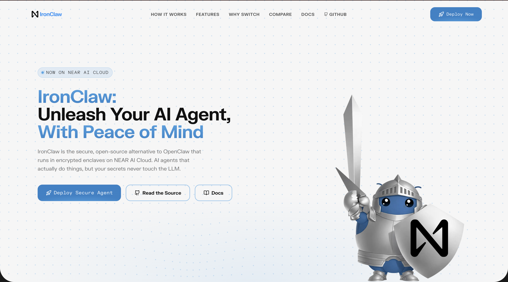
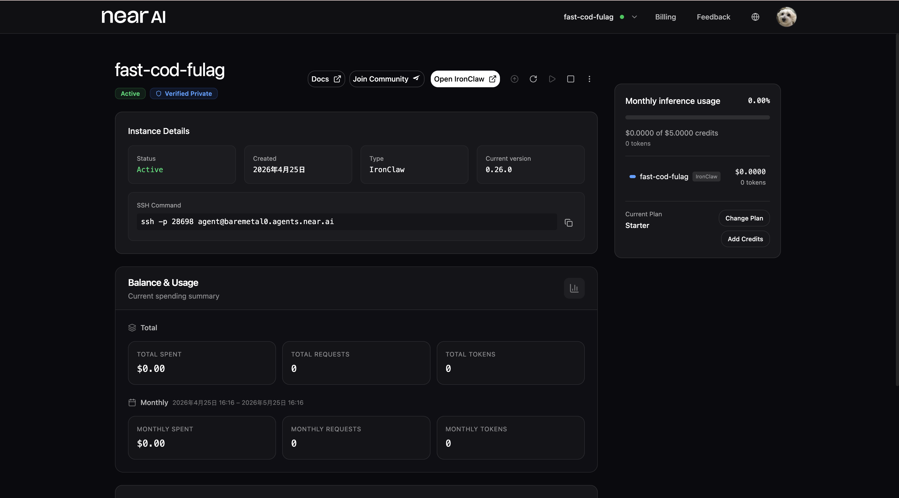
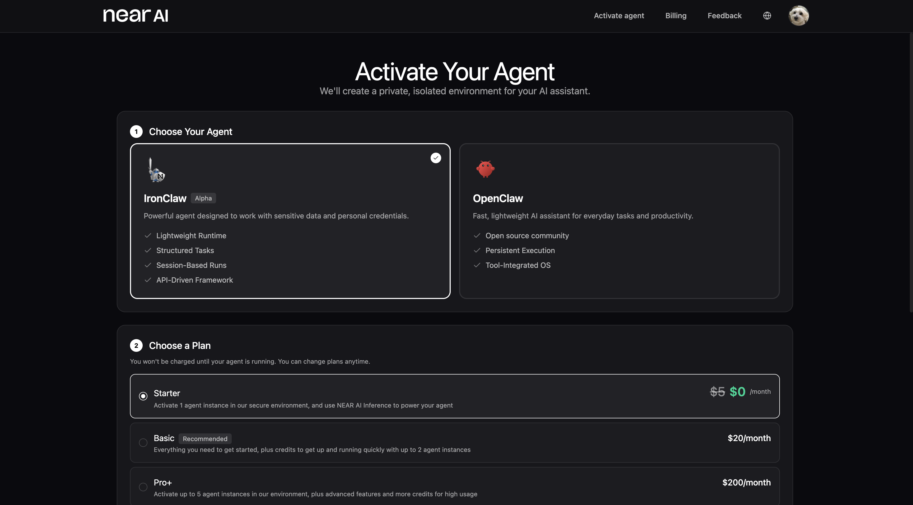
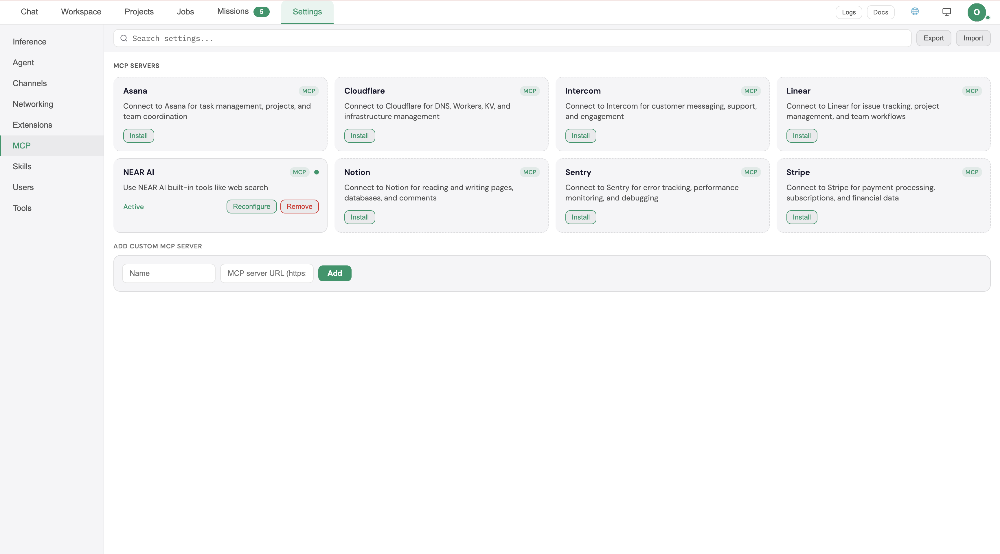
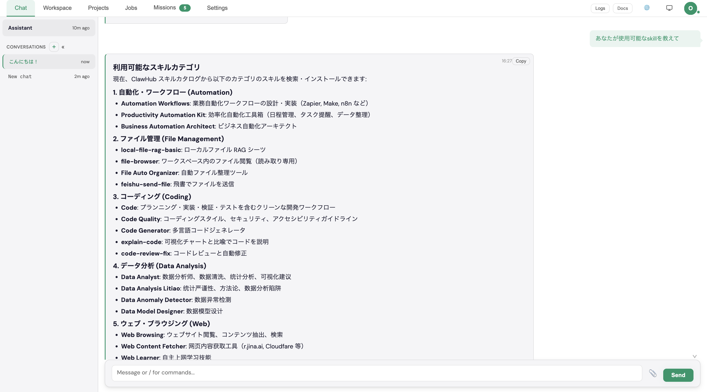
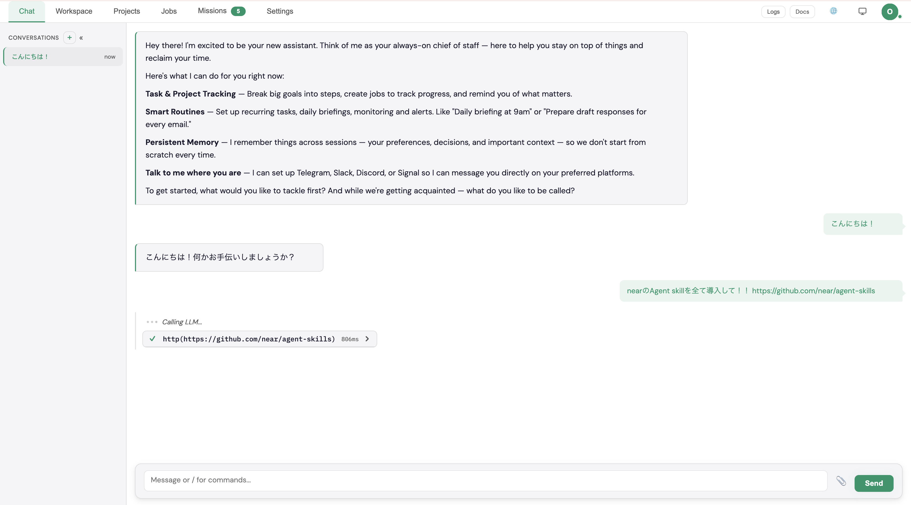
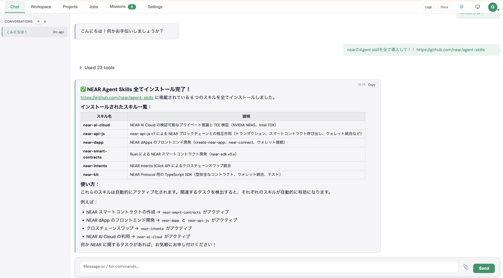
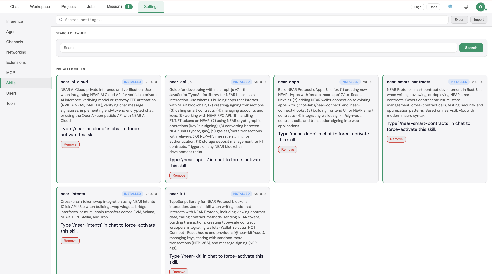
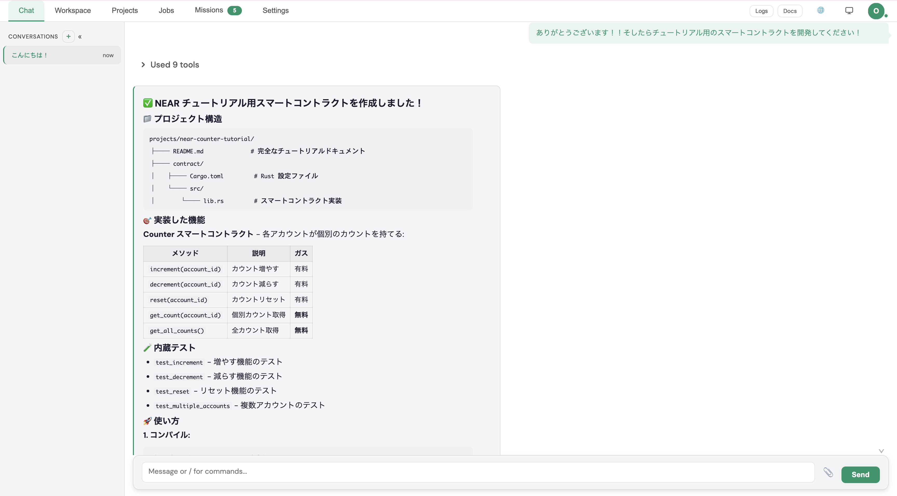
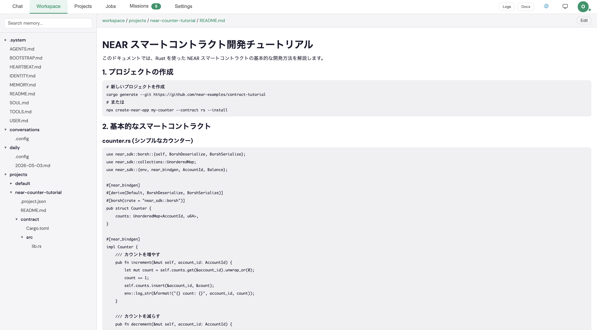

<!-- _class: title -->

# 開発者のためのSovereign AI: IronClaw 深掘り解説
## 〜Rust製のセキュアなOpenClaw〜

Haruki | AWS Community Builder

---

# 本日のゴール

<strong>機密情報やAPIキー</strong>を安全に扱える自律型AIエージェントの概要と構築方法を理解する

---

# 本日のポイント

<strong>深刻な脆弱性:</strong> 既存エージェントから<strong>機密情報が漏洩</strong>する根本原因

<strong>解決策:</strong> IronClawが提示する<strong>多層防御アーキテクチャ</strong>

<strong>究極の安全:</strong> <strong>Rust、WASM、TEE</strong>による鉄壁のガード

<strong>ゼロ・エクスポージャー:</strong> AIに<strong>鍵を見せない</strong>革新的なロジック

<strong>エコシステム:</strong> 自己拡張するツール群と<strong>1クリックデプロイ</strong>

---

# 既存のAIエージェントが抱える「秘密情報漏洩」の罠

### 致命的なリスク
従来のエージェントは<strong>生のAPIキー</strong>を環境変数やプロンプトに保持します。 LLMが巧妙なプロンプト注入で騙されればすべての鍵が盗まれます。

現在のエージェントは「セキュリティ後退型」です。 一時的な利便性のために、開発者の責務である安全性を犠牲にしています。

---

# 既存のAIエージェントが抱える「秘密情報漏洩」の罠

### 放置できない問題
- <strong>ログの露出:</strong> ベクトルDBに機密情報がインデックス化される
- <strong>プロバイダー特権:</strong> クラウド運営者がすべてのデータにアクセス可能
- <strong>プライバシー欠如:</strong> 実行時の思考プロセスが外部に筒抜け

現在のエージェントは「セキュリティ後退型」です。 一時的な利便性のために、開発者の責務である安全性を犠牲にしています。

---

<!-- _class: lead -->

# そこで IronClaw だ！  
## Near AIが開発したRust製のセキュアなAIエージェント

---

---

---
# 「暗号化ボルト」でAPIキーを厳重に保護

### 耐タンパ性
<strong>AES-256-GCM</strong>で保存データを秘匿。たとえ物理的にディスクを奪われても、中身の解読は不可能。

### ハードウェアとの密結合
<strong>Apple Secure Enclave</strong>等の安全な専用チップと連携。

### 痕跡を残さないメモリ管理
使用した秘密情報はメモリ上から<strong>瞬時に完全抹消</strong>。メモリに残る「わずかな痕跡」すら許しません。

 

単に隠すのではなく、<strong>権限のないコードからは物理的にアクセス不可能</strong>な状態を作り出します。

---

# Rust & WASMによる強力なサンドボックス

### 妥協のない安全性と性能
- <strong>Rustエンジン:</strong> nullポインタやバッファオーバーフローを排除。
- <strong>ガベージコレクションなし:</strong> リアルタイムな推論を支える決定論的なパフォーマンス。

---

# Rust & WASMによる強力なサンドボックス

### 厳格なWASM境界
すべてのツールは<strong>WebAssembly</strong>上で動作。
- <strong>ディスクアクセス禁止</strong> (明示的な許可制)
- <strong>ネットワーク制限</strong> (許可リスト方式)
- <strong>実行リソース制限</strong> (無限ループの強制終了)

---

# Near AI Cloudが可能にする堅牢な隔離空間

TEE

- <strong>機密コンピューティング:</strong>  CPUレベルの暗号化。OSや管理者であっても実行内容を覗けません。
- <strong>リモート・アテステーション:</strong>  実行されているコードのハッシュ値を検証し、改ざんがないことを証明。
- <strong>Nearエコシステム:</strong>  分散型の信頼基盤により、中央集権的な監視を排除します。

---

# 4層の多層防御アーキテクチャ

<strong>セーフティ・フィルター:</strong> LLMの出力をリアルタイム監視し、偶発的なデータ漏洩を未然に防ぎます。

<strong>WASMアイソレーション:</strong> カスタムツールを軽量かつ制限された環境で隔離実行します。

<strong>Dockerによる硬化:</strong> 複雑なビルドタスクに対し、クリーンで隔離された実行空間を提供します。

<strong>ホスト側インジェクション:</strong> LLMkからは機密性の高い情報を<strong>完全に見えない状態</strong>に保ちます。

---

# ゼロ・エクスポージャー：AIに鍵を見せない革新

### 従来
LLM:  鍵 `sk-123` を使ってリポジトリ作成
<strong>結果:</strong>  鍵が履歴に残り、漏洩のリスク。 ❌

### IronClaw
1. LLMがツール実行（例: `create_repo`）を要求
2. <strong>ホスト・プロキシ</strong>が要求をインターセプト
3. プロキシが<strong>ボルト</strong>から鍵を安全に取得
4. プロキシがAPI実行し、<strong>結果のみ</strong>をLLMに返す

LLMを「脳」、ホスト・プロキシを「<strong>安全な手</strong>」として役割を完全に分離します。

---

# 既存エージェント vs IronClaw

| セキュリティ機能 | 一般的なPythonエージェント | IronClaw (Near AI) |
| --- | --- | --- |
| <strong>メモリ管理</strong> | ガベージコレクタ (遅延あり) | <strong>所有権モデル (高速・安全)</strong> |
| <strong>ツール隔離</strong> | なし / プロセスレベル | <strong>WASM / TEE (ハードウェア隔離)</strong> |
| <strong>資格情報の扱い</strong> | LLMに直接渡される | <strong>ホスト境界で注入 (非露出)</strong> |
| <strong>プロバイダーの秘匿性</strong> | 運営者が閲覧可能 | <strong>エンドツーエンド暗号化 (TEE)</strong> |
| <strong>スケーラビリティ</strong> | リソース消費大 | <strong>軽量かつ検証可能</strong> |

---

# 自己拡張するエージェント：ツール・メモリ・自動化

### ユニバーサルMCP
<strong>Model Context Protocol</strong>を通じて、あらゆる外部サービスと安全に連携。

### 無限のコンテキスト
高速なローカルキャッシュと<strong>暗号化されたベクトル検索</strong>を組み合わせたハイブリッドメモリ。

### オートパイロット
自律的なジョブスケジューリングと、<strong>自己修復機能</strong>を備えたワークフロー実行。

---

# 1クリックでデプロイ！始め方の4ステップ

### 1. 接続
`agent.near.ai` にアクセスし、セキュアなIDを連携します。

### 2. 設定
「LLMと「スキル」（ツール）を選択します。

### 3. 保護
IronClaw ボルトにシークレットを保存。

### 4. 起動
Near AI Cloudで即座にデプロイ。

---

# Near AIがもたらす「自分専用」の信頼できるAI

### パーソナル守護者
巨大IT企業にデータを渡すことなく、資産や健康状態を管理するエージェント。

### 信頼不要の経済
オンチェーン検証を活用し、ユーザーの代わりに自律的に取引を行うエージェント。

### オープンな標準
「Sovereign（主権）」が特殊機能ではなく、AIの当たり前となる世界へ。

「インフラを所有していないなら、そのAIも所有していないのと同じだ」   Near AI 創設者 (Transformer共著者) Illia Polosukhin

---

# 今日から始めよう！ IronClaw ！！

- <strong>監査可能な透明性:</strong> 最大限の安全性と透明性を確保するために設計されたアーキテクチャ。
- <strong>開発者ファースト:</strong> プライバシーを重視するエンジニアによる、エンジニアのための設計。
- <strong>試す:</strong> <strong>agent.near.ai</strong> で今すぐにデプロイ！

---

---

---

---

---

---

---

---

---

<!-- _class: ending -->

# Thank you!
## Build Secure. Build Sovereign.

[agent.near.ai](https://agent.near.ai) | [github.com/nearai/ironclaw](https://github.com/nearai/ironclaw)

🦞 **IronClaw: Rust製のセキュアなAI エージェント**